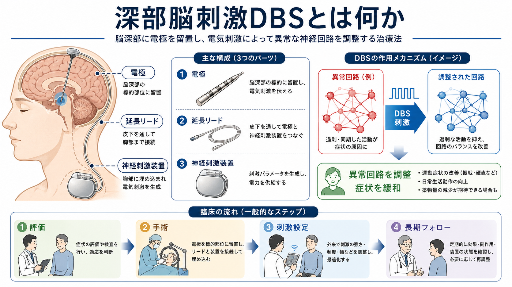
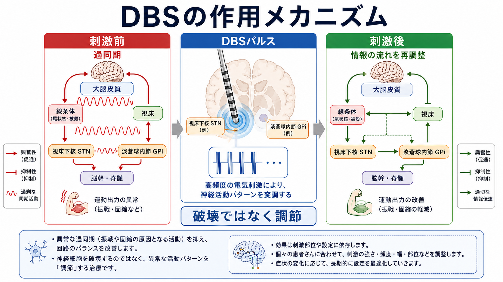
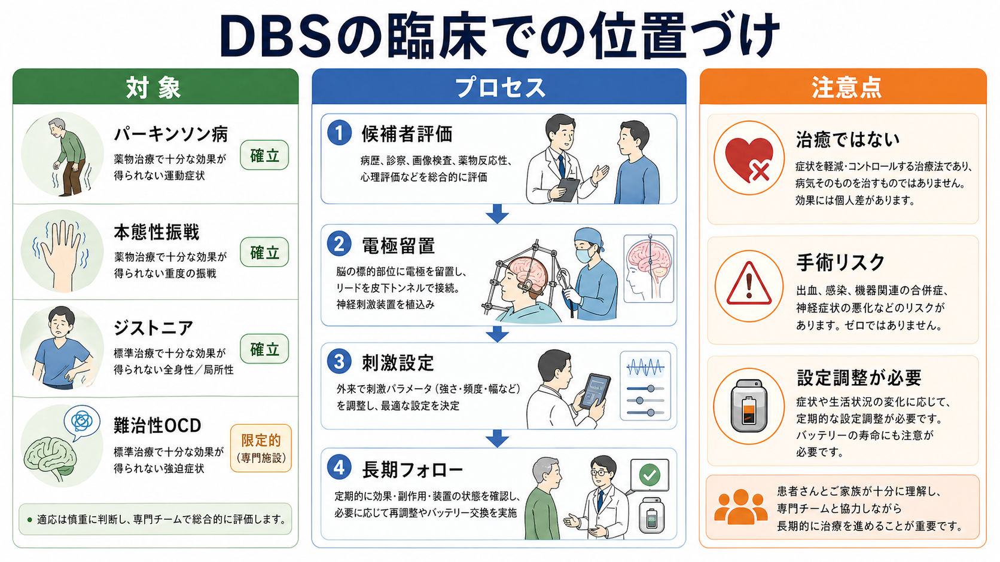

# 深部脳刺激DBSとは何か

## 要点

- 深部脳刺激DBS（deep brain stimulation）は、脳深部の標的部位に電極を置き、体内の神経刺激装置から電気パルスを送って神経回路の活動を調整する治療法である[1][2]。
- 主な臨床応用は、薬物療法だけでは十分に制御できないパーキンソン病、本態性振戦、ジストニアなどの運動障害である[1][3][4]。
- DBSは脳組織を切除する治療ではない。刺激強度、周波数、パルス幅、刺激接点を調整できる「可逆的で調整可能な神経調節」として理解するのが基本である[2][5]。
- 精神疾患では、難治性強迫症に対する限定的な承認・研究応用があるが、標準治療として広く一般化できる段階ではない[6][7]。
- 治療効果は標的、症状、疾患段階、手術精度、刺激調整、リハビリテーション、長期フォローに左右される。個別の診断や治療適応は専門チームで判断される[1][8]。

## この記事で答える問い

1. DBSでは脳のどこに、何を入れるのか。
2. 電気刺激は神経回路にどのように作用すると考えられているのか。
3. どの疾患で臨床的に使われ、どこに限界があるのか。
4. 「脳を操作する」「病気を治す」といった単純な理解のどこが不正確なのか。

## まず結論

DBSは、異常な神経回路を「焼く」「切る」治療ではなく、病的に偏った活動パターンを電気刺激で再調整する治療である。代表的には、パーキンソン病で視床下核（STN）や淡蒼球内節（GPi）を刺激し、振戦、固縮、動作緩慢、薬剤性ジスキネジアなどの運動症状を軽減する[3][4]。ただし、疾患の進行そのものを止めるわけではなく、認知症状、姿勢反射障害、発話・嚥下障害などには限界がある。

この点でDBSは、[[トランスクラニアル磁気刺激TMSは何をしているのか|TMS]]のような非侵襲的刺激法とは異なり、手術によって電極と刺激装置を体内に留置する侵襲的な神経調節である。一方で、刺激条件を後から調整できるため、従来の破壊術よりも細かい個別化が可能である[2][5]。

## 背景

神経疾患や精神疾患の一部では、単一の「悪い部位」ではなく、複数の脳領域を結ぶ回路の活動パターンが症状に関わる。パーキンソン病では、[[大脳基底核ループとは何か|大脳基底核ループ]]と[[視床は単なる中継核なのか|視床]]、運動皮質を結ぶ回路で、過剰な同期活動や異常な発火パターンが運動出力を妨げると考えられている[2][5]。

この回路観は、DBSを理解するうえで重要である。電極が置かれる標的は小さな核や線維束だが、効果はその局所だけに閉じない。刺激は標的近傍の細胞体、軸索、通過線維、下流・上流のネットワークに影響し、[[皮質視床ループは意識や注意にどう関わるのか|皮質-視床系]]や基底核回路の情報の流れを変える[2][5]。

## 基本概念

DBS装置はおおむね三つの要素から成る。第一に、脳深部の標的へ留置される細い電極である。第二に、皮下を通って頭部から胸部へ接続する延長リードである。第三に、胸部などに植え込まれる神経刺激装置、いわばペースメーカーに似たパルス発生器である[1]。

刺激標的は疾患と症状により異なる。パーキンソン病ではSTNやGPi、本態性振戦では視床腹中間核（VIM）、ジストニアではGPiが代表的である[1][3][4]。精神疾患領域では、難治性強迫症に対して内包前脚・腹側線条体などが検討されてきたが、適応は限定的で、研究倫理と長期安全性を含む慎重な判断が必要である[6][7]。

## 仕組み

DBSの作用機序は単純な「興奮」や「抑制」では説明しきれない。高頻度刺激は、局所の発火を変えるだけでなく、軸索を介した下流信号、病的同期、振動活動、神経伝達物質、グリアや局所血流にも影響しうる[2][5]。そのため、同じ標的でも刺激条件や電極接点が少し変わるだけで、効果と副作用の出方が変わる。

臨床的には、刺激の強さ、周波数、パルス幅、どの接点を使うかを外来で調整する。たとえば運動症状が改善しても、刺激が内包や眼球運動系、感覚系に広がると、しびれ、筋収縮、構音障害、気分変化などが生じる場合がある。DBSの本質は、標的に電気を入れること自体ではなく、症状と副作用のバランスを見ながら回路の状態を調整し続けることにある[1][8]。

## 図解

上の1枚目は、DBSの装置構成と治療の流れを示している。重要なのは、電極留置だけで治療が完了するのではなく、評価、手術、刺激設定、長期フォローが一体になっている点である。

2枚目は、DBSの作用を「破壊ではなく調節」として示した図である。過同期した回路活動を、刺激によってより機能的な情報の流れへ近づけるという説明は、現在の回路モデルと整合的だが、すべての効果を一つの機序で説明できるわけではない[2][5]。

## 臨床・研究との接続

パーキンソン病では、ランダム化試験により、適切に選択された患者でDBSが運動症状や生活の質を改善しうることが示されている[3][4]。ただし、これは「すべてのパーキンソン病患者に有効」という意味ではない。一般に、レボドパ反応性がある運動症状、薬効のオン・オフ変動、薬剤性ジスキネジアが問題になる場合に検討されやすい。

本態性振戦やジストニアでもDBSは重要な選択肢である。振戦ではVIM刺激、ジストニアではGPi刺激が代表的で、薬物療法で十分な効果が得られない場合に専門施設で評価される[1]。

精神疾患への応用は、[[DBSは精神疾患治療に応用できるのか]]と密接に関係する。難治性強迫症では、米国で人道的医療機器適用として一部のDBS装置が認められているが、効果量、対象選択、偽刺激対照、長期安全性、同意能力、人格・価値への影響などの論点が残る[6][7]。[[強迫症では皮質線条体視床回路に何が起きているのか|皮質線条体視床回路]]のモデルは標的選択の重要な足場だが、回路モデルだけで個別の治療反応を完全に予測することはできない。

近年は、閉ループDBSや適応型DBSも研究・実装が進んでいる。これは、脳活動や症状に関連する信号を読み取り、必要に応じて刺激を変える考え方である[8]。従来のDBSが「一定の刺激を入れ続ける」方式に近かったのに対し、閉ループDBSは状態依存的な神経調節を目指す。

## よくある誤解

### 誤解1: DBSは脳を破壊する治療である

DBSは電極を留置する手術を伴うが、治療原理は切除や凝固ではない。刺激を止めたり、条件を変更したりできる点が特徴である。ただし、手術そのものには出血、感染、電極位置のずれ、装置関連合併症などのリスクがある[1]。

### 誤解2: 電気刺激を入れれば病気が治る

DBSは症状を軽減・制御する治療であり、病気の根本原因を消す治療ではない。パーキンソン病では運動症状の一部に有効でも、疾患進行に伴う非運動症状や認知機能低下まで一律に改善するわけではない[3][4]。

### 誤解3: 標的が同じなら効果も同じである

同じSTN刺激でも、電極の位置、刺激接点、刺激条件、患者の症状構成、薬物療法との組み合わせにより効果は変わる。DBSは「標的名」だけでなく、回路、症状、調整過程を含めて考える必要がある[2][8]。

### 誤解4: 精神疾患DBSはすでに一般治療である

難治性強迫症などで研究・限定的応用はあるが、多くの精神疾患で標準治療として確立しているわけではない。精神疾患では症状評価、期待値、同意、長期フォロー、社会的支援が特に重要になる[6][7]。

## 関連ノート

- [[深部脳刺激DBSは神経回路をどう調節するのか]]
- [[DBSは精神疾患治療に応用できるのか]]
- [[大脳基底核ループとは何か]]
- [[視床は単なる中継核なのか]]
- [[皮質視床ループは意識や注意にどう関わるのか]]
- [[強迫症では皮質線条体視床回路に何が起きているのか]]
- [[トランスクラニアル磁気刺激TMSは何をしているのか]]
- [[TMSはうつ病治療でどの神経回路を狙っているのか]]

## 理解チェック

1. DBSが「破壊術」ではなく「神経調節」と呼ばれる理由は何か。
2. STN、GPi、VIMは、それぞれどのような症状・疾患で標的になりやすいか。
3. DBSの効果が、電極の局所だけでなく回路全体の変化として理解される理由は何か。
4. 精神疾患に対するDBSを、運動障害へのDBSと同じように語れない理由は何か。

## 関連ノート候補

- 神経調節療法の比較：DBS、TMS、VNS、ECT
- 視床下核STNとは何か
- 淡蒼球内節GPiとは何か
- 閉ループDBSと適応型神経刺激
- パーキンソン病の運動合併症

## MOC更新候補

- `content/00_MOC/` 配下に臨床実践・治療、神経調節、神経科学系MOCがある場合、本記事へのリンクを追加する。
- 並列記事生成との衝突を避けるため、このジョブではMOC本体は更新しない。

## 未解決問題

- DBSの効果を予測する個別化バイオマーカーは、疾患や標的ごとにまだ十分確立していない。
- 精神疾患DBSでは、症状評価、人格・価値への影響、長期フォロー、偽刺激対照試験の設計が引き続き課題である。
- 閉ループDBSでは、どの信号を「症状状態」の代理指標として使うべきか、どの制御則が安全で有効かが重要な研究課題である。

## 参考文献

[1] National Institute of Neurological Disorders and Stroke. *Deep Brain Stimulation for Movement Disorders*. https://www.ninds.nih.gov/health-information/treatments/deep-brain-stimulation-movement-disorders

[2] Lozano, A. M., Lipsman, N., Bergman, H., et al. (2019). Deep brain stimulation: current challenges and future directions. *Nature Reviews Neurology*, 15, 148-160. https://doi.org/10.1038/s41582-018-0128-2

[3] Deuschl, G., Schade-Brittinger, C., Krack, P., et al. (2006). A randomized trial of deep-brain stimulation for Parkinson's disease. *New England Journal of Medicine*, 355(9), 896-908. https://doi.org/10.1056/NEJMoa060281

[4] Weaver, F. M., Follett, K., Stern, M., et al. (2009). Bilateral deep brain stimulation vs best medical therapy for patients with advanced Parkinson disease: a randomized controlled trial. *JAMA*, 301(1), 63-73. https://doi.org/10.1001/jama.2008.929

[5] Chiken, S., & Nambu, A. (2016). Mechanism of deep brain stimulation: inhibition, excitation, or disruption? *The Neuroscientist*, 22(3), 313-322. https://doi.org/10.1177/1073858415581986

[6] U.S. Food and Drug Administration. *Humanitarian Device Exemption (HDE): Reclaim DBS Therapy for OCD*. https://www.accessdata.fda.gov/scripts/cdrh/cfdocs/cfhde/hde.cfm?id=H050003

[7] Menchón, J. M., Real, E., Alonso, P., et al. (2019). A prospective international multi-center study on safety and efficacy of deep brain stimulation for resistant obsessive-compulsive disorder. *Molecular Psychiatry*, 26, 1234-1247. https://doi.org/10.1038/s41380-019-0562-6

[8] Little, S., Tripoliti, E., Beudel, M., et al. (2016). Adaptive deep brain stimulation for Parkinson's disease demonstrates reduced speech side effects compared to conventional stimulation in the acute setting. *Journal of Neurology, Neurosurgery & Psychiatry*, 87(12), 1388-1389. https://doi.org/10.1136/jnnp-2016-313518
