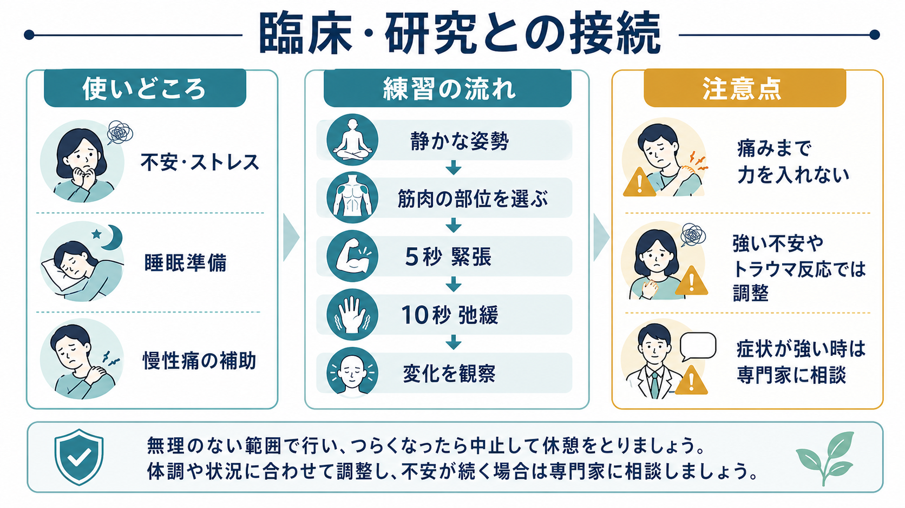
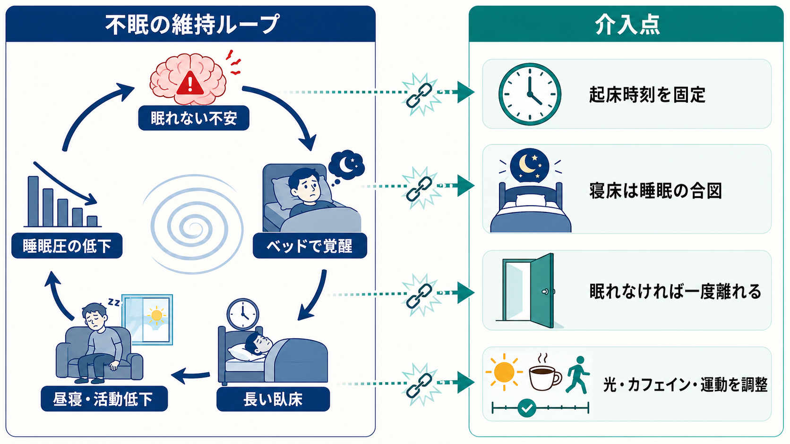
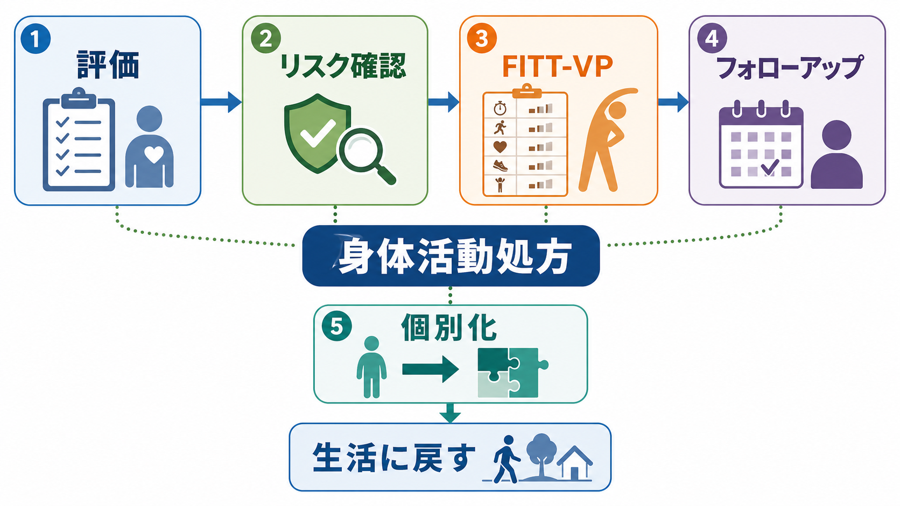

# 漸進的筋弛緩法とは何か

## 要点

- 漸進的筋弛緩法（progressive muscle relaxation; PMR）は、身体の各部位の筋肉を意図的に軽く緊張させ、その後に力を抜くことで、緊張と弛緩の感覚差を学ぶリラクセーション法である[1]。
- 目的は「筋力を鍛える」ことではなく、身体的緊張に気づき、過剰な覚醒を下げやすい状態を作ることである。NCCIH は、リラクセーション反応を呼吸の遅さ、血圧低下、心拍低下などを特徴とするストレス反応の反対側の反応として説明している[2]。
- 成人のストレス、不安、抑うつ、睡眠の困難に対して有望な研究結果がある一方、対象者、手順、比較条件がばらつくため、万能な治療法としてではなく補助的な技法として読む必要がある[3][4]。
- 不眠症では [[不眠症の認知行動療法CBT-Iとは何か]] が初期治療の中心であり、PMR はその一部または補助技法として位置づけるのが実践的である[5]。
- 痛み、外傷歴、強いパニック反応、身体感覚への過度な集中がある人では、緊張を強める手順が合わないこともある。教育・研究目的の技法であり、個別の診断や治療指示の代替ではない[1][2]。

## この記事で答える問い

1. 漸進的筋弛緩法は、どのような手順で身体的緊張を下げようとするのか。
2. 「筋肉を緊張させる」ことが、なぜリラクセーションにつながりうるのか。
3. 不安、睡眠、痛み、精神医療の中で、どのように位置づければよいのか。
4. どのような誤解や注意点があるのか。

## まず結論

漸進的筋弛緩法は、身体を「ゆるめよう」と直接命令する技法ではない。むしろ、いったん筋肉を軽く緊張させ、その直後に力を抜くことで、緊張している状態と弛緩している状態の違いを感覚として学ぶ方法である[1]。この差がわかるようになると、日常生活の中で肩、顎、手、腹部、脚などに余分な力が入っていることに気づきやすくなる。

臨床的には、PMR は単独で疾患を治す介入というより、[[認知行動療法CBTとは何か]]、[[不眠症の認知行動療法CBT-Iとは何か]]、[[ヨガや呼吸法は精神医療でどう使われるのか]]、心理教育、疼痛マネジメント、ストレス対処の中に組み込まれることが多い。研究では、成人のストレス・不安・抑うつに対する系統的レビューで改善傾向が報告されており、睡眠に関する RCT メタ解析でも睡眠の主観的指標や不安の改善が示されている[3][4]。ただし、効果量のばらつきや研究の異質性は大きく、個々の症状や背景に応じて調整する必要がある。

## 背景

PMR は、Edmund Jacobson が20世紀前半に発展させたリラクセーション法である。VA Whole Health Library は、Jacobson が1938年に *Progressive Relaxation* を出版し、14の筋群を交互に緊張・弛緩させる方法を詳述したと説明している[1]。古典的には、筋活動の低下と心理的緊張の低下を結びつけて考える、身体から入るリラクセーション技法として位置づけられる。

現代の精神医療では、ストレス、不安、睡眠障害、疼痛、身体症状への対処などで、身体的覚醒を下げるための技法が使われる。PMR はその中でも、特別な機器を必要とせず、比較的短時間で教えられる点に特徴がある[1][2]。一方で、簡単に見えることと、どの人にも同じ効果が出ることは同じではない。身体感覚への注意が不安を高める人、筋緊張が痛みを誘発する人、トラウマ反応が強く出る人では、呼吸法、マインドフルネス、接地法、心理療法との組み合わせを含めて調整する。

## 基本概念

### 緊張と弛緩の対比

PMR の核は「緊張」と「弛緩」の対比である。たとえば、手を軽く握って数秒保ち、その後に一気に力を抜く。すると、握っている時の圧、熱、硬さ、ふるえ、力を抜いた後の重さ、広がり、温かさなどの差がわかりやすくなる。この差を、手、腕、肩、顔、首、胸、腹部、背中、脚などへ順に広げていく[1]。

重要なのは、強く力を入れることではない。VA の臨床向け解説では、過度に力を入れず、少しの緊張で十分であり、痛みやけいれん、不快感があれば弱める、止める、またはその部位を飛ばすことが勧められている[1]。したがって PMR は、忍耐や根性で身体を押し切る訓練ではなく、身体からのフィードバックを細かく読む練習である。

### 身体感覚への注意

PMR は、筋肉だけでなく注意の向け方も変える。緊張と弛緩の差を観察することで、注意は反すうや心配から、現在の身体感覚へ移りやすくなる。これは [[身体と感情はどのようにつながるのか]]、[[感情は身体感覚の予測なのか]]、[[体性感覚ネットワークは身体情報をどう表現するのか]] とも接続できる。PMR は、身体感覚を消す技法ではなく、身体感覚を安全に識別し直す技法として理解するとわかりやすい。

### リラクセーション反応

NCCIH は、リラクセーション技法の目標を、身体の自然なリラクセーション反応を意識的に生じさせることとして説明している[2]。PMR では、筋弛緩、ゆっくりした呼吸、注意の安定が重なり、過剰な覚醒や身体的緊張が下がりやすくなる。これは、[[ノルアドレナリンは覚醒とストレスにどう関わるのか]]、[[自律神経ネットワークは内臓状態をどう制御するのか]]、[[ノルアドレナリン系は不安と覚醒にどう関わるのか]] で扱う覚醒調整とも関係する。

## 仕組み

### 1. 筋緊張の検出精度を上げる

緊張している人ほど、自分が緊張していることに気づいていない場合がある。PMR は、緊張した状態を短く作ってから弛緩するため、差分が明確になる。この差分学習によって、肩をすくめている、顎を噛みしめている、腹部に力が入っている、足指を丸めているといった日常の微細な緊張に気づきやすくなる[1]。

### 2. 呼吸と運動を同期させる

PMR では、筋肉を緊張させるときに息を止めないことが重要である。VA の解説では、緊張時に吸い、弛緩時に吐くような呼吸との同期が紹介されている[1]。息を止めると、かえって身体が警戒状態になり、胸部や頸部の緊張が増えることがある。呼吸を伴う PMR は、[[ヨガや呼吸法は精神医療でどう使われるのか]] と同じく、身体運動と自律神経調整をつなぐ技法として理解できる。

### 3. 覚醒水準を下げる

ストレス時には、筋緊張、心拍、呼吸、警戒、注意の固定が互いに増幅しやすい。PMR は筋緊張からこのループへ介入する。NCCIH は、リラクセーション反応をストレス反応の反対側にあるものとして整理しており、呼吸、心拍、血圧などの身体指標と関連づけている[2]。ただし、PMR は自律神経を機械的に操作する技法ではない。効果は練習歴、症状、身体疾患、環境、安全感、指導の質に左右される。

## 図解

PMR は、次のような流れで整理できる。

| 段階 | 何をするか | 何を観察するか | 注意点 |
|---|---|---|---|
| 準備 | 座位または臥位で、邪魔されにくい姿勢を作る | 呼吸、姿勢、痛みの有無 | 眠気やふらつきが強い場面では無理に行わない |
| 緊張 | 1つの筋群に軽く力を入れる | 硬さ、圧、熱、ふるえ | 痛みが出るほど力を入れない |
| 弛緩 | 力を抜き、吐く息とともに変化を観察する | 重さ、温かさ、広がり、脱力 | 「完全にゆるめる」ことを焦らない |
| 移動 | 別の筋群へ移る | 部位ごとの差 | 苦手な部位は飛ばしてよい |
| 統合 | 全身の緊張度を確認する | 残った緊張 | 必要なら一部だけ繰り返す |

古典的には多くの筋群を順に扱うが、実践では短縮版も使われる。たとえば、手、肩、顔、腹部、脚だけを扱う方法や、就寝前に肩と顎だけを確認する方法がある。短縮する場合も、基本は「緊張を作る、力を抜く、差を観察する」である。

## 臨床・研究との接続

### 不安・ストレス

成人を対象にした2024年の系統的レビューでは、46件、16か国、3,402人超を含む研究が整理され、PMR は成人のストレス、不安、抑うつの低減に有効な可能性が示された[3]。また、リラクセーション訓練全般に関するメタ解析では、不安に対する改善が一貫して示された一方、研究デザインや介入内容のばらつきも問題になる[6]。

不安症では、PMR は [[不安症群とは何か]]、[[全般不安症とは何か]]、[[社交不安症とは何か]]、[[パニック症のCBTでは何を行うのか]] の治療全体の中で、身体的覚醒への対処として使われることがある。ただし、曝露や認知再構成、行動実験、生活調整を置き換えるものではない。2018年のメタ解析では、不安症に対する認知行動療法とリラクセーション療法の比較が検討され、疾患群によって結果が異なること、PTSD や強迫症では CBT がより適する可能性があることが示唆されている[7]。

### 睡眠

PMR は就寝前の過覚醒を下げる技法として使われることがある。2026年の睡眠に関する RCT メタ解析では、31試験、2,277人を含み、PMR は睡眠の主観的指標、不安、生活の質を改善する方向の結果を示した[4]。一方で、研究間の異質性は高く、臨床群、練習期間、比較条件によって効果の読み方は変わる。

慢性不眠症の臨床実践では、ACP ガイドラインが成人の慢性不眠症に対して [[不眠症の認知行動療法CBT-Iとは何か]] を初期治療として推奨している[5]。PMR は CBT-I のリラクセーション要素として使われうるが、睡眠制限、刺激制御、睡眠衛生、認知的介入を含む包括的治療の代替ではない。

### 疼痛・身体症状

慢性疼痛では、筋緊張、警戒、回避、睡眠障害、不安が互いに影響する。ACP の慢性腰痛ガイドラインでは、慢性腰痛の初期対応として複数の非薬物療法が挙げられ、その中に漸進的リラクセーションも含まれる[8]。ただし、これは「痛みを筋肉の緊張だけで説明する」という意味ではない。[[慢性疼痛と精神疾患はどう関係するのか]]、[[疼痛と精神疾患は脳内でどうつながるのか]]、[[疼痛症状は精神科でどう評価するか]] と接続し、痛みの生物・心理・社会的要因の一部として位置づける必要がある。

### 身体療法・神経調節との関係

このディレクトリには [[tDCSとは何か]]、[[tACSとは何か]]、[[反復経頭蓋磁気刺激rTMSとは何か]]、[[迷走神経刺激療法VNSとは何か]]、[[光療法とは何か]]、[[睡眠覚醒リズム療法とは何か]] などが置かれている。PMR は電気刺激や磁気刺激のように外部から神経活動を直接変調する方法ではないが、身体感覚、呼吸、注意、覚醒水準を介して状態調整に関わる。その意味で、広い意味の身体療法・自己調整技法として整理できる。

## よくある誤解

### 誤解1: 力を強く入れるほど効果が高い

PMR は筋トレではない。力を強く入れすぎると、痛み、けいれん、疲労、頭痛、息止めを招き、かえって緊張が増えることがある[1]。目的は、最大収縮ではなく、緊張と弛緩の差を安全に感じ取ることである。

### 誤解2: 眠れない時は必ず PMR をすればよい

PMR は睡眠準備に役立つ場合があるが、慢性不眠症の中心治療は CBT-I である[5]。眠れないまま長時間ベッドで PMR を続けると、ベッドと覚醒が結びつくこともある。睡眠の問題では、起床時刻、昼寝、カフェイン、光曝露、夜間のスマートフォン、睡眠薬、併存疾患を含めて評価する必要がある。

### 誤解3: 不安が強いほど身体感覚に集中すべきである

身体感覚への注意は、不安を下げることもあれば、逆に強めることもある。NCCIH は、リラクセーション技法は一般に安全としつつも、まれに不安の増加、侵入思考、コントロール喪失への恐怖などが報告されると説明している[2]。[[急性ストレス障害とは何か]]、[[トラウマ焦点化認知行動療法とは何か]]、[[EMDRとは何か]] と関係する臨床では、身体感覚への接近を段階的に設計する。

### 誤解4: PMR は心理療法や薬物療法の代わりになる

PMR は補助技法であり、重いうつ、不安症、PTSD、疼痛、睡眠障害、身体疾患の治療全体を置き換えるものではない。[[心理療法と薬物療法はどう組み合わせるのか]]、[[精神科薬物療法とは何か]]、[[心理療法の適応はどう判断するのか]] と同じく、症状の重さ、リスク、本人の希望、利用可能な支援を踏まえて組み合わせる。

## 関連ノート

既存ノートとして接続しやすい項目:

- [[ヨガや呼吸法は精神医療でどう使われるのか]]
- [[マインドフルネスストレス低減法MBSRとは何か]]
- [[不眠症の認知行動療法CBT-Iとは何か]]
- [[認知行動療法CBTとは何か]]
- [[不安症群とは何か]]
- [[全般不安症とは何か]]
- [[パニック症のCBTでは何を行うのか]]
- [[慢性疼痛と精神疾患はどう関係するのか]]
- [[身体と感情はどのようにつながるのか]]
- [[自律神経ネットワークは内臓状態をどう制御するのか]]
- [[睡眠覚醒リズム療法とは何か]]
- [[光療法とは何か]]

関連ノート候補:

- リラクセーション法とは何か
- 身体志向心理療法とは何か
- 筋緊張と不安はどう関係するのか
- 呼吸法と自律神経はどう関係するのか

MOC 更新候補:

- `content/00_MOC/` 配下の臨床実践、心理療法、身体療法、睡眠、不安、疼痛関連 MOC
- 並列ジョブとの衝突を避けるため、本記事では MOC 本体は更新しない。

## 理解チェック

1. PMR が「筋肉を鍛える方法」ではなく「緊張と弛緩の差を学ぶ方法」と言える理由は何か。
2. PMR で息を止めないことが重要なのはなぜか。
3. 不眠症において、PMR と CBT-I はどのような関係にあるか。
4. 身体感覚への注意が不安を強める可能性があるのはどのような場面か。
5. 慢性疼痛に PMR を使う時、痛みを「筋肉の問題だけ」と見なしてはいけない理由は何か。

## 未解決問題

- PMR の効果を左右する要因、たとえば練習頻度、音声ガイドの有無、対面指導、併存症、身体感覚への感受性をどう層別化するか。
- 不安症、慢性疼痛、不眠症、がん、呼吸器疾患などで、PMR 単独と多成分介入をどのように比較するか。
- ウェアラブル指標、心拍変動、筋電図、睡眠指標を用いて、主観的リラクセーションと生理的変化の対応をどう評価するか。
- トラウマ関連症状やパニック症状をもつ人に、能動的な筋緊張を含む技法をどこまで安全に導入できるか。

## 参考文献

[1] U.S. Department of Veterans Affairs. Progressive Muscle Relaxation. *Whole Health Library*. https://www.va.gov/WHOLEHEALTHLIBRARY/tools/progressive-muscle-relaxation.asp

[2] National Center for Complementary and Integrative Health. Relaxation Techniques: What You Need To Know. https://www.nccih.nih.gov/health/relaxation-techniques-what-you-need-to-know

[3] Muhammad Khir S, Wan Mohd Yunus WMA, Mahmud N, Wang R, Panatik SA, Sukor MS, Nordin NA. Efficacy of Progressive Muscle Relaxation in Adults for Stress, Anxiety, and Depression: A Systematic Review. *Psychology Research and Behavior Management*. 2024;17:345-365. https://doi.org/10.2147/PRBM.S437277

[4] Donato KO, Falcão L, Nishizima A, Oliveira AS, Gonzalez JV, Ribeiro NN, et al. Progressive muscle relaxation technique improves sleep quality and mental health: A systematic review and meta-analysis of randomized controlled trials. *Journal of Psychosomatic Research*. 2026;203:112563. https://doi.org/10.1016/j.jpsychores.2026.112563

[5] Qaseem A, Kansagara D, Forciea MA, Cooke M, Denberg TD; Clinical Guidelines Committee of the American College of Physicians. Management of Chronic Insomnia Disorder in Adults: A Clinical Practice Guideline From the American College of Physicians. *Annals of Internal Medicine*. 2016;165(2):125-133. https://doi.org/10.7326/M15-2175

[6] Manzoni GM, Pagnini F, Castelnuovo G, Molinari E. Relaxation training for anxiety: a ten-years systematic review with meta-analysis. *BMC Psychiatry*. 2008;8:41. https://doi.org/10.1186/1471-244X-8-41

[7] Montero-Marin J, Garcia-Campayo J, López-Montoyo A, Zabaleta-Del-Olmo E, Cuijpers P. Is cognitive-behavioural therapy more effective than relaxation therapy in the treatment of anxiety disorders? A meta-analysis. *Psychological Medicine*. 2018;48(9):1427-1436. https://doi.org/10.1017/S0033291717003099

[8] Qaseem A, Wilt TJ, McLean RM, Forciea MA; Clinical Guidelines Committee of the American College of Physicians. Noninvasive Treatments for Acute, Subacute, and Chronic Low Back Pain: A Clinical Practice Guideline From the American College of Physicians. *Annals of Internal Medicine*. 2017;166(7):514-530. https://doi.org/10.7326/M16-2367
