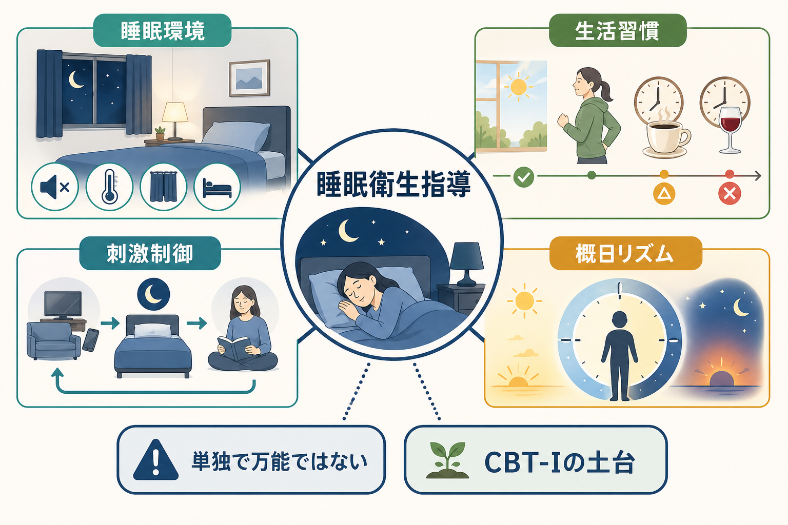
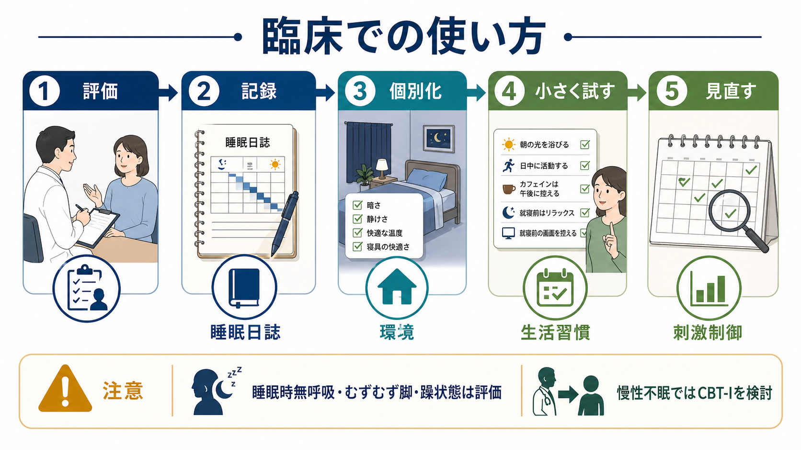

# 睡眠衛生指導とは何か

## 要点

- 睡眠衛生指導は、寝室環境、光、カフェイン・アルコール、運動、食事、昼寝、就寝前行動、寝床の使い方を整え、睡眠を妨げる条件を減らす心理教育的介入である。
- 慢性の[[不眠障害とは何か]]では、睡眠衛生だけを単独治療にするより、[[不眠症の認知行動療法CBT-Iとは何か]]の一部として、刺激制御、睡眠制限、認知的介入、リラクゼーションなどと組み合わせる方が推奨される[1][2]。
- 刺激制御は「寝床=眠る場所」という学習を回復する介入であり、睡眠衛生指導の中でも臨床的に重要な成分である[1][6]。
- 指導は一般論の配布ではなく、睡眠日誌、生活リズム、併存疾患、薬剤、勤務形態、育児・介護、身体疾患を見ながら個別化する。
- 本稿は教育・研究目的の概説であり、個別の診断や治療指示ではない。強い眠気、いびき・無呼吸、躁状態、むずむず脚、痛み、薬剤影響、自殺リスクがある場合は専門的評価が必要である。

## この記事で答える問い

1. 睡眠衛生指導は、単なる「早寝早起きの助言」と何が違うのか。
2. 睡眠環境、生活習慣、刺激制御は、どのように[[不眠とは何か]]の維持ループに関わるのか。
3. 慢性不眠では、睡眠衛生指導をどこまで主介入として扱えるのか。
4. 臨床で安全に使うために、何を評価してから指導するべきか。

## まず結論

睡眠衛生指導とは、眠りやすい条件を整えるための「生活環境の処方」である。内容は、寝室を暗く静かで快適な温度にする、起床時刻をそろえる、朝の光を浴びる、日中に活動する、夕方以降のカフェインや就寝前の飲酒・重い食事を避ける、就寝前の明るい画面や強い覚醒活動を減らす、といった実践を含む[7][8]。

ただし、慢性不眠の中心病態は「知識不足」だけではない。寝床で長時間眠れずに過ごす、昼寝や活動低下で睡眠圧が下がる、眠れないことへの不安が高まる、寝室や寝床が覚醒の手がかりになる、という学習と悪循環が関わる[5][6]。そのため AASM の成人慢性不眠ガイドラインは、多成分 CBT-I を強く推奨し、睡眠衛生を単独介入として用いることは条件付きで推奨しないとしている[1]。

したがって実践上は、睡眠衛生指導を「入口」として用い、睡眠日誌で問題を特定し、刺激制御やCBT-Iに接続するのがよい。軽い一過性の睡眠不調、生活リズムの乱れ、患者教育、治療計画の共通言語づくりには有用だが、長引く不眠ではそれだけで完結させない。

## 背景

睡眠問題は精神科・心療内科・プライマリケアで頻繁にみられる。睡眠は気分、注意、記憶、疼痛、代謝、免疫、対人機能と結びつくため、[[精神科診察で睡眠をどう評価するか]]では、睡眠時間だけでなく、入眠困難、中途覚醒、早朝覚醒、熟眠感、日中機能、睡眠薬・嗜好品、生活リズム、身体疾患を分けて評価する必要がある。

睡眠衛生という考え方は、「睡眠を邪魔する行動・環境因子を減らし、睡眠を支える手がかりを増やす」ための臨床的な枠組みである。NIH/NHLBI は、一定の就寝・起床時刻、就寝前の静かな時間、寝室の暗さ・静けさ・涼しさ、カフェイン・ニコチン・アルコール・重い食事の調整、日中活動、屋外光への曝露などを健康な睡眠習慣として挙げている[7]。CDC も同様に、規則性、寝室環境、電子機器、カフェイン・アルコール・食事、日中の身体活動を睡眠衛生の要素として示している[8]。

一方で、不眠が慢性化している場合、患者はすでに「眠るために努力する」ほど覚醒していることがある。この場合、助言を増やすだけでは「守れない自分」「眠らなければならない」という圧力を強めることがある。睡眠衛生指導は、叱責や生活態度の評価ではなく、現在の睡眠を維持している条件を一緒に観察し、変えられる変数を小さく試す作業として扱う。

## 基本概念

### 睡眠環境

睡眠環境は、寝室の明るさ、音、温度、寝具、同居者、ペット、スマートフォン、仕事道具、夜間の安全性などを含む。基本は「暗い・静か・快適な温度・安心して横になれる」状態を作ることだが、完全な理想環境を求めすぎる必要はない[7][8]。不眠が強い人では、寝室を整えること自体が儀式化して緊張を高める場合もあるため、「睡眠を少し邪魔している要素を一つ減らす」程度から始める。

### 生活習慣

生活習慣では、起床時刻、朝の光、日中活動、運動、昼寝、カフェイン、ニコチン、アルコール、夕食の量と時刻、就寝前の画面・仕事・学習・対人ストレスを扱う。カフェインは人によって感受性が違うが、NHLBI は効果が最大8時間続きうると説明しており、夕方以降の摂取は入眠を妨げやすい[7]。飲酒は寝つきをよくするように見えても、睡眠後半の中途覚醒や睡眠の質の低下を招きうるため、睡眠薬代わりに扱わない。

### 刺激制御

刺激制御は、寝床・寝室が「眠れない場所」「考え込む場所」「スマホを見る場所」になっている状態を修正する行動療法である。代表的には、眠気が来てから寝床に入る、寝床を睡眠と性生活以外に使わない、眠れないまま長く寝床に留まらず一度離れる、毎朝ほぼ同じ時刻に起きる、過度な昼寝を避ける、といった方針を用いる[1][6]。

睡眠衛生指導と刺激制御は重なるが、同じではない。睡眠衛生は「睡眠を妨げる因子を減らす」教育であり、刺激制御は「寝床と睡眠の結びつきを再学習する」介入である。慢性不眠では、刺激制御の方がより直接に維持因子へ働く。

### CBT-Iとの関係

CBT-I は、睡眠衛生、刺激制御、睡眠制限、認知的介入、リラクゼーションなどを組み合わせる多成分介入である。ACP は成人の慢性不眠に対してCBT-Iを初期治療として推奨し、薬物治療はCBT-Iだけで不十分な場合に利益・害・費用を共有意思決定で検討するとしている[3]。AASM も多成分CBT-Iを強く推奨し、睡眠衛生単独は慢性不眠の治療として十分ではないと整理している[1]。

## 仕組み

### 不眠の維持ループを弱める

不眠が続くと、眠れない不安、長い臥床、昼寝、活動低下、寝床でのスマートフォン使用、夕方以降のカフェイン、夜間の時計確認が重なりやすい。これらは短期的には「眠れなかった分を取り戻す」対処に見えるが、長期的には睡眠圧を弱め、寝床での覚醒を学習させ、翌日の活動を減らし、さらに夜の睡眠を浅くする[5][6]。

睡眠衛生指導は、このループの外側から条件を整える。刺激制御は、ループの中心にある「寝床で覚醒する」学習へ直接介入する。たとえば、眠れないまま寝床に長く留まる時間を減らすと、寝床が覚醒・焦り・反芻の手がかりになることを弱められる。

### 睡眠圧と概日リズムを整える

睡眠は大きく、起きている時間に応じて高まる睡眠圧と、体内時計に基づく[[睡眠覚醒リズム療法とは何か]]に支えられる。朝の光、日中活動、食事時刻、運動、起床時刻は概日リズムの手がかりになる。夜の強い光や画面、深夜の活動、休日の大幅な寝だめは、この手がかりを乱しやすい[7][8]。

ここで重要なのは、就寝時刻を無理に早めることではなく、まず起床時刻と朝の光を安定させることである。眠気が来ないのに早く寝床に入ると、寝床で覚醒する時間が増える。これは不眠を長引かせることがある。

### 覚醒水準を下げる

就寝前の仕事、対人葛藤、SNS、ニュース、ゲーム、明るい画面、激しい運動は、交感神経系や認知的覚醒を高めることがある。睡眠衛生指導では、就寝前の1時間を「眠る努力」ではなく「覚醒を下げる時間」として設計する。読書、入浴、軽いストレッチ、呼吸法、静かな音楽などは人によって合うが、効果の有無は睡眠日誌で確認する。

## 図解

| 観点 | 具体例 | 狙い | 注意点 |
|---|---|---|---|
| 環境 | 暗さ、静けさ、温度、寝具、スマホを寝床から離す | 睡眠を妨げる刺激を減らす | 完璧な寝室づくりにこだわりすぎない |
| リズム | 起床時刻をそろえる、朝の光を浴びる | 概日リズムを安定させる | 就寝時刻だけを先に固定しない |
| 睡眠圧 | 日中活動、昼寝を短く早めにする | 夜の眠気を作る | 高齢者や身体疾患では安全に調整する |
| 嗜好品 | カフェイン、ニコチン、アルコールを調整 | 入眠・中途覚醒の妨害を減らす | 離脱や依存があれば段階的に扱う |
| 刺激制御 | 寝床は睡眠の合図、眠れなければ一度離れる | 寝床と覚醒の結びつきを弱める | 転倒リスク、寒暖差、安全確保に注意する |
| 評価 | 睡眠日誌、日中機能、併存症、薬剤確認 | 指導を個別化する | 睡眠時無呼吸、むずむず脚、躁状態を見逃さない |

## 臨床・研究との接続

### 軽症・一過性の睡眠不調

生活イベント、試験、勤務変化、育児、介護、旅行、画面時間の増加などに伴う短期的な睡眠不調では、睡眠衛生指導だけで改善のきっかけになることがある。まず睡眠日誌を1-2週間つけ、起床時刻、昼寝、カフェイン、飲酒、運動、画面時間、日中眠気を観察する。

### 慢性不眠

3か月以上続く不眠、日中機能障害、寝床での強い覚醒、不眠への恐怖がある場合は、睡眠衛生指導だけで粘らない。AASM の2021年ガイドラインでは、多成分CBT-Iが強く推奨され、刺激制御、睡眠制限、リラクゼーションは単一成分としても条件付き推奨されている一方、睡眠衛生単独は条件付きで推奨されない[1]。2025年の系統的レビュー・メタ解析でも、睡眠衛生教育は不眠への効果が検討されているが、臨床では単独万能とみなさず、より構造化された介入との接続を考える必要がある[4]。

### 併存疾患・鑑別

不眠の背後には、[[睡眠障害とは何か]]、[[むずむず脚症候群とは何か]]、睡眠時無呼吸、概日リズム睡眠覚醒障害、痛み、甲状腺疾患、呼吸器疾患、薬剤性不眠、アルコール・カフェイン・ニコチン、うつ病、不安症、PTSD、躁状態がある。特に双極性障害では睡眠短縮が再発サインになることがあり、単純な睡眠衛生指導だけでなく気分状態の評価が必要である。

### 薬物療法との関係

睡眠衛生指導は[[非ベンゾジアゼピン系睡眠薬とは何か]]や[[オレキシン受容体拮抗薬とは何か]]の代替ではなく、併用される基盤である。薬物療法を用いる場合でも、カフェイン、飲酒、昼寝、寝床での覚醒、起床時刻の乱れをそのままにすると、薬だけで問題を抱え込む形になりやすい。ACP は、慢性不眠でCBT-Iだけでは不十分な場合に、薬物の利益・害・費用を共有意思決定で検討するとしている[3]。

## よくある誤解

### 「早く寝れば治る」

不眠では、眠気がないまま早く寝床に入るほど、寝床で覚醒している時間が増えることがある。まず固定しやすいのは就寝時刻ではなく起床時刻であり、眠気、睡眠日誌、日中機能を見ながら調整する。

### 「寝酒は睡眠衛生としてよい」

飲酒は入眠を早めるように感じられることがあるが、睡眠の後半を浅くし、中途覚醒を増やし、依存や転倒リスクにもつながる。睡眠衛生指導では、寝酒を睡眠薬代わりにしないことを確認する[7][8]。

### 「眠れない時も寝床で我慢するべき」

慢性不眠では、寝床で長く我慢するほど、寝床が覚醒や焦りの手がかりになりやすい。刺激制御では、眠れない状態が続くときはいったん寝床を離れ、眠気が戻ってから戻る方針をとる[6]。ただし高齢者、転倒リスク、鎮静薬使用、夜間せん妄リスクがある場合は、安全な動線や代替策を先に考える。

### 「睡眠衛生指導は説教である」

睡眠衛生指導は生活態度の評価ではない。臨床では、患者がすでに努力していることを前提に、睡眠日誌から「変えると効果が出そうで、実行可能で、安全な一点」を選ぶ。実行困難なら、意志の弱さではなく、環境、勤務、家庭、症状、薬剤、身体疾患、社会資源の問題として再評価する。

## 関連ノート

既存ノートとして、次の項目と接続しやすい。

- [[不眠とは何か]]
- [[不眠障害とは何か]]
- [[睡眠障害とは何か]]
- [[不眠症の認知行動療法CBT-Iとは何か]]
- [[精神科診察で睡眠をどう評価するか]]
- [[睡眠覚醒リズム療法とは何か]]
- [[光療法とは何か]]
- [[むずむず脚症候群とは何か]]
- [[非ベンゾジアゼピン系睡眠薬とは何か]]
- [[オレキシン受容体拮抗薬とは何か]]

今後の作成候補:

- 刺激制御療法とは何か
- 睡眠日誌とは何か
- 睡眠制限療法とは何か
- 寝酒と不眠の関係とは何か

MOC更新候補:

- `content/00_MOC/` 配下の睡眠、不眠、臨床実践、心理教育、身体療法に関するMOC

## 理解チェック

1. 睡眠衛生指導が、慢性不眠の単独治療としては不十分になりやすい理由は何か。
2. 「寝床で長く横になっていれば眠れるはず」という対処が、不眠を維持することがあるのはなぜか。
3. 起床時刻、朝の光、昼寝、カフェイン、飲酒のうち、本人が最も小さく変えられる点はどれか。
4. 睡眠衛生指導の前に、睡眠時無呼吸、むずむず脚、躁状態、薬剤影響を確認する理由は何か。

## 参考文献

[1] Edinger, J. D., Arnedt, J. T., Bertisch, S. M., Carney, C. E., Harrington, J. J., Lichstein, K. L., Sateia, M. J., Troxel, W. M., Zhou, E. S., Kazmi, U., Heald, J. L., & Martin, J. L. (2021). Behavioral and psychological treatments for chronic insomnia disorder in adults: An American Academy of Sleep Medicine clinical practice guideline. *Journal of Clinical Sleep Medicine, 17*(2), 255-262. https://doi.org/10.5664/jcsm.8986

[2] Edinger, J. D., Arnedt, J. T., Bertisch, S. M., Carney, C. E., Harrington, J. J., Lichstein, K. L., Sateia, M. J., Troxel, W. M., Zhou, E. S., Kazmi, U., Heald, J. L., & Martin, J. L. (2021). Behavioral and psychological treatments for chronic insomnia disorder in adults: An American Academy of Sleep Medicine systematic review, meta-analysis, and GRADE assessment. *Journal of Clinical Sleep Medicine, 17*(2), 263-298. https://doi.org/10.5664/jcsm.8988

[3] Qaseem, A., Kansagara, D., Forciea, M. A., Cooke, M., Denberg, T. D., & Clinical Guidelines Committee of the American College of Physicians. (2016). Management of chronic insomnia disorder in adults: A clinical practice guideline from the American College of Physicians. *Annals of Internal Medicine, 165*(2), 125-133. https://doi.org/10.7326/M15-2175

[4] Ruan, J. Y., Liu, Q., Chung, K. F., Ho, K. Y., & Yeung, W. F. (2025). Effects of sleep hygiene education for insomnia: A systematic review and meta-analysis. *Sleep Medicine Reviews, 82*, 102109. https://doi.org/10.1016/j.smrv.2025.102109

[5] Morin, C. M., Bootzin, R. R., Buysse, D. J., Edinger, J. D., Espie, C. A., & Lichstein, K. L. (2006). Psychological and behavioral treatment of insomnia: Update of the recent evidence (1998-2004). *Sleep, 29*(11), 1398-1414. https://doi.org/10.1093/sleep/29.11.1398

[6] Stanford Health Care. (n.d.). Stimulus control and CBTI. https://stanfordhealthcare.org/medical-treatments/c/cognitive-behavioral-therapy-insomnia/procedures/stimulus-control.html

[7] National Heart, Lung, and Blood Institute. (2022). Sleep deprivation and deficiency: Healthy sleep habits. https://www.nhlbi.nih.gov/health/sleep-deprivation/healthy-sleep-habits

[8] Centers for Disease Control and Prevention. (2016). Tips for better sleep. https://medbox.iiab.me/modules/en-cdc/www.cdc.gov/sleep/about_sleep/sleep_hygiene.html

