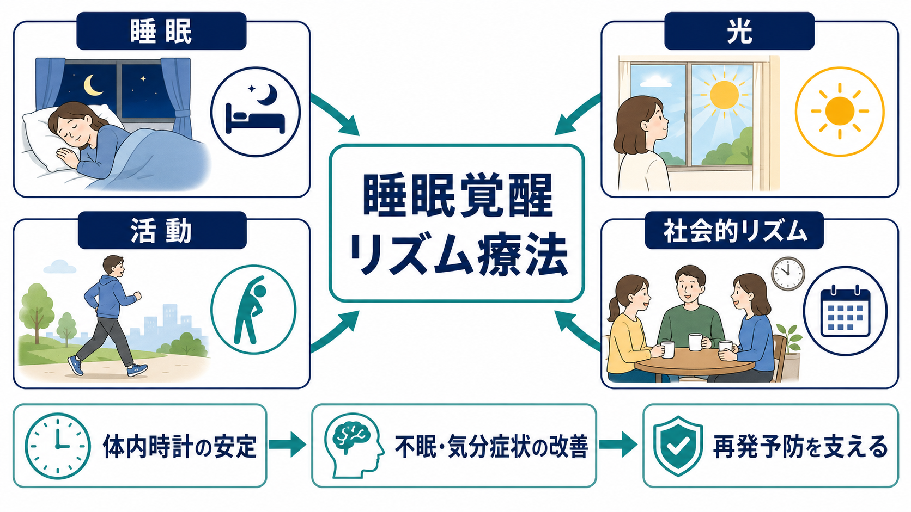
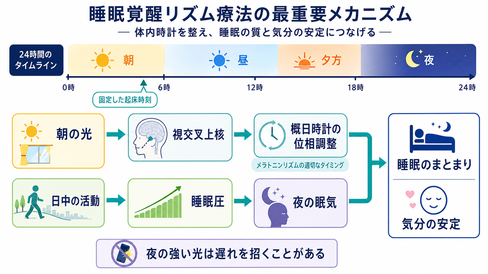
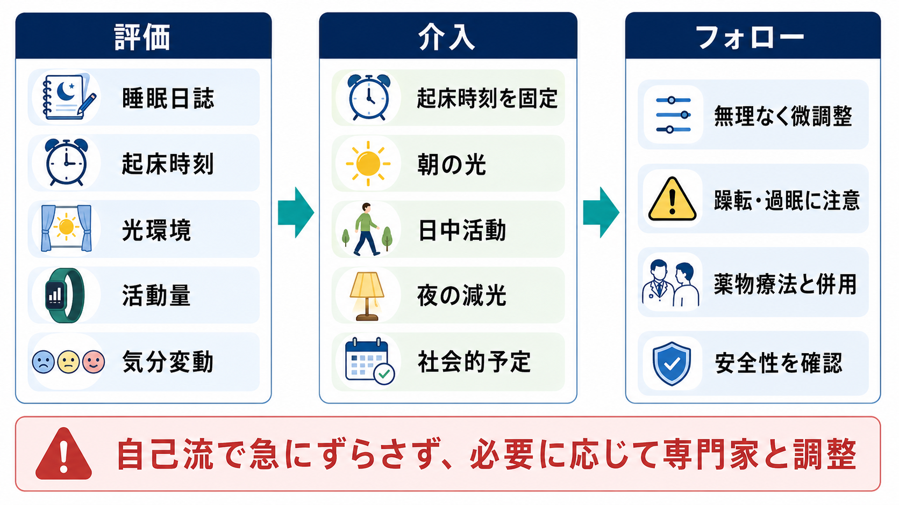

# 睡眠覚醒リズム療法とは何か

## 要点

- 睡眠覚醒リズム療法は、睡眠時間だけでなく、起床時刻、光曝露、日中活動、食事や対人予定などの「時間の手がかり」を整える介入の総称として理解できる。
- 中核にあるのは、体内時計の位相、睡眠圧、社会的リズムを安定させ、[[不眠障害とは何か]]や気分症状の悪循環を弱めるという考え方である[1][2]。
- 双極性障害では、対人関係療法に社会的リズムの安定化を組み合わせた interpersonal and social rhythm therapy: IPSRT が代表的で、薬物療法の補助として再発予防や機能改善を狙う[3][4]。
- 光療法、睡眠相調整、睡眠遮断療法などを含むクロノセラピーは有望だが、対象疾患・タイミング・躁転リスク・安全管理によって適応が大きく変わる[1][5][6]。
- 本稿は教育・研究目的の概説であり、個別の診断、照度・時間の処方、薬物調整、治療開始の指示ではない。

## この記事で答える問い

1. 睡眠覚醒リズム療法は、睡眠衛生や睡眠薬と何が違うのか。
2. 光、活動、社会的予定は、なぜ睡眠と気分に影響するのか。
3. 不眠、概日リズム睡眠覚醒障害、双極性障害の臨床で、どのように位置づけられるのか。
4. よくある誤解と安全上の注意点は何か。

## まず結論

睡眠覚醒リズム療法とは、「眠れない夜だけを直す」方法ではなく、24時間の生活リズムを治療対象にする発想である。具体的には、起床時刻を安定させる、朝の光を使う、夜の強い光を減らす、日中に活動する、食事・仕事・対人接触の時刻をそろえる、睡眠日誌で変化を追う、といった要素を組み合わせる。

ただし、単一の標準化された治療名というより、複数の介入群をまたぐ臨床的な整理語である。慢性不眠では[[不眠症の認知行動療法CBT-Iとは何か]]が第一選択として推奨され、概日リズム睡眠覚醒障害では光やメラトニンのタイミングが問題になり、双極性障害では[[双極性障害とは何か]]の再発予防として社会的リズムの安定化が重視される[1][2][3]。

## 背景

睡眠と気分は、互いに原因にも結果にもなる。睡眠不足は情動制御を悪化させ、抑うつや躁状態では睡眠時間、起床時刻、活動量、対人接触が乱れやすい。精神科診療で睡眠を確認する理由は、単に「睡眠時間を聞く」ためではなく、リズムの乱れが症状、生活機能、再発リスクの手がかりになるからである。関連して、[[精神科診察で睡眠をどう評価するか]]では、睡眠の量、質、タイミング、日中機能を分けて見ることが重要になる。

概日リズム睡眠覚醒障害の診療ガイドラインでは、遅発睡眠覚醒相障害、前進睡眠覚醒相障害、非24時間睡眠覚醒リズム障害、不規則睡眠覚醒リズム障害などに対して、光療法やメラトニンを「いつ」用いるかが検討されている[1]。慢性不眠の診療ガイドラインでは、成人の慢性不眠に対して認知行動療法を初期治療として推奨しており、睡眠覚醒リズムの調整もこの行動的介入の一部として位置づけられる[2]。

気分障害の領域では、IPSRT が重要である。IPSRT は、対人関係のストレスと、睡眠・食事・活動・対人接触の時刻の乱れが気分エピソードを誘発しうるという「社会的 zeitgeber 仮説」を背景にしている[3][4]。ここで zeitgeber とは、光や社会的予定のように体内時計を同調させる外的手がかりを指す。

## 基本概念

### 睡眠衛生との違い

睡眠衛生指導は、カフェイン、寝室環境、寝る前の行動など、睡眠を妨げる要因を減らす助言である。睡眠覚醒リズム療法はそれより広く、起床・光・活動・食事・社会的予定の時刻を、体内時計の同調手がかりとして扱う。つまり「寝る前に何を避けるか」だけでなく、「朝から夜までの時間構造をどう作るか」を扱う。

### CBT-Iとの違い

CBT-I は慢性不眠に対する構造化された心理療法で、刺激制御、睡眠制限、認知再構成、リラクセーション、睡眠衛生などを含む[2]。睡眠覚醒リズム療法は、CBT-I の中に含まれることもあれば、概日リズム障害や気分障害に対して、光療法・活動調整・社会的リズム安定化を前面に出すこともある。

### クロノセラピーとの関係

クロノセラピーは、光療法、睡眠相前進、睡眠遮断、メラトニン、社会的リズム調整など、時間生物学に基づく治療群を指す広い概念である。睡眠覚醒リズム療法は、その中でも日常生活の時間構造を整える実践的な部分に焦点を当てたものと考えると理解しやすい[5][6]。

## 仕組み

### 1. 光が体内時計を動かす

網膜から入る光情報は視交叉上核に伝わり、睡眠覚醒、体温、メラトニン分泌などの概日リズムを調整する。一般に、朝の光は睡眠相を前進させやすく、夜の強い光は睡眠相を遅らせやすい。ただし、効果は個人の現在の睡眠相、光の強さ、時間帯、既往歴によって変わる[1][7]。

### 2. 日中活動が睡眠圧を作る

日中に覚醒して活動するほど、夜に眠りやすくなる方向の睡眠圧が蓄積する。活動量が少ない、昼寝が長い、起床時刻が遅れる、夜間に強い光を浴びる、といった要因が重なると、夜の眠気が弱まり、翌日の起床がさらに遅れる悪循環が起こりやすい。

### 3. 社会的リズムが気分の足場になる

食事、通勤・通学、服薬、対人接触、運動、仕事の開始時刻は、光ほど強くはないとしても、毎日のリズムを固定する手がかりになる。IPSRT では、これらを Social Rhythm Metric などで記録し、気分変動とリズムのずれを一緒に検討する[3][4]。双極性障害では、睡眠短縮や生活リズムの乱れが躁・軽躁のサインになることがあるため、社会的リズムの安定化は再発予防の文脈で特に重要である。

## 図解

睡眠覚醒リズム療法は、次の4要素を同時に見ると整理しやすい。

| 要素 | 介入の例 | 主な狙い | 注意点 |
|---|---|---|---|
| 睡眠 | 起床時刻をそろえる、睡眠日誌をつける | 睡眠相と日中機能を把握する | 寝床時間を急に削りすぎない |
| 光 | 朝の光、夜の減光 | 体内時計の位相を調整する | 双極性障害では躁転や混合状態に注意する |
| 活動 | 日中活動、運動、昼寝の調整 | 睡眠圧と生活機能を回復する | 身体疾患や疲労を無視しない |
| 社会的リズム | 食事・予定・服薬・対人接触の時刻を安定させる | 気分の予測可能性を高める | 完璧主義的に固定しすぎない |

## 臨床・研究との接続

### 不眠への接続

慢性不眠では、まず不眠の持続要因を評価し、CBT-I を中心に検討することが多い[2]。睡眠覚醒リズム療法の観点からは、「何時間眠れたか」だけでなく、起床時刻のばらつき、昼寝、夜間の光、寝床で過ごす時間、日中活動の低下を確認する。睡眠日誌を用いると、本人の主観的な不眠感と、実際の睡眠機会や起床時刻のずれを分けて見やすい。

### 概日リズム睡眠覚醒障害への接続

[[概日リズム睡眠覚醒障害とは何か]]では、問題は睡眠の量だけでなく、社会生活に必要な時刻と体内時計の時刻がずれる点にある。AASM のガイドラインは、対象病型や年齢層によって、タイミングを調整したメラトニンや[[光療法とは何か]]を検討している[1]。したがって、自己判断で「明るい光を浴びればよい」と単純化するのではなく、睡眠相の方向、生活上の目標、併存疾患を見て組み立てる必要がある。

### 双極性障害・うつ病への接続

双極性障害では、IPSRT が薬物療法に併用される心理社会的介入として研究されてきた。Frank らの2年追跡RCTでは、急性期に IPSRT を受けた群で社会的リズムの規則性が高まり、その規則性の改善が維持期の再発リスク低下と関連した[3]。一方、若年者を対象としたRCTでは、IPSRT と専門的支持療法の間で主要アウトカムに明確な差が出なかった報告もあり、効果は対象集団、比較条件、併用治療に左右される[4]。

うつ病に対する睡眠遮断療法は、短期的な抗うつ効果が報告されてきたが、回復睡眠後の再燃や安全性、長期効果の不確実性がある[5]。光療法も気分障害への応用があるが、特に双極性障害では躁転、混合状態、睡眠短縮を監視しながら慎重に使う必要がある[6]。

## よくある誤解

### 「早寝すれば治る」

睡眠覚醒リズム療法で重視されるのは、しばしば就寝時刻よりも起床時刻である。眠気がないまま早く寝床に入ると、寝床で覚醒している時間が増え、不眠の条件づけを強めることがある。慢性不眠では、この点が CBT-I の刺激制御や睡眠制限と関係する[2]。

### 「光は多いほどよい」

光の効果は時間帯に依存する。朝の光が有用な場合がある一方、夜間の強い光は睡眠相を遅らせる方向に働きうる[1][7]。また、双極性障害では光療法の導入時に躁・軽躁症状、睡眠短縮、焦燥を観察する必要がある[6]。

### 「生活リズムを固定できない人は意志が弱い」

生活リズムは、勤務、育児、疼痛、薬剤、経済状況、対人ストレス、発達特性、気分症状に左右される。リズム調整は道徳的な訓練ではなく、環境条件と症状の相互作用をほどく臨床的作業である。

### 「薬物療法の代わりになる」

睡眠覚醒リズム療法は、薬物療法の代替ではなく、併用されることが多い。特に双極性障害、重症うつ病、自殺リスク、精神病症状、著しい過眠・不眠がある場合には、治療全体の安全管理の中で検討する。

## 関連ノート

既存ノートとして、次の項目と接続しやすい。

- [[不眠障害とは何か]]
- [[不眠症の認知行動療法CBT-Iとは何か]]
- [[双極性障害とは何か]]
- [[精神科診察で睡眠をどう評価するか]]
- [[概日リズム睡眠覚醒障害とは何か]]
- [[光療法とは何か]]

今後の作成・接続候補:

- [[クロノセラピーとは何か]]
- [[社会的リズム療法とは何か]]

MOC 更新候補:

- `content/00_MOC/` 配下の臨床実践、睡眠、気分障害、身体療法・神経調節に関する MOC

## 理解チェック

1. 睡眠覚醒リズム療法が「睡眠時間」だけでなく「起床時刻・光・活動・社会的予定」を扱うのはなぜか。
2. 朝の光と夜の強い光は、概日リズムに同じ方向の効果をもつだろうか。
3. 双極性障害でリズム調整を行うとき、なぜ躁転や睡眠短縮を観察する必要があるのか。
4. 慢性不眠で、眠気がないのに早く寝床に入ることにはどのような問題がありうるか。

## 参考文献

[1] Auger, R. R., Burgess, H. J., Emens, J. S., Deriy, L. V., Thomas, S. M., & Sharkey, K. M. (2015). Clinical practice guideline for the treatment of intrinsic circadian rhythm sleep-wake disorders: An update for 2015. *Journal of Clinical Sleep Medicine, 11*(10), 1199-1236. https://doi.org/10.5664/jcsm.5100

[2] Qaseem, A., Kansagara, D., Forciea, M. A., Cooke, M., Denberg, T. D., & Clinical Guidelines Committee of the American College of Physicians. (2016). Management of chronic insomnia disorder in adults: A clinical practice guideline from the American College of Physicians. *Annals of Internal Medicine, 165*(2), 125-133. https://doi.org/10.7326/M15-2175

[3] Frank, E., Kupfer, D. J., Thase, M. E., Mallinger, A. G., Swartz, H. A., Fagiolini, A. M., Grochocinski, V., Houck, P., Scott, J., Thompson, W., & Monk, T. (2005). Two-year outcomes for interpersonal and social rhythm therapy in individuals with bipolar I disorder. *Archives of General Psychiatry, 62*(9), 996-1004. https://doi.org/10.1001/archpsyc.62.9.996

[4] Frank, E., Swartz, H. A., & Boland, E. (2007). Interpersonal and social rhythm therapy: An intervention addressing rhythm dysregulation in bipolar disorder. *Dialogues in Clinical Neuroscience, 9*(3), 325-332. https://doi.org/10.31887/DCNS.2007.9.3/efrank

[5] Mitter, P. M., De Crescenzo, F., Loo Yong Kee, K., Xia, J., Roberts, S., Chi, W., Kurtulmus, A., Kyle, S. D., Geddes, J. R., & Cipriani, A. (2022). Sleep deprivation as a treatment for major depressive episodes: A systematic review and meta-analysis. *Sleep Medicine Reviews, 64*, 101647. https://doi.org/10.1016/j.smrv.2022.101647

[6] Geoffroy, P. A., Palagini, L., Henriksen, T. E. G., Bourgin, P., Garbazza, C., Gronfier, C., Esaki, Y., Fernandez, D. C., Lam, R. W., Lee, H. J., Lejoyeux, M., Maruani, J., Martiny, K., Murray, G., Riemersma-Van Der Lek, R. F., Ritter, P., Schulte, P. F. J., Smith, D. J., Terman, M., Zeitzer, J. M., & Sit, D. K. (2025). Light therapy for bipolar disorders: Clinical recommendations from the International Society for Bipolar Disorders Chronobiology and Chronotherapy Task Force. *Dialogues in Clinical Neuroscience, 27*(1), 249-264. https://doi.org/10.1080/19585969.2025.2533806

[7] Abbott, S. M., Reid, K. J., & Zee, P. C. (2015). Circadian rhythm sleep-wake disorders. *Psychiatric Clinics of North America, 38*(4), 805-823. https://doi.org/10.1016/j.psc.2015.07.012
