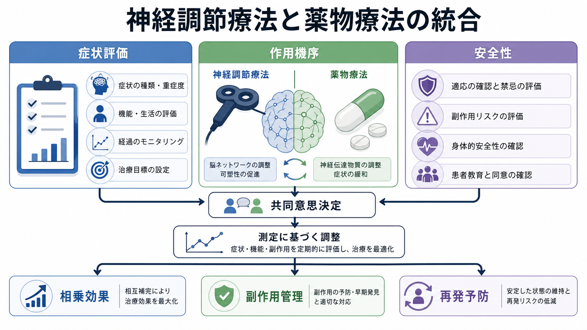
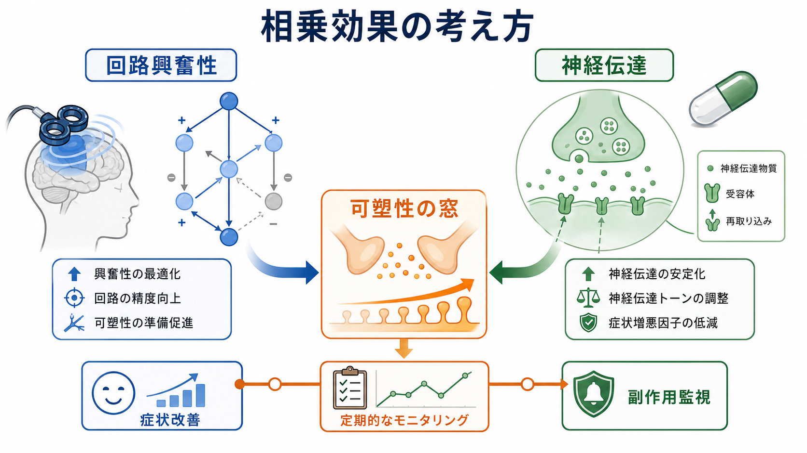
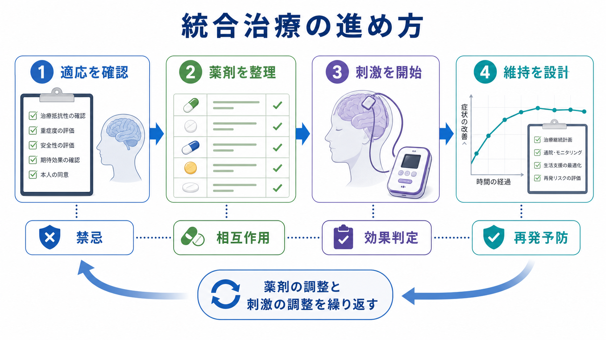

# 神経調節療法と薬物療法はどう組み合わせるか

## 要点

- 神経調節療法は、薬物療法を「置き換える」治療というより、回路興奮性、可塑性、再発予防、忍容性の問題を補う選択肢として考える。
- rTMS は薬剤併用の有無にかかわらず実施されうるが、薬剤変更時には運動閾値やけいれんリスクを再評価する必要がある[3][4]。
- ECT 後は再発が多いため、急性期の改善だけで終わらせず、継続薬物療法、継続 ECT、生活支援を含めた維持設計が重要になる[5][8]。
- tDCS では抗うつ薬との併用が有望とするメタ解析がある一方、効果量や適応の不確実性は残る[6]。
- 医療・精神医学に関する本稿は教育・研究目的の整理であり、個別の診断や治療指示ではない。

## この記事で答える問い

1. 神経調節療法と薬物療法は、どのような発想で併用するのか。
2. 相乗効果が期待できる場面と、過剰治療になりやすい場面はどこか。
3. 副作用、薬剤相互作用、けいれんリスク、認知機能リスクをどう整理するか。
4. 治療抵抗性うつ病や再発予防では、どのような順序で考えるか。

## まず結論

統合治療の中心は、「どちらが強い治療か」ではなく、「現在の患者の困りごとに対して、どの機序を、どのリスクで、どの期間使うか」を決めることにある。薬物療法は神経伝達、睡眠、焦燥、不安、精神病症状、再発予防に働きやすく、神経調節療法は脳回路の興奮性、ネットワーク活動、可塑性の条件づけに働きかける。両者を組み合わせるときは、急性期の症状軽減、部分反応の押し上げ、薬剤副作用による限界の補完、維持期の再発予防を分けて設計する。

うつ病では、CANMAT 2023 や VA/DoD 2022 のようなガイドラインが、薬物療法、心理療法、生活療法、神経調節療法を段階的かつ個別化して用いる視点を示している[1][2]。そのため、統合治療は「薬を増やしながら刺激も足す」という単純な足し算ではない。治療抵抗性、重症度、自殺リスク、精神病症状、躁転リスク、身体疾患、薬剤忍容性、本人の価値観を同時に評価する作業である。

## 背景

精神科治療では、薬物療法だけで十分な改善が得られない、あるいは副作用のため十分量を使えない状況が少なくない。治療抵抗性うつ病では、抗うつ薬を複数試しても反応が不十分なことがあり、rTMS、ECT、tDCS、VNS などの神経調節療法が検討される。既存ノートでは [[反復経頭蓋磁気刺激rTMSとは何か]]、[[修正型ECTとは何か]]、[[tDCSとは何か]]、[[迷走神経刺激療法VNSとは何か]] を個別に整理している。

ただし、神経調節療法は単一の治療群ではない。rTMS は外来で反復的に皮質を刺激する非侵襲的治療であり、ECT は全身麻酔下でけいれん発作を誘発する強力な治療である。tDCS は弱い直流電流で興奮性を偏らせる研究・臨床応用領域であり、VNS は慢性・治療抵抗性の病態で長期的調整を狙う装置治療として検討されてきた[3][6][7]。したがって、薬物療法との組み合わせ方も治療ごとに異なる。

## 基本概念

### 併用

併用とは、薬物療法を継続しながら神経調節療法を開始する、または神経調節療法の後に維持薬物療法を組み込むことである。rTMS では、抗うつ薬や他の向精神薬の併用下でも実施されることがあり、Clinical TMS Society の勧告は、併用薬の有無にかかわらず TMS を実施しうるとする一方、薬剤変更時の再評価を求めている[3]。

### 増強

増強とは、既存の薬物療法に部分反応があるが十分ではないとき、神経調節療法を追加して改善幅を広げる発想である。tDCS のメタ解析では、tDCS 単独よりも薬物療法、とくに SSRI との併用でうつ症状スコアと反応率が改善したという結果が報告されている[6]。ただし、これはすべての神経調節療法に一般化できる結論ではない。

### 維持

維持とは、急性期に改善した後、再発を防ぐために薬物療法、継続・維持刺激、心理社会的支援を組み合わせる段階である。ECT 後の再発予防研究では、継続薬物療法がプラセボより再発を減らす一方、それでも再発リスクは残ることが示されている[5]。CORE 研究でも、継続 ECT とリチウム・ノルトリプチリン併用薬物療法はいずれも一定の役割を持つが、どちらも万能ではなかった[8]。

## 仕組み

薬物療法は、神経伝達物質、受容体感受性、睡眠覚醒、焦燥、不安、精神病症状などに作用する。一方、神経調節療法は、刺激パラメータ、標的部位、治療回数、脳状態に応じて、皮質興奮性やネットワーク活動を変化させる。両者の統合は、次の三つの水準で考えるとわかりやすい。

第一に、症状水準での補完である。抗うつ薬で気分や不安が一部改善しても、意欲、認知、身体化、睡眠、反芻が残ることがある。神経調節療法は、この残存症状が関わる前頭辺縁系ネットワークの調整を狙う選択肢になる。

第二に、可塑性水準での相乗効果である。刺激によって回路が変化しやすい状態を作り、薬物療法や心理社会的介入がその変化を維持しやすくする、という仮説である。これは魅力的な説明だが、臨床的には「相乗効果が確立している」と言い切るより、治療反応、機能、睡眠、副作用を測定しながら検証する姿勢が必要である[1][6]。

第三に、安全性水準での調整である。TMS ではけいれん閾値に影響しうる薬剤、睡眠不足、アルコール、神経疾患などを確認する。TMS 安全性ガイドラインは、対象者スクリーニング、刺激条件、けいれん時対応、訓練、倫理・規制上の配慮を重視している[4]。ECT では麻酔、循環器リスク、認知機能、併用薬の調整が中心になる。詳しくは [[rTMSの安全性と副作用は何か]]、[[ECTの副作用には何があるのか]] も参照。

## 図解

統合治療は、次のような反復サイクルとして考える。

| 段階 | 主な問い | 薬物療法側の確認 | 神経調節療法側の確認 |
|---|---|---|---|
| 適応確認 | なぜ今追加するのか | 十分な用量・期間、忍容性、躁転リスク | 適応、禁忌、重症度、緊急性 |
| 薬剤整理 | 刺激前に何を調整するか | ベンゾジアゼピン、抗けいれん薬、リチウム、抗精神病薬など | 運動閾値、けいれんリスク、麻酔リスク |
| 実施中評価 | 何が改善しているか | 副作用、眠気、焦燥、アカシジア | 頭痛、認知、刺激部位痛、治療反応 |
| 維持設計 | 改善後に何を残すか | 再発予防薬、減薬計画、TDM | 継続刺激、再導入条件、通院可能性 |

## 臨床・研究との接続

### rTMS と薬物療法

rTMS は、抗うつ薬への不十分反応や忍容性不良がある成人うつ病で検討される。Clinical TMS Society は、左前頭前野への反復 TMS が治療抵抗性うつ病の急性期治療として有効かつ安全であり、薬物療法の併用下でも実施されうると整理している[3]。ただし、薬剤変更があった場合は運動閾値の再測定を考える。これは、刺激強度が個人の皮質興奮性に依存するためである。

実務上は、rTMS 開始前に「今の薬が十分に試されたか」「副作用で増量できないのか」「躁うつ病性が隠れていないか」「睡眠不足や物質使用がけいれんリスクを上げていないか」を確認する。[[シータバースト刺激とは何か]] のような短時間プロトコルを考える場合も、同じく効果判定と安全性評価を分けて扱う。

### ECT と薬物療法

ECT は、重症うつ病、精神病症状、緊張病、著しい自殺リスク、拒食・脱水、薬物療法への不十分反応などで重要な選択肢になる。急性期には薬剤を一時的に整理する必要があり、リチウム、ベンゾジアゼピン、抗けいれん薬などは認知機能、発作閾値、麻酔管理との関係で慎重に扱われる。適応判断は [[ECTの適応はどう判断するか]] を参照。

ECT で改善しても、治療を終了しただけでは再発が問題になりやすい。Sackeim らの RCT は、ECT 後の継続薬物療法、とくにノルトリプチリンとリチウムの併用が再発予防に有効であることを示したが、それでも再発は残った[5]。CORE 研究は、継続 ECT と薬物療法の比較から、維持戦略そのものを個別化する必要を示している[8]。

### tDCS、VNS、光療法

tDCS は非侵襲的で簡便に見えるが、自己判断で使う治療ではない。メタ解析では tDCS と薬物療法の併用に有利な所見がある一方、研究数、刺激条件、患者選択のばらつきが大きい[6]。VNS は慢性・治療抵抗性のうつ病で補助療法として検討されてきたが、侵襲性、費用、反応までの時間、対象選択が課題である[7]。季節性や睡眠覚醒リズムが前景にある場合は、[[光療法とは何か]] のような身体療法も薬物療法と接続して考える。

## よくある誤解

### 「神経調節療法を始めたら薬は不要になる」

多くの場合、薬をただちに不要にする治療ではない。急性期の神経調節療法で改善した後も、再発予防、睡眠、不安、精神病症状、双極性リスクなどに対して薬物療法が必要になることがある[1][5]。

### 「薬を増やせば神経調節療法はいらない」

薬物療法には明確な役割があるが、副作用、相互作用、身体疾患、忍容性の限界がある。十分な薬物療法にもかかわらず重症症状が残る場合、rTMS や ECT は単なる最後の手段ではなく、病態とリスクに応じた選択肢になる[2][3]。

### 「併用すれば必ず相乗効果が出る」

相乗効果は仮説として重要だが、すべての組み合わせで確立しているわけではない。併用の妥当性は、症状尺度、機能、生活、患者の目標、副作用を見ながら判断する。治療反応が乏しいのに漫然と併用を続けることは避ける。

### 「安全性は刺激装置側だけの問題である」

安全性は装置、薬剤、睡眠、物質使用、身体疾患、スタッフ訓練、緊急時対応の総合問題である。TMS ではけいれんリスク、ECT では麻酔・循環器・認知機能、VNS では手術・装置関連リスクを薬物療法と合わせて評価する[4][7]。

## 関連ノート

- [[反復経頭蓋磁気刺激rTMSとは何か]]
- [[rTMSの安全性と副作用は何か]]
- [[シータバースト刺激とは何か]]
- [[修正型ECTとは何か]]
- [[ECTの適応はどう判断するか]]
- [[ECTの副作用には何があるのか]]
- [[tDCSとは何か]]
- [[迷走神経刺激療法VNSとは何か]]
- [[光療法とは何か]]

### 関連ノート候補

- 治療抵抗性うつ病とは何か
- 薬物療法のアドヒアランスをどう支えるか
- 薬物療法のリスクベネフィットをどう考えるか
- 維持療法と再発予防をどう設計するか

### MOC更新候補

- `content/00_MOC/` 配下の臨床実践・治療、神経調節、精神科薬物療法に関する MOC に追加候補。
- 並列ジョブとの衝突を避けるため、本稿では MOC 本体は更新しない。

## 理解チェック

1. rTMS 中に抗うつ薬やベンゾジアゼピンを変更した場合、なぜ刺激条件や運動閾値の再評価を考える必要があるか。
2. ECT 後の再発予防で、急性期効果と維持戦略を分けて考える理由は何か。
3. tDCS と薬物療法の併用に関するエビデンスを、どのような限界つきで読むべきか。
4. 「相乗効果」と「副作用の足し算」を臨床的に区別するには、何を測定すべきか。

## 未解決問題

- どの患者が薬物療法と神経調節療法の併用で最も利益を得るかを予測するバイオマーカーは、まだ臨床標準ではない。
- rTMS、tDCS、VNS などで、薬剤クラス別に最適な併用戦略を示す大規模 RCT は限られる。
- 維持 rTMS、継続 ECT、維持薬物療法、心理社会的支援の最適な組み合わせと費用対効果は、今後の研究課題である。
- 患者の価値観、通院負担、仕事・家庭生活への影響を含めた意思決定支援の実装研究が必要である。

## 参考文献

[1] Lam, R. W., Kennedy, S. H., Adams, C., et al. (2024). Canadian Network for Mood and Anxiety Treatments (CANMAT) 2023 Update on Clinical Guidelines for Management of Major Depressive Disorder in Adults. *The Canadian Journal of Psychiatry*, 69(9), 641-687. https://doi.org/10.1177/07067437241245384

[2] VA/DoD. (2022). *VA/DoD Clinical Practice Guideline for the Management of Major Depressive Disorder*. https://www.healthquality.va.gov/guidelines/MH/mdd/

[3] Perera, T., George, M. S., Grammer, G., Janicak, P. G., Pascual-Leone, A., & Wirecki, T. S. (2016). The Clinical TMS Society Consensus Review and Treatment Recommendations for TMS Therapy for Major Depressive Disorder. *Brain Stimulation*, 9(3), 336-346. https://doi.org/10.1016/j.brs.2016.03.010

[4] Rossi, S., Antal, A., Bestmann, S., Bikson, M., Brewer, C., Brockmoller, J., et al. (2021). Safety and recommendations for TMS use in healthy subjects and patient populations, with updates on training, ethical and regulatory issues: Expert Guidelines. *Clinical Neurophysiology*, 132(1), 269-306. https://doi.org/10.1016/j.clinph.2020.10.003

[5] Sackeim, H. A., Haskett, R. F., Mulsant, B. H., et al. (2001). Continuation Pharmacotherapy in the Prevention of Relapse Following Electroconvulsive Therapy: A Randomized Controlled Trial. *JAMA*, 285(10), 1299-1307. https://doi.org/10.1001/jama.285.10.1299

[6] Wang, J., Luo, H., Schülke, R., et al. (2021). Is transcranial direct current stimulation, alone or in combination with antidepressant medications or psychotherapies, effective in treating major depressive disorder? A systematic review and meta-analysis. *BMC Medicine*, 19, 319. https://doi.org/10.1186/s12916-021-02181-4

[7] Lv, H., Zhao, Y. H., Chen, J. G., Wang, D. Y., & Chen, H. (2019). Vagus Nerve Stimulation for Depression: A Systematic Review. *Frontiers in Psychology*, 10, 64. https://doi.org/10.3389/fpsyg.2019.00064

[8] Kellner, C. H., Knapp, R. G., Petrides, G., et al. (2006). Continuation Electroconvulsive Therapy vs Pharmacotherapy for Relapse Prevention in Major Depression: A Multisite Study From the Consortium for Research in Electroconvulsive Therapy (CORE). *Archives of General Psychiatry*, 63(12), 1337-1344. https://doi.org/10.1001/archpsyc.63.12.1337
