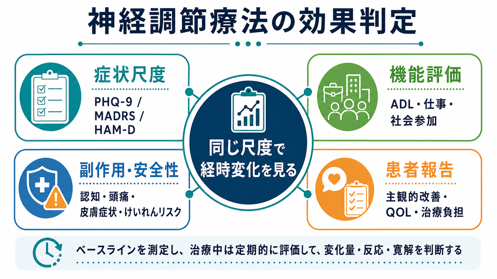
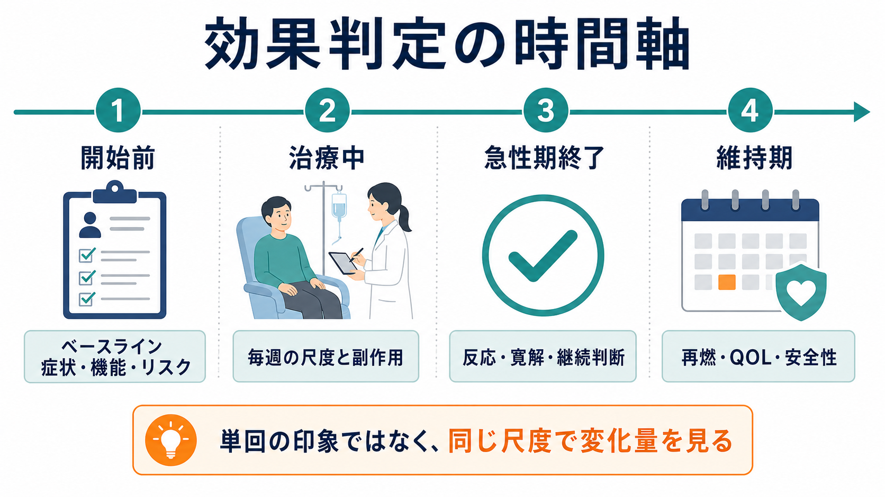
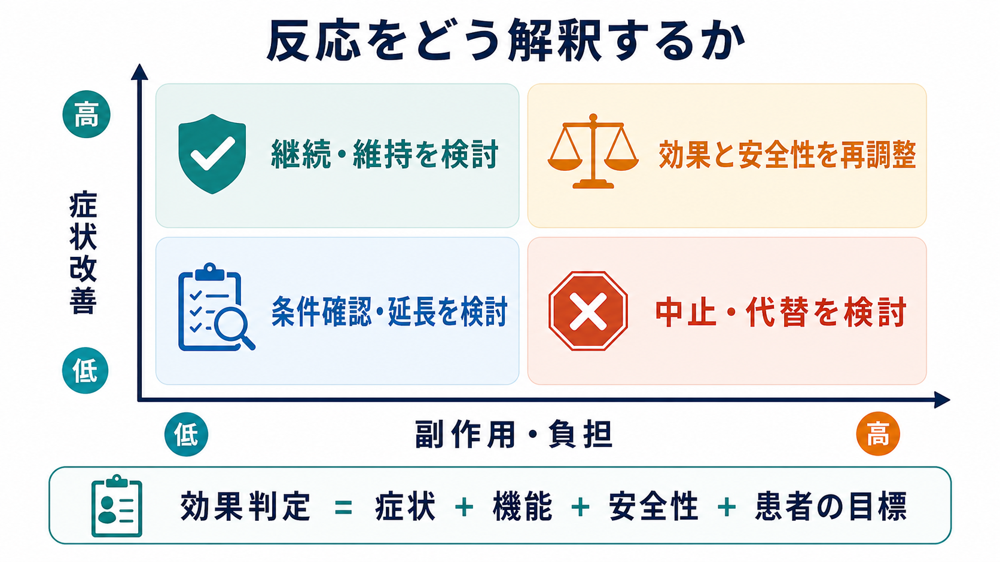

# 神経調節療法の効果判定はどう行うか

## 要点

- 神経調節療法の効果判定は、「症状が下がったか」だけでなく、機能、生活の質、副作用、治療負担、本人の目標を同時に見る。
- [[反復経頭蓋磁気刺激rTMSとは何か|rTMS]] では短期効果のエビデンスはあるが反応には個人差があり、治療前に「利益がない可能性」も共有する必要がある[1]。
- [[修正型ECTとは何か|ECT]] では各セッション後の臨床状態、認知機能、副作用を反復的に確認し、反応が得られた時点または有害事象が問題になった時点で継続可否を見直す[3]。
- 自己記入式尺度は有用だが、単回スコアだけでなく、ベースラインからの変化量、寛解、再燃、患者報告アウトカムを並べて判断する。
- 本記事は教育・研究目的の整理であり、個別患者への診断や治療指示ではない。

## この記事で答える問い

神経調節療法には、[[反復経頭蓋磁気刺激rTMSとは何か|rTMS]]、[[シータバースト刺激とは何か|シータバースト刺激]]、[[tDCSとは何か|tDCS]]、[[tACSとは何か|tACS]]、[[迷走神経刺激療法VNSとは何か|VNS]]、[[修正型ECTとは何か|ECT]] などが含まれる。この記事では、これらを一括して「効いたかどうか」をどう整理するかを扱う。

中心の問いは次の4つである。

1. どの尺度で症状変化を見るか。
2. 症状以外の機能改善をどう評価するか。
3. 副作用や治療負担をどう効果判定に組み込むか。
4. 患者本人の主観的改善や生活上の目標をどう扱うか。

## まず結論

神経調節療法の効果判定は、単純な「実施したか」「刺激強度が十分か」「主治医の印象で良くなったか」ではなく、治療前に決めた評価軸を同じ方法で繰り返し測ることから始まる。典型的には、症状尺度、機能評価、副作用、患者報告を治療前、治療中、急性期終了時、維持期で見直す。

うつ病領域では、PHQ-9、HAM-D、MADRS、QIDS などの症状尺度がよく使われる。PHQ-9 は簡便な自己記入式尺度で、症状重症度と経時変化の把握に広く用いられ、5点程度の低下は臨床的に意味のある改善の目安として扱われることがある[5][6]。ただし、反応を「50%以上の改善」とするか、「5点以上の低下」とするか、「10点未満」または「5点未満」まで下がったかで、同じ患者でも判定が変わりうる。

したがって、実務上は次のように分けると整理しやすい。

| 判定軸 | 例 | 見たいこと |
|---|---|---|
| 症状尺度 | PHQ-9、MADRS、HAM-D、QIDS | 抑うつ、不安、睡眠、希死念慮などの変化 |
| 機能評価 | ADL、就労・就学、家事、社会参加 | 生活が戻っているか |
| 副作用・安全性 | 頭痛、認知機能、皮膚症状、けいれんリスク、麻酔リスク | 利益に見合う負担か |
| 患者報告 | 主観的改善、QOL、満足度、治療負担 | 本人にとって意味のある改善か |

## 背景

神経調節療法は、薬物療法や心理社会的介入と異なり、脳・神経系への刺激条件、刺激部位、セッション数、維持療法の有無によって効果と副作用が変わる。NICE は rTMS について、短期有効性は一定程度認めつつ、臨床反応にはばらつきがあるため、通常の臨床統治と監査のもとで実施し、患者に他の選択肢と無効の可能性を説明することを求めている[1]。

ECT ではさらに、治療効果と副作用が手技条件や個人リスクに強く依存する。NICE は ECT の判断にあたり、麻酔リスク、併存症、認知機能障害を含む有害事象、治療しない場合のリスクを文書化して比較すること、各セッション後に臨床状態を評価すること、認知機能を継続的にモニタリングすることを推奨している[3]。これは、[[ECTの副作用には何があるのか]] や [[ECTの適応はどう判断するか]] を読むときの評価軸にもなる。

## 基本概念

### 反応、寛解、再燃

効果判定で混同しやすい言葉に、反応、寛解、再燃がある。

- 反応: ベースラインから十分に改善した状態。うつ病研究では症状尺度の50%以上低下を使うことが多い[7]。
- 部分反応: 改善はあるが、残存症状が大きい状態。
- 寛解: 症状が臨床的にかなり低い水準まで下がった状態。PHQ-9 では5点未満を目安にする文献がある[5]。
- 再燃・再発: 改善後に症状が戻ること。維持療法やフォローアップで重要になる。

神経調節療法では、急性期終了時の「反応」だけでなく、数週間から数か月後の維持、再燃、生活機能の回復を分けて見る必要がある。特に rTMS や tDCS では、刺激プロトコル、併用治療、治療抵抗性、期待効果、プラセボ反応が結果を左右するため、単施設の印象だけでは評価しにくい[7][8]。

### 症状尺度

症状尺度は、治療効果を数量化するための共通言語である。うつ症状であれば PHQ-9、HAM-D、MADRS、QIDS、躁症状であれば YMRS、不安症状であれば GAD-7 などが候補になる。目的は「診断すること」ではなく、治療前からの変化を同じ物差しで追うことである。

PHQ-9 は短く、自己記入でき、プライマリケアから専門診療まで使いやすい。原著ではうつ病重症度尺度としての妥当性が示されており[5]、後続のエビデンス統合では、5点以上の低下が臨床的に意味のある改善の保守的な目安として整理されている[6]。ただし、神経調節療法の専門外来や研究では、評価者盲検の MADRS や HAM-D が選ばれることも多い。

### 機能評価

症状スコアが改善しても、生活機能が戻らないことがある。逆に、症状尺度の改善が中等度でも、睡眠、食事、外出、家事、仕事、学業、対人関係が改善していれば、本人にとって大きな利益になる。

機能評価では、次のような問いを具体化する。

- 朝起きて日課を開始できるか。
- 家事、セルフケア、服薬、通院を維持できるか。
- 職場・学校・家庭内の役割に戻れているか。
- 社会参加や対人接触が増えているか。
- 再燃時の早期サインに本人と家族が気づけるか。

## 仕組み

神経調節療法では、脳活動や神経回路に直接または間接に働きかける。だが、臨床上の効果判定は「脳が変わったはず」という推測ではなく、患者の状態が実際にどう変わったかを複数の層で確認する作業である。

### 開始前

開始前には、ベースラインの症状、機能、リスク、併用治療、患者の目標を記録する。たとえば、うつ症状なら PHQ-9 や MADRS、生活機能なら就労状況やADL、副作用リスクならけいれん既往、薬剤、睡眠不足、物質使用、頭部金属、認知機能などを確認する。TMS の安全性ガイドラインでは、対象者のスクリーニング、刺激条件、けいれんリスク、既知の副作用を系統的に扱うことが重視されている[2]。

### 治療中

治療中は、毎回または毎週の短い測定が有用である。rTMS では頭皮痛、頭痛、聴覚保護、まれなけいれんリスクを確認する。tDCS や tACS では皮膚刺激感、発赤、頭痛、眠気、気分変化などを記録する。ECT では各セッション後の臨床状態と認知機能の確認が特に重要である[3][4]。

治療中の改善は、期待効果や日内変動の影響を受ける。したがって、「今日は少し良い」という印象だけでなく、同じ尺度を同じタイミングで繰り返す。可能なら睡眠、活動量、服薬変更、心理社会的出来事も併記する。

### 急性期終了時

急性期終了時には、治療前に設定した主要評価項目を確認する。症状尺度では、絶対値、変化量、反応、寛解を分けて見る。機能評価では、本人が重要視していた生活上の目標に近づいたかを確認する。

この時点での判断は、次の4分類にすると実務的である。

| 症状改善 | 副作用・負担 | 解釈 |
|---|---|---|
| 大きい | 小さい | 継続、維持療法、再燃予防を検討 |
| 大きい | 大きい | 効果はあるが、刺激条件、頻度、併用治療、代替法を再調整 |
| 小さい | 小さい | 回数不足、標的、診断、併用治療、期待値を再確認 |
| 小さい | 大きい | 中止または別治療への切り替えを検討 |

### 維持期

維持期では、急性期の反応が生活上の回復に結びついているかを見る。rTMS では維持治療の最適条件や長期転帰に不確実性が残るため、再燃、追加セッション、併用治療、本人の負担を継続的に確認する必要がある[1]。ECT でも、反応後の継続・維持戦略は副作用、認知機能、再燃リスクを見ながら個別に判断する。

## 図解

上の3枚の図は、次の対応になっている。

| 図 | 目的 | 使い方 |
|---|---|---|
| 図1 | 効果判定の4領域 | 初回説明、評価項目の共有 |
| 図2 | 時間軸 | 開始前、治療中、急性期終了、維持期の確認 |
| 図3 | 解釈マトリクス | 症状改善と副作用・負担のバランス判断 |

図を臨床記録にそのまま使うというより、「何を測らないと判断が偏るか」を確認するためのチェックリストとして使うのがよい。

## 臨床・研究との接続

### 臨床では「測定に基づくケア」に近づける

神経調節療法の評価は、測定に基づくケアと相性がよい。ベースライン、治療中、終了時、フォローアップの各時点で同じ尺度を使うと、反応の有無、治療継続、追加治療、併用治療の見直しを説明しやすくなる。

ただし、測定値が臨床判断を置き換えるわけではない。たとえば、PHQ-9 が大きく低下しても、希死念慮、躁転、認知副作用、家族の安全懸念、治療負担があれば、単純に「成功」とは言えない。逆に、尺度の変化が小さくても、食事、睡眠、通院、会話、外出が戻っている場合は、意味のある部分改善として扱う余地がある。

### 研究では主要評価項目と副次評価項目を分ける

研究では、主要評価項目を事前に決める必要がある。うつ病の rTMS や tDCS 研究なら、MADRS 変化量、反応率、寛解率が主要または副次アウトカムになりやすい。近年の tES メタ解析では、うつ症状、反応、寛解、有害事象が主要アウトカムとして扱われ、tDCS や tACS には一定の有効性が示される一方で、個別化や長期転帰には課題が残る[7][8]。

副次評価項目には、機能、QOL、認知機能、治療満足度、脱落率、アドヒアランス、併用薬変更、再燃までの期間などを置く。臨床研究で「効いた」と主張するには、症状だけでなく安全性と負担も同時に報告する必要がある。

## よくある誤解

### 誤解1: 刺激すれば効果は客観的に分かる

刺激そのものは装置で記録できるが、治療効果は装置ログだけでは分からない。刺激強度、部位、セッション数が十分でも、症状や機能が改善しないことはある。NICE が rTMS の短期効果を認めつつも反応のばらつきを明示しているのは、この点に関係する[1]。

### 誤解2: 症状尺度が下がれば十分である

症状尺度は重要だが、十分ではない。本人が望んでいた生活上の変化、家族や支援者から見た変化、副作用、治療継続の負担を合わせて評価する。神経調節療法では通院頻度、身体的負担、費用、時間、羞恥感、不安もアウトカムの一部になる。

### 誤解3: 副作用は効果とは別問題である

副作用は効果判定の外側ではなく、効果判定の中心にある。特に ECT では認知副作用が患者の意思決定に強く影響し、主観的認知困難と客観的認知検査が一致しない場合もあるため、両方を扱う必要がある[4]。

### 誤解4: 患者報告は主観的なので弱い

患者報告は「弱い情報」ではなく、治療の意味を評価するための別の種類の情報である。症状尺度が改善しても本人が生活の回復を感じていなければ、治療目標の再設定が必要になる。逆に、症状尺度の改善が限定的でも、本人の目標に近づいているなら、継続や組み合わせ治療の価値を検討できる。

## 関連ノート

- [[反復経頭蓋磁気刺激rTMSとは何か]]
- [[シータバースト刺激とは何か]]
- [[tDCSとは何か]]
- [[tACSとは何か]]
- [[迷走神経刺激療法VNSとは何か]]
- [[修正型ECTとは何か]]
- [[ECTの適応はどう判断するか]]
- [[ECTの副作用には何があるのか]]
- [[光療法とは何か]]

## MOC更新候補

- `content/00_MOC/` 配下の臨床実践・治療、神経調節、身体療法に関するMOCへ、本記事へのリンクを追加する候補。
- 並列ジョブとの競合を避けるため、本タスクではMOC本体は更新しない。

## 理解チェック

1. 神経調節療法の効果判定で、症状尺度だけに頼ると何を見落としやすいか。
2. PHQ-9 の「5点以上低下」「50%以上低下」「5点未満」は、それぞれ何を示す目安か。
3. ECT で認知機能を継続的に確認する必要があるのはなぜか。
4. 症状改善は大きいが副作用・治療負担も大きい場合、どのような再調整が考えられるか。

## 未解決問題

- 神経調節療法ごとに、最適な維持療法の頻度・期間はまだ十分に標準化されていない。
- 症状尺度の改善と、就労、家事、社会参加、QOL の改善がどの程度一致するかは、疾患、治療法、生活環境で異なる。
- 患者報告アウトカムを臨床現場で簡便に取り入れる方法は、今後さらに整備が必要である。
- tDCS や tACS などの非侵襲的電気刺激では、有効性の推定は更新されつつあるが、適応、プロトコル、予測因子、長期安全性について追加研究が必要である[7][8]。

## 参考文献

[1] National Institute for Health and Care Excellence. (2015). *Repetitive transcranial magnetic stimulation for depression: IPG542*. https://www.nice.org.uk/guidance/ipg542

[2] Rossi, S., Antal, A., Bestmann, S., Bikson, M., Brewer, C., Brockmöller, J., et al. (2021). Safety and recommendations for TMS use in healthy subjects and patient populations, with updates on training, ethical and regulatory issues: Expert Guidelines. *Clinical Neurophysiology, 132*(1), 269-306. https://doi.org/10.1016/j.clinph.2020.10.003

[3] National Institute for Health and Care Excellence. (2003, updated 2009). *Guidance on the use of electroconvulsive therapy: TA59*. https://www.nice.org.uk/guidance/ta59

[4] Porter, R. J., Baune, B. T., Morris, G., Hamilton, A., Bassett, D., Boyce, P., et al. (2020). Cognitive side-effects of electroconvulsive therapy: what are they, how to monitor them and what to tell patients. *BJPsych Open, 6*(3), e40. https://doi.org/10.1192/bjo.2020.17

[5] Kroenke, K., Spitzer, R. L., & Williams, J. B. W. (2001). The PHQ-9: Validity of a brief depression severity measure. *Journal of General Internal Medicine, 16*(9), 606-613. https://doi.org/10.1046/j.1525-1497.2001.016009606.x

[6] Williams, J. W., Jr., Noël, P. H., Cordes, J. A., Ramirez, G., & Pignone, M. (2002/2008). *Evidence synthesis for determining the responsiveness of depression questionnaires and optimal treatment duration for antidepressant medications*. NCBI Bookshelf. https://www.ncbi.nlm.nih.gov/books/NBK49043/

[7] Ren, C., Pagali, S. R., Wang, Z., Kung, S., Boyapati, R. B., Islam, K., et al. (2025). Transcranial electrical stimulation in treatment of depression: A systematic review and meta-analysis. *JAMA Network Open*. https://jamanetwork.com/journals/jamanetworkopen/fullarticle/2835422

[8] Razza, L. B., Luethi, M. S., Moffa, A., Aust, S., Blumberger, D. M., Brunelin, J., et al. (2026). Efficacy of transcranial direct current stimulation for depression: an individual patient data meta-analysis. *The British Journal of Psychiatry*. https://doi.org/10.1192/bjp.2025.10511
