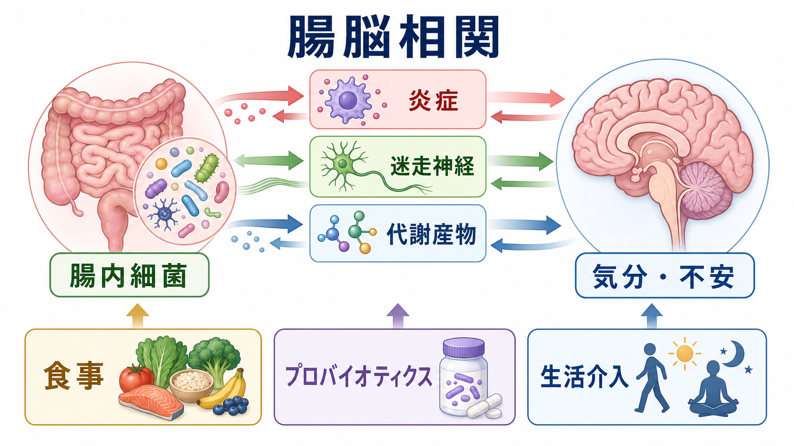
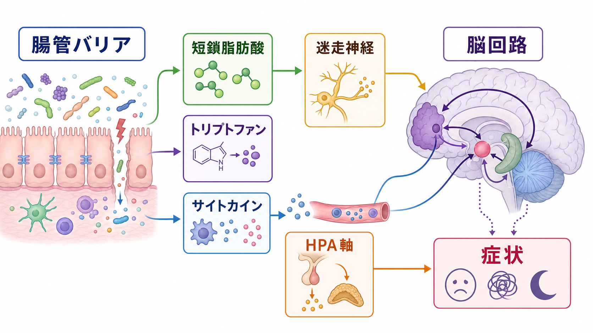
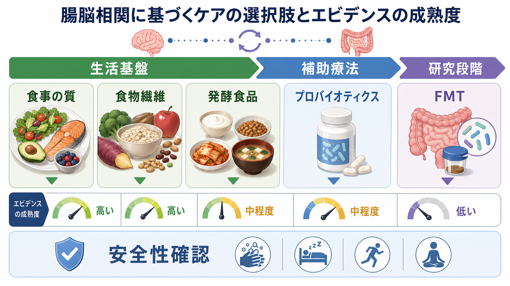

# 腸脳相関に基づく治療とは何か

## 要点

- 腸脳相関に基づく治療とは、腸内細菌叢、腸管バリア、免疫炎症、代謝産物、迷走神経、ストレス系を介して、精神症状や身体症状を補助的に整える介入群である。
- 現時点で中心に置きやすいのは、食事の質、食物繊維、発酵食品、睡眠・運動・ストレスケア、必要に応じたプロバイオティクスやプレバイオティクスである。
- うつ症状、不安、睡眠に対するプロバイオティクス、プレバイオティクス、シンバイオティクスのRCTメタ解析は有望な結果を示すが、研究間の異質性、菌株差、対象者差、追跡期間の短さが大きい [2]。
- FMT（糞便微生物叢移植）は再発性 *Clostridioides difficile* 感染症など一部の消化器疾患で位置づけられる治療であり、精神疾患の一般治療として使える段階ではない [7], [8]。
- 精神医療では、腸脳相関介入を標準治療の代替ではなく、[[SSRIとは何か]]、[[認知行動療法CBTとは何か]]、[[ヨガや呼吸法は精神医療でどう使われるのか]]などと併用しうる補助療法として読むのが安全である。

## この記事で答える問い

1. 腸内細菌は、どのような経路で脳や精神症状に関わるのか。
2. 食事、プロバイオティクス、プレバイオティクス、発酵食品、生活介入は、どこまで治療として考えられるのか。
3. 迷走神経、炎症、短鎖脂肪酸、トリプトファン代謝は、臨床的にどう読めばよいのか。
4. FMTや「腸活」を精神疾患治療として扱うとき、どこに限界と危険があるのか。

## まず結論

腸脳相関に基づく治療は、「腸を整えれば精神疾患が治る」という単純な話ではない。より正確には、腸内細菌叢と宿主の相互作用が、免疫炎症、代謝、内分泌、迷走神経、腸管神経系を通じて脳のストレス反応や情動調整に影響しうる、という多経路モデルである [1]。

したがって臨床では、第一に標準治療を維持しながら、食事の質、便通、睡眠、運動、薬剤、炎症性疾患、抗菌薬使用歴などを評価する。第二に、リスクの低い生活介入を基盤に置く。第三に、プロバイオティクスやプレバイオティクスは、対象者、菌株、用量、期間を意識して「試みる価値はあるが、効果保証はできない補助療法」として扱う [2], [6]。

## 背景

腸と脳は、もともと自律神経、内分泌、免疫、腸管神経系を通じて双方向につながると考えられてきた。近年の焦点は、そこに腸内細菌叢を加えた「マイクロバイオータ腸脳相関」である。腸内細菌は、短鎖脂肪酸、胆汁酸、トリプトファン関連代謝物、ペプチドグリカンなどを介して宿主の免疫・代謝環境に関わり、脳機能や行動にも影響しうる [1]。

精神医学でこの領域が注目される理由は、うつ病、不安症、ストレス関連症状、睡眠障害、過敏性腸症候群などで、精神症状と消化器症状が併存しやすいからである。さらに、慢性炎症、肥満、生活リズム、食事の質、抗菌薬使用、社会的ストレスは、腸内環境と精神症状の両方に影響しうる。つまり腸脳相関は、単一の「原因」ではなく、精神症状を維持・増幅する身体的文脈を読むための枠組みである。

## 基本概念

### 腸脳相関

腸脳相関とは、消化管と中枢神経系が双方向に情報をやり取りする仕組みである。上行性には、腸管から迷走神経、脊髄求心路、免疫性シグナル、代謝物が脳へ届く。下行性には、ストレス、情動、睡眠、食行動、自律神経出力が腸管運動、分泌、透過性、炎症、微生物叢に影響する。

### マイクロバイオータ

マイクロバイオータは、腸管などに存在する微生物群集を指す。精神症状との関係では、菌の種類そのものよりも、食物繊維を発酵して短鎖脂肪酸を作る、胆汁酸やトリプトファン代謝に関わる、腸管バリアと免疫反応を調整する、といった機能に注目する方が臨床的である [1]。

### サイコバイオティクス

サイコバイオティクスは、精神機能に有益な影響をもつ可能性のあるプロバイオティクス、プレバイオティクス、食事介入を指す概念である。ただし、製品名や「乳酸菌なら何でもよい」という意味ではない。効果は菌株、用量、投与期間、対象者、併存疾患、食事背景によって変わりうる [2], [6]。

## 仕組み

### 1. 免疫炎症経路

腸管バリアが乱れ、腸管内成分への免疫反応が高まると、サイトカイン、急性期反応、ミクログリア活性化などを介して、疲労感、意欲低下、睡眠変化、食欲変化に関わる可能性がある。うつ症状のすべてが炎症で説明できるわけではないが、一部の人では炎症性背景が症状の維持因子になりうる。

プロバイオティクス補助投与を受けたうつ病患者を対象とする研究では、臨床症状だけでなく、免疫炎症マーカーやストレス関連指標を検討する試みが進んでいる [4]。ただし、この段階の知見は「どの患者に効くか」を確定するほど成熟していない。

### 2. 迷走神経と自律神経

迷走神経は、腸管から脳幹へ向かう求心性情報の主要経路の一つである。腸管内の化学的・機械的情報、炎症性シグナル、微生物由来代謝物の影響は、迷走神経や腸管神経系を介して脳のストレス調整に接続しうる [1]。この点は、[[迷走神経刺激療法VNSとは何か]]や呼吸法・ヨガなどの身体療法と接点をもつ。

ただし、食事やプロバイオティクスがそのままVNSと同じ効果を生むわけではない。ここで重要なのは、「腸管から脳への身体信号が、気分や不安の背景に入り込む」という理解である。

### 3. 代謝産物

短鎖脂肪酸は、食物繊維の発酵によって作られる代表的な微生物由来代謝物である。腸管バリア、免疫調整、代謝、神経炎症に関わる可能性があり、腸脳相関の中核的な候補経路とされる [1]。また、トリプトファン代謝は、セロトニン、キヌレニン経路、免疫炎症と接続するため、うつ症状やストレス反応を考えるうえで重要である。

臨床的には、「短鎖脂肪酸を増やすサプリ」だけに注目するより、食物繊維、豆類、全粒穀物、野菜、発酵食品、規則的な食事と睡眠を含む生活全体をみる方が現実的である。

### 4. HPA軸とストレス

心理社会的ストレスは、HPA軸、自律神経、食行動、睡眠、腸管運動、腸管透過性を変える。逆に、腹部症状、炎症、便通異常、食後不快感は、不安、過覚醒、回避、抑うつを強めることがある。腸脳相関は、精神症状と身体症状を分けて扱いすぎないための臨床地図でもある。

## 図解

| 介入 | 想定される主な経路 | 現時点の読み方 | 注意点 |
|---|---|---|---|
| 食事の質の改善 | 食物繊維、代謝、炎症、体重、睡眠リズム | うつ病に対する食事介入RCTがあり、低リスクな補助介入として検討しやすい [5] | 摂食障害、貧困、文化、調理能力を無視しない |
| プレバイオティクス・食物繊維 | 短鎖脂肪酸、腸管バリア、免疫調整 | 食事基盤の一部として扱いやすい | 急な増量は腹部膨満や下痢を起こす |
| プロバイオティクス | 菌株依存の免疫・代謝・神経経路 | RCTメタ解析ではうつ・不安・睡眠で有望だが異質性が高い [2] | 免疫不全、重症疾患、未熟児ではリスク評価が必要 [6] |
| 発酵食品 | 食事パターン、微生物・代謝物、嗜好性 | 食事改善の一部として現実的 | 「発酵食品なら治療効果がある」とは言えない |
| 呼吸・睡眠・運動 | 自律神経、HPA軸、炎症、腸管運動 | [[ヨガや呼吸法は精神医療でどう使われるのか]]と接続しやすい | 症状が重い時期に過負荷にしない |
| FMT | 微生物叢の大きな置換 | 精神疾患では研究段階。消化器疾患でも適応は限定的 [7] | 感染伝播など重大リスクがある [8] |

## 臨床・研究との接続

### うつ症状への応用

うつ症状に対しては、食事改善とプロバイオティクスが比較的研究されている。SMILES試験では、中等度から重度のうつ病エピソードをもつ成人に対し、管理栄養士による食事支援を12週間行い、社会的支援対照群よりうつ症状が大きく改善した [5]。この研究は小規模であり再現性の検討が必要だが、「食事は予防だけでなく、治療補助にもなりうる」という重要な方向を示した。

プロバイオティクスについては、2025年のRCTメタ解析で、うつ、不安、睡眠に対する有望な効果が報告されている [2]。一方で、研究の質、菌株、期間、対象者、症状評価法がばらつくため、標準治療の代替として扱うのは不適切である。[[SSRIとは何か]]や心理療法の効果が不十分な場合でも、まずは診断、服薬、睡眠、物質使用、身体疾患、心理社会的ストレスを再評価したうえで、補助的に検討する。

### 不安・ストレス関連症状への応用

不安症状では、腸管症状、過覚醒、呼吸、食事、睡眠の相互作用が臨床的に重要である。プロバイオティクスやプレバイオティクスは不安指標の改善を示す研究があるが、効果の大きさや持続性はまだ確定的ではない [2]。この領域では、腸内細菌だけでなく、[[認知行動療法CBTとは何か]]、呼吸法、睡眠調整、カフェインやアルコールの見直しを含む多面的な設計が必要になる。

### 炎症・身体疾患を伴うケース

慢性炎症、肥満、糖代謝異常、過敏性腸症候群、炎症性腸疾患、慢性疼痛などを伴う場合、腸脳相関はより重要になる。ただし、精神症状の原因を腸だけに帰すと、診断や治療の遅れにつながる。腹痛、血便、体重減少、発熱、貧血、強い下痢・便秘などがある場合は、消化器疾患の評価が優先される。

### FMTの位置づけ

FMTは、腸内細菌叢を大きく変える介入であり、腸脳相関研究では魅力的に見える。しかし、2024年のAGAガイドラインでは、糞便微生物叢関連療法は主に再発性 *C. difficile* 感染症など選択された消化器疾患に位置づけられ、炎症性腸疾患や過敏性腸症候群に対しても臨床試験外での使用は推奨されていない [7]。精神疾患への一般的治療としては、さらに慎重であるべきである。

FDAはFMTに関連する病原体伝播や重篤な感染リスクについて安全性情報を出している [8]。したがって、精神症状を目的とした自己流FMT、未規制の便移植、個人輸入製品は避けるべきである。

## よくある誤解

### 「腸活でうつ病や不安症は治る」

腸脳相関は治療可能性を広げるが、単独の治療万能論ではない。うつ病や不安症は、神経回路、認知、対人関係、生活史、身体疾患、薬剤、睡眠、社会的要因が重なって生じる。腸内細菌への介入は、その一部に働きかける補助的選択肢である。

### 「プロバイオティクスは安全だから誰にでも勧められる」

健康な成人では大きな問題が少ないことが多いが、長期安全性データは十分ではない。NCCIHは、重い基礎疾患や免疫機能低下がある人では有害事象リスクが高くなりうると整理している [6]。精神科臨床でも、免疫抑制薬、中心静脈カテーテル、重症身体疾患、妊娠、乳幼児などでは医療者の評価が必要である。

### 「どの菌株でも同じ」

プロバイオティクスの効果は菌株依存である。ラクトバチルスやビフィズス菌という大きな分類だけでは不十分で、菌株、配合、用量、保存状態、投与期間、食事背景が異なる。研究で使われた製品と市販品を同一視するのは危険である。

### 「FMTは強力な腸脳相関治療である」

FMTは強力だからこそ、適応、ドナー検査、製造管理、感染対策、追跡が必要である。精神症状を目的に一般診療で使う治療ではなく、現時点では研究段階と考える。

## 関連ノート

- [[迷走神経刺激療法VNSとは何か]]
- [[ヨガや呼吸法は精神医療でどう使われるのか]]
- [[認知行動療法CBTとは何か]]
- [[SSRIとは何か]]
- [[オメガ3脂肪酸は精神疾患に有効なのか]]

### 関連ノート候補

- 腸脳相関とは何か
- マイクロバイオームとは何か
- 精神疾患における炎症仮説とは何か
- プロバイオティクスはうつ病に有効なのか
- FMTは精神疾患に応用できるのか
- トリプトファン代謝と精神症状はどう関係するのか

### MOC更新候補

- `content/00_MOC/MOC・臨床実践・治療.md` の神経調節・身体療法または補助療法の項目
- `content/00_MOC/MOC・脳・神経科学.md` の自律神経・身体信号・腸脳相関の項目
- `content/00_MOC/MOC・精神医学.md` の栄養精神医学・身体疾患併存の項目

## 理解チェック

1. 腸脳相関において、迷走神経、免疫炎症、代謝産物はそれぞれどのような役割をもつか。
2. プロバイオティクスを精神症状への補助療法として読むとき、菌株差と研究の異質性がなぜ重要か。
3. 食事改善は、なぜ「腸内細菌だけ」ではなく睡眠、炎症、代謝、行動活性化とも関係するのか。
4. FMTを精神疾患治療として一般化してはいけない理由は何か。
5. 腸脳相関介入を、薬物療法や心理療法と組み合わせるときの臨床的な注意点は何か。

## 未解決問題

- どの患者群が、どの菌株・食事・プレバイオティクスに反応しやすいのか。
- 腸内細菌の変化が症状改善の原因なのか、生活改善や炎症低下に伴う結果なのか。
- 効果の持続期間、再発予防効果、長期安全性をどう評価するか。
- 精神症状、消化器症状、免疫炎症マーカー、自律神経指標を統合した実用的な層別化が可能か。

## 参考文献

[1] Cryan, J. F., O'Riordan, K. J., Cowan, C. S. M., et al. (2019). The Microbiota-Gut-Brain Axis. *Physiological Reviews*, 99(4), 1877-2013. https://doi.org/10.1152/physrev.00018.2018

[2] Zhang, J., Zhu, L., Meng, Q., Wang, Z., & Zhu, H. (2025). The efficacy of probiotics, prebiotics, and synbiotics on anxiety, depression, and sleep: a systematic review and meta-analysis of randomized controlled trials. *BMC Psychiatry*, 25, 1199. https://doi.org/10.1186/s12888-025-07644-z

[3] Sulaiman, N. N. Y., Mohamad Nizam, N. B., Mohd Noor, N. A., et al. (2025). An updated systematic review and appraisal of the pathophysiologic mechanisms of probiotics in alleviating depression. *Nutritional Neuroscience*. https://doi.org/10.1080/1028415X.2025.2531357

[4] Sempach, L., et al. (2024). Examining immune-inflammatory mechanisms of probiotic supplementation in depression: secondary findings from a randomized clinical trial. *Translational Psychiatry*, 14, 305. https://doi.org/10.1038/s41398-024-03030-7

[5] Jacka, F. N., O'Neil, A., Opie, R., et al. (2017). A randomised controlled trial of dietary improvement for adults with major depression (the 'SMILES' trial). *BMC Medicine*, 15, 23. https://doi.org/10.1186/s12916-017-0791-y

[6] National Center for Complementary and Integrative Health. (2026). Probiotics: Usefulness and Safety. https://www.nccih.nih.gov/health/probiotics

[7] Peery, A. F., Kelly, C. R., Kao, D., et al. (2024). AGA Clinical Practice Guideline on Fecal Microbiota-Based Therapies for Select Gastrointestinal Diseases. *Gastroenterology*, 166(3), 409-434. https://doi.org/10.1053/j.gastro.2024.01.008

[8] U.S. Food and Drug Administration. (2020). Fecal Microbiota for Transplantation: Safety Alert - Risk of Serious Adverse Events Likely Due to Transmission of Pathogenic Organisms. https://www.fda.gov/safety/medical-product-safety-information/fecal-microbiota-transplantation-safety-alert-risk-serious-adverse-events-likely-due-transmission
