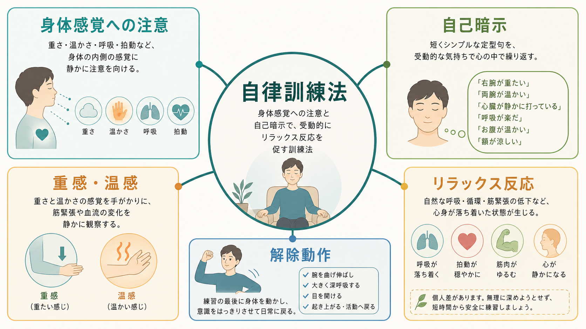
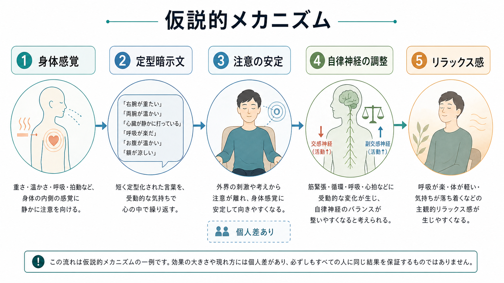
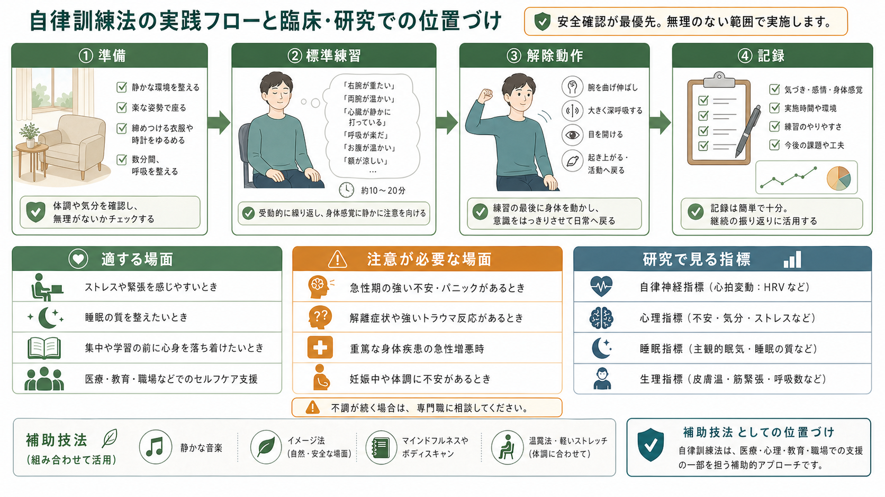

# 自律訓練法とは何か

## 要点

- 自律訓練法（autogenic training: AT）は、重感・温感などの身体感覚に注意を向け、短い暗示文を反復することで、受動的なリラックス反応を引き出す訓練法である [1], [7]。
- 典型的には、四肢の重感、四肢の温感、心臓、呼吸、腹部温感、額の涼感という標準練習を段階的に学ぶ [1], [7]。
- 仕組みは「気合いで自律神経を操作する」ことではなく、注意の安定、身体感覚の再解釈、筋緊張・循環・呼吸への受動的な気づき、自律神経活動の変化が組み合わさるものとして理解しやすい [7], [8]。
- ストレス・不安、疼痛、高血圧などで有効性を示す研究はあるが、研究の質、対象集団、比較条件にはばらつきがあり、標準治療の代替ではなく補助的な技法として読むのが妥当である [2], [3], [5], [6]。
- 医療・心理臨床で扱う場合は、パニック、解離、外傷記憶、身体疾患、不整脈、重い抑うつなどを確認し、必要に応じて専門家の指導下で導入する。

## この記事で答える問い

1. 自律訓練法は、どのような練習で成り立っているのか。
2. 身体感覚への注意と自己暗示は、なぜリラックス反応につながりうるのか。
3. 研究上はどの症状・領域で検討され、どの程度慎重に読むべきなのか。
4. 臨床・セルフケアで使うとき、何を避け、何を確認すべきなのか。

## まず結論

自律訓練法は、身体の内側に起こる感覚を「変えよう」とする技法ではなく、決まった言葉を静かに反復しながら、重さ・温かさ・呼吸・拍動のような感覚が自然に変化するのを観察する技法である。ここで重要なのは、努力して脱力することではなく、「そうなっているかもしれない」と受動的に注意を置くことである [1], [7]。

この点で、自律訓練法は[[ヨガや呼吸法は精神医療でどう使われるのか]]と同じく身体を入口にするが、激しい姿勢や呼吸操作を中心にしない。むしろ、[[注意とは何か]]で扱うような注意の向け方と、[[不安とは何か]]で問題になる身体感覚の解釈を、穏やかな練習場面で組み替えていく方法に近い。

ただし、「自律神経を自由自在に制御できる」「不安や不眠を単独で治す」と説明すると過剰である。研究上は、ストレス・不安、疼痛、血圧、睡眠関連の訴えなどで検討されてきたが、比較条件や方法論の限界もある [2], [3], [5], [6]。したがって、臨床では標準治療、心理教育、睡眠・生活支援、薬物療法、心理療法を置き換えるものではなく、自己調整を補助する練習として位置づける。

## 背景

自律訓練法は、ドイツの精神科医 J. H. Schultz によって体系化され、その後 Schultz と Luthe らにより心理療法・心身医学の文脈で整理された [1], [7]。背景には、催眠状態で報告される「手足が重い」「温かい」といった感覚を、施術者への依存ではなく本人の練習によって再現しようとする発想がある。

「autogenic」は、外から何かを加えるというより、本人の注意と暗示文の反復によって生じる自己生成的な変化を指す。ここでいう暗示は、非合理な思い込みを植え付けることではない。短く定型化された言葉を使い、身体感覚を安全なものとして観察するための足場を作る操作である。

リラクセーション研究全体では、Benson らが「リラックス反応」を、交感神経優位の緊急反応に対置される生理的状態として整理した [8]。自律訓練法は、この広いリラクセーション技法の一つとして、注意、言語、身体感覚、自律神経反応を結びつける実践とみなせる。

## 基本概念

### 標準練習

古典的な自律訓練法では、次のような標準練習が段階的に導入される [1], [7]。

| 練習 | 注意を向ける対象 | 典型的な狙い |
|---|---|---|
| 重感練習 | 腕や脚の重さ | 筋緊張の低下に気づく |
| 温感練習 | 腕や脚の温かさ | 末梢循環や安心感に注意を向ける |
| 心臓調整 | 心拍の落ち着き | 拍動を脅威ではなく観察対象にする |
| 呼吸調整 | 自然な呼吸 | 呼吸を操作しすぎず見守る |
| 腹部温感 | みぞおち・腹部 | 内臓感覚を穏やかに観察する |
| 額の涼感 | 額・頭部 | 覚醒と鎮静のバランスを整える |

実践では「右腕が重たい」「両腕が温かい」などの定型句を、静かな姿勢で反復する。最後には、腕を曲げ伸ばしする、深く息を吸う、目を開けるなどの解除動作を行い、ぼんやりした状態を日常行動に持ち越さないようにする。

### 受動的注意

自律訓練法の要点は、身体を「操作する」よりも、身体感覚が変化する余地を作ることである。たとえば、温感練習では血流を命令で増やすのではなく、「温かい」という言葉を手がかりにして、微細な温度感、圧、重さ、左右差に注意を向ける。

これは[[予測処理とは何か]]の観点からは、身体からの信号をどう予測し、どう解釈するかをゆるやかに変える訓練としても読める。ただし、この説明は現代的な解釈であり、自律訓練法そのものの効果機序が単一の予測処理モデルで確立しているわけではない。

## 仕組み

### 1. 注意の焦点を外界の脅威から身体の中立的感覚へ移す

不安やストレスが高いとき、注意は外界の危険、失敗予測、身体の異常感に向きやすい。自律訓練法では、重い、温かい、呼吸している、という比較的中立的で反復可能な感覚へ注意を戻す。これは不安そのものを否定するのではなく、注意の焦点を狭い脅威探索から広げる操作である。

### 2. 暗示文が身体感覚の解釈を支える

「心臓が静かに規則正しく打っている」という言葉は、心拍を消すための命令ではない。拍動を危険信号として読むのではなく、観察可能な身体活動として読むための枠組みになる。パニック症状や健康不安がある場合、この点は特に重要である。ただし、心拍への注意が不安を強める人もいるため、導入順序や対象感覚は調整する必要がある。

### 3. 筋緊張・循環・呼吸が連動して変化する

重感練習は筋緊張の低下、温感練習は末梢循環、呼吸練習は呼吸リズムへの過度な介入を減らすことと関係づけて説明されることが多い [7], [8]。ただし、これらは「必ずこう変化する」という保証ではなく、主観的リラックス、生理指標、注意状態が相互に影響する仮説的メカニズムとして扱うのがよい。

### 4. 解除動作が安全な切り替えを作る

自律訓練法では、練習後に解除動作を行う。これは、眠気、脱力、ぼんやり感を残したまま運転・作業・対人場面へ戻ることを避けるためである。臨床では、リラックスに入る技法だけでなく、日常活動へ戻る技法までを一つのセットとして教える必要がある。

## 図解

| 場面 | 使い方の例 | 注意点 |
|---|---|---|
| ストレス・不安 | 短時間の練習で身体感覚を観察し、過覚醒から距離を取る | 強いパニックや解離がある場合は、自己流で深めすぎない |
| 不眠 | 就寝前の覚醒を下げる補助技法として使う | 慢性不眠では[[不眠とは何か]]や CBT-I 的評価を優先する |
| 疼痛 | 痛みに伴う緊張や警戒を下げる補助として使う | 痛みの原因評価や標準治療を置き換えない |
| 高血圧・身体疾患 | 生活習慣支援の一部として練習する | 薬物療法や医学的管理を自己判断で中止しない |
| 神経調節との接続 | [[迷走神経刺激療法VNSとは何か]]などと同じく自律神経を話題にできる | 電気刺激法と同じ効果機序として混同しない |

## 臨床・研究との接続

### ストレス・不安

自律訓練法は、ストレス・不安を対象に古くから検討されてきた。Kanji と Ernst の系統的レビューでは、対照群と比べてストレス・不安の低下を示す研究はある一方、含まれた試験の方法論的限界が大きく、強い結論は避けるべきだとされている [3]。その後の看護学生を対象にしたランダム化比較試験では、8週間の自律訓練法が不安尺度や血圧・脈拍に短期的な改善を示した [4]。

臨床的には、[[不安とは何か]]で扱うような脅威予測、身体感覚への過敏な注意、回避行動を直接修正する心理療法とは異なり、自律訓練法は身体感覚に安全に触れる練習として補助的に使いやすい。ただし、強い不安を「練習不足」と解釈させると逆効果になる。

### 疼痛

慢性疼痛に対する系統的レビュー・メタ分析では、受動的対照群と比べた痛みの低下に中等度の効果が示された一方、他の心理的介入と比べると明確な差は示されなかった [5]。これは、自律訓練法が疼痛への万能な特異的治療というより、緊張、警戒、注意の固定化をゆるめる補助技法として働く可能性を示す。

### 血圧・身体疾患

高血圧に関するレビューでは、自律訓練法の降圧効果を示す研究が検討されているが、研究の質や介入内容の差に注意が必要である [6]。身体疾患をもつ人では、練習を「薬の代わり」としてではなく、生活習慣支援、セルフモニタリング、医療者との相談を補う技法として位置づける。

### 精神疾患

精神疾患領域では、不安、抑うつ、睡眠、身体症状、疼痛など幅広い文脈で検討されている [2], [7]。ただし、診断横断的に同じ効果を期待できるわけではない。たとえば、外傷関連症状や解離がある人では、目を閉じる、身体内部へ注意を向ける、脱力する、といった要素がかえって不安定化を招くことがある。こうした場合は、目を開けた短時間練習、外界の音や足裏感覚への注意、専門家の同席など、安全側の設計を優先する。

## よくある誤解

### 誤解1: 自律神経を意志で直接操作する方法である

自律訓練法は、自律神経をスイッチのように操作する方法ではない。本人が直接行うのは、姿勢、注意、言葉の反復、練習後の解除である。その結果として、主観的リラックスや生理指標が変化しうる。

### 誤解2: 暗示なので非科学的である

暗示という語は誤解を招きやすいが、ここでは短い言語刺激を使って注意と身体感覚の読み方を安定させる手続きと考えるとよい。研究の質には限界があるものの、臨床アウトカムを検討したメタ分析や系統的レビューは存在する [2], [3], [5], [6]。

### 誤解3: 深くリラックスできるほどよい

深い脱力や眠気が常に望ましいわけではない。日中の実践では、練習後に作業へ戻れる程度の落ち着きが重要である。めまい、動悸、息苦しさ、解離感が出る場合は、練習時間を短くし、目を開ける、姿勢を変える、外界に注意を戻すなどの調整が必要になる。

### 誤解4: 標準治療の代わりになる

自律訓練法は補助技法である。重い抑うつ、自殺念慮、パニック発作、PTSD、摂食障害、物質使用、心血管疾患、呼吸器疾患、疼痛疾患などがある場合、診断・治療・安全評価を置き換えるものではない。教育・研究目的で学ぶ場合も、個別の治療判断は医療者と相談する。

## 関連ノート

- [[注意とは何か]]
- [[予測処理とは何か]]
- [[不安とは何か]]
- [[不眠とは何か]]
- [[ヨガや呼吸法は精神医療でどう使われるのか]]
- [[迷走神経刺激療法VNSとは何か]]

### 関連ノート候補

- リラクセーション法とは何か
- 漸進的筋弛緩法とは何か
- バイオフィードバックとは何か
- 内受容感覚とは何か
- パニック症における身体感覚への注意とは何か

### MOC更新候補

- `content/00_MOC/MOC｜臨床実践・治療.md`
- `content/00_MOC/MOC｜精神医学.md`
- `content/00_MOC/MOC｜意識・自己・身体性.md`

## 理解チェック

1. 自律訓練法でいう「受動的注意」は、努力して身体を変えることとどう違うか。
2. 重感練習と温感練習は、それぞれどのような身体感覚を手がかりにするか。
3. 自律訓練法を不安や不眠に使うとき、標準治療の代替と説明してはいけない理由は何か。
4. パニック、解離、外傷関連症状がある人に導入するとき、どのような安全確認が必要か。
5. 自律訓練法と[[ヨガや呼吸法は精神医療でどう使われるのか]]は、身体を入口にする点で似ているが、どの点が異なるか。

## 未解決問題

- どの症状群で、どの標準練習が、どの程度の頻度・期間で最も有効なのかは十分に標準化されていない。
- 主観的リラックス、心拍変動、血圧、睡眠、疼痛、機能改善のどれを主要アウトカムにするかで、効果の読み方が変わる。
- 自律訓練法が、曝露療法、認知行動療法、マインドフルネス、呼吸法、バイオフィードバックとどのように併用されるとよいかは、対象別に整理する必要がある。
- 身体感覚への注意が不安や解離を悪化させる人を、導入前にどう見分けるかは臨床上重要である。

## 参考文献

[1] Luthe, W. (1963). Autogenic training: method, research and application in medicine. *American Journal of Psychotherapy, 17*, 174-195. https://doi.org/10.1176/appi.psychotherapy.1963.17.2.174

[2] Stetter, F., & Kupper, S. (2002). Autogenic training: a meta-analysis of clinical outcome studies. *Applied Psychophysiology and Biofeedback, 27*(1), 45-98. https://doi.org/10.1023/A:1014576505223

[3] Kanji, N., & Ernst, E. (2000). Autogenic training for stress and anxiety: a systematic review. *Complementary Therapies in Medicine, 8*(2), 106-110. https://www.ncbi.nlm.nih.gov/books/NBK68303/

[4] Kanji, N., White, A., & Ernst, E. (2006). Autogenic training to reduce anxiety in nursing students: randomized controlled trial. *Journal of Advanced Nursing, 53*(6), 729-735. https://doi.org/10.1111/j.1365-2648.2006.03779.x

[5] Kohlert, A., Wick, K., & Rosendahl, J. (2022). Autogenic Training for Reducing Chronic Pain: a Systematic Review and Meta-analysis of Randomized Controlled Trials. *International Journal of Behavioral Medicine, 29*(5), 531-542. https://doi.org/10.1007/s12529-021-10038-6

[6] Kanji, N., White, A. R., & Ernst, E. (1999). Anti-hypertensive effects of autogenic training: a systematic review. *Database of Abstracts of Reviews of Effects*. https://www.ncbi.nlm.nih.gov/books/NBK67754/

[7] Breznoscakova, D., Kovanicova, M., Sedlakova, E., & Pallayova, M. (2023). Autogenic Training in Mental Disorders: What Can We Expect? *International Journal of Environmental Research and Public Health, 20*(5), 4344. https://doi.org/10.3390/ijerph20054344

[8] Benson, H., Beary, J. F., & Carol, M. P. (1974). The relaxation response. *Psychiatry, 37*(1), 37-46. https://doi.org/10.1080/00332747.1974.11023785
