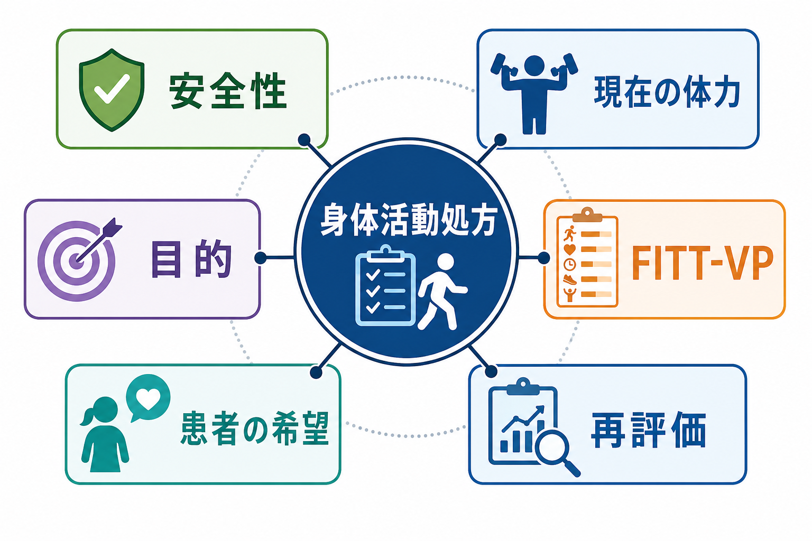
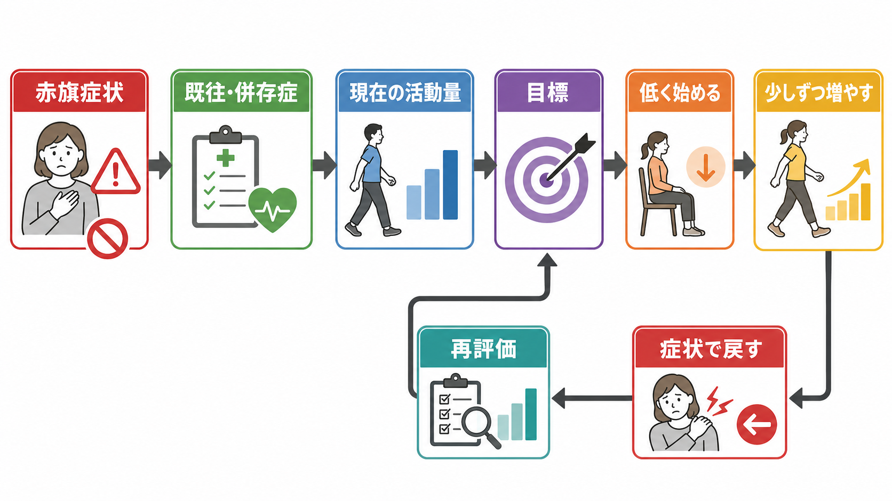

# 身体活動処方とは何か

## 要点

- 身体活動処方とは、「もっと運動しましょう」という一般的助言ではなく、評価、リスク確認、目標設定、FITT-VP、フォローアップを通じて、患者ごとに安全な活動量を決める臨床的手順である。
- 中心は、頻度 Frequency、強度 Intensity、時間 Time、種類 Type、総量 Volume、進め方 Progression を明示することである。これにより、何を、どのくらい、どの順番で増やすのかが共有される[1]。
- WHO や米国・日本の身体活動ガイドラインは、成人、高齢者、慢性疾患・障害のある人でも、能力と状態に合わせた身体活動が健康利益をもたらしうると整理している[2][3][4]。
- ただし、胸痛、失神、安静時息切れ、急な神経症状、感染後の強い倦怠、運動後増悪などがある場合は、標準的な増量ではなく医学的評価や専門職連携を優先する[5][6]。
- 精神医療では、身体活動処方は[[行動活性化とは何か|行動活性化]]、睡眠・生活リズム支援、疼痛・疲労へのリハビリテーション、慢性疾患管理と接続して使われる。

## この記事で答える問い

1. 身体活動処方は、一般的な運動指導と何が違うのか。
2. 安全な処方では、どの情報を評価し、どのように運動量を決めるのか。
3. 精神医療、慢性疾患、疼痛・疲労、リハビリテーションとどう接続するのか。

## まず結論

身体活動処方は、「理想的な運動量」を一方的に渡す手続きではない。患者の現在地から、症状を悪化させず、生活の中で続けられる最小限の一歩を決め、反応を見ながら調整する手続きである。

一般向けガイドラインでは、成人は中等度有酸素活動を週150-300分、または高強度活動を週75-150分、さらに週2日以上の筋力強化活動を目安にすることが多い[2][3]。しかし臨床では、この数値をそのまま開始量にしない。現在ほとんど動けていない人、痛みや息切れがある人、[[うつ病とは何か|うつ病]]で意欲と睡眠が崩れている人、高齢で転倒リスクがある人では、「座位時間を少し減らす」「5分歩く」「立ち上がりを1日数回入れる」といった開始点のほうが安全である。

したがって身体活動処方の実務は、目標値の提示よりも、個別化された調整である。安全性、現在の体力、症状、併存症、服薬、生活環境、患者の希望をそろえて見たうえで、FITT-VP を具体化し、フォローアップで上げる・維持する・下げるを判断する[1][5]。

## 背景

身体活動は、骨格筋によるエネルギー消費を伴う身体の動きであり、運動はその中でも計画的・構造化された反復的活動を指す。つまり、通勤、家事、階段、散歩、リハビリ、スポーツはすべて身体活動に含まれうるが、すべてが「運動」ではない[2][6]。

WHO の 2020 年ガイドラインは、身体活動が心血管疾患、2型糖尿病、一部のがん、メンタルヘルス、認知機能、全般的ウェルビーイングに関係することを整理し、「少しでも動くことは何もしないよりよい」「すべての身体活動が数えられる」という方向性を示した[2]。米国ガイドラインの JAMA 解説も、身体活動の利益を疾患予防だけでなく、気分、機能、睡眠、脳健康まで広く整理している[8]。日本の「健康づくりのための身体活動・運動ガイド2023」も、個人差を踏まえて強度や量を調整し、可能なものから取り組むことを強調している[4]。

一方、臨床現場では、身体活動を増やすことが常に単純な善とは限らない。心血管・代謝・腎疾患、転倒リスク、疼痛、摂食障害、躁状態、ME/CFS、感染後症状、妊娠・産後、薬剤性のふらつきなどでは、開始量や増やし方を誤ると害が出ることがある[5][6]。そのため、身体活動処方は健康教育であると同時に、リスク管理と共同意思決定の技法でもある。

## 基本概念

### 処方するのは「活動の条件」である

身体活動処方では、次の6要素を具体化する。

| 要素 | 問い | 例 |
|---|---|---|
| 頻度 | 週何回・1日何回行うか | 週3日、または毎日5分 |
| 強度 | どれくらいきついか | 会話できる程度、Borg 11-13、低強度から |
| 時間 | 1回何分か | 5分から開始し、安定すれば10分へ |
| 種類 | 何をするか | 歩行、椅子立ち上がり、ストレッチ、筋力練習 |
| 総量 | 週全体でどれくらいか | 合計30分、歩数、METs、セット数 |
| 進め方 | いつ増やすか | 症状が安定したら時間を少し増やす |

ACSM の運動処方では、有酸素、筋力、柔軟性、神経運動・バランスなど複数の構成要素を考えるが、臨床で最初に必要なのは「その人にとって安全に始められる最小単位」を決めることである[1]。

### 目標は「体力」だけではない

患者にとっての目標は、最大酸素摂取量や歩数だけではない。買い物に行ける、職場復帰の準備をする、睡眠リズムを整える、痛みを恐れず日常動作を戻す、子どもと公園に行くなど、生活上の意味をもつ目標が必要になる。

この点は、[[自己効力感とは何か|自己効力感]]とも関係する。高すぎる目標は失敗体験を増やし、低すぎる目標は変化を感じにくい。身体活動処方は、成功可能性と挑戦性の間にある小さな行動を設計する。

## 仕組み

身体活動処方の仕組みは、刺激と適応の単純な直線ではなく、負荷、回復、症状、学習、環境の循環である。

1. 低すぎる活動量が続くと、筋力・持久力・バランス・気分・睡眠が低下しやすい。
2. しかし急に増やすと、痛み、息切れ、疲労、転倒、不整脈、運動後増悪などが出ることがある。
3. そこで、現在の活動量を基準に、少しだけ上の負荷、または生活機能に直結する負荷を入れる。
4. 実施後の反応を記録し、安定していれば少し増やし、悪化すれば戻す。

ACSM の事前スクリーニングは、全員に一律の医学的検査を課すのではなく、現在の身体活動レベル、心血管・代謝・腎疾患や症状の有無、希望する運動強度を重視する方向へ整理されている[5]。これは、リスク確認を省略するという意味ではない。過剰な紹介で活動開始を妨げることを避けつつ、本当に注意すべき人を見落とさないための考え方である。

一次医療での短い助言でも、単に「運動してください」と伝えるだけでは不十分である。NICE は、不活動の成人に身体活動を勧める際、動機、目標、現在の活動量と能力、状況、好み、障壁、健康状態に合わせて助言し、可能なら書面化し、次の機会にフォローすることを推奨している[7]。

## 図解

図1は、身体活動処方の全体像を示す。中心には「身体活動処方」があり、周囲に安全性、現在の体力、目的、FITT-VP、患者の希望、再評価が置かれる。どれか一つだけでは処方にならない。

図2は、調整フローである。赤旗症状と既往・併存症を見て、現在の活動量と目標を確認し、低く始める。症状が安定すれば少しずつ増やし、悪化すれば戻す。ここで重要なのは、増やすことだけを成功とみなさないことである。維持や減量も、臨床的には正しい調整になりうる。

## 臨床・研究との接続

### 精神医療

精神医療では、身体活動処方は抑うつ、不安、睡眠障害、慢性疼痛、孤立、生活機能低下とつながる。[[精神疾患と生活リズム障害はどう関係するのか|生活リズム障害]]では、活動量、光曝露、起床時刻、人との予定が相互に関係する。活動を少し戻すことは、気分だけでなく、睡眠圧、日中の覚醒、社会参加にも影響しうる。

[[行動活性化とは何か|行動活性化]]との違いは、身体活動処方が身体リスク、強度、時間、進行速度をより明示的に扱う点である。両者は対立しない。たとえば「朝に5分歩く」は、気分改善を狙う行動活性化であると同時に、低強度有酸素活動の処方でもある。

### 慢性疾患とリハビリテーション

慢性疾患や障害のある成人でも、活動を能力に合わせれば安全に行える場合が多く、米国ガイドラインは個別化された身体活動計画と専門職への相談を推奨している[3]。糖尿病、高血圧、脂質異常症、変形性膝関節症などでは、身体活動は薬物療法や栄養療法の代替ではなく、慢性疾患管理の一部になる。[[糖尿病とうつ病はどう関係するのか|糖尿病とうつ病]]のように、身体疾患と気分症状が相互に影響する場合は、活動量、睡眠、食事、服薬、受診継続を一つの生活システムとして見る必要がある。

高齢者では、転倒予防、筋力、バランス、社会参加が重要になる。[[フレイルと精神症状はどう関係するのか|フレイル]]では、体重減少、疲労、筋力低下、歩行速度低下、身体活動低下が絡むため、栄養、薬剤、疼痛、抑うつ、認知機能と合わせて処方する。

### 疼痛・疲労

疼痛では、活動を避け続けると生活範囲が狭くなり、恐怖、抑うつ、筋力低下、睡眠障害が痛みを維持することがある。[[疼痛と精神疾患は脳内でどうつながるのか|疼痛と精神疾患]]を扱うとき、身体活動処方は「痛みを我慢して鍛える」ことではなく、痛みの反応を見ながら安全な動作経験を増やす手段である。

ただし、[[慢性疲労症候群とは何か|ME/CFS]] では特別な注意が必要である。NICE は、本人のエネルギー限界を超えて押し進めることや、固定的に活動量を増やす段階的運動療法を行わないよう推奨している[6]。この場合の身体活動支援は、増量よりもペーシング、悪化時の減量、専門チームとの連携が中心になる。

## よくある誤解

### 「ガイドラインの目標量をそのまま処方すればよい」

違う。週150分などの目安は、公衆衛生上の方向を示すものであり、開始量とは限らない。臨床では、現在の活動量、症状、体力、疾患、服薬、生活環境を見て、開始量を下げることが多い。

### 「運動は強いほど効果がある」

強度が高いほどよいとは限らない。低強度でも、座位時間の中断、日常生活動作の回復、睡眠リズムの改善、自己効力感の形成には意味がある。高強度運動は対象者と目的を選ぶ。

### 「安全確認をすると、患者の活動開始が遅れる」

安全確認は活動を止めるためだけの手続きではない。ACSM の更新された考え方は、不要な障壁を減らしつつ、症状や既知疾患、希望強度に応じて医学的評価や監督を使い分けるものである[5]。

### 「身体活動処方は精神医療と関係が薄い」

関係は深い。抑うつ、不安、睡眠、疼痛、孤立、認知機能、生活機能は、身体活動と双方向に関係する。ただし、身体活動だけで精神疾患を治すという意味ではない。薬物療法、心理療法、社会支援、睡眠支援、身体疾患管理と組み合わせる補助線である。

## 関連ノート

- [[行動活性化とは何か]]
- [[ヨガや呼吸法は精神医療でどう使われるのか]]
- [[自己効力感とは何か]]
- [[精神疾患と生活リズム障害はどう関係するのか]]
- [[疼痛と精神疾患は脳内でどうつながるのか]]
- [[慢性疲労症候群とは何か]]
- [[糖尿病とうつ病はどう関係するのか]]
- [[フレイルと精神症状はどう関係するのか]]

MOC更新候補: `content/00_MOC/` 配下の臨床実践、身体療法、生活習慣、リハビリテーション関連 MOC に追加する。

## 理解チェック

1. 身体活動処方で FITT-VP として明示する6要素は何か。
2. 「週150分」という目安を、現在ほとんど動けていない患者の開始量にしてはいけない理由は何か。
3. 活動量を増やすのではなく、維持または下げる判断が適切になるのはどのような場面か。
4. ME/CFS で固定的な段階的増量が問題になりうる理由は何か。

## 未解決問題

- 精神疾患ごとに、どの強度・頻度・形式の身体活動が、症状、生活機能、再発予防に最も適しているかは十分に個別化されていない。
- ウェアラブルデバイスによる歩数・心拍・睡眠データを、臨床判断にどう安全に統合するかは今後の課題である。
- 身体活動処方を、医師、理学療法士、作業療法士、看護師、心理職、運動指導者、地域資源の間でどう分担するかは、制度と地域差に左右される。
- 運動への罪悪感、強迫的運動、摂食障害、躁状態、トラウマ反応がある場合の処方設計には、より慎重な実践知が必要である。

## 参考文献

[1] Garber, C. E., Blissmer, B., Deschenes, M. R., Franklin, B. A., Lamonte, M. J., Lee, I. M., Nieman, D. C., & Swain, D. P.; American College of Sports Medicine. (2011). Quantity and quality of exercise for developing and maintaining cardiorespiratory, musculoskeletal, and neuromotor fitness in apparently healthy adults: Guidance for prescribing exercise. *Medicine & Science in Sports & Exercise*, 43(7), 1334-1359. https://doi.org/10.1249/MSS.0b013e318213fefb

[2] World Health Organization. (2020). *WHO guidelines on physical activity and sedentary behaviour*. World Health Organization. https://www.ncbi.nlm.nih.gov/books/NBK566045/

[3] U.S. Department of Health and Human Services. (2018). *Physical Activity Guidelines for Americans, 2nd edition*. https://odphp.health.gov/paguidelines/second-edition/pdf/Physical_Activity_Guidelines_2nd_edition.pdf

[4] 厚生労働省. (2023). 健康づくりのための身体活動・運動ガイド2023. https://www.mhlw.go.jp/stf/seisakunitsuite/bunya/kenkou_iryou/kenkou/undou/index.html

[5] Riebe, D., Franklin, B. A., Thompson, P. D., Garber, C. E., Whitfield, G. P., Magal, M., & Pescatello, L. S. (2015). Updating ACSM's recommendations for exercise preparticipation health screening. *Medicine & Science in Sports & Exercise*, 47(11), 2473-2479. https://doi.org/10.1249/MSS.0000000000000664

[6] National Institute for Health and Care Excellence. (2021). *Myalgic encephalomyelitis (or encephalopathy)/chronic fatigue syndrome: diagnosis and management* (NICE guideline NG206). https://www.nice.org.uk/guidance/ng206/chapter/recommendations

[7] National Institute for Health and Care Excellence. (2013). *Physical activity: brief advice for adults in primary care* (PH44). https://www.nice.org.uk/guidance/ph44/chapter/recommendations

[8] Piercy, K. L., Troiano, R. P., Ballard, R. M., Carlson, S. A., Fulton, J. E., Galuska, D. A., George, S. M., & Olson, R. D. (2018). The Physical Activity Guidelines for Americans. *JAMA*, 320(19), 2020-2028. https://doi.org/10.1001/jama.2018.14854
