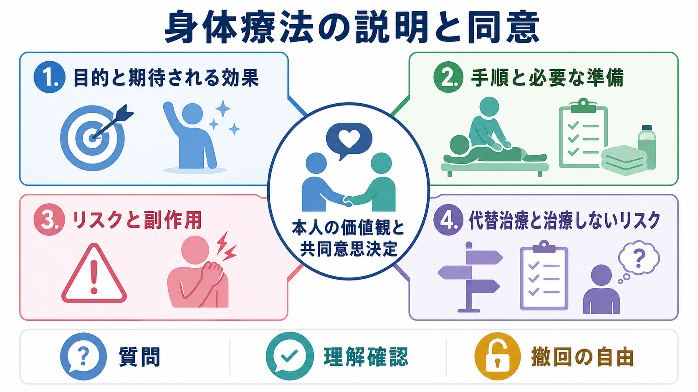
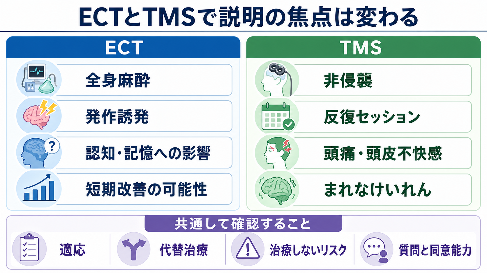

# 身体療法のインフォームドコンセントでは何を説明するか

## 要点

- 身体療法の同意説明では、「どんな治療か」だけでなく、目的、期待される効果、実施手順、個別リスク、代替治療、治療しないリスク、撤回の自由を一つの意思決定として扱う。
- [[修正型ECTとは何か|ECT]]では、全身麻酔、治療発作、認知・記憶への影響、身体合併症、治療しない場合の危険を具体的に説明する必要がある[2][3][4]。
- [[反復経頭蓋磁気刺激rTMSとは何か|rTMS/TMS]]では、非侵襲性、反復通院、短期効果の個人差、頭痛・頭皮不快感、まれなけいれん、機器・プロトコル差を説明する[5][6][7]。
- 説明は一方向の書類手続きではなく、患者本人の価値観、生活上の優先順位、家族・支援者の関与、同意能力、質問機会を含む[[共同意思決定とは何か|共同意思決定]]である[1]。

## この記事で答える問い

身体療法、特にECTやTMSを提案するとき、臨床家は何を、どの順番で、どの程度まで説明すればよいのか。この記事では、個別の診断・治療指示ではなく、教育・研究目的で説明項目の骨格を整理する。

## まず結論

説明の中心は、「この治療を受けるかどうかを本人が自分の価値観に照らして判断できる状態をつくること」である。AHRQのSHARE approachは、選択が存在することを示し、選択肢の利益と害を比較し、本人の価値観を確認し、決定し、後から見直すという流れを示している[1]。身体療法の同意説明もこの流れで組み立てると、治療の専門的説明が「受ける・受けない」の実際の判断に接続しやすくなる。

## 背景

精神科の身体療法は、薬物療法や心理療法とは異なる説明の難しさをもつ。ECTは全身麻酔下で治療発作を誘発する侵襲的な手続きであり、重症うつ病、緊張病、自殺リスク、治療抵抗性などで重要な選択肢になる一方、認知・記憶への影響を含むリスク説明が不可欠である[2][3][4]。TMSは通常、麻酔を必要としない非侵襲的な刺激法だが、反復セッションを要し、短期効果には個人差があり、まれなけいれんリスクや機器・刺激条件の差がある[5][6][7]。

したがって、身体療法の説明は「怖くない治療です」と安心させることでも、「危険です」と脅すことでもない。本人の症状の切迫度、これまでの治療歴、生活上の損失、治療への希望、避けたい副作用を並べ、治療を受ける場合と受けない場合の両方を比較できるようにする。

## 基本概念

### 説明する7項目

| 項目 | 説明する内容 | 身体療法での具体例 |
|---|---|---|
| 目的 | 何を改善したいのか | 抑うつ、緊張病、自殺リスク、機能低下など |
| 期待される効果 | どの程度・どの時間軸で期待するか | ECTは重症・緊急例で短期改善を期待しやすい。TMSは反復治療で反応を評価する |
| 手順 | 当日の流れ、回数、準備 | ECTの麻酔評価、TMSの刺激部位・治療回数 |
| リスク | よくある副作用と重大だがまれな有害事象 | ECTの認知・記憶、麻酔リスク。TMSの頭痛、頭皮不快感、けいれん |
| 個別要因 | 年齢、妊娠、身体疾患、薬剤、てんかん歴など | リスクが高まる条件、追加評価の必要性 |
| 代替治療 | 薬物療法、心理療法、入院、他の身体療法 | [[tDCSとは何か]]、[[迷走神経刺激療法VNSとは何か]]なども候補になりうる |
| 治療しないリスク | 先送り・不実施の影響 | 自殺リスク、脱水・拒食、機能低下、慢性化、家族負担 |

### 同意能力と支援

同意能力は「診断名があるかどうか」だけで決めない。説明を理解し、選択肢を比較し、自分の状況に引きつけて考え、意思を表明できるかを確認する。症状が重くても、理解しやすい資料、短い説明、繰り返し、家族・支援者・患者アドボケイトの関与によって意思決定を支えられる場合がある。NICEのECTガイダンスも、有効な同意、圧力のない説明、撤回の権利、支援者の関与を重視している[2]。

## 仕組み

### ECTで説明の焦点になること

ECTでは、治療効果の可能性と同時に、麻酔、発作誘発、認知・記憶への影響を明確に説明する。現代の修正型ECTは全身麻酔と筋弛緩下で行われるが、手続きとしては身体合併症、麻酔リスク、治療後の混乱、頭痛・筋肉痛、記憶への影響を伴いうる[3]。特に記憶については、「一時的にぼんやりする」だけでは不十分で、新しいことを覚えにくくなること、自伝的記憶が抜けること、個人差が大きいこと、治療条件によってリスクが変わることを説明する[4]。

また、ECTを提案する場面では、本人がすでに重大な危険にさらされていることがある。重症うつ病、緊張病、拒食・脱水、強い自殺リスクでは、治療をしないこと自体もリスクである。したがって、説明では「ECTのリスク」と「ECTを避けるリスク」を同じ表の中で比較する。

### TMSで説明の焦点になること

TMSは頭皮上のコイルから磁場パルスを与え、皮質と関連ネットワークの興奮性に影響を与える治療である。通常は麻酔を要さず、外来で反復して行える点がECTと大きく異なる。ただし、NICEは短期有効性の根拠はある一方で反応は可変的であり、同意過程では他の治療選択肢と、効果が得られない可能性を説明すべきだとしている[5]。

安全性については、頭痛、頭皮痛、不快感、めまい、聴覚保護、金属・植込み機器、薬剤、睡眠不足、てんかん歴などを確認する。TMS誘発けいれんは重大な急性有害事象だが、標準的条件と適切なスクリーニングのもとでは非常に低頻度とされる[6]。このため説明では、「非侵襲だからリスクがない」ではなく、「リスクは比較的低いが、スクリーニングと手順遵守が必要」と伝える。

## 図解

上の1枚目は、身体療法の同意説明を「目的・効果」「手順」「リスク」「代替治療と治療しないリスク」の4領域に分け、中心に本人の価値観と共同意思決定を置いた図である。2枚目は、ECTとTMSで説明の焦点が異なることを示している。ECTでは麻酔、発作誘発、認知・記憶への影響を厚めに扱い、TMSでは非侵襲性、反復セッション、局所的な不快感、まれなけいれんを扱う。

## 臨床・研究との接続

実務では、説明を一度で完結させないほうがよい。初回説明、書面・動画などの補助資料、質問時間、家族・支援者との面談、実施直前の再確認、治療中の副作用評価、治療後の振り返りを分ける。特にECTでは認知機能・記憶のベースラインと経時変化を確認し、TMSでは刺激条件、セッション回数、併用治療、反応評価の時点を記録する[4][6][7]。

研究や質改善では、同意書の有無だけでなく、本人がどのような利益・リスク・代替案を理解したか、どの価値観が決定に影響したか、後から撤回や方針変更が可能だったかを評価する必要がある。これは、身体療法の安全性研究だけでなく、治療への納得感、アドヒアランス、治療後の後悔を減らす実装研究にもつながる。

## よくある誤解

### 「同意書に署名すればインフォームドコンセントは終わり」

署名は記録であって、同意そのものではない。選択肢を理解し、質問でき、圧力なく選べ、後から見直せることが中核である[1][2]。

### 「ECTは危険だから最後まで説明を避けるべき」

ECTには重要なリスクがあるが、重症・緊急例では治療しないリスクも大きい。説明を避けるのではなく、[[ECTの適応はどう判断するか]]、[[ECTの副作用には何があるのか]]と接続して、リスクと利益を具体化する。

### 「TMSは非侵襲なので同意説明は簡単でよい」

TMSはECTより身体的負担が少ないことが多いが、効果の個人差、反復通院、費用・時間、頭痛・頭皮不快感、まれなけいれんを説明する必要がある[5][6]。

### 「本人が迷うなら医療者が決めたほうが親切」

迷いは意思決定の失敗ではない。迷いの内容を、効果への期待、副作用への不安、生活上の制約、家族関係、過去の治療経験に分解すると、説明不足なのか、価値観の葛藤なのか、同意能力支援が必要なのかが見えやすくなる。

## 関連ノート

- [[修正型ECTとは何か]]
- [[ECTの適応はどう判断するか]]
- [[ECTの副作用には何があるのか]]
- [[反復経頭蓋磁気刺激rTMSとは何か]]
- [[シータバースト刺激とは何か]]
- [[tDCSとは何か]]
- [[迷走神経刺激療法VNSとは何か]]
- [[インフォームドコンセントは精神科でどう行うのか]]
- [[意思決定能力とは何か]]
- [[意思決定支援とは何か]]

### MOC更新候補

- `content/00_MOC/` 配下の臨床実践・治療、神経調節、精神科治療に関するMOCへ追加候補。
- 並列生成ジョブとの競合を避けるため、このタスクではMOCファイル自体は更新しない。

## 理解チェック

1. ECTの説明で、麻酔や発作誘発だけでなく認知・記憶への影響を具体的に扱う必要があるのはなぜか。
2. TMSの同意説明で、「効果が得られない可能性」を明示する必要があるのはなぜか。
3. 身体療法のリスク説明に「治療しないリスク」を含めるべき理由は何か。
4. 同意能力が揺らぐ場面で、本人の意思決定を支援する方法には何があるか。

## 未解決問題

- ECT後の自伝的記憶の変化を、臨床現場でどの程度標準化して測定できるか。
- TMSの刺激プロトコル差、機器差、個別脳ネットワーク差を、同意説明でどこまで平易に伝えるべきか。
- 患者本人、家族、医療者がリスクを異なって評価する場合、どのような意思決定支援が後悔を減らすか。
- 救急・非自発入院・緊張病など、時間的余裕が乏しい状況で、同意説明の質をどう担保するか。

## 参考文献

[1] Agency for Healthcare Research and Quality. *The SHARE Approach*. https://www.ahrq.gov/sdm/share-approach/index.html

[2] National Institute for Health and Care Excellence. *Guidance on the use of electroconvulsive therapy* (TA59). 2003, updated 2009. https://www.nice.org.uk/guidance/ta59/chapter/1-Guidance

[3] Thirthalli, J., Sinha, P., & Sreeraj, V. S. (2023). Clinical Practice Guidelines for the Use of Electroconvulsive Therapy. *Indian Journal of Psychiatry*, 65(2), 258-269. https://doi.org/10.4103/indianjpsychiatry.indianjpsychiatry_491_22

[4] Porter, R. J., Baune, B. T., Morris, G., et al. (2020). Cognitive side-effects of electroconvulsive therapy: what are they, how to monitor them and what to tell patients. *BJPsych Open*, 6(3), e40. https://doi.org/10.1192/bjo.2020.17

[5] National Institute for Health and Care Excellence. *Repetitive transcranial magnetic stimulation for depression* (IPG542/HTG396). 2015. https://www.nice.org.uk/guidance/ipg542/chapter/1-Recommendations

[6] Rossi, S., Antal, A., Bestmann, S., et al. (2021). Safety and recommendations for TMS use in healthy subjects and patient populations, with updates on training, ethical and regulatory issues: Expert Guidelines. *Clinical Neurophysiology*, 132(1), 269-306. https://doi.org/10.1016/j.clinph.2020.10.003

[7] Perera, T., George, M. S., Grammer, G., et al. (2016). The Clinical TMS Society Consensus Review and Treatment Recommendations for TMS Therapy for Major Depressive Disorder. *Brain Stimulation*, 9(3), 336-346. https://doi.org/10.1016/j.brs.2016.03.010
