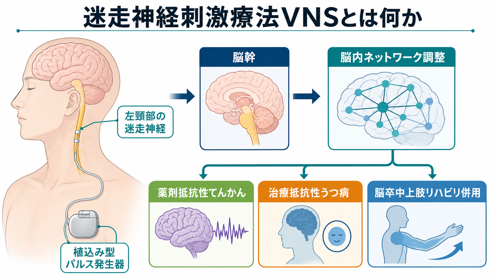
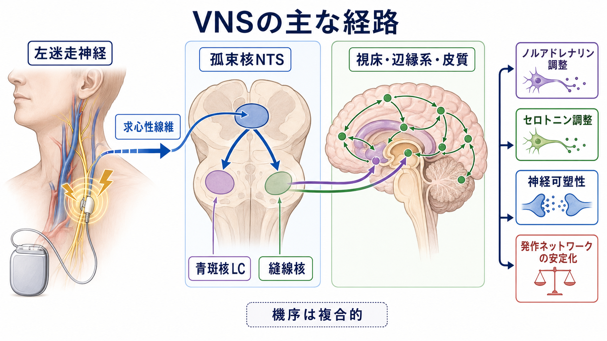
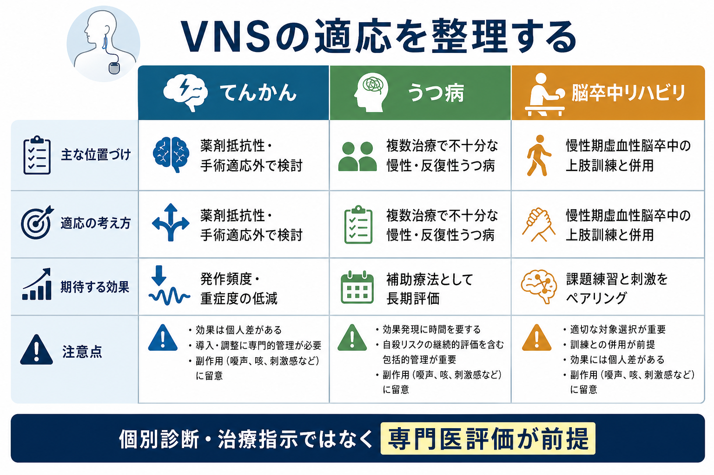

# 迷走神経刺激療法VNSとは何か

## 要点

- 迷走神経刺激療法（vagus nerve stimulation: VNS）は、主に左頸部の迷走神経を電気刺激し、孤束核、青斑核、縫線核、視床、辺縁系、皮質へ広がる神経調節系に働きかける治療法である [1]。
- 確立した中心的適応は、薬剤抵抗性てんかんに対する補助療法であり、発作を完全になくす治療というより、発作頻度・重症度・生活上の負担を下げる治療として理解する [2]。
- 米国では、治療抵抗性うつ病に対する補助療法としても承認されているが、短期効果は一貫せず、長期・慢性例を対象に慎重に評価されてきた [5], [6], [7]。
- 2021年以降、慢性期虚血性脳卒中の中等度から重度の上肢麻痺に対し、リハビリテーション課題とペアリングして使う植込み型 VNS も承認されている [3], [4]。
- 非侵襲的な経皮的耳介迷走神経刺激（taVNS）などは研究・開発が進むが、植込み型 VNS と同じ適応・効果として扱ってはいけない [8]。

## この記事で答える問い

1. VNS は、迷走神経を刺激して脳に何をしているのか。
2. てんかん、うつ病、脳卒中リハビリでは、適応の考え方がどう違うのか。
3. VNS を「自律神経を整える治療」とだけ説明すると、何が抜け落ちるのか。
4. 研究知見を臨床判断に使うとき、どの限界に注意すべきか。

## まず結論

VNS は、迷走神経という末梢神経を入口にして、脳幹の孤束核を経由し、ノルアドレナリン系、セロトニン系、視床・辺縁系・皮質ネットワークへ広く影響する神経調節療法である [1]。したがって、VNS は単なる「リラックス神経の刺激」ではなく、発作ネットワーク、気分調整ネットワーク、運動学習・可塑性に関わる広域調整として理解するほうが正確である。

ただし、臨床上の位置づけは疾患ごとにかなり違う。薬剤抵抗性てんかんでは、てんかん外科・薬物療法・生活支援と組み合わせる補助療法として比較的長い経験がある [2]。治療抵抗性うつ病では、承認や研究はあるものの、短期試験だけで強い結論を出しにくく、慢性・反復性の重症例で長期的に評価する治療として読む必要がある [5], [6], [7]。脳卒中では、単独刺激ではなく、上肢訓練中の特定の動作と刺激を同期させて神経可塑性を促すという発想が中心である [3], [4]。

## 背景

迷走神経は第10脳神経で、内臓感覚、自律神経調整、咽喉頭機能などに関わる。臨床用の植込み型 VNS では、通常は左頸部の迷走神経に電極を巻き、胸部皮下のパルス発生器から間欠的に刺激を送る。左側がよく用いられるのは、右迷走神経が心臓の洞結節機能により関わるため、徐脈や不整脈リスクを相対的に避ける意図がある [1]。

VNS が注目される理由は、末梢神経への刺激でありながら、脳幹から広範な脳ネットワークに届く点にある。これは[[自律神経ネットワークは内臓状態をどう制御するのか|自律神経ネットワーク]]、[[脳内ネットワークとは何か|脳内ネットワーク]]、[[神経可塑性は発達と学習をどう支えるのか|神経可塑性]]をつなぐ治療概念でもある。

## 基本概念

### 植込み型 VNS

植込み型 VNS は、電極、リード、パルス発生器からなる医療機器を体内に留置し、設定された刺激条件で迷走神経を刺激する。てんかんや治療抵抗性うつ病では、日常生活の中で周期的に刺激する使い方が基本である。脳卒中リハビリでは、動作練習のタイミングに合わせて短い刺激を入れる「ペアリング」が中心になる [3], [4]。

### 非侵襲的 VNS

非侵襲的 VNS には、耳介の迷走神経枝を刺激する taVNS や、頸部から刺激する経皮的手法がある。外科的侵襲がない利点は大きいが、刺激部位、到達する神経線維、刺激条件、臨床エビデンスは植込み型 VNS と同一ではない。taVNS の安全性レビューでは、比較的軽微な有害事象が中心とされる一方、研究間の刺激条件や対象疾患のばらつきが大きい [8]。

## 仕組み

VNS の機序は単一ではない。頸部迷走神経には求心性線維が多く、刺激は孤束核（nucleus tractus solitarius: NTS）に入り、そこから青斑核、縫線核、視床、扁桃体、海馬、前頭前野、島皮質などへ投射・間接投射する [1]。この経路により、ノルアドレナリン、セロトニン、GABA、グルタミン酸、炎症系、可塑性関連機構などが複合的に変化すると考えられている。

てんかんでは、異常な同期活動や発作伝播を抑える方向に、皮質・辺縁系・視床ネットワークの興奮性を調整するという説明がよく用いられる [1], [2]。うつ病では、前頭前野、辺縁系、モノアミン系、覚醒・情動調整に関わる回路を長期的に変える可能性が議論されている [5], [6]。脳卒中リハビリでは、動作練習の直後・最中に VNS を組み合わせることで、課題特異的な皮質再編を促すという仮説が中心である [4]。

## 図解

VNS の臨床応用は、同じ「迷走神経刺激」という名称でも、目的と評価指標が異なる。

| 領域 | 主な位置づけ | 期待する効果 | 読み方の注意 |
|---|---|---|---|
| 薬剤抵抗性てんかん | 薬物療法で不十分、切除手術が難しい場合などに検討される補助療法 | 発作頻度、重症度、発作後回復、QOL の改善 | 完全寛解よりも長期的な発作負担低減として評価する [2] |
| 治療抵抗性うつ病 | 複数治療で十分改善しない慢性・反復性うつ病への補助療法 | 長期的な反応・部分反応、機能改善 | 短期主要評価項目で陰性の研究もあり、効果判定は慎重に読む [5], [6] |
| 慢性期脳卒中リハビリ | 上肢訓練と刺激をペアリングする医療機器治療 | Fugl-Meyer 上肢スコアなどの運動機能改善 | 刺激単独ではなく、訓練設計と対象選択が治療の中核 [3], [4] |
| 非侵襲的 VNS | 研究・開発が進む低侵襲手法 | 自律神経、気分、疼痛、認知などへの可能性 | 植込み型の適応をそのまま外挿しない [8] |

## 臨床・研究との接続

### てんかん

薬剤抵抗性てんかんでは、VNS は発作を「切除」する治療ではなく、発作ネットワークを長期に調整する補助療法として位置づけられる。AAN のガイドライン更新では、小児、Lennox-Gastaut 症候群、成人てんかん患者の気分改善、時間経過に伴う有効性増加について、いずれも Level C の推奨として整理された [2]。このため、[[てんかんに伴う精神症状とは何か|てんかんに伴う精神症状]]や薬剤選択、てんかん外科評価、生活上の安全対策と切り離さずに考える必要がある。

### 治療抵抗性うつ病

VNS は[[うつ病とは何か|うつ病]]の一般的な初期治療ではない。2005年の急性期ランダム化比較試験では、主要評価項目である HRSD 反応率に明確な有意差は示されず、短期効果だけでは決定的とは言いにくかった [5]。一方、2025年に出版された 12か月の多施設二重盲検試験では、MADRS 反応時間という主要評価項目では群間差が出なかったが、CGI-I、QIDS-SR、QIDS-C など複数の評価では active VNS に有利な所見が報告された [6]。CMS も、治療抵抗性うつ病の VNS を Coverage with Evidence Development の枠組みで扱っており、承認済み機器であってもエビデンス生成と結びつけて評価されている [7]。

この領域では、[[薬物療法のリスクベネフィットをどう考えるか|薬物療法のリスクベネフィット]]、[[ECTの適応はどう判断するか|ECT]]、[[反復経頭蓋磁気刺激rTMSとは何か|rTMS]]、心理療法、社会機能支援を含めた治療歴の整理が欠かせない。

### 脳卒中リハビリ

脳卒中リハビリでの VNS は、脳刺激を課題練習に結びつける応用である。VNS-REHAB 試験では、慢性期虚血性脳卒中後の中等度から重度の上肢障害を対象に、6週間の通院リハビリと家庭練習を組み合わせ、active VNS 群が sham 群より上肢運動機能の改善を示した [4]。FDA の Vivistim System 承認も、慢性期虚血性脳卒中患者の上肢運動機能改善を目的として、リハビリ中に迷走神経を刺激する機器として位置づけている [3]。

ここで重要なのは、VNS が訓練を代替するのではなく、訓練効果を増強する補助として設計されている点である。したがって、適応判断には、麻痺の程度、発症からの期間、課題練習への参加可能性、植込み手術リスク、リハビリ資源が関わる。

## 安全性と限界

植込み型 VNS では、手術関連リスク、感染、疼痛、嗄声、咳、咽喉頭違和感、呼吸苦、睡眠時無呼吸への影響、機器管理、MRI 対応などを確認する必要がある [2], [3], [6]。てんかん領域では、小児の植込み部感染リスクへの注意も示されている [2]。うつ病領域では、自殺リスクや慢性経過の評価を継続し、VNS だけに治療計画を委ねないことが重要である [6], [7]。

非侵襲的 VNS は外科的リスクが少ない一方で、刺激条件、偽刺激、盲検化、アウトカム、対象疾患が研究ごとに異なりやすい。安全性レビューは比較的良好な忍容性を示すが、疾患ごとの有効性まで一括して保証するものではない [8]。

## よくある誤解

### 「迷走神経を刺激するので、リラックス効果が主作用である」

VNS は副交感神経の単純な増強ではない。頸部迷走神経の求心性入力を介し、脳幹、モノアミン系、皮質・辺縁系ネットワークに影響する治療である [1]。リラックス、心拍変動、自律神経という言葉だけでは、てんかんや運動可塑性への作用を説明できない。

### 「VNS は発作やうつ病を治癒させる」

VNS は補助療法として読むべきである。てんかんでは発作頻度の大幅減少が治療目標になることが多いが、完全な発作消失を保証するものではない [2]。うつ病でも、慢性・重症例での長期的な反応や部分反応を含めて評価する必要がある [5], [6]。

### 「耳を刺激する taVNS と植込み型 VNS は同じである」

同じ迷走神経系を狙う発想は共有するが、刺激部位、線維の動員、刺激量、臨床適応、規制上の位置づけは異なる。taVNS の研究結果を、植込み型 VNS の承認適応や効果にそのまま置き換えるのは不適切である [8]。

### 「脳卒中リハビリでは、刺激だけで回復する」

脳卒中リハビリでの VNS は、動作練習と刺激のペアリングが中心である [3], [4]。刺激そのものより、どの課題を、どの頻度で、どのタイミングで刺激と結びつけるかが治療設計の要点になる。

## 関連ノート

- [[反復経頭蓋磁気刺激rTMSとは何か]]
- [[tDCSとは何か]]
- [[ECTの適応はどう判断するか]]
- [[てんかんに伴う精神症状とは何か]]
- [[うつ病とは何か]]
- [[脳内ネットワークとは何か]]
- [[自律神経ネットワークは内臓状態をどう制御するのか]]
- [[神経可塑性は発達と学習をどう支えるのか]]

### 関連ノート候補

- 薬剤抵抗性てんかんとは何か
- 治療抵抗性うつ病とは何か
- 経皮的耳介迷走神経刺激taVNSとは何か
- 脳卒中後上肢リハビリテーションとは何か
- 迷走神経と内受容感覚はどう関係するのか

### MOC更新候補

- `content/00_MOC/MOC・臨床実践・治療.md` の神経調節・身体療法項目に追加する。
- `content/00_MOC/MOC・脳・神経科学.md` から、迷走神経、自律神経、脳幹ネットワークの入口として参照する。

## 理解チェック

1. VNS の刺激が、左頸部の迷走神経から孤束核を経由して広域脳ネットワークに届くと考えられる理由は何か。
2. てんかん、治療抵抗性うつ病、脳卒中リハビリでは、同じ VNS でも評価すべきアウトカムがどう違うか。
3. taVNS の研究結果を、植込み型 VNS の臨床適応にそのまま外挿してはいけない理由は何か。
4. 脳卒中リハビリで「刺激と課題練習のペアリング」が重要になるのはなぜか。
5. VNS を説明するとき、「副交感神経を整える」という言い方だけでは不足する理由は何か。

## 未解決問題

- どの神経線維、刺激条件、脳ネットワーク変化が臨床反応を最もよく予測するのか。
- てんかん、うつ病、リハビリで、反応者を事前に選別できるバイオマーカーはあるのか。
- 植込み型 VNS と非侵襲的 VNS の効果差を、刺激量・標的・神経生理指標でどこまで比較できるのか。
- 長期使用における治療継続、機器交換、費用対効果、患者負担をどう評価するのか。

## 参考文献

[1] Fanselow, E. E. (2012). Central mechanisms of cranial nerve stimulation for epilepsy. *Surgical Neurology International*, 3(Suppl 4), S247-S254. https://doi.org/10.4103/2152-7806.103015

[2] Morris, G. L. III, Gloss, D., Buchhalter, J., Mack, K. J., Nickels, K., & Harden, C. (2013). Evidence-based guideline update: Vagus nerve stimulation for the treatment of epilepsy. *Neurology*, 81(16), 1453-1459. https://doi.org/10.1212/WNL.0b013e3182a393d1

[3] U.S. Food and Drug Administration. (2021). Devices@FDA: Vivistim System, PMA P210007. https://www.accessdata.fda.gov/scripts/cdrh/devicesatfda/index.cfm?db=pma&id=P210007

[4] Dawson, J., Liu, C. Y., Francisco, G. E., et al. (2021). Vagus nerve stimulation paired with rehabilitation for upper limb motor function after ischaemic stroke (VNS-REHAB): A randomised, blinded, pivotal, device trial. *The Lancet*, 397(10284), 1545-1553. https://doi.org/10.1016/S0140-6736(21)00475-X

[5] Rush, A. J., Marangell, L. B., Sackeim, H. A., et al. (2005). Vagus nerve stimulation for treatment-resistant depression: A randomized, controlled acute phase trial. *Biological Psychiatry*, 58(5), 347-354. https://doi.org/10.1016/j.biopsych.2005.05.025

[6] Conway, C. R., Aaronson, S. T., Sackeim, H. A., et al. (2025). Vagus nerve stimulation in treatment-resistant depression: A one-year, randomized, sham-controlled trial. *Brain Stimulation*, 18(3), 676-689. https://doi.org/10.1016/j.brs.2024.12.1191

[7] Centers for Medicare & Medicaid Services. (2019, updated 2024). Vagus Nerve Stimulation (VNS) for Treatment Resistant Depression (TRD). https://www.cms.gov/medicare/coverage/evidence/vagus-nerve-stimulation

[8] Kim, A. Y., Marduy, A., de Melo, P. S., et al. (2022). Safety of transcutaneous auricular vagus nerve stimulation (taVNS): A systematic review and meta-analysis. *Scientific Reports*, 12, 22055. https://doi.org/10.1038/s41598-022-25864-1
