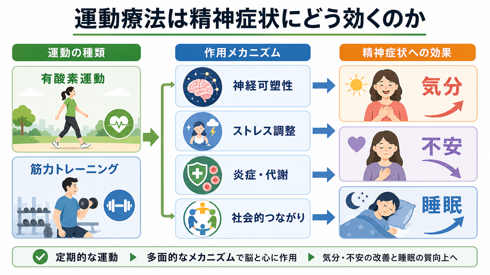
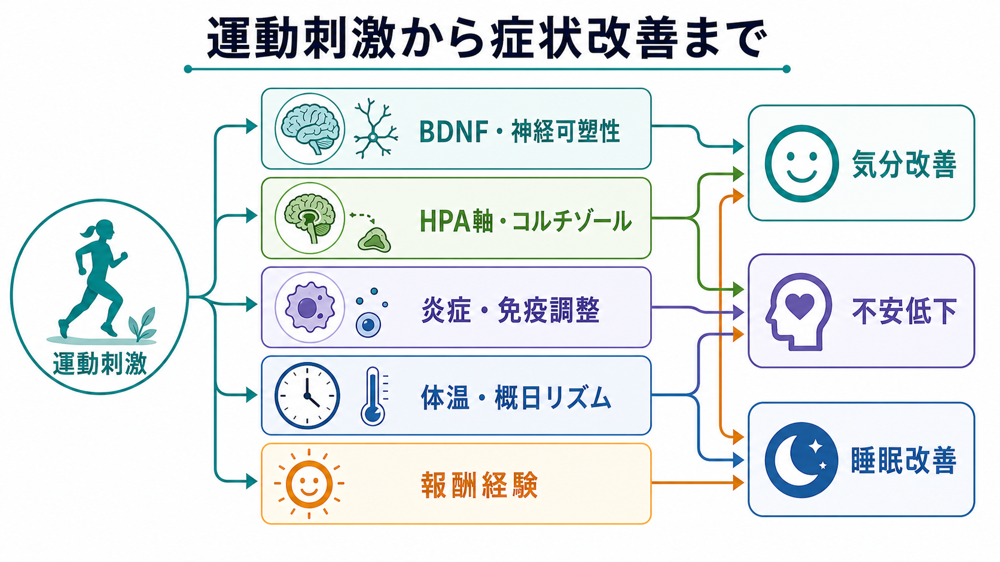
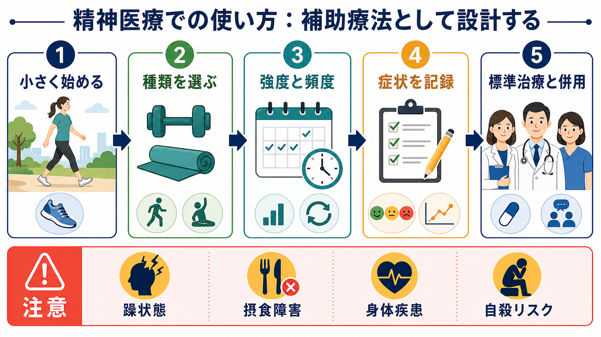

# 運動療法は精神症状にどう効くのか

## 要点

- 運動療法は、単なる「気晴らし」ではなく、神経可塑性、ストレス反応、炎症・代謝、体温・概日リズム、報酬経験、社会的つながりに同時に作用する補助療法として理解できる。
- 成人では、WHO が週 150-300 分の中等度有酸素活動、または週 75-150 分の高強度活動、さらに筋力強化活動を推奨しており、身体活動は抑うつ・不安症状の軽減とも関連する [1]。
- うつ病に対する運動のネットワークメタ解析では、ウォーキング・ジョギング、ヨガ、筋力トレーニング、混合有酸素運動などが活動対照より抑うつを減らした。ただし研究の盲検化や期待効果の問題から、確信度には幅がある [2]。
- 不安と睡眠にも効果は期待できるが、診断名、重症度、併存する身体疾患、躁状態、自殺リスク、摂食障害などによって設計を変える必要がある [4][5][8]。
- 本稿は教育・研究目的の整理であり、個別の診断や治療指示ではない。実施可否や強度は、主治医・理学療法士・運動指導者などと相談して決める。

## この記事で答える問い

1. 有酸素運動や筋力トレーニングは、気分・不安・睡眠にどのような効果をもつのか。
2. 運動の効果は、脳内物質だけで説明できるのか。
3. 精神医療のなかで、運動療法をどのように「補助療法」として位置づけるべきか。
4. どのような場合に注意や中止判断が必要なのか。

## まず結論

運動療法は、[[うつ病とは何か|うつ病]]、不安症状、睡眠困難に対して、薬物療法や心理療法を置き換える万能手段ではない。しかし、身体活動量の低下、睡眠リズムの乱れ、社会的孤立、自己効力感の低下、炎症・代謝異常が絡み合うケースでは、治療全体を支える「基盤介入」になりうる。

効果の中心は「運動した直後に気分が晴れる」ことだけではない。数週間から数か月の継続によって、身体感覚、睡眠圧、体温リズム、報酬経験、対人接触、自己効力感が少しずつ変わり、結果として気分・不安・睡眠に波及する。これは[[行動活性化とは何か|行動活性化]]や[[認知行動療法CBTとは何か|認知行動療法]]の行動面とも重なる。

## 背景

精神症状が強い時期には、活動量が落ちる。活動量が落ちると、日中の光曝露、睡眠圧、社会的接触、達成感、食欲・代謝、身体感覚への信頼がさらに低下する。この循環は、抑うつ、不安、睡眠障害を維持しやすい。

一方で、身体活動は心血管・代謝への効果だけでなく、抑うつ・不安症状やウェルビーイングにも関係する。WHO ガイドラインは、成人・高齢者・慢性疾患や障害のある人を含め、可能な範囲で身体活動を増やすことを推奨している [1]。NICE の成人うつ病ガイドラインも、身体活動がウェルビーイングを高めうること、うつ病向けに設計されたグループ運動が治療選択肢の一部になりうることを示している [8]。

ただし、ここでいう運動療法は「根性で外に出る」ことではない。臨床的には、本人の安全、症状、身体疾患、服薬、生活文脈、好み、継続可能性に合わせて、負荷を最小単位から調整する介入である。

## 基本概念

### 身体活動・運動・運動療法

身体活動は、仕事・家事・移動・余暇を含む筋活動全般を指す。運動は、そのなかでも体力や健康の維持・改善を目的として計画された活動である。運動療法は、治療・リハビリテーション・再発予防・生活機能改善の目的で、種類、頻度、強度、時間、進め方を設計する介入である。

精神医療で扱う運動療法には、ウォーキング、ジョギング、サイクリング、水泳などの有酸素運動、筋力トレーニング、ヨガ、太極拳、ストレッチ、集団プログラムなどが含まれる。強度は「少し息が上がる」「会話はできるが歌うのは難しい」程度から始めることが多いが、これは一般的な目安であって、個別の処方ではない。

### 気分・不安・睡眠への焦点

気分への効果は、抑うつ気分、興味・喜びの低下、疲労感、自己効力感の低下に関係する。不安への効果は、過覚醒、身体感覚への恐怖、回避、緊張、心配の反復に関係する。睡眠への効果は、睡眠圧、体温低下、概日リズム、日中活動量、反すうの減少に関係する。

これらは別々の症状に見えるが、実際には相互に結びついている。睡眠が崩れると不安と抑うつが強まり、不安が強いと活動回避が進み、活動回避が進むと睡眠圧と報酬経験が減る。運動療法は、この循環に複数の入口から働きかける。

## 仕組み

### 1. 神経可塑性と BDNF

運動は、脳由来神経栄養因子 BDNF、血管新生、シナプス可塑性、海馬や前頭前野の機能と関連する。抑うつでは神経可塑性の低下が仮説の一つとして議論されており、運動はこの脆弱性に対して、単一の神経伝達物質ではなく、複数の可塑性経路を通じて働く可能性がある [6][7]。

ただし、「運動すれば BDNF が上がるから治る」と単純化してはいけない。ヒト研究では測定指標、運動様式、年齢、薬物療法、睡眠、炎症状態が影響する。BDNF は有力な経路の一つだが、臨床効果のすべてを説明するものではない。

### 2. HPA 軸とストレス調整

ストレスが慢性化すると、[[HPA軸は精神疾患にどう関わるのか|HPA軸]]、自律神経、睡眠、免疫反応が相互に乱れやすい。運動は短期的には身体へのストレス刺激だが、適切な負荷で反復されると、ストレス反応への耐性、コルチゾールの日内リズム、身体感覚への予測可能性に影響する可能性がある [6][7]。

この点は不安症状にも重要である。動悸、息切れ、発汗、筋緊張を「危険な兆候」と解釈しやすい人では、運動中の身体感覚が不安を誘発することもある。一方で、段階的に安全な身体感覚として経験し直すと、身体感覚への恐怖や回避が弱まることがある。

### 3. 炎症・代謝・身体合併症

抑うつには、慢性低度炎症、肥満、糖代謝異常、心血管リスク、睡眠障害が重なることが多い。運動は筋・脂肪組織・免疫・代謝に作用し、炎症マーカーや代謝状態を介して精神症状に間接的に影響する可能性がある [6]。

精神科薬物療法、とくに一部の抗精神病薬や気分安定薬では体重増加や代謝リスクが問題になる。したがって運動療法は、精神症状だけでなく[[身体健康管理支援とは何か|身体健康管理支援]]としても意味をもつ。

### 4. 体温・概日リズム・睡眠圧

睡眠への効果は、夜に疲れれば眠れるという単純な話ではない。日中の活動量、光曝露、体温上昇とその後の低下、覚醒リズム、反すうの減少が関係する。運動の睡眠メタ解析では、睡眠の質や不眠重症度に改善が示されたが、研究数やバイアスの問題もあり、効果の確実性は高くない [5]。

臨床的には、[[不眠症の認知行動療法CBT-Iとは何か|CBT-I]] と同じく、睡眠を直接コントロールしようとするより、日中のリズム、活動、光、寝床との関係を整える視点が重要になる。夕方以降の高強度運動が覚醒を上げる人もいるため、時間帯は個別に調整する。

### 5. 報酬経験・自己効力感・社会的つながり

運動療法の心理社会的効果は見落とされやすい。短い散歩、軽い筋トレ、集団プログラムへの参加は、「何もできない」という予測に反する経験を作る。小さな達成、身体感覚の変化、他者との接触、予定を守れた感覚は、自己効力感や報酬学習を回復させる [6]。

これは、運動そのものの生理作用とは別に、生活のなかの強化子を増やす作用である。そのため、継続できないほど高い目標よりも、本人が「これならできた」と観察できる最小単位が重要になる。

## 図解

上の 1 枚目は、運動の種類、作用メカニズム、気分・不安・睡眠への効果をまとめた概念地図である。2 枚目は、運動刺激が神経可塑性、HPA 軸、炎症・免疫、体温・概日リズム、報酬経験を経て症状改善に接続する流れを示している。

次の 3 枚目は、精神医療での使い方を示す。ポイントは、運動を「標準治療の代わり」にしないこと、症状を記録すること、リスクがあるときは調整または中止することである。

## 臨床・研究との接続

うつ病については、2024 年のネットワークメタ解析が 218 研究、14,170 人を対象に、運動様式ごとの効果を比較した。ウォーキング・ジョギング、ヨガ、筋力トレーニング、混合有酸素運動、太極拳・気功はいずれも活動対照より抑うつを減らし、処方された強度が高いほど効果が大きい傾向も示された [2]。筋力トレーニング単独についても、33 RCT、1,877 人のメタ解析で抑うつ症状の低下が報告されている [3]。

不安については、診断された不安症に対する有酸素運動メタ解析、筋力トレーニングの不安メタ解析、若年成人 RCT などがあり、総じて不安症状を軽減しうる。ただし、不安症の種類、身体感覚への恐怖、回避の強さ、集団参加への抵抗によって導入方法は変わる [4]。

睡眠については、不眠を対象にした運動介入のメタ解析で、主観的睡眠の質と不眠重症度の改善が報告された。一方、睡眠効率など一部アウトカムでは明確でなく、研究の質にも限界がある [5]。睡眠を主訴とする場合は、運動だけでなく、睡眠日誌、刺激制御、睡眠制限、光、カフェイン、服薬、睡眠時無呼吸などの評価が必要である。

実践では、[[身体活動処方とは何か|身体活動処方]]として、以下を確認してから始める。

| 観点 | 確認すること |
|---|---|
| 目的 | 気分改善、不安低下、睡眠改善、体力回復、生活リズム、身体合併症予防のどれを主目的にするか |
| 種類 | 歩行、有酸素運動、筋力トレーニング、ヨガ、ストレッチ、集団プログラムなど |
| 強度 | 息切れ、疲労、疼痛、睡眠への影響、翌日の反動を見ながら調整する |
| 記録 | 気分、不安、睡眠、疲労、活動量、服薬、身体症状を簡単に記録する |
| 併用 | 薬物療法、心理療法、社会的支援、身体疾患管理と組み合わせる |
| 中止・調整 | 躁状態、摂食障害、急性自殺リスク、胸痛・失神・強い息切れ、疼痛悪化など |

## よくある誤解

### 誤解1: 運動すれば薬や心理療法はいらない

運動療法は標準治療の代替ではない。軽症から中等症の一部では中心的な選択肢になりうるが、重症うつ病、精神病症状、双極性障害の躁状態、自殺リスクが高い状態では、運動を勧める前に安全評価と標準治療が優先される [8]。

### 誤解2: 効果があるなら強い運動ほどよい

強度が高いほど効果が大きい可能性はあるが、臨床では継続可能性と安全性が先に来る。過負荷は疲労、疼痛、睡眠悪化、挫折感、摂食障害の悪化、躁状態の増悪につながることがある。

### 誤解3: 運動嫌いの人には意味がない

運動療法はスポーツ好きの人だけの介入ではない。1 日 5 分の歩行、階段を使う、家事を区切る、椅子から立ち上がる、ストレッチをするなど、生活内の身体活動から始められる。重要なのは、本人の価値や生活文脈に合う形で設計することである。

### 誤解4: 気分がよくなってから始める

抑うつでは、気分の回復を待つほど活動が減り、活動が減るほど気分が落ちることがある。安全な範囲で、気分が低くてもできる最小単位を設定することが、[[行動活性化とは何か|行動活性化]]と同じ発想で重要になる。

## 関連ノート

- [[身体活動処方とは何か]]
- [[行動活性化とは何か]]
- [[うつ病とは何か]]
- [[認知行動療法CBTとは何か]]
- [[不眠症の認知行動療法CBT-Iとは何か]]
- [[HPA軸は精神疾患にどう関わるのか]]
- [[概日リズム睡眠覚醒障害とは何か]]
- [[身体健康管理支援とは何か]]

### MOC更新候補

- `content/00_MOC/MOC｜臨床実践・治療.md`
- `content/00_MOC/MOC｜精神医学.md`
- `content/00_MOC/MOC｜脳・神経科学.md`

※本ジョブでは並列編集の衝突を避けるため、MOC 本体は更新しない。

## 理解チェック

1. 運動療法が気分・不安・睡眠に効く経路を、生物学的経路と心理社会的経路に分けて説明できるか。
2. 有酸素運動と筋力トレーニングのどちらにも精神症状への効果が示されている理由を説明できるか。
3. 運動療法を標準治療の代替ではなく補助療法として扱うべき状況を挙げられるか。
4. 躁状態、摂食障害、自殺リスク、身体疾患がある場合に、なぜ慎重な設計が必要か説明できるか。

## 未解決問題

- どの診断・症状プロファイルに、どの運動様式が最も合うのかはまだ十分に個別化されていない。
- 運動の「種類」「強度」「頻度」「社会的文脈」のどれが、どの症状に効くのかを分離する研究は不足している。
- 期待効果、参加者の選好、研究の盲検化困難、脱落の影響をどう扱うかが、運動療法研究の大きな課題である。
- 重症例、身体合併症例、高齢者、摂食障害、双極性障害、トラウマ関連症状に対する安全な導入法は、さらに検討が必要である。

## 参考文献

[1] World Health Organization. (2020). *WHO guidelines on physical activity and sedentary behaviour*. World Health Organization. https://iris.who.int/handle/10665/336656

[2] Noetel, M., Sanders, T., Gallardo-Gómez, D., Taylor, P., del Pozo Cruz, B., van den Hoek, D., et al. (2024). Effect of exercise for depression: systematic review and network meta-analysis of randomised controlled trials. *BMJ, 384*, e075847. https://doi.org/10.1136/bmj-2023-075847

[3] Gordon, B. R., McDowell, C. P., Hallgren, M., Meyer, J. D., Lyons, M., & Herring, M. P. (2018). Association of efficacy of resistance exercise training with depressive symptoms: meta-analysis and meta-regression analysis of randomized clinical trials. *JAMA Psychiatry, 75*(6), 566-576. https://doi.org/10.1001/jamapsychiatry.2018.0572

[4] Gordon, B. R., McDowell, C. P., Lyons, M., & Herring, M. P. (2017). The effects of resistance exercise training on anxiety: a meta-analysis and meta-regression analysis of randomized controlled trials. *Sports Medicine, 47*(12), 2521-2532. https://doi.org/10.1007/s40279-017-0769-0

[5] Banno, M., Harada, Y., Taniguchi, M., Tobita, R., Tsujimoto, H., Tsujimoto, Y., Kataoka, Y., & Noda, A. (2018). Exercise can improve sleep quality: a systematic review and meta-analysis. *PeerJ, 6*, e5172. https://doi.org/10.7717/peerj.5172

[6] Kandola, A., Ashdown-Franks, G., Hendrikse, J., Sabiston, C. M., & Stubbs, B. (2019). Physical activity and depression: towards understanding the antidepressant mechanisms of physical activity. *Neuroscience & Biobehavioral Reviews, 107*, 525-539. https://doi.org/10.1016/j.neubiorev.2019.09.040

[7] Belvederi Murri, M., Ekkekakis, P., Magagnoli, M., Zampogna, D., Cattedra, S., Capobianco, L., et al. (2019). Physical exercise in major depression: reducing the mortality gap while improving clinical outcomes. *Frontiers in Psychiatry, 9*, 762. https://doi.org/10.3389/fpsyt.2018.00762

[8] National Institute for Health and Care Excellence. (2022). *Depression in adults: treatment and management (NICE guideline NG222)*. https://www.nice.org.uk/guidance/ng222
