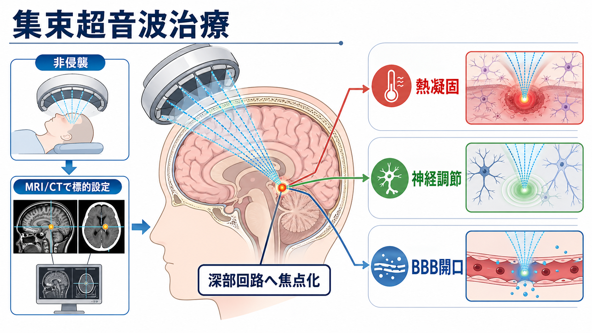
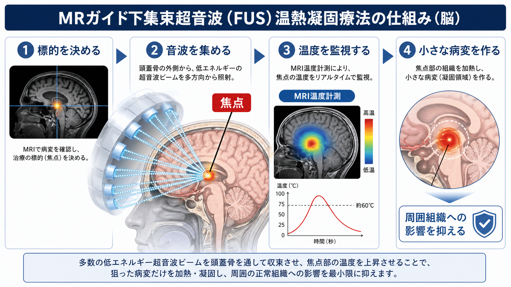
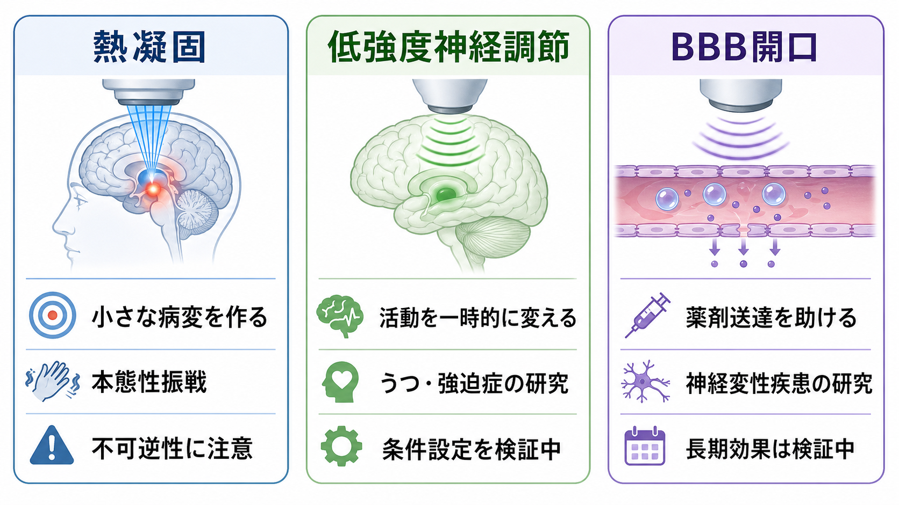

# 集束超音波治療とは何か

## 要点

- 集束超音波治療（focused ultrasound: FUS）は、体外から出した超音波ビームを頭蓋内の小さな焦点に重ね、深部脳領域へ切開なしに介入する技術である。
- 脳領域では、主に「高強度で組織を熱凝固する MR ガイド下集束超音波（MRgFUS）」「低強度で神経活動を一時的に変える低強度集束超音波（LIFU）」「微小気泡と組み合わせて血液脳関門を一時的に開く BBB 開口」が区別される[1][7][8]。
- 臨床応用として最も確立しているのは、本態性振戦など一部の運動症状に対する定位的熱凝固である。精神疾患への応用は、強迫症やうつ病を対象に研究されているが、標準治療として一般化された段階ではない[2][3][4][5][6]。
- 精神神経領域での魅力は、[[深部脳刺激DBSは神経回路をどう調節するのか|DBS]]より侵襲が低く、[[トランスクラニアル磁気刺激TMSは何をしているのか|TMS]]より深部・小領域を狙いやすい可能性にある。ただし、可逆性、標的精度、長期安全性、個別化の課題は大きい。

## この記事で答える問い

1. 集束超音波治療は、普通の超音波検査や電気刺激と何が違うのか。
2. 脳深部にどうやって非侵襲的にエネルギーを届けるのか。
3. 熱凝固、神経調節、BBB 開口は何が違うのか。
4. 精神神経領域では、どこまで臨床応用され、どこから研究段階なのか。
5. どのような誤解や安全上の注意があるのか。

## まず結論

集束超音波治療は、「音を一点に集めることで、頭蓋骨を開けずに脳深部へ介入する」技術である。虫眼鏡で光を一点に集めると焦点だけが強くなるように、FUS では多数の超音波ビームを頭蓋外から照射し、焦点でだけ十分な物理作用を生じさせる。

ただし、FUS は単一の治療法ではない。高強度で温度を上げれば、小さな病変を作る不可逆的な熱凝固になる。低強度で使えば、機械的作用を通じて神経活動を一時的に変える神経調節として研究される。微小気泡を併用すれば、血液脳関門を一時的に緩め、薬剤や抗体を脳内へ届けやすくする技術として検討される[1][7][8]。

精神医学にとって重要なのは、この技術が「脳深部回路に非侵襲的に近づく」道を開く点である。[[強迫症では皮質線条体視床回路に何が起きているのか|皮質-線条体-視床-皮質回路]]、[[報酬系の異常はうつ病をどう説明するのか|報酬系]]、帯状皮質、内包、視床などは、精神症状と関係するが、従来の非侵襲刺激では狙いにくい。FUS はその空白を埋める候補だが、現時点では「有望な研究技術」と「確立した標準治療」を明確に分けて読む必要がある。

## 背景

神経調節治療には、すでに複数の方法がある。[[反復経頭蓋磁気刺激rTMSとは何か|rTMS]] は頭皮上から大脳皮質を刺激し、うつ病治療で使われている。[[修正型ECTとは何か|修正型ECT]] は全身麻酔下で治療発作を誘発し、重症うつ病や緊張病などで重要な位置を占める。DBS は電極を脳深部へ埋め込み、運動障害や一部の精神疾患研究で使われてきた。

FUS はこの地図の中で、切開や植込みなしに深部標的へ焦点化できる点が特徴である。米国 FDA は 2016 年に、薬物抵抗性の本態性振戦に対する片側視床破壊術として ExAblate Neuro を承認した[2]。この承認の根拠となったランダム化シャム対照試験では、中等度から重度の本態性振戦患者で、MR ガイド下集束超音波視床破壊術が手の振戦を改善した一方、感覚異常や歩行障害などの有害事象も報告された[3]。

この流れを背景に、精神神経領域では二つの方向が広がっている。第一は、強迫症やうつ病で、前部内包脚などの回路標的を熱凝固する研究である[4][5][6]。第二は、低強度 FUS によって可逆的に神経活動を調整し、脳回路の因果的理解や治療応用へつなげる研究である[1][8]。

## 基本概念

### 集束とは何か

超音波そのものは、医療では画像診断や理学療法などで広く使われてきた。FUS の要点は、単に超音波を当てることではなく、多数のビームを幾何学的・音響学的に一点へ集めることにある。個々のビームは通過経路では弱く、焦点でだけエネルギー密度が高くなる。

脳では頭蓋骨が大きな障壁になる。骨は超音波を吸収・屈折・散乱させるため、事前の CT で頭蓋骨の形状や密度を推定し、MRI で標的を定め、位相補正を行う。MRgFUS では治療中に MRI 温度計測を行い、焦点の温度上昇を確認しながら照射する[1][2]。

### 三つの使い方

| 方式 | 主な物理作用 | 可逆性 | 代表的な目的 |
|---|---|---|---|
| 高強度 FUS / MRgFUS 熱凝固 | 温度上昇による凝固壊死 | 原則不可逆 | 視床などの小標的を定位的に破壊する |
| 低強度 FUS / LIFU | 機械的作用、膜・イオンチャネル・シナプス活動への影響 | 多くは一時的変化を狙う | 神経活動や行動指標を変える研究 |
| FUS-BBB 開口 | 微小気泡の振動による血管壁透過性変化 | 一時的開口を狙う | 薬剤、抗体、遺伝子治療などの脳内送達 |

この区別は臨床的に重要である。熱凝固は「一回で病変を作る」治療であり、効果が持続しうる一方、誤った標的や過剰な病変は戻せない。低強度神経調節は可逆性を期待できるが、最適な刺激条件、個人差、反復投与の長期影響は検証中である。BBB 開口は薬剤送達の技術であり、FUS 単独で精神症状を治すというより、他の治療分子を脳内へ届ける基盤技術として理解した方がよい[1][7][8]。

## 仕組み

### 熱凝固

MRgFUS 熱凝固では、患者の頭部を固定し、ヘルメット状のトランスデューサから多数の超音波ビームを照射する。低出力の試験照射で標的と症状変化を確認し、必要に応じて出力を上げ、焦点温度を凝固に十分な範囲まで上昇させる。標的は本態性振戦では視床 Vim 核が典型例であり、異常な振戦回路の中継点を小さく破壊する[2][3]。

熱凝固は、DBS のように電極を入れて後から刺激条件を調整する方法ではない。治療後にデバイス管理が不要な利点がある一方、病変の位置と大きさを後から自由に変えることはできない。このため、標的選択、画像誘導、術中評価、安全域の設定が治療成否を大きく左右する。

### 低強度神経調節

低強度 FUS は、組織を焼灼しない出力で神経活動を変える方法である。候補機序としては、細胞膜の機械的変形、機械感受性イオンチャネル、シナプス伝達、局所回路の興奮性変化などが議論されている。ただし、人間の脳でどの機序がどの条件で主要になるかは、まだ完全には整理されていない[1][8]。

精神医学では、LIFU が「深部回路を一時的に動かして、症状や認知・情動指標がどう変わるか」を調べる実験技術として魅力的である。たとえば、[[治療抵抗性うつ病とは何か|治療抵抗性うつ病]]、強迫症、不安、疼痛、依存などでは、複数の脳領域がネットワークとして働く。LIFU は、こうしたネットワークの特定ノードに可逆的な介入を加え、因果仮説を検証する道具になりうる。

### BBB 開口

血液脳関門（blood-brain barrier: BBB）は、脳内環境を守る一方、多くの薬剤や抗体が脳へ届きにくい原因でもある。FUS-BBB 開口では、微小気泡を血管内に投与し、FUS によって局所的に気泡を振動させる。これにより、標的領域の血管透過性を一時的に高めることができる[7]。

この方法は、アルツハイマー病、パーキンソン病、脳腫瘍などで研究されている。精神疾患に直接使うには、どの分子をどの回路へ届けるのか、開口の範囲と持続時間をどう制御するのか、炎症や出血リスクをどう評価するのかが課題になる。

## 図解

FUS を一枚で理解するなら、次の三層で考えるとよい。

1. 物理層: 音波を集め、焦点でだけ十分な作用を起こす。
2. 生物層: 熱、機械刺激、微小気泡を通じて、組織・神経活動・血管透過性を変える。
3. 臨床層: 運動症状では一部実用化され、精神疾患では強迫症・うつ病などで研究が進む。

## 臨床・研究との接続

### 運動症状

MRgFUS の最も確立した臨床応用は、薬物療法で十分に改善しない本態性振戦への片側視床破壊術である。NEJM のランダム化試験では、シャム手技と比較して手の振戦が改善したが、しびれ、感覚異常、歩行の不安定さなどの有害事象も観察された[3]。これは「切らないからリスクがない」のではなく、「侵襲は低いが定位的な脳病変を作る治療」と理解すべきである。

### 強迫症

治療抵抗性強迫症では、前部内包脚など、CSTC 回路に関わる白質路を標的にする発想がある。MRgFUS 両側前部内包切截の proof-of-concept 研究では、少数例で症状改善が報告された[4]。その後、長期成績を扱う研究も出ているが、対象数、選択基準、評価期間、併用治療、不可逆的病変の倫理的扱いを慎重に見る必要がある[6]。この領域は、[[DBSは精神疾患治療に応用できるのか]]と並べると、可逆的刺激と不可逆的切截の違いが見えやすい。

### うつ病

うつ病では、前部内包脚、帯状皮質、内側前脳束、報酬系などが神経調節の標的候補として議論されてきた。MRgFUS capsulotomy の第I相試験では、治療抵抗性 OCD と大うつ病性障害を対象に安全性・画像変化・臨床指標が検討された[5]。しかし、うつ病は症候群として異質性が高く、標的回路も一つに固定しにくい。現時点では、FUS を「うつ病の確立治療」と書くのではなく、[[TMSはうつ病治療でどの神経回路を狙っているのか|TMS]]、ECT、DBS、薬物療法と比較しながら、研究段階の選択肢として位置づけるのが妥当である。

### 研究ツールとしての価値

低強度 FUS は、精神疾患の治療だけでなく、脳回路研究の因果的ツールとしても重要である。fMRI や EEG は脳活動を測るが、それだけでは「その領域が症状を作っているのか、症状に反応しているだけなのか」は分かりにくい。LIFU で特定領域を一時的に変え、認知課題、情動評価、神経画像、症状指標がどう変化するかを見れば、回路仮説の検証に近づける[1][8]。

## よくある誤解

### 誤解1: 非侵襲なら安全で副作用がない

非侵襲とは、頭蓋骨を開けない、電極を埋め込まないという意味であり、生体作用が弱いという意味ではない。熱凝固では意図的に小さな脳病変を作る。したがって、標的外の加熱、感覚障害、運動失調、歩行障害、出血、浮腫などを評価する必要がある[2][3]。

### 誤解2: FUS は一種類の治療である

同じ FUS でも、熱凝固、低強度神経調節、BBB 開口では、目的、可逆性、安全評価、臨床エンドポイントが異なる。精神医学で「FUS が効くか」と問うだけでは粗すぎる。どの疾患の、どの症状に、どの標的へ、どの出力・周波数・照射条件で介入するのかを分けて考える必要がある。

### 誤解3: 精神疾患の原因部位を焼けばよい

強迫症やうつ病は単一部位の故障ではなく、回路、学習、情動調整、身体状態、生活史、環境が重なる。熱凝固研究があるからといって、「症状の原因を切る」という単純な説明は危険である。臨床研究では、重症度、治療抵抗性、同意能力、代替治療、長期フォローアップ、人格・認知への影響を含む倫理的検討が必要になる。

### 誤解4: BBB を開けば薬は必ず効く

BBB 開口は送達の問題を一部解くが、薬剤自体の標的妥当性、用量、安全性、免疫反応、神経炎症、開口範囲の制御が残る。精神疾患では、脳内に届けるべき分子標的が明確でない場合も多い。したがって、BBB 開口は強力な基盤技術だが、それだけで治療効果を保証するものではない[7]。

## 関連ノート

- [[反復経頭蓋磁気刺激rTMSとは何か]]: 非侵襲的神経刺激としての比較対象。
- [[トランスクラニアル磁気刺激TMSは何をしているのか]]: 皮質刺激と回路調整の基礎。
- [[深部脳刺激DBSは神経回路をどう調節するのか]]: 埋込み型深部刺激との違い。
- [[DBSは精神疾患治療に応用できるのか]]: 強迫症・うつ病への神経外科的介入の文脈。
- [[強迫症では皮質線条体視床回路に何が起きているのか]]: OCD で標的回路が問題になる背景。
- [[報酬系の異常はうつ病をどう説明するのか]]: うつ病の回路標的を考える補助線。
- [[大脳基底核ループとは何か]]: 視床、線条体、淡蒼球を含む運動・認知・情動ループの基礎。

## 理解チェック

1. FUS で「焦点」が重要になるのはなぜか。
2. MRgFUS 熱凝固と低強度 FUS 神経調節では、可逆性と臨床リスクがどう違うか。
3. 本態性振戦への MRgFUS のエビデンスを、精神疾患へそのまま一般化できない理由は何か。
4. 強迫症に対する capsulotomy 研究を読むとき、DBS 研究と比べて何に注意すべきか。
5. BBB 開口は、なぜ「治療そのもの」ではなく「送達技術」として理解する必要があるのか。

## MOC更新候補

- `content/00_MOC/MOC｜臨床実践・治療.md` の神経調節・身体療法セクションに追加候補。
- `content/00_MOC/MOC｜神経科学と精神疾患.md` に、精神疾患への回路介入研究として追加候補。

## 未解決問題

- 低強度 FUS で、ヒトの深部回路に対する最適な周波数、音圧、パルス条件、反復スケジュールをどう個別化するか。
- 精神症状の改善を、標的部位の生理変化、ネットワーク変化、期待効果、併用治療からどう分離して評価するか。
- 不可逆的な熱凝固を精神疾患に用いる場合、十分な治療抵抗性、同意、長期安全性、人格・認知への影響をどう評価するか。
- BBB 開口を精神神経疾患に応用する場合、どの治療分子をどの回路へ届けるべきか。

## 参考文献

[1] Legon, W., & Strohman, A. (2024). Low-intensity focused ultrasound for human neuromodulation. *Nature Reviews Methods Primers*, 4, 91. https://doi.org/10.1038/s43586-024-00368-6

[2] U.S. Food and Drug Administration. (2016). Premarket Approval P150038: ExAblate Neuro, unilateral thalamotomy for medication-refractory essential tremor. https://www.accessdata.fda.gov/scripts/cdrh/cfdocs/cfpma/pma.cfm?id=P150038

[3] Elias, W. J., Lipsman, N., Ondo, W. G., et al. (2016). A randomized trial of focused ultrasound thalamotomy for essential tremor. *The New England Journal of Medicine*, 375(8), 730-739. https://doi.org/10.1056/NEJMoa1600159

[4] Jung, H. H., Kim, S. J., Roh, D., et al. (2015). Bilateral thermal capsulotomy with MR-guided focused ultrasound for patients with treatment-refractory obsessive-compulsive disorder: A proof-of-concept study. *Molecular Psychiatry*, 20(10), 1205-1211. https://doi.org/10.1038/mp.2014.154

[5] Davidson, B., Hamani, C., Rabin, J. S., et al. (2020). Magnetic resonance-guided focused ultrasound capsulotomy for refractory obsessive compulsive disorder and major depressive disorder: Clinical and imaging results from two phase I trials. *Molecular Psychiatry*, 25(9), 1946-1957. https://doi.org/10.1038/s41380-020-0737-1

[6] Chang, K. W., Chang, J. G., Jung, H. H., et al. (2025). Long-term clinical outcome of a novel bilateral capsulotomy with focused ultrasound in refractory obsessive-compulsive disorder treatment. *Molecular Psychiatry*, 30, 1897-1905. https://doi.org/10.1038/s41380-024-02799-9

[7] Gorick, C. M., Breza, V. R., Nowak, K. M., et al. (2022). Applications of focused ultrasound-mediated blood-brain barrier opening. *Advanced Drug Delivery Reviews*, 191, 114583. https://doi.org/10.1016/j.addr.2022.114583

[8] Qin, P. P., Jin, M., Xia, A. W., et al. (2024). The effectiveness and safety of low-intensity transcranial ultrasound stimulation: A systematic review of human and animal studies. *Neuroscience & Biobehavioral Reviews*, 156, 105501. https://doi.org/10.1016/j.neubiorev.2023.105501
