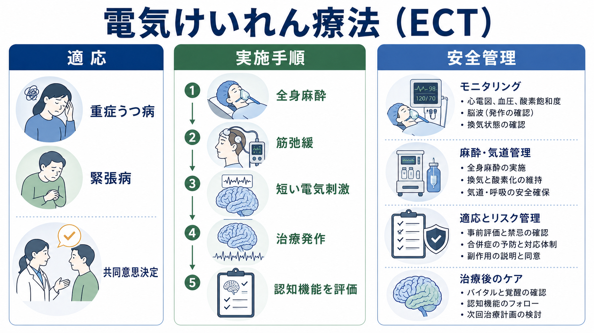
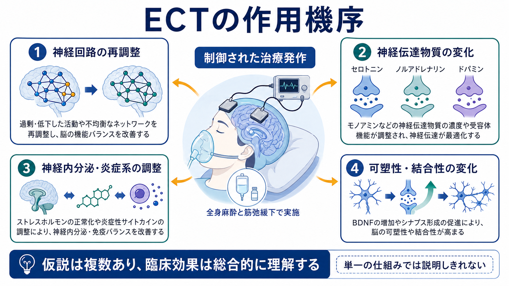
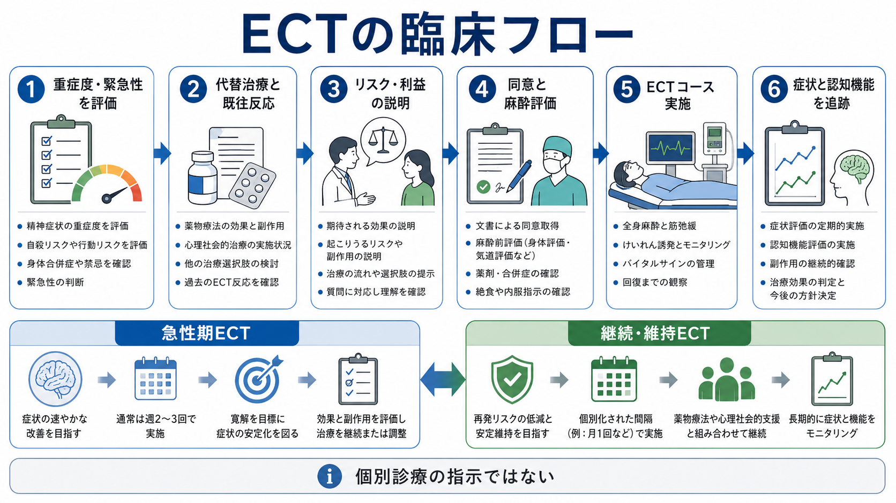

# 電気けいれん療法ECTとは何か

## 要点

- 電気けいれん療法（electroconvulsive therapy: ECT）は、全身麻酔と筋弛緩のもとで短い電気刺激を与え、治療上必要な発作活動を誘発する身体療法である。現代のECTは、歴史的な「無麻酔の電気ショック」と区別して理解する必要がある[3]。
- 主な検討場面は、重症の[[大うつ病性障害とは何か]]、[[精神病性うつ病とは何か]]、[[治療抵抗性うつ病とは何か]]、[[緊張病とは何か]]、悪性緊張病、重症躁病などである。特に自殺リスク、拒食・脱水、昏迷、急速な改善が必要な状態では早期に検討される[1][2][4]。
- 作用機序は単一ではない。神経回路、神経伝達物質、神経内分泌、炎症、神経可塑性などが複合的に変化すると考えられているが、決定的な単一メカニズムはまだ確立していない[5]。
- 安全性は麻酔、循環・呼吸管理、発作モニタリング、認知機能評価によって支えられる。代表的な副作用は治療直後の混乱、頭痛、筋肉痛、吐き気、記憶・学習への影響であり、とくに自伝的記憶の問題は説明と追跡が重要である[6][7]。
- 本稿は教育・研究目的の整理であり、個別症例への実施可否、回数、刺激条件、入院・外来の判断を指示するものではない。

## この記事で答える問い

1. ECTは何をしている治療なのか。
2. どのような病態で検討されるのか。
3. なぜ効くと考えられているのか。
4. 安全性と副作用はどう説明すべきか。
5. よくある誤解をどう整理できるか。

## まず結論

ECTは、薬物療法や心理社会的介入と同じ並びにある「治療選択肢」の一つではあるが、軽症例に漫然と用いる治療ではない。むしろ、症状の重さ、緊急性、これまでの治療反応、身体状態、本人の価値観、同意能力、治療しない場合のリスクを総合して判断する高度に管理された医療行為である[1][3]。

臨床的には、急速な改善が必要な重症うつ病、精神病性うつ病、重い自殺リスク、拒食・脱水、緊張病、悪性緊張病などで重要になる。[[共同意思決定とは何か]]の観点では、「ECTを受けるか受けないか」だけでなく、代替治療、治療しない場合のリスク、記憶への影響、維持療法や再発予防まで含めて話し合う必要がある[1][2][6]。

## 背景

ECTは1930年代から使われてきた治療であり、歴史的には無麻酔、強い運動けいれん、社会的スティグマと結びついて語られてきた。しかし現代の標準的なECTは、短時間作用性の全身麻酔、筋弛緩、酸素化、循環・呼吸モニタリング、脳波や運動発作の確認、回復室での観察を組み合わせる[3]。日本でしばしば「修正型ECT」と呼ばれる実践については、[[修正型ECTとは何か]]がより直接に扱う。

NICEは、重症うつ病で生命を脅かす状態、急速な反応が必要な状態、または他治療が無効であった状態においてECTを考慮する枠組みを示している[1]。また、NICEの技術評価では、重症うつ病、緊張病、長期または重症の躁病などで短期的改善を目的にECTを用いる位置づけが整理されている[2]。

## 基本概念

### ECTで「治療」しているもの

ECTで狙うのは、身体を大きくけいれんさせること自体ではない。治療的に意味をもつのは、脳内で制御された発作活動を起こし、その前後に生じる神経生理学的・神経化学的変化を通じて重い精神症状を改善することである[3][5]。筋弛緩薬を用いるため、外から見える運動発作は小さくなるが、脳波上の発作活動を確認する。

### 適応を考える軸

ECTの適応は診断名だけでは決まらない。[[ECTの適応はどう判断するか]]と接続して考えると、少なくとも次の軸が重要である。

| 判断軸 | 具体例 | 意味 |
|---|---|---|
| 重症度 | 昏迷、拒食・脱水、精神病症状、重い希死念慮 | 待つことの危険が大きい |
| 緊急性 | 急速な自殺リスク、悪性緊張病、身体合併症 | 数週間の薬効発現を待てない |
| 既往反応 | 過去のECT反応、薬物療法への反応不十分 | 治療選択の優先度が変わる |
| 安全性 | 麻酔リスク、循環器疾患、認知症状、妊娠など | 事前評価と調整が必要 |
| 同意と価値観 | 本人の希望、家族の支援、同意能力 | 説明・合意形成の中心になる |

## 仕組み

ECTの作用機序は「電気刺激が直接気分を変える」という単純なものではない。現在の理解では、電気刺激によって誘発された発作活動をきっかけに、複数の階層で脳と身体の状態が変化する。

第一に、前頭前野、辺縁系、視床、海馬などを含む神経回路の活動と結合性が再調整される可能性がある。うつ病では情動、報酬、認知制御に関わるネットワークの偏りが問題になるため、ECT後のネットワーク変化は臨床効果と関係しうる[5]。

第二に、セロトニン、ノルアドレナリン、ドパミン、GABA、グルタミン酸などの神経伝達系が変化すると考えられている。これは[[セロトニン仮説はうつ病をどこまで説明できるのか]]のような単一仮説ではなく、複数系の再均衡として理解した方がよい[5]。

第三に、神経内分泌、炎症、神経可塑性が関わる。HPA軸、サイトカイン、BDNF、シナプス可塑性、海馬体積変化などが研究されているが、どれか一つがECTの効果を完全に説明するわけではない[5]。ここは[[神経可塑性低下はうつ病をどう説明するのか]]や[[炎症仮説はうつ病をどう説明するのか]]と接続して読むと理解しやすい。

## 図解

上の1枚目は、ECTを「適応」「実施手順」「安全管理」に分けて概観したものである。重症うつ病や緊張病が検討対象になり、全身麻酔、筋弛緩、短い電気刺激、治療発作、認知機能評価が一連の管理として結びつく。

2枚目は作用機序の概念図である。神経回路、神経伝達物質、神経内分泌・炎症系、可塑性・結合性を分けているが、実際には相互作用する。図は仮説の整理であり、特定の患者でどの経路が主要に働くかを示すものではない。

3枚目は臨床フローである。ECTは「実施」だけで完結せず、評価、説明、同意、麻酔評価、治療コース、症状と認知機能の追跡、再発予防へと続く。

## 臨床・研究との接続

### 重症うつ病

重症の[[大うつ病性障害とは何か]]では、薬物療法の効果発現を待つことが難しい場面がある。精神病症状、拒食・脱水、強い自殺リスク、著しい制止や昏迷を伴うとき、ECTは短期的な症状改善を目指す選択肢になる[1][2]。一方で、ECT後も再発予防が必要であり、抗うつ薬、気分安定薬、心理社会的支援、継続・維持ECTなどを組み合わせて考える[3]。

### 緊張病

[[緊張病とは何か]]では、無動、無言、拒絶、姿勢保持、興奮、自律神経不安定などが問題になる。BAPの緊張病ガイドラインは、治療を早く開始すること、基礎疾患と合併症に対応すること、ベンゾジアゼピン系薬とECTを主要な治療選択肢として扱うことを推奨している[4]。悪性緊張病や身体的危険が高い状態では、ECTを遅らせない判断が重要になりうる[4]。

### 安全性と規制

米国FDAは2018年、一定の条件下の重症大うつ病エピソードや緊張病に対するECT機器を、特別管理を伴うClass IIへ再分類した[8]。これは「リスクがない」という意味ではなく、特定の適応と管理条件で安全性・有効性を評価し、既知のリスクを管理する枠組みである。したがって、ECTの説明では、治療しない場合のリスクと、治療に伴う麻酔・循環・認知機能リスクの両方を文書化して扱う必要がある[1][6][8]。

### 認知機能への影響

[[ECTの副作用には何があるのか]]で詳しく扱うように、ECTの副作用で最も丁寧な説明を要するのは認知機能と記憶への影響である。治療直後の新しい学習や見当識の低下は多くの場合短期的に改善するが、個人差があり、自伝的記憶の抜けは本人にとって大きな問題になりうる[6][7]。そのため、治療前のベースライン、治療中の変化、治療後の生活機能を、[[認知機能検査は何を測っているのか]]の観点から継続的に見る。

## よくある誤解

### 「ECTは罰として行う治療である」

これは誤りである。ECTは、重症の精神症状や緊張病に対して、麻酔・筋弛緩・モニタリングのもとで行う医療行為であり、罰や行動制御ではない[3]。歴史的な問題を軽視してよいわけではないが、現代の実践は同意、説明、安全管理、チーム医療を前提に評価すべきである。

### 「けいれんが大きいほど効く」

これも誤りである。筋弛緩により外から見える運動発作は小さくなる。重要なのは、治療に十分な発作活動を安全に誘発できたか、循環・呼吸が保たれているか、認知機能への影響が許容範囲かである[3][6]。

### 「薬が全部だめになってから使う最後の手段である」

治療抵抗性は重要な検討理由だが、ECTは常に最後まで待つ治療ではない。自殺リスク、拒食・脱水、昏迷、悪性緊張病、重症精神病性うつ病などでは、待つこと自体が大きなリスクになる[1][4]。

### 「安全なら副作用説明は簡単でよい」

安全管理が発達しても、説明は簡単でよいわけではない。麻酔リスク、頭痛、筋肉痛、治療直後の混乱、記憶への影響、治療後の再発予防は、本人と家族に具体的に説明する必要がある[6][7]。

## 関連ノート

- [[修正型ECTとは何か]]
- [[ECTの適応はどう判断するか]]
- [[ECTの副作用には何があるのか]]
- [[大うつ病性障害とは何か]]
- [[精神病性うつ病とは何か]]
- [[治療抵抗性うつ病とは何か]]
- [[緊張病とは何か]]
- [[認知機能検査は何を測っているのか]]
- [[共同意思決定とは何か]]
- [[反復経頭蓋磁気刺激rTMSとは何か]]
- [[迷走神経刺激療法VNSとは何か]]

## MOC更新候補

- `content/00_MOC/MOC｜精神医学.md`
- `content/00_MOC/MOC｜認知機能.md`
- 神経調節・身体療法領域のMOCが統合ジョブで更新される場合、本記事を `ECT`、`神経調節`、`身体療法`、`うつ病`、`緊張病` の項目に追加する。

## 理解チェック

1. ECTで治療上重要なのは、外から見える運動けいれんそのものか、脳内の制御された発作活動か。
2. 重症うつ病でECTを早期に検討しうる臨床状況を3つ挙げられるか。
3. ECTの作用機序を、神経回路、神経伝達、神経内分泌・炎症、可塑性の4層で説明できるか。
4. ECTの副作用説明で、なぜ自伝的記憶を特別に扱う必要があるか。
5. ECT後の再発予防に、薬物療法や継続・維持ECTがなぜ関わるか。

## 未解決問題

- どの患者がECTに最もよく反応するかを、臨床指標、脳画像、脳波、炎症・神経栄養因子などからどこまで予測できるか。
- 認知機能への影響を最小化しながら、重症例で十分な効果を保つ刺激条件をどう個別化するか。
- 急性期ECT後の継続・維持ECT、薬物療法、心理社会的支援をどの順序と強度で組み合わせると再発予防に最も有効か。
- 緊張病、精神病性うつ病、双極性うつ病、老年期うつ病などで、共通する効果機序と異なる効果機序をどう分けて理解するか。

## 参考文献

[1] National Institute for Health and Care Excellence. (2022). *Depression in adults: treatment and management (NICE guideline NG222)*. https://www.nice.org.uk/guidance/ng222/chapter/Recommendations

[2] National Institute for Health and Care Excellence. (2003). *Guidance on the use of electroconvulsive therapy (Technology appraisal guidance TA59)*. https://www.nice.org.uk/guidance/ta59

[3] Grover, S., Sahoo, S., Rabha, A., & Koirala, R. (2023). Clinical Practice Guidelines for the Use of Electroconvulsive Therapy. *Indian Journal of Psychiatry, 65*(Suppl 2), S258-S269. https://pmc.ncbi.nlm.nih.gov/articles/PMC10096214/

[4] Rogers, J. P., Oldham, M. A., Fricchione, G., et al. (2023). Evidence-based consensus guidelines for the management of catatonia: Recommendations from the British Association for Psychopharmacology. *Journal of Psychopharmacology, 37*(4), 327-369. https://doi.org/10.1177/02698811231158232

[5] Kritzer, M. D., Peterchev, A. V., & Camprodon, J. A. (2023). Electroconvulsive Therapy: Mechanisms of Action, Clinical Considerations, and Future Directions. *Harvard Review of Psychiatry, 31*(3), 101-113. https://doi.org/10.1097/HRP.0000000000000365

[6] Porter, R. J., Baune, B. T., Morris, G., et al. (2020). Cognitive side-effects of electroconvulsive therapy: what are they, how to monitor them and what to tell patients. *BJPsych Open, 6*(3), e40. https://doi.org/10.1192/bjo.2020.17

[7] Sackeim, H. A., Prudic, J., Devanand, D. P., et al. (1993). Effects of stimulus intensity and electrode placement on the efficacy and cognitive effects of electroconvulsive therapy. *New England Journal of Medicine, 328*(12), 839-846. https://doi.org/10.1056/NEJM199303253281204

[8] Food and Drug Administration, HHS. (2018). Neurological Devices; Reclassification of Electroconvulsive Therapy Devices; Effective Date of Requirement for Premarket Approval for Electroconvulsive Therapy Devices for Certain Specified Intended Uses. *Federal Register, 83*(246), 66103-66124. https://pubmed.ncbi.nlm.nih.gov/30596410/
