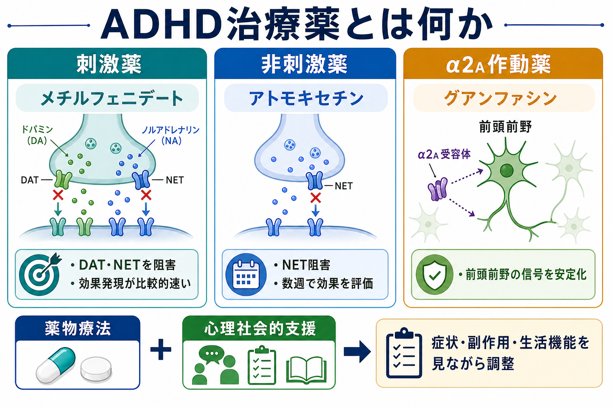
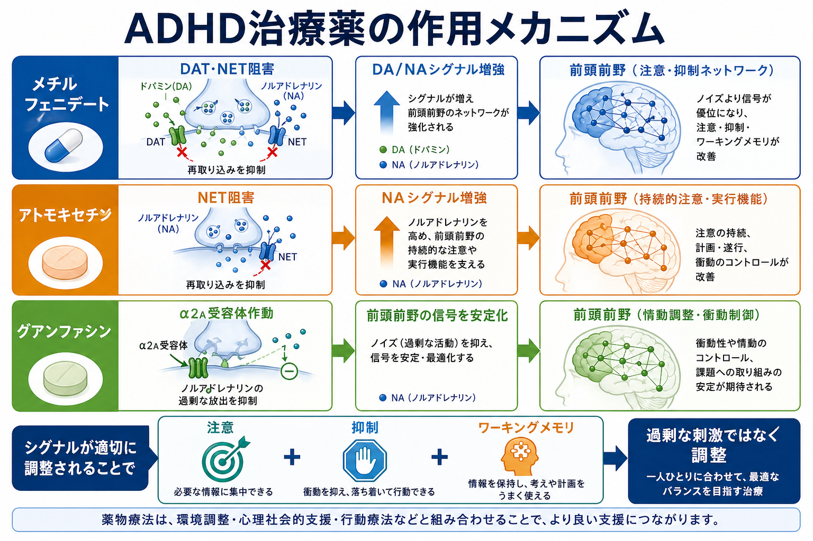
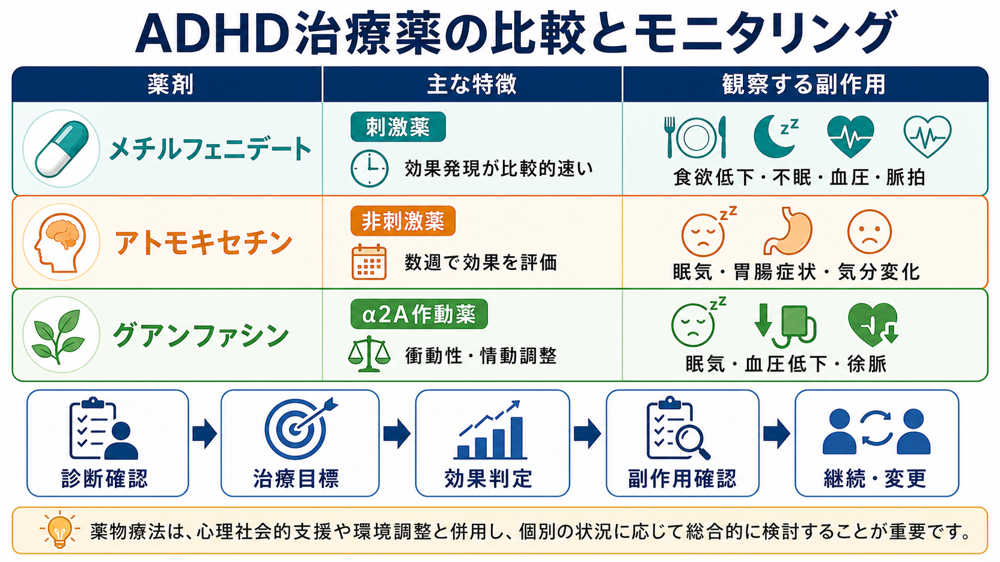

# ADHD治療薬とは何か

## 要点

- ADHD治療薬は、[[ADHDとは何か]]でみられる不注意、多動性、衝動性を「性格を変える」のではなく、注意・抑制・ワーキングメモリに関わる神経調節を整え、生活機能を上げるために使われる。
- 中心になる薬剤群は、刺激薬のメチルフェニデート、非刺激薬のアトモキセチン、α2Aアドレナリン受容体作動薬のグアンファシンである。
- 薬剤選択は、年齢、症状の目標、併存症、睡眠・食欲・血圧・脈拍、乱用・転用リスク、本人と家族の希望を含めて判断する。
- 薬物療法は単独で完結するものではなく、環境調整、心理教育、学校・職場支援、行動療法的支援と組み合わせる。

## この記事で答える問い

1. ADHD治療薬は何を変えようとしているのか。
2. メチルフェニデート、アトモキセチン、グアンファシンは何が違うのか。
3. 効果判定と副作用モニタリングでは何を見るのか。
4. 「薬を飲めば治る」「刺激薬は危険だから避けるべき」といった理解はどこが不十分なのか。

## まず結論

ADHD治療薬は、前頭前野を中心とした注意・抑制・実行機能ネットワークの信号対雑音比を調整し、課題への持続、衝動的反応の抑制、生活上の失敗の減少を目指す薬である。NICEは、小児・若者では環境調整後も有意な機能障害が残る場合に薬物療法を検討し、メチルフェニデートを小児・若者の第一選択、成人ではメチルフェニデートまたはリスデキサンフェタミンを第一選択としている。アトモキセチンやグアンファシンは、刺激薬が不適切、忍容できない、または十分な効果がない場合の選択肢になる[1]。

## 背景

ADHDは、単に「集中力が足りない」状態ではない。症状は、学校、家庭、職場、対人関係、金銭管理、事故リスク、自己評価に広く影響する。したがって治療目標は、症状スコアだけでなく、忘れ物、遅刻、課題提出、衝動買い、対人トラブル、睡眠、家族負担などの具体的な生活機能で設定する。

小児・青年では、AAPも年齢に応じて行動療法、親トレーニング、学校介入、FDA承認薬を組み合わせることを推奨している。特に6歳以上の学齢期では薬物療法と家庭・学校での行動的支援を併用し、青年期では本人の同意・納得を重視する[2]。この考え方は、[[小児青年期の薬物療法では何に注意するか]]や[[薬物療法のリスクベネフィットをどう考えるか]]と接続する。

## 基本概念

### メチルフェニデート

メチルフェニデートは中枢刺激薬で、主にドパミントランスポーター（DAT）とノルアドレナリントランスポーター（NET）を阻害し、ドパミンとノルアドレナリンの神経伝達を高める。臨床的には効果発現が比較的速く、課題への着手、持続注意、衝動的行動の抑制を評価しやすい。一方で、食欲低下、不眠、動悸、血圧・脈拍上昇、不安の増悪、乱用・転用リスクに注意する[5]。

### アトモキセチン

アトモキセチンは非刺激薬で、選択的にNETを阻害し、前頭前野のノルアドレナリン、間接的にドパミン調節にも関わる。刺激薬に比べると効果判定に数週を要しやすいが、乱用リスクが低く、チック、不安、睡眠、物質使用リスクなどの文脈で検討されることがある。副作用として眠気、食欲低下、胃腸症状、血圧・脈拍変化、気分変化を観察する。小児・青年では自殺念慮の警告、まれだが肝障害にも注意が必要である[6]。

### グアンファシン

グアンファシン徐放製剤はα2Aアドレナリン受容体作動薬で、前頭前野のネットワーク結合を安定化し、衝動性、情動調整、過覚醒、反抗的行動が目立つ場合に臨床上検討されることがある。刺激薬のように「覚醒を上げる」方向ではなく、過剰なノイズを抑え、トップダウン制御を支える薬として理解するとよい。眠気、疲労、血圧低下、徐脈、めまい、急な中止に伴う反跳性高血圧に注意する[7]。

## 仕組み

前頭前野は、いま何に注意を向けるか、反応を保留するか、作業記憶に情報を保持するかを調整する。ADHD治療薬の多くは、この領域のドパミン・ノルアドレナリン系に作用し、神経回路の「信号」と「ノイズ」の比を変えると考えられる。メチルフェニデートとアトモキセチンはカテコラミン伝達を高め、グアンファシンはα2A受容体を介して前頭前野ネットワークの発火を安定化する、という整理が有用である[4]。

ただし、この説明は「ADHDはドパミン不足だけで起こる」という単純な説ではない。ADHDには発達、遺伝、睡眠、環境、学習、併存症、ストレスが関わる。薬はその一部である神経調節を変える道具であり、[[ADHDは前頭線条体回路の障害として説明できるのか]]や[[前頭頭頂ネットワークは認知制御をどう支えるのか]]で扱う回路レベルの理解と合わせて読むと見通しがよくなる。

## 図解

| 観点 | メチルフェニデート | アトモキセチン | グアンファシン |
|---|---|---|---|
| 分類 | 刺激薬 | 非刺激薬 | α2A受容体作動薬 |
| 主な作用 | DAT・NET阻害 | NET阻害 | α2A受容体刺激 |
| 評価しやすい症状 | 不注意、課題持続、衝動性 | 不注意、衝動性、日内を通じた症状 | 衝動性、情動調整、過覚醒 |
| 効果判定 | 比較的短期間で変化を見やすい | 数週単位で評価しやすい | 漸増しながら眠気・血圧を見て評価 |
| 注意点 | 食欲、睡眠、血圧、脈拍、乱用・転用 | 眠気、胃腸症状、気分変化、自殺念慮、肝障害 | 眠気、血圧低下、徐脈、急な中止 |

## 臨床・研究との接続

薬剤選択の前には、診断の再確認、併存症、生活環境、身体疾患、現在の薬、身長・体重、血圧・脈拍、心血管リスク、物質使用や薬剤転用リスクを確認する。NICEは、開始前評価、用量調整期の症状・機能・副作用の記録、治療中の身長・体重、血圧・脈拍、睡眠、行動変化の継続的なモニタリングを推奨している[1]。

比較研究では、ADHD薬は短期的な症状改善に有効である一方、年齢層や薬剤によって有効性と忍容性のバランスが異なる。Corteseらのネットワークメタ解析では、小児・青年ではメチルフェニデート、成人ではアンフェタミン系が短期有効性と忍容性の観点から支持されやすい一方、個別の副作用と中止率を考慮する必要が示された[3]。日本での承認薬、処方条件、流通管理は国際ガイドラインと異なるため、実臨床では国内の添付文書・制度・専門医の判断が不可欠である。

研究的には、薬物療法は「神経伝達物質を増やすか減らすか」だけでなく、課題遂行中の前頭前野活動、報酬学習、遅延割引、睡眠、学校・職場環境との相互作用を含めて評価される。これは[[薬物療法は神経回路にどう作用するのか]]、[[ドパミンは報酬だけの物質なのか]]、[[ノルアドレナリンは覚醒とストレスにどう関わるのか]]に接続する。

## よくある誤解

### 「薬を飲めばADHDが治る」

薬は症状と生活機能を改善しうるが、ADHD特性そのものを消すものではない。環境調整、予定管理、学校・職場での合理的配慮、睡眠、家族支援、心理教育を組み合わせる必要がある。

### 「刺激薬はすべて危険だから避けるべき」

刺激薬には乱用・転用、食欲、睡眠、心血管系への注意が必要だが、適切な診断、処方、モニタリングのもとでは有効な選択肢である。問題は「刺激薬か非刺激薬か」の二分法ではなく、利益と不利益を個別に評価することである。

### 「非刺激薬は弱い薬で、副作用が少ない」

非刺激薬にも眠気、血圧変化、気分変化、胃腸症状、肝障害、反跳性高血圧などの重要な注意点がある。刺激薬に比べて乱用リスクは低いが、「副作用がない薬」ではない。

### 「集中力を高める薬だから、誰にでも有用」

ADHD治療薬は、診断、機能障害、治療目標、リスク評価がそろって初めて検討される。診断のない人の認知増強目的、試験対策、疲労対策として使うものではない。

## 関連ノート

- [[ADHDとは何か]]
- [[ADHDは前頭線条体回路の障害として説明できるのか]]
- [[ADHDとうつ病はどう鑑別するのか]]
- [[ADHDと双極性障害はどう鑑別するのか]]
- [[精神科薬物療法とは何か]]
- [[薬物療法のリスクベネフィットをどう考えるか]]
- [[薬物相互作用とは何か]]
- [[小児青年期の薬物療法では何に注意するか]]
- [[薬物療法のアドヒアランスをどう支えるか]]

## MOC更新候補

- `content/00_MOC/` 配下の臨床実践・薬物療法系MOCに追加候補。
- 発達障害・ADHD系MOCがある場合は、[[ADHDとは何か]]、[[ADHDは前頭線条体回路の障害として説明できるのか]]と並べて配置する候補。

## 理解チェック

1. メチルフェニデート、アトモキセチン、グアンファシンの作用点を、それぞれ一文で説明できるか。
2. ADHD治療薬の効果判定を、症状スコアだけでなく生活機能の言葉で言い換えられるか。
3. 刺激薬と非刺激薬の違いを、効果発現、乱用リスク、副作用モニタリングの観点から説明できるか。
4. 薬物療法を開始する前に確認すべき身体・精神・社会的要因を挙げられるか。

## 未解決問題

- 長期的な学業、就労、事故、依存、対人関係への影響を、薬剤ごとにどこまで分離して評価できるか。
- 併存するASD、不安症、気分症、物質使用、睡眠障害がある場合の最適な治療順序。
- 前頭前野ネットワークの神経指標を、個別の薬剤選択にどこまで使えるか。
- 小児期から成人期への移行期に、薬物療法と心理社会的支援をどう継続するか。

## 参考文献

[1] National Institute for Health and Care Excellence. (2018, updated 2019). *Attention deficit hyperactivity disorder: diagnosis and management* (NICE guideline NG87). https://www.nice.org.uk/guidance/ng87/chapter/Recommendations

[2] Wolraich, M. L., Hagan, J. F., Allan, C., et al. (2019). Clinical practice guideline for the diagnosis, evaluation, and treatment of attention-deficit/hyperactivity disorder in children and adolescents. *Pediatrics, 144*(4), e20192528. https://doi.org/10.1542/peds.2019-2528

[3] Cortese, S., Adamo, N., Del Giovane, C., et al. (2018). Comparative efficacy and tolerability of medications for attention-deficit hyperactivity disorder in children, adolescents, and adults: a systematic review and network meta-analysis. *The Lancet Psychiatry, 5*(9), 727-738. https://doi.org/10.1016/S2215-0366(18)30269-4

[4] Arnsten, A. F. T. (2009). The emerging neurobiology of attention deficit hyperactivity disorder: the key role of the prefrontal association cortex. *The Journal of Pediatrics, 154*(5), I-S43. https://doi.org/10.1016/j.jpeds.2009.01.018

[5] DailyMed. (2025). *RITALIN- methylphenidate hydrochloride tablet: prescribing information*. https://dailymed.nlm.nih.gov/dailymed/drugInfo.cfm?setid=d6fb2750-cdab-4749-ba0d-7534840a5892

[6] DailyMed. (2026). *STRATTERA- atomoxetine hydrochloride capsule: prescribing information*. https://dailymed.nlm.nih.gov/dailymed/drugInfo.cfm?setid=309de576-c318-404a-bc15-660c2b1876fb

[7] DailyMed. (2025). *INTUNIV- guanfacine tablet, extended release: prescribing information*. https://dailymed.nlm.nih.gov/dailymed/drugInfo.cfm?setid=b972af81-3a37-40be-9fe1-3ddf59852528
