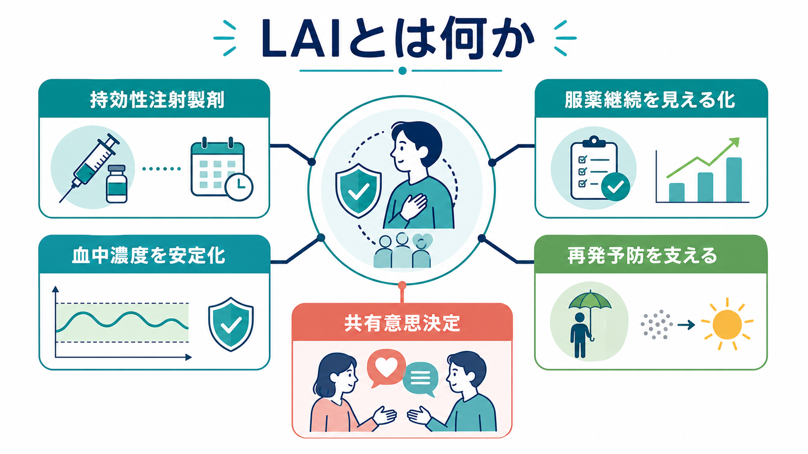
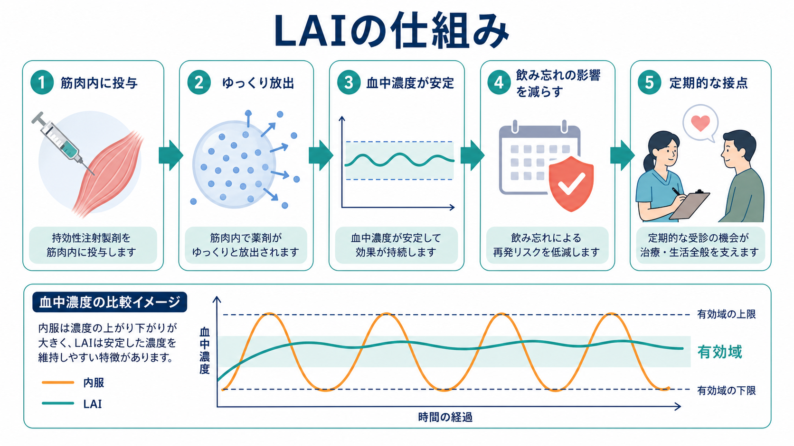
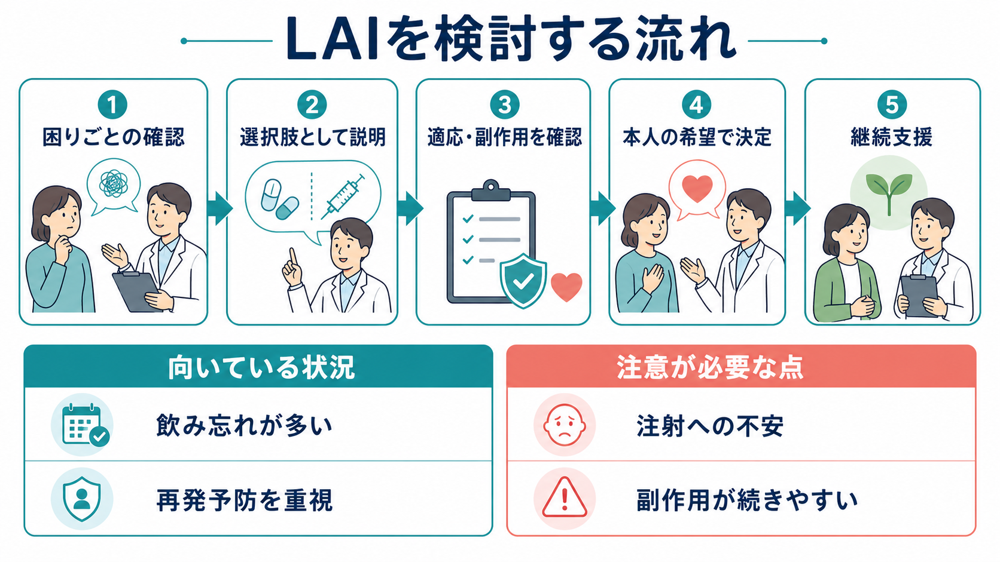

# LAIとは何か

## 要点

- LAIは long-acting injectable の略で、精神科では主に抗精神病薬の「持効性注射製剤」を指す。
- 毎日の内服を置き換えるだけでなく、服薬継続を見える化し、治療中断を早く検出し、外来・訪問看護・地域支援との接点を作る支援技術でもある。
- 主な適応は、本人が注射製剤を希望する場合、内服の飲み忘れや中断が再発リスクにつながっている場合、再発予防を治療計画の中心に置く場合である[2][3]。
- 一方で、注射への不安、注射部位反応、薬剤をすぐ中止しにくいこと、開始時の内服併用・ローディング・観察手順など、内服とは違う説明と安全管理が必要になる[1][6]。

## この記事で答える問い

1. LAIは内服薬と何が違うのか。
2. LAIはどのような人に検討されるのか。
3. 「アドヒアランス支援」としてLAIを使うとき、何に注意するべきか。

## まず結論

LAIは「飲み忘れる人に注射を打つための道具」ではなく、[[共同意思決定とは何か]]を前提に、本人の生活リズム、再発予防、通院・地域支援の接点を一緒に設計するための選択肢である。特に[[統合失調症とは何か]]では、抗精神病薬の継続が再発予防に関わるため、内服が生活上の負担になっている場合や、治療中断が繰り返される場合に LAI が候補になる[2][4]。

ただし、LAIは本人の意思を飛ばして導入するものではない。NICEは、本人が希望する場合、または意図的・非意図的な服薬不継続を避けることが治療計画上の優先事項である場合に、デポ/LAI抗精神病薬を検討するとしている[2]。APAも、本人が LAI を望む場合、または服薬アドヒアランスが不良・不確実な場合に LAI を提案する考え方を示している[3]。

## 背景

精神科治療では、症状が落ち着いた後の維持療法が重要になる。特に統合失調症では、抗精神病薬の中断が再発や再入院のリスクと結びつきやすく、[[精神疾患と服薬アドヒアランス不良はどう関係するのか]]、[[精神疾患と治療中断はどう関係するのか]]、[[統合失調症の再発とは何か]]と直結するテーマである。

しかし、内服の継続は単純な「理解不足」だけで決まらない。副作用、病識、スティグマ、服薬を思い出す負担、仕事や学校、生活の不規則さ、家族関係、経済的負担、外来との距離などが重なる。したがって LAI の導入は、本人を説得する作業ではなく、[[アドヒアランスとは何か]]を生活文脈から評価し、治療選択肢を並べ直す作業として扱う必要がある。

日本の統合失調症薬物治療ガイドラインも、薬物療法を単独の処方技術としてではなく、患者本人と支援者を含む意思決定を支援する枠組みの中で扱う必要を強調している[4]。

## 基本概念

LAIは、薬剤を筋肉内または皮下に投与し、一定期間かけて徐々に吸収されるように設計した製剤である。抗精神病薬では、リスペリドン、パリペリドン、アリピプラゾール、オランザピン、ハロペリドールなど、国や時期によって利用可能な薬剤が異なる。実際の投与間隔、初回手順、内服併用の要否、注射部位、観察の必要性は薬剤ごとに違うため、一般論だけで導入してはいけない[1]。

内服薬と LAI の違いは、単に「飲むか、注射するか」ではない。内服では、服薬忘れが外から見えにくく、数日から数週間の中断が後から判明することがある。LAIでは、予定日に来院しない、訪問で投与できない、注射を延期したいという情報が早期に見える。そのため、治療中断そのものを責めるのではなく、生活上の困難や副作用を早く話し合うきっかけにできる。

## 仕組み

LAIの薬物動態上の特徴は、投与部位から薬剤がゆっくり吸収される点にある。多くの LAI では、吸収が血中濃度推移の律速段階となり、見かけの半減期や定常状態到達までの時間に影響する。これにより、毎日内服する薬剤と比べて血中濃度のピーク・トラフ変動が小さくなる場合がある[1]。

この仕組みは、次のような臨床的意味を持つ。

- 毎日の服薬行動に治療効果が強く依存しにくい。
- 服薬中断が「見えないまま長期化する」リスクを減らせる。
- 予定投与日を、症状・副作用・生活機能を確認する定期的な接点にできる。
- 一方で、副作用が出たときに薬剤曝露をすぐゼロにできないため、開始前の説明、既往歴確認、過去の内服忍容性確認が重要になる[1][6]。

## 図解

LAIを検討するときは、適応だけでなく「どのような関係性で提案するか」が結果に影響する。本人にとって注射が「管理される感じ」になるのか、「毎日薬を意識しなくてよい選択肢」になるのかは、説明の仕方と支援体制に左右される。

## 臨床・研究との接続

### 適応をどう考えるか

LAIの候補になりやすい状況は、次のように整理できる。

| 状況 | LAIが役立つ可能性 | 注意点 |
|---|---|---|
| 本人が毎日の内服を負担に感じている | 服薬行動の負担を減らせる | 注射への抵抗感と比較する |
| 飲み忘れが再発に関係している | 治療中断を早く検出しやすい | 「失敗への罰」として説明しない |
| 再入院を繰り返している | 継続治療の安定化に寄与しうる | 再発要因が服薬だけとは限らない |
| 家族や支援者が服薬確認で疲弊している | 服薬確認の対立を減らせる場合がある | 本人の同意とプライバシーが前提 |
| 外来・訪問看護との接点を作りたい | 定期的な観察機会になる | 通院困難・交通費・予定調整も評価する |

ガイドライン上も、LAIは「最後の手段」だけではなく、本人の希望や治療計画上の優先度に応じて早い段階から選択肢として提示しうる[2][3][7]。ただし、LAIにすれば必ず再発しないわけではない。心理社会的ストレス、物質使用、睡眠、身体疾患、家族関係、社会的孤立など、再発に関わる他の要因も同時に評価する必要がある。これは[[再発予防計画とは何か]]や[[精神科で多職種連携はなぜ重要なのか]]と接続する。

### エビデンスをどう読むか

LAIと内服薬の比較研究では、研究デザインによって見え方が変わる。ランダム化比較試験では、研究参加者がもともと服薬継続しやすい集団に偏る可能性がある。一方、コホート研究やミラーイメージ研究では、実臨床に近い反面、LAIを開始する人が重症・再発反復例に偏るなどの交絡が残りやすい。

Kishimotoらの比較メタ解析は、ランダム化試験、コホート研究、前後比較研究を分けて評価し、LAIの有利さは研究デザインによって一貫しないものの、実臨床に近いデザインでは入院・再発関連アウトカムで有利な結果が示されやすいことを整理している[5]。したがって、LAIのエビデンスは「全員に優れる」でも「効果がない」でもなく、「服薬継続が臨床課題になっている人で、支援体制とセットにしたときに意味が出やすい」と読むのが現実的である。

### 副作用と安全管理

LAIの副作用は、基本的には同じ有効成分の抗精神病薬に対応する。錐体外路症状、アカシジア、眠気、体重増加、代謝異常、高プロラクチン血症、性機能への影響などは、薬剤ごとの特徴を踏まえて説明する。[[性機能や月経歴はなぜ精神科で重要なのか]]のように、本人が言い出しにくい副作用も最初から話題に含める。

同じ抗精神病薬の LAI と内服を比較した安全性メタ解析では、重篤な有害事象や有害事象による中止など、多くの指標で大きな差は示されなかった一方、LAIは開始後すぐに中止できないという薬物動態上の特徴がある[6]。したがって、過去に同じ成分を内服で試したことがあるか、副作用で困ったことがあるか、注射後の観察や連絡先が明確かを確認しておく。

## よくある誤解

### 誤解1：LAIは「服薬できない人」への罰である

これは避けるべき説明である。LAIは本人の生活を楽にする可能性のある選択肢であり、飲み忘れを責めるための道具ではない。むしろ、毎日の服薬確認から本人や家族を解放し、[[患者中心の精神科診療とは何か]]を実装する手段になりうる。

### 誤解2：LAIにすればアドヒアランス問題は解決する

LAIは服薬行動の一部を製剤設計で支えるが、通院継続、注射への納得、副作用への相談、生活支援、費用、交通手段は残る。したがって、LAI単独ではなく、[[心理教育とは何か]]、[[地域連携は精神科診療で何を意味するのか]]、[[精神科訪問看護とは何か]]と組み合わせて考える。

### 誤解3：LAIは副作用が強い

LAIだから一律に副作用が強いとはいえない。血中濃度の変動が小さくなることで一部の忍容性が改善する可能性もある一方、薬剤曝露が長く続くため、副作用が出たときの対応は内服より計画的である必要がある[1][6]。

### 誤解4：本人に説明すると拒否されるので、状態が悪いときだけ提案すればよい

拒否の背景には、注射への恐怖、強制された経験、スティグマ、情報不足がある。状態が悪いときだけ提案すると、LAIが「最後通告」のように受け取られやすい。安定期に、内服・LAIそれぞれの利点と欠点を並べ、本人が選べる形で説明する方が、[[インフォームドコンセントは精神科でどう行うのか]]に沿っている。

## 関連ノート

- [[アドヒアランスとは何か]]
- [[精神疾患と服薬アドヒアランス不良はどう関係するのか]]
- [[精神疾患と治療中断はどう関係するのか]]
- [[統合失調症とは何か]]
- [[統合失調症の再発とは何か]]
- [[再発予防計画とは何か]]
- [[共同意思決定とは何か]]
- [[精神科訪問看護とは何か]]
- [[精神科で多職種連携はなぜ重要なのか]]

## MOC更新候補

- `content/00_MOC/MOC｜臨床実践・治療.md`
- 薬物療法関連の索引がある場合は、「抗精神病薬」「アドヒアランス支援」「統合失調症の維持療法」の近くに追加する。

## 理解チェック

1. LAIが「内服より便利」と言えるのは、どのような生活上の困難があるときか。
2. LAIを提案するとき、本人の希望・副作用歴・通院手段のうち、どれを最初に確認するべきか。
3. LAIで血中濃度が安定しやすいことは、どのようなメリットとリスクを同時に持つか。
4. LAIを「アドヒアランス支援」として使う場合、外来以外のどの職種・資源と連携できるか。

## 未解決問題

- LAIの効果は、研究デザイン、対象者の重症度、医療制度、訪問支援の有無によって変わるため、日本の地域精神医療に即した実装研究がさらに必要である。
- 「本人が選んだ LAI」と「医療者が強く勧めた LAI」では、治療関係や満足度が異なる可能性がある。
- デジタル服薬支援、訪問看護、家族心理教育、ピアサポートと LAI をどう組み合わせるかは、今後の実践課題である。

## 参考文献

[1] Correll, C. U., Kim, E., & Sliwa, J. K. (2021). Pharmacokinetic characteristics of long-acting injectable antipsychotics for schizophrenia: An overview. *CNS Drugs*, 35(1), 39-59. https://doi.org/10.1007/s40263-020-00779-5

[2] National Institute for Health and Care Excellence. (2014, amended 2022; reviewed 2025). *Psychosis and schizophrenia in adults: prevention and management* (CG178), recommendations 1.5.5-1.5.6. https://www.nice.org.uk/guidance/cg178/chapter/recommendations

[3] Keepers, G. A., Fochtmann, L. J., Anzia, J. M., et al. (2020). The American Psychiatric Association practice guideline for the treatment of patients with schizophrenia. *American Journal of Psychiatry*, 177(9), 868-872. https://doi.org/10.1176/appi.ajp.2020.177901

[4] 日本神経精神薬理学会・日本臨床精神神経薬理学会. (2022, 2023改訂). *統合失調症薬物治療ガイドライン2022*. https://www.jsnp-org.jp/csrinfo/03_2.html

[5] Kishimoto, T., Hagi, K., Kurokawa, S., Kane, J. M., & Correll, C. U. (2021). Long-acting injectable versus oral antipsychotics for the maintenance treatment of schizophrenia: A systematic review and comparative meta-analysis of randomised, cohort, and pre-post studies. *The Lancet Psychiatry*, 8(5), 387-404. https://doi.org/10.1016/S2215-0366(21)00039-0

[6] Misawa, F., Kishimoto, T., Hagi, K., Kane, J. M., & Correll, C. U. (2016). Safety and tolerability of long-acting injectable versus oral antipsychotics: A meta-analysis of randomized controlled studies comparing the same antipsychotics. *Schizophrenia Research*, 176(2-3), 220-230. https://doi.org/10.1016/j.schres.2016.07.018

[7] Kane, J. M., & Rubio, J. M. (2023). The place of long-acting injectable antipsychotics in the treatment of schizophrenia. *Therapeutic Advances in Psychopharmacology*, 13, 20451253231157219. https://doi.org/10.1177/20451253231157219
