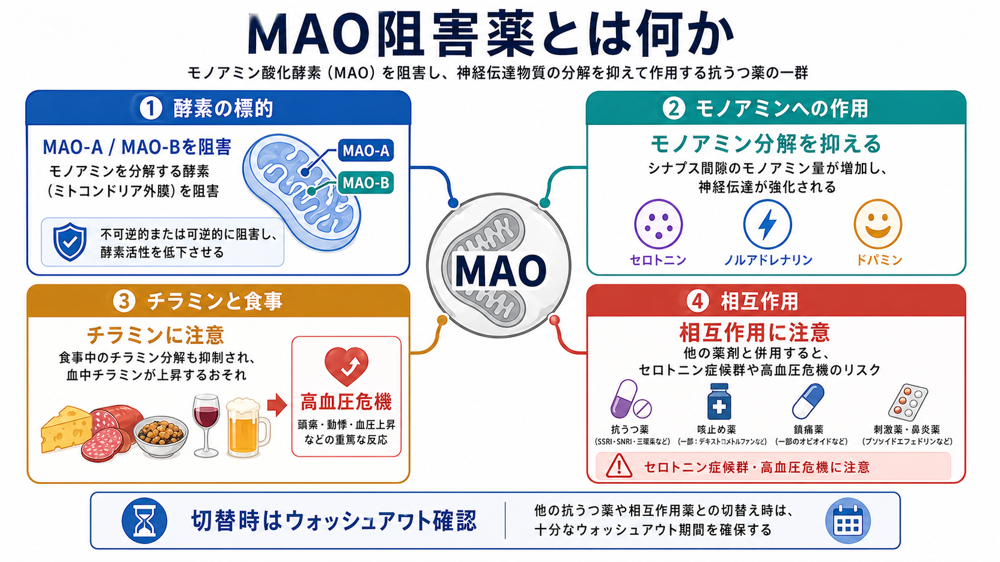
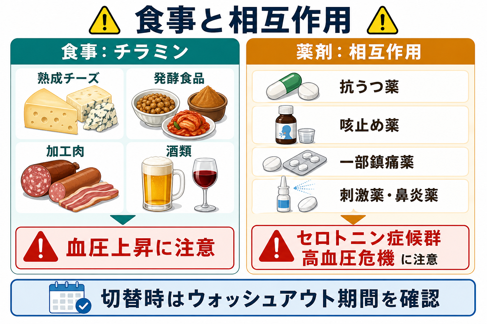

# MAO阻害薬とは何か

## 要点

- MAO阻害薬（monoamine oxidase inhibitors; MAOIs）は、モノアミン酸化酵素（MAO）による[[神経伝達物質]]の分解を抑える薬剤群である。主にセロトニン、ノルアドレナリン、ドパミン、チラミンの処理に関わる[1]。
- 古典的な非選択的・不可逆的 MAO 阻害薬にはフェネルジン、トラニルシプロミン、イソカルボキサジドなどがあり、うつ病、とくに治療抵抗性や非定型特徴をもつ抑うつで選択肢になることがある[1][7]。
- 臨床上の中核リスクは、チラミン含有食品との相互作用による高血圧危機と、セロトニン作動薬・交感神経刺激薬などとの薬物相互作用である[2][3][5]。
- 薬効そのものよりも、食事・併用薬・切替時のウォッシュアウトを管理できるかが安全性を大きく左右する[2][4][5]。

## この記事で答える問い

1. MAO-A と MAO-B は何を分解しているのか。
2. MAO阻害薬はなぜ抗うつ薬として働きうるのか。
3. なぜ食事制限、とくにチラミンが問題になるのか。
4. どのような薬物相互作用に注意する必要があるのか。

## まず結論

MAO阻害薬は、「モノアミンを増やす薬」とだけ覚えるより、「モノアミンとチラミンを分解する安全弁を弱める薬」と理解した方が臨床的に有用である。脳内ではセロトニン、ノルアドレナリン、ドパミンの分解が抑えられ、抗うつ作用につながりうる。一方、腸管・肝臓でのチラミン処理や、併用薬によるモノアミン増強も同時に問題になるため、高血圧危機や[[セロトニン症候群とは何か|セロトニン症候群]]のリスク管理が不可欠になる[1][2][5]。

## 背景

MAO阻害薬は初期の抗うつ薬群の一つであり、現在の[[SSRIとは何か|SSRI]]や[[SNRIとは何か|SNRI]]よりも古い歴史をもつ。現在は、食事制限、重篤な相互作用、過量服薬時の危険性から、うつ病治療の第一選択として使われることは少ない[1][7]。CANMAT 2016 では、SSRI/SNRI やミルタザピンなどを第一選択に置き、フェネルジンやトラニルシプロミンなどの MAO 阻害薬を、相互作用と副作用負担を踏まえた第三選択に位置づけている[7]。

ただし「古い薬だから不要」という理解は不正確である。治療抵抗性うつ病や非定型特徴をもつうつ病では、専門的管理のもとで選択肢になりうる[1][3][7]。したがって、現代的な位置づけは「日常的に広く使う薬」ではなく、「効果の可能性と安全管理の負担を慎重に比較して使う薬」である。

## 基本概念

MAO には主に MAO-A と MAO-B がある。MAO-A は腸管、肝臓、胎盤などにも分布し、セロトニンやノルアドレナリンの分解に重要である。MAO-B は脳、肝臓、血小板などに多く、フェネチルアミンなどを処理する。ドパミンとチラミンは MAO-A と MAO-B の両方に関わる[1]。

薬剤としては、次のように分けると理解しやすい。

| 区分 | 例 | 臨床上の意味 |
|---|---|---|
| 非選択的・不可逆的 MAO阻害薬 | フェネルジン、トラニルシプロミン、イソカルボキサジド | 抗うつ作用の一方で、食事・併用薬制限が大きい[1][2][3] |
| 可逆的 MAO-A 阻害薬 | モクロベミド | 国や地域で使用可能性が異なり、古典的 MAOI と同様の注意が必要な場合がある[7] |
| MAO-B 阻害薬 | セレギリン、ラサギリン、サフィナミドなど | パーキンソン病領域で使われるものが多い。貼付型セレギリンは大うつ病の適応ももつ[1][4] |

## 仕組み

MAO はミトコンドリア外膜に存在し、モノアミンを酸化的脱アミノ化によって分解する。MAO阻害薬がこの酵素活性を抑えると、シナプス前終末や細胞内でモノアミンの分解が減り、神経伝達に利用されるセロトニン、ノルアドレナリン、ドパミンの量や作用時間が変化する[1]。この点では、[[薬物療法は神経回路にどう作用するのか]]で扱う「神経伝達物質の利用可能性を変える薬」の一例である。

不可逆的 MAO阻害薬では、血中薬物濃度が下がっても酵素活性の回復には新しい酵素の再合成が必要になる。そのため、薬を中止した直後に相互作用リスクが消えるとは限らない[1][5]。トラニルシプロミンの添付文書でも、禁忌薬からの切替時には相手薬の半減期や活性代謝物を考慮し、MAOI 間や禁忌抗うつ薬への切替には一定の薬剤なし期間を置くことが示されている[2]。

## 図解

### チラミンと高血圧危機

チラミンは発酵・熟成・保存状態により増えやすい食品中アミンであり、通常は腸管や肝臓の MAO によって処理される。MAO が阻害されるとチラミンが処理されにくくなり、交感神経終末からノルアドレナリンなどの放出を促して、急激な血圧上昇を起こしうる[2][5][6]。

添付文書では、トラニルシプロミン使用中および中止後 2 週間は高チラミン食品・飲料を避けるよう示されている。例として、熟成・発酵・乾燥肉、サラミ、保存不良の肉魚、熟成チーズ、発酵食品、特定のアルコール飲料などが挙げられる[2]。フェネルジンでも、チラミン含有食品との相互作用による高血圧反応が重要な警告として扱われる[3]。

### 薬物相互作用

MAO阻害薬と、セロトニンやカテコラミンを増やす薬を重ねると、過剰なモノアミン作用が起こりうる。添付文書や毒性レビューでは、SSRI、SNRI、三環系抗うつ薬、他の MAOI、交感神経刺激薬、デキストロメトルファン、トラマドール、メペリジン、リネゾリド、メチレンブルーなどが問題になりうる薬剤として扱われている[2][5][7]。このため、[[薬物相互作用とは何か]]を考えるうえで MAO阻害薬は典型例になる。

症状としては、セロトニン症候群では精神状態変化、自律神経症状、神経筋症状が問題になり、高血圧危機では激しい頭痛、動悸、血圧上昇などが問題になる。いずれも教育目的の整理であり、実際の服薬・中止・切替は医療者の判断と添付文書に基づく必要がある[2][5]。

## 臨床・研究との接続

臨床では、MAO阻害薬の意義は「最後の切り札」だけではなく、モノアミン仮説の限界を考える教材にもなる。MAO を阻害してモノアミン利用可能性を上げても、抗うつ効果は即時に一様に出るわけではない。これは、うつ病の改善が単純な神経伝達物質量だけでなく、受容体適応、神経回路、睡眠・覚醒、ストレス系、認知・行動変化など複数レベルの時間的変化を含むことを示している[1][7]。

実践上は、次の三つをセットで考える。

| 観点 | 確認すること |
|---|---|
| 適応 | 治療抵抗性、非定型特徴、過去の反応、他治療の選択肢[1][7] |
| 安全性 | 血圧、心血管・脳血管リスク、過量服薬リスク、肝機能、転倒・低血圧リスク[2][5] |
| 生活・併用薬 | 食事、OTC薬、咳止め、鎮痛薬、鼻炎薬、他の抗うつ薬、抗菌薬など[2][5][7] |

## よくある誤解

### 「MAO阻害薬は危険だから使う意味がない」

危険性は実在するが、管理不能という意味ではない。治療抵抗性うつ病などで利益が見込まれる場合、専門的評価と食事・相互作用管理を前提に選択肢になる[1][7]。重要なのは、リスクを小さく見積もらないことである。

### 「チーズだけ避ければよい」

古典的に「チーズ反応」と呼ばれるが、問題はチーズに限らない。熟成、発酵、乾燥、保存不良によってチラミンが増えうる食品・飲料全体が対象になる[2][6]。

### 「中止したらすぐ相互作用は消える」

不可逆的 MAO阻害薬では、薬物が体内から減っても酵素活性の回復に時間がかかる。切替時のウォッシュアウトは、この点を考慮して設計される[1][2][5]。

## 関連ノート

- [[SSRIとは何か]]
- [[SNRIとは何か]]
- [[NaSSAとは何か]]
- [[セロトニン症候群とは何か]]
- [[薬物相互作用とは何か]]
- [[薬物療法は神経回路にどう作用するのか]]
- [[うつ病とは何か]]
- [[非定型うつ病とは何か]]

## 関連ノート候補

- チラミン反応とは何か
- 抗うつ薬のウォッシュアウト期間とは何か
- 治療抵抗性うつ病とは何か
- 抗うつ薬の食事制限とは何か

## MOC更新候補

- `content/00_MOC/` 配下の薬物療法・うつ病・精神薬理に関する MOC へ追加候補。ただし並列ジョブとの競合を避けるため、本記事では MOC ファイルを直接更新しない。

## 理解チェック

1. MAO-A と MAO-B は、どの神経伝達物質やアミンの処理に関わるか。
2. チラミンが高血圧危機につながる経路を、腸管・肝臓の MAO と交感神経終末の観点から説明できるか。
3. SSRI や SNRI から MAO阻害薬へ切り替えるとき、なぜウォッシュアウトが必要か。
4. 「MAO阻害薬はモノアミンを増やす薬」という説明に、どのような限界があるか。

## 未解決問題

- 非定型うつ病や治療抵抗性うつ病のどの臨床特徴が、MAO阻害薬への反応性をよりよく予測するのか。
- 食事制限を緩和できる製剤・投与経路・可逆的阻害薬が、実臨床でどの程度安全性と有効性のバランスを改善するのか。
- モノアミン分解阻害の急性効果と、抗うつ効果として観察される遅発性の神経回路変化を、どの階層のモデルで結びつけるのが妥当か。

## 参考文献

[1] Patel P, Saadabadi A. Monoamine Oxidase Inhibitors (MAOIs). *StatPearls*. Last update: 2025-12-13. NCBI Bookshelf. https://www.ncbi.nlm.nih.gov/books/NBK539848/

[2] DailyMed. Tranylcypromine tablet: prescribing information. Updated 2024-10-17; revised 2022-05. https://dailymed.nlm.nih.gov/dailymed/lookup.cfm?setid=df892a65-52e4-8eb2-e053-2a95a90aa25f

[3] DailyMed. NARDIL (phenelzine sulfate) tablet, film coated: prescribing information. Updated 2025-06-06. https://dailymed.nlm.nih.gov/dailymed/drugInfo.cfm?setid=513a41d0-37d4-4355-8a6d-a2c643bce6fa

[4] DailyMed. EMSAM (selegiline transdermal system): prescribing information. Updated 2020-05-15; revised 2020-05. https://dailymed.nlm.nih.gov/dailymed/drugInfo.cfm?audience=consumer&setid=b891bd9f-fdb8-4862-89c5-ecdd700398a3

[5] Garcia E, Santos C. Monoamine Oxidase Inhibitor Toxicity. *StatPearls*. Last update: 2023-07-17. NCBI Bookshelf. https://www.ncbi.nlm.nih.gov/books/NBK459386/

[6] Burns C, Kidron A. Biochemistry, Tyramine. *StatPearls*. Last update: 2022-10-10. NCBI Bookshelf. https://www.ncbi.nlm.nih.gov/books/NBK563197/

[7] Kennedy SH, Lam RW, McIntyre RS, et al. Canadian Network for Mood and Anxiety Treatments (CANMAT) 2016 Clinical Guidelines for the Management of Adults with Major Depressive Disorder: Section 3. Pharmacological Treatments. *Canadian Journal of Psychiatry*. 2016;61(9):540-560. https://pmc.ncbi.nlm.nih.gov/articles/PMC4994790/
