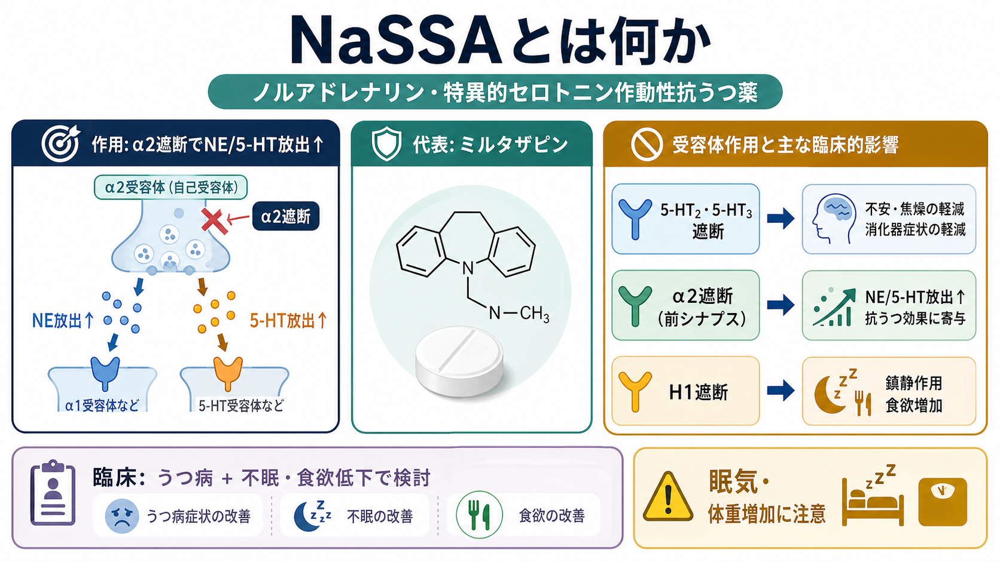
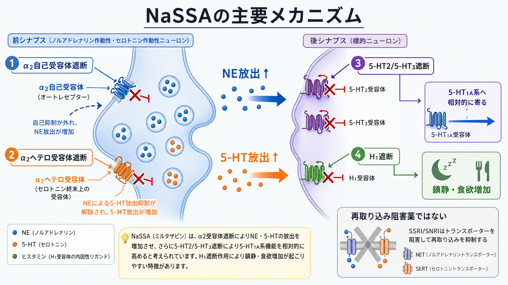

# NaSSAとは何か

## 要点

- NaSSA は noradrenergic and specific serotonergic antidepressant の略で、日本語では「ノルアドレナリン・特異的セロトニン作動性抗うつ薬」と訳される。代表薬はミルタザピンである[1][2]。
- ミルタザピンは、SSRI や SNRI のようにセロトニン・ノルアドレナリンの再取り込みを直接阻害する薬ではない。中枢の α2 アドレナリン受容体を遮断し、ノルアドレナリンとセロトニンの放出を増やす、という説明が基本になる[1][3]。
- 5-HT2、5-HT3、H1 受容体遮断が、抗うつ作用の特徴、消化器症状の少なさ、鎮静、食欲増加・体重増加と結びつく[1][4][5]。
- うつ病に不眠、食欲低下、悪心、性機能障害への懸念が重なる場合には特徴が活きることがある。一方で、日中の眠気、体重増加、脂質異常、ふらつきなどは評価すべき副作用である[1][5]。

## この記事で答える問い

1. NaSSA は SSRI/SNRI と何が違うのか。
2. ミルタザピンの鎮静や食欲増加は、どの受容体作用と関係するのか。
3. 臨床で「眠れる抗うつ薬」「食欲が出る薬」とだけ理解すると、何を見落とすのか。

## まず結論

NaSSA は、モノアミンを「再取り込み阻害」で増やすのではなく、α2 受容体遮断によってノルアドレナリンとセロトニンの放出を高め、同時に 5-HT2/5-HT3 受容体遮断によってセロトニン作用の出方を偏らせる抗うつ薬である[1][3]。代表薬のミルタザピンでは H1 受容体遮断も強く、これが鎮静、眠気、食欲増加、体重増加という臨床的に目立つ特徴につながる[1][5]。

したがって、NaSSA を理解するときの軸は「抗うつ作用」「睡眠・食欲への影響」「副作用としての眠気・体重増加」を同時に見ることである。これは個別の服薬判断ではなく、[[薬物療法は神経回路にどう作用するのか]]、[[うつ病とは何か]]、[[睡眠障害は脳機能にどのような影響を与えるのか]]をつなぐ薬理学的な見取り図として理解するとよい。

## 背景

抗うつ薬は、しばしば SSRI、SNRI、三環系、NaSSA などに分類される。ただし、分類名は「臨床効果のすべて」を説明するものではない。うつ病そのものも単一の神経伝達物質の不足だけで説明できる疾患ではなく、気分、睡眠、食欲、認知、活動性、身体症状、ストレス応答、報酬系などが重なる状態として評価される[6]。

この中でミルタザピンは、抗うつ作用だけでなく、睡眠や食欲に目立った影響を持つ薬として使われる。Cochrane レビューでは、急性期うつ病に対するミルタザピンは他の抗うつ薬と比較して一定の有効性を示し、SSRI と比べて体重増加・食欲増加・傾眠が起こりやすい一方、悪心・嘔吐や性機能障害は少ない傾向が示されている[4]。これは「よい薬／悪い薬」という単純な話ではなく、症状プロファイルと副作用プロファイルを照合して考える必要がある、ということを意味する。

## 基本概念

### NaSSAという分類

NaSSA は、ノルアドレナリン系とセロトニン系に作用するが、その方法が再取り込み阻害薬とは異なる。ミルタザピンは中枢の presynaptic α2 アドレナリン受容体、すなわち自己受容体とヘテロ受容体を遮断し、ノルアドレナリンおよびセロトニンの神経伝達を増強すると説明される[1][2]。

ここで重要なのは、「セロトニンを増やす薬」とだけ言わないことである。ミルタザピンは 5-HT2 と 5-HT3 受容体を遮断するため、セロトニン放出が増えても、すべてのセロトニン受容体が同じように刺激されるわけではない[1][3]。この「特異的セロトニン作動性」という部分が NaSSA の名前に反映されている。

### 代表薬としてのミルタザピン

ミルタザピンは成人の大うつ病性障害に用いられる抗うつ薬で、米国添付文書では 15-45 mg/日の範囲が用量として記載されている[1]。半減期はおよそ 20-40 時間で、通常は1日1回投与で扱われる[1][2]。ここでの用量や投与法は薬理の理解のための情報であり、個別の開始・中止・増減は診療上の判断である。

## 仕組み

### 1. α2受容体遮断でNEと5-HT放出が増える

α2 自己受容体は、ノルアドレナリン神経終末で「出しすぎ」を抑える負のフィードバックとして働く。これを遮断すると、ノルアドレナリン放出が増える方向に働く。さらに、セロトニン神経終末にある α2 ヘテロ受容体を遮断することで、セロトニン放出も増えると説明される[1][3]。

この点で、NaSSA は SSRI/SNRI と違う。SSRI/SNRI はトランスポーターを阻害して再取り込みを抑えるのに対し、ミルタザピンは主に受容体遮断を通じて放出と受容体プロファイルを変える[1]。

### 2. 5-HT2/5-HT3遮断で作用の出方が変わる

ミルタザピンは 5-HT2 および 5-HT3 受容体を遮断する[1][3]。5-HT3 受容体遮断は、SSRI で問題になりやすい悪心・嘔吐などの消化器症状が比較的少ないことと関連づけて説明されることがある[4]。また 5-HT2 受容体遮断は、不眠、焦燥、性機能障害などの副作用プロファイルの違いを考える手がかりになる。

ただし、これらは「その症状が必ず起きない」という意味ではない。副作用は個人差、併用薬、身体疾患、年齢、用量、治療期間で変わる。

### 3. H1遮断が鎮静と食欲増加に関わる

ミルタザピンは H1 受容体の強い遮断作用を持ち、添付文書でも鎮静作用を説明しうる性質として記載されている[1]。このため、服用初期から眠気が目立つことがある。DailyMed の臨床試験データでは、傾眠、食欲増加、体重増加、めまいがよくみられる副作用として示されている[1]。

2025年の有害事象に関する系統的レビュー・メタ解析でも、ミルタザピンはプラセボと比べて傾眠、体重増加、口渇、めまい、食欲増加のリスクを高めると報告された[5]。つまり、鎮静や食欲増加は臨床上の利点になりうる一方、そのまま副作用にもなる。

## 図解

上の1枚目は、NaSSA を「代表薬」「受容体作用」「臨床上の特徴」に分けた概念地図である。NaSSA の理解では、α2 遮断だけでなく、5-HT2/5-HT3 遮断と H1 遮断を同じ図の中に置くと、抗うつ作用、鎮静、食欲増加が一続きの薬理として見える。

2枚目は、前シナプス側の α2 自己受容体・ヘテロ受容体遮断と、後シナプス側の 5-HT2/5-HT3/H1 受容体遮断を分けた機序図である。SSRI/SNRI のような再取り込み阻害ではない、という対比が理解の要点になる。

## 臨床・研究との接続

### 不眠・食欲低下を伴ううつ病で考えやすい

ミルタザピンは、不眠や食欲低下を伴ううつ病で候補になりやすい。これは、H1 遮断による鎮静と食欲増加が、症状に合えば臨床上の利点として働くためである[1][2]。ただし、眠気が強すぎる、日中の活動性が落ちる、体重増加が問題になる、脂質・糖代謝リスクがある、といった場合には同じ性質が不利益になる。

### 「睡眠薬代わり」として単純化しない

ミルタザピンには鎮静作用があるが、NaSSA は抗うつ薬であり、「眠れるから使う薬」とだけ理解すると狭すぎる。Therapeutics Letter は、ミルタザピンを不眠目的で処方することについて、臨床試験で十分に検証された使い方ではないと注意を促している[7]。睡眠の問題は、[[睡眠障害は脳機能にどのような影響を与えるのか]]や生活リズム、併存疾患、物質使用、他薬剤の影響も含めて見る必要がある。

### 高齢者・身体疾患・併用薬では副作用を見る

ミルタザピンは鎮静、ふらつき、めまい、食欲増加、体重増加を起こしうる[1][5]。高齢者では過鎮静、転倒、せん妄様の混乱、腎機能低下に伴う薬物動態の変化などを考える必要がある[1]。また、双極性障害の躁転、セロトニン症候群、QT 延長、低ナトリウム血症、無顆粒球症など、頻度は高くなくても添付文書上の重要な警告・注意は押さえるべきである[1]。

### ガイドライン上の位置づけ

VA/DoD の大うつ病性障害ガイドラインは、薬物療法を単独の正解としてではなく、重症度、患者の希望、過去の反応、副作用、併存症、心理療法や測定に基づくケアと組み合わせて扱う[6]。NaSSA の理解も同じで、「機序が魅力的だから選ぶ」のではなく、症状、リスク、本人の生活上の優先事項、これまでの治療歴を合わせて考える。

## よくある誤解

### NaSSAはSNRIの一種である

違う。どちらもノルアドレナリンとセロトニンに関わるが、SNRI は再取り込み阻害薬であり、NaSSA は主に α2 受容体遮断と 5-HT2/5-HT3 受容体遮断で説明される[1][3]。

### 眠気があるほど抗うつ効果が強い

眠気は主に H1 受容体遮断と関係する副作用・薬理作用であり、抗うつ効果そのものの強さを単純に示す指標ではない[1][5]。眠気によって睡眠が整い、結果として日中の機能が改善する場合もあるが、過鎮静で活動性が落ちれば不利益になる。

### 食欲増加は常に望ましい

食欲低下や体重減少がある人には利点になりうるが、体重増加、脂質異常、糖代謝リスク、ボディイメージの苦痛がある場合には問題になりうる[1][5]。薬理作用は文脈によって利点にも副作用にもなる。

### 副作用が少ない薬である

性機能障害や悪心・嘔吐は SSRI より少ない傾向がある一方で、傾眠、食欲増加、体重増加は起こりやすい[4][5]。副作用が「少ない」というより、プロファイルが異なると考える方が正確である。

## 関連ノート

- [[薬物療法は神経回路にどう作用するのか]]
- [[うつ病とは何か]]
- [[セロトニン仮説はうつ病をどこまで説明できるのか]]
- [[受容体にはどのような種類があるのか]]
- [[睡眠障害は脳機能にどのような影響を与えるのか]]
- [[双極性障害とうつ病はどう鑑別するのか]]

MOC更新候補: `content/00_MOC/MOC｜精神医学.md`、薬物療法領域のMOCが作成される場合はその配下に追加。

## 理解チェック

1. NaSSA と SSRI/SNRI は、モノアミン神経伝達を変える方法として何が違うか。
2. ミルタザピンの鎮静と食欲増加は、どの受容体遮断と関連づけて説明されるか。
3. 「不眠があるうつ病に合いやすい」という特徴が、どのような場合に不利益へ変わるか。
4. NaSSA を「セロトニンを増やす薬」とだけ説明すると、5-HT2/5-HT3 遮断のどの点を見落とすか。

## 未解決問題

- ミルタザピンの「低用量ほど眠い」という臨床的経験則はよく語られるが、個人差が大きく、用量反応関係を単純化しすぎない検討が必要である。
- 長期使用に伴う体重・代謝リスク、睡眠構造への影響、併用療法での利益と害は、短期試験だけでは十分に判断しにくい[5][7]。
- 薬剤選択を、診断名だけでなく睡眠、食欲、焦燥、身体疾患、本人の価値観と結びつける実装研究が必要である。

## 参考文献

[1] DailyMed. *Mirtazapine tablet, film coated: Full Prescribing Information*. U.S. National Library of Medicine. https://dailymed.nlm.nih.gov/dailymed/drugInfo.cfm?setid=3000c647-d052-4ebd-a809-39a4a514842d

[2] Jilani, T. N., Gibbons, J. R., Faizy, R. M., & Saadabadi, A. (2024). *Mirtazapine*. StatPearls, NCBI Bookshelf. https://www.ncbi.nlm.nih.gov/books/NBK519059/

[3] Anttila, S. A. K., & Leinonen, E. V. J. (2001). A review of the pharmacological and clinical profile of mirtazapine. *CNS Drug Reviews, 7*(3), 249-264. https://pubmed.ncbi.nlm.nih.gov/11607047/

[4] Watanabe, N., Omori, I. M., Nakagawa, A., Cipriani, A., Barbui, C., Churchill, R., & Furukawa, T. A. (2022). Mirtazapine versus other antidepressive agents for depression. *Cochrane Database of Systematic Reviews*, CD006528. https://doi.org/10.1002/14651858.CD006528.pub2

[5] Kamp, C. B., Petersen, J. J., Faltermeier, P., et al. (2025). The risks of adverse events with mirtazapine for adults with major depressive disorder: A systematic review with meta-analysis and trial sequential analysis. *BMC Psychiatry, 25*, 67. https://doi.org/10.1186/s12888-024-06396-6

[6] VA/DoD Clinical Practice Guideline Work Group. (2022). *VA/DoD Clinical Practice Guideline for the Management of Major Depressive Disorder*. https://www.healthquality.va.gov/guidelines/MH/mdd/VADoDMDDCPGFinal508.pdf

[7] Therapeutics Initiative. (2021). *Mirtazapine: Update on efficacy, safety, dose response*. Therapeutics Letter 129. https://www.ncbi.nlm.nih.gov/books/NBK598472/
