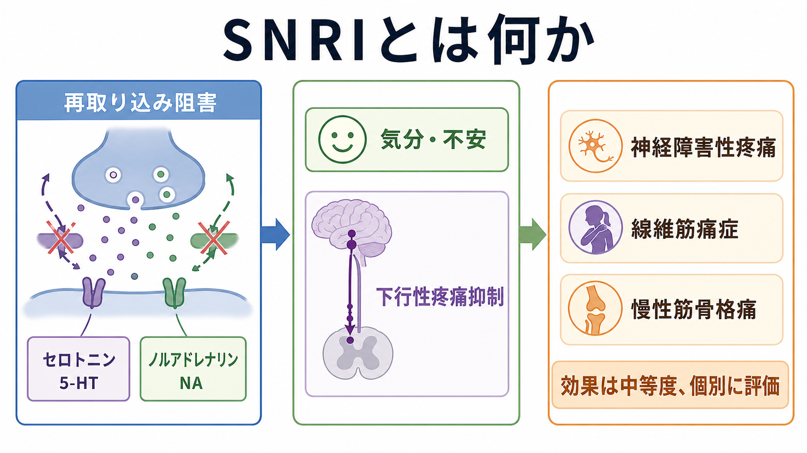
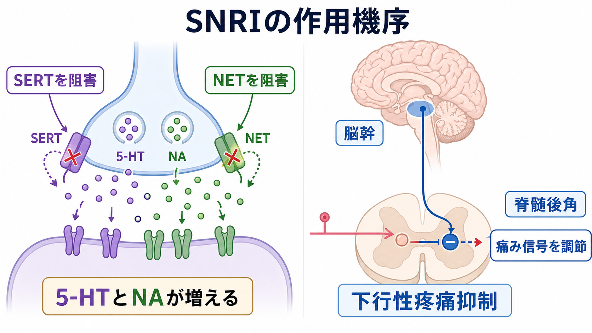
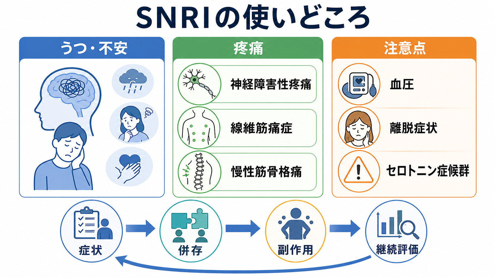

# SNRIとは何か

## 要点

- SNRI は serotonin-norepinephrine reuptake inhibitor、つまり**セロトニン・ノルアドレナリン再取り込み阻害薬**である。SERT と NET を阻害し、[[セロトニンは気分だけに関わるのか|セロトニン]]と[[ノルアドレナリンは覚醒とストレスにどう関わるのか|ノルアドレナリン]]の細胞外利用可能性を変える[1][2]。
- 抗うつ薬として使われるだけでなく、デュロキセチンやミルナシプランなど一部の SNRI は、糖尿病性末梢神経障害性疼痛、線維筋痛症、慢性筋骨格痛などの疼痛領域でも位置づけられている[1][3][4]。
- 疼痛への作用は、単に「気分が改善するから痛みが軽くなる」だけではない。5-HT と NA が脳幹から脊髄後角へ向かう**下行性疼痛抑制系**を強め、痛み信号の伝達を調節するという機序が重要である[5][6]。
- ただし、効果は万能ではなく、神経障害性疼痛に対する推奨も「個別に選択肢として検討する」粒度である。疼痛の種類、併存するうつ・不安、睡眠、血圧、肝腎機能、相互作用、副作用を合わせて評価する必要がある[4][7]。
- 本記事は教育・研究目的の整理であり、個別の服薬開始・中止・用量調整を指示するものではない。

## この記事で答える問い

1. SNRI は SSRI や三環系抗うつ薬と何が違うのか。
2. SERT と NET を阻害するとは、シナプスで何が起きることなのか。
3. SNRI が疼痛、とくに神経障害性疼痛や慢性疼痛で使われる理由は何か。
4. 臨床で考えるべき副作用・相互作用・中止時の注意は何か。

## まず結論

SNRI は、[[神経伝達物質はどのように除去されるのか|再取り込み]]を妨げることで、セロトニンとノルアドレナリンの信号を変える薬物群である。抗うつ作用の説明では、気分、不安、意欲、睡眠などに関わる広域調節系への作用として理解できる。一方、疼痛への応用では、脳幹から脊髄後角へ降りる下行性疼痛抑制系が焦点になる。痛み入力そのものを末梢で消すというより、脊髄レベルで痛み信号が上行しやすいかどうかを調節する薬として読むと理解しやすい[5][6]。

臨床的には、デュロキセチンは複数の疼痛適応を持つ代表的 SNRI であり、ミルナシプランは米国では線維筋痛症に用いられる。ベンラファキシンはうつ病・不安症領域でよく扱われるが、血圧上昇や中止時症状などに注意が必要である[1][2][3]。したがって SNRI は「抗うつ薬」でもあり「疼痛調節薬」でもあるが、そのどちらでも、効果判定と副作用モニタリングをセットで考える薬である。

## 背景

うつ病や不安症では、気分だけでなく身体痛、疲労、睡眠障害、注意集中困難が併存しやすい。逆に、慢性疼痛では気分の落ち込み、不安、活動低下、睡眠障害が併存しやすい。この重なりは「痛みは気のせい」という意味ではない。[[精神疾患と疼痛はどう関係するのか|疼痛と精神症状]]は、注意、情動、予測、報酬、ストレス反応、下行性疼痛調節を共有するため、相互に影響しうる。

抗うつ薬の中には、疼痛に対して独立した効果を示すものがある。三環系抗うつ薬と SNRI はその代表で、神経障害性疼痛の薬物療法ではアミトリプチリン、デュロキセチン、ガバペンチン、プレガバリンなどが初期選択肢として扱われるガイドラインがある[4]。2025年の NeuPSIG 系統的レビューでも、神経障害性疼痛の薬物療法の中で SNRI は主要に評価される薬物クラスの一つである[7]。

## 基本概念

### SNRI は何を阻害するのか

シナプスで放出された神経伝達物質は、受容体に作用したあと、トランスポーターで細胞内へ戻される。セロトニンでは SERT、ノルアドレナリンでは NET が重要である。SNRI はこの SERT と NET を阻害し、細胞外に残る 5-HT と NA の時間幅・濃度動態を変える[1][2]。

この説明は「セロトニンやノルアドレナリンが足りないから補う」という単純な補充モデルではない。実際には、再取り込み阻害を起点に、受容体感受性、神経回路の可塑性、睡眠、認知、行動、環境との相互作用が変化する。したがって SNRI は、単一の欠乏物質を補う薬というより、モノアミン系の信号の読まれ方を変える薬である。

### 代表的な薬剤

| 薬剤 | 主な位置づけ | 疼痛との関係 | 注意点の例 |
|---|---|---|---|
| デュロキセチン | うつ病、不安症、疼痛領域 | 糖尿病性末梢神経障害性疼痛、線維筋痛症、慢性筋骨格痛などで使われる[1] | 肝疾患・高度腎機能低下、眠気、悪心、離脱症状など |
| ベンラファキシン | うつ病、不安症領域 | 神経障害性疼痛で検討されることはあるが、疼痛適応は国・製剤で異なる | 血圧上昇、離脱症状、セロトニン症候群など[2] |
| ミルナシプラン | 国により適応が異なる | 米国では線維筋痛症に適応がある[3] | 心拍・血圧、離脱症状、併用薬など |

日本での適応や製剤名は時期・承認状況で変わりうるため、実際の使用可否は最新の添付文書や診療ガイドラインで確認する必要がある。

## 仕組み

### 1. SERT と NET の阻害

SNRI は、SERT と NET に結合して再取り込みを抑える。これにより、放出後の 5-HT と NA が受容体周辺に残りやすくなる。抗うつ・抗不安作用では、前頭前野、扁桃体、海馬、脳幹、視床下部などを含む広域ネットワークの調節として理解される。

### 2. 下行性疼痛抑制系の増強

疼痛領域で重要なのは、脳幹から脊髄後角へ向かう下行性疼痛抑制系である。脊髄後角は、末梢から来る侵害受容入力や神経障害性入力が上位中枢へ送られる入り口に近い。ここで 5-HT と NA を介した調節が強まると、痛み信号がそのまま増幅されるのを抑えやすくなる[5][6]。

### 3. 鎮痛効果は「気分改善の副産物」だけではない

デュロキセチンの慢性疼痛レビューでは、糖尿病性末梢神経障害性疼痛や線維筋痛症に対する鎮痛効果が、抗うつ作用とは別の下行性疼痛抑制の増強として説明されている[6]。もちろん、気分・睡眠・活動性が改善すれば痛み体験も変わる。しかし SNRI の疼痛応用を理解するには、情動改善と脊髄レベルの疼痛調節を分けて考えることが重要である。

### 4. 薬剤ごとに SERT/NET 作用の比率は異なる

SNRI とひとまとめにされても、各薬剤の SERT と NET への作用比は同じではない。たとえばベンラファキシンは用量域によってセロトニン優位からノルアドレナリン作用が目立つ方向へ変化しやすいと説明されることがある。一方、ミルナシプランは相対的にノルアドレナリン寄り、デュロキセチンは比較的バランス型として扱われることが多い[8]。ただし、受容体占有率や臨床効果は単純な比率だけでは決まらない。

## 図解

図1は、SNRI を「再取り込み阻害」「気分・不安」「疼痛調節」「効果判定」の4点から整理した概念地図である。図2は、シナプスで SERT/NET を阻害する過程と、下行性疼痛抑制系が脊髄後角で痛み信号を調節する過程をつないで示している。

図3は、臨床で SNRI を考えるときの視点を、うつ・不安、疼痛、注意点に分けたものである。実務上は「効くか」だけでなく、「どの症状を目標にするか」「どの副作用を監視するか」「いつ評価し直すか」を同時に決める。

## 臨床・研究との接続

### うつ病・不安症との接続

ベンラファキシンやデュロキセチンは、うつ病や不安症領域で用いられる代表的 SNRI である。ベンラファキシン徐放製剤の添付文書では、大うつ病性障害、全般不安症、社交不安症、パニック症が適応として示されている[2]。デュロキセチンも大うつ病性障害や全般不安症に加え、疼痛適応を持つ製剤がある[1]。

ここで重要なのは、SNRI を「SSRI より強い薬」と単純化しないことである。セロトニン系とノルアドレナリン系の両方に作用することは特徴だが、それが常に優越性を意味するわけではない。症状プロフィール、過去の反応、併存症、副作用、相互作用、患者の希望を含めた選択になる。

### 神経障害性疼痛

NICE CG173 は、三叉神経痛を除く成人の神経障害性疼痛に対して、アミトリプチリン、デュロキセチン、ガバペンチン、プレガバリンのいずれかを初期治療として選ぶことを推奨している[4]。2025年の NeuPSIG 系統的レビューは、2015年以降の薬物療法・非侵襲的神経調節のエビデンスを更新し、SNRI を神経障害性疼痛治療の主要クラスとして評価している[7]。

ただし、神経障害性疼痛と一口に言っても、糖尿病性神経障害、帯状疱疹後神経痛、脊髄損傷後疼痛、化学療法誘発性末梢神経障害などで背景が異なる。SNRI が第一に合う場合もあれば、眠気、血圧、腎機能、転倒リスク、併用薬の観点から別薬がよい場合もある。

### 線維筋痛症・慢性筋骨格痛

デュロキセチンの添付文書では、線維筋痛症や慢性筋骨格痛に対する用法・臨床試験の記載がある[1]。ミルナシプランは米国で線維筋痛症の管理に適応を持つ[3]。これらは、[[線維筋痛症と精神症状はどう関係するのか|線維筋痛症]]を「末梢の損傷だけで説明する疾患」と見るより、痛覚過敏、睡眠、疲労、情動、活動性を含む中枢性疼痛調節の問題として考える視点と相性がよい。

### 安全性とモニタリング

SNRI では、悪心、口渇、便秘、発汗、眠気または不眠、性機能障害などが問題になることがある。さらに、血圧上昇、セロトニン症候群、出血リスク、躁転、低ナトリウム血症、中止時症状などは臨床上の重要な注意点である[1][2]。とくにベンラファキシンでは血圧の定期的確認が明記されており、中止時には段階的な減量が推奨される[2]。

このため、SNRI を疼痛目的で考える場合でも、精神症状だけでなく、血圧、眠気、転倒、肝腎機能、併用する抗凝固薬・NSAIDs・トリプタン・他の抗うつ薬などを確認する必要がある。教育的には、「疼痛に使える抗うつ薬」ではなく、「疼痛にも作用するが全身的なモノアミン調節薬」として扱うほうが安全である。

## よくある誤解

### 誤解1: SNRI は SSRI の上位版である

SNRI は SSRI より広い作用点を持つが、それだけで上位版とは言えない。SSRI が適する症例もあれば、SNRI が適する症例もある。副作用も異なり、ノルアドレナリン作用が血圧、発汗、不眠、動悸などと関係することがある。

### 誤解2: SNRI の鎮痛効果は、うつがよくなるから起きる

気分改善は痛み体験を変えうるが、SNRI の疼痛作用は下行性疼痛抑制系の増強としても説明される[5][6]。つまり、疼痛への応用は「心理的な痛みだから抗うつ薬を使う」という意味ではない。

### 誤解3: 神経障害性疼痛なら SNRI が必ず第一選択である

ガイドラインではデュロキセチンが初期選択肢に含まれるが、アミトリプチリン、ガバペンチン、プレガバリンなども選択肢である[4]。疼痛の種類、眠気を許容できるか、腎機能、肥満、血圧、併存するうつ・不安、薬物相互作用によって選び方は変わる。

### 誤解4: よくなったら急にやめてよい

SNRI では中止時症状が起こりうる。添付文書でも、急な中止ではなく段階的な減量が推奨されている[1][2][3]。個別の中止計画は治療者と相談して決める必要がある。

## 関連ノート

- [[神経伝達物質はどのように除去されるのか]]
- [[セロトニンは気分だけに関わるのか]]
- [[ノルアドレナリンは覚醒とストレスにどう関わるのか]]
- [[薬物療法は神経回路にどう作用するのか]]
- [[精神疾患と疼痛はどう関係するのか]]
- [[慢性疼痛と精神疾患はどう関係するのか]]
- [[疼痛症状は精神科でどう評価するか]]
- [[線維筋痛症と精神症状はどう関係するのか]]
- [[セロトニン症候群とは何か]]
- [[アドヒアランスとは何か]]

関連ノート候補:

- SSRIとは何か
- 三環系抗うつ薬とは何か
- デュロキセチンとは何か
- ベンラファキシンとは何か
- 下行性疼痛抑制系とは何か
- 神経障害性疼痛とは何か
- 薬物相互作用とは何か
- 薬物療法のリスクベネフィットをどう考えるか
- 薬物療法のアドヒアランスをどう支えるか
- 高齢者の薬物療法では何に注意するか

MOC更新候補:

- `content/00_MOC/` 配下の薬物療法、精神科治療、疼痛関連 MOC に `[[SNRIとは何か]]` を追加する候補。
- 並列ジョブとの競合を避けるため、このタスクでは MOC 本体は更新しない。

## 理解チェック

1. SNRI が阻害する SERT と NET は、それぞれどの神経伝達物質の再取り込みに関わるか。
2. SNRI の疼痛作用を「気分改善の副産物」だけで説明しにくい理由は何か。
3. 神経障害性疼痛に対して、デュロキセチン以外にどのような初期選択肢があるか。
4. SNRI を使うとき、血圧や中止時症状を確認する理由は何か。
5. 「SNRI は SSRI の上位版」という説明のどこが不正確か。

## 参考文献

[1] DailyMed. *Duloxetine delayed-release capsules: prescribing information*. U.S. National Library of Medicine. https://dailymed.nlm.nih.gov/dailymed/drugInfo.cfm?setid=a95cc04c-58e9-487f-8992-ef30df03a3cd

[2] DailyMed. *Venlafaxine hydrochloride extended-release capsules: prescribing information*. U.S. National Library of Medicine. Revised 10/2025. https://www.dailymed.nlm.nih.gov/dailymed/drugInfo.cfm?setid=7aa3edba-4248-49bb-86f7-06fdbf2a6fb7

[3] DailyMed. *Savella (milnacipran hydrochloride) tablets: prescribing information*. U.S. National Library of Medicine. https://dailymed.nlm.nih.gov/dailymed/lookup.cfm?setid=9b3d078b-d12f-47ef-baa4-35b88b090ed4

[4] National Institute for Health and Care Excellence. (2020). *Neuropathic pain in adults: pharmacological management in non-specialist settings. NICE Clinical Guideline CG173*. https://www.nice.org.uk/guidance/cg173

[5] Marks, D. M., Shah, M. J., Patkar, A. A., Masand, P. S., Park, G.-Y., & Pae, C.-U. (2009). Serotonin-norepinephrine reuptake inhibitors for pain control: premise and promise. *Current Neuropharmacology, 7*(4), 331-336. https://doi.org/10.2174/157015909790031201

[6] Pergolizzi, J. V., Raffa, R. B., Taylor, R., Rodriguez, G., Nalamachu, S., & Langley, P. (2013). A review of duloxetine 60 mg once-daily dosing for the management of diabetic peripheral neuropathic pain, fibromyalgia, and chronic musculoskeletal pain due to chronic osteoarthritis pain and low back pain. *Pain Practice, 13*(3), 239-252. https://doi.org/10.1111/j.1533-2500.2012.00578.x

[7] Soliman, N., Moisset, X., Ferraro, M. C., et al. (2025). Pharmacotherapy and non-invasive neuromodulation for neuropathic pain: a systematic review and meta-analysis. *The Lancet Neurology, 24*(5), 413-428. https://doi.org/10.1016/S1474-4422(25)00068-7

[8] Sansone, R. A., & Sansone, L. A. (2014). Serotonin norepinephrine reuptake inhibitors: a pharmacological comparison. *Innovations in Clinical Neuroscience, 11*(3-4), 37-42. https://www.ncbi.nlm.nih.gov/pmc/articles/PMC4008300/

## 未解決問題

- 疼痛タイプごとに、SNRI、三環系抗うつ薬、ガバペンチノイド、非薬物療法をどう組み合わせると、効果と副作用のバランスが最もよくなるのか。
- SNRI の SERT/NET 作用比の違いが、個々の患者の鎮痛効果や副作用プロファイルをどこまで予測するのか。
- 慢性疼痛における下行性疼痛抑制系の機能低下を、臨床で簡便に評価する指標をどう作るか。

## 更新ログ

- 2026-04-28: 初稿作成。SNRI の基本概念、再取り込み阻害、下行性疼痛抑制、疼痛応用、注意点を整理し、画像3点と参考文献を追加。
