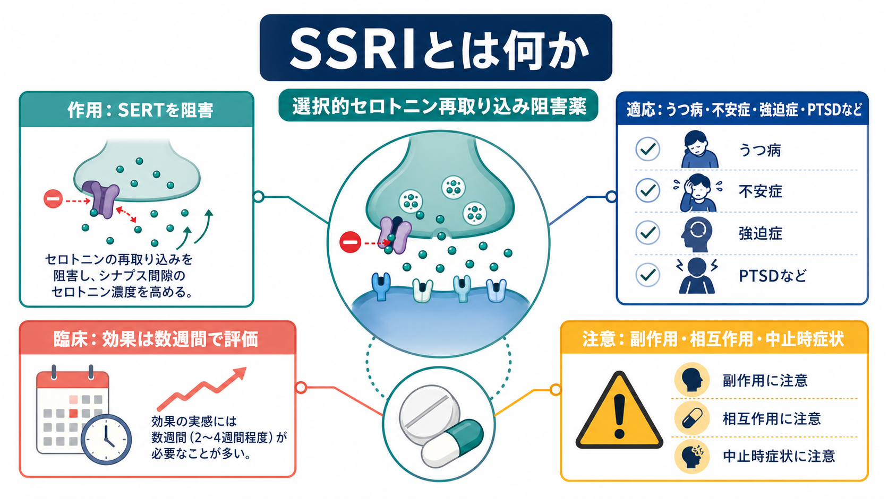
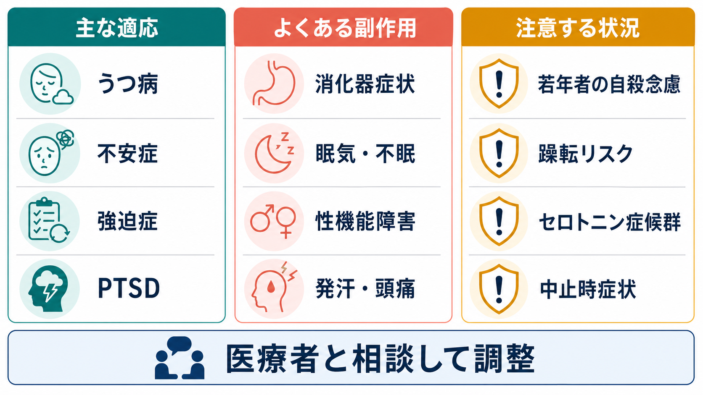

# SSRIとは何か

## 要点

- SSRI は selective serotonin reuptake inhibitor、つまり選択的セロトニン再取り込み阻害薬である。主作用はシナプス前終末のセロトニン輸送体 SERT を阻害し、シナプス間隙のセロトニン作用を変えることである[1]。
- 代表的な適応は、うつ病、不安症、強迫症、パニック症、PTSD などである。ただし、疾患ごとに推奨薬、併用する心理療法、評価期間、注意点は異なる[2][3][4][5]。
- SSRI は三環系抗うつ薬や MAO 阻害薬に比べて忍容性が高いことが多いが、副作用が軽い薬という意味ではない。消化器症状、睡眠変化、性機能障害、発汗、頭痛、中止時症状、相互作用、セロトニン症候群、若年者の自殺念慮への注意が必要である[1][6][7]。
- 「セロトニン不足を補う薬」とだけ説明すると単純化しすぎる。急性には SERT 阻害が起きるが、臨床効果は受容体感受性、神経回路、情動処理、症状変化が時間をかけて変わる過程として評価する[1][8]。

## この記事で答える問い

1. SSRI は[[シナプスとは何か|シナプス]]で何を変える薬なのか。
2. どの疾患で使われ、どのように効果を評価するのか。
3. 副作用や相互作用を、どのような枠組みで理解すればよいのか。
4. 「セロトニンを増やせば治る」という説明の限界はどこにあるのか。

## まず結論

SSRI は、[[セロトニンは気分だけに関わるのか|セロトニン]]を「増やす薬」というより、SERT による再取り込みを阻害してセロトニン信号の時間幅と強さを変える薬である[1]。その作用は、[[神経伝達物質はどのように除去されるのか|神経伝達物質の除去]]というシナプス信号終結機構に介入するものとして理解できる。

臨床では、[[うつ病とは何か|うつ病]]、[[不安症群とは何か|不安症群]]、[[強迫症とは何か|強迫症]]、[[パニック症とは何か|パニック症]]、[[PTSDとは何か|PTSD]]などで用いられる。しかし、疾患名だけで機械的に選ぶ薬ではない。症状の重症度、過去の反応、副作用歴、妊娠可能性、併用薬、躁転リスク、自殺リスク、本人の希望を合わせて、リスクと利益を継続的に見直す薬である[2][3][4][5][6]。

## 背景

SSRI が広く使われる理由は、抗うつ作用だけでなく、不安、強迫、外傷関連症状など、セロトニン系が関わる複数の臨床領域に有効性が示されてきたためである。大うつ病の急性期治療では、抗うつ薬全体としてプラセボを上回る有効性が示され、薬剤間で有効性と受容性に差があることも報告されている[8]。一方で、薬物療法だけでなく、心理療法、環境調整、睡眠、身体疾患、社会的支援を含めて治療計画を立てる必要がある。

SSRI は教育・研究上、「モノアミン仮説」や「セロトニン仮説」と結びつけて説明されやすい。しかし、[[セロトニン仮説はうつ病をどこまで説明できるのか|うつ病のセロトニン仮説]]は、うつ病の全体を単一物質の不足に還元する理論ではない。薬理作用と疾患原因は同じではない、という区別が重要である。

## 基本概念

### SSRI の代表薬

SSRI には、フルオキセチン、セルトラリン、パロキセチン、フルボキサミン、シタロプラム、エスシタロプラム、ビラゾドンなどが含まれる[6]。日本での承認状況や用量は国・時点で異なるため、この記事では個別の処方指示ではなく、薬理と臨床判断の見取り図を扱う。

### 選択的とは何か

「選択的」とは、三環系抗うつ薬などに比べて、ノルアドレナリン、ヒスタミン、アセチルコリン系への直接作用が相対的に少なく、主に SERT を標的にするという意味である[1]。ただし、薬剤ごとに CYP 阻害、半減期、離脱しやすさ、鎮静・賦活の出方は異なる。選択的であることは、無害であることを意味しない。

## 仕組み

SSRI はシナプス前終末にある SERT を阻害し、放出後のセロトニンが細胞内へ戻る過程を抑える。その結果、シナプス間隙でセロトニンが受容体に作用しやすくなる[1]。これは急性の薬理作用であり、服薬直後から SERT 阻害自体は起こりうる。

しかし、気分、不安、強迫、外傷記憶に関わる症状が改善するには、通常、数週間単位の観察が必要になる[1][2]。この時間差は、単に「セロトニン濃度が上がる」だけで臨床効果が決まらないことを示している。自己受容体、シナプス後受容体、情動処理、睡眠、認知的評価、生活リズム、治療同盟などが重なって、症状の変化として現れる。

## 図解

上の図は、通常時と SSRI 服用時の違いを比較している。重要なのは、SSRI が「セロトニンを直接注入する」薬ではなく、再取り込みを抑えて、既存のセロトニン信号の読み取られ方を変える薬だという点である。

下の図は、適応、副作用、注意点を臨床的に並べたものである。SSRI を理解するときは、効果だけでなく、副作用とモニタリングを同じ図の中に置く必要がある。

## 臨床・研究との接続

### 適応

NICE の成人うつ病ガイドラインは、抗うつ薬の利益と害、離脱症状、過去の治療反応、本人の希望を話し合ったうえで治療選択を行うことを重視している[2]。全般不安症やパニック症では、セルトラリンを選択肢とし、無効なら他の SSRI または SNRI を検討する流れが示されている[3]。強迫症では、成人の初期薬物療法として複数の SSRI が挙げられている[4]。PTSD では、2023 年の VA/DoD 系資料で、セルトラリンとパロキセチンが比較的強い根拠を持つ SSRI とされる[5]。

### 副作用とモニタリング

よくある副作用には、悪心・下痢などの消化器症状、眠気または不眠、頭痛、発汗、性機能障害、不安感の一時的増悪などがある[1]。また、シタロプラムやエスシタロプラムでは QT 延長に注意が必要な場合があり、高齢者や利尿薬使用者では低ナトリウム血症にも注意する[1][7]。

若年者では、抗うつ薬開始初期や用量変更時に自殺念慮・行動の悪化を注意深く観察する必要がある。FDA は小児・青年の短期試験の統合解析に基づき、抗うつ薬で自殺関連事象のリスクが上がることを警告している[6]。これは「使ってはいけない」という意味ではなく、治療しないリスクと治療によるリスクを比較し、本人・家族・支援者と観察計画を共有する必要があるという意味である。

### 相互作用と中止時症状

MAO 阻害薬、リネゾリド、他のセロトニン作動薬、トリプタン、一部の鎮痛薬や市販薬などとの組み合わせでは、[[セロトニン症候群とは何か|セロトニン症候群]]のリスクを考える[1][6]。また、急な中止ではめまい、しびれ感、睡眠障害、不安、感覚異常などの中止時症状が出ることがある。とくに半減期の短い薬では、漸減と事前説明が重要になる[2][3]。

## よくある誤解

### 「SSRI は性格を変える薬である」

SSRI は人格そのものを別人にする薬ではない。症状としての不安、抑うつ、強迫、過覚醒が下がることで、行動や対人反応が変わって見えることはある。変化が過度に平板化、賦活化、躁転、不眠、焦燥として出る場合は評価が必要である。

### 「セロトニンが足りない人だけに効く」

SSRI の作用は SERT 阻害で説明できるが、誰に効くかを単純なセロトニン濃度で判定する臨床検査は一般的ではない。効果判定は症状尺度、生活機能、副作用、本人の主観、治療目標の変化を合わせて行う。

### 「副作用が出たら必ず中止する」

副作用には一過性のもの、用量調整で軽くなるもの、薬剤変更が必要なもの、緊急対応が必要なものがある。自己判断で急に中止すると中止時症状や再燃のリスクがあるため、実際の調整は医療者と相談して行う。

## 関連ノート

- [[セロトニンは気分だけに関わるのか]]
- [[神経伝達物質はどのように除去されるのか]]
- [[シナプスとは何か]]
- [[うつ病とは何か]]
- [[大うつ病性障害とは何か]]
- [[不安症群とは何か]]
- [[パニック症とは何か]]
- [[強迫症とは何か]]
- [[PTSDとは何か]]
- [[双極性障害とは何か]]
- [[セロトニン症候群とは何か]]
- [[アドヒアランスとは何か]]

## MOC更新候補

- `content/00_MOC/MOC｜臨床実践・治療.md`
- `content/00_MOC/MOC｜精神医学.md`
- `content/00_MOC/MOC｜神経科学と精神疾患.md`

## 理解チェック

1. SSRI が直接阻害する輸送体は何か。
2. SERT 阻害がすぐ起こりうるのに、臨床効果の評価に数週間を要することが多いのはなぜか。
3. SSRI の副作用を、消化器、睡眠、性機能、自律神経、相互作用の観点から説明できるか。
4. 若年者、双極性障害が疑われる人、高齢者、併用薬が多い人では、何を追加で確認すべきか。

## 未解決問題

- どの患者がどの SSRI に反応しやすいかを、臨床的に十分な精度で予測する方法はまだ限定的である。
- SSRI の効果を、SERT 阻害、受容体変化、情動処理、神経可塑性、心理社会的変化のどの階層で説明するのが最も実用的かは、研究と教育の文脈で分けて考える必要がある。
- 性機能障害、情動鈍麻、中止時症状など、生活の質に関わるアウトカムをどのように治療選択へ組み込むかは、今後も重要な臨床課題である。

## 参考文献

[1] Chu A, Wadhwa R. Selective Serotonin Reuptake Inhibitors. *StatPearls*. Updated 2023 May 1. https://www.ncbi.nlm.nih.gov/books/NBK554406/

[2] National Institute for Health and Care Excellence. *Depression in adults: treatment and management* (NICE guideline NG222). Published 2022 Jun 29. https://www.nice.org.uk/guidance/ng222/chapter/Recommendations

[3] National Institute for Health and Care Excellence. *Generalised anxiety disorder and panic disorder in adults: management* (NICE guideline CG113). https://www.nice.org.uk/guidance/cg113/chapter/Recommendations

[4] National Institute for Health and Care Excellence. *Obsessive-compulsive disorder: core interventions in the treatment of obsessive-compulsive disorder and body dysmorphic disorder* (CG31), summary recommendations. https://www.ncbi.nlm.nih.gov/books/n/nicecg31/ch10/

[5] U.S. Department of Veterans Affairs, National Center for PTSD. Clinician's Guide to Medications for PTSD. https://ptsd.va.gov/PTSD/professional/treat/txessentials/clinician_guide_meds.asp

[6] U.S. Food and Drug Administration. Selective Serotonin Reuptake Inhibitors (SSRIs) Information; Suicidality in Children and Adolescents Being Treated With Antidepressant Medications. https://www.fda.gov/drugs/information-drug-class/selective-serotonin-reuptake-inhibitors-ssris-information ; https://www.fda.gov/drugs/postmarket-drug-safety-information-patients-and-providers/suicidality-children-and-adolescents-being-treated-antidepressant-medications

[7] Bruggeman C, O'Day CS. Selective Serotonin Reuptake Inhibitor Toxicity. *StatPearls*. Updated 2023 Jul 4. https://www.ncbi.nlm.nih.gov/books/NBK534815/

[8] Cipriani A, Furukawa TA, Salanti G, et al. Comparative efficacy and acceptability of 21 antidepressant drugs for the acute treatment of adults with major depressive disorder: a systematic review and network meta-analysis. *Lancet*. 2018;391(10128):1357-1366. doi:10.1016/S0140-6736(17)32802-7. https://pubmed.ncbi.nlm.nih.gov/29477251/
