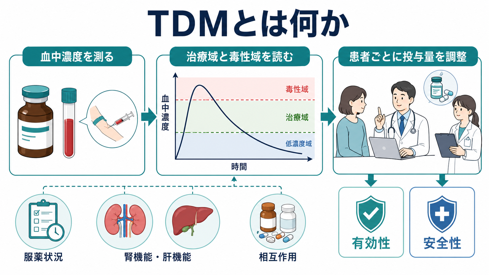
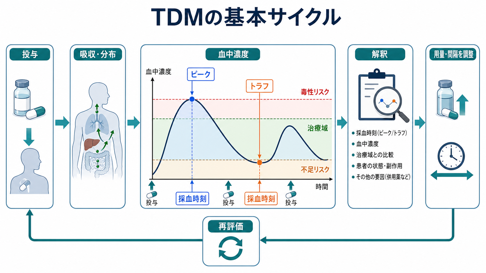
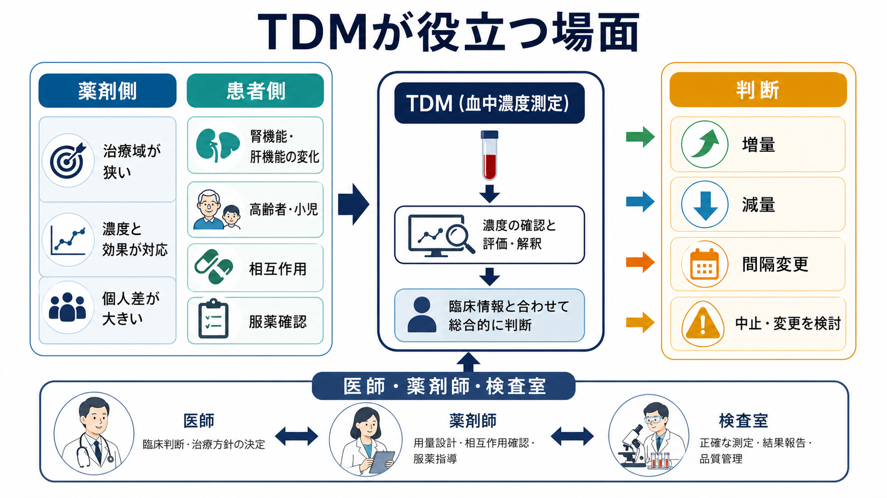

# TDMとは何か

## 要点

- TDM（therapeutic drug monitoring）は、血清・血漿などの薬物濃度を測定し、その値を症状、採血時刻、用量、腎機能・肝機能、併用薬、服薬状況と合わせて解釈し、薬物療法を個別化する方法である[1], [2]。
- とくに、治療域が狭い薬、濃度と効果・毒性の関係が比較的明確な薬、個人差や相互作用が大きい薬で価値が高い[1], [2]。
- TDMは「数値を正常範囲に入れる作業」ではない。採血タイミング、定常状態、ピーク・トラフ、臨床反応、有害事象を合わせて読む臨床推論である[1]。
- 精神科領域では、[[リチウムとは何か]]、[[バルプロ酸とは何か]]、[[カルバマゼピンとは何か]]、三環系抗うつ薬、一部の抗精神病薬などで、効果不足、忍容性不良、服薬不確実性、薬物相互作用があるときに特に役立つ[2], [3]。
- 本稿は教育・研究目的の概説であり、個別の投与量調整や治療判断を指示するものではない。

## この記事で答える問い

- TDMとは何を測り、何を判断する方法なのか。
- どのような薬剤・患者・臨床場面でTDMが役立つのか。
- 採血タイミング、治療域、毒性域をどう考えればよいのか。
- 精神科薬物療法、抗菌薬治療、研究とどのようにつながるのか。

## まず結論

TDMは、血中濃度という「薬物曝露の指標」を使って、薬が不足しているのか、過量になっているのか、採血時刻や服薬状況の問題なのか、腎機能・肝機能・薬物相互作用の影響なのかを切り分ける方法である。重要なのは、血中濃度を単独で判定しないことである。たとえば同じ濃度でも、採血が投与直後なのか、次回投与直前のトラフなのか、定常状態に達しているのかで意味が変わる[1]。

したがってTDMは、検査室の数値ではなく、[[精神科薬物療法とは何か]]や[[薬物療法のリスクベネフィットをどう考えるか]]で扱うような、効果・安全性・本人の生活・併用薬をまとめて扱う臨床プロセスである。

## 背景

薬物療法では、同じ用量を投与しても血中濃度が人によって大きく異なる。吸収、分布、代謝、排泄の違い、年齢、体格、腎機能、肝機能、炎症、妊娠、喫煙、服薬アドヒアランス、併用薬が影響するためである[1], [2]。その結果、標準量でも効果不足になる人もいれば、中毒域に近づく人もいる。

この問題が特に大きいのは、治療に必要な濃度と有害作用が出やすい濃度の間隔が狭い薬である。リチウム、カルバマゼピン、バルプロ酸、ジゴキシン、バンコマイシン、アミノグリコシド、テオフィリン、三環系抗うつ薬などが典型例である[1], [2]。

## 基本概念

### 治療域

治療域とは、多くの患者で有効性と安全性のバランスが比較的よいとされる濃度範囲である。ただし、これは「絶対に効く範囲」でも「範囲外なら必ず危険」でもない。臨床反応、症状の重症度、有害事象、併用薬、患者背景によって解釈が変わる[1], [2]。

精神科薬物療法では、AGNPのTDMコンセンサスガイドラインが、薬剤ごとの推奨度、治療参照範囲、TDMが役立つ状況を整理している。典型的な適応には、推奨用量で反応が乏しい、予想外の有害作用がある、服薬状況が不確実、薬物相互作用が疑われる、妊娠・高齢・小児・知的障害・物質使用などで薬物動態が通常と異なる可能性がある、といった場面が含まれる[2], [3]。

### ピークとトラフ

ピークは投与後に濃度が高くなる時点、トラフは次回投与直前の低い時点を指す。多くのTDMでは、比較しやすさのためにトラフ濃度を測る。トラフは採血時刻のずれに比較的強く、最低濃度に近いため安全性や曝露不足の判断に使いやすい。ただし、薬剤によってはAUC（一定時間の濃度時間曲線下面積）やピーク濃度が重要になる[1], [4]。

### 定常状態

定常状態とは、反復投与によって血中濃度の上昇と低下が一定の範囲に落ち着いた状態である。半減期が長い薬では定常状態まで時間がかかる。定常状態前の濃度を通常の治療域と単純比較すると、過小評価や過大評価につながることがある[1]。

## 仕組み

TDMの流れは、次のサイクルとして理解できる。

1. 薬剤、投与量、投与間隔、最終服薬時刻を確認する。
2. 採血時刻を設計し、ピーク・トラフ・定常状態のどれを見ているのかを明確にする。
3. 血中濃度を測定する。
4. 症状、有害事象、腎機能・肝機能、体重、年齢、炎症、妊娠、喫煙、併用薬、服薬状況と合わせて解釈する。
5. 用量、投与間隔、薬剤選択、再測定のタイミングを検討する。

このサイクルで重要なのは、測定値が「原因」ではなく「手がかり」である点である。濃度が低い場合でも、用量不足、服薬不十分、採血が早すぎる・遅すぎる、吸収不良、酵素誘導、検体条件の問題など、複数の解釈がありうる。濃度が高い場合も、腎機能低下、肝代謝低下、酵素阻害、脱水、発熱、喫煙中止、過量服薬などを区別する必要がある[1], [2]。

## 図解

TDMが役立つ薬剤には、いくつかの共通点がある。

| 観点 | TDMが役立ちやすい条件 | 例 |
|---|---|---|
| 薬剤側 | 治療域が狭い | リチウム、バンコマイシン、アミノグリコシド |
| 薬剤側 | 濃度と効果・毒性が対応しやすい | リチウム、三環系抗うつ薬、一部の抗てんかん薬 |
| 薬剤側 | 薬物動態の個人差が大きい | クロザピン、カルバマゼピン、ボリコナゾール |
| 患者側 | 腎機能・肝機能が変化しやすい | 高齢者、急性疾患、脱水、集中治療 |
| 状況 | 服薬状況・相互作用が疑われる | 効果不足、急な有害作用、喫煙変化、併用薬変更 |

## 臨床・研究との接続

### リチウム

リチウムはTDMの代表例である。NICEは、双極症のリチウム治療で血中濃度測定を定期的に行い、開始後・用量変更後・安定後でモニタリング頻度を変えることを推奨している[5]。リチウムは腎機能、脱水、下痢、発熱、NSAIDs、ACE阻害薬、ARB、利尿薬などで濃度が変化しやすく、症状と濃度を合わせた安全管理が重要になる[5]。詳細は[[リチウムとは何か]]と接続して読むとよい。

### バルプロ酸・カルバマゼピン

[[バルプロ酸とは何か]]や[[カルバマゼピンとは何か]]では、濃度、肝機能、血液検査、薬物相互作用を合わせて見る必要がある。カルバマゼピンは自己誘導やCYP3A4を介した相互作用を受けやすく、同じ用量でも時間経過や併用薬によって濃度が変わる。TDMは、効果不足や副作用が「薬理作用の問題」なのか「曝露量の問題」なのかを考える補助線になる[2]。

### クロザピンと抗精神病薬

クロザピンでは、用量と血中濃度の相関が個人差により弱く、喫煙、炎症、CYP1A2阻害薬、服薬状況などで濃度が大きく変わる。クロザピン血中濃度は、反応不十分、過鎮静、けいれんリスク、喫煙変化、相互作用の評価に役立つことがある[6], [7]。ただし、[[抗精神病薬とは何か]]全体にTDMを一律に適用するのではなく、薬剤ごとのエビデンスと臨床文脈で判断する。

### バンコマイシンとAUCガイド

抗菌薬領域では、バンコマイシンがTDMの重要例である。2020年の国際コンセンサスでは、重症MRSA感染症に対して、従来のトラフ濃度だけでなくAUC/MIC 400-600を目標にする考え方が推奨された[4]。日本のバンコマイシンTDMガイドラインも、AUCガイド下投与やベイズ推定を含むモデル情報に基づく精密投与を重視し、治療効果と急性腎障害リスクのバランスを扱っている[8]。

この流れは、TDMが単なる検査から、薬物動態モデル、ベイズ推定、臨床アウトカムを結びつける「model-informed precision dosing」へ広がっていることを示す[8]。

## よくある誤解

### 誤解1: TDMは血中濃度が基準内かどうかを見る検査である

TDMは濃度だけを見る検査ではない。濃度は、採血時刻、最終服薬時刻、定常状態、腎機能・肝機能、併用薬、症状、有害事象と合わせて意味を持つ[1]。

### 誤解2: 治療域に入っていれば有効で安全である

治療域は集団データから導かれた参照範囲であり、個人の反応を保証しない。治療域内でも副作用が出ることがあり、治療域外でも臨床的に妥当な場合がある[1], [2]。

### 誤解3: TDMをすれば服薬状況が完全にわかる

TDMは服薬不十分の手がかりになるが、完全な証明ではない。採血前だけ服薬する、採血時刻がずれる、代謝や相互作用が変化するなど、複数の説明がありうる。TDMは本人を責める道具ではなく、治療を一緒に調整するための情報である。

### 誤解4: TDMはすべての薬で必要である

TDMは、すべての薬に有用なわけではない。濃度と効果の関係が弱い薬、治療域が明確でない薬、測定結果が治療判断を変えにくい薬では、TDMの利益は限られる[1], [2]。

## 関連ノート

- [[精神科薬物療法とは何か]]
- [[薬物療法のリスクベネフィットをどう考えるか]]
- [[リチウムとは何か]]
- [[バルプロ酸とは何か]]
- [[カルバマゼピンとは何か]]
- [[三環系抗うつ薬とは何か]]
- [[抗精神病薬とは何か]]
- [[気分安定薬とは何か]]

MOC更新候補: `content/00_MOC/` 配下の臨床実践・治療、薬物療法、精神科薬物療法に関するMOCへ、本記事を追加する候補とする。並列ジョブとの競合を避けるため、本稿ではMOC本体は更新しない。

## 理解チェック

1. TDMで血中濃度だけでなく採血時刻を確認する必要があるのはなぜか。
2. 「治療域」は、なぜ個別患者への絶対的な安全域ではないのか。
3. リチウムやバンコマイシンでTDMが重要になる共通理由は何か。
4. 濃度が低いとき、用量不足以外にどのような説明がありうるか。
5. TDMを本人のアドヒアランス評価に使うとき、どのような配慮が必要か。

## 参考文献

[1] Gross, A. S. (1998). Best practice in therapeutic drug monitoring. *British Journal of Clinical Pharmacology, 46*(2), 95-99. https://doi.org/10.1046/j.1365-2125.1998.00770.x

[2] Hiemke, C., Bergemann, N., Clement, H. W., et al. (2018). Consensus Guidelines for Therapeutic Drug Monitoring in Neuropsychopharmacology: Update 2017. *Pharmacopsychiatry, 51*(1/2), 9-62. https://doi.org/10.1055/s-0043-116492

[3] Unterecker, S., Hefner, G., Baumann, P., et al. (2019). Therapeutic drug monitoring in neuropsychopharmacology: Summary of the consensus guidelines 2017 of the TDM task force of the AGNP. *Der Nervenarzt, 90*(5), 463-471. https://doi.org/10.1007/s00115-018-0643-9

[4] Rybak, M. J., Le, J., Lodise, T. P., et al. (2020). Therapeutic Monitoring of Vancomycin for Serious Methicillin-resistant *Staphylococcus aureus* Infections: A Revised Consensus Guideline and Review. *Clinical Infectious Diseases, 71*(6), 1361-1364. https://doi.org/10.1093/cid/ciaa303

[5] National Institute for Health and Care Excellence. (2014, updated 2025). *Bipolar disorder: assessment and management (CG185)*. https://www.nice.org.uk/guidance/cg185/chapter/1-Guidance

[6] Bell, R., McLaren, A., Galanos, J., & Copolov, D. (1998). The clinical use of plasma clozapine levels. *Australian and New Zealand Journal of Psychiatry, 32*(4), 567-574. https://doi.org/10.3109/00048679809068332

[7] Schoretsanitis, G., Kane, J. M., Correll, C. U., et al. (2022). Adverse Drug Reactions in Relation to Clozapine Plasma Levels: A Systematic Review. *Journal of Clinical Medicine, 11*(14), 3987. https://doi.org/10.3390/jcm11143987

[8] Matsumoto, K., Oda, K., Shoji, K., et al. (2022). Clinical Practice Guidelines for Therapeutic Drug Monitoring of Vancomycin in the Framework of Model-Informed Precision Dosing. *Pharmaceutics, 14*(3), 489. https://doi.org/10.3390/pharmaceutics14030489

## 未解決問題

- 血中濃度、薬理遺伝学、炎症マーカー、デジタル服薬データをどのように統合すれば、過剰な監視ではなく本人中心の治療最適化になるのか。
- 精神科薬物療法において、TDMが症状改善、再発予防、副作用軽減、治療継続率をどの程度改善するかは、薬剤と集団ごとにさらに検証が必要である。
- ベイズ推定やモデル情報に基づく精密投与を、専門施設以外の日常診療へどのように実装するかが課題である。
