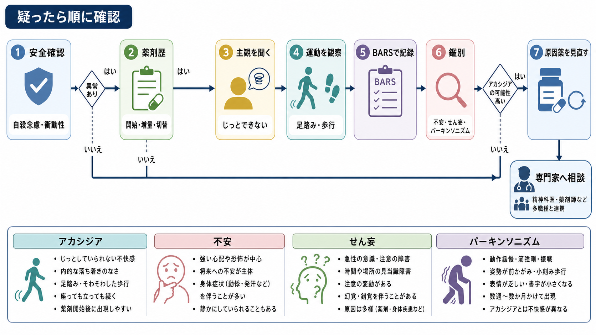
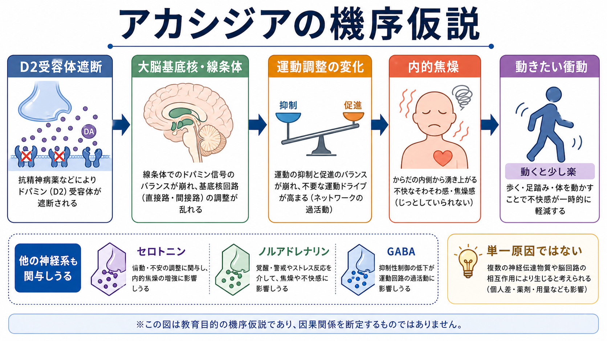

# アカシジアをどう見分けるか

## 要点

- アカシジアは「落ち着かない人」ではなく、**じっとしていられない内的焦燥**と、足踏み・歩き回り・姿勢を変え続けるなどの**観察可能な運動落ち着かなさ**が重なる薬剤性の錐体外路症状として見分ける。
- 抗精神病薬の開始・増量・切替、制吐薬などのドパミン遮断薬、抗うつ薬、離脱・中止などとの時間関係を必ず確認する[1][2]。
- 不安、[[焦燥とは何か|焦燥]]、[[せん妄とは何か|せん妄]]、[[パーキンソニズムとは何か|パーキンソニズム]]、疼痛、離脱、物質使用、[[自殺念慮と自殺企図は何が違うのか|自殺念慮]]は、外見だけでは重なる。
- 見分ける目的は「副作用名を当てること」ではなく、原因薬の見直し、安全確認、苦痛の軽減、服薬継続の支援につなげることである。

## この記事で答える問い

1. アカシジアは不安や不穏と何が違うのか。
2. どの薬剤歴と時間経過を確認すべきか。
3. BARS をどのような観点で使うのか。
4. 自殺念慮や衝動性をどのように見落とさないか。
5. 疑ったとき、治療につなげる整理はどう行うか。

## まず結論

アカシジアを疑う入口は、患者が「そわそわする」「動かないと苦しい」「体の内側から急かされる」「座っていられない」と訴えるときである。観察では、足を組み替える、足踏みをする、立ったり座ったりする、診察室内を歩く、体重を左右に移すといった動きが続く。ここに、抗精神病薬などの開始・増量・切替から数日から数週の時間関係が重なると、薬剤性アカシジアの可能性が高くなる[1][2]。

ただし、アカシジアらしい動きがあるからといって、すぐに薬を自己判断で中止するのは危険である。臨床的には、精神症状の悪化、せん妄、物質離脱、疼痛、パニック、悪性症候群、[[セロトニン症候群ではどのような症状が出るのか|セロトニン症候群]]なども同時に確認し、必要に応じて処方医・薬剤師・救急医療へつなぐ。

## 背景

アカシジアは、抗精神病薬治療で問題になりやすい錐体外路症状の一つである。患者にとっては単なる落ち着かなさではなく、耐えがたい身体化された不快感として体験されることがある。見落とされると、「病状悪化」「不穏」「服薬拒否」「性格的な問題」と誤解され、原因薬の増量や不要な鎮静につながるおそれがある[1][2]。

一方で、アカシジアと自殺関連行動の関係については、症例報告や臨床的懸念はあるが、体系的レビューでは因果関係を確定できるほどの強い証拠は不足している[6]。したがって、過度に断定せず、しかし強い苦痛・衝動性・希死念慮がある場合には安全確認を軽視しない、という姿勢が実践的である。

## 基本概念

### 主観症状

中心は、本人が感じる「内的焦燥」である。典型的には、座っていられない、足を動かさずにいられない、体の内側から急かされる、じっとしていると不快で動くと少し楽になる、という形で語られる[1][2]。

ここが[[不安とは何か|不安]]との鑑別点になる。不安では、心配の対象、予期、脅威評価、回避が前景に出やすい。アカシジアでは、思考内容よりも「身体が止まれない」感覚が前景に出る。ただし両者は併存しうるため、どちらか一方に単純化しない。

### 客観症状

観察では、足踏み、足の組み替え、立ち座り、歩き回り、体幹を揺らす、体重移動を繰り返すなどがみられる。診察室では我慢して目立たないこともあるため、「待合ではどうだったか」「夜間に歩き回るか」「座っている会議や食事で悪化するか」を聞くとよい。

### 薬剤歴

抗精神病薬の開始・増量・切替、長時間作用型注射製剤への変更、制吐薬、抗うつ薬、抗パーキンソン薬やベンゾジアゼピンの中止、物質離脱などを時系列で並べる。アカシジアは急性期に出ることが多いが、遅発性・慢性・離脱性にみえる経過もあるため、直近の処方変更だけでなく数週間から数か月の変化を確認する[1][2]。

## 仕組み

もっともよく使われる説明は、抗精神病薬などによるドパミン D2 受容体遮断が、大脳基底核・線条体を含む運動調整系のバランスを変え、内的焦燥と運動衝動を生むという仮説である[1][2]。ただし、アカシジアは単一の「ドパミン不足」だけで説明できる現象ではない。セロトニン、ノルアドレナリン、GABA、アセチルコリンなど複数の神経伝達系の関与が議論されている[1]。

臨床的には、この機序仮説を「薬をすぐ止める理由」として使うのではなく、「なぜ薬剤歴と運動症状をセットで見る必要があるのか」を理解するために使う。精神症状の悪化、せん妄、身体疾患、物質使用が同時に起きている場合、見かけの落ち着かなさは複数の原因から成り立つ。

## 図解

上の 1 枚目は、疑ったときの確認順を示す。最初に安全確認を行い、次に薬剤歴、主観症状、観察される運動、BARS、鑑別、原因薬の見直しへ進む。2 枚目は、D2 受容体遮断から基底核・線条体の調整変化、内的焦燥、動きたい衝動へ至る機序仮説を示す。いずれも教育・研究目的の整理であり、個別の診断や処方変更を指示するものではない。

## 臨床・研究との接続

### BARS で記録する

Barnes Akathisia Rating Scale（BARS）は、薬剤性アカシジアの代表的な評価尺度である。観察される落ち着かなさ、主観的な落ち着かなさ、苦痛、全体重症度を分けて評価するため、単なる「不穏あり・なし」よりも情報量が多い[3]。

研究では尺度を用いることで症例定義とアウトカムをそろえやすくなる。臨床では、治療前後の変化を共有しやすくなる。ただし、BARS は診断そのものではなく、薬剤歴・精神状態・身体状態・安全確認と合わせて読む必要がある。

### 治療につなげる

ガイドライン的な整理では、まず原因となりうる薬剤負荷を見直す。具体的には、用量調整、原因薬の減量、中止、よりアカシジアを起こしにくい薬剤への切替、多剤併用の整理などを、症状悪化や再発リスクとのバランスで検討する[1]。

補助薬としては、プロプラノロールなどの中枢作用性ベータ遮断薬、ミルタザピン、ベンゾジアゼピン、抗コリン薬、ビタミン B6 などが研究されてきた。Cochrane レビューではベータ遮断薬の証拠は限定的ながら有用性が示唆され、2024年のネットワークメタ解析ではミルタザピン、ビタミン B6、ビペリデンなどが候補として示されたが、試験規模や期間には限界がある[4][5]。個別の処方判断は、精神症状、血圧・脈拍、併存疾患、相互作用、副作用を含めて専門家が行う。

### 自殺念慮を確認する

強いアカシジアでは、本人が「耐えられない」「逃げたい」「死にたいくらいつらい」と表現することがある。このとき、アカシジアが自殺を直接引き起こすと断定するのではなく、苦痛、衝動性、睡眠不足、精神症状、物質使用、孤立、過去の企図、手段へのアクセスを具体的に確認する[6][7]。

特に、薬剤変更後に急に焦燥が強まり、同時に希死念慮や衝動性が増えた場合は、薬剤性の可能性と安全確保を並行して扱う。これは、[[自殺念慮と自殺企図は何が違うのか]]で整理する「考え」と「行動化条件」を分ける視点ともつながる。

## よくある誤解

### 「不安が強いだけ」とみなす

不安は心配の内容や予期が前景に出やすいが、アカシジアでは体を動かさずにいられない感覚が前景に出やすい。薬剤変更後に出現した場合は、本人の訴えが不安に聞こえても、足踏みや歩行、座位保持困難を確認する。

### 「歩き回らなければアカシジアではない」と考える

軽症例や診察室では、本人が動きを抑えていることがある。足趾の動き、膝の揺れ、体重移動、立ち座りの頻度、待合室での様子、夜間の歩行などを確認する。

### 「精神症状が悪化したので抗精神病薬を増やす」と即断する

アカシジアを不穏や精神病性興奮と誤認すると、原因薬の増量で悪化する可能性がある。一方で、精神症状の再燃が併存していることもあるため、薬剤歴、症状の質、時間経過、安全性を分けて整理する。

### 「自殺念慮との関係は証明されていないから安全確認は不要」と考える

因果関係が確定していないことと、強い苦痛を軽視してよいことは別である。体系的レビューは証拠の限界を示しているが、臨床では苦痛・衝動性・希死念慮を確認し、必要な支援につなげる[6][7]。

## 関連ノート

- [[アカシジアとは何か]]: 概念、主観症状、客観症状、研究上の論点を詳しく整理する。
- [[焦燥とは何か]]: アカシジアと重なってみえる精神運動焦燥を比較する。
- [[不安とは何か]]: 心配・予期・身体反応としての不安と、薬剤性の内的焦燥を分ける。
- [[せん妄とは何か]]: 注意・意識・日内変動を確認し、急性不穏の背景を見落とさない。
- [[パーキンソニズムとは何か]]: 同じ錐体外路症状でも、寡動・筋強剛・振戦を中心にした状態と比較する。
- [[自殺念慮と自殺企図は何が違うのか]]: 苦痛、念慮、衝動性、行動化条件を分ける。

### MOC更新候補

- `content/00_MOC/MOC｜臨床実践・治療.md`
- `content/00_MOC/MOC｜症候学.md`
- `content/00_MOC/MOC｜精神医学.md`

並列ジョブとの衝突を避けるため、このタスクでは MOC 本文は更新しない。

### 関連ノート候補

- 薬剤性錐体外路症状とは何か
- Barnes Akathisia Rating Scaleとは何か
- 抗精神病薬の副作用をどう評価するか
- 薬剤性不穏をどう見分けるか

## 理解チェック

1. アカシジアを「不安」と区別するとき、主観症状と観察症状のどこを見るか。
2. 抗精神病薬の開始・増量・切替からの時間関係を確認する理由は何か。
3. BARS は何を分けて評価する尺度か。
4. アカシジアと自殺念慮の関係について、断定できることと断定できないことは何か。
5. 原因薬を見直す前に、安全確認として何を聞くべきか。

## 未解決問題

- 急性、慢性、遅発性、離脱性アカシジアを、機序と治療反応の面でどこまで分けられるか。
- アカシジアの主観的苦痛、衝動性、服薬アドヒアランス低下、自殺関連行動の関係を、どのような研究デザインで検証できるか。
- 補助薬の比較研究は小規模・短期のものが多く、実臨床での長期安全性と優先順位には不確実性が残る。

## 参考文献

[1] Pringsheim, T., Gardner, D., Addington, D., Martino, D., Morgante, F., Ricciardi, L., Poole, N., Remington, G., Edwards, M., Carson, A., & Barnes, T. R. E. (2018). The assessment and treatment of antipsychotic-induced akathisia. *The Canadian Journal of Psychiatry*, 63(11), 719-729. https://doi.org/10.1177/0706743718760288

[2] Salem, H., Nagpal, C., Pigott, T., & Teixeira, A. L. *Akathisia*. In *StatPearls*. StatPearls Publishing. https://www.ncbi.nlm.nih.gov/books/NBK519543/

[3] Barnes, T. R. E. (1989). A rating scale for drug-induced akathisia. *The British Journal of Psychiatry*, 154(5), 672-676. https://doi.org/10.1192/bjp.154.5.672

[4] Barnes, T. R. E., Soares-Weiser, K., & Bacaltchuk, J. (2004). Central action beta-blockers versus placebo for neuroleptic-induced acute akathisia. *Cochrane Database of Systematic Reviews*, CD001946. https://doi.org/10.1002/14651858.CD001946.pub2

[5] Gerolymos, C., Barazer, R., Yon, D. K., Loundou, A., Boyer, L., & Fond, G. (2024). Drug efficacy in the treatment of antipsychotic-induced akathisia: A systematic review and network meta-analysis. *JAMA Network Open*, 7(3), e241527. https://doi.org/10.1001/jamanetworkopen.2024.1527

[6] Kalniunas, A., Chakrabarti, I., Mandalia, R., Munjiza, J., & Pappa, S. (2021). The relationship between antipsychotic-induced akathisia and suicidal behaviour: A systematic review. *Neuropsychiatric Disease and Treatment*, 17, 3489-3497. https://doi.org/10.2147/NDT.S337785

[7] National Institute for Health and Care Excellence. (2022). *Self-harm: assessment, management and preventing recurrence (NICE guideline NG225)*. https://www.nice.org.uk/guidance/ng225
