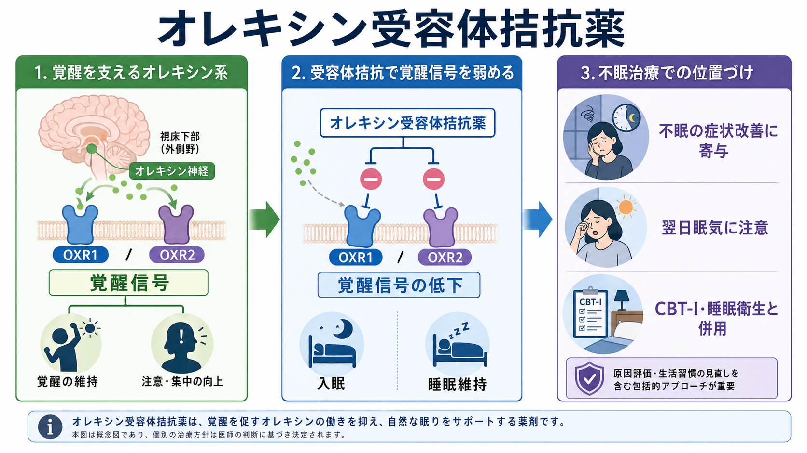
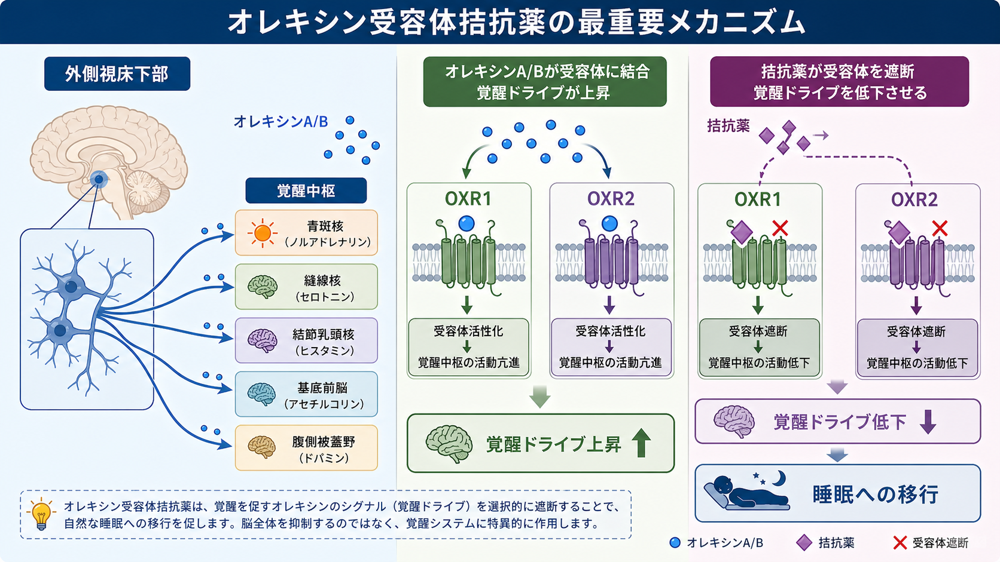
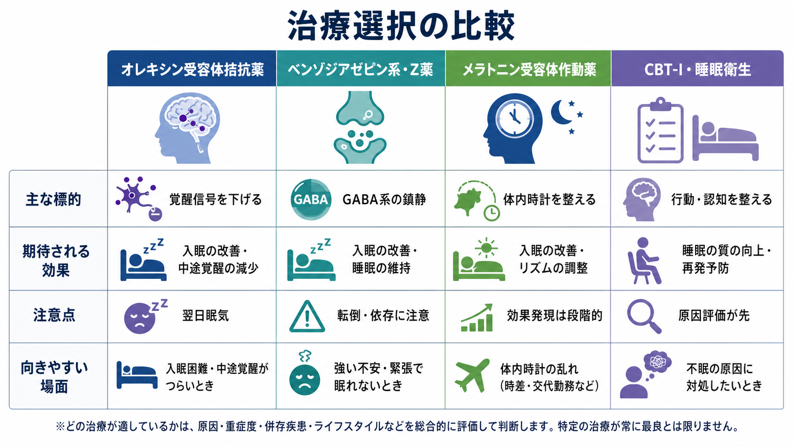

# オレキシン受容体拮抗薬とは何か

## 要点

- オレキシン受容体拮抗薬は、覚醒を維持するオレキシンA/Bの作用を、OX1RとOX2Rなどの受容体レベルで弱める不眠症治療薬である。[1][2]
- ベンゾジアゼピン系・Z薬のようにGABA系の抑制を広く強めるというより、「眠らせる」よりも「覚醒ドライブを下げる」と理解すると見通しやすい。[1][3]
- 国内外で用いられる代表例には、スボレキサント、レンボレキサント、ダリドレキサントなどがある。いずれも、入眠困難、睡眠維持困難、またはその両方を伴う不眠に対して検討される。[4][5][6]
- 重要な注意点は、翌日眠気、注意力・運転能力への影響、睡眠麻痺・入眠時/出眠時幻覚、カタプレキシー様症状、夢や複雑睡眠行動、併用薬、肝機能、ナルコレプシーとの関係である。[4][5][6]
- 本記事は教育・研究目的の整理であり、個別の開始・中止・用量調整を指示するものではない。

## この記事で答える問い

1. オレキシン受容体拮抗薬は、睡眠覚醒調節系のどこに作用するのか。
2. ベンゾジアゼピン系・Z薬、メラトニン受容体作動薬、CBT-Iとは何が違うのか。
3. 不眠症治療でどのような利点と限界を持つのか。
4. 臨床・研究では、どのような安全性と評価軸に注意すべきか。

## まず結論

オレキシン受容体拮抗薬は、睡眠薬を「脳を鎮静する薬」とだけ考える発想を変えた薬剤群である。オレキシン神経は外側視床下部を中心に存在し、ノルアドレナリン、セロトニン、ヒスタミン、アセチルコリン、ドパミンなどの覚醒関連ネットワークと結びついて、覚醒状態の安定化に関わる。[1][2]

したがって、この薬剤群の中心的な発想は、睡眠そのものを直接押し込むことではなく、過剰に残っている覚醒信号を弱めて、睡眠への移行と睡眠維持を助けることである。この点で、[[不眠とは何か]]や[[不眠障害とは何か]]で扱う「過覚醒」「睡眠機会」「日中機能への影響」と接続して理解しやすい。

一方で、「自然な眠りに近いから安全」と単純化してはいけない。オレキシン系は覚醒、注意、情動、報酬、摂食、代謝、REM睡眠関連現象とも接続するため、翌日眠気、注意力低下、転倒、異常な夢、睡眠麻痺、入眠時/出眠時幻覚、複雑睡眠行動などを評価する必要がある。[4][5][6]

## 背景

従来の睡眠薬は、GABA_A受容体に関連するベンゾジアゼピン系・非ベンゾジアゼピン系、体内時計に関わるメラトニン受容体作動薬、抗ヒスタミン作用や抗うつ薬の鎮静作用を利用する薬などに分けて理解されてきた。[[向精神薬の基本分類とは何か]]で述べるように、同じ「睡眠薬」でも、作用点、作用時間、翌朝への持ち越し、依存、転倒、せん妄、呼吸、認知機能への影響は異なる。

オレキシンは、覚醒維持のための神経ペプチドとして重要である。オレキシン神経の障害はナルコレプシーと関連し、日中の強い眠気、睡眠発作、カタプレキシーなどを生じうる。[1][2] このことは、オレキシン系が単なる「眠気を消す物質」ではなく、覚醒と睡眠の状態を安定させる仕組みに深く関わることを示している。

不眠症では、寝床に入っても覚醒ドライブが下がりきらない、睡眠が維持できない、夜間の覚醒が日中機能に影響する、といった問題が生じる。[[過覚醒とは何か]]で扱うような認知的・身体的・情動的覚醒が強い場合、薬物療法だけでなく、睡眠機会、生活リズム、痛み、不安、抑うつ、物質使用、睡眠時無呼吸、むずむず脚症候群などの評価も必要になる。

## 基本概念

### オレキシン系

オレキシンA/Bは、外側視床下部を中心とするニューロンで産生され、脳幹・視床下部・基底前脳・報酬系など広い領域へ投射する。オレキシン神経は、覚醒中に活動しやすく、睡眠中には抑制されやすい。これにより、覚醒状態を保ち、睡眠と覚醒の切り替わりを安定化する。[1][2]

### OX1RとOX2R

オレキシン受容体には主にOX1RとOX2Rがある。両者は分布や機能が完全に同じではないが、睡眠覚醒調節ではどちらも重要である。現在の代表的な不眠症治療薬は、両方の受容体を阻害する dual orexin receptor antagonist、すなわちDORAとして説明されることが多い。[4][5][6]

### 不眠症治療薬としての位置づけ

AASMの薬物療法ガイドラインでは、スボレキサントは成人の睡眠維持困難に対する選択肢として弱い推奨で扱われている。[3] その後、レンボレキサント、ダリドレキサントなども臨床試験と規制当局の審査を経て、不眠症に対する薬剤として使用されるようになった。[5][6][7][8]

ただし、薬物療法は不眠治療の一部であり、[[精神科薬物療法とは何か]]や[[薬物療法のリスクベネフィットをどう考えるか]]で扱うように、標的症状、期待する利益、リスク、併存疾患、本人の価値観、非薬物療法との組み合わせを一緒に考える必要がある。

## 仕組み

オレキシン受容体拮抗薬は、オレキシンA/BがOX1RやOX2Rに結合して覚醒関連ネットワークを活性化する流れを遮断する。結果として、覚醒中枢の活動が下がり、入眠や睡眠維持が起こりやすくなる。[4][5]

ここで大切なのは、作用を「脳全体を一様に抑える」と理解しないことである。オレキシン系は覚醒を保つネットワークの上流・調整役として働くため、受容体拮抗薬は覚醒信号の持続を弱める方向に作用する。これはGABA系鎮静薬と同じではない。[1][3]

この違いは、利点にも限界にもなる。たとえば、覚醒ドライブが不眠の維持に関わる場合には理にかなった作用点となる。一方で、痛み、呼吸障害、躁状態、アルコール、カフェイン、生活リズムの大きなずれ、睡眠機会の不足が主因であれば、受容体を遮断するだけでは問題の中心を扱えない。

## 図解

| 図 | 読み方 |
|---|---|
| 図1 | オレキシン系、受容体拮抗、不眠症治療での位置づけを全体地図として見る。 |
| 図2 | 外側視床下部のオレキシンA/BがOX1R/OX2Rを介して覚醒ドライブを上げ、拮抗薬がその信号を弱める流れを見る。 |
| 図3 | オレキシン受容体拮抗薬、GABA系睡眠薬、メラトニン受容体作動薬、CBT-I・睡眠衛生を比較する。 |

## 臨床・研究との接続

### 薬剤ごとの違いを見る

代表的な薬剤には、スボレキサント、レンボレキサント、ダリドレキサントなどがある。いずれもオレキシン受容体拮抗薬だが、半減期、用量、相互作用、対象集団、臨床試験の評価項目、国ごとの添付文書の記載は同一ではない。[4][5][6]

研究では、睡眠潜時、睡眠維持、中途覚醒、睡眠効率、主観的睡眠感、日中機能、翌日眠気、有害事象を分けて評価する。レンボレキサントのSUNRISE試験では、高齢者を含む不眠症患者で入眠・睡眠維持に関する客観・主観指標の改善が報告され、ダリドレキサントの第3相試験では夜間睡眠指標に加えて日中機能への影響も評価された。[7][8]

### CBT-Iや睡眠衛生との関係

オレキシン受容体拮抗薬は、不眠症治療の選択肢の一つであり、CBT-Iや睡眠衛生の代替物ではない。慢性不眠では、寝床と覚醒の条件づけ、睡眠への心配、長すぎる寝床時間、不規則な生活リズムなどが維持因となることがある。薬剤で夜間の覚醒ドライブを下げても、これらの維持因が残れば再燃しやすい。

したがって臨床では、薬剤選択だけでなく、睡眠日誌、起床時刻、昼寝、カフェイン・アルコール、疼痛、夜間頻尿、呼吸、気分症状、生活リズムを確認する。これは[[睡眠障害は脳機能にどのような影響を与えるのか]]や[[レム睡眠行動障害とは何か]]との接続でも重要である。

### 安全性の読み方

添付文書で重視される注意点には、翌日眠気、注意力・運動協調の低下、睡眠麻痺、入眠時/出眠時幻覚、カタプレキシー様症状、複雑睡眠行動、抑うつや自殺念慮の悪化可能性、CYP3A関連の相互作用、食事による効果発現の遅れなどがある。[4][5][6]

高齢者、転倒リスクが高い人、[[せん妄とは何か|せん妄]]リスクがある人、認知機能低下がある人、呼吸器疾患、肝機能障害、複数薬剤併用、アルコール使用、夜間に起きて作業する必要がある人では、リスク評価が特に重要になる。個別の処方判断は、添付文書、併用薬、既往歴、本人の生活条件を踏まえて専門職が行う。

### ナルコレプシーとの関係

オレキシン系の低下はナルコレプシーの病態と深く関わる。[1][2] そのため、日中の制御困難な眠気、情動で誘発される脱力、睡眠麻痺、入眠時幻覚が目立つ場合には、単なる不眠として扱わず、[[ナルコレプシーとは何か]]や他の[[睡眠覚醒障害群とは何か|睡眠覚醒障害]]との鑑別が必要になる。

## よくある誤解

### 誤解1: オレキシン受容体拮抗薬は「自然な睡眠薬」なので安全である

作用点が睡眠覚醒調節系に近いことは特徴だが、それだけで安全性が保証されるわけではない。翌日眠気、注意力低下、複雑睡眠行動、REM関連現象、相互作用は評価すべきである。[4][5][6]

### 誤解2: ベンゾジアゼピン系より常に優れている

薬剤群の違いは「優劣」ではなく、作用点とリスクの違いである。GABA系薬剤が短期的に有用な場面もあれば、依存、転倒、認知機能低下、せん妄リスクが問題になる場面もある。オレキシン受容体拮抗薬にも、眠気や相互作用など別の注意点がある。[3][4][5][6]

### 誤解3: 眠れないなら原因に関係なく使えばよい

睡眠機会の不足、交代勤務、カフェイン、痛み、睡眠時無呼吸、躁状態、薬剤性不眠、アルコール、生活リズムのずれが主因なら、薬剤だけでは中心問題を扱えない。[[不眠障害とは何か]]で扱うように、不眠は症状型、持続期間、日中機能、背景因子を分けて評価する必要がある。

### 誤解4: 睡眠薬を使えばCBT-Iや生活調整は不要になる

薬物療法は夜間症状を軽くする助けになりうるが、不眠を維持する行動・認知・環境要因を自動的に変えるわけではない。特に慢性不眠では、薬物療法と非薬物的支援を対立させず、役割を分けて組み合わせる視点が重要である。

## 関連ノート

- [[不眠とは何か]]
- [[不眠障害とは何か]]
- [[睡眠障害は脳機能にどのような影響を与えるのか]]
- [[過覚醒とは何か]]
- [[向精神薬の基本分類とは何か]]
- [[精神科薬物療法とは何か]]
- [[薬物療法のリスクベネフィットをどう考えるか]]
- [[ナルコレプシーとは何か]]
- [[睡眠覚醒障害群とは何か]]
- [[レム睡眠行動障害とは何か]]
- [[せん妄とは何か]]

今後の作成候補: `睡眠薬とは何か`, `ベンゾジアゼピン系睡眠薬とは何か`, `非ベンゾジアゼピン系睡眠薬とは何か`, `メラトニン受容体作動薬とは何か`, `CBT-Iとは何か`, `睡眠日誌とは何か`, `睡眠時無呼吸と不眠はどう関係するのか`

MOC更新候補: バッチ統合時に `content/00_MOC/` 配下の臨床実践・治療、薬物療法、睡眠関連MOCへ `[[オレキシン受容体拮抗薬とは何か]]` を追加する。

## 理解チェック

1. オレキシン受容体拮抗薬を「脳全体を鎮静する薬」と説明しない方がよい理由を説明できるか。
2. OX1R/OX2Rを介した覚醒ドライブの低下が、入眠と睡眠維持にどう関係するか説明できるか。
3. ベンゾジアゼピン系・Z薬、メラトニン受容体作動薬、CBT-Iとの違いを、作用点と臨床目的から区別できるか。
4. 翌日眠気、複雑睡眠行動、睡眠麻痺、入眠時/出眠時幻覚、相互作用を確認する理由を説明できるか。
5. 不眠症治療で、薬剤選択の前に睡眠機会、併存疾患、物質使用、生活リズムを評価する理由を説明できるか。

## 参考文献

[1] Sakurai, T. (2007). The neural circuit of orexin (hypocretin): maintaining sleep and wakefulness. *Nature Reviews Neuroscience, 8*, 171-181. https://doi.org/10.1038/nrn2092

[2] Hung, C., & Yamanaka, A. (2023). The role of orexin neuron activity in sleep/wakefulness regulation. *Peptides, 165*, 171007. https://doi.org/10.1016/j.peptides.2023.171007

[3] Sateia, M. J., Buysse, D. J., Krystal, A. D., Neubauer, D. N., & Heald, J. L. (2017). Clinical practice guideline for the pharmacologic treatment of chronic insomnia in adults: An American Academy of Sleep Medicine clinical practice guideline. *Journal of Clinical Sleep Medicine, 13*(2), 307-349. https://doi.org/10.5664/jcsm.6470

[4] Pharmaceuticals and Medical Devices Agency. (2023). *ベルソムラ錠10mg、15mg、20mg 審査・再審査関連資料*. https://www.pmda.go.jp/drugs_reexam/2023/P20230825002/170050000_22600AMX01302_B100_1.pdf

[5] Pharmaceuticals and Medical Devices Agency. (2020). *デエビゴ錠2.5mg、5mg、10mg 申請資料概要*. https://www.pmda.go.jp/drugs/2020/P20200203001/170033000_30200AMX00017_D100_1.pdf

[6] DailyMed. (2026). *QUVIVIQ (daridorexant) tablets, prescribing information*. https://dailymed.nlm.nih.gov/dailymed/search.cfm?query=QUVIVIQ

[7] Rosenberg, R., Murphy, P., Zammit, G., et al. (2019). Comparison of lemborexant with placebo and zolpidem tartrate extended release for the treatment of older adults with insomnia disorder: A phase 3 randomized clinical trial. *JAMA Network Open, 2*(12), e1918254. https://doi.org/10.1001/jamanetworkopen.2019.18254

[8] Mignot, E., Mayleben, D., Fietze, I., et al. (2022). Safety and efficacy of daridorexant in patients with insomnia disorder: results from two multicentre, randomised, double-blind, placebo-controlled, phase 3 trials. *The Lancet Neurology, 21*(2), 125-139. https://doi.org/10.1016/S1474-4422(21)00436-1

## 未解決問題

- オレキシン受容体拮抗薬が、どの不眠サブタイプ、年齢層、併存疾患群で最も利益とリスクのバランスがよいか。
- CBT-I、光療法、睡眠リズム介入、運動療法と組み合わせたとき、薬剤の使用期間や中止後再燃がどう変わるか。
- 日中機能、転倒、認知機能、せん妄、長期安全性を、実臨床データでどのように評価するのがよいか。
