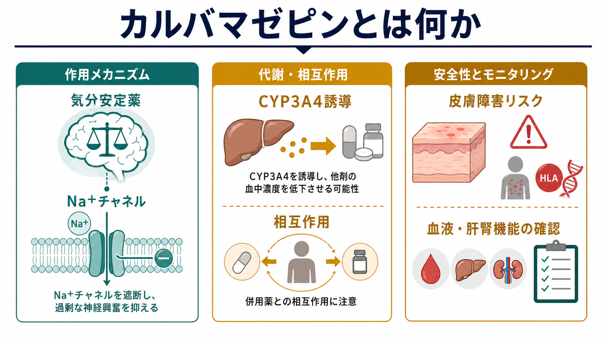
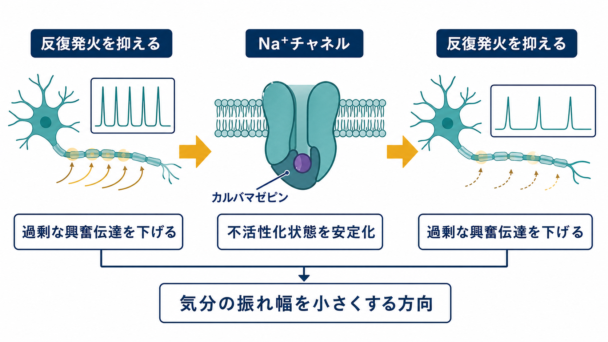
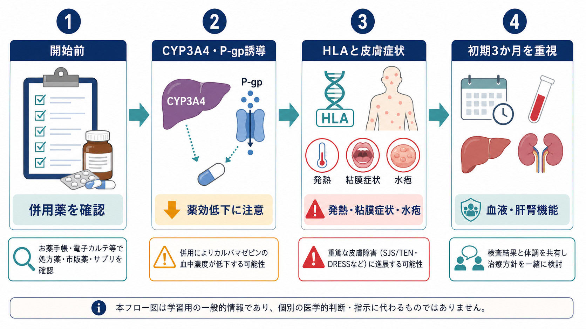

# カルバマゼピンとは何か

## 要点

- カルバマゼピンは抗てんかん薬として開発された薬だが、日本では躁病、躁うつ病の躁状態、統合失調症の興奮状態、三叉神経痛などにも適応をもつ[1]。
- 気分安定薬としては、急性躁病に対する有効性が示されている一方、CANMAT/ISBD では安全性・忍容性の理由から急性躁病の第二選択に位置づけられる[7]。
- 作用の中心は、電位依存性 Na+ チャネルの不活性化状態を安定化し、反復発火と過剰な興奮伝達を抑えることだが、双極性障害への効果をこれだけで説明し切れるわけではない[3]。
- CYP3A4 などを誘導するため、他剤の血中濃度を下げる方向の相互作用が多い。逆に CYP3A4 阻害薬などでカルバマゼピン濃度が上がる場合もある[2][4]。
- Stevens-Johnson症候群（SJS）、中毒性表皮壊死融解症（TEN）、DRESS などの重症皮膚障害が重要で、HLA-B*15:02 や HLA-A*31:01 はリスク評価に関わる[5][6]。

## この記事で答える問い

1. カルバマゼピンは、なぜ気分安定薬として扱われるのか。
2. 作用機序は「Na+ チャネルを抑える薬」と言えば十分なのか。
3. 薬物相互作用が多いとは、具体的に何を意味するのか。
4. 皮膚障害リスクをどう理解し、何を早期に見つけるべきか。

## まず結論

カルバマゼピンは、[[双極性障害とは何か|双極性障害]]の躁状態を抑える選択肢の一つだが、現在の臨床では「使いやすい標準薬」というより、効き方とリスクの両方を理解して慎重に選ぶ薬である。抗躁効果には一定の根拠があるが、CYP3A4 誘導による相互作用、血液障害、肝機能障害、低ナトリウム血症、重症皮膚障害など、治療開始前から確認すべき項目が多い[2][3][7]。

したがって、カルバマゼピンを理解する入口は「気分を安定させる薬」という一語ではなく、`神経興奮を下げる作用`、`代謝酵素を動かす相互作用`、`免疫遺伝学的な皮膚障害リスク`の三層を分けて見ることにある。

## 背景

カルバマゼピンは、てんかん、三叉神経痛、躁状態など、神経興奮や発作性の現象が関わる領域で使われてきた薬である。日本のテグレトール添付文書上も、てんかん発作、躁病・躁うつ病の躁状態、統合失調症の興奮状態、三叉神経痛が効能・効果として記載されている[1]。

[[躁病エピソードとは何か|躁病エピソード]]では、気分高揚や易怒性だけでなく、睡眠欲求の低下、活動性の増加、衝動性、報酬追求、精神運動興奮が同時に変化する。カルバマゼピンは、このような過剰な行動活性化を薬理学的に下げる選択肢として位置づけられる。ただし、現代のガイドラインではリチウム、バルプロ酸、非定型抗精神病薬などとの比較の中で選択され、相互作用や安全性を理由に優先順位が下がることがある[7]。

## 基本概念

### 気分安定薬としての位置づけ

気分安定薬という言葉は、単に「落ち着かせる薬」を意味しない。双極性障害では、躁、軽躁、うつ、混合状態、再発予防という異なる治療目標があり、薬剤ごとに得意な病相が異なる。CANMAT/ISBD 2018 は、カルバマゼピンについて急性躁病への有効性は高いエビデンスがあるものの、安全性・忍容性の懸念から第二選択に下げている[7]。この点は、[[薬物療法のリスクベネフィットをどう考えるか]]と接続して読むとよい。

一方で、カルバマゼピンは双極性うつ病の第一選択薬ではない。双極性障害の薬物療法では、薬剤名だけでなく、いま治療したい病相が躁なのか、うつなのか、維持期なのかを分ける必要がある。

### 「抗てんかん薬由来の気分安定薬」

カルバマゼピンは抗てんかん薬由来の気分安定薬である。この系統の薬は、[[薬物療法は神経回路にどう作用するのか]]で扱うように、神経細胞の発火しやすさ、興奮性・抑制性入力、シナプス伝達、細胞内シグナルを通じてネットワークの振れ幅に影響する。カルバマゼピンの場合、とくに電位依存性 Na+ チャネルへの作用が中核に置かれる[3]。

## 仕組み

### Na+ チャネルと反復発火

神経細胞は、膜電位の変化によって活動電位を発生させる。電位依存性 Na+ チャネルは活動電位の立ち上がりに関わり、短時間に繰り返し開閉することで高頻度発火を支える。カルバマゼピンは、この Na+ チャネルの不活性化状態を安定化し、反復発火を起こしにくくすると説明される[3]。

この説明は、てんかん発作や神経痛には比較的直感的である。過剰に発火する神経細胞の活動を下げれば、発作性の興奮や痛み信号を抑えやすいからである。双極性障害ではより複雑で、単一のチャネル作用だけで躁状態を説明するのは不十分である。それでも、興奮性ネットワークの反復的な過活動を下げる方向の作用は、躁状態の行動活性化や睡眠・覚醒の乱れを考えるうえで一つの入口になる。

### 薬物動態：自己誘導と CYP3A4

カルバマゼピンは肝臓で代謝され、活性代謝物である carbamazepine-10,11-epoxide も薬理作用に関わる[3]。重要なのは、カルバマゼピンが自分自身の代謝を誘導する「自己誘導」を起こしうること、さらに CYP3A4 を含む薬物代謝酵素や輸送体に影響することである[2][4]。

このため、開始後しばらくして血中濃度が変化したり、併用薬の効果が弱まったり、逆にカルバマゼピン濃度が上がって眠気、ふらつき、複視、失調、悪心などが出やすくなることがある。薬物相互作用は「飲み合わせが悪い」という曖昧な話ではなく、代謝酵素・輸送体・薬力学的作用が重なって、効果と副作用の両方を動かす現象である[4]。

## 図解

カルバマゼピン使用時の安全性は、開始前の薬歴確認、相互作用、HLA と皮膚症状、血液・肝腎機能の確認を一連の流れとして考えると整理しやすい。

## 臨床・研究との接続

### 薬物相互作用をどう見るか

カルバマゼピンは、CYP3A4 だけでなく CYP1A2、CYP2C9、CYP2C19、UGT など複数の代謝経路に影響しうる代表的な酵素誘導性抗てんかん薬として整理されている[4]。そのため、抗凝固薬、免疫抑制薬、抗HIV薬、抗真菌薬、抗菌薬、経口避妊薬、向精神薬など、併用薬が多い人では影響が広がりやすい。

臨床的には、次の三つを分けて考える。

| 観点 | 起こりうること | 実務上の意味 |
|---|---|---|
| カルバマゼピンが他剤を下げる | CYP3A4 などの誘導で併用薬の濃度が低下 | 効果不十分、再燃、避妊効果低下などを確認する |
| 他剤がカルバマゼピンを上げる | CYP3A4 阻害薬などで濃度上昇 | 眠気、ふらつき、複視、失調、低Na血症などに注意する |
| 薬力学的に重なる | 鎮静、ふらつき、認知機能低下などが加算 | 転倒、運転、仕事、学業への影響を評価する |

この確認は、[[共同意思決定とは何か]]で扱うように、医療者だけのチェックリストではなく、本人が使っている処方薬、市販薬、サプリメント、飲酒、妊娠可能性、生活上の優先順位を共有する作業でもある。

### 皮膚障害リスクと HLA

カルバマゼピンで特に重要なのは、SJS/TEN、DRESS、薬疹などの皮膚障害である。DailyMed の米国ラベルは、SJS/TEN を含む重篤で時に致死的な皮膚反応を警告し、HLA-B*15:02 を持つ人でリスクが高いことを記載している[2]。CPIC は、HLA-B*15:02 がカルバマゼピンおよびオクスカルバゼピンによる SJS/TEN と強く関連し、HLA-A*31:01 がカルバマゼピンによる斑状丘疹状皮疹、DRESS、SJS/TEN と関連すると整理している[5]。

NCBI Medical Genetics Summaries も、HLA-B*15:02 はアジア系集団で特に問題になりやすく、HLA-A*31:01 は日本人を含む複数集団で一定頻度みられることをまとめている[6]。ただし、HLA が陰性なら皮膚障害がゼロになるわけではない。遺伝的リスク評価は重要な層だが、開始後の発熱、粘膜症状、水疱、眼充血、顔面腫脹、全身倦怠感などの臨床症状を見逃さないことが別の層として残る[8]。

### 初期3か月という時間軸

PMDA の使用上の注意改訂情報では、SJS、TEN、紅皮症などの重篤な皮膚症状について、発熱、眼充血、顔面腫脹、口唇・口腔粘膜や陰部のびらん、皮膚・粘膜の水疱、紅斑、咽頭痛、そう痒、全身倦怠感などを警告し、多くが投与開始から3か月以内に発症するため初期観察が重要とされている[8]。

これは「3か月を過ぎれば安全」という意味ではない。むしろ、開始直後から数週間から数か月の時間軸で、本人と家族がどの症状ならすぐ相談すべきかを共有しておくという意味である。[[心理教育とは何か]]や[[再発予防計画とは何か]]で扱う早期サインの考え方は、薬剤安全性にも応用できる。

## よくある誤解

### 誤解1：カルバマゼピンはリチウムやバルプロ酸と同じように使えばよい

同じ「気分安定薬」と呼ばれても、病相ごとの有効性、相互作用、妊娠・授乳、安全性モニタリング、急な中止のリスクは異なる。カルバマゼピンは相互作用が多く、皮膚障害や血液障害などの重要な安全性問題があるため、単純な置き換えとして考えるべきではない[2][4][7]。

### 誤解2：Na+ チャネル遮断だけで気分安定作用を説明できる

Na+ チャネル作用は重要だが、双極性障害は単一チャネルの病気ではない。睡眠・概日リズム、報酬系、ストレス応答、炎症、認知機能、社会的リズムが重なる。したがって、薬理作用は[[シナプスとは何か|シナプス]]や[[E_Iバランス異常は精神疾患をどう説明するのか|興奮・抑制バランス]]から情動ネットワークまでをつなぐ多階層モデルとして理解する方がよい。

### 誤解3：皮疹が軽ければ様子を見てよい

軽い皮疹と重症皮膚障害の初期を自己判断で区別するのは難しい。発熱、粘膜症状、水疱、眼症状、顔面腫脹、全身倦怠感を伴う場合は特に重症化のサインになりうる[8]。この記事は教育・研究目的であり、個別の診断や治療指示ではないが、カルバマゼピン内服中の新しい皮膚・粘膜症状は早めに処方医へ共有する前提で理解する。

## 関連ノート

- [[双極性障害とは何か]]
- [[躁病エピソードとは何か]]
- [[薬物療法は神経回路にどう作用するのか]]
- [[薬物療法のリスクベネフィットをどう考えるか]]
- [[共同意思決定とは何か]]
- [[心理教育とは何か]]
- [[再発予防計画とは何か]]
- [[シナプスとは何か]]
- [[E_Iバランス異常は精神疾患をどう説明するのか]]

MOC更新候補：`content/00_MOC/MOC｜臨床実践・治療.md` があれば薬物療法セクションへ追加、または薬物療法 MOC の統合ジョブで追加する。

今後の作成候補：薬物相互作用とは何か、重症薬疹とは何か、HLAと薬剤過敏症とは何か、気分安定薬とは何か、リチウムとは何か、バルプロ酸とは何か。

## 理解チェック

1. カルバマゼピンが急性躁病で第一選択ではなく第二選択に置かれうる理由は何か。
2. CYP3A4 誘導は、カルバマゼピン自身と併用薬にどのような影響を与えるか。
3. HLA-B*15:02 と HLA-A*31:01 は、それぞれどの皮膚障害リスクと関係するか。
4. 投与初期に、どのような皮膚・粘膜・全身症状を確認すべきか。
5. 「Na+ チャネル作用」と「気分安定作用」を同一視しすぎると、何を見落とすか。

## 参考文献

[1] 医薬品医療機器総合機構. テグレトール錠100mg／テグレトール錠200mg／テグレトール細粒50％ 医療用医薬品情報. PMDA, 添付文書 PDF 2026年03月17日. https://www.pmda.go.jp/PmdaSearch/rdSearch/02/1139002F2026?user=1

[2] DailyMed. Carbamazepine tablet, prescribing information. Updated April 23, 2025. https://dailymed.nlm.nih.gov/dailymed/drugInfo.cfm?setid=a742c03d-10b1-48e2-8df1-48967395ae06

[3] Maan, J. S., Duong, T. V. H., & Saadabadi, A. (2023). Carbamazepine. *StatPearls*. NCBI Bookshelf. https://www.ncbi.nlm.nih.gov/books/NBK482455/

[4] Perucca, E. (2006). Clinically relevant drug interactions with antiepileptic drugs. *British Journal of Clinical Pharmacology, 61*(3), 246-255. https://doi.org/10.1111/j.1365-2125.2005.02529.x

[5] Phillips, E. J., Sukasem, C., Whirl-Carrillo, M., et al. (2018). Clinical Pharmacogenetics Implementation Consortium Guideline for HLA Genotype and Use of Carbamazepine and Oxcarbazepine: 2017 Update. *Clinical Pharmacology & Therapeutics, 103*(4), 574-581. https://cpicpgx.org/guidelines/guideline-for-carbamazepine-and-hla-b/

[6] Dean, L. (2025). Carbamazepine Therapy and HLA Genotype. *Medical Genetics Summaries*. NCBI Bookshelf. https://www.ncbi.nlm.nih.gov/books/NBK321445/

[7] Yatham, L. N., Kennedy, S. H., Parikh, S. V., et al. (2018). Canadian Network for Mood and Anxiety Treatments and International Society for Bipolar Disorders 2018 guidelines for the management of patients with bipolar disorder. *Bipolar Disorders, 20*(2), 97-170. https://doi.org/10.1111/bdi.12609

[8] 医薬品医療機器総合機構. 使用上の注意改訂情報（平成20年4月25日指示分）：カルバマゼピン. PMDA. https://www.pmda.go.jp/safety/info-services/drugs/calling-attention/revision-of-precautions/0181.html

## 未解決問題

- 双極性障害のどの臨床サブタイプで、カルバマゼピンの利益が相互作用・皮膚障害リスクを上回りやすいのか。
- HLA 検査、薬物血中濃度、電子処方チェック、患者教育をどのように組み合わせると重症有害事象を最も減らせるのか。
- 長期維持療法において、カルバマゼピンを選ぶべき場面と避けるべき場面を、実臨床データからどう精密化できるのか。

## 更新ログ

- 2026-04-28: 初版作成。作用機序、薬物相互作用、皮膚障害リスク、HLA、関連画像を整理。
