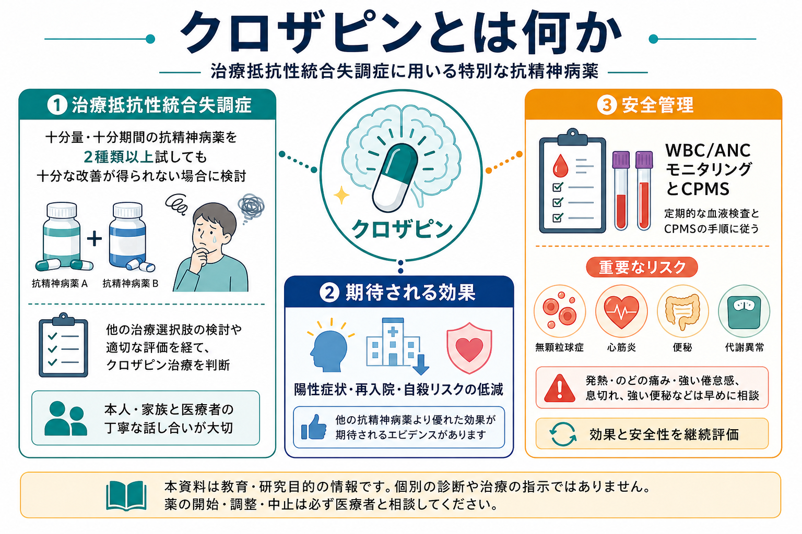
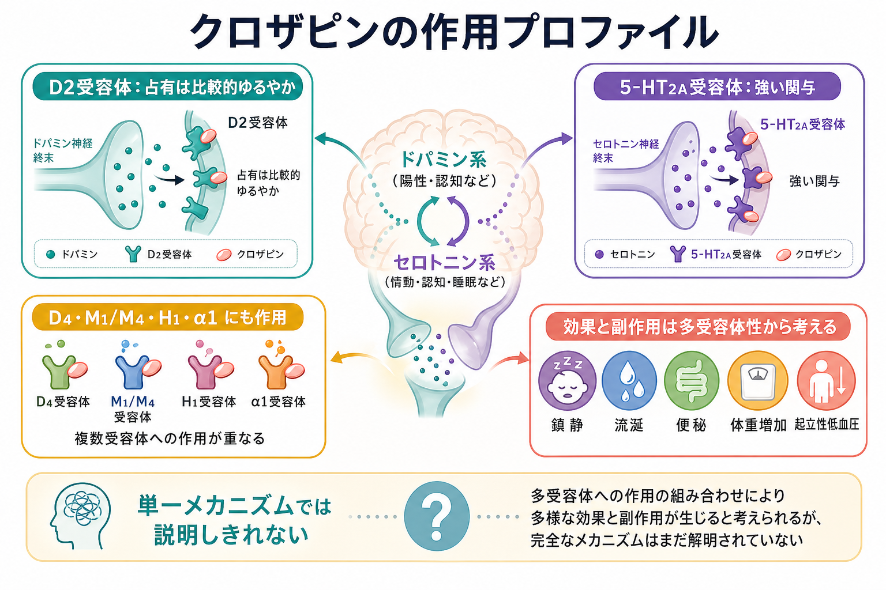
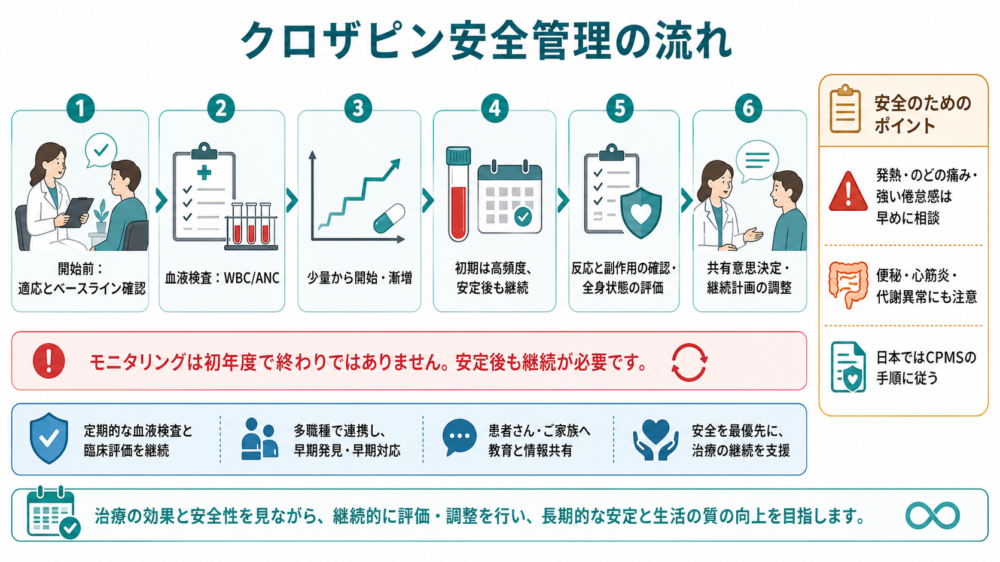

# クロザピンとは何か

## 要点

- クロザピンは、十分な抗精神病薬治療を行っても改善が不十分な治療抵抗性統合失調症で中心的な位置を占める抗精神病薬である。治療抵抗性は一般に、少なくとも2種類の抗精神病薬を適切な用量・期間・アドヒアランス確認のもとで試しても、症状と機能障害が残る状態として整理される[1]。
- 有効性は強いが、「よく効く薬」だけでは説明できない。無顆粒球症、好中球減少、心筋炎、けいれん、便秘・腸閉塞、代謝異常、起立性低血圧などを系統的に監視する必要がある[3][5]。
- 血液モニタリングは、クロザピン治療の付属物ではなく治療そのものの一部である。米国では2025年6月13日にClozapine REMSが廃止されたが、FDAは重度好中球減少リスクとANCモニタリングの必要性自体は残ると説明している[4]。
- 日本ではクロザリル患者モニタリングサービス（CPMS）の手順に従い、白血球数・好中球数、血糖関連検査、登録医療機関・登録医・薬剤師の要件を満たした運用が求められる[5]。
- 本記事は教育・研究目的の整理であり、個別の開始・増量・中止・再開を指示するものではない。判断は専門医療チームと相談して行う。

## この記事で答える問い

1. クロザピンは、どのような場面で検討される薬なのか。
2. なぜ治療抵抗性統合失調症で特別な位置づけを持つのか。
3. 無顆粒球症とは何で、なぜ血液モニタリングが必要なのか。
4. 作用機序はどこまで分かっており、どこに未解決点が残るのか。
5. 臨床では効果と安全性をどのように同時に考えるべきか。

## まず結論

クロザピンは、治療抵抗性統合失調症に対して最も重要な選択肢の一つである。とくに陽性症状が残る場合、他の抗精神病薬より反応が得られる可能性があり、系統的レビューでは治療抵抗性統合失調症の約4割が反応基準を満たしたと報告されている[2]。また、自殺リスクが高い統合失調症・統合失調感情障害では、自殺関連行動を減らす効果が示された試験もある[7]。

ただし、クロザピンを「最後の切り札」とだけ呼ぶと、本質を取り逃がす。クロザピンは、薬理学的な有効性と、厳格な安全管理を一体で運用する薬である。血液検査を続ける、感染症状を早く拾う、便秘を軽視しない、心筋炎や代謝異常を確認する、服薬中断後の再開を慎重に扱う。これらを含めて初めて、クロザピン治療と呼べる。

## 背景

統合失調症の薬物療法では、多くの場合、ドパミンD2受容体への作用を持つ抗精神病薬が用いられる。しかし、十分な治療にもかかわらず陽性症状、陰性症状、認知・社会機能の困難が残る人がいる。TRRIPの合意基準では、治療抵抗性を考える際に、症状の持続、機能障害、少なくとも2回の適切な抗精神病薬治療、アドヒアランス確認を重視している[1]。

ここで重要なのは、「薬が効かない人」という雑な分類ではない。服薬できていたか、十分な用量と期間だったか、副作用で早期中止になっていないか、物質使用や身体疾患が症状を悪化させていないか、評価尺度や生活機能でどの程度の困難が残っているかを確認する必要がある。クロザピンは、このような確認を経てなお症状と機能障害が残る場合に、検討される薬である。

NICEの統合失調症ガイドラインも、少なくとも2種類の抗精神病薬を順に十分量・十分期間試しても反応が不十分な場合、クロザピンを提示することを推奨している[6]。この位置づけは、クロザピンを早すぎず遅すぎず検討するための臨床上の目安になる。

## 基本概念

### 治療抵抗性統合失調症

治療抵抗性統合失調症とは、単に「症状が重い統合失調症」ではない。十分な治療を受けたにもかかわらず、症状や機能障害が残る状態である。TRRIP基準では、少なくとも2種類の抗精神病薬による適切な治療、治療期間、用量、服薬確認、標準化尺度による症状評価、機能障害の評価が重視される[1]。

この定義は、研究のためだけでなく臨床にも重要である。たとえば、実際には副作用がつらくて服薬できていなかった人、十分量まで増量できなかった人、服薬中断が多かった人を「薬が効かない」と判断すると、次の治療選択を誤る可能性がある。クロザピンの前には、治療歴を丁寧に読む必要がある。

### クロザピンの効果

クロザピンは、治療抵抗性統合失調症に対する有効性で特別な位置を持つ。Siskindらの系統的レビュー・メタ解析では、治療抵抗性統合失調症におけるクロザピン反応率は約40%と推定され、PANSS得点の臨床的に意味のある低下が報告された[2]。反応しない人も少なくないため万能薬ではないが、「他剤で十分改善しない人に、なお改善の余地を作る薬」として重要である。

自殺関連行動についても、InterSePT試験では、自殺リスクが高い統合失調症または統合失調感情障害の人を対象に、クロザピンがオランザピンより自殺関連行動を減らすことが示された[7]。ただし、この知見は「自殺リスクがあれば全員に単純に使う」という意味ではない。リスク評価、入院・外来体制、家族・支援者、身体モニタリングを含めて考える必要がある。

### 無顆粒球症と好中球減少

無顆粒球症は、感染防御に重要な好中球が著しく減る状態であり、発熱、咽頭痛、倦怠感、感染症、敗血症につながりうる。クロザピンではこのリスクがあるため、開始前と治療中に白血球数や好中球数を定期的に確認する[3][5]。

米国の添付文書では、一般集団でANCが基準を満たすことを確認してから開始し、開始後6か月は週1回、その後6か月は2週に1回、その後は月1回のANCモニタリングが示されている[3]。一方、日本ではCPMSの基準と運用があり、白血球数と好中球数、血糖・HbA1cなどを含む独自の手順に従う[5]。国や制度により細部は異なるため、実務ではその地域の添付文書・制度・施設手順を確認する。

## 仕組み

クロザピンの作用機序は、単一の受容体で説明しきれない。多くの抗精神病薬と同様にD2受容体への作用を持つが、典型的な強いD2遮断薬とは異なり、D2受容体占有が比較的ゆるやかで、錐体外路症状やプロラクチン上昇が相対的に少ない傾向がある[8]。この点は、[[抗精神病薬の錐体外路症状とは何か]] と接続して理解しやすい。

一方で、クロザピンは5-HT2A、D4、ムスカリン受容体、ヒスタミンH1、アドレナリンα1など、多数の受容体に作用する。鎮静、流涎、便秘、体重増加、起立性低血圧などは、この多受容体性と関連して理解できる。ただし、「この受容体が効くから治療抵抗性に効く」と一対一に断定できる段階ではない。2025年の機序レビューでは、ムスカリンM4/M1系を含むコリン作動性機序が、クロザピンの独自性を理解するうえで重要な候補として論じられている[8]。

つまり、クロザピンは「D2遮断が弱いから安全で、5-HT2Aが強いから効く」といった単純な薬ではない。中枢神経系の多受容体作用、代謝物、末梢自律神経系への作用、炎症・免疫系との関係、個人差が重なって、効果と副作用の両方が生じると考えるのが現時点では妥当である。

## 図解

### クロザピン治療で見る3つの層

| 層 | 何を見るか | 臨床上の意味 |
|---|---|---|
| 適応 | 治療抵抗性、過去の抗精神病薬治療、服薬状況、機能障害 | 本当にクロザピンを検討する段階かを確認する |
| 効果 | 陽性症状、再入院、自殺関連行動、生活機能、本人の回復目標 | 効いたかどうかを症状だけで判断しない |
| 安全性 | WBC/ANC、発熱・咽頭痛、心筋炎、便秘、代謝異常、けいれん | 効果があっても継続可能性を左右する |

### モニタリングで見落としやすい点

| 領域 | 典型的に確認すること | 見落としやすい点 |
|---|---|---|
| 血液 | 白血球数、好中球数、発熱・咽頭痛 | 検査値が直近で正常でも、感染症状は軽視しない |
| 心血管 | 発熱、胸痛、息切れ、頻脈、心筋炎の可能性 | 導入初期の発熱をすべて「よくある反応」と扱わない |
| 消化管 | 便秘、腹痛、腹部膨満、食欲低下 | クロザピン関連便秘は重症化しうる |
| 代謝 | 体重、血糖、HbA1c、脂質 | 効果が出ているほど長期代謝リスクも継続評価する |
| 神経 | 眠気、けいれん、ミオクローヌス | 用量、血中濃度、相互作用、喫煙状況の変化を考える |

## 臨床・研究との接続

### 効果判定は「症状だけ」では足りない

クロザピンの効果は、幻覚・妄想などの陽性症状の軽減だけでなく、入院頻度、危機対応の減少、家族との関係、生活リズム、就労・就学・地域生活、本人の主観的な回復感にも関わる。研究ではPANSSやBPRSのような尺度が必要だが、臨床では本人と家族が何を「改善」と感じるかを確認する必要がある。

この点は、[[薬物療法のリスクベネフィットをどう考えるか]] の枠組みと近い。クロザピンは利益も害も大きくなりうるため、単に「効果があるか」ではなく、「どのアウトカムの改善を、どの負担と引き換えに期待するのか」を明確にする必要がある。

### モニタリングはアクセスの問題でもある

血液モニタリングは安全性を支える一方で、通院負担、採血負担、医療機関側の登録要件、薬局との連携、地方でのアクセス問題を生む。FDAが2025年にClozapine REMSを廃止した理由も、重度好中球減少リスクは残るが、REMSが治療アクセスを妨げうるという再評価に基づくものだった[4]。これは、モニタリングを不要にするという意味ではない。安全管理とアクセスの両立を制度設計として考える必要がある。

日本ではCPMSが継続しており、登録医療機関、登録医、登録薬剤師、血液検査、血糖モニタリング、報告体制が組み込まれている[5]。したがって日本語圏の記事では、「米国ではREMSがなくなったから日本でも同じ」と混同しないことが重要である。

### 便秘と心筋炎は軽く扱わない

クロザピンでは無顆粒球症が有名だが、臨床安全性は血液だけではない。便秘・腸閉塞、心筋炎・心筋症、けいれん、代謝異常、起立性低血圧、鎮静、流涎なども重要である[3][5]。とくに便秘は生活上よくある訴えに見えるため、重症化リスクが過小評価されやすい。

安全管理では、検査値と症状の両方を見る。発熱、咽頭痛、強い倦怠感、息切れ、胸痛、強い便秘、腹痛、意識変容などは、自己判断で様子を見る対象ではなく、早めに医療者へ相談するサインとして教育しておく必要がある。

## よくある誤解

### 誤解1: クロザピンは「危険だから最後まで使わない」薬である

危険性があるのは事実だが、治療抵抗性統合失調症に対して有効性が高い薬でもある。問題は「使うか使わないか」ではなく、「適応を確認し、安全に使える体制を整えたうえで、遅れすぎず検討するか」である。過度な恐れによって必要な人へのアクセスが遅れることも、臨床上のリスクになる。

### 誤解2: 血液検査をしていれば無顆粒球症は完全に防げる

血液検査は重症化リスクを下げるための重要な手段だが、完全な予防ではない。検査間隔の間に急速な変化が起こる可能性があるため、発熱、咽頭痛、強い倦怠感などの症状を本人・家族・支援者が共有しておく必要がある[3][5]。

### 誤解3: クロザピンの作用機序はD2受容体だけで説明できる

D2受容体は抗精神病薬を理解する入口だが、クロザピンの独自性はそれだけでは説明しきれない。5-HT2A、ムスカリン受容体、H1、α1、代謝物、末梢自律神経作用などが絡む。近年はムスカリンM4/M1系が注目されているが、臨床効果を単一機序に還元するにはまだ慎重さが必要である[8]。

### 誤解4: 効いたらモニタリングは減らしてよい

症状が改善しても、安全性の確認は続く。米国添付文書ではANCが安定していればモニタリング頻度は段階的に下がるが、月1回などの継続確認は残る[3]。日本でもCPMSに基づく継続的な検査と判定が求められる[5]。

## 関連ノート

- [[薬物療法のリスクベネフィットをどう考えるか]]: クロザピンの効果と重篤な副作用を同じ枠組みで考えるための基礎。
- [[抗精神病薬の錐体外路症状とは何か]]: クロザピンで錐体外路症状が比較的少ない理由を、D2受容体占有や薬剤間差から理解するための関連ノート。
- [[心理教育とは何か]]: 発熱、咽頭痛、便秘、服薬中断などを本人・家族・支援者と共有する実践に接続する。

### 関連ノート候補

- 統合失調症とは何か
- 治療抵抗性統合失調症とは何か
- 抗精神病薬とは何か
- 精神科薬物療法のモニタリング
- CPMSとは何か
- 無顆粒球症とは何か

### MOC更新候補

- `content/00_MOC/MOC｜臨床実践・治療.md` の薬物療法セクションに `[[クロザピンとは何か]]` を追加する候補。
- `content/00_MOC/MOC｜精神医学.md` の統合失調症・精神薬理関連に追加する候補。

## 理解チェック

1. 治療抵抗性統合失調症を判断する前に、過去の抗精神病薬治療について何を確認する必要があるか。
2. クロザピンの有効性を「陽性症状の改善」以外にどのアウトカムで評価できるか。
3. 無顆粒球症と好中球減少がなぜ問題になるのか、感染症状と関連づけて説明できるか。
4. 米国のREMS廃止と、日本のCPMS運用を混同してはいけない理由は何か。
5. クロザピンの副作用管理で、血液検査以外に注意すべき領域を3つ挙げられるか。

## 未解決問題

- クロザピンに反応する人と反応しない人を、治療前にどこまで予測できるか。
- クロザピンの独自の有効性に、D2受容体、ムスカリンM4/M1、グルタミン酸、免疫・炎症、代謝物がどの程度寄与しているか。
- 無顆粒球症を防ぎつつ、過度なモニタリング負担でアクセスを妨げない制度はどう設計できるか。
- クロザピン導入の遅れを減らすために、専門医療、地域医療、薬局、家族支援をどう接続するか。

## 参考文献

[1] Howes OD, McCutcheon R, Agid O, et al. (2017). Treatment resistant schizophrenia: Treatment Response and Resistance in Psychosis (TRRIP) working group consensus guidelines on diagnosis and terminology. *American Journal of Psychiatry*, 174(3), 216-229. https://doi.org/10.1176/appi.ajp.2016.16050503

[2] Siskind D, Siskind V, Kisely S. (2017). Clozapine response rates among people with treatment-resistant schizophrenia: Data from a systematic review and meta-analysis. *The Canadian Journal of Psychiatry*, 62(11), 772-777. https://doi.org/10.1177/0706743717718167

[3] DailyMed. Clozapine tablet: prescribing information. U.S. National Library of Medicine. https://dailymed.nlm.nih.gov/dailymed/drugInfo.cfm?setid=d5c8a456-6f3c-4963-b321-4ed746f690e4

[4] U.S. Food and Drug Administration. (2025). FDA removes risk evaluation and mitigation strategy (REMS) program for the antipsychotic drug Clozapine. https://www.fda.gov/drugs/drug-safety-and-availability/fda-removes-risk-evaluation-and-mitigation-strategy-rems-program-antipsychotic-drug-clozapine

[5] Novartis Pharma. クロザリル患者モニタリングサービス（CPMS）運用・実施基準関連資料. https://www.pro.novartis.com/jp-ja/products/clozaril/cpms/08

[6] National Institute for Health and Care Excellence. Psychosis and schizophrenia in adults: prevention and management. NICE guideline CG178. https://www.nice.org.uk/guidance/cg178

[7] Meltzer HY, Alphs L, Green AI, et al. (2003). Clozapine treatment for suicidality in schizophrenia: International Suicide Prevention Trial (InterSePT). *Archives of General Psychiatry*, 60(1), 82-91. https://doi.org/10.1001/archpsyc.60.1.82

[8] Morrison PD, Jauhar S, Young AH. (2025). The mechanism of action of clozapine. *Journal of Psychopharmacology*, 39(4), 297-300. https://doi.org/10.1177/02698811251319458
