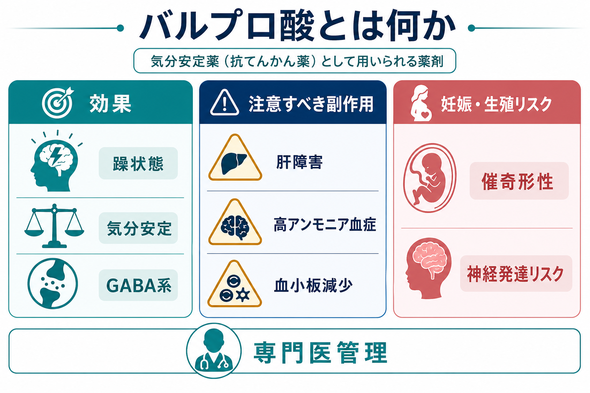
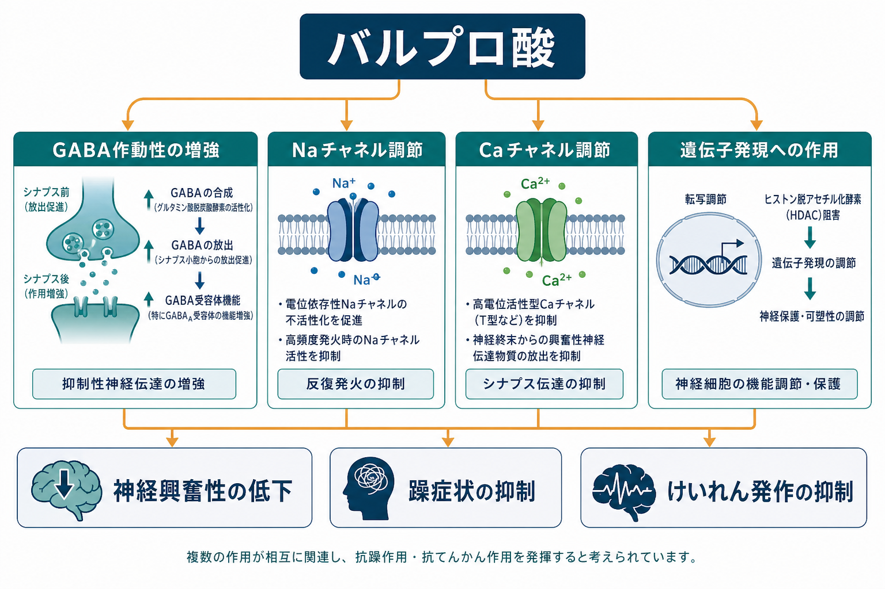
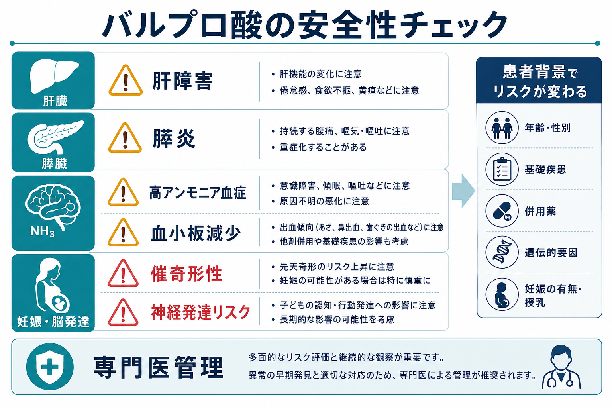

# バルプロ酸とは何か

## 要点

- バルプロ酸は、てんかん、双極性障害の躁病・混合エピソード、片頭痛予防などで用いられてきた薬剤で、精神科では[[気分安定薬とは何か|気分安定薬]]として扱われることが多い[1]。
- 双極性障害の急性躁状態ではプラセボより有効で、リチウムと大きく劣らない結果も報告されるが、抗精神病薬やリチウムとの位置づけは病相、既往、副作用、妊娠可能性で変わる[4][5][6]。
- 重大なリスクは、肝障害、膵炎、高アンモニア血症、血小板減少、体重増加、鎮静、振戦、薬物相互作用である[1][2][3]。
- 妊娠中曝露では神経管欠損などの先天奇形、IQ低下、神経発達上の問題が大きな懸念となるため、妊娠可能性のある人では原則として避ける方向で規制・ガイドラインが強化されている[1][7][8]。
- 本稿は教育・研究目的の整理であり、個別の開始・中止・用量変更を指示するものではない。服薬中の人は自己判断で中断せず、主治医と相談する必要がある。

## この記事で答える問い

- バルプロ酸は何に効く薬なのか。
- どのような神経機構を通じて躁状態やけいれん発作を抑えると考えられているのか。
- 肝障害と催奇形性は、なぜ特に強調されるのか。
- 臨床で「効果がある薬」と「使いにくい薬」が同時に成り立つ理由は何か。

## まず結論

バルプロ酸は、神経興奮性を下げる方向に働く広域の抗てんかん薬であり、双極性障害では躁状態や気分の再燃予防に使われてきた薬剤である[1][4]。一方で、肝ミトコンドリア障害を含む重い肝障害、膵炎、高アンモニア血症、血小板減少、そして妊娠中曝露による先天奇形・神経発達リスクが明確に問題となる[1][2][3][7]。したがって、バルプロ酸を理解する要点は「有効性」だけでなく、「誰に、どの病相で、どのリスクを避けながら使うのか」という[[薬物療法のリスクベネフィットをどう考えるか|リスクベネフィット]]の評価にある。

## 背景

バルプロ酸、バルプロ酸ナトリウム、ジバルプロエクスナトリウムなどは、体内で薬理活性をもつバルプロ酸として作用する関連製剤である。米国FDAの情報では、バルプロ酸製品は発作治療、一部製剤では双極性障害に伴う躁病・混合エピソード、片頭痛予防に承認されている[1]。精神科領域では、[[双極性障害とは何か]]、[[双極I型障害とは何か]]、[[急速交代型双極性障害とは何か]]、[[難治性双極性障害とは何か]]などの文脈で、リチウムや抗精神病薬と並んで検討されることがある。

ただし近年は、妊娠可能性のある人への使用に対する規制が強化されている。NICEの双極性障害ガイドラインは、MHRAの安全性助言を踏まえ、55歳未満の男女で新規にバルプロ酸を開始する場合には、2名の専門医が他に有効で忍容可能な治療がない、または生殖リスクが当てはまらない明確な理由があると独立に判断・記録する必要があるとしている[8]。これは英国の規制文脈に基づくが、バルプロ酸の臨床的位置づけが安全性リスクによって大きく制約されていることを示す。

## 基本概念

### 薬理学的には「単一標的薬」ではない

バルプロ酸は、GABA作動性伝達の増強、電位依存性ナトリウムチャネルの調節、T型カルシウムチャネルへの作用、ヒストン脱アセチル化酵素阻害を介した遺伝子発現への影響など、複数の作用をもつとされる[2][3]。このため、「GABAだけを増やす薬」と理解すると狭すぎる。[[GABAは脳で何をしているのか]]や[[神経細胞膜はどのように電気信号を生み出すのか]]と接続して考えると、バルプロ酸は神経回路全体の過剰な興奮性を下げる方向に働く薬として理解しやすい。

### 精神科では「抗躁薬」「気分安定薬」として使われる

急性躁状態では、バルプロ酸はプラセボより反応率を高めることが複数の系統的レビューで示されている[4][5]。CANMAT/ISBDガイドラインでも、急性躁病の第一選択肢群にジバルプロエクスが含まれる[6]。ただし「気分安定薬」という語は文献上の使われ方が一定せず、抗躁効果、維持療法での再発予防、抑うつ相への効果を分けて評価する必要がある[6]。

## 仕組み

バルプロ酸の作用は、ひとつの受容体を遮断するというより、神経細胞の発火しやすさ、抑制性伝達、代謝・遺伝子発現を広く調整するものとして捉えられる。

### GABA系と神経興奮性

GABAは中枢神経系の代表的な抑制性神経伝達物質である。バルプロ酸はGABA濃度やGABA作動性伝達を増強する方向に働くとされ、過剰に興奮した神経ネットワークを落ち着かせる一因になると考えられている[2][3]。これは、[[薬物療法は神経回路にどう作用するのか]]で扱う「症状を直接消す」というより「回路の作動条件を変える」という見方に近い。

### イオンチャネルと発火パターン

ナトリウムチャネルやカルシウムチャネルへの作用は、神経細胞が反復発火しやすい状態を抑える方向に関わる。抗てんかん作用の説明ではこの点が重要で、躁状態への効果も、興奮性ネットワークの過活動を抑える広い作用の一部として理解できる[2][3]。

### ヒストン脱アセチル化酵素阻害と遺伝子発現

バルプロ酸はヒストン脱アセチル化酵素阻害作用をもつことでも知られる。これは発達期曝露のリスクや、細胞レベルの広範な生物学的影響を考えるうえで重要である。ただし、精神症状改善がこの機序だけで説明できるわけではない。臨床効果は複数機序の総和として扱うのが妥当である。

## 図解

### 効果とリスクの同時評価

バルプロ酸は「躁状態に効く可能性があるから使いやすい薬」ではなく、「躁状態に効く可能性があるが、避けるべき状況が明確にある薬」である。特に妊娠可能性、肝疾患、ミトコンドリア病、併用薬、過量服薬リスク、治療継続性を考慮する必要がある[1][2][3][7][8]。

| 論点 | 臨床的な意味 | 主な根拠 |
|---|---|---|
| 抗躁効果 | 急性躁状態で有効性が示される | [4][5][6] |
| 維持療法 | 再発予防の選択肢になりうるが、病相ごとの評価が必要 | [5][6] |
| 肝障害 | 致死例を含む重篤な肝障害があり、特に開始初期と高リスク群に注意 | [1][2][3] |
| 高アンモニア血症 | 肝酵素上昇が目立たなくても意識障害をきたしうる | [2][3] |
| 催奇形性・神経発達 | 神経管欠損、主要奇形、IQ低下、発達障害リスクが問題 | [1][7][8] |
| 薬物相互作用 | カルバペネム系抗菌薬、トピラマートなどとの相互作用に注意 | [1][3] |

## 臨床・研究との接続

### 双極性障害の治療選択

双極性障害の治療では、急性躁状態、急性双極性抑うつ、維持療法を分けて考える。バルプロ酸は急性躁状態では比較的強い根拠があり、Cochraneレビューでも25試験3252名を対象に評価され、プラセボより有効であることが示された[4]。2024年の概観レビューでも、急性躁病ではプラセボより反応率が高く、リチウムとの差は多くのアウトカムで明確ではなかった一方、リスペリドンなど一部薬剤との比較では効果や忍容性に差が示唆されている[5]。

しかし、躁状態の薬物療法では抗精神病薬が速効性や鎮静性を期待して選ばれることもあり、リチウムは自殺リスク低下や長期維持療法の観点で重要である。したがって、バルプロ酸は「万能な気分安定薬」ではなく、病相、過去の反応、身体リスク、妊娠可能性、本人の価値観を合わせて検討される選択肢である。

### 肝障害

バルプロ酸の肝障害は、単なる肝酵素上昇だけでなく、重篤な肝不全、微小胞性脂肪変性、高アンモニア血症、Reye様症候群など複数の形で現れる[2]。LiverToxは、バルプロ酸を臨床的に明らかな肝障害のよく知られた原因として位置づけ、開始後1から6か月の急性肝細胞障害や、肝障害を伴わない高アンモニア血症性脳症を記載している[2]。2歳未満、神経疾患、抗てんかん薬の多剤併用、ミトコンドリアDNAポリメラーゼγ関連疾患などは特に重要なリスク因子である[1][2]。

### 催奇形性と神経発達リスク

バルプロ酸の妊娠中曝露は、神経管欠損を含む主要先天奇形、認知機能低下、神経発達障害リスクと関連する[1][7][8]。WHOは、妊娠可能性のある女性・女児には高い出生欠損・発達障害リスクのためバルプロ酸を処方すべきでないとし、てんかんではラモトリギンやレベチラセタムを第一選択単剤として提示している[7]。NICEの周産期メンタルヘルス品質基準では、精神健康問題の治療として妊娠可能性のある女性・女児にバルプロ酸を処方しないことを品質指標として掲げ、子宮内曝露児の重い発達障害を約30-40%、先天奇形を約10%と説明している[8]。

### 研究で見るときの注意

バルプロ酸の研究を読むときは、製剤、対象疾患、病相、併用薬、性別・年齢・妊娠可能性、アウトカムの違いを区別する必要がある。急性躁状態での短期RCTの結果を、そのまま長期維持療法や妊娠可能性のある人の治療判断に一般化することはできない。

## よくある誤解

### 「気分安定薬だから安全で穏やかな薬である」

誤りである。バルプロ酸は臨床的に有効な場面がある一方、致死的になりうる肝障害、膵炎、血液学的副作用、妊娠中曝露による重大な胎児・神経発達リスクをもつ[1][2][7][8]。

### 「妊娠していなければ催奇形性は関係ない」

不十分である。妊娠が成立してから気づくまでの時期にも胎児曝露が起こりうるため、妊娠可能性そのものが治療選択に影響する。さらに英国NICE/MHRAでは男性を含む55歳未満の新規開始にも生殖リスクの観点から制約が加えられている[8]。

### 「血中濃度が正常なら安全である」

不十分である。高アンモニア血症性脳症は肝酵素や総バルプロ酸濃度が目立って異常でない場合にも起こりうる[2][3]。血中濃度は重要な情報だが、意識状態、消化器症状、肝機能、併用薬、背景疾患と合わせて解釈する必要がある。

### 「躁状態なら誰にでも第一選択でよい」

誤りである。急性躁状態への有効性はあるが、妊娠可能性、肝疾患、ミトコンドリア病疑い、過量服薬リスク、薬物相互作用などで選びにくい場合がある[1][2][6][8]。

## 関連ノート

- [[気分安定薬とは何か]]
- [[精神科薬物療法とは何か]]
- [[薬物療法のリスクベネフィットをどう考えるか]]
- [[薬物療法は神経回路にどう作用するのか]]
- [[双極性障害とは何か]]
- [[双極I型障害とは何か]]
- [[急速交代型双極性障害とは何か]]
- [[難治性双極性障害とは何か]]
- [[GABAは脳で何をしているのか]]
- [[神経細胞膜はどのように電気信号を生み出すのか]]

## MOC更新候補

- `content/00_MOC/MOC｜臨床実践・治療.md`
- `content/00_MOC/MOC｜神経科学と精神疾患.md`

## 今後の作成候補

- リチウムとは何か
- ラモトリギンとは何か
- 抗精神病薬による躁状態治療
- 妊娠可能性と精神科薬物療法
- 薬剤性高アンモニア血症とは何か
- 薬剤性肝障害とは何か

## 理解チェック

1. バルプロ酸が「GABAだけに作用する薬」と言い切れない理由は何か。
2. 急性躁状態への有効性と、妊娠可能性のある人への使用制限は、どのように両立して理解できるか。
3. 肝酵素が大きく上がっていない意識障害で、なぜ高アンモニア血症を考える必要があるか。
4. 「血中濃度が正常なら安全」という理解にはどのような限界があるか。
5. 研究論文でバルプロ酸の有効性を見るとき、急性躁状態、双極性抑うつ、維持療法を分けるべき理由は何か。

## 参考文献

[1] U.S. Food and Drug Administration. Valproate Information. https://www.fda.gov/drugs/postmarket-drug-safety-information-patients-and-providers/valproate-information

[2] National Institute of Diabetes and Digestive and Kidney Diseases. Valproate. *LiverTox: Clinical and Research Information on Drug-Induced Liver Injury*. Last update July 31, 2020. https://www.ncbi.nlm.nih.gov/books/NBK548284/

[3] Patel AR, Nagalli S. Valproate Toxicity. *StatPearls*. Last update May 6, 2024. https://www.ncbi.nlm.nih.gov/books/NBK560898/

[4] Cipriani A, Reid K, Young AH, Macritchie K, Geddes J. Valproate for acute mania. *Cochrane Database of Systematic Reviews*. 2019. https://pmc.ncbi.nlm.nih.gov/articles/PMC6953329/

[5] Fornaro M, et al. The efficacy of valproate in acute mania, bipolar depression and maintenance therapy for bipolar disorder: an overview of systematic reviews with meta-analyses. *BMJ Mental Health*. 2024. https://pmc.ncbi.nlm.nih.gov/articles/PMC11552594/

[6] Yatham LN, Kennedy SH, Parikh SV, et al. Canadian Network for Mood and Anxiety Treatments and International Society for Bipolar Disorders 2018 guidelines for the management of patients with bipolar disorder. *Bipolar Disorders*. 2018;20(2):97-170. https://pmc.ncbi.nlm.nih.gov/articles/PMC5947163/

[7] World Health Organization. Statement on the risks associated with use of valproic acid in women and girls of childbearing potential. 2023. https://www.who.int/news/item/02-05-2023-use-of-valproic-acid-in-women-and-girls-of-childbearing-potential

[8] National Institute for Health and Care Excellence. Bipolar disorder: assessment and management, CG185; and Quality statement 1: Valproate, QS115. Updated 2025. https://www.nice.org.uk/guidance/cg185/ https://www.nice.org.uk/guidance/qs115/chapter/quality-statement-1-valproate

## 未解決問題

- 妊娠可能性がある人において、各国の規制差を踏まえた代替薬選択をどのように標準化するか。
- 急性躁状態での短期有効性と、長期の身体リスク・生殖リスクをどう同じ意思決定モデルに統合するか。
- 高アンモニア血症、ミトコンドリア脆弱性、遺伝的背景を、臨床でどこまで予測できるか。

## 更新ログ

- 2026-04-28: 初版作成。バルプロ酸の有効性、作用機序、肝障害、催奇形性・神経発達リスク、関連画像を整理。
