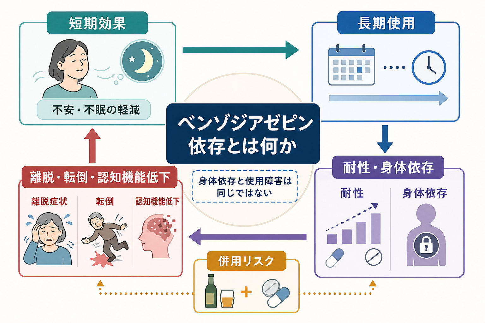
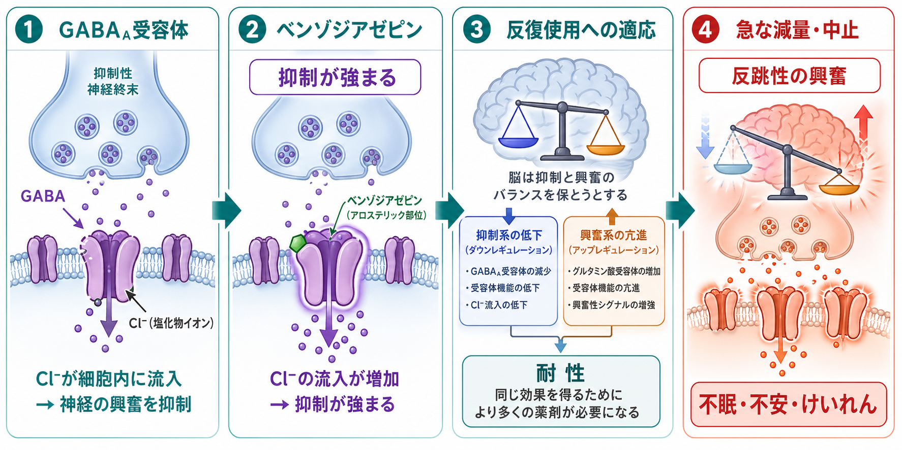
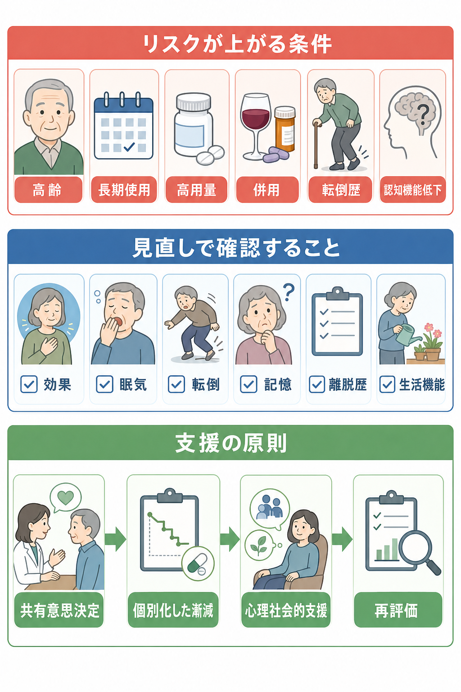

# ベンゾジアゼピン依存とは何か

## 要点

- ベンゾジアゼピンは、GABA_A受容体を介して抑制性神経伝達を強める薬剤群であり、不安、不眠、けいれん、アルコール離脱などで有用な場面がある[1][2]。
- 反復使用では、同じ効果を得にくくなる耐性、急な減量・中止で症状が出る身体依存、使用の制御困難を伴う使用障害を分けて考える必要がある[2][3]。
- 長期使用では、眠気、ふらつき、転倒、交通事故、認知機能低下、オピオイドやアルコールとの併用時の過鎮静・呼吸抑制が問題になる[3][4][5]。
- 高齢者では感受性の上昇、代謝低下、併用薬、フレイルのため、転倒・せん妄・認知機能低下のリスクが大きくなりやすい[4][6]。
- 減量や中止は、教育・研究上は「急にやめる」ではなく、リスクと利益を再評価し、共有意思決定のもとで個別化した漸減と心理社会的支援を組み合わせる課題として扱う[2][3]。

## この記事で答える問い

ベンゾジアゼピン依存とは、単に「睡眠薬を飲んでいる」ことなのか。それとも、身体が薬に適応して離脱が出る状態なのか。さらに、長期使用で転倒や[[認知機能低下はどのように評価するのか|認知機能低下]]が問題になるのはなぜなのか。

この記事では、[[GABAは脳で何をしているのか|GABA]]を介した薬理作用、耐性・身体依存・使用障害の区別、長期使用の害、臨床での見直し方を整理する。医療・精神医学に関する内容は教育・研究目的であり、個別の診断や服薬変更を指示するものではない。

## まず結論

ベンゾジアゼピン依存を理解するうえで最も重要なのは、「身体依存」と「使用障害」を混同しないことである。身体依存は、薬がある状態に身体と脳が適応し、急な減量・中止で離脱症状が出やすくなる状態である。これは処方どおりの使用でも起こりうる[2][3]。一方、使用障害では、使用量や使用場面を制御しにくい、害があっても続く、生活上の役割が障害される、危険な状況で使う、といった行動面・機能面の問題が中心になる[7]。

したがって、長期使用の見直しでは「依存しているから悪い」とラベルを貼るのではなく、何のために使っているのか、いま利益が残っているのか、眠気・転倒・記憶・併用薬・離脱歴・生活機能にどの程度の負担があるのかを評価する。ASAMなどの共同ガイドラインは、急な中止を避け、リスクが利益を上回る場合に、患者ごとの反応に合わせた漸減と支援を行うことを強調している[2]。

## 背景

ベンゾジアゼピン系薬は、不安、[[不眠とは何か|不眠]]、けいれん、アルコール離脱、処置前投薬などで用いられてきた。短期的には、不安や過覚醒を下げ、睡眠を取りやすくし、けいれん閾値に影響するなど、臨床的に意味のある効果をもつ[1][3]。

しかし、薬効が明確であることと、長期に同じ形で使い続けることが安全であることは同じではない。FDAは2020年、ベンゾジアゼピン全体について、乱用、誤用、依存、身体依存、離脱反応に関する枠組み警告の更新を求めた[3]。とくに、オピオイド、アルコール、他の中枢神経抑制薬との併用では、過鎮静、呼吸抑制、昏睡、死亡のリスクが問題になる[3][4]。

高齢者ではさらに文脈が変わる。2023年版 AGS Beers Criteria は、ベンゾジアゼピンを高齢者で原則避けるべき薬剤に位置づけ、認知機能障害、せん妄、転倒、骨折、自動車事故のリスクを挙げている[4]。これは「一度でも使ってはいけない」という単純な規則ではなく、適応、期間、用量、代替手段、本人の目標を慎重に検討する必要があるという意味である。

## 基本概念

### ベンゾジアゼピンとは何か

ベンゾジアゼピンは、GABA_A受容体のベンゾジアゼピン結合部位に作用し、GABAによる抑制性シグナルを増強する薬剤群である[1]。薬そのものがGABAの代わりに受容体を開くというより、GABAが働くときの受容体応答を調節する「正のアロステリック調節薬」として理解するとよい。

この作用により、眠気、抗不安、筋弛緩、抗けいれん作用が生じうる。一方で、同じ作用は注意低下、反応時間の遅れ、ふらつき、記憶障害、事故リスクにもつながる。したがってベンゾジアゼピンは、[[薬物療法のリスクベネフィットをどう考えるか|薬物療法のリスクベネフィット]]を時間軸で見直す必要がある薬剤である。

### 耐性・身体依存・離脱・使用障害

| 概念 | 意味 | 注意点 |
|---|---|---|
| 耐性 | 同じ量で効果が弱くなる、または同じ効果により多い量が必要になる | 催眠作用、抗不安作用、抗けいれん作用などで現れ方が異なる |
| 身体依存 | 反復使用に身体が適応し、急な中止・減量で離脱が出やすくなる | 処方どおりの使用でも起こりうる |
| 離脱 | 薬が減ったときの反跳性症状や身体症状 | 不眠、不安、焦燥、振戦、知覚過敏、けいれんなどが問題になる |
| 使用障害 | 使用制御困難、害があっても続く、生活機能障害などを伴う状態 | 身体依存だけでは使用障害とはいえない |

この区別は、[[鎮静薬使用障害とは何か]]や[[離脱症状とは何か]]と接続する。身体依存がある人をすべて「依存症」と呼ぶと、スティグマが強まり、必要なリスク評価や支援につながりにくくなる。一方で、身体依存を軽視すると、急な中止による重い離脱を見逃す危険がある[2][3]。

## 仕組み

### GABA_A受容体作用と短期効果

GABA_A受容体は、主にCl^-チャネルとして働くイオンチャネル型受容体である。GABAが結合すると神経細胞は発火しにくくなり、回路全体の興奮性が下がる。ベンゾジアゼピンはこのGABA_A受容体の応答を増強し、抑制性神経伝達を強める[1]。

短期的には、この作用が不安や過覚醒を弱め、入眠を助け、けいれんを抑える方向に働く。しかし、抑制が広く強まることは、注意・記憶・姿勢制御・反応速度にも影響する。薬理学的な「効く」は、生活機能の文脈では「眠気が残る」「足元が不安定になる」「記憶があいまいになる」と同じ機序から生じうる。

### 反復使用への適応

反復使用では、脳は薬で強まった抑制性入力を前提にバランスを取り直す。受容体機能、興奮性入力、ストレス反応、睡眠覚醒リズムなどが一つの系として変化し、同じ用量での主観的効果が弱くなることがある[1][5]。これが耐性の背景である。

この状態で急に薬が減ると、薬に支えられていた抑制が外れ、反跳性の興奮が目立ちやすくなる。不眠、不安、焦燥、振戦、発汗、知覚過敏、筋緊張、場合によってはせん妄やけいれんが生じうる[2][3]。離脱は「元の不安が戻っただけ」とは限らない。時間経過、減量速度、用量、半減期、併用薬、既往歴を合わせて考える必要がある。

### 転倒と認知機能低下

転倒リスクは、単に「眠くなる」だけで説明できない。ベンゾジアゼピンは、反応速度、注意、姿勢制御、筋緊張、夜間覚醒時の判断、記憶に影響しうる。高齢者では、筋力低下、視覚障害、夜間頻尿、降圧薬、抗うつ薬、抗精神病薬、アルコール使用などが重なり、転倒・骨折リスクが増幅される[4][6]。

認知機能については、長期使用者で処理速度、注意、記憶などの低下が報告されてきた[8]。ただし、観察研究では不眠、不安、うつ、身体疾患、処方理由そのものが認知機能と関係するため、「薬だけが原因」と単純に断定するのは難しい。それでも、Beers Criteria が高齢者で認知機能障害やせん妄を警告しているように、臨床では測定可能な負担として扱う価値がある[4]。

## 図解

長期使用を見直すときは、薬剤名だけではなく、次の三層を同時に見ると整理しやすい。

| 層 | 確認すること | 例 |
|---|---|---|
| 薬理 | 半減期、用量、服用時刻、併用薬 | 長時間作用型、頓用の頻回化、オピオイド・アルコール併用 |
| 症状 | 効果、副作用、離脱、再燃 | 不眠、不安、眠気、ふらつき、記憶低下、けいれん既往 |
| 生活機能 | 転倒、運転、仕事、介護、対人関係 | 夜間転倒、日中のぼんやり、服薬管理の混乱 |

## 臨床・研究との接続

### 評価は「やめるか続けるか」だけではない

ベンゾジアゼピンの見直しは、続けるか中止するかの二択ではない。適応、用量、服用時刻、処方期間、頓用の実態、複数医療機関からの処方、他の中枢神経抑制薬、生活上のリスク、本人が重視するアウトカムを評価する[2][3]。

ASAMなどの共同ガイドラインは、少なくとも定期的なリスク・利益評価、共有意思決定、急な中止の回避、患者反応に応じた漸減、心理社会的介入の併用を重視している[2]。具体的な減量速度は個別化されるべきであり、教育・研究目的の記事で一律の減量手順を示すことは適切ではない。

### 高齢者と多剤併用

高齢者では、ベンゾジアゼピン単剤の問題だけでなく、多剤併用の問題として考える必要がある。Beers Criteria は、ベンゾジアゼピンとオピオイドの併用を避けるべき相互作用として挙げ、3種類以上の中枢神経作用薬の併用も転倒・骨折リスクとして扱っている[4]。転倒歴、フレイル、認知症、せん妄、腎機能・肝機能、服薬自己管理能力は、薬剤選択と同じくらい重要な情報である。

### 研究上の難しさ

ベンゾジアゼピン長期使用の研究では、交絡が大きな問題になる。不眠や不安そのものが転倒、認知機能、生活機能低下と関係し、薬を使う人と使わない人の背景は最初から異なる。さらに、薬剤ごとの半減期、用量、使用期間、頓用か連日か、併用薬、減量歴もばらつく。

そのため研究知見は、「ベンゾジアゼピンは必ず認知症を起こす」といった断定ではなく、「長期使用では認知・転倒・事故に関する負担があり、特に高齢者や多剤併用では定期的な再評価が必要」と読むのが妥当である[4][6][8]。

## よくある誤解

### 誤解1: 処方どおりなら依存は起こらない

処方どおりでも身体依存は起こりうる。FDAは、推奨用量であっても誤用、乱用、依存、身体依存、離脱反応が問題になりうることを警告している[3]。ただし、身体依存があることと、使用障害があることは同じではない。

### 誤解2: 離脱が出るなら本人の意思が弱い

離脱は、脳と身体が反復使用に適応した結果として起こる生理学的反応である。本人の性格や意思だけで説明すると、必要な評価と支援を見落とす。離脱が疑われる場合は、減量速度、服薬歴、併用薬、基礎疾患、元の症状の再燃を区別して考える必要がある[2][7]。

### 誤解3: 短時間作用型なら高齢者でも安全である

短時間作用型なら残薬感が少ないように見えることがあるが、高齢者での転倒、認知機能障害、せん妄、事故のリスクがなくなるわけではない。Beers Criteria は、短時間作用型が長時間作用型より安全とはいえないと明記している[4]。

### 誤解4: 中止すればすぐに問題は解決する

急な中止や速すぎる減量は、重い離脱を招くことがある[2][3]。また、薬で抑えられていた不眠や不安が再燃することもある。見直しの目標は「薬をゼロにすること」だけではなく、本人の安全、生活機能、睡眠、心理的苦痛、併用薬リスクを総合的に改善することである。

## 関連ノート

- [[GABAは脳で何をしているのか]]
- [[鎮静薬使用障害とは何か]]
- [[離脱症状とは何か]]
- [[不眠とは何か]]
- [[認知機能低下はどのように評価するのか]]
- [[薬物療法のリスクベネフィットをどう考えるか]]

### 関連ノート候補

- ベンゾジアゼピン系薬とは何か
- 非ベンゾジアゼピン系睡眠薬とは何か
- 高齢者の薬物療法では何に注意するか
- 転倒転落リスク管理とは何か
- 睡眠薬の長期使用リスクとは何か
- ベンゾジアゼピン漸減とは何か

### MOC更新候補

- `content/00_MOC/` 配下の薬物療法、精神薬理、依存症、老年精神医学に関する MOC へ追加候補。
- 並列実行時の競合を避けるため、このタスクでは MOC 本体は更新していない。

## 理解チェック

1. 身体依存と使用障害の違いを、行動面・機能面の観点から説明できるか。
2. ベンゾジアゼピンがGABA_A受容体に作用すると、なぜ抗不安作用と眠気・ふらつきが同じ薬理から生じうるのか。
3. 離脱症状と元の不眠・不安の再燃を区別するとき、どのような時間経過と服薬歴を確認する必要があるか。
4. 高齢者で転倒や認知機能低下のリスクが大きくなる理由を、多剤併用と生活機能の観点から説明できるか。
5. ベンゾジアゼピンの見直しで、なぜ急な中止ではなく共有意思決定と個別化した漸減が重視されるのか。

## 参考文献

[1] Goldschen-Ohm, M. P. (2022). Benzodiazepine modulation of GABA_A receptors: A mechanistic perspective. *Biomolecules, 12*(12), 1784. https://doi.org/10.3390/biom12121784

[2] Brunner, E., Chen, C.-Y. A., Klein, T., et al. (2025). Joint clinical practice guideline on benzodiazepine tapering: Considerations when risks outweigh benefits. *Journal of General Internal Medicine, 40*, 2814-2859. https://doi.org/10.1007/s11606-025-09499-2

[3] U.S. Food and Drug Administration. (2020). *FDA requiring Boxed Warning updated to improve safe use of benzodiazepine drug class*. https://www.fda.gov/drugs/drug-safety-and-availability/fda-requiring-boxed-warning-updated-improve-safe-use-benzodiazepine-drug-class

[4] American Geriatrics Society Beers Criteria Update Expert Panel. (2023). American Geriatrics Society 2023 updated AGS Beers Criteria for potentially inappropriate medication use in older adults. *Journal of the American Geriatrics Society, 71*(7), 2052-2081. https://doi.org/10.1111/jgs.18372

[5] Brett, J., & Murnion, B. (2015). Management of benzodiazepine misuse and dependence. *Australian Prescriber, 38*(5), 152-155. https://doi.org/10.18773/austprescr.2015.055

[6] Woolcott, J. C., Richardson, K. J., Wiens, M. O., et al. (2009). Meta-analysis of the impact of 9 medication classes on falls in elderly persons. *Archives of Internal Medicine, 169*(21), 1952-1960. https://doi.org/10.1001/archinternmed.2009.357

[7] Maust, D. T., Lin, L. A., & Blow, F. C. (2019). Benzodiazepine use and misuse among adults in the United States. *Psychiatric Services, 70*(2), 97-106. https://doi.org/10.1176/appi.ps.201800321

[8] Barker, M. J., Greenwood, K. M., Jackson, M., & Crowe, S. F. (2004). Cognitive effects of long-term benzodiazepine use: A meta-analysis. *CNS Drugs, 18*(1), 37-48. https://doi.org/10.2165/00023210-200418010-00004

## 未解決問題

- ベンゾジアゼピン長期使用と認知症リスクの関連を、処方理由、睡眠障害、不安、うつ、身体疾患の交絡からどこまで分離できるか。
- 身体依存はあるが使用障害はない人に対して、スティグマを増やさず、かつ離脱リスクを軽視しない説明をどう標準化するか。
- 漸減中の離脱、再燃、生活ストレスを、臨床現場で実用的に測定する尺度やモニタリング方法をどう整えるか。

## 更新ログ

- 2026-04-28: 初版作成。ベンゾジアゼピン依存、耐性、身体依存、離脱、転倒、認知機能低下、臨床的見直し、図解3点を追加。
