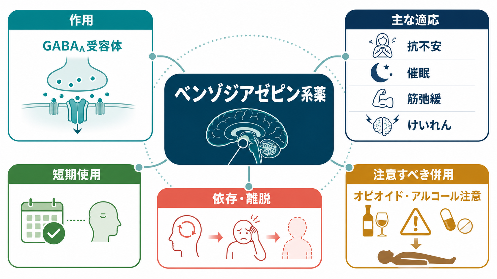
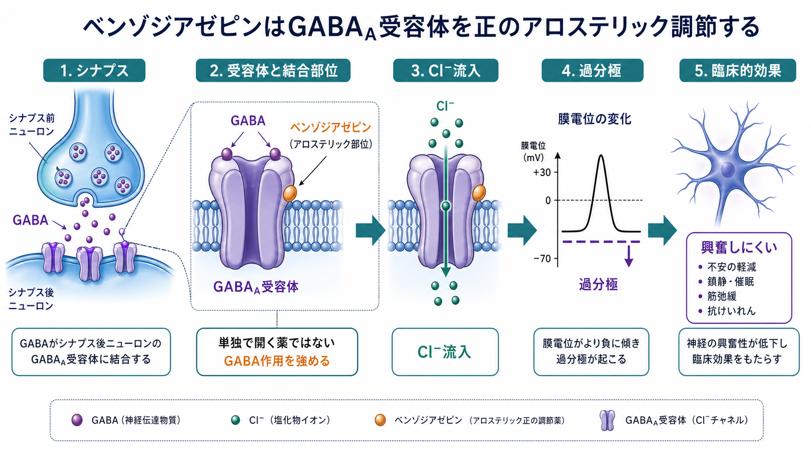
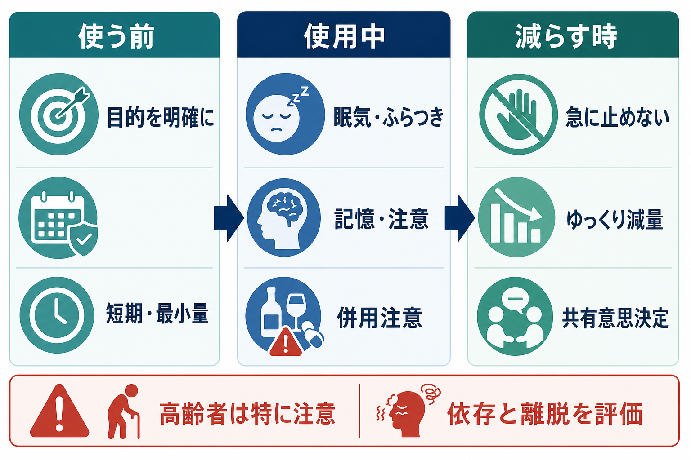

# ベンゾジアゼピン系薬とは何か

## 要点

- ベンゾジアゼピン系薬は、主に GABA_A 受容体を正のアロステリック調節により増強し、中枢神経の興奮性を下げる薬剤群である[1][2]。
- 臨床的には、急性不安、パニック、短期の不眠、けいれん、アルコール離脱、筋緊張、処置前鎮静などで使われるが、疾患や状況によって推奨度は大きく異なる[3][4][8]。
- 長期・連日使用では、耐性、身体依存、離脱症状、認知機能低下、転倒、交通事故、過量服薬、アルコール・オピオイドとの併用による呼吸抑制が問題になる[3][6][7]。
- 「依存」は「乱用している」という意味だけではない。処方通りの使用でも身体依存は起こりうるため、急な中止や急速な減量は避け、共有意思決定のもとで段階的に見直す必要がある[3][5][6]。
- 本稿は教育・研究目的の整理であり、個別の服薬開始・増減・中止の指示ではない。

## この記事で答える問い

1. ベンゾジアゼピン系薬は、脳内でどのように作用するのか。
2. なぜ抗不安、催眠、筋弛緩、抗けいれん作用が同じ薬剤群で生じるのか。
3. どのような場面では有用で、どのような場面では慎重さが必要なのか。
4. 依存、耐性、離脱、反跳症状をどのように区別して考えればよいのか。
5. 臨床・研究の文脈で、ベンゾジアゼピン系薬をどう位置づけるべきか。

## まず結論

ベンゾジアゼピン系薬は、[[GABAは脳で何をしているのか|GABA]] による抑制性シグナルを強めることで、脳の過剰な興奮を一時的に下げる薬である。したがって、急性の不安、けいれん、強い不眠、アルコール離脱、処置前の鎮静など、「今すぐ興奮性を下げること」に意味がある場面では強力な選択肢になりうる[3][4][8]。

一方で、同じ作用は眠気、ふらつき、注意・記憶の低下、運転能力低下、転倒、呼吸抑制にもつながる。さらに、使用が続くと身体が薬の存在に適応し、減量・中止時に不眠、不安、焦燥、振戦、知覚異常、まれにけいれんなどが出ることがある[3][6][7]。ベンゾジアゼピン系薬は「効くが、設計思想として長期の万能薬ではない」と理解するのが実際的である。

## 背景

ベンゾジアゼピン系薬は、バルビツール酸系薬より安全域が広い鎮静・抗不安薬として広がった。代表的な薬剤には、ジアゼパム、ロラゼパム、アルプラゾラム、クロナゼパム、ブロマゼパム、エチゾラム、トリアゾラム、ミダゾラムなどがある。ただし、国や承認状況によって分類・適応・規制は異なる。

精神科領域では、[[不安症群とは何か|不安症]]、パニック発作、不眠、緊張、焦燥、アルコール離脱、けいれん、処置前鎮静などが関連する。睡眠の文脈では [[睡眠障害とは何か]]、安全性の文脈では [[薬物療法のリスクベネフィットをどう考えるか]] と接続して考えるとよい。

NICE の全般不安症ガイドラインは、GAD へのベンゾジアゼピンを危機時の短期使用を除いて通常は勧めないとしている[4]。また不眠に対する催眠薬は、非薬物的対応を考慮したうえで、重度で生活に支障がある場合に短期間だけ用いるという位置づけが示されている[8]。つまり、急性の苦痛を下げる力と、長期使用時の害を同時に見る必要がある。

## 基本概念

### ベンゾジアゼピン系薬

ベンゾジアゼピン系薬は、GABA_A 受容体のベンゾジアゼピン結合部位に結合し、GABA が受容体に作用したときの反応を強める薬剤群である[1][2]。ここで重要なのは、一般的な臨床用ベンゾジアゼピンは「GABA そのもの」ではなく、GABA 作用を増幅する調節薬として働く点である。

### 薬効と副作用は同じ軸にある

抗不安、催眠、筋弛緩、抗けいれん作用は、いずれも神経活動の抑制が強まることで生じる。したがって、治療効果と副作用は完全には切り離せない。眠気を利用すれば催眠作用だが、日中に残れば作業能低下や転倒リスクになる。筋緊張を下げる作用は有用な場合があるが、高齢者ではふらつきとして現れることがある[7]。

### 耐性・身体依存・使用障害

耐性とは、同じ効果を得るために以前より薬の効果が弱く感じられる状態である。身体依存とは、体が薬の存在に適応し、急な中止や急速な減量で離脱症状が生じうる状態である。使用障害は、制御困難な使用、強い渇望、生活上の障害などを含む診断概念であり、身体依存と同じではない[3][6]。この区別は [[鎮静薬使用障害とは何か]] とも関係する。

## 仕組み

GABA_A 受容体は、塩化物イオンチャネルを持つ抑制性受容体である。GABA が結合するとチャネルが開き、塩化物イオンの流入により神経細胞は過分極しやすくなる。その結果、活動電位が生じにくくなり、神経回路全体の興奮性が下がる[1][2]。

ベンゾジアゼピン系薬は、この GABA_A 受容体を正のアロステリック調節薬として修飾する。簡単に言えば、「GABA が効いている場面で、その効きを強める」薬である。研究レベルでは、受容体サブユニット構成や結合部位、チャネル開閉の変化が薬効差や副作用差に関わると考えられている[1]。

## 図解

上の 1 枚目は、ベンゾジアゼピン系薬を「作用」「適応」「短期使用」「依存・離脱」「併用注意」の 5 つに分けた概念地図である。2 枚目は、GABA_A 受容体で GABA の抑制作用が増強され、神経細胞が興奮しにくくなる流れを示している。

3 枚目は、臨床での見直しを「使う前」「使用中」「減らす時」に分けたものである。薬を使う前には目的を明確にし、使用中は眠気・ふらつき・記憶や注意の変化を観察し、減らす時には急に止めないという原則が重要になる[3][5][6]。

## 臨床・研究との接続

### 適応を「症状」ではなく「時間軸」で見る

ベンゾジアゼピン系薬は、短期的には不安、緊張、不眠、けいれん、離脱症状などを速やかに軽減しうる[3]。しかし、慢性的な不安症や不眠に対して漫然と使うと、心理療法、睡眠衛生、認知行動療法、SSRI/SNRI などの長期戦略の機会を狭めることがある。[[SSRIとは何か]] や [[SNRIとは何か]] は、不安症の長期治療を考えるときの比較対象になる。

### 高齢者ではリスクの重みが変わる

2023 年の AGS Beers Criteria は、高齢者ではベンゾジアゼピン系薬への感受性が高く、認知機能低下、せん妄、転倒、骨折、交通事故、身体依存のリスクが高まるとして、原則的に回避を推奨している[7]。ただし、けいれん、アルコール離脱、重度の全般不安、処置前麻酔など、例外的に妥当な場面もある[7]。このため [[高齢者の不安症はどう現れるのか]] では、症状緩和だけでなく転倒・認知・併存疾患を含めて考える必要がある。

### オピオイド・アルコールとの併用

FDA は、ベンゾジアゼピン系薬の乱用、誤用、依存、離脱のリスクに加え、オピオイド、アルコール、その他の中枢神経抑制物質との併用で過量服薬や死亡リスクが高まることを警告している[3]。これは [[薬物過量服薬とは何か]] とも直接関係する。臨床では、処方薬だけでなく、市販薬、飲酒、他院処方、睡眠薬、鎮痛薬を含めて確認する必要がある。

### 減量・中止は「失敗」ではなく治療計画の一部

ASAM などの合同ガイドラインは、ベンゾジアゼピン系薬を急に中止せず、リスクと利益を継続的に評価し、共有意思決定のもとで個別化された漸減を行うことを強調している[6]。初期の減量幅として 5-10% 程度を考慮し、通常は 2 週間ごとに 25% を超えない、といった目安も示されているが、これは個別処方ではなく臨床家向けの一般原則である[6]。症状が強い場合は、ペースを遅くする、一定期間維持する、心理社会的支援を加えるといった調整が必要になる[5][6]。

## よくある誤解

### 「短期なら依存は絶対に起こらない」

短期使用は長期使用よりリスクを下げるが、リスクをゼロにはしない。FDA は、処方通りでも数日から数週間の連用で身体依存が起こりうると注意喚起している[3]。ただし、リスクの大きさは用量、期間、薬剤特性、併用物質、既往、年齢、生活環境によって変わる。

### 「ベンゾジアゼピンは危険だから必ず避けるべき」

これは逆方向の単純化である。急性不安、けいれん、アルコール離脱、処置前鎮静などでは、ベンゾジアゼピン系薬が重要な治療手段になることがある[3][6][7]。問題は「薬剤群そのものが善か悪か」ではなく、目的、期間、代替手段、リスク、本人の価値観を明確にしたうえで使われているかである。

### 「依存があるなら本人の意思が弱い」

身体依存は、反復使用に対する神経系の適応であり、道徳的な弱さではない[3][6]。もちろん、誤用や使用障害が併存する場合もあるが、処方通りに使っていた人にも離脱症状は起こりうる。この区別を曖昧にすると、本人が相談しにくくなり、急な中止や孤立を招きやすい。

### 「睡眠薬は眠れるなら長く続けてもよい」

不眠が改善することは重要だが、長期の催眠薬使用では、耐性、反跳性不眠、日中の眠気、転倒、認知への影響を評価する必要がある[7][8]。[[精神科診察で睡眠をどう評価するか]] のように、睡眠時間だけでなく、日中機能、生活リズム、併存疾患、薬以外の介入可能性を確認する視点が重要である。

## 関連ノート

- [[GABAは脳で何をしているのか]]
- [[薬物療法は神経回路にどう作用するのか]]
- [[薬物療法のリスクベネフィットをどう考えるか]]
- [[不安症群とは何か]]
- [[睡眠障害とは何か]]
- [[精神科診察で睡眠をどう評価するか]]
- [[鎮静薬使用障害とは何か]]
- [[薬物過量服薬とは何か]]
- [[高齢者の不安症はどう現れるのか]]
- [[SSRIとは何か]]
- [[SNRIとは何か]]

## MOC更新候補

- `content/00_MOC/` 配下の臨床実践・治療、薬物療法、精神薬理、医療安全に関する MOC があれば、本記事を「薬物療法」「依存・離脱」「睡眠薬・抗不安薬」の節に追加する候補。
- 並列ジョブとの衝突を避けるため、本稿では MOC 本体は更新しない。

## 理解チェック

1. ベンゾジアゼピン系薬は GABA_A 受容体をどのように調節するか。
2. 抗不安作用と眠気・ふらつきが同じ薬理軸から生じる理由は何か。
3. 身体依存と使用障害はどの点で異なるか。
4. 高齢者でベンゾジアゼピン系薬が特に問題になりやすい理由は何か。
5. ベンゾジアゼピン系薬を見直すとき、急な中止ではなく共有意思決定と漸減が重視されるのはなぜか。

## 未解決問題

- 受容体サブタイプ選択性を高めることで、抗不安作用を保ちながら認知・転倒・依存リスクを下げられるか。
- 長期使用者に対する最適な漸減速度、心理社会的支援、再燃予防の組み合わせは、患者群ごとにどこまで個別化できるか。
- 不眠や不安の短期緩和と、長期的な機能回復を同時に評価するアウトカム設計をどう標準化するか。
- 処方通りの使用に伴う身体依存と、鎮静薬使用障害を臨床現場で過不足なく区別する評価法をどう普及させるか。

## 参考文献

[1] Goldschen-Ohm MP. (2022). Benzodiazepine Modulation of GABA_A Receptors: A Mechanistic Perspective. *Biomolecules*, 12(12), 1784. https://doi.org/10.3390/biom12121784

[2] Liggett A, Sankey C. (2023). GABA Receptor Positive Allosteric Modulators. *StatPearls*. NCBI Bookshelf. https://www.ncbi.nlm.nih.gov/books/NBK554443/

[3] U.S. Food and Drug Administration. (2020). FDA requiring Boxed Warning updated to improve safe use of benzodiazepine drug class. https://www.fda.gov/drugs/drug-safety-and-availability/fda-requiring-boxed-warning-updated-improve-safe-use-benzodiazepine-drug-class

[4] National Institute for Health and Care Excellence. (2020). Generalised anxiety disorder and panic disorder in adults: management, CG113. https://www.nice.org.uk/guidance/cg113/chapter/1-guidance

[5] National Institute for Health and Care Excellence. (2022). Medicines associated with dependence or withdrawal symptoms: safe prescribing and withdrawal management for adults, NG215. https://www.nice.org.uk/guidance/ng215

[6] Joint Clinical Practice Guideline on Benzodiazepine Tapering: Considerations When Risks Outweigh Benefits. (2025). *Journal of General Internal Medicine*. https://pmc.ncbi.nlm.nih.gov/articles/PMC12463801/

[7] American Geriatrics Society 2023 updated AGS Beers Criteria for potentially inappropriate medication use in older adults. (2023). *Journal of the American Geriatrics Society*, 71(7), 2052-2081. https://pmc.ncbi.nlm.nih.gov/articles/PMC12478568/

[8] National Institute for Health and Care Excellence. (2004). Guidance on the use of zaleplon, zolpidem and zopiclone for the short-term management of insomnia, TA77. https://www.nice.org.uk/guidance/ta77/chapter/1-Guidance
