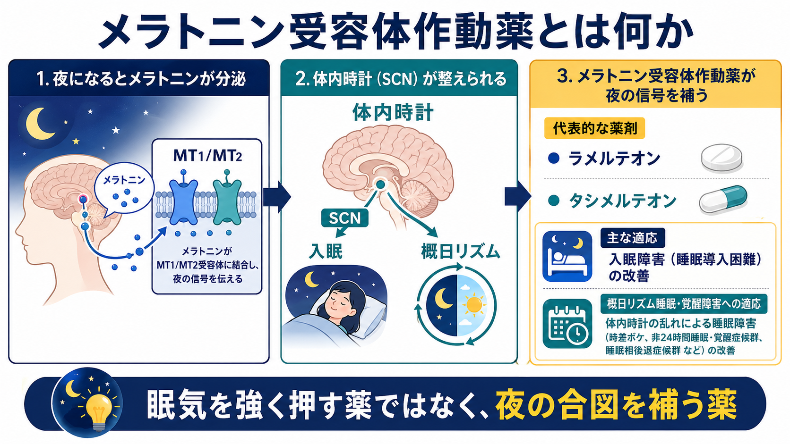
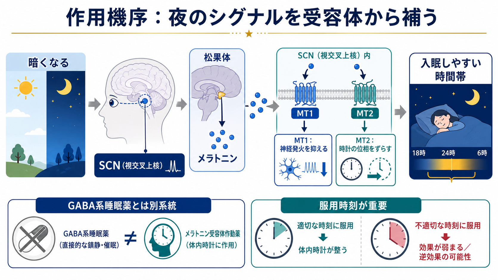

# メラトニン受容体作動薬とは何か

## 要点

- メラトニン受容体作動薬は、脳内の MT1 / MT2 受容体を介して「夜である」という生物学的シグナルを補い、入眠や[[概日リズム睡眠覚醒障害とは何か|概日リズム]]の調整に関わる薬剤である。
- 日本の臨床で中心になる薬剤はラメルテオンで、効能・効果は「不眠症における入眠困難の改善」である[1]。
- GABA-A 受容体を介して広く鎮静するベンゾジアゼピン系・Z薬とは作用点が異なり、依存や反跳性不眠を主目的に扱う薬ではなく、睡眠覚醒リズムの入口を整える薬として理解するとよい[2][3]。
- 効果は「強制的に眠らせる」というより、服用時刻、光環境、生活リズム、併存疾患の評価と組み合わせて現れやすい。
- 医療・教育目的の整理であり、個別の服薬開始・中止・変更は医師・薬剤師と相談して判断する。

## この記事で答える問い

1. メラトニン受容体作動薬は、通常の睡眠薬と何が違うのか。
2. MT1 / MT2 受容体は、入眠と概日リズムにどう関わるのか。
3. ラメルテオン、タシメルテオン、アゴメラチンはどのように位置づけられるのか。
4. 臨床で使うときに、どのような誤解や注意点があるのか。

## まず結論

メラトニン受容体作動薬は、眠気を力で押し込む薬というより、[[睡眠覚醒障害群とは何か|睡眠]]と覚醒のタイミングを決める体内時計へ「夜の合図」を届ける薬である。代表薬のラメルテオンは MT1 / MT2 受容体への高い親和性をもち、概日リズムを支える睡眠覚醒サイクルに関与するとされる一方、GABA 受容体複合体への目立った親和性はない[2]。そのため、[[精神科薬物療法とは何か]]の中では、鎮静催眠薬というより「睡眠覚醒リズムに働く薬」として捉えると、期待できることと限界を整理しやすい。

## 背景

メラトニンは、暗期に増える内因性ホルモンで、松果体からの分泌を通じて「夜の長さ」や睡眠覚醒のタイミングを身体に伝える。哺乳類の主時計である視交叉上核、すなわち SCN は光暗サイクルによって同調し、メラトニンはこの系にフィードバックして概日リズムの位相調整に関わる[4]。

不眠を「眠れない」という一語でまとめると、入眠困難、中途覚醒、早朝覚醒、睡眠相の遅れ、非24時間睡眠覚醒リズムなどが混ざる。メラトニン受容体作動薬が特に理解しやすいのは、入眠困難や概日リズムの乱れが前景にある場面である。日本のロゼレム錠8mgの添付文書でも、効能・効果は「不眠症における入眠困難の改善」とされ、通常成人ではラメルテオン8mgを就寝前に投与する[1]。

## 基本概念

### MT1 / MT2 受容体

メラトニンの主要な高親和性受容体は MT1 と MT2 で、いずれも Gタンパク質共役受容体である。レビューでは、MT1 は SCN 神経活動の抑制、MT2 は概日リズムの位相調整と関連づけて説明されることが多い[4][5]。ただし、ヒトの臨床効果は単一受容体だけで単純に決まるわけではなく、服用時刻、光曝露、年齢、併存疾患、薬物相互作用も関わる。

### 薬剤ごとの位置づけ

| 薬剤 | 主な特徴 | 臨床上の位置づけ |
|---|---|---|
| ラメルテオン | MT1 / MT2 受容体作動薬。GABA 受容体複合体への目立った親和性はない[2] | 入眠困難を中心に用いられる。日本でも不眠症の入眠困難改善に承認されている[1] |
| タシメルテオン | メラトニン受容体作動薬 | 米国では成人の非24時間睡眠覚醒障害、Smith-Magenis 症候群の夜間睡眠障害などに承認されている[6] |
| アゴメラチン | MT1 / MT2 作動作用に加え、5-HT2C 拮抗作用をもつ | 国・地域により承認状況が異なる。睡眠薬というより抗うつ薬として論じられることが多い[7] |

## 仕組み

メラトニン受容体作動薬の基本的な流れは、次のように整理できる。

1. 暗くなると、光入力の変化を通じて SCN と松果体のリズムが夜モードへ移る。
2. メラトニン信号が MT1 / MT2 受容体に作用し、睡眠覚醒サイクルと概日リズムの位相調整に関わる。
3. ラメルテオンなどの作動薬は、このメラトニン信号を薬理学的に補う。
4. その結果、入眠しやすい時間帯への移行を助ける可能性がある。

重要なのは、これは GABA 系睡眠薬のように中枢神経活動を広く抑える説明とは違う点である。ラメルテオンは MT1 / MT2 への親和性をもつ一方、GABA 受容体複合体への目立った親和性を示さないとされる[2]。この違いは、[[向精神薬の基本分類とは何か]]や[[薬物療法のリスクベネフィットをどう考えるか]]を読むときにも、薬を「何を標的にしているか」で区別する助けになる。

## 図解

図1は、夜間にメラトニン信号が高まり、SCN を中心に入眠と概日リズムへ影響する全体像を示している。図2は、MT1 / MT2 受容体を介した作用と、GABA 系睡眠薬との違い、服用時刻の重要性をまとめている。

図中の「MT1：神経発火を抑える」「MT2：時計の位相をずらす」は、教育用の単純化である。実際の薬効は、受容体選択性、投与量、投与時刻、体内時計の位相、光環境、併用薬によって変わる。

## 臨床・研究との接続

### 不眠症における位置づけ

AASM の成人慢性不眠症に対する薬物療法ガイドラインは、薬物療法が臨床的に必要な場合、ラメルテオンを成人の睡眠開始困難に用いることを弱い推奨としている[8]。この「弱い」は「効かない」という意味ではなく、患者背景、期待するアウトカム、代替手段、害と利益のバランスを個別に見る必要があるという意味で読むべきである。

2023年の系統的レビュー・メタ解析では、ラメルテオンは4週時点で主観的・客観的な睡眠潜時や総睡眠時間に一定の改善を示したが、効果量や臨床的意味づけはアウトカムにより異なる[3]。したがって、強い即効性を期待するより、入眠困難の型、生活リズム、服薬タイミングを合わせて評価する薬と考えるのが実践的である。

### 概日リズム睡眠・覚醒障害との関係

メラトニンとメラトニン作動薬は、時間帯によって概日リズムの位相を前進または後退させる性質をもつ[4]。タシメルテオンは、米国では成人の非24時間睡眠覚醒障害に承認され、服用は毎晩同じ時刻、就寝1時間前が推奨される。添付文書では、個人の概日リズム差のため、効果が出るまで数週から数か月かかる場合があると説明されている[6]。

この点は、メラトニン受容体作動薬が「今夜だけ強く眠らせる薬」ではなく、「時計を同調させる薬」として働く側面をよく示している。

### 安全性と相互作用

ラメルテオンでは、フルボキサミンとの併用が禁忌または避けるべき組み合わせとして扱われる。CYP1A2 阻害によりラメルテオン曝露が大きく上がるためである[1][2]。また、重度肝機能障害、高度な睡眠時無呼吸、アルコール併用、服用後に起きて作業する状況には注意が必要である[1][2]。

添付文書には、眠気、めまい、疲労、悪心、悪夢、プロラクチン上昇、まれな血管浮腫やアナフィラキシーなども記載される[1][2]。臨床では、薬剤の作用機序が比較的選択的であることと、すべての人に安全・無害であることを混同しないことが重要である。

## よくある誤解

### 誤解1：メラトニン受容体作動薬は「弱い睡眠薬」にすぎない

「弱い」という表現は不正確である。作用が弱いのではなく、狙っている生理機構が異なる。GABA 系睡眠薬のような広い鎮静ではなく、夜の信号と体内時計に近い場所へ作用する。

### 誤解2：飲めばすぐ深く眠れる

入眠困難には役立つ可能性があるが、中途覚醒や強い過覚醒、疼痛、躁状態、睡眠時無呼吸、薬物・アルコール、生活リズムの大きな乱れが主因なら、薬だけでは不十分である。睡眠衛生、光環境、併存疾患の評価が必要になる。

### 誤解3：メラトニンと同じだからサプリ感覚でよい

ラメルテオンやタシメルテオンは医療用医薬品であり、用量、禁忌、相互作用、安全性評価がある。特にフルボキサミン、肝機能障害、眠気を伴う作業、妊娠・授乳、併用薬は確認が必要である[1][2][6]。

### 誤解4：服用時刻は大まかでよい

概日リズムに関わる薬では、服用時刻が薬効の一部である。タシメルテオンの添付文書でも毎晩同じ時刻の投与が強調され、効果発現に時間がかかる場合があるとされる[6]。

## 関連ノート

- [[精神科薬物療法とは何か]]
- [[向精神薬の基本分類とは何か]]
- [[薬物療法のリスクベネフィットをどう考えるか]]
- [[睡眠障害とは何か]]
- [[睡眠覚醒障害群とは何か]]
- [[概日リズム睡眠覚醒障害とは何か]]
- [[非ベンゾジアゼピン系睡眠薬とは何か]]

### 関連ノート候補

- 睡眠とは何か
- 概日リズムとは何か
- 不眠症とは何か
- 睡眠衛生とは何か
- ベンゾジアゼピン系睡眠薬とは何か
- オレキシン受容体拮抗薬とは何か

### MOC更新候補

- `content/00_MOC/` 配下の臨床実践・薬物療法・睡眠関連 MOC に、本記事 `[[メラトニン受容体作動薬とは何か]]` を追加する。
- 並列記事生成との衝突を避けるため、本ジョブでは MOC ファイル本体は更新しない。

## 理解チェック

1. メラトニン受容体作動薬が GABA 系睡眠薬と異なる点は何か。
2. MT1 / MT2 受容体は、入眠と概日リズムの説明でどのように使い分けられるか。
3. ラメルテオンの臨床上の中心的な適応は何か。
4. 服用時刻や光環境が重要になる理由は何か。
5. 「サプリのメラトニンと同じだから安全」と言い切れない理由は何か。

## 参考文献

[1] PMDA. ロゼレム錠8mg 添付文書（2023年11月改訂）. https://www.pmda.go.jp/PmdaSearch/iyakuDetail/ResultDataSetPDF/400256_1190016F1024_1_12

[2] DailyMed. RAMELTEON tablets, prescribing information. Revised 12/2023. https://dailymed.nlm.nih.gov/dailymed/lookup.cfm?setid=4c25cf94-f30e-4940-9f8b-3cb34258ba04

[3] Maruani J, Reynaud E, Chambe J, et al. Efficacy of melatonin and ramelteon for the acute and long-term management of insomnia disorder in adults: A systematic review and meta-analysis. *Journal of Sleep Research*. 2023;32(6):e13939. https://doi.org/10.1111/jsr.13939

[4] Liu J, Clough SJ, Hutchinson AJ, Adamah-Biassi EB, Popovska-Gorevski M, Dubocovich ML. MT1 and MT2 Melatonin Receptors: A Therapeutic Perspective. *Annual Review of Pharmacology and Toxicology*. 2016;56:361-383. https://doi.org/10.1146/annurev-pharmtox-010814-124742

[5] Dubocovich ML. Melatonin receptors: role on sleep and circadian rhythm regulation. *Sleep Medicine*. 2007;8 Suppl 3:34-42. https://doi.org/10.1016/j.sleep.2007.10.007

[6] DailyMed. HETLIOZ / HETLIOZ LQ (tasimelteon), prescribing information. Revised 12/2020. https://dailymed.nlm.nih.gov/dailymed/drugInfo.cfm?setid=ca4a9b63-708e-49e9-8f9b-010625443b90

[7] Racagni G, Riva MA, Molteni R, et al. Mode of action of agomelatine: synergy between melatonergic and 5-HT2C receptors. *World Journal of Biological Psychiatry*. 2011;12(8):574-587. https://doi.org/10.3109/15622975.2011.595823

[8] Sateia MJ, Buysse DJ, Krystal AD, Neubauer DN, Heald JL. Clinical Practice Guideline for the Pharmacologic Treatment of Chronic Insomnia in Adults: An American Academy of Sleep Medicine Clinical Practice Guideline. *Journal of Clinical Sleep Medicine*. 2017;13(2):307-349. https://doi.org/10.5664/jcsm.6470

## 未解決問題

- 日本語圏の睡眠医療で、ラメルテオンをどの患者群に優先するかは、併存症、既使用薬、睡眠衛生、服薬アドヒアランスを含めた実践知としてさらに整理が必要である。
- サプリメントとしてのメラトニン、医療用ラメルテオン、概日リズム障害へのタシメルテオンは混同されやすいため、別記事で比較表を作る価値がある。
- 光療法、CBT-I、勤務スケジュール調整との組み合わせをどう設計するかは、睡眠医学と精神科臨床の接点として重要である。
