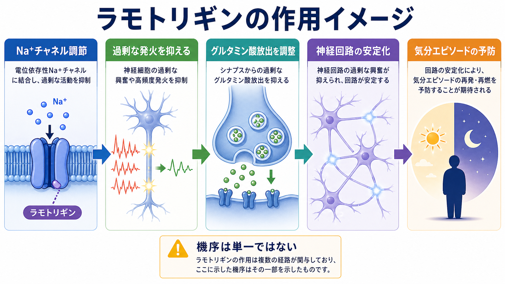
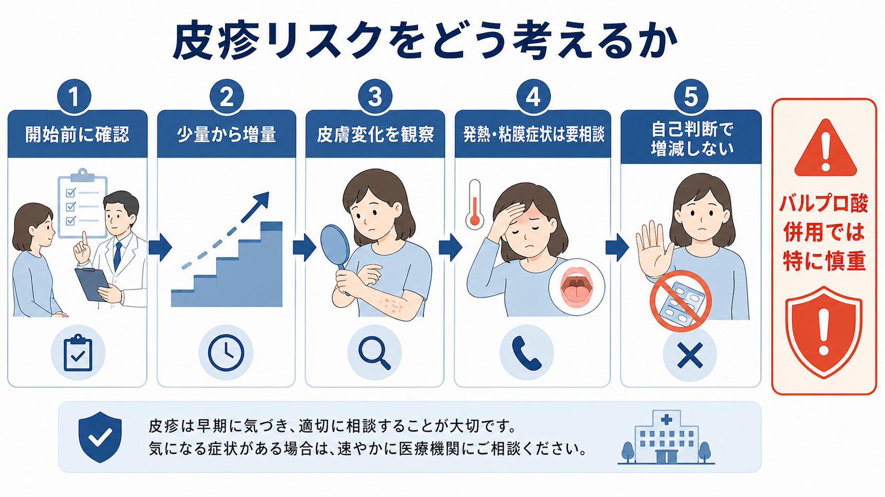

# ラモトリギンとは何か

## 要点

- ラモトリギンは、抗てんかん薬として開発され、双極性障害では主に気分エピソードの再発・再燃抑制に位置づけられる薬剤である。日本のPMDA医薬品情報でも、てんかんと双極性障害に関する適応・資材が整理されている[1]。
- 双極性障害では、急性躁病を速く鎮める薬というより、双極性うつや維持療法、特に抑うつ再発の予防に関係する薬として理解するとよい[4][5][6][7]。
- もっとも重要な安全性論点は皮疹である。重篤な皮膚障害はまれだが、Stevens-Johnson症候群、中毒性表皮壊死症、DRESSなどにつながる可能性があり、初期用量や増量速度、バルプロ酸併用がリスクに関わる[2][3]。
- 本記事は教育・研究目的の整理であり、個別の服薬開始・中止・増減を指示するものではない。実際の判断は、診断、併用薬、妊娠可能性、既往、副作用歴、本人の価値観を含めて専門家と相談する。

## この記事で答える問い

1. ラモトリギンは、[[双極性障害とは何か|双極性障害]]のどの場面で使われるのか。
2. 作用機序はどのように理解できるのか。
3. 皮疹リスクを、過度に怖がりすぎず、軽視もしないためには何を見るべきか。
4. [[薬物療法のリスクベネフィットをどう考えるか|薬物療法のリスクと利益]]を、本人と医療者がどう共有すればよいか。

## まず結論

ラモトリギンは「気分を強く持ち上げる薬」ではなく、神経の過剰な興奮を調整しながら、双極性障害の長期経過、とくに抑うつ側の再発を減らす目的で使われることが多い薬である。Cochraneレビューでは、維持療法においてラモトリギンはプラセボより再発予防に有利で、長期忍容性はリチウムより良い可能性が示された一方、躁病再発についてはリチウムのほうが有利な結果も報告されている[6]。

したがって、ラモトリギンは「万能の気分安定薬」ではない。急性躁病、混合状態、強い焦燥、精神病症状、急速な鎮静が必要な場面では、別の治療選択肢が中心になることが多い。NICEは躁病治療としてラモトリギンを用いないよう明記しており、FDAラベルでも急性気分エピソードへの有効性は確立していないとされる[3][4]。

## 背景

双極性障害では、躁・軽躁だけでなく、抑うつエピソード、残遺症状、再発予防、社会機能の回復が大きな課題になる。[[うつ病とは何か|うつ病]]と似て見える抑うつ状態でも、双極性障害では抗うつ薬単独が問題になることがあり、治療は「今の抑うつをどうするか」と「将来の躁・抑うつ再発をどう減らすか」を分けて考える必要がある。

ラモトリギンが重要なのは、この長期経過の中で、抑うつ再発に比較的焦点を当てられる点である。CANMAT/ISBDガイドラインは、双極I型障害の急性うつ病相や維持療法の選択肢としてラモトリギンを位置づけているが、病相ごとに第一選択・第二選択を分け、過去の反応、安全性、併用薬、治療継続性を含めて判断する枠組みを示している[5]。

## 基本概念

### 抗てんかん薬であり、気分安定薬としても使われる

ラモトリギンは、もともとてんかん発作に対する抗てんかん薬である。双極性障害では、急性の躁状態を抑え込むよりも、維持療法として気分エピソードの再発・再燃を遅らせる目的で使われる[1][3]。このため、患者説明では「飲んですぐ気分が上がる薬」というより、「長期の揺れを小さくする可能性のある薬」と説明したほうが誤解が少ない。

### 双極性うつに強みがあるが、急性効果は限定的に読む

系統的レビューでは、ラモトリギンのもっとも強い根拠は、安定化した双極性障害患者における再発予防、とくに抑うつ再発の低下にあると整理されている。一方、急性双極性うつへの効果は研究により一貫せず、急性躁病や急速交代型への強い根拠は乏しい[7]。この点は、[[難治性双極性障害とは何か|難治性双極性障害]]を考えるときにも重要で、症状が残るからといって単純に増量や併用を重ねればよいわけではない。

## 仕組み

ラモトリギンの作用機序は完全に一つへ還元できない。ただし、代表的には電位依存性ナトリウムチャネルの調節により、神経細胞の過剰な発火を抑え、グルタミン酸などの興奮性神経伝達物質の過剰放出を抑制する、という説明が用いられる[8]。この作用は、てんかん発作の抑制だけでなく、気分エピソードの再発予防を考えるときの神経回路レベルの比喩としても使える。

ただし、「グルタミン酸を下げれば双極性うつが治る」という単純な話ではない。双極性障害の経過には、睡眠・概日リズム、報酬系、ストレス反応、炎症、社会的リズム、服薬継続、心理社会的支援が絡む。ラモトリギンの作用図は、薬理学的な入口を示す模式図であり、疾患全体の説明ではない。

## 図解

### 図1: 作用イメージ

上の図は、ナトリウムチャネル調節、過剰発火の抑制、グルタミン酸放出の調整、神経回路の安定化をつなげた教育用模式図である。臨床的には「すぐ効く鎮静薬」ではなく、長期の気分エピソード予防に関わる薬として読む。

### 図2: 皮疹リスクの考え方

ラモトリギンの安全性で最も強調されるのは皮疹である。厚生労働省は2015年、重篤な皮膚障害による死亡例が報告され、いずれも定められた用法・用量を超えて投与された症例だったことなどを踏まえて、安全性速報による注意喚起を行った[2]。FDAラベルも、重篤な皮疹、SJS/TEN、バルプロ酸併用、初期用量や増量速度の超過を重要な警告としている[3]。

### 図解案: 全体概念地図

画像生成では全体概念地図が薬剤名の取り違えを含んだため、本文には挿入しない。再生成する場合のプロンプト案は以下。

> 「ラモトリギンとは何か」という日本語医療教育インフォグラフィック。中央に「ラモトリギン」、周囲に「双極性うつ」「維持療法・再発予防」「急性躁病の主役ではない」「少量からゆっくり増量」「皮疹に注意」を配置する。薬剤名はラモトリギンのみ。リチウム、バルプロ酸、ベンゾジアゼピン、LAI、ADHD薬、認知症薬、注射、血中濃度グラフは入れない。

## 臨床・研究との接続

### 1. 維持療法では「抑うつ再発」を意識する

ラモトリギンの臨床的位置づけは、維持療法で特に分かりやすい。Cochraneレビューは、維持療法におけるラモトリギンがプラセボより有利である可能性を示し、リチウムとの比較では全体の維持効果は近いが、躁症状の再発はラモトリギン群で高いという結果も示した[6]。このため、過去に躁病再発が中心だった人と、抑うつ再発が中心だった人では、同じ「再発予防」でも薬剤選択の重みづけが変わる。

### 2. 皮疹リスクは「早期発見」と「増量設計」の問題である

皮疹リスクを考えるとき、重要なのは「怖いから使えない」でも「まれだから気にしない」でもない。開始前に併用薬、過去の薬疹、アレルギー歴、肝腎機能、妊娠可能性、服薬継続の見通しを確認し、定められた初期用量と増量間隔を守ることが基本になる[1][2][3]。特にバルプロ酸はラモトリギン濃度や皮疹リスクに関係するため、併用時はより慎重な設計が必要である[3]。

### 3. 治療は薬単体ではなく、経過観察と共同意思決定で成り立つ

ラモトリギンは、本人が効果をすぐ体感しにくいことがある。そのため、開始時には「何を改善目標にするのか」「どの症状を副作用として見張るのか」「どの時点で継続・変更を検討するのか」を共有する必要がある。これは[[共同意思決定とは何か|共同意思決定]]の典型的な場面であり、薬の説明だけでなく、生活リズム、睡眠、再発サイン、心理社会的支援も同時に扱う。

## よくある誤解

### 誤解1: ラモトリギンは躁状態をすぐ止める薬である

急性躁病への有効性は支持されにくい。NICEは躁病治療にラモトリギンを用いないよう述べており、FDAラベルも急性気分エピソード治療としての有効性は確立していないとする[3][4]。

### 誤解2: 皮疹が出ても軽ければ様子を見ればよい

多くの皮疹は重篤ではないが、初期には重症化する皮疹との区別が難しい。発疹、発熱、粘膜症状、眼の充血、のどの痛み、倦怠感などがある場合は、自己判断で増減せず、速やかに医療者へ相談する必要がある[2][3]。

### 誤解3: リチウムより新しいので、常に優れている

ラモトリギンとリチウムは、得意な病相と安全性プロファイルが異なる。Cochraneレビューでは、長期忍容性はラモトリギンに利点がある可能性が示された一方、躁症状再発ではリチウムが有利な結果もある[6]。薬剤選択は「どちらが上か」ではなく、病相、過去の反応、副作用、モニタリング可能性を含めた比較である。

### 誤解4: 皮疹を避けるために少量のままなら安全で十分である

低用量で始めることは重要だが、目的は有効域へ安全に近づけることである。少量のまま漫然と続ける、自己判断で中断・再開する、飲み忘れ後に同じ量へ戻す、といった運用は安全性と有効性の両方を損なう可能性がある[3]。

## 関連ノート

- [[双極性障害とは何か]]
- [[うつ病とは何か]]
- [[難治性双極性障害とは何か]]
- [[薬物療法のリスクベネフィットをどう考えるか]]
- [[共同意思決定とは何か]]

MOC更新候補: `content/00_MOC/MOC｜臨床実践・治療.md`、`content/00_MOC/MOC｜疾患・症候群.md`。並列ジョブとの競合を避けるため、本記事では更新しない。

## 理解チェック

1. ラモトリギンが急性躁病の主役になりにくい理由を説明できるか。
2. 維持療法において、ラモトリギンが特に意識される再発パターンは何か。
3. 皮疹リスクを高めうる要因を3つ挙げられるか。
4. バルプロ酸併用時に慎重な増量設計が必要になる理由を説明できるか。
5. ラモトリギンの効果判定を、症状だけでなく生活リズムや再発サインと結びつけて考えられるか。

## 未解決問題

- 双極II型障害、急速交代型、若年者、高齢者、妊娠可能性のある人における最適な位置づけは、成人双極I型よりも根拠が限られる[7]。
- ラモトリギンがどの患者群で最も抑うつ再発を減らすのかを、臨床特徴、バイオマーカー、生活リズム、併存症から予測する方法はまだ十分ではない。
- 皮疹リスクを下げながら、治療開始から有効域到達までの期間をどう本人の生活上の困りごとと調整するかは、実装上の課題である。

## 参考文献

[1] 医薬品医療機器総合機構（PMDA）. ラミクタール錠小児用2mg／同5mg／25mg／100mg 医療用医薬品情報. 2026年3月17日添付文書掲載. https://www.pmda.go.jp/PmdaSearch/rdSearch/01/14987246751046

[2] 厚生労働省. 抗てんかん薬、双極性障害治療薬「ラミクタール錠」投与患者における重篤な皮膚障害に関する注意喚起について. 2015. https://www.mhlw.go.jp/stf/houdou/0000073061.html

[3] U.S. Food and Drug Administration. LAMICTAL (lamotrigine) tablets / tablets for oral suspension / orally disintegrating tablets, Prescribing Information. Revised 2025. https://www.accessdata.fda.gov/drugsatfda_docs/label/2025/020241s066s067%2C020764s059s060%2C022251s030s031lbl.pdf

[4] National Institute for Health and Care Excellence. Bipolar disorder: assessment and management. NICE guideline CG185. Published 2014, last updated 2025. https://www.nice.org.uk/guidance/cg185/

[5] Yatham, L. N., Kennedy, S. H., Parikh, S. V., et al. (2018). Canadian Network for Mood and Anxiety Treatments and International Society for Bipolar Disorders 2018 guidelines for the management of patients with bipolar disorder. *Bipolar Disorders, 20*(2), 97-170. https://doi.org/10.1111/bdi.12609

[6] Hashimoto, Y., Kotake, K., Watanabe, N., Fujiwara, T., & Sakamoto, S. (2021). Lamotrigine in the maintenance treatment of bipolar disorder. *Cochrane Database of Systematic Reviews*, CD013575. https://doi.org/10.1002/14651858.CD013575.pub2

[7] Besag, F. M. C., Vasey, M. J., & Sharma, A. N. (2021). Efficacy and safety of lamotrigine in the treatment of bipolar disorder across the lifespan: a systematic review. *Therapeutic Advances in Psychopharmacology, 11*, 20451253211045870. https://doi.org/10.1177/20451253211045870

[8] Betchel, N. T., Fariba, K., & Saadabadi, A. Lamotrigine. *StatPearls*. Updated 2023. https://www.ncbi.nlm.nih.gov/books/NBK470442/
