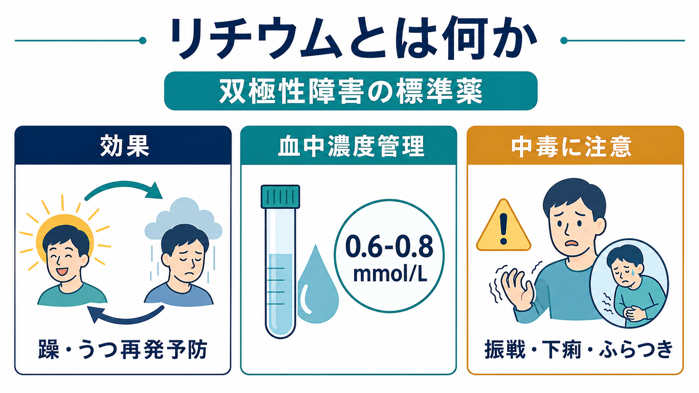
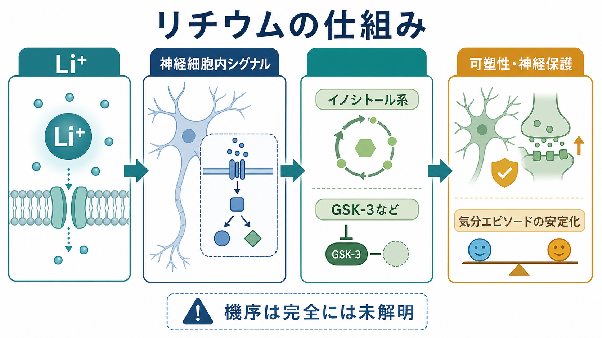
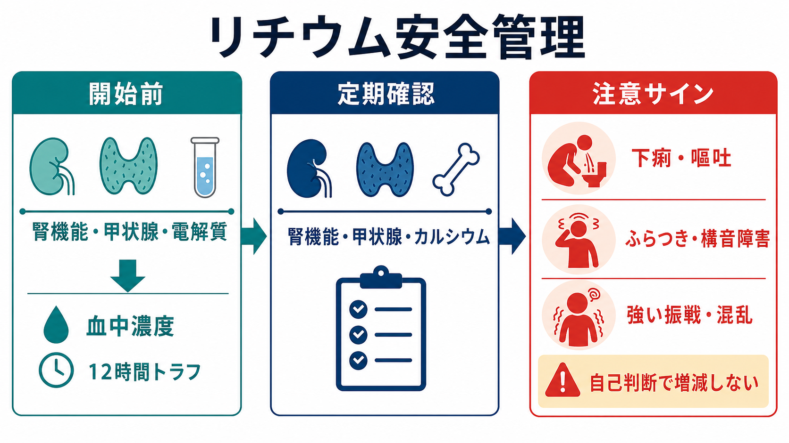

# リチウムとは何か

## 要点

- リチウムは、[[躁病エピソードとは何か]]を含む双極性障害の長期治療で、再発予防薬として中心的な位置にある気分安定薬である。NICEは双極性障害の長期薬物療法としてリチウムを第一選択に位置づけ、「最も有効な長期治療」と説明している [1]。
- 効果は強い一方で、治療域と中毒域が近い。血中濃度、腎機能、甲状腺機能、カルシウムなどを定期的に確認することが安全性の中核になる [1], [2]。
- 中毒では、下痢・嘔吐、強い振戦、ふらつき、構音障害、混乱、けいれん、意識障害などが問題になる。症状は血中濃度だけで完全には説明できないため、臨床症状を軽視しない [3], [4]。
- 本稿は教育・研究目的の概説であり、個別の開始・中止・用量調整を指示するものではない。

## この記事で答える問い

- リチウムはなぜ双極性障害の標準薬とされるのか。
- 血中濃度管理では何を見ているのか。
- 中毒症状はどのように早期に疑うのか。
- 腎機能・甲状腺・相互作用をなぜ気にするのか。

## まず結論

リチウムは「効くが、雑に扱えない」薬である。急性躁病、維持療法、再発予防、自殺リスク低下の文脈で一貫して重要な薬であり、CANMAT/ISBDガイドラインでも急性躁病、双極性うつ病、維持療法の複数フェーズで第一選択群に入る [5]。一方で、腎排泄に依存し、脱水、発熱、下痢、NSAIDs、ACE阻害薬、ARB、利尿薬などで濃度が変動しやすい [2], [6]。

したがってリチウムを理解する要点は、薬効そのものよりも「効果と安全域を同時に管理する薬」という点にある。[[薬物療法のリスクベネフィットをどう考えるか]]の典型例として、症状再発を防ぐ利益と、腎・甲状腺・中毒リスクを継続的に見張る負担をセットで考える必要がある。

## 背景

双極性障害では、躁、軽躁、うつ、混合状態が再発し、生活機能、対人関係、職業機能、自殺リスクに長期的な影響を及ぼす。リチウムは古い薬だが、維持療法における再発予防効果と抗自殺効果の可能性が重視され、現在も標準治療の一角を占める [1], [5], [7]。

BMJのメタ解析では、気分障害の長期治療において、リチウムはプラセボと比べて自殺死亡を減らす結果が示された。ただし、この効果は再発予防、衝動性や攻撃性への影響など複数の経路が関与しうるため、「リチウムを飲めば自殺が単純に防げる」と短絡してはいけない [7]。自殺リスクは[[自殺危機症候群とは何か]]、併存症、環境要因、支援体制と一緒に評価される。

## 基本概念

リチウムは元素としては一価陽イオン Li+ であり、臨床では炭酸リチウムなどの塩として用いられる。血中では代謝されず、主に腎臓から排泄されるため、腎機能や体液量の変化が血中濃度に直結しやすい [3], [6]。

重要なのは、リチウムの「治療域」が狭いことである。NICEは初回処方では血漿リチウム濃度 0.6-0.8 mmol/L を目標範囲とし、既往の再発や閾値下症状がある場合には 0.8-1.0 mmol/L を一定期間検討しうるとしている [1]。ISBD/IGSLIのタスクフォースも、成人の維持療法で標準的な血中濃度として 0.60-0.80 mmol/L を推奨し、忍容性や反応に応じて低め・高めの範囲を検討する整理を示している [8]。

| 観点 | 実務上の意味 |
|---|---|
| 効果 | 躁病・うつ病相の再発予防、急性躁病治療、抗自殺効果の可能性 |
| 安全性 | 中毒域が近く、腎機能・甲状腺・カルシウム・神経症状を確認する |
| 採血 | 通常は服薬後約12時間のトラフ値として解釈する [5] |
| 変動要因 | 脱水、下痢、発熱、NSAIDs、ACE阻害薬、ARB、利尿薬など [1], [6] |

## 仕組み

リチウムの作用機序は、単一の受容体遮断では説明しにくい。提案されている機序には、イノシトールリン脂質系への作用、GSK-3関連経路、セカンドメッセンジャー、神経伝達物質調整、可塑性・神経保護に関わる変化などがある [3], [4]。ただし、臨床効果をこれらの分子機序だけに還元することはできず、「機序は完全には未解明」と理解するのが正確である。

神経科学的には、リチウムは[[ニューロンとは何か]]、[[イオンチャネルとは何か]]、[[ナトリウムカリウムポンプは神経活動にどう関わるのか]]、[[シナプス可塑性とは何か]]にまたがる広い水準で考えられる。臨床的には、細胞内シグナルを変える薬という理解よりも、気分エピソードの再発確率を下げる薬として管理することが重要である。

## 血中濃度管理

リチウムでは、服薬量そのものより血中濃度と臨床状態の組み合わせが重要である。NICEは開始1週間後、用量変更1週間後、その後は安定するまで毎週測定し、安定後も初年度は3か月ごとに血中濃度を測ることを推奨している [1]。1年後は通常6か月ごとだが、高齢、相互作用薬、腎・甲状腺リスク、症状コントロール不良、アドヒアランス不良、直近濃度が 0.8 mmol/L 以上の場合などでは3か月ごとの測定が推奨される [1]。

血中濃度だけでなく、腎機能、電解質、甲状腺機能、カルシウム、体重やBMIも見ていく。長期リチウム治療では、腎濃縮力低下、腎性尿崩症、甲状腺機能低下、副甲状腺・カルシウム異常などが問題になることがある [1], [3], [6]。[[腎不全に伴う精神症状とは何か]]のように、腎機能低下そのものが精神症状や薬物動態の解釈を複雑にする点も押さえておきたい。

## 中毒症状

リチウム中毒は、急性過量、慢性的な蓄積、急性過量が慢性服用に重なる場合で表れ方が異なる。慢性中毒では脳内・組織内への分布が関わるため、血中濃度が下がっても神経症状が残る場合があり、血中濃度だけで重症度を判断しない [3], [4]。

代表的な注意サインは、消化器症状と神経症状である。下痢、嘔吐、強い振戦、ふらつき、運動失調、構音障害、眠気、混乱、せん妄、けいれん、意識障害は、リチウム中毒の文脈で重要である [3], [4]。[[せん妄とは何か]]や[[セロトニン症候群ではどのような症状が出るのか]]など、他の急性精神・神経症状との鑑別も必要になる。

DailyMedの添付文書は、リチウムの中毒濃度が治療域に近く、軽い神経症状から運動失調、構音障害、混乱、けいれん、昏睡、死亡まで幅があることを警告している [4]。NICEも、リチウム服用中の人には下痢・嘔吐や急性疾患時に医療者へ連絡すること、脱水を避けること、NSAIDsを自己判断で使用しないことを伝えるよう推奨している [1]。

## 臨床・研究との接続

リチウムは、急性躁病の鎮静薬というより、長期的な病相予防の薬として理解すると全体像をつかみやすい。CANMAT/ISBDは、急性躁病ではリチウムを第一選択単剤のひとつに、双極I型うつ病では第一選択のひとつに、維持療法では第一選択薬のひとつに位置づけている [5]。一方、混合特徴、物質使用、腎機能、高齢、妊娠可能性、薬物相互作用、過去の反応性などで適合性は変わる。

研究上の論点としては、なぜ一部の人がリチウムに非常によく反応するのか、血中濃度と長期毒性の最適バランスはどこか、腎機能低下をどの時点でどのように扱うか、抗自殺効果が再発予防以外の経路をどの程度含むかが残っている。これは単なる薬理学ではなく、疾患経過、家族歴、アドヒアランス、身体疾患、生活環境を含む臨床疫学の問題でもある。

## よくある誤解

### 誤解1: 古い薬なので時代遅れである

古い薬であることと、現在の標準治療から外れた薬であることは別である。リチウムは現在も複数の国際ガイドラインで双極性障害の重要な選択肢であり、維持療法では特に強い位置づけをもつ [1], [5]。

### 誤解2: 血中濃度が基準内なら中毒はない

中毒症状は血中濃度と一致しないことがある。特に慢性中毒や高齢者、腎機能低下、脱水、相互作用薬がある場合には、症状の評価が重要である [3], [4]。

### 誤解3: 水分を多く取れば安全である

脱水を避けることは重要だが、水分摂取だけで安全性が保証されるわけではない。発熱、下痢、嘔吐、NSAIDs、利尿薬、ACE阻害薬、ARBなどは濃度変動の要因になりうるため、自己判断ではなく処方者と共有する必要がある [1], [6]。

### 誤解4: リチウムは抗うつ薬と同じように考えればよい

リチウムは[[SSRIとは何か]]や[[SNRIとは何か]]のような抗うつ薬とは異なり、双極性障害の再発予防と気分安定を主な文脈として理解する。双極性障害では抗うつ薬単独使用が病相を悪化させる場合もあり、[[軽躁病エピソードとは何か]]や躁病の既往確認が重要になる。

## 関連ノート

- [[薬物療法のリスクベネフィットをどう考えるか]]
- [[躁病エピソードとは何か]]
- [[軽躁病エピソードとは何か]]
- [[難治性双極性障害とは何か]]
- [[自殺危機症候群とは何か]]
- [[腎不全に伴う精神症状とは何か]]
- [[せん妄とは何か]]
- [[セロトニン症候群ではどのような症状が出るのか]]
- [[抗精神病薬の錐体外路症状とは何か]]
- [[シナプス可塑性とは何か]]

## MOC更新候補

- `content/00_MOC/` 配下の精神医学、臨床実践、薬物療法関連MOCがある場合に追加候補。
- 並列ジョブとの競合を避けるため、本稿ではMOC本体は更新しない。

## 理解チェック

1. リチウムが「効果の強い薬」だけでなく「管理が必要な薬」と言われる理由は何か。
2. 初回処方時の血中濃度目標としてよく参照される範囲はどの程度か。
3. 下痢・嘔吐や発熱がリチウム中毒リスクと関係するのはなぜか。
4. リチウム中毒で注意すべき神経症状を3つ挙げられるか。
5. リチウムの機序が「完全には未解明」とされることは、臨床使用の意味をどう変えるか。

## 未解決問題

- 抗自殺効果が、再発予防、衝動性、攻撃性、神経生物学的効果のどの組み合わせで生じるのか。
- 長期腎機能リスクを最小化しながら再発予防効果を保つ最適な血中濃度戦略。
- 高齢者、腎機能低下例、妊娠可能性のある人、併用薬が多い人における個別化された安全管理。
- リチウム反応性を予測する臨床指標・バイオマーカーの実用化。

## 参考文献

[1] National Institute for Health and Care Excellence. *Bipolar disorder: assessment and management* (CG185). Published 2014, last updated 2025. https://www.nice.org.uk/guidance/cg185/chapter/1-Guidance

[2] NICE. *Quality statement 5: Maintaining plasma lithium levels*. Bipolar disorder in adults. https://www.nice.org.uk/guidance/qs95/chapter/quality-statement-5-maintaining-plasma-lithium-levels

[3] Chokhawala KP, Lee S, Saadabadi A. Lithium. In: *StatPearls*. Updated 2024. https://www.ncbi.nlm.nih.gov/books/NBK519062/

[4] DailyMed. *Lithium citrate solution / lithium prescribing information*. https://www.dailymed.nlm.nih.gov/dailymed/drugInfo.cfm?setid=a12d50fb-2c2f-4105-ad17-adbf90d439d4

[5] Yatham LN, Kennedy SH, Parikh SV, et al. Canadian Network for Mood and Anxiety Treatments and International Society for Bipolar Disorders 2018 guidelines for the management of patients with bipolar disorder. *Bipolar Disorders*. 2018;20(2):97-170. https://doi.org/10.1111/bdi.12609

[6] Malhi GS, Bell E, Outhred T, Berk M. Lithium therapy and its interactions. *Australian Prescriber*. 2020;43(3):91-93. https://doi.org/10.18773/austprescr.2020.024

[7] Cipriani A, Hawton K, Stockton S, Geddes JR. Lithium in the prevention of suicide in mood disorders: updated systematic review and meta-analysis. *BMJ*. 2013;346:f3646. https://doi.org/10.1136/bmj.f3646

[8] Nolen WA, Licht RW, Young AH, et al. What is the optimal serum level for lithium in the maintenance treatment of bipolar disorder? A systematic review and recommendations from the ISBD/IGSLI Task Force. *Bipolar Disorders*. 2019;21(5):394-409. https://doi.org/10.1111/bdi.12805
