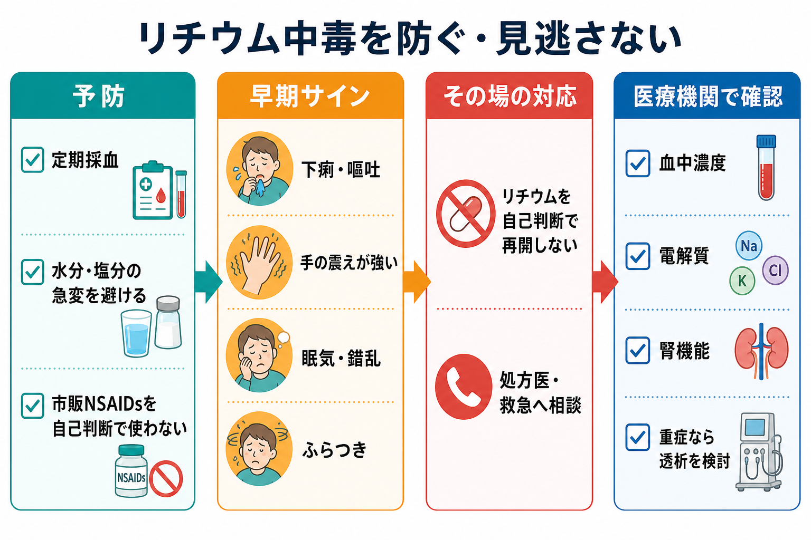
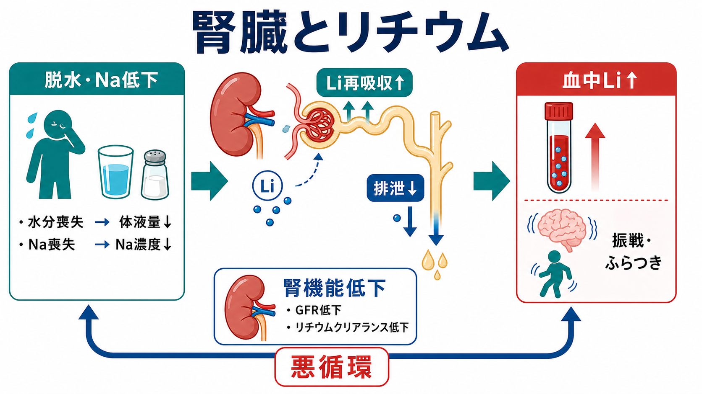

# リチウム中毒とは何か

## 要点

- リチウム中毒は、リチウムの血中濃度上昇、または血中濃度だけでは説明しきれない神経毒性によって、下痢・嘔吐、粗大振戦、ふらつき、運動失調、眠気、錯乱、意識障害、腎機能障害などが生じる状態である。
- リチウムは主に腎臓から排泄されるため、脱水、発熱、下痢、食事・水分・塩分摂取の急変、腎機能低下、NSAIDs・ACE阻害薬・ARB・利尿薬などの併用で中毒リスクが上がる[1][2][4]。
- 「血中濃度が治療域なら安全」とは限らない。慢性中毒や高齢者、腎機能低下例では、神経症状と経過を血中濃度と同じ重みで読む必要がある[2][3][5]。
- 疑わしい症状があれば、自己判断で再開・増量せず、服薬状況、血中リチウム濃度、電解質、腎機能を速やかに確認し、専門家に相談する[2][3]。
- 重症例、とくに腎機能障害、意識障害、けいれん、重篤な不整脈を伴う場合は、血液透析を含む体外除去が検討される[5][6]。

## この記事で答える問い

1. リチウム中毒では何が起こるのか。
2. なぜ下痢・脱水・腎機能障害で中毒が起こりやすいのか。
3. どの症状を早期サインとして見るべきか。
4. 予防と対応では、患者・家族・医療者が何を共有しておくべきか。

## まず結論

リチウム中毒は、単に「薬を飲みすぎた状態」ではない。治療量を守っていても、体液量、ナトリウム、腎機能、併用薬が変わると血中リチウム濃度が上がり、神経症状や腎障害を起こしうる。したがって予防の中心は、定期的な治療薬物モニタリング（TDM）だけでなく、「下痢・嘔吐・発熱・脱水・市販NSAIDs使用・腎機能悪化」という状況変化を早く拾うことである[1][2][3]。

この記事は教育・研究目的の整理であり、個別の診断、服薬中止、用量調整、透析適応を指示するものではない。実際の対応は、処方医、救急医、中毒診療、腎臓内科などの判断を要する。

## 背景

リチウムは、躁病・躁状態、双極性障害の維持療法などで重要な気分安定薬である。一方で、治療域と中毒域が近い薬でもある。日本の添付文書情報では、投与初期・増量時・維持期に血清リチウム濃度を測定し、脱水を起こしやすい状態、NSAIDsなどの併用、中毒の初期症状がある場合にも測定することが求められている[1]。

NICEの双極性障害ガイドラインも、開始後や用量変更後のリチウム濃度測定、安定後の定期測定、腎機能・電解質・カルシウム・甲状腺機能のモニタリングを推奨している。また、下痢・嘔吐・急性疾患がある場合は受診し、発汗・発熱・感染などでは水分摂取を保つよう助言する[2]。

## 基本概念

### リチウム中毒

リチウム中毒とは、リチウム曝露によって消化器症状、神経症状、循環器症状、腎機能障害などが出現する状態である。代表的な症状は、下痢、嘔吐、食欲低下、筋力低下、倦怠感、めまい、運動失調、協調運動障害、耳鳴、かすみ目、四肢や下顎の粗大振戦、構音障害、眠気などである[3]。

重症化すると、錯乱、せん妄、けいれん、昏睡、低血圧、生命に関わる不整脈などが問題になる[5][6]。ただし、症状と血中濃度の対応は単純ではない。急性過量服薬では血中濃度が高くても中枢神経への移行が遅れることがあり、慢性中毒では比較的低い濃度でも神経症状が目立つことがある[5]。

### TDM

TDMとは、血中薬物濃度を測定し、有効性と安全性の範囲を見ながら治療を調整する考え方である。リチウムでは、採血のタイミング、服薬時刻、腎機能、併用薬、症状を合わせて読む必要がある。数値だけを見て「高い・低い」と判断するのではなく、本人の状態変化と結びつけて評価する。

### 急性中毒と慢性中毒

急性中毒は、短時間に過量を摂取した場合に起こりやすい。慢性中毒は、通常量の服薬中に脱水、感染、腎機能低下、薬物相互作用などが重なって生じる。臨床上は、慢性中毒の方が神経症状が目立ち、血中濃度だけでは重症度を過小評価しやすい。

## 仕組み

リチウムはナトリウムと似た挙動をもち、腎臓でろ過・再吸収される。体液量が減ったり、ナトリウムが不足したりすると、腎臓はナトリウムを保持しようとする。このときリチウムも一緒に再吸収されやすくなり、血中濃度が上がる。

さらに、腎機能が低下するとリチウム排泄そのものが遅くなる。リチウム中毒で脱水、腎性尿崩症、腎機能障害が進むと、排泄低下と血中濃度上昇が互いに悪化させる悪循環になる[1][4][5]。

薬物相互作用も重要である。ACE阻害薬、ARB、利尿薬、NSAIDsは腎血流、糸球体濾過、尿細管再吸収に影響し、リチウム濃度を上げうる。Australian Prescriberの総説は、リチウム相互作用の中心は薬物代謝酵素ではなく腎排泄の変化である、と整理している[4]。

## 図解

### 早期発見の見る順序

| 観察すること | 典型的な変化 | 意味 |
|---|---|---|
| 消化器症状 | 下痢、嘔吐、食欲低下 | 脱水と濃度上昇の入口になりうる |
| 神経症状 | 粗大振戦、ふらつき、運動失調、構音障害 | リチウム神経毒性を疑う重要サイン |
| 意識・認知 | 眠気、錯乱、せん妄、意識障害 | 重症化、入院管理、透析検討につながる |
| 腎・電解質 | eGFR低下、クレアチニン上昇、Na異常 | 排泄低下と悪循環を示す |
| 併用薬 | NSAIDs、ACE阻害薬、ARB、利尿薬 | 濃度上昇の誘因として確認する |

### 対応の基本フロー

| 場面 | すること | 避けること |
|---|---|---|
| 予防 | 定期採血、服薬時刻の確認、腎機能・電解質・甲状腺・カルシウム確認 | 濃度測定だけで症状を見ない |
| 体調不良時 | 下痢・嘔吐・発熱・脱水を早めに相談する | 「数日様子を見る」だけで済ませる |
| 市販薬使用時 | NSAIDsなどを処方医・薬剤師に確認する | 自己判断で鎮痛薬を追加する |
| 中毒疑い | 血中濃度、U&E、腎機能を緊急確認し専門家に相談する[3] | 自己判断で再開・増量する |
| 重症例 | 救急管理、腎臓内科・中毒専門家相談、透析適応評価[5][6] | 血中濃度だけで帰宅判断する |

## 臨床・研究との接続

### 中毒はまれでも、見逃すと重い

スウェーデンの人口ベース後ろ向きコホートでは、リチウム曝露歴のある1340人中96人が1回以上 1.5 mmol/L以上のリチウム濃度を経験し、詳細確認できた77人91エピソードのうち34%が集中治療、13%が血液透析を受けた。死亡はなかったが、研究者は「有益な患者にリチウムを控える理由にはならないが、中毒スクリーニングの閾値は低く保つべき」と結論づけている[7]。

この知見は、[[薬物療法のリスクベネフィットをどう考えるか]]の実例でもある。リチウムの有効性を過小評価して不必要に避けることも、モニタリングなしに漫然と続けることも、どちらも臨床的には粗い判断になる。

### 患者教育は「水分を取る」だけでは足りない

患者・家族への[[心理教育とは何か]]としては、次の3点を事前に共有しておくと実用的である。

1. 下痢、嘔吐、発熱、脱水、食事・塩分摂取の急変があれば連絡する。
2. 市販NSAIDsを含む新しい薬を使う前に相談する。
3. 手の震えが急に強くなる、ふらつく、話しにくい、眠気や錯乱が出る場合は、血中濃度と腎機能の確認が必要なサインとして扱う。

## よくある誤解

### 誤解1：血中濃度が治療域なら中毒ではない

血中濃度は重要だが、症状、服薬時刻、急性か慢性か、腎機能、採血タイミングで解釈が変わる。NICEは治療域内でも神経毒性症状を毎回確認するよう求めている[2]。

### 誤解2：下痢は単なる副作用なので様子を見てよい

下痢・嘔吐は中毒症状であると同時に、脱水を介して血中濃度をさらに上げる誘因にもなる。とくに高齢者、腎機能低下、併用薬がある場合は早めの相談が必要である[2][3]。

### 誤解3：中毒なら必ず透析になる

すべての中毒で透析が必要なわけではない。透析は、腎機能障害、意識障害、けいれん、生命に関わる不整脈、高濃度が持続すると見込まれる状況などを総合して検討される[5][6]。

### 誤解4：リチウムは危険だから使うべきでない

リチウムは有効性の高い薬であり、中毒リスクはモニタリング、相互作用管理、体調不良時の相談ルールで下げられる。重要なのは「怖がって避ける」ことではなく、「中毒を起こす条件を具体的に管理する」ことである[4][7]。

## 関連ノート

- [[薬物療法のリスクベネフィットをどう考えるか]]
- [[心理教育とは何か]]
- 関連ノート候補: 双極性障害とは何か、気分安定薬とは何か、治療薬物モニタリングTDMとは何か、腎機能障害と精神科薬物療法、NSAIDsと精神科薬物療法
- MOC更新候補: [[MOC｜臨床実践・治療]]、MOC｜精神医学

## 理解チェック

1. リチウム中毒で「下痢・嘔吐」が危険サインになる理由を、症状と誘因の両面から説明できるか。
2. NSAIDs、ACE阻害薬、ARB、利尿薬がなぜリチウム濃度に影響するのかを、腎排泄から説明できるか。
3. 血中リチウム濃度だけでなく、意識状態、運動失調、腎機能を同時に確認する理由を説明できるか。
4. 患者・家族に伝えるべき「連絡すべき体調変化」を3つ挙げられるか。

## 未解決問題

- 慢性中毒における血中濃度、脳内移行、神経予後の関係は、急性中毒より複雑であり、個別化された予測指標が十分に確立していない。
- 透析適応はEXTRIPで整理されているが、根拠の多くは症例報告・観察研究であり、実臨床では施設資源、腎機能、症状の時間経過を含めた判断が必要である[6]。
- 長期リチウム治療で腎機能をどこまで許容し、いつ腎臓内科と共同判断するかは、気分障害再発リスクとのバランスを要する。

## 参考文献

[1] KEGG MEDICUS. 医療用医薬品：リーマス（炭酸リチウム）添付文書情報 2025年7月改訂 第5版. https://www.kegg.jp/medicus-bin/japic_med?japic_code=00048293

[2] National Institute for Health and Care Excellence. *Bipolar disorder: assessment and management*（CG185）. Published 2014, last updated 2025-09-02. https://www.nice.org.uk/guidance/cg185/chapter/Recommendations

[3] Specialist Pharmacy Service. *Lithium monitoring*. NHS SPS. https://www.sps.nhs.uk/monitorings/lithium-monitoring/

[4] Malhi GS, Bell E, Outhred T, Berk M. Lithium therapy and its interactions. *Australian Prescriber*. 2020;43:91-93. https://doi.org/10.18773/austprescr.2020.024

[5] Hedya SA, Avula A, Swoboda HD. Lithium Toxicity. *StatPearls*. Treasure Island: StatPearls Publishing. https://www.ncbi.nlm.nih.gov/books/NBK499992/

[6] Decker BS, Goldfarb DS, Dargan PI, et al.; EXTRIP Workgroup. Extracorporeal Treatment for Lithium Poisoning: Systematic Review and Recommendations from the EXTRIP Workgroup. *Clinical Journal of the American Society of Nephrology*. 2015;10(5):875-887. https://doi.org/10.2215/CJN.10021014

[7] Ott M, Stegmayr B, Salander Renberg E, Werneke U. Lithium intoxication: Incidence, clinical course and renal function: a population-based retrospective cohort study. *Journal of Psychopharmacology*. 2016;30(10):1008-1019. https://doi.org/10.1177/0269881116652577
