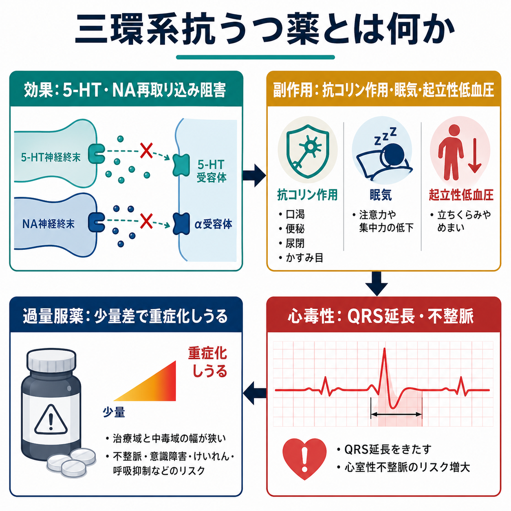
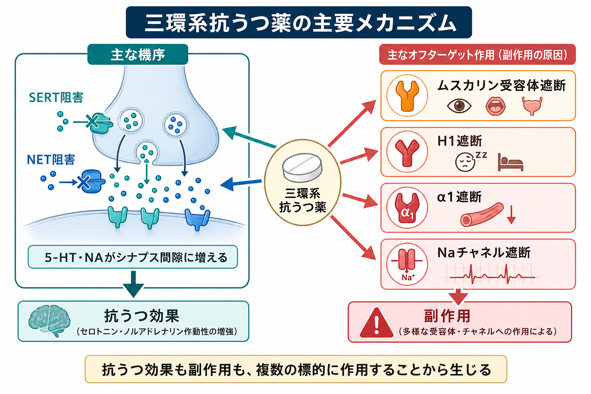
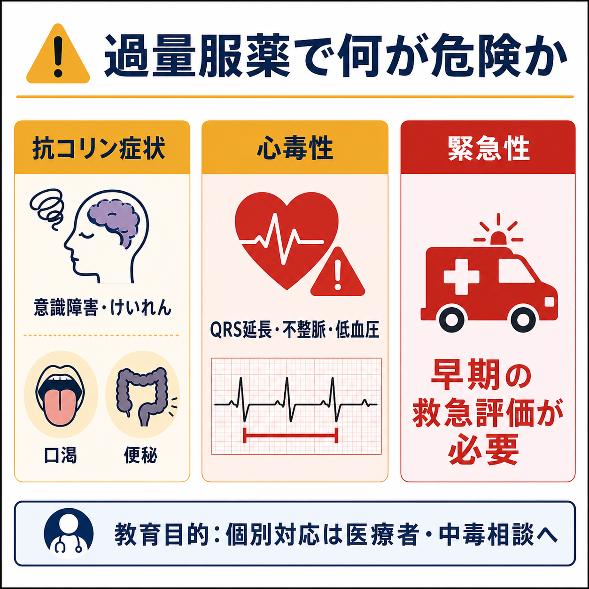

# 三環系抗うつ薬とは何か

## 要点

- 三環系抗うつ薬 tricyclic antidepressants: TCAs は、1950年代から使われてきた古典的な抗うつ薬で、アミトリプチリン、イミプラミン、ノルトリプチリン、クロミプラミンなどが含まれる[1]。
- 主な抗うつ作用は、シナプス前終末でセロトニンとノルアドレナリンの再取り込みを阻害し、シナプス間隙の 5-HT・NA 作動を高めることにある[1]。
- ただし TCA は、ムスカリン受容体、ヒスタミン H1 受容体、α1アドレナリン受容体、心筋 Na チャネルなどにも作用する。そのため、効果と同時に抗コリン作用、眠気、体重増加、起立性低血圧、QT/QRS 異常、不整脈などが問題になる[1][2]。
- 大うつ病への有効性は示されているが、現代の臨床では [[SSRIとは何か|SSRI]] や [[SNRIとは何か|SNRI]] より副作用・過量服薬時の危険性が大きいため、第一選択になりにくい[1][3]。
- 過量服薬では、意識障害、けいれん、低血圧、QRS 延長、心室性不整脈が急速に生じうる。自殺リスクが高い人への処方では、NICE も過量時毒性を考慮し、ロフェプラミンを除く TCA を routine に開始しないよう勧めている[3][4]。

## この記事で答える問い

1. 三環系抗うつ薬は、なぜ「効くが扱いにくい」薬とされるのか。
2. 抗うつ作用と抗コリン作用・眠気・起立性低血圧は、どの受容体作用から説明できるのか。
3. TCA の心毒性と過量服薬リスクは、なぜ臨床的に重要なのか。
4. 現代の薬物療法で TCA はどのように位置づけられるのか。

## まず結論

三環系抗うつ薬は、[[大うつ病性障害とは何か|大うつ病性障害]]の治療に有効性をもつ古典的抗うつ薬である。しかし、その特徴は「セロトニン・ノルアドレナリン再取り込み阻害」だけでは説明できない。TCA は複数の受容体・チャネルに広く作用するため、抗うつ効果と同時に抗コリン作用、鎮静、起立性低血圧、心毒性が出やすい[1][2]。

したがって TCA は、現代では「古いから無効な薬」ではなく、「有効だが安全域が狭く、患者背景とリスク評価を強く要求する薬」と理解するのがよい。とくに過量服薬では、少量差で重症化しうるため、[[薬物過量服薬とは何か|薬物過量服薬]]や自殺リスク評価と切り離して考えられない[3][4][5]。本記事は教育・研究目的の整理であり、個別の服薬判断や治療指示ではない。

## 背景

TCA は、イミプラミンの抗うつ作用が見いだされたことを契機に、20世紀後半のうつ病治療を支えた薬剤群である[1]。SSRI や SNRI が普及する前は、抗うつ薬治療の中心的な選択肢だった。現在でも、治療抵抗性うつ病、慢性疼痛、神経障害性疼痛、片頭痛予防、強迫症に対するクロミプラミンなど、疾患や薬剤によって臨床上の役割が残っている[1]。

一方で、TCA は受容体選択性が低い。これは、単に「古い薬」という歴史的事実ではなく、薬理学的な性質である。現代の抗うつ薬が比較的選択的に SERT や NET を標的にするのに対し、TCA は再取り込みトランスポーターに加えて、ムスカリン、H1、α1、心筋 Na チャネルなどにも作用する[1][2]。この広い作用プロファイルが、効き目と副作用の両方を生む。

## 基本概念

### 三環系という名前

「三環系」は、もともとの薬剤が3つの環状構造をもつことに由来する化学構造上の呼び名である[1]。ただし臨床で重要なのは、構造そのものより、薬理作用の組み合わせである。

代表的な TCA には、アミトリプチリン、イミプラミン、クロミプラミン、ドキセピン、ノルトリプチリン、デシプラミンなどがある。一般に、三級アミン系はセロトニン再取り込み阻害や鎮静・抗コリン作用が強く、二級アミン系はノルアドレナリン再取り込み阻害が目立ち、抗コリン作用が比較的少ないと説明されることが多い[1]。ただし個々の反応は年齢、身体疾患、併用薬、代謝酵素、過去の副作用歴で変わる。

### 抗うつ薬としての位置づけ

TCA の抗うつ効果は、現在でも否定されていない。一次医療のうつ病患者を対象に SSRI と TCA を比較した系統的レビューでは、短期の抑うつ症状改善に大きな差は明確でない一方、TCA では全中止や副作用による中止が多いと報告された[6]。つまり、TCA の問題は「効かないこと」よりも、「継続しにくさ」と「安全性」にある。

NICE の成人うつ病ガイドラインも、自殺リスクが高い人に抗うつ薬を処方する際には過量時毒性を考慮し、ロフェプラミンを除く TCA は過量服薬時のリスクが大きいため routine には開始しないよう勧めている[3]。この点は、[[うつ病とは何か|うつ病]]の治療を、症状改善だけでなく安全計画・処方量・支援体制と一体で考える必要を示している。

## 仕組み

### 1. SERT・NET 阻害

TCA の主な抗うつ作用は、セロトニントランスポーター SERT とノルアドレナリントランスポーター NET を阻害し、シナプス間隙の 5-HT と NA を増やすことにある[1]。この点では、[[セロトニンは気分だけに関わるのか|セロトニン]]や[[ノルアドレナリンは覚醒とストレスにどう関わるのか|ノルアドレナリン]]の神経調節作用と接続して理解できる。

ただし、「5-HT と NA が増えるからすぐ気分が上がる」と単純化してはいけない。抗うつ効果には、受容体感受性の変化、神経可塑性、睡眠・不安・疼痛・認知の変化、心理社会的介入との相互作用が関わる。TCA はモノアミン仮説を理解する入口にはなるが、うつ病全体を単一の神経伝達物質不足で説明するものではない。

### 2. ムスカリン受容体遮断と抗コリン作用

TCA はムスカリン性アセチルコリン受容体を遮断するため、口渇、便秘、かすみ目、尿閉、頻脈、認知のぼんやり感、せん妄様症状を起こしうる[1][2]。これは[[アセチルコリンは注意や記憶にどう関わるのか|アセチルコリン]]系が、記憶、注意、自律神経、消化管・膀胱機能に広く関わることと対応している。

高齢者、認知機能低下、前立腺肥大、緑内障、便秘傾向、せん妄リスクがある人では、抗コリン作用は単なる不快な副作用ではなく、転倒、混乱、尿閉、生活機能低下につながりうる。

### 3. H1・α1遮断

H1 受容体遮断は眠気、体重増加、食欲増加に関係する[1][2]。睡眠障害がある人では一見有利に見えることもあるが、日中の眠気、認知鈍麻、転倒リスクとして問題になることもある。

α1アドレナリン受容体遮断は、血管収縮を弱め、起立性低血圧やめまいを起こしうる[1][2]。立ち上がったときのふらつきは、患者本人には「体力が落ちた」「貧血かもしれない」と感じられることがあるが、薬理作用として理解できる場合がある。

### 4. Na チャネル遮断と心毒性

TCA のもっとも重要な安全性問題の一つは、心筋の Na チャネル遮断である。これは[[イオンチャネルとは何か|イオンチャネル]]を介した電気的伝導を遅らせ、PR・QRS・QT の延長、伝導障害、心室性不整脈、低血圧を引き起こしうる[4][5][7]。

過量服薬では、この作用が急速に前面化する。DailyMed のアミトリプチリン添付文書は、TCA 過量服薬の重大症状として心不整脈、重度低血圧、けいれん、中枢神経抑制を挙げ、QRS 軸や幅の変化が臨床的に重要な毒性指標になると説明している[4]。心毒性のレビューでも、TCA 中毒の主要機序は心筋 Na チャネル遮断であり、ECG 異常、不整脈、低血圧が致死性に関わると整理されている[7]。

## 図解

上の2枚の図は、TCA を「効果」と「副作用」に分けて見るための地図である。重要なのは、抗うつ作用と副作用が別々の薬から生じるのではなく、同じ薬剤が複数の標的に作用する結果として同時に現れる点である。

TCA の説明でよくある混乱は、「抗うつ薬なのに、なぜ便秘や不整脈が問題になるのか」という疑問である。答えは、TCA が SERT/NET だけでなく、自律神経、ヒスタミン系、血管調節、心筋伝導にも作用するからである。薬理作用の広さは、臨床的には「効き目の幅」と「リスクの幅」の両方を意味する。

## 臨床・研究との接続

### 治療抵抗性うつ病と古典的抗うつ薬

TCA は、SSRI/SNRI が普及した後も、重症例や治療抵抗性うつ病で検討されることがある[1]。ただし、選択肢に入ることと、誰にでも安全に使えることは同じではない。心疾患、けいれんリスク、認知機能、排尿障害、緑内障、併用薬、自殺リスク、服薬管理能力を含めた評価が必要になる。

### 疼痛・睡眠・身体症状との接点

アミトリプチリンなどは、神経障害性疼痛や慢性疼痛、片頭痛予防などで用いられることがある[1]。この場合、抗うつ薬という名称だけでなく、下降性疼痛抑制系、睡眠、情動、身体感覚の調整に関わる薬として理解する必要がある。ただし、疼痛目的でも抗コリン作用や心毒性のリスクは消えない。

### 過量服薬リスクと処方設計

TCA の過量服薬では、症状が急速に進むことがあり、心電図変化、意識障害、低血圧、けいれんが重要になる[4][5]。AAPCC の院外管理ガイドラインや毒性レビューも、TCA 中毒を救急評価・中毒相談と結びつけて扱う必要がある問題として位置づけている[5][8]。

そのため、TCA は単に「薬効があるか」だけでなく、「過量服薬が起きたときに何が起こるか」「処方量をどう管理するか」「家族・支援者・医療者とどのような安全計画を持つか」という臨床実践上の問いを伴う。これは個別の服薬指示ではなく、薬理学とリスク管理をつなぐ教育的観点である。

## よくある誤解

### 「古い薬だから効かない」

誤りである。TCA には抗うつ効果がある。ただし、SSRI と比べた短期有効性に大きな差が明確でない一方、副作用による中止が多いという問題がある[6]。現代で使用頻度が下がった主因は、有効性よりも忍容性と安全性である。

### 「副作用は慣れれば問題ない」

単純化しすぎである。眠気や口渇のように経過で軽くなるものもあるが、尿閉、便秘、せん妄、転倒、心電図異常は、患者背景によって重大な問題になる。とくに高齢者や心疾患のある人では、副作用は生活機能や安全性に直結する[1][2]。

### 「過量服薬リスクは大量に飲んだときだけ問題になる」

危険な誤解である。TCA は治療域と中毒域の幅が狭く、過量時には心毒性と中枢神経毒性が急速に出うる[4][5]。NICE が自殺リスクの高い人への処方で過量時毒性を明示的に考慮するよう求めるのは、このためである[3]。

### 「抗うつ薬の作用はセロトニンだけで説明できる」

不十分である。TCA は 5-HT と NA の再取り込み阻害を中心にしつつ、アセチルコリン、ヒスタミン、アドレナリン受容体、心筋 Na チャネルにも作用する[1][2]。効果も副作用も、この多標的性から理解する必要がある。

## 関連ノート

- [[うつ病とは何か]]
- [[大うつ病性障害とは何か]]
- [[SNRIとは何か]]
- [[NaSSAとは何か]]
- [[セロトニンは気分だけに関わるのか]]
- [[ノルアドレナリンは覚醒とストレスにどう関わるのか]]
- [[アセチルコリンは注意や記憶にどう関わるのか]]
- [[イオンチャネルとは何か]]
- [[薬物過量服薬とは何か]]

## 理解チェック

1. TCA の抗うつ作用を SERT・NET の言葉で説明するとどうなるか。
2. 抗コリン作用として、口渇・便秘・尿閉・混乱が出る理由は何か。
3. H1 遮断と α1 遮断は、それぞれどのような副作用につながるか。
4. TCA 過量服薬で QRS 延長や不整脈が問題になる薬理学的理由は何か。
5. TCA が現代のうつ病治療で第一選択になりにくい理由を、有効性・忍容性・安全性に分けて説明せよ。

## MOC更新候補

- `content/00_MOC/MOC｜臨床実践・治療.md`
- `content/00_MOC/MOC｜精神医学.md`

## 未解決問題

- どの患者特性が、TCA の利益が副作用・過量服薬リスクを上回る条件を予測するのか。
- 治療抵抗性うつ病において、TCA、SNRI、NaSSA、増強療法、ECT、rTMS、ケタミン系治療をどの順序で比較するのが最も妥当か。
- TCA の疼痛・睡眠への効果を、抗うつ効果とは独立にどこまで評価できるか。
- 過量服薬リスクがある人に対して、処方量、服薬管理、安全計画、家族支援をどのように組み合わせると事故や自傷を減らせるか。

## 参考文献

[1] Moraczewski J, Awosika AO, Aedma KK. Tricyclic Antidepressants. *StatPearls*. Updated 2023 Aug 17. https://www.ncbi.nlm.nih.gov/books/NBK557791/

[2] DailyMed. Amitriptyline Hydrochloride tablet, film coated: adverse reactions and overdose information. U.S. National Library of Medicine. https://www.dailymed.nlm.nih.gov/dailymed/drugInfo.cfm?setid=43450e62-d8c1-b39e-e063-6294a90a42ee

[3] National Institute for Health and Care Excellence. *Depression in adults: treatment and management* (NICE guideline NG222). Recommendation 1.4.23. Published 2022; reviewed 2026. https://www.nice.org.uk/guidance/ng222/chapter/Recommendations

[4] Khalid MM, Waseem M. Tricyclic Antidepressant Toxicity. *StatPearls*. Updated 2023 Jul 17. https://www.ncbi.nlm.nih.gov/books/NBK430931/

[5] Woolf AD, Erdman AR, Nelson LS, et al. Tricyclic antidepressant poisoning: an evidence-based consensus guideline for out-of-hospital management. *Clinical Toxicology*. 2007;45(3):203-233. https://doi.org/10.1080/15563650701226192

[6] MacGillivray S, Arroll B, Hatcher S, et al. Efficacy and tolerability of selective serotonin reuptake inhibitors compared with tricyclic antidepressants in depression treated in primary care: systematic review and meta-analysis. *BMJ*. 2003;326(7397):1014. https://doi.org/10.1136/bmj.326.7397.1014

[7] Thanacoody HKR, Thomas SHL. Tricyclic antidepressant poisoning: cardiovascular toxicity. *Toxicological Reviews*. 2005;24(3):205-214. https://doi.org/10.2165/00139709-200524030-00013

[8] Bradberry SM, Thanacoody HKR, Watt BE, Thomas SHL, Vale JA. Management of the cardiovascular complications of tricyclic antidepressant poisoning: role of sodium bicarbonate. *Toxicological Reviews*. 2005;24(3):195-204. https://doi.org/10.2165/00139709-200524030-00012
