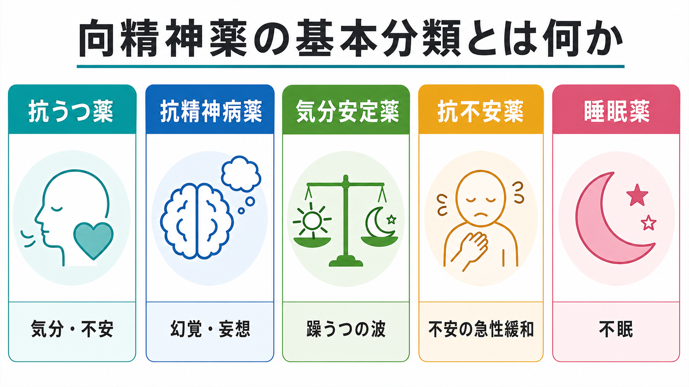
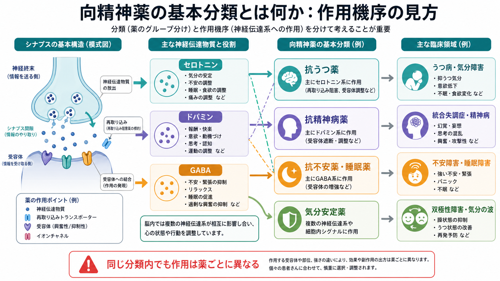
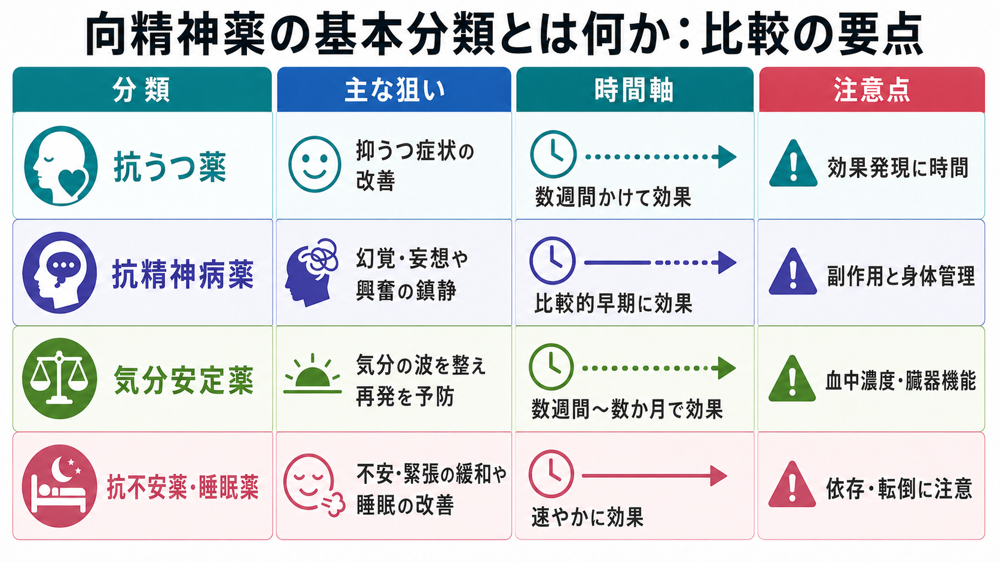

# 向精神薬の基本分類とは何か

## 要点

- 向精神薬は「脳と行動・気分・睡眠・思考に影響する薬」を広く指す言葉であり、精神科では主に抗うつ薬、抗精神病薬、気分安定薬、抗不安薬、睡眠薬などに分けて理解する。
- 分類名は「何に使うことが多いか」と「どの神経伝達系に作用しやすいか」の両方から作られている。ただし、同じ分類内でも作用機序、効果発現の時間、副作用、身体管理の必要性は薬ごとに異なる。
- 実際の薬物療法では、診断名だけでなく、標的症状、重症度、併存症、身体疾患、妊娠可能性、高齢、併用薬、依存・離脱リスク、患者の価値観を合わせて考える。
- この記事は教育・研究目的の概説であり、個別の診断や処方変更を指示するものではない。

## この記事で答える問い

この記事では、次の問いに答える。

1. 向精神薬という言葉は、どのような薬を含むのか。
2. 抗うつ薬、抗精神病薬、気分安定薬、抗不安薬、睡眠薬は何が違うのか。
3. 分類名と作用機序はどの程度対応するのか。
4. 臨床で分類を読むとき、どのような注意が必要か。

## まず結論

向精神薬の分類は、薬を「症状・疾患に対する実用的な使い道」から見通すための地図である。たとえば、抗うつ薬はうつ病や不安症の治療で中心的に使われ、抗精神病薬は統合失調症や躁状態、精神病症状の治療で重要になる。気分安定薬は躁うつの波や再発予防を考えるときに使われ、抗不安薬・睡眠薬は不安や不眠の短期的な緩和と安全性のバランスが問題になりやすい[1][3][5][7]。

ただし、分類名は薬理学の完全な分類ではない。たとえば抗精神病薬はドパミンD2受容体への作用を軸に理解されることが多いが、セロトニン、ヒスタミン、ムスカリン、アドレナリン系への作用も副作用や臨床的特徴に影響する[4]。抗うつ薬もSSRI、SNRI、三環系、MAOI、その他の薬に分かれ、作用点と副作用は一様ではない[2]。

## 背景

精神科薬物療法は、症状を単に「消す」ためだけでなく、再発予防、生活機能の回復、苦痛の軽減、安全の確保、心理社会的治療に参加しやすくすることを目的に行われる。NICEのうつ病ガイドラインでは、治療選択を症状の重症度、過去の治療反応、患者の希望、副作用、離脱症状の可能性などと合わせて検討することが推奨されている[1]。この発想は、薬の分類を暗記するよりも、分類を「臨床判断の入口」として読むことの重要性を示している。

また、向精神薬は[[薬物療法は神経回路にどう作用するのか]]という問いと密接に関係する。薬は神経伝達物質、受容体、トランスポーター、イオンチャネル、細胞内シグナルに作用し、その変化が情動、覚醒、報酬、認知、睡眠、運動などのネットワーク状態に影響する。したがって、薬の分類を理解するには、疾患名だけでなく、標的症状と神経システムの両方を見る必要がある。

## 基本概念

### 向精神薬

向精神薬とは、中枢神経系に作用し、気分、思考、知覚、不安、睡眠、行動、衝動性などに影響する薬を広く指す。精神科臨床でよく使う大分類は、抗うつ薬、抗精神病薬、気分安定薬、抗不安薬、睡眠薬、精神刺激薬、認知症治療薬、抗てんかん薬として用いられる薬などである。この記事では、依頼範囲に合わせて、主要5分類を中心に扱う。

### 抗うつ薬

抗うつ薬は、うつ病だけでなく、不安症、強迫症、PTSD、慢性疼痛などで使われることがある。代表的にはSSRI、SNRI、三環系抗うつ薬、MAOI、NaSSA、SARIなどがあり、セロトニンやノルアドレナリンの再取り込み阻害、受容体調整などを通じて作用する[2]。臨床的には、効果が数日で明確に出るというより、数週間単位で評価されることが多く、開始時の副作用や中止時の離脱症状にも注意する[1]。

関連する基礎ノートとして、[[セロトニン仮説はうつ病をどこまで説明できるのか]]、[[報酬系の異常はうつ病をどう説明するのか]]、[[神経可塑性低下はうつ病をどう説明するのか]]がある。

### 抗精神病薬

抗精神病薬は、統合失調症などの精神病症状、躁状態、興奮、妄想、幻覚などに対して使われる。典型抗精神病薬と非定型抗精神病薬に分けられることが多く、共通の中心にはドパミンD2受容体遮断がある。ただし、非定型抗精神病薬ではセロトニン5-HT2A受容体、ヒスタミンH1受容体、ムスカリン受容体などへの作用も重要で、副作用プロファイルを左右する[4]。NICEの統合失調症ガイドラインでは、薬物療法を心理社会的介入や身体健康管理と組み合わせて考えることが強調されている[3]。

関連ノートとして、[[ドパミン仮説は統合失調症をどこまで説明できるのか]]、[[グルタミン酸仮説は統合失調症をどう説明するのか]]、[[GABA機能低下は統合失調症にどう関わるのか]]、[[認知機能障害は統合失調症でなぜ重要なのか]]がある。

### 気分安定薬

気分安定薬は、双極性障害における躁状態、うつ状態、再発予防を見通すための分類である。代表例にはリチウム、バルプロ酸、カルバマゼピン、ラモトリギンなどがある。作用機序は単一ではなく、イオンチャネル、細胞内シグナル、グルタミン酸・GABA系、神経可塑性など複数の経路が関与すると考えられている[6]。NICEの双極性障害ガイドラインでは、リチウム、抗精神病薬、バルプロ酸、ラモトリギンなどが病相や治療目的に応じて位置づけられている[5]。

気分安定薬では、効果だけでなく血中濃度、腎機能、甲状腺機能、肝機能、妊娠可能性、薬物相互作用などの身体管理が重要になる。これは「気分を安定させる薬」という名前だけでは見えにくい点である。

### 抗不安薬

抗不安薬は、不安、緊張、焦燥、パニック様症状などの軽減を目的に使われる薬の総称である。狭義にはベンゾジアゼピン系薬を指すことが多いが、臨床ではSSRI、SNRI、プレガバリン、抗ヒスタミン薬なども不安症状に対して使われる場合がある。NICEの全般不安症・パニック症ガイドラインでは、薬物療法だけでなく心理療法や段階的ケアの中で治療選択を考える枠組みが示されている[7]。

ベンゾジアゼピン系薬は、GABA_A受容体を介した抑制性神経伝達を増強し、不安や筋緊張、睡眠に影響する。速やかな効果が期待される一方で、眠気、認知・運動機能低下、転倒、耐性、依存、離脱の問題があるため、漫然とした長期使用には慎重さが必要である[7][8]。

### 睡眠薬

睡眠薬は、不眠に対して用いられる薬の総称である。ベンゾジアゼピン系、Z薬、メラトニン受容体作動薬、オレキシン受容体拮抗薬など、薬理学的には複数のタイプがある。抗不安薬と重なる薬もあり、「眠らせる薬」と単純にまとめると、作用時間、翌朝の眠気、転倒、せん妄、依存、睡眠構造への影響を見落としやすい。

睡眠薬を考えるときは、[[睡眠障害は脳機能にどのような影響を与えるのか]]、[[レム睡眠行動障害とは何か]]、[[せん妄を起こしやすい疾患には何があるのか]]との接続も重要である。

## 仕組み

向精神薬の分類は、神経伝達物質の名前と一対一対応するわけではない。むしろ、複数の神経伝達系への作用が、治療効果と副作用を同時に作る。

### セロトニン系

セロトニン系は、気分、不安、睡眠、食欲、痛み、衝動性などに関わる。SSRIやSNRIは再取り込み阻害を通じてセロトニン、またはノルアドレナリン系を調整する[2]。ただし、うつ病を単純に「セロトニン不足」と説明するのは過度に単純化されている。症状改善には、神経回路、ストレス応答、炎症、神経可塑性、認知・行動の変化も関わる。

### ドパミン系

ドパミン系は、報酬、動機づけ、運動、顕著性、思考のまとまりに関わる。抗精神病薬の多くはD2受容体遮断を通じて精神病症状の軽減に関与するが、同じ作用は錐体外路症状、高プロラクチン血症、アカシジアなどの副作用にも関係する[4]。[[アカシジアとは何か]]は、抗精神病薬の副作用を理解する上で特に重要な関連ノートである。

### GABA系と睡眠・不安

GABAは脳内の主要な抑制性神経伝達物質である。ベンゾジアゼピン系薬はGABA_A受容体複合体に作用し、不安や緊張、睡眠に影響する[8]。しかし、症状が軽くなることと、長期的に機能回復することは同じではない。短期的な苦痛軽減が必要な場面と、依存・転倒・認知機能低下を避けるべき場面を分けて考える必要がある。

### イオンチャネルと細胞内シグナル

気分安定薬は、抗うつ薬や抗精神病薬のように単一の受容体名で説明しにくい。リチウム、バルプロ酸、カルバマゼピン、ラモトリギンは、それぞれイオンチャネル、細胞内シグナル、神経保護、グルタミン酸放出、GABA系などに関わるとされるが、臨床効果の全体を一つの機序で説明することは難しい[6]。このため、気分安定薬は「薬理学的に均質な群」ではなく、「双極性障害の病相・再発予防に使われる実用分類」として理解するとよい。

## 図解

次の図は、分類を臨床的に読むときの実用ポイントをまとめたものである。時間軸と注意点は、薬を選ぶ際の中心的な視点になる。

| 分類 | 主な使用場面 | 作用機序の代表例 | 特に注意する点 |
|---|---|---|---|
| 抗うつ薬 | うつ病、不安症、強迫症、PTSDなど | セロトニン・ノルアドレナリン再取り込み阻害、受容体調整 | 効果発現に時間、初期副作用、賦活、離脱症状 |
| 抗精神病薬 | 統合失調症、精神病症状、躁状態、興奮など | D2受容体遮断、5-HT2A受容体調整など | 錐体外路症状、代謝異常、鎮静、高プロラクチン血症、QT延長 |
| 気分安定薬 | 双極性障害の躁・うつ・再発予防 | イオンチャネル、細胞内シグナル、GABA・グルタミン酸系 | 血中濃度、腎・肝・甲状腺機能、妊娠可能性、相互作用 |
| 抗不安薬 | 強い不安、緊張、パニック様症状など | GABA_A受容体作用、セロトニン系調整など | 眠気、依存、離脱、転倒、認知機能低下 |
| 睡眠薬 | 不眠、睡眠維持困難など | GABA_A、メラトニン、オレキシン系など | 翌朝の眠気、転倒、せん妄、依存、睡眠衛生との併用 |

## 臨床・研究との接続

### 分類は「診断名」ではなく「標的症状」と組み合わせる

薬の分類は、診断名だけで機械的に決まるものではない。うつ病でも不眠、焦燥、不安、食欲低下、疼痛、希死念慮、双極性の可能性によって考えるべきことは変わる。統合失調症でも、陽性症状、陰性症状、認知機能障害、興奮、睡眠、身体合併症によって治療目標が異なる[3]。

### 治療効果と副作用は同じ薬理作用から生じうる

D2受容体遮断は精神病症状の改善に関わる一方で、運動系や内分泌系への副作用にも関係する[4]。GABA系への作用は不安や不眠を短期的に軽減しうるが、眠気、転倒、依存のリスクも生む[8]。薬理作用を「良い効果」と「悪い副作用」に分けて覚えるより、同じ作用が文脈によって利益にもリスクにもなると理解する方が実践的である。

### 身体管理は精神科薬物療法の一部である

抗精神病薬では体重、血糖、脂質、錐体外路症状、心電図などが問題になることがある。リチウムでは血中濃度、腎機能、甲状腺機能が重要である。バルプロ酸やカルバマゼピンでは肝機能、血液学的副作用、薬物相互作用、妊娠可能性への配慮が必要になる[5][6]。向精神薬の分類を理解することは、身体モニタリングの入口でもある。

### 研究では「薬効分類」と「作用標的」を分ける

研究で向精神薬を扱うときは、薬効分類だけでなく、受容体結合、トランスポーター作用、半減期、活性代謝物、用量、服薬期間、併用薬、対象者の診断・症状・年齢を分けて記述する必要がある。たとえば「抗うつ薬使用者」と一括りにすると、SSRIと三環系抗うつ薬の違い、投与量、治療抵抗性、併存不安の影響が混ざる。これは観察研究や脳画像研究で特に重要である。

## よくある誤解

### 誤解1：抗うつ薬は「気分を上げる薬」である

抗うつ薬は単純な気分高揚薬ではない。治療対象は抑うつ気分だけでなく、不安、睡眠、食欲、意欲、疼痛、強迫症状などに及ぶ。効果は数週間単位で評価されることが多く、即時に気分を変える薬として理解すると、期待と実際がずれやすい[1][2]。

### 誤解2：抗精神病薬は統合失調症だけの薬である

抗精神病薬は統合失調症で中心的に使われるが、躁状態、精神病症状を伴ううつ病、せん妄時の興奮など、状況に応じて検討されることがある。ただし適応、利益、リスクは文脈依存であり、身体副作用や長期管理を含めて考える必要がある[3][4]。

### 誤解3：気分安定薬は「気分を平坦にする薬」である

気分安定薬の目的は、感情を消すことではなく、躁状態、うつ状態、再発、衝動性、睡眠リズムの乱れなどを長期的に管理し、生活機能を保つことである。双極性障害では、病相ごとの治療と維持療法を分けて考える必要がある[5]。

### 誤解4：抗不安薬や睡眠薬は安全な一時しのぎである

短期的には苦痛を軽減しうるが、眠気、転倒、認知機能低下、耐性、依存、離脱のリスクがある。特に高齢者、せん妄リスク、物質使用症、呼吸器疾患、複数薬剤併用がある場合は慎重に評価する[7][8]。

### 誤解5：分類を覚えれば処方判断ができる

分類は出発点であり、処方判断そのものではない。実際には診断、標的症状、身体状態、薬物相互作用、過去の反応、副作用、患者の希望、心理社会的支援、フォローアップ体制を合わせて考える。薬の分類表は地図であって、個別の道順ではない。

## 関連ノート

既存ノートとして、次のノートと接続しやすい。

- [[薬物療法は神経回路にどう作用するのか]]
- [[セロトニン仮説はうつ病をどこまで説明できるのか]]
- [[ドパミン仮説は統合失調症をどこまで説明できるのか]]
- [[GABA機能低下は統合失調症にどう関わるのか]]
- [[うつ病とは何か]]
- [[不安症群とは何か]]
- [[全般不安症とは何か]]
- [[双極性障害は情動ネットワークの異常として説明できるのか]]
- [[睡眠障害は脳機能にどのような影響を与えるのか]]
- [[アカシジアとは何か]]

今後の作成候補：

- 抗うつ薬の分類とは何か
- 抗精神病薬の副作用をどう整理するか
- 気分安定薬の身体モニタリングとは何か
- ベンゾジアゼピン系薬の依存と離脱とは何か
- 睡眠薬の分類とは何か

MOC更新候補：

- `content/00_MOC/MOC｜臨床実践・治療.md`
- `content/00_MOC/MOC｜精神医学.md`

## 理解チェック

1. 向精神薬の分類は、薬理学的に完全に均質な分類ではなく、臨床での主な使い道を含む実用分類である。正しいか。
2. 抗うつ薬の効果は、通常「服用直後に明確に気分が上がる」と理解してよいか。
3. 抗精神病薬の治療効果と副作用の両方に、ドパミンD2受容体への作用が関わることがある。正しいか。
4. 気分安定薬では、血中濃度や腎・肝・甲状腺機能などの身体管理が重要になる場合がある。正しいか。
5. 抗不安薬・睡眠薬は短期的な症状緩和に役立つことがある一方、依存、転倒、認知機能低下などのリスクも評価する必要がある。正しいか。

## 参考文献

[1] National Institute for Health and Care Excellence. (2022, updated). *Depression in adults: treatment and management (NICE guideline NG222).* https://www.nice.org.uk/guidance/ng222

[2] Moraczewski, J., & Aedma, K. K. (2024). *Antidepressants.* StatPearls. https://www.ncbi.nlm.nih.gov/books/NBK538182/

[3] National Institute for Health and Care Excellence. (2014, updated). *Psychosis and schizophrenia in adults: prevention and management (NICE guideline CG178).* https://www.nice.org.uk/guidance/cg178

[4] Jibson, M. D., & Marder, S. R. (2023). *Antipsychotic medications.* StatPearls. https://www.ncbi.nlm.nih.gov/books/NBK519503/

[5] National Institute for Health and Care Excellence. (2014, updated). *Bipolar disorder: assessment and management (NICE guideline CG185).* https://www.nice.org.uk/guidance/cg185

[6] Sekhon, S., & Gupta, V. (2024). *Mood Stabilizers.* StatPearls. https://www.ncbi.nlm.nih.gov/books/NBK556141/

[7] National Institute for Health and Care Excellence. (2011, updated). *Generalised anxiety disorder and panic disorder in adults: management (NICE guideline CG113).* https://www.nice.org.uk/guidance/cg113

[8] Bounds, C. G., Nelson, V. L., & Meves, T. (2024). *Benzodiazepines.* StatPearls. https://www.ncbi.nlm.nih.gov/books/NBK470159/

## 未解決問題

- 向精神薬の分類を、症状ネットワーク、神経回路、受容体プロファイル、生活機能のどの水準で教えると最も理解しやすいか。
- 実臨床で「薬効分類」と「個別薬剤の副作用プロファイル」をどのように統合して説明すべきか。
- 薬物療法の利益とリスクを、患者本人の価値観や生活目標と結びつけて可視化する方法は何か。
