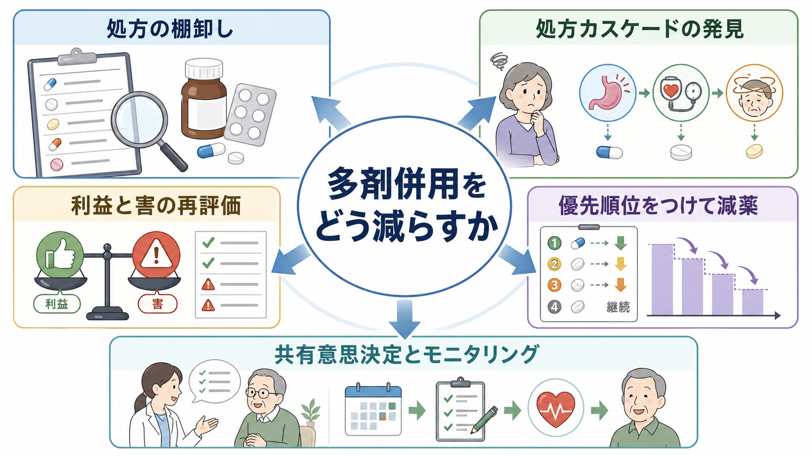
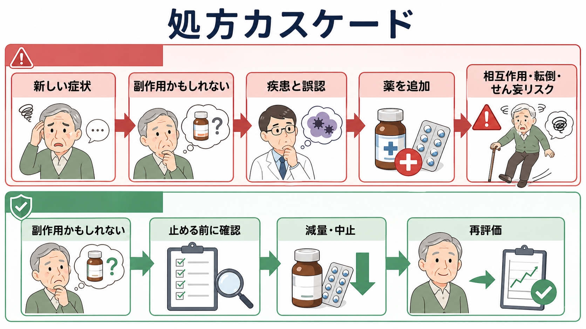
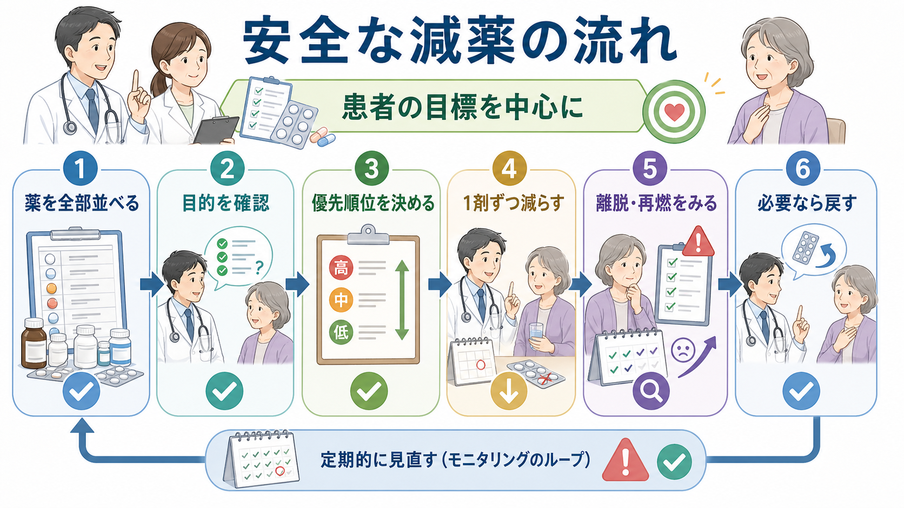

# 多剤併用をどう減らすか

## 要点

- 多剤併用の問題は、薬の数そのものよりも「本人にとって利益より害や負担が大きい薬が残っていること」である。高齢者では薬剤数が増えるほど薬物有害事象、相互作用、服薬負担、転倒、せん妄、入院リスクが高まりやすい[1][2]。
- 減薬は「薬を減らせばよい」という単純な作業ではない。すべての薬を棚卸しし、適応、現在の利益、害、離脱・再燃リスク、患者の目標を比較して、優先順位をつけて進める臨床プロセスである[3]。
- 処方カスケードでは、薬の副作用が新しい疾患として解釈され、さらに薬が追加される。新しい症状が出たときは「病気が増えた」だけでなく「薬で起きていないか」を最初から疑う[4]。
- Beers Criteria や STOPP/START は、見落としやすい不適切処方や処方漏れを拾う道具であり、本人との共有意思決定を置き換えるものではない[5][6]。
- とくにベンゾジアゼピン受容体作動薬、PPI、抗コリン薬、重複鎮痛薬、漫然と続く抗精神病薬などは、目的と期限を再確認しやすい。一方で、急な中止で離脱、反跳、疾患再燃が起こる薬は、個別に計画して段階的に減らす[7][8]。
- 本稿は教育・研究目的の整理であり、個別患者の処方変更を指示するものではない。実際の減薬は、処方医、薬剤師、本人、家族・支援者で計画して行う。

## この記事で答える問い

1. 多剤併用は、どのようなときに臨床上の問題になるのか。
2. 処方カスケードや漫然投与は、どのように見つけるのか。
3. どの薬から、どの順番で減らすと考えやすいのか。
4. 減薬で起こりうる離脱症状、反跳、疾患再燃をどう見分け、どう監視するのか。
5. 精神科薬物療法では、どのような注意が必要か。

## まず結論

多剤併用を減らす第一歩は、薬を「悪者」にすることではなく、いまの処方を本人の生活目標に照らして再評価することである。薬は、開始時には合理的でも、時間がたつと適応が消える、利益が小さくなる、害が増える、別の薬と重複する、患者の優先順位が変わる、という理由で見直し対象になる。

実践上は、次の順番で考えると混乱しにくい[3]。

1. 処方薬、市販薬、サプリメント、頓用薬をすべて並べる。
2. 各薬について「何のために始まったか」「いまも必要か」「いつ評価するか」を確認する。
3. 薬物有害事象、相互作用、腎機能・肝機能、転倒、認知機能、眠気、便秘、口渇、低血圧などを点検する。
4. 利益が小さく、害や負担が大きく、離脱・再燃リスクが比較的管理しやすい薬から優先する。
5. 1剤ずつ、または臨床的に説明できる小さなまとまりで減らし、効果と害を一定期間観察する。

ここで重要なのは、減薬の成功を「薬の数が減ったこと」だけで測らないことである。眠気が減る、転倒が減る、便秘が改善する、服薬管理が楽になる、本人が大切にする活動を続けやすくなる、といったアウトカムも同じくらい重要である。

## 背景

日本の高齢者医療では、生活習慣病、疼痛、不眠、認知症、精神症状、消化器症状などが重なり、複数の診療科から薬が出されやすい。厚生労働省の「高齢者の医薬品適正使用の指針」は、75歳以上で5種類以上や7種類以上の薬を処方される人が少なくないこと、複数医療機関の処方を含めた全体像の把握が重要であることを強調している[1]。

WHO も Medication Without Harm の文脈で、ポリファーマシー、移行期、高リスク状況を薬剤安全の重点領域に置いている。そこでは、薬の適正性を個人中心に見直し、多職種で薬剤レビューを行い、患者が意思決定に参加できることが重視される[2]。

精神科領域では、[[精神科薬物療法とは何か]]で扱うように、症状の苦痛、再発予防、生活機能、副作用、本人の価値観が同時に関わる。[[薬物療法のリスクベネフィットをどう考えるか]]の観点からいえば、減薬は「治療を弱める行為」ではなく、リスク・ベネフィットの再評価そのものである。

## 基本概念

### 多剤併用とポリファーマシー

多剤併用は、単に複数の薬を使っている状態を指す。ポリファーマシーは文脈によって定義が揺れるが、臨床的には「薬剤数が多く、薬物有害事象、相互作用、服薬負担、処方重複、アドヒアランス低下などが問題になる状態」と考えるとよい。

したがって、5剤以上なら必ず悪い、3剤なら安全、という話ではない。心不全、糖尿病、抗凝固療法などでは複数薬が合理的なこともある。反対に、少数でも抗コリン作用の強い薬、鎮静薬、相互作用の強い薬、適応が失われた薬は問題になりうる[5][6]。

### 減薬

減薬は、利益が乏しい、害が大きい、本人の目標に合わない、または適応が消えた薬を、計画的かつ監督下で減量・中止するプロセスである[3]。英語では deprescribing と呼ばれる。

減薬には二つの危険がある。一つは、薬を続けることによる害を過小評価する危険である。もう一つは、急に止めることによる離脱症状、反跳、疾患再燃を過小評価する危険である。よい減薬は、この両方を同時に扱う。

### 漫然投与

漫然投与とは、開始時の目的、終了条件、再評価時期が不明なまま薬が続く状態である。睡眠薬、胃薬、鎮痛薬、便秘薬、抗精神病薬、抗不安薬などで起こりやすい。漫然投与を見つけるには、「この薬を今日初めて処方するとしたら、同じ理由で始めるか」と問い直すとよい。

## 仕組み

### 処方カスケード

処方カスケードとは、薬の副作用が新しい疾患や症状として解釈され、その症状に対して別の薬が追加される連鎖である[4]。

典型例は、薬剤性パーキンソニズムに抗パーキンソン病薬が追加される、抗コリン作用による便秘に下剤が追加される、降圧薬によるふらつきが加齢や不眠として扱われ睡眠薬が追加される、といった形である。精神科では、[[アカシジアをどう見分けるか]]のように、副作用が不安・焦燥・悪化として誤読されることがある。

新しい症状が出たときは、次の順に確認する。

| 問い | 見るポイント |
|---|---|
| いつ始まったか | 新薬開始、増量、頓用増加、腎機能低下、入退院、生活変化との時間関係 |
| 薬で説明できるか | 鎮静、抗コリン作用、起立性低血圧、錐体外路症状、電解質異常、出血、低血糖 |
| 追加処方で隠していないか | 下剤、制吐薬、睡眠薬、鎮痛薬、抗パーキンソン病薬、抗不安薬など |
| まず試せる非薬物的対応はあるか | 服薬時刻変更、用量調整、生活調整、心理教育、疼痛・睡眠環境の見直し |
| 止めると危ない薬か | 離脱、反跳、発作、再燃、血栓、血圧・血糖悪化など |

### 薬剤レビューの道具

Beers Criteria は、65歳以上で潜在的に不適切になりやすい薬、疾患・症候群との相性、注意薬、相互作用、腎機能による用量調整を整理するリストである[5]。STOPP/START は、潜在的不適切処方だけでなく、必要な治療が抜けている可能性も見る点が特徴で、version 3 では190項目に拡張された[6]。

これらは強力なスクリーニング道具だが、機械的な「禁止リスト」ではない。終末期、治療目標、過去の副作用、本人の許容できる負担、代替療法の有無によって判断は変わる。

### 優先順位づけ

減薬候補を並べたら、次の軸で優先順位をつける。

| 軸 | 優先しやすい薬 | 慎重に扱う薬 |
|---|---|---|
| 適応 | 目的が不明、症状が消失、予防利益が遠い | 明確な再発予防、急性期治療、代替困難 |
| 害 | 転倒、せん妄、眠気、便秘、低血圧、腎機能悪化が疑われる | 害が少なく、本人が明確に利益を感じる |
| 負担 | 服薬回数が多い、管理困難、費用負担が大きい | 1日1回で管理しやすい |
| 離脱・反跳 | 離脱が少ない、症状監視がしやすい | ベンゾジアゼピン、抗うつ薬、抗てんかん薬、ステロイドなど |
| 本人の目標 | 眠気軽減、転倒予防、日中活動、服薬簡素化に合う | 本人が強く継続を望み、害が限定的 |

## 図解

下図の実務フローは、診察室、病棟カンファレンス、薬局で共通に使える。重要なのは、1剤ずつ減らす原則、観察期間、戻す条件を先に決めることである。

減薬計画には、少なくとも次を記録する。

| 項目 | 記載例 |
|---|---|
| 対象薬 | 薬剤名、用量、開始時期、処方元 |
| 減らす理由 | 眠気、転倒、便秘、適応不明、処方重複、本人希望 |
| 減らし方 | 中止、半量、隔日、頓用化、オンデマンド化 |
| 観察する利益 | 日中覚醒、歩行、便通、食欲、服薬管理、QOL |
| 観察する害 | 離脱、不眠、焦燥、血圧・血糖変化、疼痛再燃、精神症状再燃 |
| 連絡条件 | どの症状が出たら、誰に、いつ連絡するか |
| 戻す条件 | 元量へ戻す、前段階へ戻す、別介入に切り替える条件 |

## 臨床・研究との接続

### 高齢者医療

高齢者では、腎機能低下、体組成変化、認知機能低下、転倒リスク、複数医療機関受診が重なり、薬の害が見えにくくなる。薬剤レビューは、診療科ごとの「正しい処方」を足し合わせるだけでは足りない。本人の生活機能と総負担を中心に、処方全体を一つのシステムとして見る必要がある[1][2]。

### 精神科薬物療法

精神科では、症状の再燃リスクを恐れて処方が積み上がりやすい。一方で、鎮静、認知鈍麻、体重増加、代謝異常、性機能障害、錐体外路症状、アカシジア、依存・離脱が生活機能を下げることもある。[[抗精神病薬とは何か]]、[[ベンゾジアゼピン系薬とは何か]]、[[非ベンゾジアゼピン系睡眠薬とは何か]]、[[抗うつ薬中止症候群とは何か]]と接続して、薬剤ごとの中止リスクを分けて考える。

たとえばベンゾジアゼピン受容体作動薬では、長期使用後の急な中止で不眠、焦燥、不安、身体症状が出ることがある。ガイドラインは高齢者では減薬を勧める一方、段階的な減量と本人への説明を重視する[8]。PPI では、適応が消えて症状が安定している場合、減量、中止、オンデマンド使用が選択肢になるが、Barrett食道、重症食道炎、消化管出血既往などでは対象外になりうる[7]。

### 研究上の論点

減薬研究では、薬剤数だけでなく、薬物有害事象、転倒、入院、QOL、服薬負担、患者満足、再開率、死亡、医療費など複数のアウトカムが問題になる。個別化が強く、介入の盲検化も難しいため、単一のRCTだけで答えが出にくい。だからこそ、ガイドライン、観察研究、実装研究、患者報告アウトカムを組み合わせて読む必要がある。

## よくある誤解

### 「薬は少ないほどよい」

少ないほどよいのではなく、目的に合う薬が、必要最小限の負担で使われていることが重要である。必要な抗凝固薬、降圧薬、再発予防薬まで減らすと、かえって脳卒中、心不全、再発、入院を増やす可能性がある。

### 「副作用が疑わしい薬はすぐ止める」

危険な副作用なら迅速な対応が必要だが、多くの薬では急な中止が別の害を生む。抗うつ薬、ベンゾジアゼピン、抗てんかん薬、ステロイド、β遮断薬などは、薬剤と状況に応じて段階的な計画が必要になる。

### 「患者が望まないなら減薬はできない」

本人が不安をもつのは自然である。重要なのは、減薬を押しつけることではなく、薬を続ける利益と害、減らす利益と害を見える形にし、戻せる条件を決めて試行可能にすることである。本人の目標が「眠気を減らして日中動きたい」なら、薬剤数よりもその目標に沿って計画する。

### 「処方カスケードは医師のミスである」

処方カスケードは、時間経過、複数医療機関、情報不足、症状の非特異性によって誰にでも起こりうるシステム上の問題である。責任追及よりも、薬歴、症状の時系列、処方意図、検査値を共有できる仕組みが重要である。

## 関連ノート

- [[精神科薬物療法とは何か]]
- [[薬物療法のリスクベネフィットをどう考えるか]]
- [[ベンゾジアゼピン系薬とは何か]]
- [[非ベンゾジアゼピン系睡眠薬とは何か]]
- [[抗うつ薬中止症候群とは何か]]
- [[アカシジアをどう見分けるか]]
- [[抗精神病薬とは何か]]

## MOC更新候補

- `content/00_MOC/` 配下に臨床実践・薬物療法系 MOC がある場合、この記事を「薬物療法」「医療安全」「高齢者薬物療法」「精神科薬物療法の副作用管理」の近くに追加する。
- 並列ジョブとの競合を避けるため、本タスクでは MOC 本体は更新しない。

## 理解チェック

1. 新しい症状が出たとき、なぜ「新しい病気」だけでなく「薬の副作用」を疑う必要があるか。
2. 減薬候補を選ぶとき、利益・害・負担・離脱リスク・本人の目標のうち、どれを優先して考えるべきか。
3. Beers Criteria や STOPP/START を、なぜ機械的な中止命令として使ってはいけないか。
4. ベンゾジアゼピン受容体作動薬や抗うつ薬では、なぜ急な中止が問題になりやすいか。
5. 減薬の成功を薬剤数以外で測るなら、どのようなアウトカムが考えられるか。

## 未解決問題

- どの患者が減薬から最も利益を得るかを、薬剤数だけでなくフレイル、認知機能、生活機能、予後、本人の価値観を含めて予測する方法。
- 精神科薬物療法で、再発予防と副作用軽減を両立する減量速度・観察期間の最適化。
- 複数医療機関、薬局、介護、家族が関わる環境で、処方意図と減薬計画を安全に共有する実装方法。
- 減薬後に再開した場合の評価、すなわち「戻したこと」を失敗ではなく臨床情報として扱う方法。

## 参考文献

[1] 厚生労働省. (2018). *高齢者の医薬品適正使用の指針（総論編）*. https://www.pmda.go.jp/files/000269728.pdf

[2] World Health Organization. (2019). *Medication safety in polypharmacy: technical report*. WHO. https://www.who.int/publications/i/item/WHO-UHC-SDS-2019.11

[3] Scott, I. A., Hilmer, S. N., Reeve, E., et al. (2015). Reducing inappropriate polypharmacy: The process of deprescribing. *JAMA Internal Medicine, 175*(5), 827-834. https://doi.org/10.1001/jamainternmed.2015.0324

[4] Sternberg, S. A., Guy-Alfandary, S., & Rochon, P. A. (2021). Prescribing cascades in older adults. *CMAJ, 193*(6), E215. https://doi.org/10.1503/cmaj.201564

[5] American Geriatrics Society Beers Criteria Update Expert Panel. (2023). American Geriatrics Society 2023 updated AGS Beers Criteria for potentially inappropriate medication use in older adults. *Journal of the American Geriatrics Society, 71*(7), 2052-2081. https://doi.org/10.1111/jgs.18372

[6] O'Mahony, D., Cherubini, A., Guiteras, A. R., et al. (2023). STOPP/START criteria for potentially inappropriate prescribing in older people: Version 3. *European Geriatric Medicine, 14*(4), 625-632. https://doi.org/10.1007/s41999-023-00777-y

[7] Farrell, B., Pottie, K., Thompson, W., et al. (2017). Deprescribing proton pump inhibitors: Evidence-based clinical practice guideline. *Canadian Family Physician, 63*(5), 354-364. https://pubmed.ncbi.nlm.nih.gov/28500192/

[8] Pottie, K., Thompson, W., Davies, S., et al. (2018). Deprescribing benzodiazepine receptor agonists: Evidence-based clinical practice guideline. *Canadian Family Physician, 64*(5), 339-351. https://pubmed.ncbi.nlm.nih.gov/29760253/
