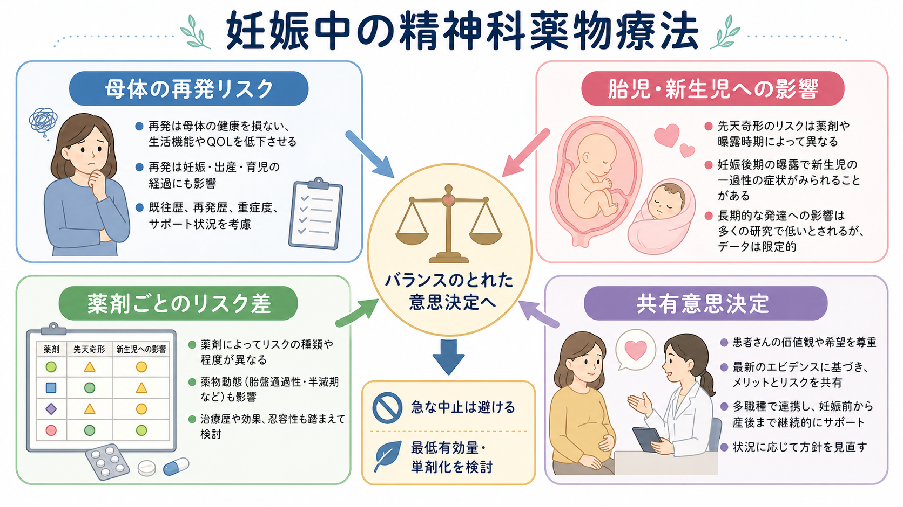
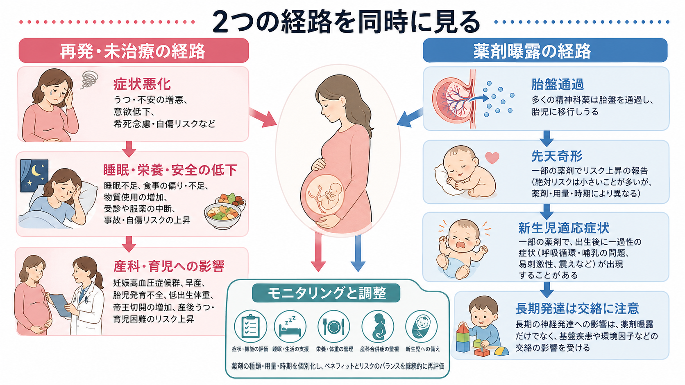
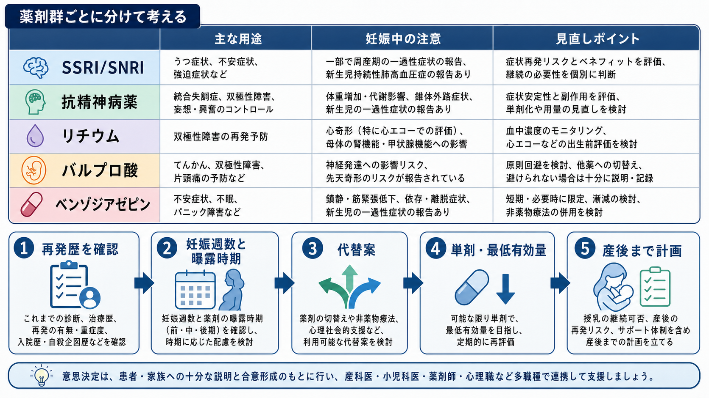

# 妊娠中の精神科薬物療法はどう考えるか

## 要点

- 妊娠中の[[精神科薬物療法とは何か|精神科薬物療法]]は、「薬を使うリスク」と「薬を使わないリスク」を同じ表に置いて考える必要がある。うつ病、双極性障害、統合失調症、不安症などの再発は、母体の苦痛だけでなく、睡眠、栄養、安全、受診継続、産科管理、産後の育児準備にも影響する。
- 一方で、薬剤曝露には胎盤通過、器官形成期の先天奇形、妊娠後期曝露による新生児適応症状、母体の代謝・循環・鎮静などの副作用がある。リスクは「精神科薬」全体ではなく、薬剤群、個別薬、用量、併用、妊娠週数、基礎疾患で大きく変わる。
- 原則は、急な自己中止を避け、再発歴・重症度・過去の反応性・代替案・妊娠週数を確認し、単剤化、最低有効量、妊娠中と産後のモニタリング計画を検討することである[1][2]。
- 本稿は教育・研究目的の整理であり、個別の処方変更や中止を指示するものではない。実際の判断は、本人、産科、小児科、精神科、薬剤師、心理職などの連携のもとで行う。

## この記事で答える問い

妊娠中に精神科薬を続けるか、減らすか、切り替えるか、中止するかを考えるとき、何を比較すればよいのか。とくに、母体の再発リスクと胎児・新生児への影響を、どのように同じ意思決定の枠組みに入れればよいのかを整理する。

## まず結論

妊娠中の精神科薬物療法は、「胎児に薬剤曝露があるか」だけで決めない。薬を減らすことで症状が再燃し、睡眠不足、栄養低下、自傷リスク、物質使用、受診中断、産後の急性増悪が起きるなら、それ自体が母子のリスクになる。ACOGの周産期メンタルヘルス薬物療法ガイドラインも、妊娠・産後のうつ病、不安症、双極性障害、急性精神病を対象に、薬物療法の安全性と有効性を同時に評価する枠組みを示している[1]。NICEも、妊娠前から産後1年までの精神疾患について、本人の希望、重症度、既往、薬剤の胎児・新生児リスク、治療しない場合のリスクを説明し、本人と合意形成することを重視している[2]。

したがって実務上の問いは、「この薬は安全か危険か」ではなく、次のように分解すると扱いやすい。

1. 疾患を治療しない場合、妊娠中・産後にどの程度再発しやすいか。
2. 再発した場合、本人と胎児・新生児にどのような不利益がありうるか。
3. 現在の薬剤には、どの時期に、どの種類のリスクが知られているか。
4. 減量、単剤化、切り替え、非薬物療法の追加、周産期モニタリングでリスクを下げられるか。
5. 本人が何を最も避けたいか、どの不確実性なら受け入れられるか。

## 背景

妊娠は精神疾患から「自然に守ってくれる」時期ではない。大うつ病の既往があり、妊娠前後に抗うつ薬を維持または中止した201例の前向き研究では、妊娠中の再発は全体で43%にみられ、維持群では26%、中止群では68%だった[3]。この研究は専門施設に集まった集団であり、すべての妊婦にそのまま一般化できるわけではないが、「妊娠したら薬をやめても症状は安定する」という単純な見方には注意が必要である。

双極性障害では、維持療法中止後の再発がより大きな問題になりうる。気分安定薬を中止した妊婦の観察研究では、妊娠中の再発リスクが高く、急な中止はより短期間での再発と関連した[4]。躁状態、混合状態、重症うつ、精神病症状、自殺念慮を伴う場合、薬剤曝露だけを避ける判断は、結果として母体と胎児の安全を損なうことがある。

一方、薬剤曝露にも固有の問題がある。SSRI/SNRIでは一部の先天奇形、妊娠後期曝露に伴う新生児適応症状、まれな新生児遷延性肺高血圧症が議論される[5]。抗精神病薬では代謝副作用、体重増加、妊娠糖尿病、鎮静、錐体外路症状、新生児の一過性症状が問題になる[6]。リチウムでは心奇形、とくに右心系奇形への注意、血中濃度、腎機能、甲状腺機能、分娩前後の濃度変化を考える[8]。バルプロ酸は、先天奇形と神経発達リスクが比較的大きく、妊娠可能年齢では原則として避ける方向で検討される[7]。

## 基本概念

### 使うリスクと使わないリスク

妊娠中の薬物療法では、「薬剤曝露の害」だけを見ても、「再発予防の利益」だけを見ても不十分である。[[薬物療法のリスクベネフィットをどう考えるか|薬物療法のリスクベネフィット]]は、少なくとも次の2列で整理する。

| 見る対象 | 具体例 | 注意点 |
|---|---|---|
| 薬を使うリスク | 先天奇形、新生児適応症状、母体副作用、分娩・授乳への影響 | 薬剤群、個別薬、用量、併用、曝露時期で変わる |
| 薬を使わないリスク | うつ・躁・精神病症状の再発、自傷、睡眠・栄養低下、受診中断、産後増悪 | 既往の重症度、再発歴、サポート、物質使用、身体合併症で変わる |

### 曝露時期

妊娠中のリスクは時期で変わる。器官形成期には先天奇形が主な論点になり、妊娠後期には新生児適応症状、呼吸循環、鎮静、哺乳、離脱様症状が論点になりやすい。産後は、授乳移行、睡眠不足、再発、とくに双極性障害や産後精神病の急性増悪が問題になる。

### 絶対リスクと相対リスク

「リスクが上がる」という表現は、絶対リスクで見る必要がある。たとえばリチウムの大規模コホートでは、第1三半期曝露で心奇形リスクの上昇が示されたが、リスクは用量と関連し、絶対頻度としては曝露群2.4%、ラモトリギン群1.4%、非曝露群1.15%という規模で報告された[8]。この数字は「無視できる」という意味ではないが、「必ず起こる」という意味でもない。

### 交絡

妊娠中の薬剤研究では、薬そのものの影響と、薬を必要とする疾患の重症度、喫煙、肥満、物質使用、社会的要因、受診頻度などを分けにくい。ACOGのガイドラインも、推奨ごとにエビデンスの質を評価しつつ、不十分な領域ではGood Practice Pointとして実務上の考え方を示している[1]。臨床では、研究の不確実性を隠さず、本人にとって重要なアウトカムに翻訳する必要がある。

## 仕組み

妊娠中の精神科薬物療法は、2つの経路を同時に見ると整理しやすい。

第1の経路は、再発・未治療の経路である。うつ病が再燃すると、睡眠、食事、活動、受診、服薬、対人サポートが崩れやすい。希死念慮、自傷、物質使用、家庭内安全の問題があれば、母体と胎児の安全に直結する。双極性障害では、躁・混合状態による衝動性、睡眠剥奪、判断力低下、産後急性増悪が問題になる。統合失調症や精神病症状では、被害妄想、幻聴、病識低下、治療中断、生活機能低下が産科管理にも影響する。

第2の経路は、薬剤曝露の経路である。多くの精神科薬は胎盤を通過しうる。器官形成期の曝露は先天奇形、妊娠後期の曝露は新生児適応症状や鎮静・哺乳困難、母体副作用は妊娠糖尿病、体重増加、転倒、眠気、血圧、腎機能・甲状腺機能などを通じて影響する。薬剤の種類と用量だけでなく、併用薬と身体疾患も重要である。

この2つの経路は独立ではない。たとえば薬を中止して再発すれば、睡眠不足や栄養低下が生じる。逆に薬を継続して強い鎮静や体重増加が起これば、生活機能や代謝リスクを通じて不利益が増える。したがって、妊娠中の判断は「一度決めたら固定」ではなく、症状、妊娠週数、血液検査、体重、血糖、胎児評価、出産計画、産後支援を見ながら更新する。

## 図解

薬剤群ごとの見直しでは、疾患の重症度と再発歴を先に確認する。薬剤名だけで安全性を決めるのではなく、なぜその薬が必要か、どの薬で安定していたか、過去の中止で何が起きたか、代替薬に反応したことがあるかを確認する。

| 薬剤群 | 主な論点 | 実務上の見直し |
|---|---|---|
| [[SSRIとは何か|SSRI]] / [[SNRIとは何か|SNRI]] | うつ病、不安症、強迫症などで使われる。新生児適応症状やまれなPPHNが議論される。 | 安定している薬を理由なく大きく変えない。重症再発歴がある場合は中止リスクも明示する。 |
| [[抗精神病薬とは何か|抗精神病薬]] | 統合失調症、双極性障害、精神病症状、躁状態など。代謝副作用と新生児症状に注意する。 | 体重、血糖、鎮静、錐体外路症状を見ながら、単剤化と用量調整を検討する。 |
| [[リチウムとは何か|リチウム]] | 双極性障害の再発予防で重要。心奇形、血中濃度、腎・甲状腺機能、分娩前後の変化が論点。 | 高リスク例では継続の利益も大きい。濃度測定、腎機能・甲状腺機能、胎児心エコーなどを計画する。 |
| [[バルプロ酸とは何か|バルプロ酸]] | 先天奇形と神経発達への影響が比較的大きい。 | 原則として妊娠可能性がある段階から回避・切り替えを検討する。避けられない場合は十分な説明と記録が必要。 |
| [[ベンゾジアゼピン系薬とは何か|ベンゾジアゼピン系薬]] | 鎮静、転倒、依存、離脱、新生児の一過性症状が論点。 | 短期・必要時に限定できるか、心理療法や睡眠衛生などを併用できるかを検討する。 |

## 臨床・研究との接続

臨床では、最初に「妊娠中だからすべて中止する」でも「安定しているから何も見直さない」でもなく、再発リスクの層別化から始める。重症うつ、入院歴、自殺企図、精神病症状、双極I型障害、産後精神病歴、薬剤中止後の急速再発歴がある場合、中止による不利益は大きくなりやすい。逆に、軽症で長期寛解しており、心理社会的支援が厚く、過去に減量しても安定していた場合は、減量や非薬物療法中心の選択肢が現実的になることもある。

研究を読むときは、アウトカムを分ける。先天奇形、流産、早産、低出生体重、新生児集中治療、PPHN、新生児適応症状、長期神経発達は同じではない。SSRI/SNRIの妊娠後期曝露とPPHNの関連を検討した大規模コホートでは、関連は示唆されるが、絶対リスクは低く、交絡調整後の推定は小さくなる[5]。抗精神病薬の第1三半期曝露に関するMedicaidコホートでは、交絡調整後、非定型抗精神病薬全体として主要先天奇形の大きな増加は示されなかったが、個別薬では追加検討が必要とされた[6]。

この領域では、RCTが少なく、観察研究が中心である。薬を飲む人と飲まない人は、疾患の重症度や生活背景がそもそも違う。したがって、研究結果は「安全宣言」や「危険宣言」としてではなく、意思決定の不確実性を縮める材料として読むのがよい。

## よくある誤解

### 妊娠したら精神科薬は必ず中止すべき

必ずしもそうではない。急な中止は離脱症状や再発を招くことがあり、再発のほうが母子に大きな不利益をもたらす場合がある。中止を考える場合も、妊娠週数、過去の再発、薬剤の半減期、支援体制を踏まえて段階的に検討する。

### 自然な妊娠経過なら精神症状は安定する

妊娠は精神疾患の再発を防ぐ時期とは限らない。大うつ病や双極性障害では、妊娠中にも再発が起こりうる[3][4]。産後は睡眠不足とホルモン変化、育児負荷が重なり、再発リスクが上がることがある。

### 胎児リスクだけを見ればよい

胎児リスクは重要だが、母体の重症再発、自傷、栄養低下、受診中断、産後の育児困難も胎児・新生児に影響する。母体と胎児を対立させるのではなく、母体の安定を胎児・新生児の利益の一部として考える。

### 薬剤群が同じならリスクも同じ

同じ薬剤群でも、個別薬、用量、併用、治療期間、曝露時期でリスクは変わる。抗うつ薬、抗精神病薬、気分安定薬を一括りにして判断しない。

### バルプロ酸も他の気分安定薬と同じように考えればよい

バルプロ酸は例外的に注意が大きい。MotherToBabyは、妊娠第1三半期曝露で主要先天奇形が約10%、神経管閉鎖障害が約1-2%と報告されること、学習・発達への影響が示されていることを整理している[7]。双極性障害で使う場合も、妊娠可能性がある段階から代替薬を検討することが重要である。

## 関連ノート

- [[精神科薬物療法とは何か]]
- [[薬物療法のリスクベネフィットをどう考えるか]]
- [[向精神薬の基本分類とは何か]]
- [[抗うつ薬とは何か]]
- [[SSRIとは何か]]
- [[SNRIとは何か]]
- [[抗精神病薬とは何か]]
- [[気分安定薬とは何か]]
- [[リチウムとは何か]]
- [[バルプロ酸とは何か]]
- [[ベンゾジアゼピン系薬とは何か]]
- [[周産期メンタルヘルスの疾患には何があるのか]]
- [[産後うつ病とは何か]]
- [[双極性障害とは何か]]
- [[統合失調症とは何か]]

## MOC更新候補

- [[MOC｜臨床実践・治療]] の薬物療法セクション
- [[MOC｜精神医学]] の周産期・薬物療法関連セクション
- [[MOC｜疾患・症候群]] の周産期メンタルヘルス周辺

## 理解チェック

1. 妊娠中の薬物療法判断で、「薬を使うリスク」と同時に必ず比較すべきものは何か。
2. 器官形成期と妊娠後期では、薬剤曝露のどのようなリスクが主に問題になりやすいか。
3. 双極性障害で急な気分安定薬中止が問題になりうる理由は何か。
4. バルプロ酸が妊娠可能年齢で特に慎重に扱われる理由は何か。
5. 研究論文を読むとき、薬剤の影響と疾患の重症度を分けにくいことを何と呼ぶか。

## 未解決問題

- 周産期薬物療法では、薬剤曝露と疾患重症度の交絡を十分に分けた研究がまだ限られている。
- 長期神経発達アウトカムは、家庭環境、遺伝、疾患重症度、産科合併症、社会経済要因の影響を受けるため、薬剤単独の因果推論が難しい。
- 日本の診療体制では、産科、精神科、小児科、地域保健、薬剤師、心理職の連携方法が施設差を受けやすい。
- 妊娠前相談、産後再発予防、授乳方針を一体化した意思決定支援ツールの整備が課題である。

## 参考文献

[1] American College of Obstetricians and Gynecologists. (2023). *Treatment and Management of Mental Health Conditions During Pregnancy and Postpartum: ACOG Clinical Practice Guideline No. 5*. Obstetrics & Gynecology, 141(6), 1262-1288. https://doi.org/10.1097/AOG.0000000000005202

[2] National Institute for Health and Care Excellence. (2018). *Antenatal and postnatal mental health: clinical management and service guidance* (NICE Clinical Guideline No. 192). https://www.ncbi.nlm.nih.gov/books/n/nicecg192guid/

[3] Cohen, L. S., Altshuler, L. L., Harlow, B. L., et al. (2006). Relapse of major depression during pregnancy in women who maintain or discontinue antidepressant treatment. *JAMA*, 295(5), 499-507. https://doi.org/10.1001/jama.295.5.499

[4] Viguera, A. C., Whitfield, T., Baldessarini, R. J., et al. (2007). Risk of recurrence in women with bipolar disorder during pregnancy: prospective study of mood stabilizer discontinuation. *American Journal of Psychiatry*, 164(12), 1817-1824. https://doi.org/10.1176/appi.ajp.2007.06101639

[5] Huybrechts, K. F., Bateman, B. T., Palmsten, K., et al. (2015). Antidepressant use late in pregnancy and risk of persistent pulmonary hypertension of the newborn. *JAMA*, 313(21), 2142-2151. https://doi.org/10.1001/jama.2015.5605

[6] Huybrechts, K. F., Hernández-Díaz, S., Patorno, E., et al. (2016). Antipsychotic use in pregnancy and the risk for congenital malformations. *JAMA Psychiatry*, 73(9), 938-946. https://doi.org/10.1001/jamapsychiatry.2016.1520

[7] MotherToBaby. (2025). *Valproic Acid*. NCBI Bookshelf. https://www.ncbi.nlm.nih.gov/books/NBK583009/

[8] Patorno, E., Huybrechts, K. F., Bateman, B. T., et al. (2017). Lithium use in pregnancy and the risk of cardiac malformations. *New England Journal of Medicine*, 376(23), 2245-2254. https://doi.org/10.1056/NEJMoa1612222
