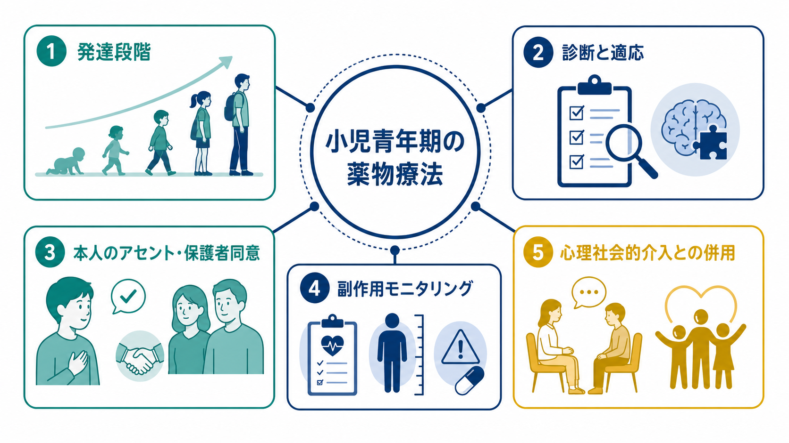
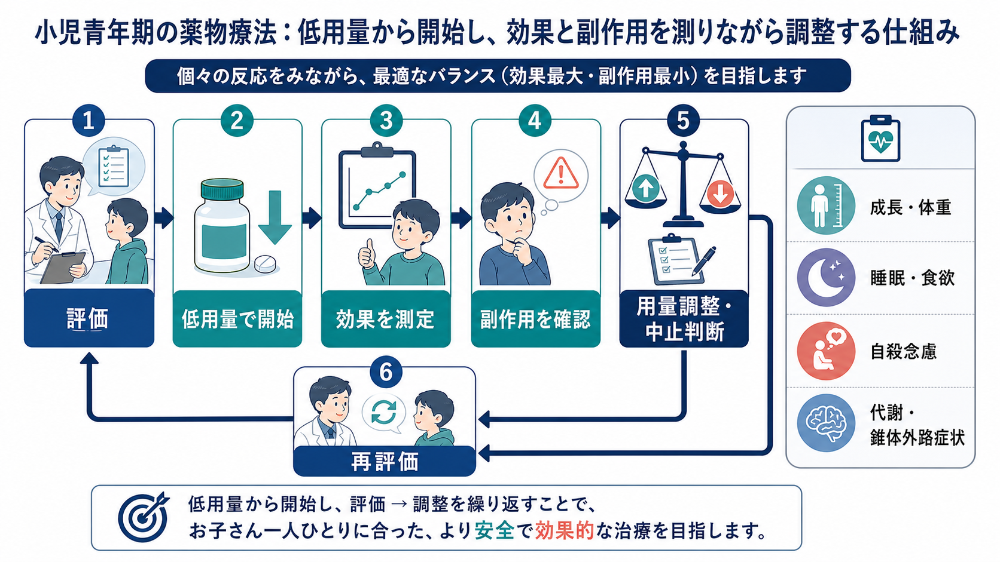
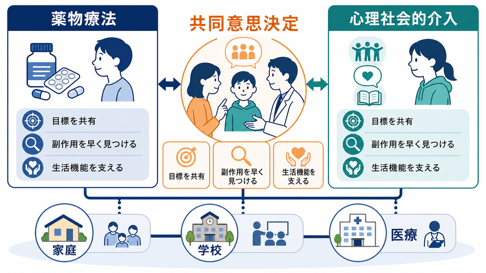

# 小児青年期の薬物療法では何に注意するか

## 要点

- 小児青年期の薬物療法は「小さな成人への処方」ではなく、発達段階、家族・学校環境、本人の理解力、長期的な成長への影響を含めて考える。
- 処方前には、診断の妥当性、心理社会的要因、併存症、服薬以外の選択肢、期待される利益と害を明示する。
- 本人のアセントと保護者の同意は、形式的な署名ではなく、治療目標・副作用・中止基準・代替案を共有する過程である。
- 副作用は「出たら聞く」だけでは不十分で、体重・身長・睡眠・食欲・気分変化・自殺念慮・代謝指標・錐体外路症状などを、薬剤ごとにあらかじめ測る。
- 薬物療法は、心理教育、家族支援、学校調整、心理療法、行動療法などと組み合わせて、生活機能を改善するために使う。

## この記事で答える問い

小児青年期の[[精神科薬物療法とは何か|精神科薬物療法]]では、成人の薬物療法と同じ薬理作用を利用する場面がある。しかし、実際の注意点は薬理だけでは決まらない。この記事では、次の問いに答える。

1. 発達段階は、薬の選択・説明・評価にどう関わるのか。
2. 本人のアセントと保護者同意は、どのように扱うべきか。
3. どの副作用を、いつ、誰が、どのように確認するのか。
4. 薬物療法と心理社会的介入は、どう組み合わせるのか。

## まず結論

小児青年期の薬物療法では、「診断名に薬を対応させる」よりも、「発達段階に合った目標を決め、低用量から始め、短い間隔で効果と副作用を測り、心理社会的支援と同時に調整する」ことが中心になる。AACAP の小児青年期向精神薬の実践パラメータは、安全で適切な処方の原則として、心理教育、インフォームド・コンセントとアセント、臨床経過と副作用の系統的モニタリング、家族との継続的協働を強調している[1][2]。

これは「薬を避ける」という意味ではない。たとえば[[ADHDとは何か|ADHD]]では、年齢に応じて行動療法、学校支援、薬物療法を組み合わせることが推奨される[3]。一方、うつ病、不安、精神病症状、双極性障害、強い攻撃性などでは、薬剤の有効性・副作用・適応外使用・専門医関与の必要性が疾患ごとに異なる。したがって、[[薬物療法のリスクベネフィットをどう考えるか|リスクベネフィット]]を子ども本人と保護者が理解できる言葉に翻訳する作業が不可欠である。

## 背景

小児青年期は、脳、身体、対人関係、学校生活、家族内の役割が同時に変化する時期である。症状の意味も年齢で変わる。幼児期の多動、学童期の不注意、思春期の抑うつ、自傷、睡眠リズムの乱れは、単一の薬理標的に還元しにくい。

さらに、小児青年期の薬物療法には三つの非対称性がある。第一に、子ども本人は症状や副作用を成人ほど言語化できないことがある。第二に、服薬を決める法的・実務的責任は保護者にある一方、薬を飲む主体は子ども本人である。第三に、薬の効果は家庭や学校での生活機能として現れるため、医療機関の診察室だけでは評価できない。

そのため、薬を開始する前に「何を改善したいのか」を行動レベルで定義する。たとえば「落ち着かせる」ではなく、「授業中に席を立つ回数を減らす」「眠れる日を増やす」「希死念慮を安全計画の中で扱える状態にする」「家族内の衝突を減らし、登校・睡眠・食事を回復する」といった目標にする。

## 基本概念

### 発達段階

発達段階は、薬物動態だけでなく、説明の仕方、評価尺度、支援者の役割を変える。幼児・学童では保護者と学校からの観察情報が重要になり、思春期では本人の内的体験、プライバシー、自律性、服薬への価値観がより重要になる。NICE の児童青年期うつ病ガイドラインも、心理療法の選択や共有意思決定で、成熟度、発達水準、神経発達症、コミュニケーションニーズを含めた評価を求めている[4]。

### アセントと保護者同意

アセントとは、法的な完全同意能力が十分でない未成年であっても、本人が理解できる範囲で説明を受け、希望や拒否感を表明し、意思決定に参加することである。AACAP の倫理資料は、未成年者を意思決定から排除しないこと、発達水準に応じて本人の選好を扱うことを重視している[5]。

実務上は、保護者同意だけで処方を進めると、服薬拒否、隠れた副作用、治療同盟の損傷が起こりやすい。反対に、本人の希望だけで進めると、保護者が担う観察・保管・通院調整が機能しない。よって、本人、保護者、医療者が同じ治療目標を共有することが出発点になる。

### 適応外使用

小児青年期では、成人で承認されている薬剤が未成年では適応外になることがある。適応外使用そのものが直ちに不適切というわけではないが、根拠の強さ、代替手段、専門医関与、モニタリング計画を明確にする必要がある。とくに[[抗うつ薬とは何か|抗うつ薬]]、[[抗精神病薬とは何か|抗精神病薬]]、気分安定薬では、疾患・年齢・重症度によって推奨の強さが大きく異なる。

## 仕組み

### 1. 処方前評価

処方前には、少なくとも次を確認する。

| 項目 | 確認する理由 |
|---|---|
| 診断と重症度 | 薬剤の適応、専門医関与、緊急性を判断する |
| 発達歴・家族歴 | 神経発達症、双極性障害、精神病性障害、薬剤反応性のリスクを見落とさない |
| 身体状態 | 体重、身長、血圧、睡眠、食欲、既往症、併用薬を把握する |
| 心理社会的要因 | 家族葛藤、いじめ、虐待、学校環境、学習困難を薬で覆い隠さない |
| 治療目標 | 何をもって有効と判断するかを決める |
| 中止・変更基準 | 副作用、無効、服薬困難、本人の拒否を扱う基準を持つ |

この段階で心理社会的介入が未検討なら、薬物療法だけを先行させない。WHO mhGAP は、発達の遅れ・障害をもつ子どもや青年に対して、社会技能、発達・行動的アプローチ、ADHD への認知・組織化スキル訓練などの心理社会的介入を推奨している[6]。

### 2. 低用量開始と短い評価間隔

小児青年期では、原則として「低用量から開始し、反応と副作用を見ながら調整する」。これは単なる慎重さではなく、個人差が大きい集団で、最小限の負担で治療反応を確認するための設計である。

たとえば、[[SSRIとは何か|SSRI]]などの抗うつ薬では、治療初期や増減量時に焦燥、易刺激性、睡眠変化、衝動性、自殺念慮の変化を確認する。FDA は、小児・青年の抗うつ薬治療で自殺念慮・自殺行動のリスク増加に関する boxed warning を求め、開始後数か月と用量変更時の慎重な観察、家族・介護者との連携を強調している[7]。これは「抗うつ薬を使ってはいけない」という意味ではなく、[[抗うつ薬の賦活症候群とは何か|賦活症候群]]や気分悪化を早く見つける体制なしに処方しない、という意味である。

### 3. 薬剤ごとの副作用モニタリング

副作用の確認は、薬剤クラスごとに焦点が異なる。

| 薬剤・場面 | 主な確認項目 |
|---|---|
| 抗うつ薬 | 自殺念慮、焦燥、易刺激性、睡眠、消化器症状、賦活、中止症状 |
| 精神刺激薬・ADHD 薬 | 食欲、体重、睡眠、脈拍・血圧、チック、不安、乱用・転用リスク |
| 抗精神病薬 | 体重、BMI、血糖/HbA1c、脂質、血圧、プロラクチン、錐体外路症状、眠気 |
| 気分安定薬 | 血中濃度が必要な薬剤、腎機能、甲状腺機能、肝機能、妊娠可能性、催奇形性説明 |
| ベンゾジアゼピン系薬 | 眠気、脱抑制、依存、転倒、学習・記憶への影響、漫然投与 |

とくに抗精神病薬では、代謝副作用と神経学的副作用を軽視しない。NICE の児童青年期精神病・統合失調症ガイドラインは、抗精神病薬開始前および治療中に、体重・BMI、身長、腹囲、脈拍、血圧、血糖または HbA1c、脂質、プロラクチン、運動障害などを定期的に確認する表を提示している[8]。[[抗精神病薬の代謝副作用とは何か|代謝副作用]]や[[抗精神病薬の錐体外路症状とは何か|錐体外路症状]]は、若年者の自己評価だけでは見逃されやすい。

## 図解

## 臨床・研究との接続

### ADHD

ADHD では、年齢に応じて行動療法、学校での支援、薬物療法を組み合わせる。AAP の ADHD ガイドラインは、就学前では行動的親訓練などを優先し、学齢期以降では FDA 承認薬、学校支援、行動的介入を組み合わせることを示している[3]。薬の効果判定は「集中できたか」だけでなく、宿題、授業参加、親子衝突、睡眠、食欲、本人の自己効力感で見る。

### 児童青年期うつ病

児童青年期のうつ病では、心理療法が中心であり、抗うつ薬は重症度、専門医評価、心理療法との併用、慎重なモニタリングの中で検討される。NICE は、中等症から重症のうつ病に対して、抗うつ薬を心理療法と併用せずに提供しないこと、開始後の副作用と精神状態を慎重に確認すること、抗うつ薬を処方する場合は小児青年期精神科医の評価後に行うことを推奨している[4]。

### 精神病症状・双極性障害

精神病症状や躁状態では、抗精神病薬や気分安定薬が重要になる場合がある。ただし、WHO mhGAP は青年期の精神病性障害や双極性障害で薬物療法を検討する場合にも、専門家の監督のもとで、有効性、副作用、本人の希望を慎重に比較することを条件付き推奨としている[6]。薬は危機を鎮めるだけでなく、睡眠、学校復帰、家族支援、再発予防計画と接続して初めて意味をもつ。

### 家族・学校・地域

薬の効果と副作用は、家庭、学校、地域で観察される。医療者は、本人と保護者の同意を前提に、学校からの観察情報を取り入れる。たとえば ADHD 薬では授業中の行動、抗うつ薬では登校・睡眠・食欲、抗精神病薬では眠気・体重増加・運動症状が重要である。家庭内では、薬の保管、服薬確認、過量服薬リスク、きょうだいへの説明も支援対象になる。

## よくある誤解

### 「子どもには薬を使わない方が安全である」

薬を使わないことが常に安全とは限らない。重症のうつ病、躁状態、精神病症状、強い衝動性、自傷リスクでは、未治療のリスクが大きい場合がある。重要なのは、薬を使うか使わないかの二分法ではなく、どの利益を期待し、どの害を予防し、いつ見直すかを明示することである。

### 「保護者が同意すれば十分である」

保護者同意は不可欠だが、本人のアセントを省略してよい理由にはならない。本人が理解できる言葉で、薬の目的、飲み方、よくある副作用、困ったときの伝え方を説明する。思春期では、体重増加、性機能、月経、眠気、学校生活への影響など、本人が保護者の前で話しにくいテーマも扱う。

### 「副作用は診察で聞けば分かる」

副作用は、質問しないと出てこない。さらに、眠気、食欲低下、体重増加、焦燥、錐体外路症状、月経異常、自殺念慮は、本人が副作用と認識していないことがある。したがって、定型的な確認項目、成長曲線、評価尺度、家族・学校からの情報を組み合わせる。

### 「心理療法が効かないときに薬を足す」

薬物療法と心理社会的介入は、単純な順番ではなく、相補的に使う。症状が重く心理療法に参加できないとき、薬で睡眠や焦燥を改善して心理療法に入れるようにすることがある。一方で、薬だけでは家族内の相互作用、学習環境、トラウマ、生活リズム、回避行動は十分に変わらない。[[心理療法と薬物療法はどう組み合わせるのか]]を参照するとよい。

## 関連ノート

確認済みの関連ノート:

- [[精神科薬物療法とは何か]]
- [[薬物療法のリスクベネフィットをどう考えるか]]
- [[心理療法と薬物療法はどう組み合わせるのか]]
- [[児童への心理療法では何に注意するのか]]
- [[発達段階に応じた家族支援とは何か]]
- [[発達段階に応じた精神科面接とは何か]]
- [[ADHDとは何か]]
- [[児童青年期うつ病とは何か]]
- [[SSRIとは何か]]
- [[抗うつ薬の賦活症候群とは何か]]
- [[抗精神病薬の代謝副作用とは何か]]

今後の作成候補:

- 小児青年期の向精神薬モニタリング表
- 児童青年期のインフォームド・アセントとは何か
- 学校と医療の情報共有では何に注意するか

MOC 更新候補:

- `content/00_MOC/` 配下の臨床実践・治療系 MOC
- 薬物療法 MOC
- 児童青年期精神医学 MOC

## 理解チェック

1. 小児青年期の薬物療法で、本人のアセントを確認する理由は何か。
2. 抗うつ薬を開始・増量した直後に、本人と家族へ確認すべき変化は何か。
3. 抗精神病薬を開始する前に、最低限どの身体・代謝指標を測るべきか。
4. 薬物療法と心理社会的介入を併用することで、薬だけでは扱いにくいどの問題に介入できるか。

## 参考文献

[1] Walkup, J. T., et al. (2009). Practice Parameter on the Use of Psychotropic Medication in Children and Adolescents. *Journal of the American Academy of Child & Adolescent Psychiatry*, 48(9), 961-973. https://doi.org/10.1097/CHI.0b013e3181ae0a08

[2] American Academy of Child and Adolescent Psychiatry. (2015). *Psychotropic Medication Monitoring and Oversight*. https://www.aacap.org/App_Themes/AACAP/docs/clinical_practice_center/systems_of_care/AACAP_Psychotropic_Medication_Recommendations_2015_FINAL.pdf

[3] Wolraich, M. L., et al. (2019). Clinical Practice Guideline for the Diagnosis, Evaluation, and Treatment of Attention-Deficit/Hyperactivity Disorder in Children and Adolescents. *Pediatrics*, 144(4), e20192528. https://doi.org/10.1542/peds.2019-2528

[4] National Institute for Health and Care Excellence. (2019). *Depression in children and young people: identification and management* (NG134). https://www.nice.org.uk/guidance/ng134

[5] American Academy of Child and Adolescent Psychiatry. (2014). *Code of Ethics / Ethical Issues in Clinical Practice: Assent and Consent to Treatment*. https://www.aacap.org/AACAP/Member_Resources/Ethics/Ethics_Committee/Ethical_Issues_in_Clinical_Practice.aspx

[6] World Health Organization. (2023). *mhGAP guideline for mental, neurological and substance use disorders: recommendations on child and adolescent mental disorders and adolescent psychosis/bipolar disorder*. https://www.who.int/publications/i/item/9789240084278

[7] U.S. Food and Drug Administration. (2004). *Suicidality in Children and Adolescents Being Treated With Antidepressant Medications*. https://www.fda.gov/drugs/postmarket-drug-safety-information-patients-and-providers/suicidality-children-and-adolescents-being-treated-antidepressant-medications

[8] National Institute for Health and Care Excellence. (2013, updated 2016). *Psychosis and schizophrenia in children and young people: recognition and management* (CG155), supplementary information on baseline investigations and monitoring. https://www.nice.org.uk/guidance/cg155/chapter/Supplementary-information-on-baseline-investigations-and-monitoring

## 未解決問題

- 小児青年期の長期服薬が、成長、代謝、神経発達、教育達成に及ぼす影響は、薬剤・疾患・併存症ごとにまだ十分には分かっていない。
- RCT の平均効果は、家庭環境、学校支援、治療同盟、トラウマ歴、神経発達特性を十分に反映しないことがある。
- 適応外使用、ポリファーマシー、移行期医療、本人の服薬拒否をどう扱うかは、臨床倫理とサービス設計の問題でもある。
