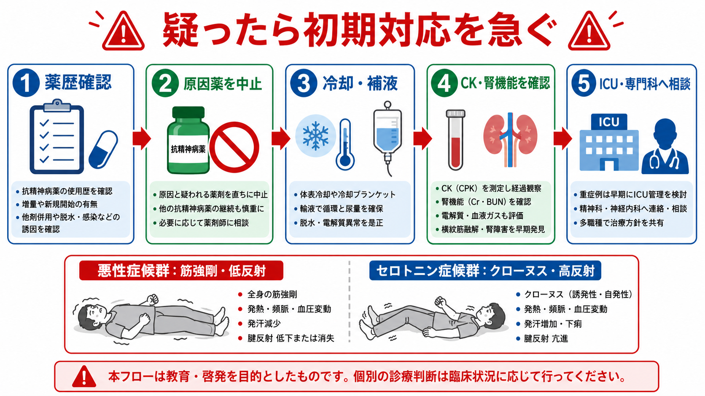
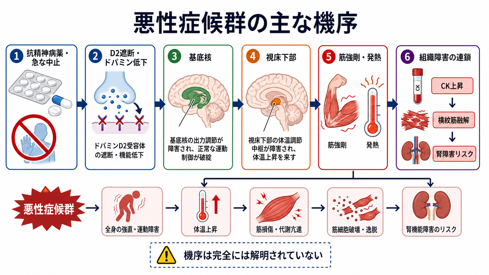
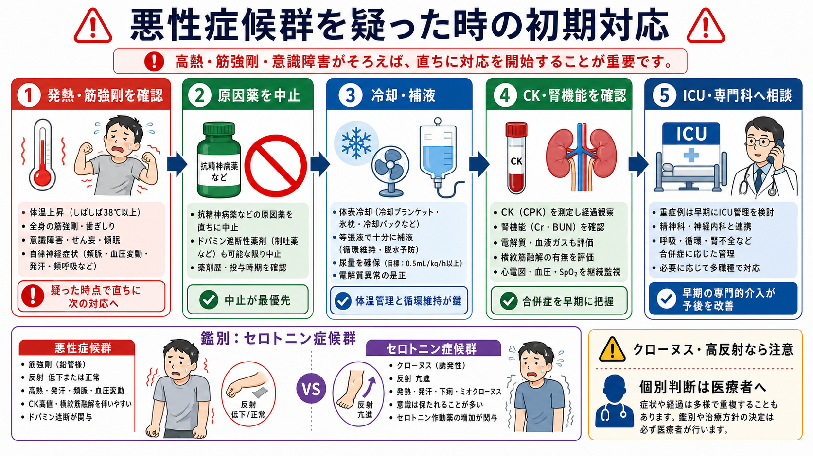

# 悪性症候群とは何か

## 要点

- 悪性症候群 neuroleptic malignant syndrome, NMS は、主に[[抗精神病薬とは何か|抗精神病薬]]などのドパミン受容体遮断薬、またはドパミン作動薬の急な中止に関連して起こる、まれだが生命に関わる薬剤関連症候群である[1][2]。
- 典型像は、発熱、全身性の筋強剛、[[せん妄とは何か|意識障害]]、頻脈・血圧変動・発汗などの自律神経症状である[1][3]。
- 診断は検査値だけで決めるものではない。薬歴、時間経過、身体所見、CK上昇・白血球増多・腎機能障害、感染症や[[カタトニアとは何か|悪性カタトニア]]などの鑑別を組み合わせて判断する[1][4]。
- 疑った時点で、原因薬の中止、冷却、補液、電解質補正、横紋筋融解・腎障害・呼吸循環不全の監視を急ぐ。重症例では ICU 管理、ブロモクリプチン、ダントロレン、ECT などが検討される[1][5]。
- 本記事は教育・研究目的の整理であり、個別の診断や治療指示ではない。高熱、筋強剛、意識変容がある場合は緊急評価の対象として扱う。

## この記事で答える問い

1. 悪性症候群は、どのような薬剤・状況で起こるのか。
2. 発熱、筋強剛、意識障害、自律神経症状は、どのように一つの緊急症候群としてつながるのか。
3. [[セロトニン症候群とは何か|セロトニン症候群]]、悪性カタトニア、感染症、熱中症とどう見分けるのか。
4. 臨床現場では、疑った時点で何を優先するのか。

## まず結論

悪性症候群は「抗精神病薬の副作用の一つ」とだけ覚えると危ない。実際には、発熱と筋強剛を伴う急性の全身危機であり、横紋筋融解、腎障害、呼吸不全、DIC、致死的不整脈に進むことがある[1][2]。

最初に行うべきことは、原因になりうる薬剤を止めること、体温と循環を支えること、CK・腎機能・電解質を確認すること、そして重症度に応じて ICU や専門科へ早く相談することである[1][5]。確定診断を待つあいだに支持療法が遅れると、予後に直結しうる。

## 背景

悪性症候群は、古典的にはハロペリドールなど高力価の第一世代抗精神病薬でよく知られてきた。しかし、第二世代抗精神病薬、制吐薬のメトクロプラミド、ドンペリドン、プロクロルペラジン、リチウム併用、抗パーキンソン病薬の急な中止などでも起こりうる[1][2]。

発症率は報告により幅があるが、抗精神病薬使用者の 0.01-3.2% 程度とされ、近年は薬剤選択や早期認識により低下しているとされる[1]。死亡率も歴史的には 30% を超える報告があったが、現在は早期発見と支持療法により 10% 未満まで下がったと整理されている[1]。ただし「まれになった」ことは「見逃してよい」ことを意味しない。とくに[[LAIとは何か|LAI]]、急な増量、多剤併用、脱水、身体疾患の併存では、時間経過と薬歴を丁寧に読む必要がある[1][3]。

## 基本概念

### 何が起きているのか

中心にある仮説は、中枢ドパミン活動の急な低下である。D2受容体遮断やドパミン作動薬の急な中止により、基底核の運動制御、視床下部の体温・自律神経調節、骨格筋の緊張調節が破綻し、筋強剛と熱産生が増すと考えられる[1][6]。

ただし、悪性症候群の病態は単一機序では説明しきれない。交感神経系の過活動、カルシウム調節異常、悪性高熱症との類似性、遺伝的脆弱性なども議論されている[1][6]。そのため、機序の説明は「D2遮断だけ」と単純化しすぎない方がよい。

### 典型的な症状

典型像は、薬剤曝露またはドパミン作動薬中止の後、1-3日ほどで発熱、筋強剛、意識変容、自律神経症状がそろってくる形である[1]。筋強剛は「鉛管様」と表現されることがあり、パーキンソニズム、嚥下困難、無動、振戦を伴うこともある[2][3]。

検査では CK 上昇、白血球増多、肝酵素上昇、ミオグロビン尿、腎機能障害、代謝性アシドーシスなどが支持所見になる[1][4]。CK は病勢を反映しやすいが、CK が上がるまで待たなければ対応できないわけではない。

## 仕組み

### 薬歴から見る

悪性症候群を疑う入口は、症状だけでなく薬歴である。確認すべきなのは、抗精神病薬の新規開始、増量、注射製剤・持効性製剤、複数薬剤の併用、制吐薬やリチウム併用、脱水や感染症、パーキンソン病薬の中断である[1][3]。[[向精神薬の基本分類とは何か|向精神薬]]の分類を知っていても、実際の現場では薬剤名、投与経路、最後に飲んだ時刻、最近の増減を具体的に確認する必要がある。

### 体温と筋肉から見る

ドパミン低下による筋強剛は、熱産生を増やし、体温上昇を悪化させる。発汗、頻脈、血圧変動、頻呼吸が加わると、脱水と循環不全が進みやすい。さらに筋細胞障害が進むと CK 上昇と横紋筋融解を来し、腎障害のリスクが高まる[1][5]。

### 鑑別から見る

発熱と意識障害があれば、中枢神経感染症、敗血症、熱中症、中毒、離脱、非けいれん性てんかん重積、甲状腺クリーゼなども鑑別に入る[1]。セロトニン症候群は薬歴が異なり、クローヌス、腱反射亢進、ミオクローヌス、下痢などが目立ちやすい。一方、悪性症候群では筋強剛が強く、反射は正常から低下寄りになりやすい[1][7]。

悪性カタトニアは、精神運動症状の前駆、興奮、常同行動、カタトニア症状の文脈を伴いやすく、ベンゾジアゼピンや ECT への反応性が重要になる[1]。ただし境界例では重なりがあり、単純な二分法にしない。

## 図解

| 観点 | 悪性症候群で重視すること | 似た病態との見分け方 |
|---|---|---|
| 薬歴 | 抗精神病薬、制吐薬、ドパミン作動薬中止、増量、多剤併用 | セロトニン作動薬、麻酔薬、感染曝露、熱環境も確認する |
| 神経筋所見 | 全身性筋強剛、無動、振戦、嚥下困難 | セロトニン症候群ではクローヌス・反射亢進が目立つ |
| 体温・自律神経 | 高熱、頻脈、血圧変動、発汗、頻呼吸 | 敗血症や熱中症では薬歴だけで説明しない |
| 検査 | CK、Cr/BUN、電解質、尿中ミオグロビン、血液ガス | 検査は支持所見。陰性でも早期なら除外しきれない |
| 初期対応 | 原因薬中止、冷却、補液、合併症監視、ICU相談 | 確定診断待ちで支持療法を遅らせない |

## 臨床・研究との接続

臨床では、悪性症候群は「確定診断名」より先に「緊急対応を始めるべき症候群」として扱う。原因薬の中止と支持療法が基本であり、重症例ではブロモクリプチンやダントロレンが検討されるが、薬物療法の根拠は主に症例報告、観察研究、レビューに依存する[1][5]。ECT は難治例、悪性カタトニアとの鑑別が難しい例、精神病症状やカタトニアが前景にある例で議論される[1][3]。

研究上は、診断基準の標準化が課題である。国際コンセンサス基準は、薬剤曝露、発熱、筋強剛、意識変容、CK上昇、自律神経症状、鑑別除外などを重みづける試みであり、後続研究で妥当性検証も行われている[4]。ただし、現場では基準を機械的に満たすかどうかだけでなく、時間経過とリスクを読む必要がある。

再開の問題も重要である。抗精神病薬が必要な場合でも、症状消失後すぐに同じ薬剤・同じ用量へ戻すのは避け、少なくとも2週間程度待つ、低力価またはリスクの低い薬剤を少量から始める、ゆっくり増量する、脱水を避ける、リチウム併用を避ける、再発兆候を監視する、といった慎重な方針が推奨される[1][3]。

## よくある誤解

### 誤解1: 高熱がなければ悪性症候群ではない

典型例では発熱が重要だが、発症早期や非典型例では所見がそろわないことがある。薬歴と筋強剛、意識変容、自律神経症状があれば、体温だけで除外しない。

### 誤解2: 第二世代抗精神病薬なら起こらない

第二世代抗精神病薬でも悪性症候群は報告されている。[[クロザピンとは何か|クロザピン]]、リスペリドン、オランザピン、クエチアピン、アリピプラゾールなどでも起こりうるため、「古い薬だけの問題」とは考えない[1][2]。

### 誤解3: CKが上がってから対応すればよい

CK上昇は支持所見だが、治療開始の条件ではない。筋強剛と高熱が進行している時点で、冷却、補液、原因薬中止、合併症監視を始める必要がある[1][5]。

### 誤解4: セロトニン症候群と完全に別物として簡単に分けられる

薬歴と神経筋所見でかなり区別できるが、実際には薬剤併用や混合像もありうる。[[セロトニン症候群とは何か|セロトニン症候群]]はクローヌス、反射亢進、消化器症状が手がかりになるが、迷う場合は中毒・救急・精神科・神経内科の連携が必要である[7]。

## 関連ノート

- [[抗精神病薬とは何か]]
- [[向精神薬の基本分類とは何か]]
- [[LAIとは何か]]
- [[クロザピンとは何か]]
- [[アカシジアをどう見分けるか]]
- [[セロトニン症候群とは何か]]
- [[カタトニアとは何か]]
- [[せん妄とは何か]]

### 関連ノート候補

- 横紋筋融解とは何か
- 悪性カタトニアとは何か
- 抗精神病薬の再開はどう判断するか
- 薬剤性高体温とは何か

### MOC更新候補

- `content/00_MOC/` 配下の臨床実践・治療、薬物療法、精神科救急に関する MOC があれば、`[[悪性症候群とは何か]]` を追加する。
- 並列ジョブとの衝突を避けるため、本ジョブでは MOC 本体は更新しない。

## 理解チェック

1. 悪性症候群を疑うとき、薬歴で必ず確認する項目は何か。
2. 悪性症候群とセロトニン症候群を、神経筋所見でどう区別するか。
3. CK上昇を待たずに始めるべき初期対応は何か。
4. 抗精神病薬を再開する場合、なぜ低用量・緩徐増量・脱水回避が重要なのか。

## 参考文献

[1] Simon LV, Hashmi MF, Callahan AL. Neuroleptic Malignant Syndrome. *StatPearls*. Last update 2023-04-24. https://www.ncbi.nlm.nih.gov/books/NBK482282/

[2] Wijdicks EFM, Ropper AH. Neuroleptic Malignant Syndrome. *New England Journal of Medicine*. 2024;391(12):1130-1138. doi:10.1056/NEJMra2404606. https://pubmed.ncbi.nlm.nih.gov/39321364/

[3] Strawn JR, Keck PE Jr, Caroff SN. Neuroleptic malignant syndrome. *American Journal of Psychiatry*. 2007;164(6):870-876. doi:10.1176/ajp.2007.164.6.870. https://pubmed.ncbi.nlm.nih.gov/17541044/

[4] Gurrera RJ, Mortillaro G, Velamoor V, Caroff SN. A validation study of the international consensus diagnostic criteria for neuroleptic malignant syndrome. *Journal of Clinical Psychopharmacology*. 2017;37(1):67-71. doi:10.1097/JCP.0000000000000640. https://pubmed.ncbi.nlm.nih.gov/28027111/

[5] van Rensburg R, Decloedt EH. An approach to the pharmacotherapy of neuroleptic malignant syndrome. *Psychopharmacology Bulletin*. 2019;49(1):84-91. https://pmc.ncbi.nlm.nih.gov/articles/PMC6386430/

[6] Berman BD. Neuroleptic malignant syndrome: a review for neurohospitalists. *The Neurohospitalist*. 2011;1(1):41-47. doi:10.1177/1941875210386491. https://pmc.ncbi.nlm.nih.gov/articles/PMC3726098/

[7] Perry PJ, Wilborn CA. Serotonin syndrome vs neuroleptic malignant syndrome: a contrast of causes, diagnoses, and management. *Annals of Clinical Psychiatry*. 2012;24(2):155-162. https://pubmed.ncbi.nlm.nih.gov/22563571/
