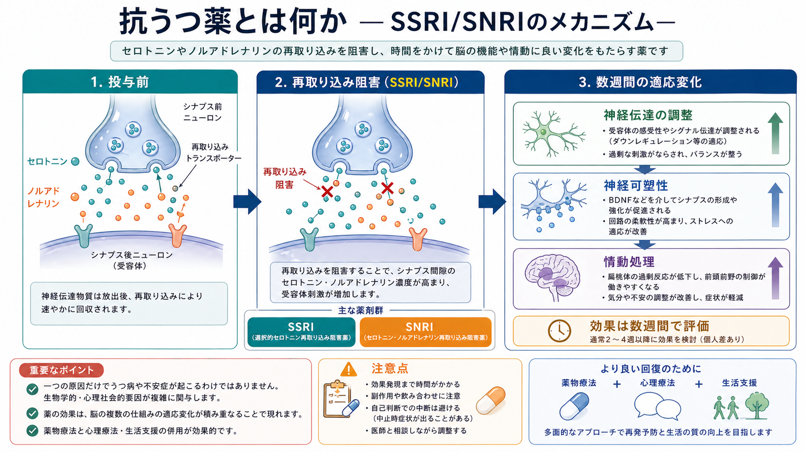
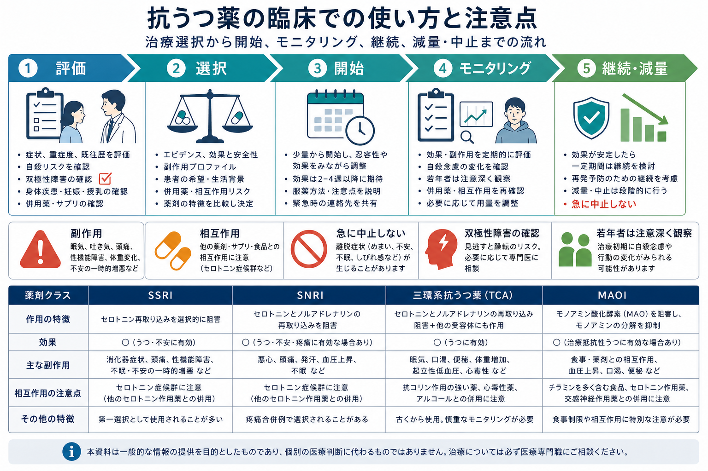

# 抗うつ薬とは何か

## 要点

- 抗うつ薬は、うつ病だけでなく、不安症、パニック症、強迫症、慢性疼痛などにも用いられる薬剤群である。
- 代表的な薬剤群には [[SSRIとは何か|SSRI]]、[[SNRIとは何か|SNRI]]、[[NaSSAとは何か|NaSSA]]、[[三環系抗うつ薬とは何か|三環系抗うつ薬]]、MAOI などがある。
- 作用は単なる「セロトニン不足の補充」ではなく、神経伝達、受容体適応、神経可塑性、情動処理、ストレス応答の変化が重なって現れると考えられている [4], [5]。
- 効果判定には通常数週間を要し、症状、機能、副作用、併存症、本人の希望を合わせて評価する [1]。
- 医療・研究教育上の概説であり、個別の開始・変更・中止は医療専門職と相談して判断する。

## この記事で答える問い

1. 抗うつ薬はどのような薬剤群か。
2. うつ病や不安症に対して、どのような理屈で使われるのか。
3. どのような副作用・相互作用・中止時症状に注意する必要があるのか。
4. 研究知見と臨床判断はどこで接続し、どこで分けて考えるべきか。

## まず結論

抗うつ薬は「気分を直接明るくする薬」というより、抑うつ、不安、焦燥、睡眠、疼痛、反復思考などに関わる脳内ネットワークの働き方を、時間をかけて調整する薬剤群である。多くの診療ガイドラインでは、中等症から重症のうつ病、再発を繰り返すうつ病、心理療法だけでは十分でない不安症などで、本人の希望とリスクを踏まえて使用が検討される [1], [2]。

ただし、薬剤選択は「診断名だけ」で決まらない。過去の反応、副作用、年齢、妊娠・授乳、身体疾患、併用薬、自殺リスク、双極性障害の可能性、服薬継続のしやすさを合わせて考える必要がある [1], [7]。

## 背景

抗うつ薬の臨床的位置づけは、時代とともに変化してきた。三環系抗うつ薬や MAOI は有効性がある一方で、抗コリン作用、心毒性、食事・薬剤相互作用などの扱いにくさがある。現在は、忍容性や安全性の観点から SSRI や SNRI が第一選択になりやすいが、すべての人に同じ薬が最適というわけではない [1], [3]。

成人うつ病を対象にした大規模ネットワークメタ解析では、多くの抗うつ薬がプラセボより有効である一方、効果量や中止率には薬剤間差があることが示された [3]。この結果は「抗うつ薬は効くか」という単純な問いよりも、「誰に、どの薬を、どの期間、どの支援と組み合わせて使うか」という問いの重要性を示している。

## 基本概念

### 主な薬剤群

| 薬剤群 | 主な特徴 | 注意点 |
|---|---|---|
| SSRI | セロトニン再取り込み阻害を主作用とし、うつ病・不安症で広く使われる | 消化器症状、性機能障害、不眠・眠気、出血傾向、セロトニン症候群など |
| SNRI | セロトニンとノルアドレナリンの再取り込みを阻害する | 悪心、発汗、血圧上昇、離脱様症状、疼痛併存例での選択など |
| NaSSA | ノルアドレナリン・セロトニン作動性を調整する | 眠気、食欲増加、体重増加など |
| 三環系抗うつ薬 | 複数の受容体・トランスポーターに作用する古典的薬剤 | 抗コリン作用、起立性低血圧、心毒性、過量服薬リスク |
| MAOI | モノアミン分解を抑える | 食事制限、薬剤相互作用、高血圧危機など |

この分類は、臨床での説明には便利だが、薬剤の実際の作用は単一のトランスポーターだけでは説明しきれない。たとえば同じ SSRI でも半減期、薬物相互作用、賦活感、眠気、離脱症状の出やすさは異なる。

### 適応

抗うつ薬は、うつ病エピソードの治療と再発予防のほか、全般不安症、パニック症、社交不安症、強迫症、PTSD、月経前不快気分障害、神経障害性疼痛、線維筋痛症などで用いられることがある [2]。ただし、適応は国・薬剤・診療ガイドライン・保険制度によって異なる。

不安症では、薬物療法だけでなく心理教育、認知行動療法、睡眠・生活リズムの調整、回避行動への介入が重要である。薬剤は症状軽減の補助であり、生活上の学習や対処行動の置き換えを自動的に行うものではない。

## 仕組み

### 再取り込み阻害から始まるが、そこで終わらない

SSRI や SNRI は、シナプス間隙からセロトニンやノルアドレナリンを回収するトランスポーターを阻害する。これにより神経伝達物質の信号が変化するが、服薬直後に抑うつ症状が大きく改善するとは限らない。臨床効果が数週間単位で評価されるのは、受容体感受性、神経回路、情動処理、ストレス応答などの二次的な変化が関与するためと考えられる [4]。

### 「セロトニン不足」だけでは説明できない

抗うつ薬の一部がセロトニン系に作用することは確かだが、うつ病を単純な「セロトニン不足」として説明することには限界がある。セロトニン仮説に関する包括的レビューは、末梢・中枢のセロトニン指標だけでうつ病全体を説明する証拠は強くないと論じている [5]。したがって、抗うつ薬の作用は「不足物質の補充」ではなく、複数の生物学的・心理社会的過程への介入として理解する方が正確である。

### 神経可塑性と情動処理

抗うつ薬は、情動刺激への反応、ネガティブ情報への注意バイアス、報酬処理、脅威処理の変化を通じて、心理療法や生活上の経験から学び直す余地を広げる可能性がある [4]。この観点では、薬物療法は[[精神療法は脳を変えるのか|精神療法]]や生活支援と競合するものではなく、相互に補完しうる。

関連する神経科学的背景としては、[[神経可塑性低下はうつ病をどう説明するのか]]、[[報酬系の異常はうつ病をどう説明するのか]]、[[扁桃体過活動は不安症やPTSDにどう関わるのか]]も参照できる。

## 図解

上の図は、抗うつ薬を「開始して終わり」と捉えず、評価、薬剤選択、開始後の観察、継続、減量・中止までを一連の治療計画として考えるための整理である。特に、効果と副作用の両方を評価すること、急な自己中止を避けること、双極性障害や自殺リスクを見落とさないことが重要になる [1], [6], [7]。

## 臨床・研究との接続

### 効果判定

抗うつ薬の効果は、気分だけでなく、睡眠、食欲、焦燥、集中、意欲、身体症状、社会機能、再発予防を含めて評価する。診療ガイドラインでは、症状尺度や機能評価を使いながら、十分量・十分期間での反応を確認することが推奨される [1]。

研究では平均効果が示されるが、臨床では個人差が大きい。過去に同じ薬で改善した人、家族歴が参考になる人、副作用が問題になる人、疼痛や不眠が併存する人では、同じ診断名でも選択が変わる。

### 副作用と相互作用

よく問題になる副作用には、悪心、下痢、頭痛、不眠、眠気、性機能障害、発汗、体重変化、血圧変化、出血リスク、低ナトリウム血症、QT延長、セロトニン症候群などがある。高齢者、妊娠・授乳中の人、身体疾患のある人、多剤併用の人では、相互作用とモニタリングの重要性が高い。

三環系抗うつ薬や MAOI は、特に過量服薬時の危険性、食事・薬剤相互作用、心血管系への影響に注意が必要である。したがって、薬の「強さ」だけでなく、本人の生活背景と安全性を含めた[[薬物療法のリスクベネフィットをどう考えるか|リスクベネフィット]]で考える。

### 中止・減量

抗うつ薬を急に中止すると、めまい、しびれ感、吐き気、不眠、不安、焦燥、感覚異常、インフルエンザ様症状などが生じることがある。NICE は、依存や中止時症状に関連する薬剤について、開始時から中止時の見通しを説明し、必要に応じて段階的に減量することを推奨している [6]。この点は [[抗うつ薬中止症候群とは何か]] と密接に関係する。

### 小児・青年と自殺リスク

抗うつ薬、とくに治療開始初期や用量変更時には、小児・青年で自殺念慮や行動の悪化が報告されており、FDA は小児・青年に関する警告を示している [7]。これは「抗うつ薬を使ってはいけない」という意味ではなく、症状の重症度、未治療リスク、家族・支援者との観察体制、危機対応計画を含めて慎重に扱う必要があるという意味である。

### 双極性障害との鑑別

抑うつ症状の背景に双極性障害がある場合、抗うつ薬単独投与で躁転、混合状態、急速交代化が問題になることがある。過去の躁・軽躁エピソード、家族歴、抗うつ薬での過活動・不眠・焦燥の悪化を確認することは、薬剤選択以前の安全確認である。関連して [[双極性障害は情動ネットワークの異常として説明できるのか]] も参照できる。

## よくある誤解

### 抗うつ薬は「性格を変える薬」ではない

抗うつ薬は人格を別人に変えることを目的とする薬ではない。症状によって狭まった睡眠、意欲、不安反応、情動処理、生活機能の幅を回復させるために使われる。

### すぐ効かないなら無効とは限らない

副作用は早期に出る一方、抑うつや不安の改善は数週間かけて評価されることが多い [1], [4]。ただし、悪化、希死念慮、躁的変化、重い副作用がある場合は、待つのではなく早めに相談する必要がある。

### 依存性薬物と同じではないが、中止時症状はありうる

抗うつ薬は、ベンゾジアゼピンやオピオイドのような報酬性の依存を通常想定する薬ではない。しかし、中止時症状が起こりうるため、「依存しないから急にやめてよい」とは言えない [6]。

### 薬だけで十分とは限らない

抗うつ薬は症状軽減に役立ちうるが、孤立、睡眠不足、過労、トラウマ、対人葛藤、貧困、身体疾患などの要因を自動的に解決するわけではない。心理療法、生活支援、社会資源、身体疾患管理を含めた多面的な支援が重要である。

## 関連ノート

- [[SSRIとは何か]]
- [[SNRIとは何か]]
- [[NaSSAとは何か]]
- [[三環系抗うつ薬とは何か]]
- [[抗うつ薬中止症候群とは何か]]
- [[薬物療法のリスクベネフィットをどう考えるか]]
- [[薬物療法は神経回路にどう作用するのか]]
- [[神経可塑性低下はうつ病をどう説明するのか]]
- [[報酬系の異常はうつ病をどう説明するのか]]
- [[扁桃体過活動は不安症やPTSDにどう関わるのか]]

## MOC更新候補

- [[MOC｜臨床実践・治療]]
- [[MOC｜精神医学]]
- [[MOC｜神経科学と精神疾患]]

## 理解チェック

1. 抗うつ薬の効果が「再取り込み阻害」だけで即座に説明しにくいのはなぜか。
2. SSRI、SNRI、三環系抗うつ薬では、副作用や相互作用の考え方がどのように異なるか。
3. 抗うつ薬を減量・中止するとき、なぜ段階的な調整が重要なのか。
4. うつ病治療で、双極性障害の確認が重要になる理由は何か。

## 未解決問題

- どの患者がどの抗うつ薬に反応しやすいかを、臨床で十分に使える精度で予測するバイオマーカーはまだ限られている。
- セロトニン、ノルアドレナリン、ドパミン、炎症、ストレス、睡眠、認知バイアスを統合した治療反応モデルは発展途上である。
- 抗うつ薬の長期使用、再発予防、中止時症状、心理療法との最適な組み合わせについては、個人差を踏まえた研究がさらに必要である。

## 参考文献

[1] National Institute for Health and Care Excellence. (2022). *Depression in adults: treatment and management (NICE guideline NG222).* https://www.nice.org.uk/guidance/ng222

[2] National Institute for Health and Care Excellence. (2011, updated). *Generalised anxiety disorder and panic disorder in adults: management (NICE guideline CG113).* https://www.nice.org.uk/guidance/cg113

[3] Cipriani, A., Furukawa, T. A., Salanti, G., et al. (2018). Comparative efficacy and acceptability of 21 antidepressant drugs for the acute treatment of adults with major depressive disorder: a systematic review and network meta-analysis. *The Lancet, 391*(10128), 1357-1366. https://doi.org/10.1016/S0140-6736(17)32802-7

[4] Harmer, C. J., Goodwin, G. M., & Cowen, P. J. (2009). Why do antidepressants take so long to work? A cognitive neuropsychological model of antidepressant drug action. *The British Journal of Psychiatry, 195*(2), 102-108. https://doi.org/10.1192/bjp.bp.108.051193

[5] Moncrieff, J., Cooper, R. E., Stockmann, T., et al. (2023). The serotonin theory of depression: a systematic umbrella review of the evidence. *Molecular Psychiatry, 28*, 3243-3256. https://doi.org/10.1038/s41380-022-01661-0

[6] National Institute for Health and Care Excellence. (2022). *Medicines associated with dependence or withdrawal symptoms: safe prescribing and withdrawal management for adults (NICE guideline NG215).* https://www.nice.org.uk/guidance/ng215

[7] U.S. Food and Drug Administration. (n.d.). *Suicidality in children and adolescents being treated with antidepressant medications.* https://www.fda.gov/drugs/postmarket-drug-safety-information-patients-and-providers/suicidality-children-and-adolescents-being-treated-antidepressant-medications
