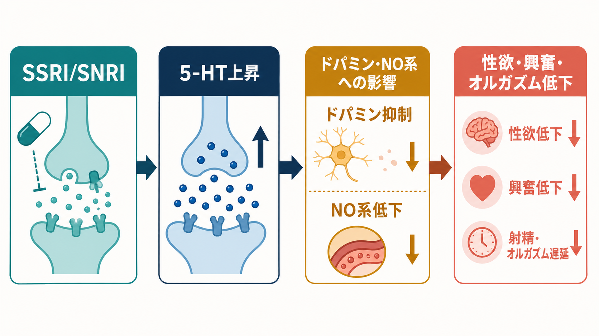
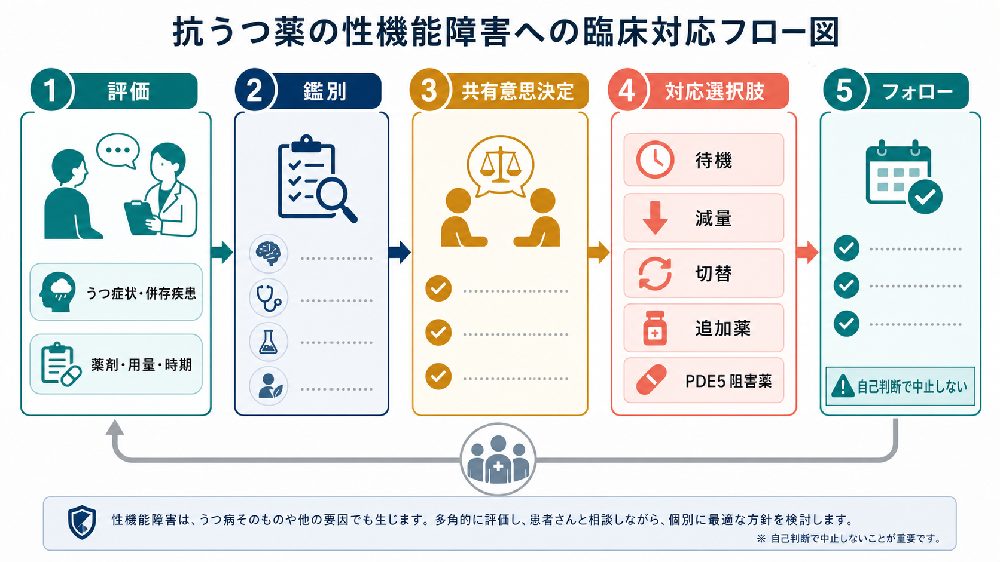

# 抗うつ薬の性機能障害とは何か

## 要点

- 抗うつ薬の性機能障害は、性欲、興奮、勃起、潤滑、射精、オルガズム、満足感のいずれかが、薬物療法の開始・増量・併用後に新たに悪化する状態である。
- とくに[[SSRIとは何か|SSRI]]、[[SNRIとは何か|SNRI]]、クロミプラミンなどのセロトニン作動性が強い薬で問題になりやすい。一方、ブプロピオン、ミルタザピン、ボルチオキセチン、アゴメラチンなどは、系統的評価では相対的に性機能への影響が少ない薬として扱われることが多い[1]。
- 性機能障害はうつ病そのもの、不安、身体疾患、ホルモン、対人関係、アルコール、他の薬剤でも起こるため、「抗うつ薬だけが原因」と急いで決めない。
- 対応は、自己判断で中止することではなく、ベースライン評価、時期と用量の確認、鑑別、本人の価値観に沿った[[共同意思決定とは何か|共同意思決定]]、フォローアップを組み合わせる。
- まれだが、SSRI/SNRI中止後も性機能症状が続く報告があり、欧州医薬品庁は2019年に添付文書上の注意喚起を求めている[7]。

## この記事で答える問い

1. 抗うつ薬による性機能障害では、どのような症状が起こるのか。
2. なぜSSRI/SNRIで性欲低下や射精・オルガズム障害が起こりやすいのか。
3. うつ病そのもの、身体疾患、関係性の問題、他薬剤の影響とどう区別するのか。
4. 臨床では、待機、減量、切替、追加薬、PDE5阻害薬などをどう位置づけるのか。
5. PSSD、すなわち中止後にも続く性機能障害をどう説明すべきか。

## まず結論

抗うつ薬の性機能障害は、治療の「些細な副作用」ではなく、生活の質、親密な関係、自己評価、[[アドヒアランスとは何か|アドヒアランス]]に直接影響する有害事象である[2]。とくにSSRI/SNRIでは、性欲の低下、興奮の低下、勃起困難、潤滑低下、射精遅延、オルガズム遅延・無オルガズムが問題になりやすい[2][5]。

ただし、性機能はうつ病、不安、疲労、疼痛、睡眠、ホルモン、糖尿病・循環器疾患、薬剤併用、関係性、文化的な話しにくさに強く左右される。そのため、抗うつ薬の開始前または早期にベースラインの性機能を確認し、治療中の変化を系統的に聞くことが重要である[1][4]。

対応は、症状が軽く治療効果が大きい場合の経過観察、用量調整、投与タイミングの調整、性機能への影響が少ない薬への切替、ブプロピオンなどの追加、勃起障害に対するPDE5阻害薬などを、再発リスクや中止症候群とあわせて検討する[2][3]。いずれも個別の処方指示ではなく、本人と処方医が相談して決める臨床判断である。

## 背景

抗うつ薬は、うつ病、不安症、強迫症、PTSD、慢性疼痛などで広く使われる。薬物療法が有効な人がいる一方で、性機能障害は治療継続を難しくする代表的な副作用である。問題は、患者から自発的に話しにくく、臨床側も十分に尋ねないと見逃しやすい点にある[2]。

CANMAT 2023/2024の成人うつ病ガイドラインは、性機能障害がうつ病自体の症状でもあるため、治療開始前の性機能評価が治療出現性の副作用を見分けるうえで重要だと述べている[1]。NICEの成人うつ病ガイドラインも、薬物療法を話し合う際に、本人が避けたい副作用、たとえば体重増加、鎮静、性機能への影響を含めて検討することを推奨している[4]。

この論点は医療安全の問題でもある。性機能障害がつらいにもかかわらず相談できないと、本人は薬を自己判断で減量・中止しやすくなる。その結果、[[抗うつ薬中止症候群とは何か|抗うつ薬中止症候群]]、症状再燃、治療関係の悪化が起こりうる。

## 基本概念

### 治療出現性性機能障害

抗うつ薬の文脈では、治療出現性性機能障害、英語では treatment-emergent sexual dysfunction; TESD と呼ばれることがある。これは、治療開始前にはなかった、または軽かった性機能の問題が、薬物療法の開始・増量・併用後に新たに出現または悪化するという考え方である[2]。

症状は、性反応の相ごとに整理すると理解しやすい。

| 相 | 起こりうる症状 | 臨床での聞き方の例 |
|---|---|---|
| 欲求 | 性欲低下、性的関心の低下 | 「治療前と比べて、性的な関心や欲求に変化がありますか」 |
| 興奮 | 勃起困難、潤滑低下、身体的反応の低下 | 「身体の反応が以前より起こりにくい、維持しにくい感じはありますか」 |
| オルガズム | 遅延、無オルガズム、快感低下 | 「達しにくさ、快感の弱さ、射精やオルガズムの遅れはありますか」 |
| 満足・苦痛 | 満足感低下、関係性への影響、服薬忌避 | 「その変化はどのくらい困りごとになっていますか」 |

### 薬剤ごとのリスク差

セロトニン作動性の強い薬、特にSSRI/SNRI、クロミプラミンでは性機能障害が多い。CANMATは、性機能が系統的に評価された研究では、デスベンラファキシン、ブプロピオン、ミルタザピン、ビラゾドン、ボルチオキセチン、アゴメラチンなどが相対的に性機能副作用の少ない薬として報告されていると整理している[1]。

ただし、「少ない」は「起こらない」ではない。[[NaSSAとは何か|NaSSA]]であるミルタザピンでは性機能への影響が少ない一方で、鎮静や体重増加が問題になることがある。[[薬物療法のリスクベネフィットをどう考えるか|薬物療法のリスクベネフィット]]は、性機能だけでなく、うつ症状への効果、眠気、体重、疼痛、併存疾患、妊娠可能性、過去の反応を含めて評価する。

## 仕組み

SSRI/SNRIによる性機能障害の機序は単一ではない。古典的には、セロトニン神経伝達の増加、とくに5-HT2/5-HT3受容体を介する作用、ドパミン低下、コリン・α1アドレナリン系の影響、一酸化窒素合成の抑制、プロラクチン上昇などが候補として挙げられてきた[5]。

性欲や報酬感にはドパミン系が関与し、興奮や勃起・潤滑には末梢血管反応や一酸化窒素系が関与する。射精やオルガズムには脊髄反射、中枢の報酬系、ノルアドレナリン系、セロトニン系のバランスが関わる。SSRI/SNRIでセロトニン作動性が強まると、この複数の系のバランスが変わり、欲求、興奮、射精・オルガズムの各段階で症状が出ると考えられる[2][5]。

重要なのは、機序が「セロトニンが多いから性機能が下がる」という単純な一文では尽くせないことである。性機能は身体、情動、報酬予測、対人関係、自己評価、薬理作用の重なりで成立するため、治療では薬理学的対応と心理社会的配慮を分けずに扱う必要がある。

## 図解

上の1枚目は、症状、起こりやすい薬、相談して調整するという全体像を示している。2枚目は、SSRI/SNRIから5-HT上昇、ドパミン・NO系への影響、性欲・興奮・オルガズム低下へ向かう代表的な機序をまとめたものである。

3枚目は臨床対応の流れである。評価、鑑別、共同意思決定、対応選択肢、フォローという順序をとることで、「性機能障害があるから薬をすぐやめる」でも「副作用だから我慢する」でもない対応にできる。

## 臨床・研究との接続

### 評価の第一歩

臨床では、薬剤開始前または早期に、性機能のベースラインを確認する。これは、性的な話題を詳細に聞き出すためではなく、後で変化が起きたときに、うつ病の症状、身体疾患、薬剤性を切り分けやすくするためである[1]。

最低限、次の項目を確認する。

| 項目 | 確認する理由 |
|---|---|
| 発症時期 | 開始・増量・併用後に一致するかを見る |
| うつ症状・不安 | 性欲低下が疾患そのものから来ていないかを見る |
| 身体疾患 | 糖尿病、循環器疾患、内分泌疾患、疼痛、睡眠障害を確認する |
| 他薬剤 | 抗精神病薬、降圧薬、ホルモン薬、アルコールなどを確認する |
| 苦痛度 | 症状の有無より、本人にとっての困りごとの大きさを確認する |
| 治療優先順位 | 再発予防、性機能、眠気、体重、疼痛などの優先度を話し合う |

この評価は、[[インフォームドコンセントは精神科でどう行うのか|インフォームドコンセント]]と[[共同意思決定とは何か|共同意思決定]]の一部である。性機能は本人が話しにくい領域なので、医療者側から「この薬では性欲やオルガズムに変化が出ることがあります。困る変化があれば調整できます」と中立的に伝えることが実践上重要である。

### 対応の選択肢

Cochraneレビューは、抗うつ薬誘発性性機能障害への介入を検討した23件、計1886人のランダム化研究をまとめ、男性の勃起障害にはシルデナフィルやタダラフィルが有効そうであり、女性の抗うつ薬誘発性性機能障害には高用量ブプロピオン追加が有望だが、確信をもって推奨するにはさらなるデータが必要と整理している[3]。

臨床レビューでは、低性欲には非セロトニン作動性薬への切替、減量、ブプロピオンやアリピプラゾール追加、オルガズム遅延には減量や切替、勃起障害にはPDE5阻害薬追加などが候補として挙げられる。ただし、薬物相互作用、再発リスク、躁転リスク、焦燥、体重増加、眠気、禁忌を個別に確認する必要がある[2]。

| 方針 | 向いている状況 | 注意点 |
|---|---|---|
| 経過観察 | 軽度で、治療効果が明確、本人の苦痛が小さい | 「我慢させる」形にしない |
| 用量調整 | 用量依存性が疑われる | 再燃・中止症候群に注意 |
| 投与タイミング調整 | 一部の短時間作用薬で検討されることがある | 根拠は限定的で、自己判断は避ける |
| 切替 | 性機能障害が強く、他薬で治療目標を保てそうな場合 | 切替期の再燃・離脱症状を監視 |
| 追加薬 | 抗うつ効果を維持しつつ副作用を軽減したい場合 | 追加薬自体の副作用と相互作用を見る |
| PDE5阻害薬 | 主に勃起障害が中心の場合 | 心血管リスク、硝酸薬併用などを確認 |
| 心理教育・カップル支援 | 不安、回避、関係性の影響が大きい場合 | 薬剤性の訴えを心理化しすぎない |

ボルチオキセチンへの切替については、SSRIでうつ症状が安定しているが性機能障害を経験している成人を対象に、ボルチオキセチンとエスシタロプラムへの切替を比較した8週間RCTがある。ボルチオキセチン群ではCSFQ-14総得点の改善がエスシタロプラム群より大きく、抗うつ効果は両群で維持された[6]。ただし、薬剤選択は利用可能性、保険、既往反応、悪心などの副作用を含めて判断する。

### PSSDをどう位置づけるか

PSSD、すなわち post-SSRI sexual dysfunction は、SSRI使用中に出現した性機能障害が中止後も続く状態として議論される。症状としては、性欲低下、性器感覚低下、快感の乏しいオルガズム、勃起障害などが報告される[8]。

頻度は不明で、機序も確立していない。にもかかわらず、存在しないものとして扱うのは適切ではない。欧州医薬品庁のPRACは2019年、SSRI/SNRIで性機能障害が起こりうること、症状が中止後も続いた報告があることを製品情報へ反映するよう勧告した[7]。

臨床的には、PSSDを理由に抗うつ薬を一律に避けるのではなく、開始前に性機能への影響を説明し、開始後に系統的に確認し、問題が出た場合に早めに相談できる状態を作ることが重要である。既に中止後も症状が続く場合は、単なる不安や関係性の問題として片づけず、身体疾患、内分泌、薬剤、泌尿器・婦人科的要因、精神症状を含めて再評価する。

## よくある誤解

### 「性機能障害は治療上あまり重要ではない」

重要である。性機能障害は、生活の質、親密な関係、自己評価、服薬継続に影響する。本人が話しにくいからといって、臨床的重要性が低いわけではない[2]。

### 「抗うつ薬をやめれば必ずすぐ戻る」

多くの症状は調整や中止後に改善しうるが、常に即時に戻るとは限らない。中止症候群や再燃が起こることもあり、まれに中止後も性機能症状が続く報告がある[7][8]。自己判断で急に中止しない。

### 「性欲低下があれば薬剤性に決まっている」

決まっていない。うつ病そのもの、[[併存症とは何か|併存症]]、疲労、睡眠、疼痛、内分泌、対人関係、過去のトラウマ、他薬剤でも性機能は変化する。薬剤性を疑うことと、他要因を評価することは両立する。

### 「副作用が嫌なら治療を受けない方がよい」

これも単純化である。未治療のうつ病や不安が性機能を悪化させることもある。大切なのは、治療しないリスク、治療する利益、性機能障害のリスク、代替手段を同じテーブルに置いて話し合うことである。

## 関連ノート

- [[SSRIとは何か]]
- [[SNRIとは何か]]
- [[NaSSAとは何か]]
- [[三環系抗うつ薬とは何か]]
- [[抗うつ薬中止症候群とは何か]]
- [[薬物療法のリスクベネフィットをどう考えるか]]
- [[共同意思決定とは何か]]
- [[アドヒアランスとは何か]]
- [[インフォームドコンセントは精神科でどう行うのか]]
- [[併存症とは何か]]

### 関連ノート候補

- 抗うつ薬と妊娠・授乳
- ブプロピオンとは何か
- ボルチオキセチンとは何か
- PDE5阻害薬とは何か
- PSSDとは何か
- 精神科薬物療法における副作用の聞き方

### MOC更新候補

- `content/00_MOC/MOC｜臨床実践・治療.md`
- `content/00_MOC/MOC｜精神医学.md`

並列記事生成ジョブとの競合を避けるため、本ジョブではMOC本文は更新していない。

## 理解チェック

1. 抗うつ薬の性機能障害を、欲求、興奮、オルガズム、満足・苦痛の4領域に分けて説明できるか。
2. SSRI/SNRIで性機能障害が起こりやすい理由を、5-HT、ドパミン、NO系、プロラクチンの観点から説明できるか。
3. うつ病そのものによる性機能低下と、治療出現性の性機能障害を区別するために、どの時点の情報が重要か。
4. 減量、切替、追加薬、PDE5阻害薬、心理教育のそれぞれについて、利点と注意点を1つずつ挙げられるか。
5. PSSDについて、「頻度や機序は未確立だが、中止後も続く報告があり、事前説明とフォローが必要」と説明できるか。

## 未解決問題

- PSSDの頻度、危険因子、自然経過を推定する質の高い前向き研究はまだ不足している。
- 性機能障害の評価尺度は研究では使われるが、日常診療で短時間に使いやすい聞き方と記録法はさらに整備が必要である。
- ブプロピオン、ボルチオキセチン、ミルタザピン、PDE5阻害薬などの選択を、性別、年齢、併存疾患、症状相別に最適化する研究が必要である。
- 性機能障害を薬剤性として適切に扱いつつ、心理社会的要因を過小評価しない統合的な支援モデルが求められる。

## 参考文献

[1] Lam, R. W., Kennedy, S. H., Adams, C., et al. (2024). Canadian Network for Mood and Anxiety Treatments (CANMAT) 2023 Update on Clinical Guidelines for Management of Major Depressive Disorder in Adults. *The Canadian Journal of Psychiatry, 69*(9). https://doi.org/10.1177/07067437241245384

[2] Montejo, A. L., Montejo, L., & Navarro-Cremades, F. (2019). Management Strategies for Antidepressant-Related Sexual Dysfunction: A Clinical Approach. *Journal of Clinical Medicine, 8*(10), 1640. https://doi.org/10.3390/jcm8101640

[3] Taylor, M. J., Rudkin, L., Bullemor-Day, P., Lubin, J., Chukwujekwu, C., & Hawton, K. (2013). Strategies for managing sexual dysfunction induced by antidepressant medication. *Cochrane Database of Systematic Reviews*, CD003382. https://doi.org/10.1002/14651858.CD003382.pub3

[4] National Institute for Health and Care Excellence. (2022). *Depression in adults: treatment and management* (NICE guideline NG222). https://www.ncbi.nlm.nih.gov/books/NBK583074/

[5] Keltner, N. L., McAfee, K. M., & Taylor, C. L. (2002). Mechanisms and treatments of SSRI-induced sexual dysfunction. *Perspectives in Psychiatric Care, 38*(3), 111-116. https://pubmed.ncbi.nlm.nih.gov/12385082/

[6] Jacobsen, P. L., Mahableshwarkar, A. R., Chen, Y., Chrones, L., & Clayton, A. H. (2015). Effect of vortioxetine vs. escitalopram on sexual functioning in adults with well-treated major depressive disorder experiencing SSRI-induced sexual dysfunction. *The Journal of Sexual Medicine, 12*(10), 2036-2048. https://doi.org/10.1111/jsm.12980

[7] European Medicines Agency, Pharmacovigilance Risk Assessment Committee. (2019). *PRAC recommendations on signals adopted at the 13-16 May 2019 PRAC meeting: SSRIs/SNRIs and persistent sexual dysfunction after drug withdrawal*. https://www.ema.europa.eu/en/documents/prac-recommendation/prac-recommendations-signals-adopted-13-16-may-2019-prac-meeting_en.pdf

[8] Bala, A., Nguyen, H. M. T., & Hellstrom, W. J. G. (2018). Post-SSRI Sexual Dysfunction: A Literature Review. *Sexual Medicine Reviews, 6*(1), 29-34. https://doi.org/10.1016/j.sxmr.2017.07.002
