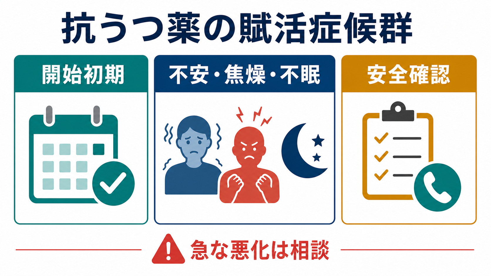
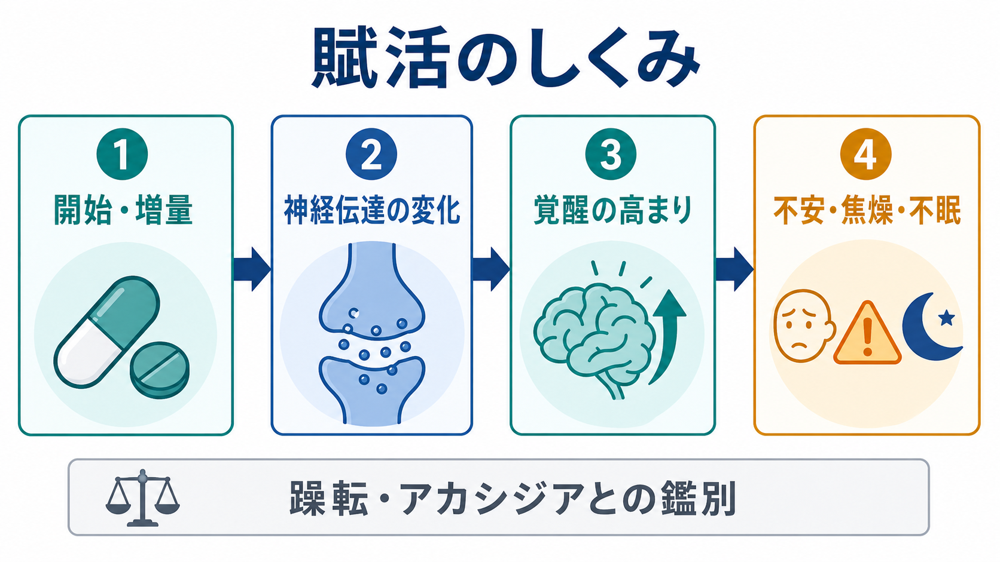
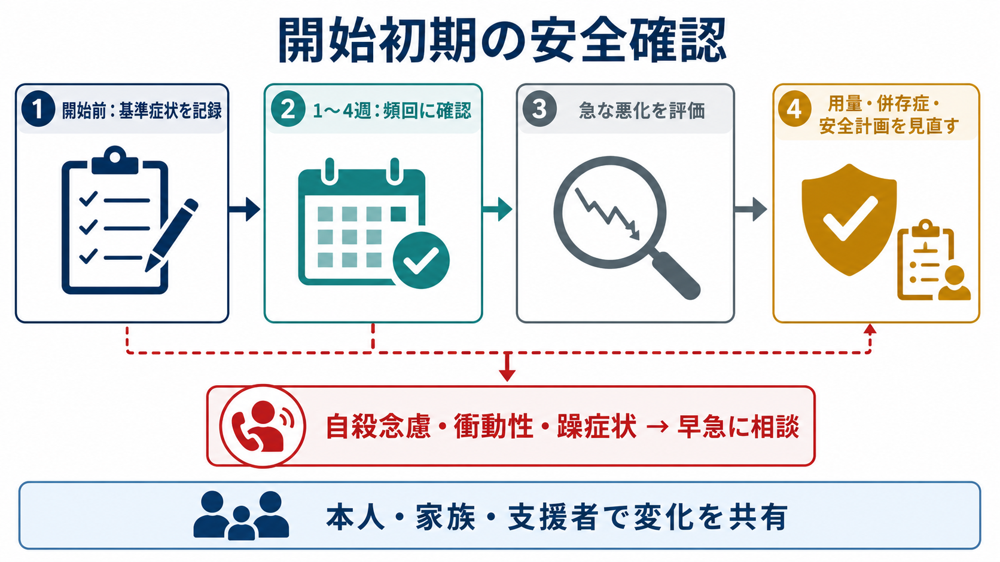

# 抗うつ薬の賦活症候群とは何か

## 要点

- 抗うつ薬の賦活症候群とは、開始初期や増量後に、不安、焦燥、不眠、易刺激性、衝動性、アカシジア、軽躁・躁症状などが新たに出る、または急に強まる現象を指す。
- FDA ラベルでは、これらの変化はとくに治療初期や用量変更時に注意すべき症状として列挙され、重い場合や急な場合には自殺念慮・自殺行動リスクと関連しうるため、慎重な観察が求められている[1]。
- ただし、賦活症候群は「抗うつ薬を使うと必ず自殺リスクが上がる」という意味ではない。うつ病そのもの、自殺リスク、薬剤性の変化、[[アカシジアとは何か]]、[[躁状態とは何か]]・[[軽躁状態とは何か]]、不安症状の自然経過を分けて評価する必要がある。
- 本記事は教育・研究目的の整理であり、個別の服薬開始・中止・増減量の指示ではない。

## この記事で答える問い

1. 抗うつ薬の賦活症候群では、どのような症状が問題になるのか。
2. なぜ開始初期や増量後に、不安・[[焦燥とは何か|焦燥]]・[[不眠とは何か|不眠]]が目立つことがあるのか。
3. 自殺リスク管理では、どの時期に何を観察すべきか。
4. 原疾患の悪化、アカシジア、躁転とはどう区別して考えるのか。

## まず結論

賦活症候群は、「抗うつ薬の効果が出る前に、覚醒・不安・運動性の副作用が先に目立つことがある」と考えると理解しやすい。臨床的に重要なのは、症状名を付けること自体ではなく、開始前の基準症状と比べて、急な不安増悪、そわそわして座っていられない感じ、睡眠悪化、衝動性、攻撃性、自殺念慮、軽躁・躁症状が出ていないかを早めに確認することである[1][3]。

## 背景

抗うつ薬、とくに SSRI や SNRI は、[[うつ病とは何か]]、不安症、強迫症状、疼痛など複数の領域で用いられる。一方、開始直後から数日から数週の時期には、吐き気、頭痛、眠気だけでなく、神経精神症状として不安、焦燥、睡眠障害、易刺激性、落ち着かなさが出ることがある。

この現象は、英語圏では activation syndrome、jitteriness/anxiety syndrome などと呼ばれてきた。用語は完全には統一されておらず、研究によって含める症状、観察期間、評価方法が異なる。そのため、頻度の推定には幅がある。後方視的研究では 729 例中 31 例、4.3% が activation syndrome と分類され[5]、前向き自然観察研究では 301 例中 21 例、7.0% が jitteriness/anxiety syndrome と分類された[6]。一方、系統的レビューは、定義と測定が不均一で、堅牢な頻度推定や機序の確定には限界があると整理している[7]。

自殺リスクとの関係は慎重に読む必要がある。FDA は小児・青年の短期プラセボ対照試験の統合解析で、自殺関連事象が抗うつ薬群 4%、プラセボ群 2% と報告され、治療初期数か月でリスクが高いとした[2]。ただし、これを単純に全患者・全薬剤・全状況に一般化することはできない。[[自殺念慮と自殺企図は何が違うのか]]、[[気分障害における自殺リスクとは何か]]、[[自殺リスク評価では何を聞くべきか]]の観点で、疾患そのもののリスクと薬剤開始後の急な変化を同時に見る必要がある。

## 基本概念

賦活症候群で問題にする症状は、単一の診断名というより「開始・増量と時間的に近い、覚醒過剰方向の症状群」である。典型的には次のように整理できる。

| 観察する変化 | 例 | 鑑別で考えること |
|---|---|---|
| 不安の増悪 | そわそわする、緊張が抜けない、パニック様の高まり | [[不安症群とは何か]]、原疾患の悪化、カフェイン・身体疾患 |
| 焦燥・易刺激性 | いらいら、怒りっぽさ、落ち着かなさ | [[焦燥とは何か]]、混合特徴、躁転 |
| 不眠 | 入眠困難、中途覚醒、睡眠時間の急な短縮 | [[不眠とは何か]]、躁症状、生活リズム変化 |
| 衝動性 | いつもより危険な行動、攻撃性、自己破壊的行動 | 自殺リスク、物質使用、境界性パターン |
| アカシジア | 内的なむずむず、座っていられない、歩き回る | [[薬剤性アカシジアとは何か]]、不安との鑑別 |
| 軽躁・躁症状 | 活動性増加、睡眠欲求低下、多弁、誇大性 | [[双極性障害とは何か]]、抗うつ薬関連の躁転 |

重要なのは「新しく出たのか」「元からあったが強まったのか」「生活機能や安全に影響しているのか」である。抗うつ薬開始前から不安や不眠が強い場合、開始後の症状をすべて薬剤性と決めつけると、原疾患の悪化や自殺危機を見落とす。逆に、すべてを原疾患として扱うと、用量や薬剤選択の見直しが遅れる。

## 仕組み

機序は一つに確定していない。SSRI/SNRI は投与直後からシナプス間隙のセロトニンやノルアドレナリンに影響するが、抗うつ効果として観察される気分・意欲の改善には、受容体調整、神経回路の再調整、睡眠・行動変化など時間のかかる過程が関与する。つまり、神経伝達の急な変化と臨床的改善の時間差がある。

その時間差の中で、一部の人では覚醒水準、不安系、運動性の調整が不安定になり、不眠や焦燥が前景化する可能性がある。小児・青年を対象にしたレビューでは、activation は衝動性、落ち着かなさ、不眠を含む過覚醒イベントとして整理され、薬物動態、年齢、用量上昇、基礎疾患、併存症などが関与しうるとされている[8]。

ただし、機序モデルを過度に単純化してはいけない。賦活症候群らしく見える状態には、少なくとも次の複数の経路が混じる。

- 薬剤開始・増量後に、覚醒や不安の副作用が先に出る。
- 治療開始時点で、うつ病や不安症の症状が自然経過として悪化している。
- アカシジアが「強い不安」「焦燥」として訴えられている。
- 双極スペクトラムがあり、抗うつ薬を契機に軽躁・躁方向の変化が目立つ。
- 自殺念慮がもともとあり、活動性・衝動性の変化によって安全上のリスクが上がる。

## 図解

開始初期の管理では、「症状が出るかどうか」だけでなく、開始前の基準、家族・支援者が観察できる変化、本人が連絡する基準を共有しておくことが重要である。NICE は成人うつ病の抗うつ薬処方時に、初期にどう影響されうるか、効果発現までの期間、初回レビュー時期、定期モニタリングの必要性を説明することを推奨している[3]。また、18〜25歳または自殺リスクが懸念される人では、開始または増量後 1 週間で自殺関連の確認を行い、その後も必要に応じて、遅くとも 4 週間以内に再確認することを推奨している[3]。

児童青年では、さらに慎重な監視が必要になる。NICE は、中等症から重症の児童青年期うつ病で抗うつ薬を用いる場合、心理療法との併用、専門的評価、副作用と精神状態の注意深い観察を求め、治療開始後 4 週間は本人と保護者への週1回程度の接触を例示している[4]。また、自殺行動、自傷、敵意の出現を治療初期に注意深く観察し、新しい症状があれば緊急に連絡するよう本人・保護者に伝えることも推奨されている[4]。

## 臨床・研究との接続

### 開始前に基準症状を記録する

賦活症候群を評価するには、開始前の状態が必要である。睡眠時間、入眠困難、焦燥、パニック、希死念慮、衝動性、攻撃性、軽躁症状、物質使用、カフェイン、身体疾患、既往の薬剤反応を確認しておく。これは、薬剤性変化と疾患の自然経過を分けるためだけでなく、本人や家族が「どの変化なら連絡するか」を具体化するためでもある。

### 自殺リスクは「念慮の有無」だけで終わらせない

賦活症候群で問題になるのは、希死念慮そのものに加えて、焦燥、睡眠不足、衝動性、アカシジア、孤立、飲酒、手段へのアクセスが重なることである。したがって、[[自殺リスク評価では何を聞くべきか]]では、念慮、計画、手段、過去の企図、保護因子、支援者、緊急時の連絡先を合わせて確認する。

### 用量と時間経過を見る

症状が、開始直後、増量直後、飲み忘れ後、併用薬変更後のどこで出たかは重要である。DailyMed の抗うつ薬ラベルでも、治療初期および用量調整時に、急な行動・気分変化を観察することが強調されている[1]。研究上も、観察期間を 1か月に置くか 3か月に置くかで頻度は変わりうる[5][6]。

### 「中止すればよい」と短絡しない

賦活症候群が疑われるときに検討される対応には、観察頻度を上げる、用量を戻す・下げる、投与時刻を変える、別薬へ変更する、アカシジアや不眠への一時的対応を行う、双極性障害の再評価を行う、安全計画を強める、専門医へ相談する、などがある。ただし、自己判断による急な中止は離脱症状や原疾患悪化を招きうるため、服薬変更は処方者と相談して行うべきである[3]。

## よくある誤解

### 誤解1: 賦活症候群は抗うつ薬アレルギーである

アレルギー反応ではない。神経精神症状の副作用、原疾患の悪化、アカシジア、躁転などが混じる臨床的な観察カテゴリーである。

### 誤解2: 不安や不眠が出たら、必ず賦活症候群である

不安や不眠は、うつ病、不安症、身体疾患、疼痛、カフェイン、生活ストレス、離脱症状でも起こる。開始前の症状、時間関係、急な変化、身体症状、運動性、躁症状、自殺リスクを合わせて判断する。

### 誤解3: 賦活症候群は軽い副作用なので安全確認はいらない

軽い不眠や一過性のそわそわで終わることもあるが、急な焦燥、衝動性、アカシジア、自殺念慮、躁症状を伴う場合は安全上の問題になる。NICE も、治療初期の焦燥・不安・自殺念慮への注意、家族・介護者の警戒、必要時の治療見直しを推奨している[3]。

### 誤解4: 自殺リスクがある人には抗うつ薬を使ってはいけない

そうではない。自殺リスクがある場合でも、うつ病治療をリスクだけを理由に差し控えないこと、ただし過量服薬毒性、処方量、支援頻度、専門医連携を考えることが推奨されている[3]。薬を使うかどうかより、「どの支援構造で安全に治療するか」が重要である。

## 関連ノート

- [[うつ病とは何か]]
- [[不安症群とは何か]]
- [[焦燥とは何か]]
- [[不眠とは何か]]
- [[アカシジアとは何か]]
- [[薬剤性アカシジアとは何か]]
- [[双極性障害とは何か]]
- [[躁状態とは何か]]
- [[軽躁状態とは何か]]
- [[精神症状の横断的評価とは何か]]
- [[自殺念慮と自殺企図は何が違うのか]]
- [[自殺リスク評価では何を聞くべきか]]
- [[薬物療法は神経回路にどう作用するのか]]

## MOC更新候補

- [[MOC｜臨床実践・治療]] の「薬物療法」領域
- [[MOC｜疾患・症候群]] の「気分障害・自殺関連」領域
- [[MOC｜症候学]] の「焦燥・不眠・アカシジア」関連領域

## 理解チェック

1. 賦活症候群を疑うとき、開始前の基準症状を確認する理由は何か。
2. 不安・焦燥・不眠が出たとき、原疾患の悪化、アカシジア、躁転をどう分けて考えるか。
3. 18〜25歳または自殺リスクが懸念される人で、開始・増量後 1 週間の確認が重要とされる理由は何か。
4. 本人だけでなく家族・支援者に共有しておくべき変化には何があるか。
5. 自己判断で抗うつ薬を急に中止することが問題になりうる理由は何か。

## 未解決問題

- 賦活症候群の標準化された定義と評価尺度を、成人・児童青年でどのように統一できるか。
- どの症状パターンが、自殺念慮・自傷・自殺企図のリスク上昇と強く結びつくのか。
- 薬剤クラス、開始用量、増量速度、薬物動態、年齢、双極スペクトラム、発達特性、パーソナリティ特性は、どの程度リスクを変えるのか。
- 早期フォロー、家族教育、睡眠介入、アカシジア評価、安全計画のどの組み合わせが、実際の有害事象を減らすのか。

## 参考文献

[1] DailyMed. *Fluoxetine: Clinical Worsening and Suicide Risk / Medication Guide*. National Library of Medicine. https://dailymed.nlm.nih.gov/dailymed/medguide.cfm?setid=ea1c989b-3395-4e68-a300-f0f042969c4f

[2] U.S. Food and Drug Administration. *Suicidality in Children and Adolescents Being Treated With Antidepressant Medications*. 2004. https://www.fda.gov/drugs/postmarket-drug-safety-information-patients-and-providers/suicidality-children-and-adolescents-being-treated-antidepressant-medications

[3] National Institute for Health and Care Excellence. *Depression in adults: treatment and management. NICE guideline NG222*. 2022. https://www.nice.org.uk/guidance/ng222/chapter/Recommendations

[4] National Institute for Health and Care Excellence. *Depression in children and young people: identification and management. NICE guideline NG134*. 2019, updated. https://www.nice.org.uk/guidance/ng134/chapter/Recommendations

[5] Harada T, Sakamoto K, Ishigooka J. Incidence and predictors of activation syndrome induced by antidepressants. *Depression and Anxiety*. 2008;25(12):1014-1019. https://doi.org/10.1002/da.20438

[6] Harada T, Inada K, Yamada K, Sakamoto K, Ishigooka J. A prospective naturalistic study of antidepressant-induced jitteriness/anxiety syndrome. *Neuropsychiatric Disease and Treatment*. 2014;10:2115-2121. https://doi.org/10.2147/NDT.S70637

[7] Sinclair LI, Christmas DM, Hood SD, et al. Antidepressant-induced jitteriness/anxiety syndrome: systematic review. *The British Journal of Psychiatry*. 2009;194(6):483-490. https://doi.org/10.1192/bjp.bp.107.048371

[8] Luft MJ, Lamy M, DelBello MP, McNamara RK, Strawn JR. Antidepressant-Induced Activation in Children and Adolescents: Risk, Recognition and Management. *Current Problems in Pediatric and Adolescent Health Care*. 2018;48(2):50-62. https://doi.org/10.1016/j.cppeds.2017.12.001
