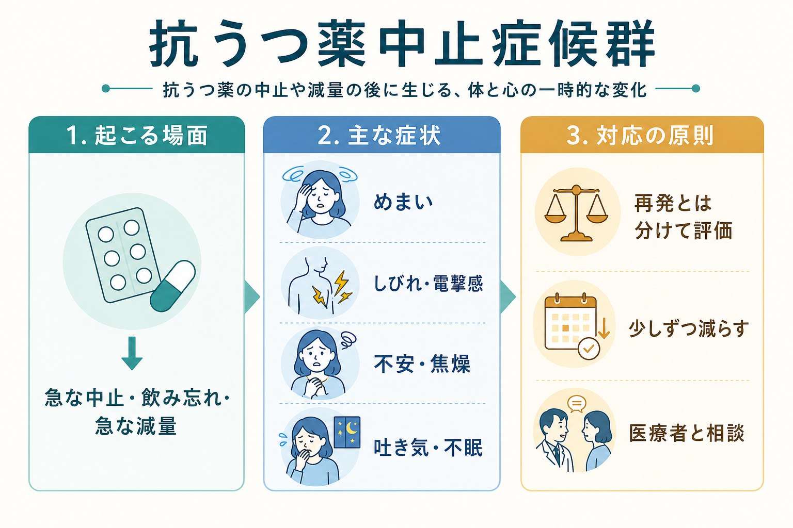
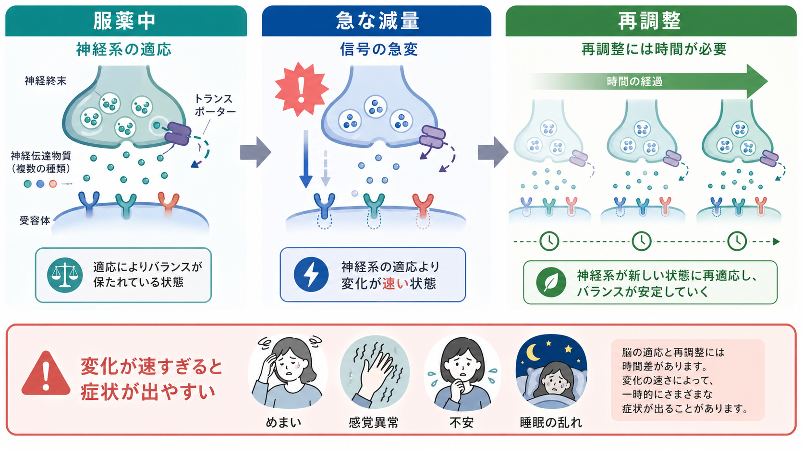
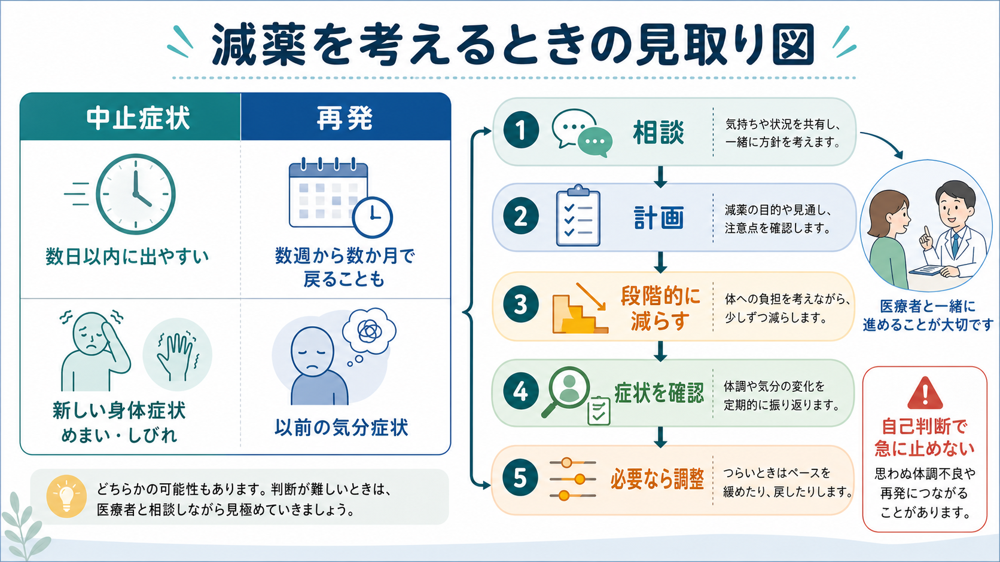

# 抗うつ薬中止症候群とは何か

## 要点

- 抗うつ薬中止症候群とは、抗うつ薬を急に止めた、飲み忘れた、または急に減らした後に、めまい、吐き気、不眠、しびれ・電撃感、不安、焦燥などが出る状態である。[1][3]
- 典型的には減量・中止から数日以内に出やすいが、薬の半減期、服用期間、用量、過去の中止症状、個人差によって経過は変わる。[1][2]
- うつ病や不安症の再発と似ることがあるが、「新しい身体症状」「急な時間経過」「再開・増量後に比較的速く軽くなること」などは中止症状を疑う手がかりになる。[1][3]
- 減薬は、本人と処方者が相談し、症状を見ながら段階的に進める。特に低用量域では、同じ量の減量でも受容体占有率の変化が大きくなりうるため、小さな刻みが必要になることがある。[1][5][7]
- 本記事は教育・研究目的の整理であり、個別の中止・減量を指示するものではない。減薬を考える場合は、処方者と相談して計画する。

## この記事で答える問い

1. 抗うつ薬中止症候群は、どのような症状として現れるのか。
2. なぜ、急に止めるとめまい・しびれ・不安などが出るのか。
3. うつ病や不安症の再発とは、どのように区別して考えるのか。
4. 減薬を安全に進めるには、どのような原則があるのか。

## まず結論

抗うつ薬中止症候群は、「薬に依存して弱くなった」という単純な話ではなく、服薬中の神経系が薬の存在を前提に再調整していたところへ、急な濃度変化が起こることで生じる一時的な不均衡として理解するとよい。症状は身体感覚、睡眠、感情、消化器、自律神経にまたがるため、本人には「原因不明の体調不良」や「病気が戻った感じ」として体験されやすい。[1][3]

一方で、抗うつ薬の中止後に本当に[[うつ病とは何か|うつ病]]や[[不安症群とは何か|不安症]]が再燃することもある。したがって、臨床的には「中止症状か、再発か」を二者択一で急いで決めるよりも、時間経過、症状の質、過去のエピソード、生活ストレス、服薬状況、自殺念慮などを合わせて評価する必要がある。[1][2]

## 背景

抗うつ薬は、うつ病、不安症、強迫症、疼痛関連症状などで広く使われる。治療が有効で、再発予防のために継続が望ましい場合もある。しかし、症状が安定した、効果が乏しい、副作用がつらい、妊娠・身体疾患・相互作用などの事情がある、本人が止めたいと考える、といった理由で中止や減薬を検討する場面もある。[1][2]

問題は、抗うつ薬が「始めるとき」だけでなく「止めるとき」にも臨床的な注意を要する点である。NICE は、抗うつ薬を急に止めたり、飲み忘れたり、十分量を服用しなかったりすると中止症状が出ることがあると説明し、通常は段階的な減量が必要だとしている。[1] また、処方開始時から「あとで止める難しさと管理方法」を説明することも推奨している。[2]

## 基本概念

### 名前: 中止症候群か、離脱症状か

英語では *antidepressant discontinuation syndrome*、*withdrawal symptoms*、*withdrawal effects* などが使われる。日本語では「抗うつ薬中止症候群」「抗うつ薬離脱症状」「中止症状」などと呼ばれる。用語にはニュアンスの違いがあるが、ここでは「抗うつ薬の減量・中止後に現れる症状群」という広い意味で扱う。

重要なのは、これを「薬物を求める行動」や快感追求を伴う依存症と混同しないことである。抗うつ薬中止症候群は、報酬を求めて使用が制御できなくなる状態とは異なる。むしろ、神経系が薬の存在に適応した後、薬物濃度が急に変わることで再適応が追いつかない状態と考えるほうが臨床的に有用である。[3][5]

### 症状のまとまり

古典的には FINISH という整理が知られる。すなわち、flu-like symptoms（インフルエンザ様症状）、insomnia（不眠）、nausea（吐き気）、imbalance（ふらつき・めまい）、sensory disturbances（しびれ・電撃感などの感覚異常）、hyperarousal（不安・焦燥・過覚醒）である。[3]

NICE の成人うつ病ガイドラインも、めまい・回転感、電撃感などの感覚変化、不安・いらだち・混乱、焦燥、不眠、発汗、吐き気、動悸、疲労、頭痛、筋肉や関節の痛みなどを挙げている。[1] これらは[[症状と徴候は何が違うのか|症状と徴候]]の両方として現れうるが、本人の主観的苦痛が大きいことが多い。

## 仕組み

### 1. 服薬中の神経系は「薬がある状態」に適応する

SSRI や SNRI などの抗うつ薬は、[[セロトニンは気分だけに関わるのか|セロトニン]]やノルアドレナリンなどの神経伝達に影響する。ただし、「うつ病はセロトニン不足で、薬を止めると不足が戻る」という単純な説明では不十分である。服薬中には、トランスポーター、受容体感受性、下流の神経回路、自律神経、睡眠・覚醒リズムなどが時間をかけて再調整されると考えられる。[3][5]

### 2. 急な減量は、薬物濃度と神経適応の時間差を生む

薬物濃度は比較的短い時間で下がるが、神経系の再適応は同じ速度では進まない。特に半減期が短い薬では、飲み忘れや急な中止によって濃度変化が急になりやすい。NICE は、短い半減期の抗うつ薬、長い服用期間、高用量、過去の離脱症状などを、減薬時の問題が起こりやすい要因として考慮するよう述べている。[2]

### 3. 低用量域では「同じ mg 減らす」ことの意味が変わる

Horowitz と Taylor は、SSRI の用量と標的占有率の関係が直線的ではなく、低用量域では小さな用量変化でも相対的に大きな薬理学的変化を生みうると論じた。[5] そのため、20 mg から 10 mg への減量と、10 mg から 0 mg への中止は、錠剤の数字だけを見ると同じ幅でも、神経系にとって同じ大きさの変化とは限らない。

この考え方は、段階的・比例的な減量、すなわち「残っている量に対して一定割合ずつ減らす」「低用量になるほど刻みを小さくする」という実践的な原則につながる。ただし、具体的な速度は薬剤、剤形、リスク、本人の希望、症状の出方によって変わるため、個別の処方計画として扱う必要がある。[1][5][7]

## 図解

上の図は、服薬中の神経系が薬の存在に適応している状態、急な減量による信号変化、再調整に時間がかかる過程を示している。ポイントは、「薬が抜ける時間」と「神経系が新しい状態に慣れる時間」が一致しないことである。

下の図は、減薬を考えるときに見るべき臨床的な分岐である。中止症状と再発は重なりうるため、症状の種類だけでなく、出現時期、身体症状の新しさ、以前のエピソードとの似方、生活背景、リスク評価を合わせて考える。

## 臨床・研究との接続

### どのくらい起こるのか

頻度の推定には幅がある。2024年の Lancet Psychiatry の系統的レビュー・メタ解析は、79研究、2万人以上を対象に、抗うつ薬中止後の症状を検討し、プラセボ群での症状も考慮したうえで、抗うつ薬に起因する中止症状はおよそ 15% 程度、重度の症状は数% 程度と推定した。[4] 一方、Davies と Read の 2019年レビューは、より高い頻度や長期化する症状を報告する研究を重視し、従来の「1-2週間で自然におさまる」という説明は過小評価の可能性があると論じた。[6]

この差は、対象者、服用期間、薬剤、症状測定、プラセボ対照の有無、再発との区別、オンライン調査の扱いなどの違いに左右される。したがって、実践上は「全員が重くなる」とも「ほとんど問題にならない」とも言い切らず、本人に起こりうる症状を事前に説明し、起きた場合に調整できる計画を作るのが現実的である。[1][2][4]

### 再発との区別

中止症状は、減量・中止後の早い時期に出やすく、めまい、電撃感、吐き気、ふらつきなど、それまでの[[大うつ病性障害とは何か|うつ病エピソード]]では目立たなかった身体症状を伴うことがある。[1][3] これに対して再発は、以前の気分症状、興味の低下、希死念慮、精神運動変化、認知症状などが、数週から数か月の経過で戻ることもある。

ただし、これは絶対的な鑑別規則ではない。中止症状として不安、低 mood、涙もろさ、焦燥、睡眠障害が出ることもあり、再発でも身体症状は出る。特に自殺念慮、強い焦燥、躁状態、精神病症状、重い不眠、摂食・水分摂取の障害がある場合は、単なる中止症状として軽く扱わず、迅速な専門的評価が必要である。

### 減薬方法の原則

NICE は、抗うつ薬を止めるとき、通常は段階的に減らし、各段階で前回量に対する割合として減らすこと、低用量になるほど小さな減量を検討すること、症状が解消または耐えられる範囲になるまで次の減量を待つこと、必要に応じて液剤などを使うことを推奨している。[1] Royal College of Psychiatrists の患者向け資料も、過去に中止症状があった人や長期服用の人では、よりゆっくりした小刻みの減量が必要になりうると説明している。[7]

Maund らの系統的レビューでは、心理療法やマインドフルネス認知療法を組み合わせた減薬支援が、再発リスクを上げずに中止を助ける可能性が示されたが、研究数や実装可能性には限界がある。[8] つまり、減薬は「錠剤を何分の一にするか」だけでなく、再発予防、睡眠、ストレス対処、心理的支援、定期的なモニタリングを含む臨床プロセスである。

## よくある誤解

### 誤解1: 抗うつ薬は依存症になる薬だから中止症状が出る

中止症状が出ることと、依存症であることは同じではない。抗うつ薬は急な中止で症状を起こしうるが、典型的な依存症のような快感追求、渇望、薬物探索行動で説明されるわけではない。問題は、神経系の適応と再適応の時間差である。[3][5]

### 誤解2: 中止症状は必ず数日で終わる

多くの人では軽く、短期間でおさまることがある。一方で、数週間から数か月続く場合もあり、重く生活機能を妨げる例も報告されている。[1][6][7] したがって、短期間で終わると決めつけず、症状が強い場合や長引く場合は計画を見直す必要がある。

### 誤解3: 再発ではなく中止症状なら心配しなくてよい

中止症状でも苦痛が強ければ臨床的に重要である。また、中止症状と再発が同時に起こることもありうる。特に希死念慮、強い[[焦燥とは何か|焦燥]]、混乱、躁的な変化、幻覚・妄想、重い身体症状がある場合は、早めの相談が必要である。

### 誤解4: 減薬は誰でも同じスケジュールでよい

減薬のしやすさは、薬剤の半減期、服用期間、用量、剤形、過去の減薬経験、再発リスク、生活上の負荷、支援体制によって変わる。[1][2] ある人に合う速度が、別の人にも合うとは限らない。

## 関連ノート

- [[うつ病とは何か]]
- [[大うつ病性障害とは何か]]
- [[不安症とうつ病はどう併存するのか]]
- [[セロトニンは気分だけに関わるのか]]
- [[症状と徴候は何が違うのか]]
- [[焦燥とは何か]]

### 関連ノート候補

- 抗うつ薬とは何か
- SSRIとは何か
- SNRIとは何か
- 薬物療法における共同意思決定
- 精神科薬物療法の減薬とモニタリング

### MOC 更新候補

- `content/00_MOC/` に臨床実践・治療、精神薬理、うつ病治療の MOC がある場合、本記事を薬物療法・減薬・副作用管理の項目に追加する。
- 並列ジョブとの競合を避けるため、本記事では MOC ファイル本体は更新しない。

## 理解チェック

1. 抗うつ薬中止症候群で、再発よりも中止症状を疑いやすい時間経過と症状の特徴を説明できるか。
2. 「低用量域ほど小さく減らすことがある」理由を、用量と薬理作用の非線形性から説明できるか。
3. 中止症状、再発、重いリスクサインを区別して、どのような場合に早めの相談が必要かを説明できるか。
4. 減薬が単なる服薬量の問題ではなく、共同意思決定、モニタリング、心理社会的支援を含むプロセスである理由を説明できるか。

## 未解決問題

- 中止症状の頻度・重症度・持続期間の推定は、研究デザインによって大きく変わる。長期服用者、複数薬剤使用者、若年者、高齢者、身体疾患合併例に特化したデータはなお十分ではない。
- 最適な減薬速度、液剤や微量製剤の使い方、心理療法やピアサポートの併用効果について、実臨床に近い比較研究がさらに必要である。
- 中止症状と再発を、症状評価、時系列、デジタルモニタリング、生物学的指標でどう区別できるかは、今後の研究課題である。

## 参考文献

[1] National Institute for Health and Care Excellence. (2022). *Depression in adults: treatment and management* (NICE guideline NG222), recommendations on stopping antidepressant medication. https://www.nice.org.uk/guidance/ng222/chapter/Recommendations

[2] National Institute for Health and Care Excellence. (2022). *Medicines associated with dependence or withdrawal symptoms: safe prescribing and withdrawal management for adults* (NICE guideline NG215). https://www.nice.org.uk/guidance/ng215/chapter/Recommendations

[3] Warner, C. H., Bobo, W., Warner, C., Reid, S., & Rachal, J. (2006). Antidepressant discontinuation syndrome. *American Family Physician, 74*(3), 449-456. https://www.aafp.org/pubs/afp/issues/2006/0801/p449.html

[4] Henssler, J., Schmidt, Y., Schmidt, U., Schwarzer, G., Bschor, T., & Baethge, C. (2024). Incidence of antidepressant discontinuation symptoms: a systematic review and meta-analysis. *The Lancet Psychiatry, 11*(7), 526-535. https://doi.org/10.1016/S2215-0366(24)00133-0

[5] Horowitz, M. A., & Taylor, D. (2019). Tapering of SSRI treatment to mitigate withdrawal symptoms. *The Lancet Psychiatry, 6*(6), 538-546. https://doi.org/10.1016/S2215-0366(19)30032-X

[6] Davies, J., & Read, J. (2019). A systematic review into the incidence, severity and duration of antidepressant withdrawal effects: Are guidelines evidence-based? *Addictive Behaviors, 97*, 111-121. https://doi.org/10.1016/j.addbeh.2018.08.027

[7] Royal College of Psychiatrists. (2024). *Stopping antidepressants*. https://www.rcpsych.ac.uk/docs/default-source/mental-health/treatments-and-wellbeing/print-outs/stopping-antidepressants-information-resource-print-version-18-03-24.pdf

[8] Maund, E., Stuart, B., Moore, M., Dowrick, C., Geraghty, A. W. A., Dawson, S., & Kendrick, T. (2019). Managing antidepressant discontinuation: A systematic review. *Annals of Family Medicine, 17*(1), 52-60. https://doi.org/10.1370/afm.2336

