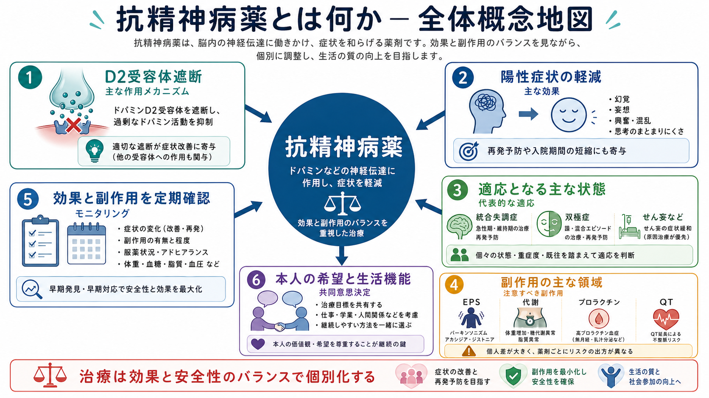
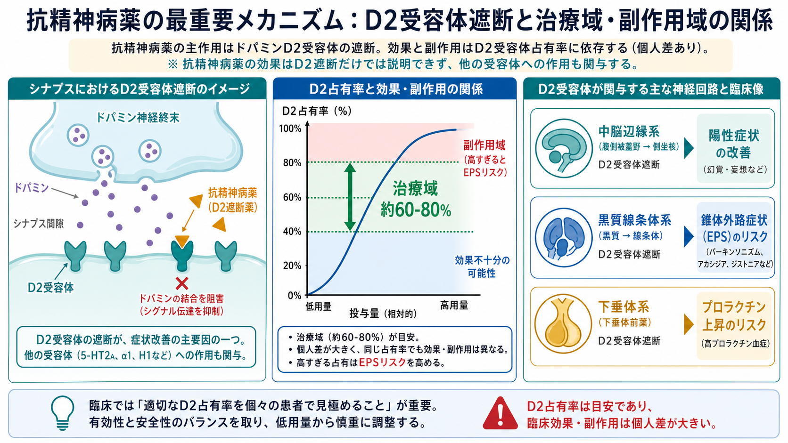
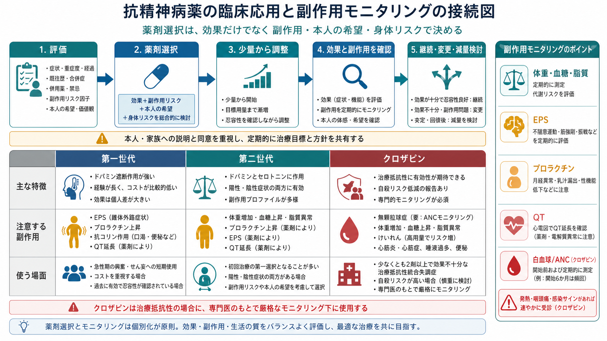

# 抗精神病薬とは何か

## 要点

- 抗精神病薬は、幻覚・妄想・思考のまとまりにくさ・興奮などの精神病症状を軽減するために使われる薬剤群であり、多くはドパミンD2受容体遮断またはD2受容体部分作動を中心に作用する。
- 主な適応は[[統合失調症とは何か|統合失調症]]、統合失調感情障害、双極症の躁状態、精神病症状を伴う気分エピソード、せん妄や認知症関連症状の一部などだが、適応・用量・期間は疾患と状況で大きく異なる[1][2]。
- 効果は陽性症状の軽減に最も明確で、陰性症状や認知機能障害への効果は限定的である。薬物療法だけでなく心理教育、家族支援、リハビリテーション、生活支援と組み合わせて考える[3]。
- 副作用には錐体外路症状（EPS）、アカシジア、遅発性ジスキネジア、体重増加・糖脂質代謝異常、眠気、抗コリン作用、高プロラクチン血症、QT延長、悪性症候群などがある[4][5]。
- 薬剤選択は「第一世代か第二世代か」だけで決まらない。効果、副作用プロファイル、身体リスク、過去の反応、本人の希望、服薬継続のしやすさを合わせて個別化する[1][6]。

## この記事で答える問い

抗精神病薬は、何を標的にして、どの症状に効き、どの副作用に注意する薬なのか。この記事では、[[ドパミン仮説は統合失調症をどこまで説明できるのか|ドパミン仮説]]と臨床薬物療法をつなぎながら、抗精神病薬を「症状を消す万能薬」ではなく、効果と副作用のバランスを調整する治療手段として整理する。

## まず結論

抗精神病薬の中心的な作用は、ドパミンD2受容体シグナルを弱めることである。特に中脳辺縁系の過剰なドパミン伝達を抑えることは、幻覚・妄想・被害的確信・思考のまとまりにくさなどの[[統合失調症の陽性症状とは何か|陽性症状]]の改善と結びつけて理解される[5][7]。

ただし、D2遮断は「効く場所」だけで起こるわけではない。黒質線条体系で強く遮断されるとパーキンソニズム、ジストニア、アカシジアなどのEPSが起こりやすくなり、下垂体漏斗系ではプロラクチン上昇が問題になる。D2受容体占有率は治療域と副作用域の目安になるが、薬剤ごとの受容体プロファイル、血中濃度、年齢、身体疾患、併用薬、個人差によって臨床像は変わる[5][7]。

## 背景

抗精神病薬は、20世紀半ばにクロルプロマジンやハロペリドールなどの第一世代薬から発展した。第一世代薬はD2遮断が強く、陽性症状への効果を示す一方、EPSや高プロラクチン血症が問題になりやすい。第二世代薬はD2遮断に加えて5-HT2A受容体遮断などを持つ薬が多く、EPSリスクが相対的に低い薬もあるが、体重増加や代謝異常、眠気、抗コリン作用などが目立つ薬もある[4][6]。

現在のガイドラインでは、抗精神病薬を成人の精神病性障害に対して提供しうる治療として位置づける一方、薬剤ごとの効果・副作用、本人の希望、身体リスクを慎重に比較することが強調されている[1][2]。これは、抗精神病薬が「診断名に対して自動的に出す薬」ではなく、治療目標とリスク評価の中で選ばれる薬であることを意味する。

## 基本概念

### 第一世代薬と第二世代薬

第一世代抗精神病薬は、定型抗精神病薬とも呼ばれる。代表例にはハロペリドール、クロルプロマジン、フルフェナジンなどがある。強力なD2遮断により急性の興奮や陽性症状に使われることがあるが、EPS、高プロラクチン血症、抗コリン作用、起立性低血圧、QT延長などに注意する。

第二世代抗精神病薬は、非定型抗精神病薬とも呼ばれる。代表例にはリスペリドン、オランザピン、クエチアピン、アリピプラゾール、パリペリドン、クロザピンなどがある。第二世代薬は一枚岩ではなく、リスペリドンのようにプロラクチン上昇に注意する薬、オランザピンやクロザピンのように体重増加・代謝異常に注意する薬、アリピプラゾールのようにD2部分作動薬として働く薬など、特徴はかなり異なる[4][6]。

### 効果が期待される症状

抗精神病薬の効果が最も明確なのは、幻覚、妄想、興奮、まとまりにくい思考などの陽性症状である。急性期には症状の苦痛や危険を下げ、入院期間の短縮や再発予防に寄与する可能性がある[2][6]。

一方、[[統合失調症の陰性症状とは何か|陰性症状]]、意欲低下、社会的ひきこもり、感情表出の乏しさ、[[認知機能障害は統合失調症でなぜ重要なのか|認知機能障害]]への効果は限定的である。眠気やEPSが強いと、むしろ活動性や認知機能が低下して見えることもあるため、症状そのものと副作用を分けて観察する必要がある。

### 継続期間と再発予防

初回精神病エピソード後に寛解した成人では、WHOは少なくとも7-12か月の維持療法を提案している[2]。長期継続や減量・中止を考える場合は、再発リスク、副作用、本人の価値観、家族・支援者との相談、早期再発サインの共有を含めて判断する。自己判断で急に中止すると、離脱症状、反跳性不眠、再発リスク上昇につながりうる。

## 仕組み

### D2受容体遮断と治療域

D2受容体占有率の研究では、抗精神病効果はおおむね60-80%前後の範囲で議論され、80%を超えるとEPSリスクが高まりやすいとされる。ただし、この値は絶対的な境界ではない。部分作動薬、クロザピン、クエチアピンのように通常の占有率モデルに単純には当てはまりにくい薬もあり、受容体占有率だけで効果や副作用を予測することはできない[5][7]。

### 神経回路ごとの意味

中脳辺縁系では、過剰なドパミン信号がサリエンス付与や陽性症状に関わると考えられる。D2遮断はこの過剰な信号を弱め、幻覚・妄想の確信度や苦痛を下げる方向に働く可能性がある。この発想は、[[ドパミンは報酬だけの物質なのか|ドパミン]]を「快楽物質」と見るより、意味づけや予測誤差、行動選択に関わる神経調節物質として見る理解と相性がよい。

黒質線条体系では、D2遮断は運動制御の副作用につながる。パーキンソニズム、急性ジストニア、アカシジア、遅発性ジスキネジアは、服薬継続や生活の質に大きく影響する。とくにアカシジアは「不安」「焦燥」「落ち着きのなさ」と誤認され、薬を増やすと悪化することがあるため、[[薬剤性アカシジアとは何か]]などと接続して理解したい。

下垂体漏斗系では、ドパミンはプロラクチン分泌を抑える。D2遮断により高プロラクチン血症が起こると、月経異常、乳汁分泌、性機能障害、骨密度への影響が問題になることがある。これは本人が言い出しにくい副作用でもあるため、定期的に尋ねる必要がある。

## 図解

3枚の図は、抗精神病薬を「全体像」「D2遮断のメカニズム」「臨床での選択とモニタリング」に分けて示している。1枚目は、効果と副作用を同時に見る全体概念地図である。2枚目は、D2受容体遮断、治療域、副作用域、神経回路別の副作用を示す。3枚目は、評価、薬剤選択、少量からの調整、効果・副作用確認、継続・変更・減量検討という臨床の流れをまとめる。

## 臨床・研究との接続

### 薬剤選択は副作用プロファイルで変わる

2019年の大規模ネットワークメタ解析では、急性期統合失調症に対する複数の抗精神病薬の有効性と忍容性には差がある一方、どの薬も「効果だけ」で選べるわけではないことが示された。体重増加、鎮静、EPS、プロラクチン、QT延長など、患者ごとに重要な副作用が異なるためである[6]。

たとえば、糖尿病リスクが高い人では体重増加・血糖上昇の少ない薬を優先することがある。強いアカシジア歴がある人では、焦燥の再燃と副作用を丁寧に見分ける。妊娠可能性、授乳、心疾患、てんかん、認知症、パーキンソン病、薬物相互作用も選択に影響する。

### クロザピンの特別な位置づけ

クロザピンは、少なくとも複数の抗精神病薬で十分な効果が得られない治療抵抗性統合失調症で重要な選択肢になる。WHOとAPAはいずれも、治療抵抗性の場合にクロザピンを検討することを推奨している[1][3]。また、自殺リスクが高い統合失調症・統合失調感情障害でも検討される。

一方で、クロザピンには無顆粒球症・重度好中球減少、心筋炎、けいれん、便秘・腸閉塞、過鎮静、流涎、体重増加・代謝異常などの重大なリスクがある。米国では2025年にクロザピンREMSが削除されたが、FDAはANCモニタリング自体は継続して重要だとしている[8]。日本を含む各国では制度が異なるため、実際の運用は地域の規制と専門医療体制に従う。

### モニタリングは「副作用が出てから」では遅い

抗精神病薬を開始する前後には、体重、BMI、腹囲、血圧、血糖またはHbA1c、脂質、肝腎機能、心電図、EPS、アカシジア、眠気、便秘、性機能、月経、プロラクチン関連症状などを確認する。NICEは開始前の体重・腹囲、脈拍・血圧、血液検査、必要時の心電図などを説明している[4]。

副作用モニタリングは、薬剤を止めるためだけの作業ではない。用量調整、服薬時間の変更、薬剤変更、身体疾患管理、生活支援、本人が続けやすい治療計画を作るための情報収集である。薬剤副作用の早期発見、身体健康管理支援、薬物療法のアドヒアランス支援と密接に関係する。

## よくある誤解

### 誤解1: 抗精神病薬は人格を変える薬である

抗精神病薬は人格を作り替える薬ではない。標的は神経伝達の調整であり、主に幻覚・妄想・興奮・思考のまとまりにくさを軽減するために使う。ただし、過鎮静、アカシジア、感情の平板化、認知鈍麻のように本人らしさや生活機能に影響して見える副作用があるため、治療目標を本人と共有しながら調整する必要がある。

### 誤解2: 第二世代薬は副作用が少ないので常に安全である

第二世代薬は第一世代薬よりEPSが少ないことが多いが、体重増加、脂質異常、糖代謝異常、眠気、便秘などが問題になる薬もある。第一世代と第二世代の二分法だけで安全性は決まらない[6]。

### 誤解3: 効かないならどんどん増量すればよい

D2占有率が高くなるほど効果が線形に増えるわけではなく、一定以上ではEPSなどの副作用が増えやすい[5]。十分量・十分期間・服薬状況・診断・併存症・物質使用・心理社会的要因を確認したうえで、変更、併用回避、LAI、クロザピン、心理社会的介入を検討する。

### 誤解4: 症状がよくなったらすぐ中止してよい

寛解後も再発予防のために一定期間の維持療法が推奨される場合がある[2]。中止や減量は、再発リスク、過去の経過、副作用、本人の希望、生活環境、早期サインへの対応計画を含めて慎重に行う。

## 関連ノート

- [[精神科薬物療法とは何か]]
- [[薬物療法のリスクベネフィットをどう考えるか]]
- [[統合失調症とは何か]]
- [[統合失調症の陽性症状とは何か]]
- [[ドパミン仮説は統合失調症をどこまで説明できるのか]]
- [[ドパミンは報酬だけの物質なのか]]
- [[アカシジアとは何か]]
- [[薬剤性アカシジアとは何か]]
- [[遅発性ジスキネジアとは何か]]
- [[高プロラクチン血症とは何か]]

作成候補:

- クロザピンとは何か
- LAIとは何か
- 薬物療法のアドヒアランスをどう支えるか
- 薬剤副作用の早期発見はどう行うか
- 身体健康管理支援とは何か

## 理解チェック

1. 抗精神病薬のD2受容体遮断は、なぜ陽性症状の軽減とEPSの両方に関係するのか。
2. 第一世代薬と第二世代薬を「古い/新しい」だけで比較すると、どの副作用を見落としやすいか。
3. 抗精神病薬の減量や中止を考えるとき、症状だけでなく何を確認する必要があるか。
4. クロザピンが治療抵抗性統合失調症で重要である一方、専門的モニタリングを要する理由は何か。

## 参考文献

[1] World Health Organization. Antipsychotic medicines for psychotic disorders. WHO mhGAP Evidence Centre, 2023 updated. https://www.who.int/teams/mental-health-and-substance-use/treatment-care/mental-health-gap-action-programme/evidence-centre/psychosis-and-bipolar-disorders/antipsychotic-medicines-for-psychotic-disorders

[2] World Health Organization. Duration of antipsychotic treatment in individuals with a first psychotic episode. WHO mhGAP Evidence Centre, 2023 updated. https://www.who.int/teams/mental-health-and-substance-use/treatment-care/mental-health-gap-action-programme/evidence-centre/psychosis-and-bipolar-disorders/duration-of-antipsychotic-treatment-in-individuals-with-a-first-psychotic-episode

[3] Keepers GA, Fochtmann LJ, Anzia JM, et al. The American Psychiatric Association Practice Guideline for the Treatment of Patients With Schizophrenia. *American Journal of Psychiatry*. 2020;177(9):868-872. https://doi.org/10.1176/appi.ajp.2020.177901

[4] National Institute for Health and Care Excellence. Psychosis and schizophrenia in adults: prevention and management. Antipsychotic medication. NICE CG178, 2014. https://www.nice.org.uk/guidance/cg178/ifp/chapter/Antipsychotic-medication

[5] Siafis S, Wu H, Wang D, et al. Antipsychotic dose, dopamine D2 receptor occupancy and extrapyramidal side-effects: a systematic review and dose-response meta-analysis. *Molecular Psychiatry*. 2023;28:3267-3277. https://doi.org/10.1038/s41380-023-02203-y

[6] Huhn M, Nikolakopoulou A, Schneider-Thoma J, et al. Comparative efficacy and tolerability of 32 oral antipsychotics for the acute treatment of adults with multi-episode schizophrenia: a systematic review and network meta-analysis. *The Lancet*. 2019;394(10202):939-951. https://doi.org/10.1016/S0140-6736(19)31135-3

[7] Kapur S, Zipursky RB, Remington G. Clinical and theoretical implications of 5-HT2 and D2 receptor occupancy of clozapine, risperidone, and olanzapine in schizophrenia. *American Journal of Psychiatry*. 1999;156(2):286-293. https://doi.org/10.1176/ajp.156.2.286

[8] U.S. Food and Drug Administration. FDA removes risk evaluation and mitigation strategy (REMS) program for the antipsychotic drug Clozapine. 2025-08-27. https://www.fda.gov/drugs/drug-safety-and-availability/fda-removes-risk-evaluation-and-mitigation-strategy-rems-program-antipsychotic-drug-clozapine

## 未解決問題

- 抗精神病薬の効果を、症状尺度だけでなく生活機能、主観的回復、認知機能、身体健康を含めてどう評価するか。
- D2占有率、血中濃度、薬理遺伝学、炎症・代謝指標、デジタル行動指標を組み合わせて、個別の有効量と副作用リスクをどこまで予測できるか。
- 長期維持療法、段階的減量、心理社会的支援、LAI、クロザピン導入の最適なタイミングを、個人ごとにどう決めるか。

## MOC更新候補

- `content/00_MOC/MOC｜臨床実践・治療.md` の薬物療法セクションに `[[抗精神病薬とは何か]]` を追加。
- `content/00_MOC/MOC｜疾患・症候群.md` の統合失調症・精神病性障害セクションから治療ノートとして参照。
