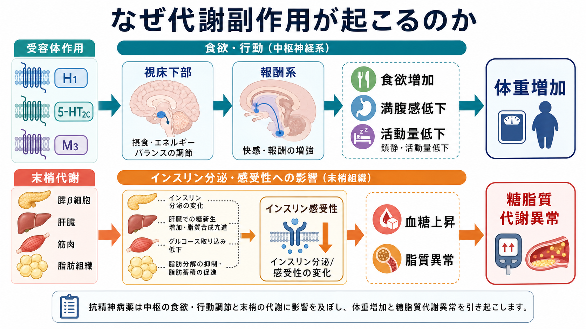
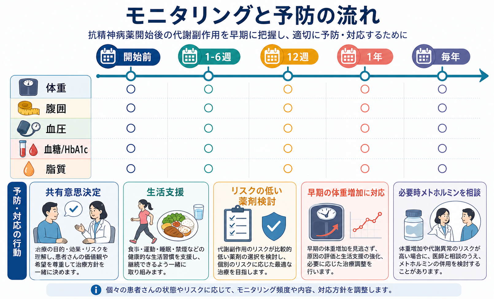

# 抗精神病薬の代謝副作用とは何か

## 要点

- 抗精神病薬の代謝副作用とは、体重増加、腹囲増加、血糖上昇、インスリン抵抗性、脂質異常、血圧上昇などが治療中に問題になることを指す。
- 薬剤ごとのリスク差は大きく、クロザピンとオランザピンは高リスク、アリピプラゾール、ルラシドン、ジプラシドンなどは比較的低リスクとされる。ただし有効性、既往歴、再発リスク、本人の希望を含めて選ぶ必要がある[1][2]。
- 体重増加は最初の数週から数か月に出やすく、早期の変化はその後のリスクを示す手がかりになる[3]。
- 予防は「後から体重が増えたら対応する」だけでなく、開始前評価、共有意思決定、生活支援、定期モニタリング、必要時の薬剤変更やメトホルミン検討を組み合わせる[4][5]。
- このノートは教育・研究目的の整理であり、個別の診断、処方変更、減薬、中止、糖尿病治療の指示ではない。

## この記事で答える問い

1. 抗精神病薬の代謝副作用では、何を見ればよいのか。
2. なぜ体重増加や糖脂質代謝異常が起こるのか。
3. 薬剤によってリスクはどう違うのか。
4. モニタリングと予防は、どの時点で何を行うのか。

## まず結論

抗精神病薬の代謝副作用は、単なる「太りやすさ」ではない。食欲、満腹感、鎮静、活動量、インスリン分泌、肝臓・筋肉・脂肪組織での代謝が重なって、体重、血糖、脂質、血圧に影響する臨床問題である[6]。そのため、[[精神科薬物療法とは何か|精神科薬物療法]]では症状改善だけでなく、身体健康と治療継続性を同時に評価する必要がある。

## 背景

抗精神病薬は、[[統合失調症とは何か|統合失調症]]、双極性障害の躁状態、精神病症状を伴う状態、治療抵抗性統合失調症におけるクロザピン治療などで重要な薬物である。一方で、代謝副作用は生活の質、服薬継続、心血管疾患リスク、糖尿病リスクに関わる。APA の統合失調症ガイドラインも、抗精神病薬を用いる際には効果と副作用の両方をモニターし、薬剤選択では副作用プロファイルと身体合併症を考慮するとしている[7]。

ここで重要なのは、精神疾患そのもの、生活環境、喫煙、睡眠、食事、運動、社会的孤立、経済的困難、薬剤副作用が重なりうる点である。したがって、代謝副作用を「本人の自己管理不足」として扱うのではなく、治療計画の中で予防可能なリスクとして扱う必要がある。これは [[精神疾患と身体合併症はどう関係するのか]] や [[身体合併症は精神科診療でなぜ重要なのか]] と直接つながる。

## 基本概念

### 何を代謝副作用と呼ぶか

臨床で特に見るべき項目は、体重、BMI、腹囲、血圧、空腹時血糖または HbA1c、脂質である。NICE は、抗精神病薬開始前に体重、腹囲、脈拍・血圧、空腹時血糖または HbA1c、脂質、プロラクチン、運動障害、栄養状態・食事・身体活動を評価することを推奨している[4]。

| 領域 | 見る指標 | 臨床的な意味 |
|---|---|---|
| 体重・体組成 | 体重、BMI、腹囲 | 早期増加は将来の代謝リスクの手がかりになる |
| 糖代謝 | 空腹時血糖、HbA1c | インスリン抵抗性や糖尿病リスクを評価する |
| 脂質 | 中性脂肪、LDL、HDL など | 心血管リスク評価に関わる |
| 循環器 | 血圧、脈拍 | メタボリックリスクと薬剤性循環器副作用を分けて見る |
| 生活要因 | 食事、活動量、睡眠、喫煙 | 予防介入の入口になる |

### 薬剤差は大きい

ネットワークメタ解析では、18 種類の抗精神病薬の代謝影響に明確な差があり、オランザピンとクロザピンは体重・脂質・糖代謝への影響が大きい一方、アリピプラゾール、ルラシドン、ジプラシドンなどは比較的影響が小さいと整理されている[2]。ただし「代謝リスクが低い薬剤が常に最善」という意味ではない。症状への効果、過去の治療反応、錐体外路症状、プロラクチン、QT 延長、鎮静、本人の優先順位を含めて、[[薬物療法のリスクベネフィットをどう考えるか|リスクベネフィット]]として考える。

## 仕組み

代謝副作用は一つの受容体だけで説明できない。H1 ヒスタミン受容体、5-HT2C セロトニン受容体、M3 ムスカリン受容体、D2 受容体、アドレナリン受容体などが、食欲、満腹、報酬、鎮静、インスリン分泌、末梢組織のインスリン感受性に関わる[6]。

### 中枢性の経路

H1 受容体遮断や 5-HT2C 受容体遮断は、視床下部の摂食調節や満腹感に影響し、食欲増加や摂食量増加につながる可能性がある。鎮静が強い場合には活動量が下がり、エネルギー消費が減る。報酬系への影響により、食物、とくに高カロリー食品への動機づけが変わる可能性もある[6]。

### 末梢代謝の経路

一部の非定型抗精神病薬は、体重増加とは独立して、肝臓、膵β細胞、脂肪組織、骨格筋の糖脂質代謝に影響しうる。レビューでは、インスリン分泌、インスリン感受性、遊離脂肪酸、肝糖産生、脂質合成などが関与する可能性が整理されている[6]。つまり、体重だけを見ていれば十分ではなく、血糖と脂質の検査を組み合わせる必要がある。

## 図解

代謝副作用の実務上の要点は、「開始前に測る」「早期に再測定する」「増え始めを見逃さない」「生活支援と薬剤調整を同じ治療計画に置く」である。

## 臨床・研究との接続

### モニタリングの時期

NICE は、治療中、とくに増量期に、症状、行動、副作用、運動障害、アドヒアランス、身体健康を定期的・系統的に記録することを推奨している。体重は最初の 6 週間は毎週、その後 12 週、1 年、以後年 1 回、腹囲は年 1 回、脈拍・血圧、空腹時血糖または HbA1c、脂質は 12 週、1 年、以後年 1 回とされる[4]。現場では、地域のプロトコル、既往歴、糖尿病リスク、薬剤変更、急な体重増加に応じて頻度を上げる。

### 予防の考え方

予防は、薬を始める前から始まる。本人と家族・支援者に、期待される効果、副作用、モニタリングの意味、体重や検査値を責めるためではなく早期対応のために測ることを説明する。食事・運動・睡眠・喫煙の支援は、説教ではなく、生活リズム、経済状況、陰性症状、認知機能、薬剤性鎮静を踏まえた環境調整として行う。

薬剤選択では、代謝リスクが高い薬剤を避けられる場合もあるが、治療抵抗性統合失調症ではクロザピンの有効性が重要になることがある。[[治療抵抗性統合失調症とは何か]] のような場面では、代謝リスクを理由に有効治療を単純に否定するのではなく、厳密なモニタリングと身体医療連携を組み合わせる。

### メトホルミンの位置づけ

メトホルミンは、抗精神病薬誘発性体重増加に対する薬物的介入として最も研究されてきた薬剤の一つである。2016 年の系統的レビュー・メタ解析では、12 試験 743 人で、メトホルミンはプラセボより体重、BMI、インスリン抵抗性を改善した[5]。さらに 2024 年に公開された予防目的のガイドライン開発研究は、抗精神病薬誘発性体重増加の予防にメトホルミンをより早期に検討する枠組みを提示している[3]。ただし、腎機能、消化器症状、併用薬、糖尿病治療との関係を含め、主治医が個別に判断する事項である。

## よくある誤解

### 誤解1: 体重だけ測ればよい

体重は重要だが、十分ではない。血糖、HbA1c、脂質、血圧、腹囲を合わせて見ないと、糖脂質代謝異常や心血管リスクを見落とすことがある[4]。

### 誤解2: 代謝副作用はすべて生活習慣の問題である

食事や活動量は重要だが、薬剤の受容体作用、鎮静、食欲、末梢代謝への直接作用も関与する[6]。本人の努力不足とみなすと、支援の入口を失いやすい。

### 誤解3: 代謝リスクが高い薬剤は使ってはいけない

薬剤選択は、代謝リスクだけでは決まらない。クロザピンのように、特定の臨床状況で有効性が大きい薬剤もある。重要なのは、リスクを隠さず、開始前から測定し、異常が出たときに対応できる体制を作ることである[1][7]。

### 誤解4: 検査値が悪くなってから考えればよい

体重増加は早期から起こりやすく、初期変化を見逃すと介入が遅れる。開始前から、体重、腹囲、血糖、脂質、血圧を測り、開始後 12 週までの変化を重視する[4]。

## 関連ノート

- [[精神科薬物療法とは何か]]
- [[向精神薬の基本分類とは何か]]
- [[抗精神病薬の錐体外路症状とは何か]]
- [[薬物療法のリスクベネフィットをどう考えるか]]
- [[統合失調症とは何か]]
- [[治療抵抗性統合失調症とは何か]]
- [[精神疾患と身体合併症はどう関係するのか]]
- [[身体合併症は精神科診療でなぜ重要なのか]]

## MOC更新候補

- `content/00_MOC/` 配下の薬物療法、統合失調症、身体合併症、臨床実践関連 MOC に `[[抗精神病薬の代謝副作用とは何か]]` を追加する候補。
- 並列記事生成との衝突を避けるため、このジョブでは MOC 本体は更新しない。

## 理解チェック

1. 抗精神病薬の代謝副作用で、体重以外に少なくとも 4 つ測るべき指標を挙げられるか。
2. H1、5-HT2C、M3 受容体が、食欲や糖代謝にどう関わりうるか説明できるか。
3. オランザピンやクロザピンの代謝リスクが高いことと、臨床的有用性をどう両立して考えるか。
4. 開始前、6 週以内、12 週、1 年、毎年のモニタリングで何を確認するか。
5. メトホルミンを「自己判断で始める薬」ではなく、「医療者が適応と安全性を判断する選択肢」として説明できるか。

## 参考文献

[1] American Diabetes Association, American Psychiatric Association, American Association of Clinical Endocrinologists, North American Association for the Study of Obesity. Consensus development conference on antipsychotic drugs and obesity and diabetes. *Diabetes Care*. 2004;27(2):596-601. https://doi.org/10.2337/diacare.27.2.596

[2] Pillinger T, McCutcheon RA, Vano L, et al. Comparative effects of 18 antipsychotics on metabolic function in patients with schizophrenia, predictors of metabolic dysregulation, and association with psychopathology: a systematic review and network meta-analysis. *The Lancet Psychiatry*. 2020;7(1):64-77. https://doi.org/10.1016/S2215-0366(19)30416-X

[3] Carolan A, Firth J, Stubbs B, et al. Metformin for the prevention of antipsychotic-induced weight gain: guideline development and consensus validation. *Schizophrenia Bulletin*. 2025;51(5):1193-1205. https://doi.org/10.1093/schbul/sbae205

[4] National Institute for Health and Care Excellence. *Psychosis and schizophrenia in adults: prevention and management* (CG178). 2014, amended 2021/2022. https://www.nice.org.uk/guidance/cg178/chapter/recommendations

[5] de Silva VA, Suraweera C, Ratnatunga SS, Dayabandara M, Wanniarachchi N, Hanwella R. Metformin in prevention and treatment of antipsychotic induced weight gain: a systematic review and meta-analysis. *BMC Psychiatry*. 2016;16:341. https://doi.org/10.1186/s12888-016-1049-5

[6] Siafis S, Tzachanis D, Samara M, Papazisis G. Antipsychotic drugs: from receptor-binding profiles to metabolic side effects. *Current Neuropharmacology*. 2018;16(8):1210-1223. https://doi.org/10.2174/1570159X15666170630163616

[7] American Psychiatric Association. *The American Psychiatric Association Practice Guideline for the Treatment of Patients With Schizophrenia*, Third Edition. 2020. https://doi.org/10.1176/appi.ajp.2020.177901

## 未解決問題

- 初回エピソード精神病で、メトホルミン予防投与をどのリスク層にどの時点で始めるのが最も有益か。
- GLP-1 受容体作動薬など、糖尿病・肥満治療薬を抗精神病薬関連体重増加へどう位置づけるべきか。
- 遺伝、腸内細菌叢、社会的決定要因を含めて、個人ごとの代謝副作用リスクをどこまで予測できるか。
- 代謝リスクの説明が、治療拒否ではなく共有意思決定と服薬継続支援につながる伝え方は何か。
