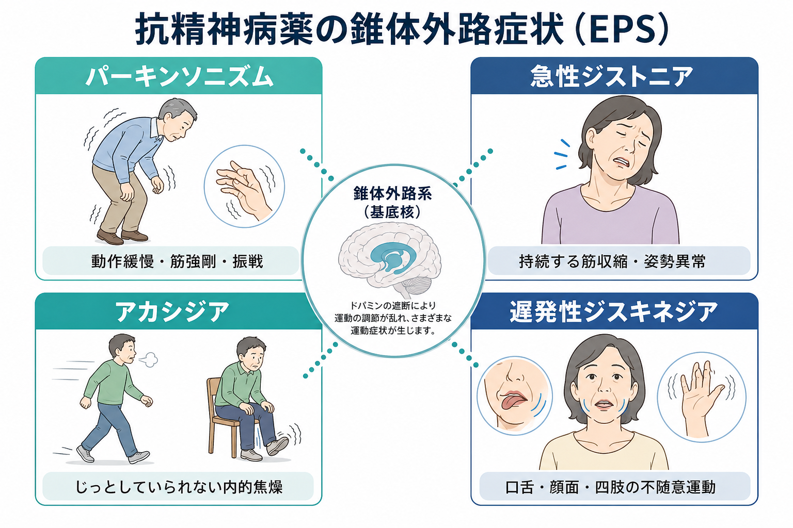
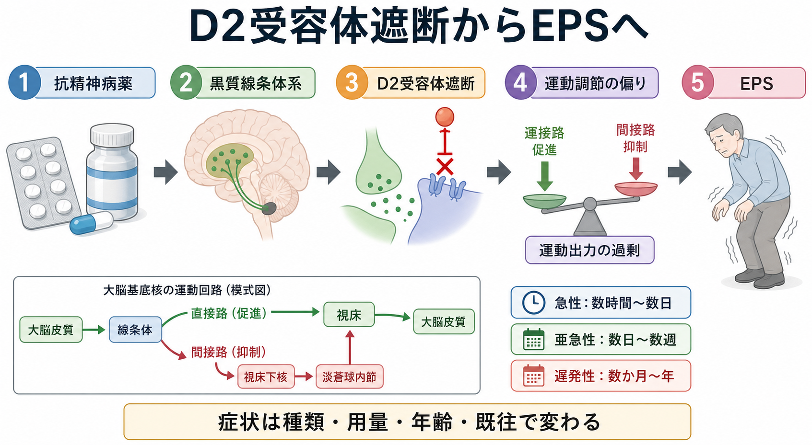
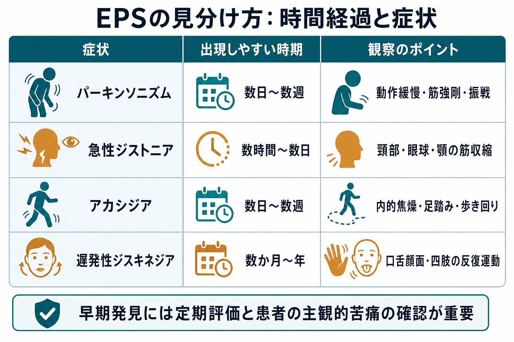

# 抗精神病薬の錐体外路症状とは何か

## 要点

- 錐体外路症状（extrapyramidal symptoms: EPS）は、抗精神病薬などのドパミンD2受容体遮断薬で起こりうる薬剤性運動症状の総称である。代表は、パーキンソニズム、急性ジストニア、アカシジア、遅発性ジスキネジアである[1]。
- 典型的には、黒質線条体系のD2受容体遮断により、[[大脳基底核ループとは何か|大脳基底核]]の運動調節が偏ることで生じる。ただし、薬剤、用量、年齢、性別、既往、併存疾患、累積曝露でリスクは変わる[1][5]。
- 時間経過が見分け方の入口になる。急性ジストニアは数時間から数日、アカシジアとパーキンソニズムは数日から数週、遅発性ジスキネジアは数か月から年単位で問題になりやすい[1][6]。
- アカシジアは不安・焦燥・精神運動興奮と混同されやすく、NICEは抗精神病薬治療中に副作用、運動症状、アカシジアと不安・焦燥の重なりを系統的に記録することを勧めている[2]。
- 本記事は教育・研究目的の整理であり、個別の診断、処方変更、中止、治療指示ではない。疑わしい症状がある場合は、服薬を自己判断で止めず、処方医に相談する前提で読む。

## この記事で答える問い

1. 抗精神病薬の錐体外路症状とは、どのような症状群なのか。
2. パーキンソニズム、急性ジストニア、アカシジア、遅発性ジスキネジアは何が違うのか。
3. なぜ抗精神病薬で運動症状が起こるのか。
4. 臨床や研究では、EPSをどのように評価し、どの誤解に注意するのか。

## まず結論

抗精神病薬のEPSは、「薬が強すぎるから体が固まる」という単純な副作用名ではない。より正確には、D2受容体遮断を中心とする薬理作用が、黒質線条体系と大脳基底核の運動調節に影響し、低運動性の症状、異常な筋収縮、じっとしていられない主観的苦痛、不随意運動として現れる症候群である。

臨床上は、症状名よりも「いつ出たか」「どんな運動か」「本人の主観的苦痛はあるか」「精神症状や不安と混同していないか」「薬剤変更・増量・減量との時間関係はどうか」を確認することが重要である。特にアカシジアは、外から見ると落ち着きのなさに見えるため、精神病性興奮や不安の悪化と誤認されると、原因薬の増量につながり、症状を悪化させる可能性がある[2][7]。

## 背景

抗精神病薬は、[[統合失調症とは何か|統合失調症]]、双極症の躁状態、精神病症状を伴う状態、せん妄や興奮の一部など、さまざまな臨床場面で使われる。多くの抗精神病薬は、程度の差はあってもドパミンD2受容体への作用を持つ。中脳辺縁系や中脳皮質系への作用は精神病症状の改善と関連づけて説明される一方、黒質線条体系への作用は運動副作用と関連しやすい[1][3]。

「錐体外路」という言葉は、もともと随意運動を伝える錐体路に対し、それ以外の運動調節系を広く指す歴史的用語である。現代の神経科学では、運動症状を「錐体外路」という一語にまとめるより、パーキンソニズム、ジストニア、アカシジア、ジスキネジアのように、観察される運動現象として分けて評価する方が実践的である[1]。

## 基本概念

### パーキンソニズム

抗精神病薬誘発性パーキンソニズムは、動作緩慢、筋強剛、振戦、仮面様顔貌、小刻み歩行などを示す。典型的には開始・増量後の数日から数週で目立つ。高齢者では、薬剤性パーキンソニズムとパーキンソン病の鑑別が難しく、薬剤中止後も症状が残る場合には潜在的な神経変性疾患が表面化していた可能性も考える必要がある[8]。

臨床的には、左右対称性が比較的目立つ、上肢に出やすい、口周囲の振戦や他のEPSを伴う、といった特徴が薬剤性を疑う手がかりになる。ただし、個々の症例では例外があり、運動症状だけで断定しない。

### 急性ジストニア

急性ジストニアは、持続的または反復性の筋収縮により、頸部、眼球、顎、舌、体幹などに不自然な姿勢や痛みを伴う筋攣縮が出る状態である。眼球上転発作、斜頸、開口障害、舌突出、嚥下しにくさとして現れることがある。開始・増量後の数時間から数日で起こりやすく、若年、男性、高力価D2遮断薬、過去のジストニア歴などがリスクとして知られる[1]。

まれに喉頭ジストニアのように呼吸や嚥下に関わる症状が問題になるため、急な頸部・咽喉頭症状、呼吸困難、強い疼痛を伴う場合は緊急性を意識する。

### アカシジア

アカシジアは、内的焦燥、むずむずする落ち着かなさ、じっと座っていられない感覚を中核とし、足踏み、歩き回り、体を揺らす、座位保持困難などが伴う。外から見える動きだけでなく、本人が感じる「耐えがたい落ち着かなさ」を聞くことが重要である[7]。

アカシジアは数日から数週で起こりやすいが、遅発性に持続することもある。抗精神病薬による不快な主観症状の中でも、服薬継続の難しさ、自傷念慮、攻撃性、焦燥の増悪と関連しうるため、単なる「そわそわ」と軽く扱わない[1][7]。

### 遅発性ジスキネジア

遅発性ジスキネジアは、長期のドパミン受容体遮断薬曝露後に生じる、口舌顔面や四肢、体幹の反復性・不随意性の運動である。口をもぐもぐさせる、舌を出す、唇をすぼめる、顔をしかめる、手指が勝手に動く、体幹がくねるといった形で出ることがある[6]。

重要なのは「遅発性」という時間軸である。急性EPSが可逆的に改善することが多いのに対し、遅発性ジスキネジアは持続し、生活機能や対人場面に大きく影響しうる。第一世代抗精神病薬でリスクが高いが、第二世代抗精神病薬でも起こりうる[4][6]。

## 仕組み

抗精神病薬のEPSを理解する入口は、[[ドパミンは報酬だけの物質なのか|ドパミン]]の「運動調節」機能である。黒質緻密部から線条体へ投射するドパミンは、大脳基底核ループの直接路・間接路のバランスを調整し、運動の開始、抑制、滑らかさに関わる。D2受容体遮断が強くなると、間接路を介した運動抑制が相対的に強まり、パーキンソニズムのような低運動性症状が出やすくなる。

ただし、D2遮断だけで全てを説明できるわけではない。薬剤ごとのD2受容体占有率、受容体からの解離速度、セロトニン受容体作用、抗コリン作用、個人の脳内ドパミン予備能、加齢、併存する神経疾患が重なって、どのEPSが出やすいかが変わる。第二世代抗精神病薬は平均的にはEPSリスクが低い傾向があるが、薬剤間差があり、「第二世代ならEPSは起きない」とは言えない[5]。

遅発性ジスキネジアでは、長期D2遮断に伴う受容体感受性変化、線条体の可塑性、酸化ストレス、GABA作動性・コリン作動性の変化など複数の機序が議論される。単一の受容体変化に還元できず、累積曝露、年齢、女性、気分障害、物質使用、知的障害、中枢神経損傷、過去の急性EPSなどがリスクとして整理されている[4][6]。

## 図解

EPSを臨床で見分けるときは、次のように時間経過と症状を組み合わせる。

| 症状 | 出現しやすい時期 | 中核症状 | 見落としやすい点 |
|---|---:|---|---|
| パーキンソニズム | 数日から数週 | 動作緩慢、筋強剛、振戦 | 抑うつ、陰性症状、加齢変化と混同される |
| 急性ジストニア | 数時間から数日 | 頸部・眼球・顎・舌などの持続性筋収縮 | パニック、てんかん、身体疾患と誤認される |
| アカシジア | 数日から数週 | 内的焦燥、座っていられない、足踏み | 不安、焦燥、精神病性興奮と混同される |
| 遅発性ジスキネジア | 数か月から年 | 口舌顔面・四肢・体幹の反復性不随意運動 | 本人が気づきにくい、減量時に顕在化することがある |

## 臨床・研究との接続

### 共同意思決定とモニタリング

抗精神病薬は症状軽減や再発予防に重要な役割を持つが、効果と副作用のバランスを継続的に評価する必要がある。NICE CG178は、抗精神病薬治療中、とくに用量調整中には、治療反応、治療副作用、運動障害の出現、アドヒアランス、身体健康を規則的・系統的に記録することを推奨している[2]。APAの統合失調症治療ガイドラインも、抗精神病薬の効果と副作用をモニタリングし、遅発性症候群について構造化尺度も含めた評価を行うことを重視している[3][4]。

実務上は、Barnes Akathisia Rating Scale、Simpson-Angus Scale、AIMS（Abnormal Involuntary Movement Scale）などの尺度が使われることがある。尺度は診察を置き換えるものではないが、変化を追跡し、患者・家族・多職種で共有するための言語になる。

### 薬剤選択とリスク

第一世代抗精神病薬、とくに高力価D2遮断薬ではEPSリスクが高い。第二世代抗精神病薬は平均的にはEPSリスクが低いが、薬剤間差があり、リスペリドンなど一部では用量依存的にEPSが問題になることがある[5]。一方で、EPSリスクだけで薬剤を選べばよいわけではない。鎮静、体重増加、糖脂質代謝、プロラクチン、QT延長、抗コリン作用、治療抵抗性、過去の反応、本人の希望を合わせて考える。

この意味で、[[PETは脳の何を測るのか|PET]]によるD2受容体占有率研究は、薬効とEPSの関係を理解する研究上の橋渡しになる。ただし、臨床個人の治療選択をPETだけで決めるわけではない。

### 治療方針は症状ごとに異なる

EPSの対応は、薬剤性である可能性、重症度、精神症状の安定性、既往、併用薬、リスクを見て個別に考える。一般論としては、用量調整、原因薬の変更、抗コリン薬、β遮断薬、ベンゾジアゼピン系薬、VMAT2阻害薬などが議論されるが、症状ごとに根拠の強さは異なる。

遅発性ジスキネジアでは、バルベナジンやデューテトラベナジンなどのVMAT2阻害薬について、RCTと系統的レビューに基づく有効性が報告され、治療選択肢として位置づけられている[6]。アカシジアでは薬物治療研究はあるものの、比較試験は小規模で、系統的レビューでも薬剤ごとの確実性には幅がある[7]。したがって、薬剤名だけを暗記するより、「どのEPSかを正しく同定する」ことが先に来る。

## よくある誤解

### 誤解1: EPSは第一世代抗精神病薬だけで起こる

第一世代で多いのは確かだが、第二世代でも起こる。第二世代抗精神病薬内にもEPSリスクの差があり、用量、D2占有率、個人差に左右される[5]。

### 誤解2: アカシジアは不安や性格の問題である

アカシジアは薬剤性運動症状として評価すべき状態である。本人の「内側から突き上げる落ち着かなさ」は外から見えにくく、不安、焦燥、精神病性興奮と混同されやすい[2][7]。

### 誤解3: パーキンソニズムは必ずパーキンソン病である

抗精神病薬、制吐薬、その他のD2遮断薬でもパーキンソニズムは起こりうる。薬剤性パーキンソニズムとパーキンソン病は似るが、時間関係、左右差、併存する不随意運動、嗅覚低下やレム睡眠行動障害の有無などを総合して考える[8]。

### 誤解4: 遅発性ジスキネジアは薬をやめれば必ず消える

遅発性ジスキネジアは持続することがあり、減量や中止により一時的に顕在化する場合もある。自己判断での中止は精神症状の再燃や離脱性の問題を招く可能性があるため、処方医との相談が必要である[4][6]。

## 関連ノート

- [[ドパミンは報酬だけの物質なのか]]: ドパミンの報酬・運動・学習機能を整理するための基礎ノート。
- [[大脳基底核ループとは何か]]: 黒質線条体系、直接路・間接路、行動選択を理解するための関連ノート。
- [[統合失調症とは何か]]: 抗精神病薬が使われる代表的な疾患文脈を確認するための関連ノート。
- [[PETは脳の何を測るのか]]: D2受容体占有率研究や薬物作用の測定と接続するための関連ノート。
- [[アセチルコリンは注意や記憶にどう関わるのか]]: 抗コリン薬の効果・副作用を理解するための基礎ノート。

### MOC更新候補

- `content/00_MOC/MOC｜臨床実践・治療.md` の薬物療法セクションに `[[抗精神病薬の錐体外路症状とは何か]]` を追加する候補。
- `content/00_MOC/MOC｜精神医学.md` の統合失調症・精神薬理関連に追加する候補。
- `content/00_MOC/MOC｜脳・神経科学.md` または `MOC｜神経回路・脳ネットワーク.md` の大脳基底核・ドパミン関連に関連リンクとして追加する候補。

## 理解チェック

1. 抗精神病薬誘発性パーキンソニズムと急性ジストニアは、出現時期と運動の性質がどう違うか。
2. アカシジアを不安や精神病性興奮と見分けるために、本人へどのような主観症状を確認する必要があるか。
3. 遅発性ジスキネジアが「遅発性」と呼ばれる理由は何か。
4. 第二世代抗精神病薬でもEPSが起こりうる理由を、D2受容体占有率と薬剤間差から説明できるか。
5. EPSを評価するとき、薬剤名だけでなく用量、増減時期、累積曝露、年齢、既往を確認する理由は何か。

## 未解決問題

- EPSの個人差を、薬剤血中濃度、D2受容体占有率、遺伝要因、加齢、基底核回路の予備能からどこまで予測できるか。
- 遅発性ジスキネジアの発症前に、可逆的なリスク状態を検出するバイオマーカーやデジタル運動指標を作れるか。
- アカシジアの主観的苦痛を、通常診療で短時間かつ高感度に拾い上げる評価法をどう実装するか。
- 抗精神病薬の有効性を保ちながら、EPS、代謝副作用、鎮静、プロラクチン上昇を同時に最小化する個別化戦略をどう設計するか。

## 参考文献

[1] D'Souza RS, Aslam SP, Hooten WM. Extrapyramidal Side Effects. *StatPearls*. Last update 2025-01-19. https://www.ncbi.nlm.nih.gov/books/NBK534115/

[2] National Institute for Health and Care Excellence. Psychosis and schizophrenia in adults: prevention and management. NICE guideline CG178. Recommendations, section 1.3.6. Published 2014, amended 2021. https://www.nice.org.uk/guidance/cg178/chapter/1-Recommendations

[3] American Psychiatric Association. The American Psychiatric Association Practice Guideline for the Treatment of Patients With Schizophrenia, Third Edition. 2020. Guideline summary. https://www.guidelinecentral.com/guideline/307794/

[4] American Psychiatric Association. Treatment of Patients With Schizophrenia: Tardive Dyskinesia. Guideline Central Pocket Guide. 2020. https://www.guidelinecentral.com/guideline/307794/pocket-guide/1062063/

[5] Rummel-Kluge C, Komossa K, Schwarz S, Hunger H, Schmid F, Kissling W, Davis JM, Leucht S. Second-generation antipsychotic drugs and extrapyramidal side effects: a systematic review and meta-analysis of head-to-head comparisons. *Schizophrenia Bulletin*. 2012;38(1):167-177. https://doi.org/10.1093/schbul/sbq042

[6] Ricciardi L, Pringsheim T, Barnes TRE, Martino D, Gardner D, Remington G, Addington D, Morgante F, et al. Treatment Recommendations for Tardive Dyskinesia. *The Canadian Journal of Psychiatry*. 2019;64(6):388-399. https://doi.org/10.1177/0706743719828968

[7] Siafis S, Tzachanis D, Samara M, et al. Drug Efficacy in the Treatment of Antipsychotic-Induced Akathisia: A Systematic Review and Network Meta-Analysis. *JAMA Network Open*. 2024;7(3):e240786. https://pmc.ncbi.nlm.nih.gov/articles/PMC10921255/

[8] Wisidagama S, Selladurai A, Wu P, Isetta M, Serra-Mestres J. Recognition and Management of Antipsychotic-Induced Parkinsonism in Older Adults: A Narrative Review. *Medicines*. 2021;8(6):24. https://doi.org/10.3390/medicines8060024
