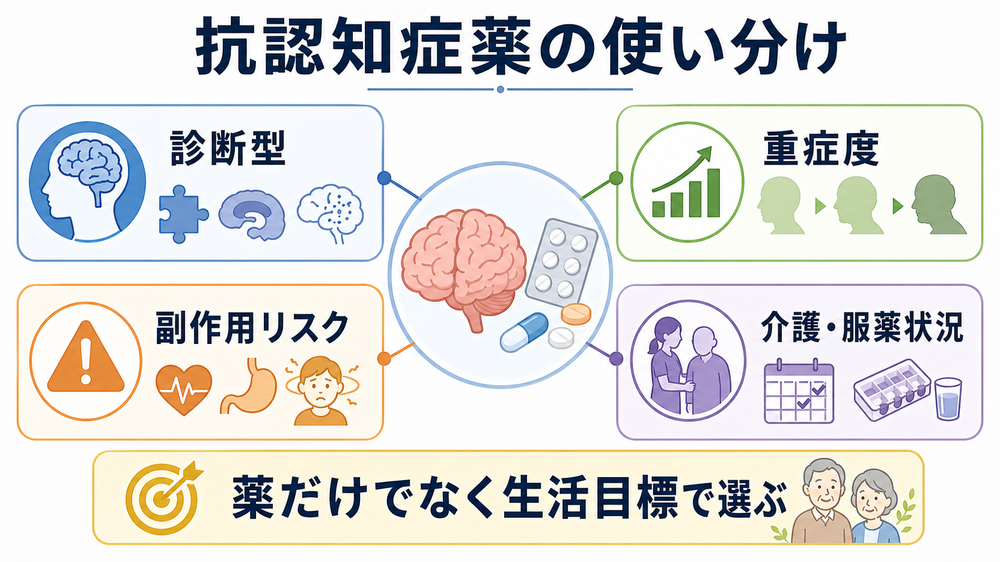
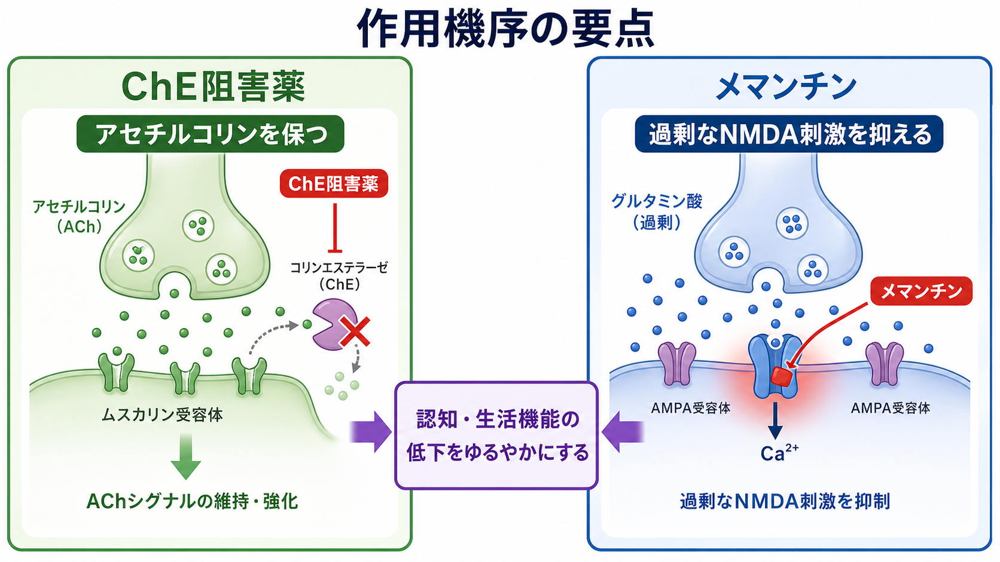
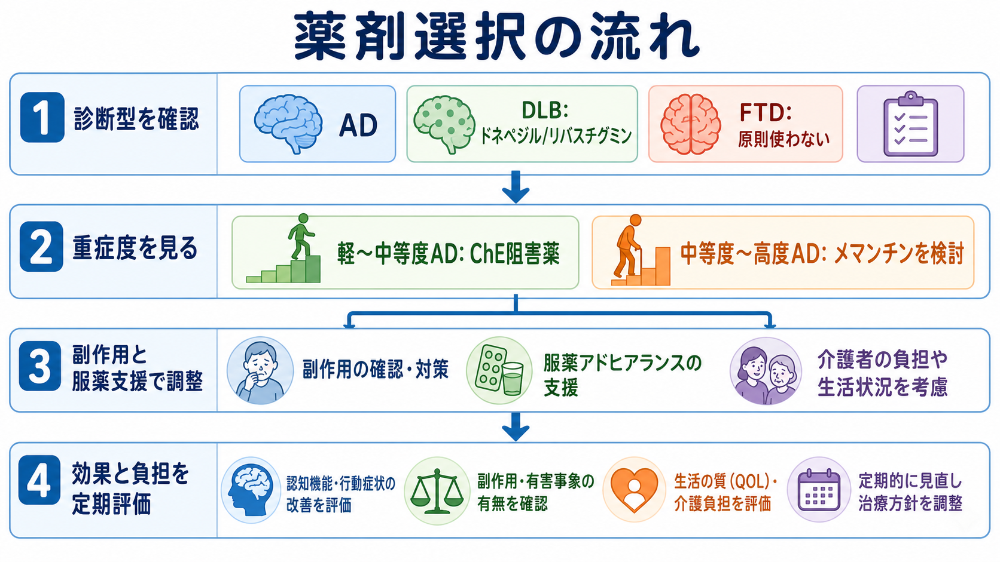

# 抗認知症薬の使い分けはどう考えるか

## 要点

- 抗認知症薬は、[[認知症とは何か|認知症]]そのものを一括して治す薬ではなく、主にアルツハイマー病などで認知・生活機能低下をゆるやかにすることを目標に使う。
- まず「何型の認知症か」「どの重症度か」「標的症状は何か」を確認し、そのうえで副作用、服薬支援、介護者負担を含めて選ぶ。
- コリンエステラーゼ阻害薬は軽度から中等度の[[アルツハイマー型認知症とは何か|アルツハイマー型認知症]]で中心になり、メマンチンは中等度から高度、または ChE 阻害薬が使いにくい場合に検討される[1][2]。
- [[レビー小体型認知症とは何か|レビー小体型認知症]]や[[パーキンソン病認知症とは何か|パーキンソン病認知症]]ではコリン作動性低下が強く、ChE 阻害薬が認知・行動症状に役立つことがある[5]。
- [[前頭側頭型認知症とは何か|前頭側頭型認知症]]や純粋な[[血管性認知症とは何か|血管性認知症]]では、抗認知症薬を機械的に使わず、診断・混合病理・生活上の困りごとを再確認する[1][6]。

## この記事で答える問い

1. ドネペジル、ガランタミン、リバスチグミン、メマンチンは、何を基準に選び分けるのか。
2. 認知症の種類や重症度によって、薬剤選択はどう変わるのか。
3. 副作用、服薬管理、介護状況は、薬の選択にどう影響するのか。

## まず結論

抗認知症薬の使い分けは、「薬の強さランキング」ではなく、診断型、重症度、症状プロフィール、副作用への脆弱性、服薬を支える環境を合わせた実用的な判断である。軽度から中等度のアルツハイマー型認知症では、ドネペジル、ガランタミン、リバスチグミンなどの ChE 阻害薬が候補になる。中等度から高度では、メマンチンの単剤または ChE 阻害薬への追加が検討される[2][4]。

ただし、同じ薬剤名でも「期待する利益」は大きくないことが多い。Cochrane レビューでは、ChE 阻害薬やメマンチンの効果は平均的には小から中等度であり、日常生活で本人・家族が意味のある変化として感じるかは個人差がある[3][4]。したがって、開始時に「記憶検査の点数」だけでなく、会話、服薬、食事、着替え、不安、介護負担など、観察可能な目標を決めておく。

## 背景

日本で一般に抗認知症薬と呼ばれる薬には、ChE 阻害薬であるドネペジル、ガランタミン、リバスチグミンと、NMDA 受容体拮抗薬であるメマンチンが含まれる。近年はレカネマブなどの抗アミロイドβ抗体薬も登場しているが、これは「早期アルツハイマー病でアミロイド病理を確認し、MRI 監視や適正使用条件のもとで使う疾患修飾的治療」に近く、通常の症候改善薬とは選択の前提が異なる[8]。

抗認知症薬を考える前に、[[せん妄とは何か|せん妄]]、うつ病、睡眠障害、疼痛、感染、脱水、甲状腺機能異常、ビタミン欠乏、抗コリン薬やベンゾジアゼピン系薬などの薬剤影響を見落とさないことが重要である。これらが主因なら、抗認知症薬の追加よりも原因評価と環境調整が優先される。

## 基本概念

### ChE 阻害薬

ChE 阻害薬は、シナプス間隙のアセチルコリン分解を抑え、コリン作動性伝達を相対的に保つ薬である。アルツハイマー病ではコリン作動性神経系の障害が認知症状に関わるため、軽度から中等度で標準的な選択肢になる[1][3]。

薬剤間の平均的な有効性に大きな差があるとは言いにくい一方、剤形と副作用の違いは実臨床で大きい。ドネペジルは 1 日 1 回で使いやすい。ガランタミンはニコチン性受容体調節作用も持つ。リバスチグミンは貼付剤を使えるため、内服忘れ、嚥下困難、介護者による確認が重要な場面で候補になる。ただし貼付部位の皮膚症状に注意する。

### メマンチン

メマンチンは、過剰なグルタミン酸/NMDA 受容体刺激を調整する薬で、中等度から高度のアルツハイマー型認知症で検討される。Cochrane レビューでは、中等度から高度では小さい臨床的利益が示される一方、軽度アルツハイマー病での利益は乏しいと整理されている[4]。眠気、めまい、ふらつき、腎機能に応じた調整が問題になりやすい。

## 仕組み

選択の実際は、次の順に考えると整理しやすい。

| 判断軸 | 見ること | 薬剤選択への影響 |
|---|---|---|
| 診断型 | AD、DLB/PDD、血管性、FTD、混合病理 | AD は ChE 阻害薬・メマンチン、DLB/PDD は ChE 阻害薬を検討、FTD は原則慎重 |
| 重症度 | MCI、軽度、中等度、高度 | 軽度 AD は ChE 阻害薬中心、中等度以降はメマンチンの位置づけが上がる |
| 標的症状 | 記憶、注意変動、幻視、意欲、焦燥、睡眠 | BPSD には薬だけでなく身体・環境・介護負担を同時に評価する |
| 副作用リスク | 徐脈、失神、消化器症状、体重減少、喘息、パーキンソニズム、皮膚症状、転倒 | ChE 阻害薬とメマンチンのどちらが安全に試せるかを変える |
| 服薬支援 | 飲み忘れ、嚥下、独居、介護者の確認、貼付管理 | 1 日 1 回薬、OD 錠、貼付剤、介護者確認の必要性を調整する |

ChE 阻害薬では、悪心、嘔吐、下痢、食欲低下、体重減少、徐脈、失神、心ブロック、喘息・COPD の悪化、パーキンソニズム悪化が問題になることがある。PMDA 添付文書でも、徐脈・心ブロック・QT 延長、消化性潰瘍や消化管出血などへの注意が示されている[7]。高齢者では、軽い食欲低下やふらつきでも転倒、脱水、介護負担に直結する。

メマンチンでは、めまい、傾眠、頭痛、便秘、血圧変動、興奮や錯乱の変化を観察する。投与開始初期のめまい・傾眠は転倒につながりうるため、夜間歩行が多い人、独居、腎機能低下、複数薬剤併用では特に慎重に見る[7]。

## 図解

図の流れで重要なのは、開始だけでなく「見直し」を最初から組み込むことである。開始後は、認知機能検査、生活機能、[[BPSDとは何か|BPSD]]、家族・介護者の観察、副作用を一定期間ごとに確認する。効果が不明で副作用や服薬負担が大きい場合、漫然と継続しない。

## 臨床・研究との接続

### アルツハイマー型認知症

軽度から中等度では ChE 阻害薬を候補にし、中等度から高度ではメマンチンを単剤または併用で検討する。NICE は、軽度から中等度 AD に ChE 阻害薬、ChE 阻害薬が使いにくい中等度 AD または高度 AD にメマンチン、さらに中等度から高度で ChE 阻害薬使用中ならメマンチン追加を考える、という形で整理している[2]。

### レビー小体型認知症・パーキンソン病認知症

DLB/PDD では注意・覚醒の変動、幻視、レム睡眠行動障害、パーキンソニズム、抗精神病薬過敏性が問題になる。ChE 阻害薬は認知、全般評価、行動症状に一定の利益が示されているが、振戦、悪心、失神、徐脈の観察が必要である[5]。幻視だけに反応して抗精神病薬を急いで増やす前に、身体要因、環境、睡眠、ChE 阻害薬の位置づけを検討する。

### 血管性認知症・混合型

血管性認知症では、抗認知症薬の効果は限定的で、日常生活で明確な改善として見えるとは限らない。Cochrane のネットワークメタ分析では、ドネペジルやガランタミンで認知検査上の小さな利益が示される一方、副作用も増えうるとされる[6]。高血圧、糖尿病、脂質異常、心房細動、喫煙、睡眠時無呼吸、運動、リハビリ、脳卒中再発予防のほうが中核になる場面も多い。

### 前頭側頭型認知症

FTD では、記憶よりも脱抑制、常同行動、共感性低下、食行動変化、言語障害が目立つことがある。ChE 阻害薬やメマンチンを「認知症だから」と機械的に使う根拠は弱く、行動症状が悪化する可能性も考えて慎重に扱う[1]。支援では、環境調整、危険行動の予防、家族支援、意思決定支援が中心になる。

## よくある誤解

### 誤解1: 新しい薬ほどよく効く

薬剤選択は新旧では決まらない。本人の診断型、重症度、副作用リスク、飲みやすさ、介護者が確認できるかで実用性が変わる。貼付剤が最適な人もいれば、皮膚症状で続けにくい人もいる。

### 誤解2: 認知症なら必ず抗認知症薬を使う

認知症の原因は多様である。せん妄、薬剤性、うつ病、代謝性疾患、FTD、血管性病変が主であれば、抗認知症薬よりも原因評価、生活調整、再発予防、介護支援が優先される。

### 誤解3: BPSD には抗認知症薬か抗精神病薬を足せばよい

BPSD は、痛み、便秘、感染、睡眠、過刺激、孤立、介護者との相互作用、環境変化から生じることが多い。薬物療法は選択肢の一部だが、まず本人の苦痛と状況を読む必要がある。

### 誤解4: 効果がないならすぐ中止する

抗認知症薬の効果は劇的な改善として現れにくい。開始時に目標を決め、一定期間で副作用と生活上の変化を確認する。中止も、急な悪化や介護環境への影響を見ながら計画的に行う。

## 関連ノート

- [[認知症とは何か]]
- [[アルツハイマー型認知症とは何か]]
- [[レビー小体型認知症とは何か]]
- [[パーキンソン病認知症とは何か]]
- [[前頭側頭型認知症とは何か]]
- [[血管性認知症とは何か]]
- [[アセチルコリン系は認知症とどう関わるのか]]
- [[BPSDとは何か]]
- [[せん妄とは何か]]
- [[薬物療法のリスクベネフィットをどう考えるか]]

MOC 更新候補: `content/00_MOC/` 配下の精神医学、疾患・症候群、臨床実践・治療、薬物療法、老年期・認知症関連 MOC に追加候補。

## 理解チェック

1. 軽度から中等度のアルツハイマー型認知症で、ChE 阻害薬を検討する前に確認すべき副作用リスクは何か。
2. メマンチンが軽度 AD よりも中等度から高度 AD で位置づけられやすい理由は何か。
3. DLB/PDD で ChE 阻害薬を考えるとき、どの症状と副作用を同時に観察するか。
4. FTD や血管性認知症で、抗認知症薬以外に優先すべき支援は何か。

## 未解決問題

- 個々の患者で「小さな平均効果」が生活上意味のある利益になるかを、どの指標で判断するのがよいか。
- 抗認知症薬の中止・減量を、本人の意思決定支援や介護者負担とどう両立させるか。
- 抗アミロイドβ抗体薬の登場により、従来の症候改善薬との併用、治療目標、医療資源配分をどう設計するか。

## 参考文献

[1] 日本神経学会. 認知症疾患診療ガイドライン2017. https://www.neurology-jp.org/guidelinem/nintisyo_2017.html

[2] National Institute for Health and Care Excellence. Dementia: assessment, management and support for people living with dementia and their carers. NICE guideline NG97. https://www.nice.org.uk/guidance/ng97/chapter/recommendations

[3] Birks J. Cholinesterase inhibitors for Alzheimer's disease. Cochrane Database of Systematic Reviews. 2006; CD005593. https://www.cochrane.org/evidence/CD005593

[4] McShane R, Westby MJ, Roberts E, et al. Memantine for dementia. Cochrane Database of Systematic Reviews. 2019; CD003154. https://www.cochrane.org/evidence/CD003154_memantine-treatment-dementia

[5] Rolinski M, Fox C, Maidment I, McShane R. Cholinesterase inhibitors for dementia with Lewy bodies, Parkinson's disease dementia and cognitive impairment in Parkinson's disease. Cochrane Database of Systematic Reviews. 2012; CD006504. https://pubmed.ncbi.nlm.nih.gov/22419314/

[6] Battle CE, Abdul-Rahim AH, Shenkin SD, et al. Cholinesterase inhibitors for vascular dementia and other vascular cognitive impairments: a network meta-analysis. Cochrane Database of Systematic Reviews. 2021; CD013306. https://pmc.ncbi.nlm.nih.gov/articles/PMC8407366/

[7] 医薬品医療機器総合機構（PMDA）. ドネペジル塩酸塩・メマンチン塩酸塩等の医療用医薬品添付文書情報. https://www.pmda.go.jp/PmdaSearch/iyakuSearch/

[8] 厚生労働省. アルツハイマー病の新しい治療薬について：抗アミロイドβ抗体薬について. https://www.mhlw.go.jp/stf/seisakunitsuite/bunya/0000089508_00007.html
