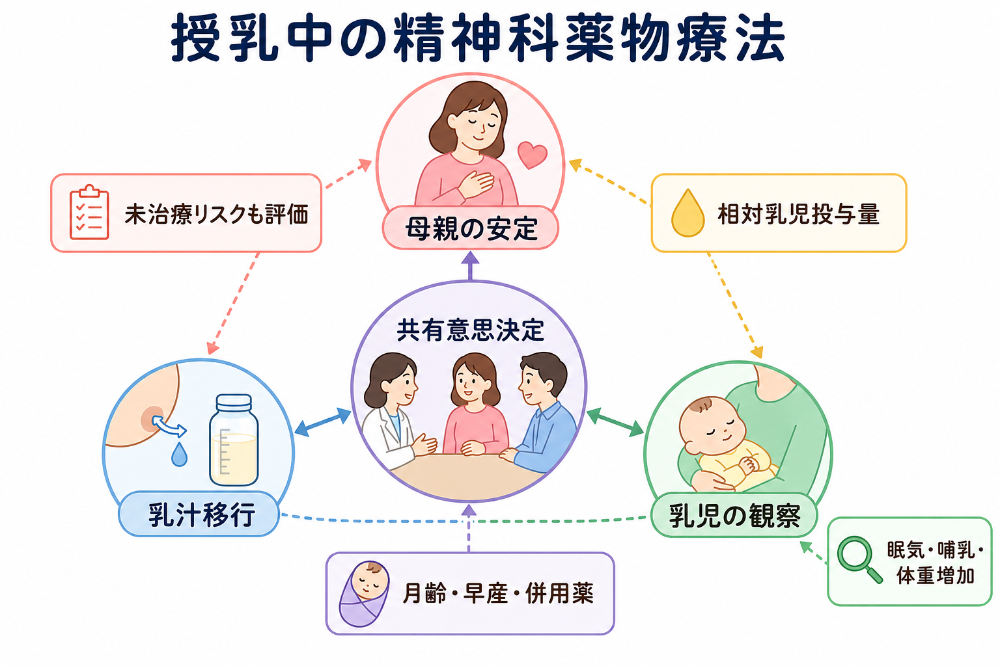
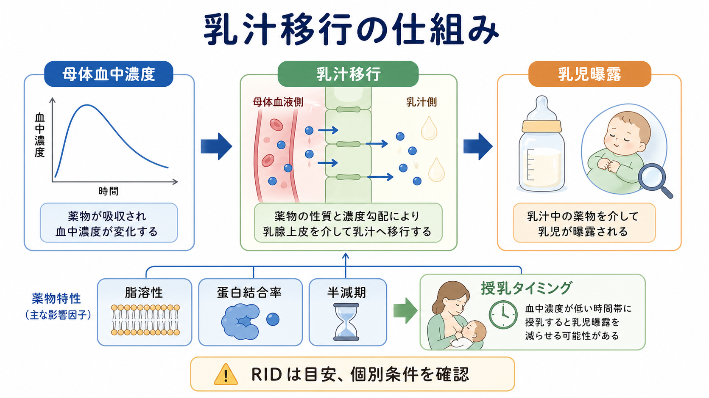
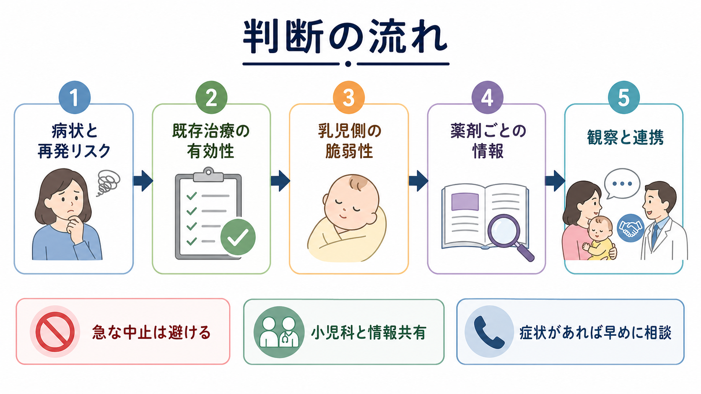

# 授乳中の精神科薬物療法はどう考えるか

## 要点

- 授乳中の[[精神科薬物療法とは何か|精神科薬物療法]]は、「薬を飲むか、授乳するか」の二択ではなく、母親の病状、乳汁移行、乳児の脆弱性、代替治療、家族の支援を合わせて考える。
- 乳児への薬物曝露は、相対乳児投与量 relative infant dose: RID、乳児血中濃度、報告された有害事象、乳児の月齢・早産・併存疾患で評価する。RID 10%未満はしばしば授乳と両立しやすい目安とされるが、薬剤ごとの情報を上書きする基準ではない[1]。
- 母親の未治療または不十分な治療も曝露である。うつ病、双極性障害、精神病症状、不安症状が悪化すれば、睡眠、養育、愛着、安全確保、再入院リスクに影響する[1][2]。
- 既に妊娠中から有効で安定している薬を、授乳だけを理由に機械的に変更しない。変更は再発リスク、交差漸減による一時的な多剤曝露、過去の治療反応を含めて検討する[1][3]。
- 本稿は教育・研究目的の整理であり、個別の診断、処方開始、中止、授乳可否の指示ではない。

## この記事で答える問い

1. 授乳中の精神科薬物療法では、何を比較して判断するのか。
2. 乳汁移行と乳児曝露は、どのような指標で読むのか。
3. 抗うつ薬、抗精神病薬、気分安定薬、ベンゾジアゼピン系薬では何に注意するのか。
4. 「安全な薬を選ぶ」だけでなく、母親の治療継続と乳児観察をどう組み合わせるのか。

## まず結論

授乳中の精神科薬物療法は、**母親の安定を治療目標の中心に置きつつ、乳児への曝露を最小化し、観察計画を明示する**という構造で考える。薬剤の乳汁移行が低くても、母親の症状に効かなければ治療として不十分である。逆に、薬剤が有効でも、早産児、新生児、脱水、感染、併用薬がある乳児では、同じ薬でも観察や検査の必要性が変わる[1][4]。

臨床的には、次の順に整理すると見落としが少ない。

| 見る軸 | 確認すること | 判断での意味 |
|---|---|---|
| 母親側 | 診断、重症度、再発歴、自殺リスク、睡眠、過去に効いた薬 | 治療を遅らせるリスクを評価する |
| 薬剤側 | RID、乳児血中濃度、半減期、蛋白結合率、活性代謝物、乳汁中濃度 | 乳児曝露の大きさと蓄積しやすさを見る |
| 乳児側 | 早産、月齢、低出生体重、肝腎機能、哺乳量、併用薬、脱水・感染 | 同じ曝露でも影響が出やすい条件を確認する |
| 環境側 | 小児科連携、家族支援、夜間睡眠、授乳困難、観察できる人 | 継続可能な治療計画にする |

## 背景

周産期の精神疾患では、症状そのものが母親と乳児の双方に影響する。産後うつ病では、気分、睡眠、哺乳支援、愛着、養育負担の感じ方が相互に影響し、双極性障害や精神病症状では産後早期の再発・急性増悪が問題になる。ABMの授乳中抗うつ薬プロトコルは、未治療の母親の抑うつが母子に長期的影響を持ちうるため、治療の利益と乳児曝露のリスクを個別に評価する必要を強調している[2]。

NICEも、精神科薬を必要とする人には、授乳の利益、授乳中の薬物曝露リスク、授乳のために薬を中止するリスクを説明し、本人の希望を含めて治療選択を話し合うよう推奨している[3]。ここで重要なのは、授乳を支援することと、母親を治療から遠ざけることは同じではないという点である。

## 基本概念

### 相対乳児投与量

RIDは、母乳を介して乳児が受け取る推定用量を、母親の体重補正用量に対する割合として表す指標である。一般には10%未満が授乳と両立しやすい目安として使われるが、早産児、新生児、代謝・排泄の未熟性、薬剤の毒性域、活性代謝物の有無によって意味は変わる[1]。そのため、RIDだけで「安全」「危険」を決めず、乳児血中濃度や臨床症状も合わせて読む。

### 乳児側の観察項目

多くの向精神薬で共通して観察するのは、眠気、哺乳不良、体重増加不良、過度の不機嫌、睡眠変化、下痢・嘔吐、筋緊張低下、発達マイルストーンである。SSRIでは焦燥、不眠、下痢、哺乳不良、体重増加を、リチウムでは嗜眠、哺乳不良、下痢、嘔吐、振戦、筋緊張低下、呼吸困難、甲状腺・腎機能を特に意識する[4][5]。

### 治療継続の利益

授乳中の治療判断では、[[薬物療法のリスクベネフィットをどう考えるか|リスクベネフィット]]を「薬の副作用」だけに狭めない。母親が安定して眠れること、育児の予測可能性が上がること、急性増悪や再入院を防ぐこと、家族支援を組み立てやすくなることも治療の利益である。ACOGは、授乳を希望する精神疾患のある人を一律に授乳から遠ざけず、妊娠中に安定していた薬を産後に機械的に変更しないこと、RIDや乳児の年齢・早産を考慮することを示している[1]。

## 仕組み

薬が母乳へ移行するには、母体血中濃度、乳腺上皮を通る薬物特性、母乳中での濃度、乳児の摂取量、乳児側の吸収・代謝・排泄が関わる。脂溶性が高い、蛋白結合率が低い、半減期が長い、活性代謝物がある、経口吸収が高い薬は、乳児曝露や蓄積を考えやすい。一方、蛋白結合率が高く、乳汁中濃度が低く、乳児血中濃度が検出されにくい薬では、実際の影響は小さいことが多い。

授乳タイミングの調整は、血中濃度のピークが明確で、授乳間隔を無理なく調整できる場合には曝露低減の一助になることがある。ただし、夜間授乳や睡眠不足が症状悪化の引き金になる場合、機械的な搾乳・廃棄は母親の負担を増やす。曝露を少し下げる工夫より、安定して続けられる治療と支援のほうが重要なことも多い。

## 図解

実務上は、以下のような短いフローで記録すると共有しやすい。

1. 病状と再発リスクを確認する。
2. 過去に有効だった治療と、現在の安定性を確認する。
3. 乳児側の脆弱性を確認する。
4. 薬剤ごとの授乳情報を LactMed や専門サービスで確認する。
5. 小児科・産科・精神科で観察項目と相談先を共有する。
6. 症状悪化、乳児症状、薬剤変更のタイミングを決めて再評価する。

## 薬剤群ごとの見方

### 抗うつ薬

[[抗うつ薬とは何か|抗うつ薬]]、とくに[[SSRIとは何か|SSRI]]では、セルトラリンとパロキセチンは乳汁移行が比較的少なく、授乳中の選択肢としてよく挙げられる。LactMedでは、セルトラリンは乳汁中濃度が低く、乳児血中では未検出または低値であることが多く、専門的レビューで授乳中の好ましい抗うつ薬とされることが多い[6]。ABMも、抗うつ薬治療歴がない場合、セルトラリンは乳汁・乳児血清中濃度が低く、安全性プロファイルが比較的よい第一選択候補と述べている[2]。

ただし、既に別のSSRIやSNRIで安定している場合には、授乳だけを理由に変更するとは限らない。SPSは、満期産で健康な乳児であれば、妊娠中に有効だったSSRIを授乳中の推奨薬へ変更する必要は通常ないとし、治療選択は母親の症状コントロールを第一に置くと説明している[5]。

### 抗精神病薬

[[抗精神病薬とは何か|抗精神病薬]]では、薬剤ごとの差が大きい。クエチアピンは、LactMedで母体用量400 mg/日までの乳児曝露が母体体重補正用量の1%未満とされ、第二世代抗精神病薬の中で授乳中の第一または第二選択になりうるとまとめられている[7]。ただし、乳児の眠気、哺乳、体重増加、発達を観察し、他の鎮静薬との併用では注意を強める。

抗精神病薬は[[高プロラクチン血症とは何か|プロラクチン]]を上げる薬と上げにくい薬があり、授乳そのものや月経・性機能にも影響しうる。鎮静、母親の夜間対応力、代謝副作用も、授乳中の生活設計に関わる。

### 気分安定薬

[[気分安定薬とは何か|気分安定薬]]では、薬剤ごとの判断が最も重要である。[[リチウムとは何か|リチウム]]は乳汁移行と乳児血中濃度のばらつきが大きく、以前は授乳禁忌として扱われることがあった。一方、LactMedは、健康な満期産児、特に生後2か月以降の単剤療法では絶対禁忌とはみなさない情報が多いとしつつ、脱水、感染、早産、新生児では急性毒性のリスクが高まるため、母体血中濃度、乳児のリチウム濃度、腎機能、甲状腺機能、臨床症状のモニタリングが必要になりうると述べている[4]。SPSも、リチウムは専門医管理と厳密な乳児モニタリング下で極めて慎重に用いる薬と位置づけている[8]。

[[バルプロ酸とは何か|バルプロ酸]]は母乳中移行が少ないとされるが、妊娠可能年齢の女性では催奇形性・神経発達リスクと妊娠予防プログラムの問題が別に存在する。NICEは、妊娠を計画している、妊娠中、または授乳を考えている女性・女児の精神疾患治療にバルプロ酸を提供しないよう勧めている[3]。[[カルバマゼピンとは何か|カルバマゼピン]]やラモトリギンでは、肝機能、血液、発疹、眠気、哺乳、乳児血中濃度など、薬剤ごとの観察点を確認する。

### ベンゾジアゼピン系薬

[[ベンゾジアゼピン系薬とは何か|ベンゾジアゼピン系薬]]は、短期・低用量・必要時使用と、長期・高用量・多剤併用では意味が異なる。NICEは、妊娠・産後では重度の不安や焦燥の短期治療を除き、ベンゾジアゼピンを提供しないよう勧め、授乳を考える場合には漸減中止を検討するとしている[3]。授乳中に使う場合は、母親の過鎮静、添い寝時の安全、乳児の眠気・哺乳不良・体重増加を具体的に観察する。

## 臨床・研究との接続

臨床で重要なのは、「授乳可能な薬を探す」だけではなく、**治療を続けられる形に調整する**ことである。母親が授乳を強く望む場合、授乳継続を支える薬剤選択、心理療法、睡眠確保、搾乳や混合栄養の選択肢、小児科フォローを組み合わせる。授乳を選ばない場合も、母親が罪悪感や孤立を深めないよう、治療継続と安全な養育環境を支援する。

研究上は、授乳中の薬物療法データは、症例報告、症例集積、薬物動態研究が多く、ランダム化比較試験は倫理的・実務的に難しい。そのため、LactMed、ABM、SPSなどの推奨は、薬物動態、乳児血中濃度、症例報告、専門家判断を統合して作られる。根拠が限られる薬では、「安全性が証明された」ではなく、「利用可能なデータでは重大な問題が少ないが、観察を要する」と読むのが妥当である。

## よくある誤解

### 「薬を飲むなら授乳はできない」

多くの精神科薬で授乳継続は検討可能である。問題は薬剤名だけではなく、用量、単剤か多剤か、乳児の月齢・健康状態、観察体制で変わる。授乳中止を前提にすると、母親が治療を避けたり、自己判断で急に中止したりするリスクがある。

### 「RIDが10%未満なら完全に安全」

RIDは有用な目安だが、万能ではない。リチウムのように治療域・毒性域、乳児の腎機能、脱水の影響が大きい薬では、RIDだけで判断できない[4][8]。早産児や新生児では、低い曝露でも慎重に見る。

### 「授乳のためには、妊娠中に効いていた薬を変更すべき」

変更によって再発リスクが上がることがある。ACOGやSPSは、妊娠中から安定している薬を授乳だけを理由に変更しない考え方を示している[1][5]。変更する場合も、なぜ変えるのか、いつ評価するのか、悪化時にどう戻すのかを決める。

### 「乳児に症状が出たら、すぐ母親の薬が原因」

眠気、哺乳不良、体重増加不良、下痢、泣きの変化は、感染、黄疸、授乳技術、睡眠環境、母親の体調、ほかの薬でも起こる。薬剤性を疑うことは重要だが、乳児の全身評価と小児科的判断を同時に行う。

## 関連ノート

- [[精神科薬物療法とは何か]]
- [[薬物療法のリスクベネフィットをどう考えるか]]
- [[抗うつ薬とは何か]]
- [[SSRIとは何か]]
- [[抗精神病薬とは何か]]
- [[気分安定薬とは何か]]
- [[リチウムとは何か]]
- [[バルプロ酸とは何か]]
- [[カルバマゼピンとは何か]]
- [[ベンゾジアゼピン系薬とは何か]]
- [[高プロラクチン血症とは何か]]

## MOC更新候補

- `content/00_MOC/` 配下の臨床実践、精神医学、薬物療法、周産期メンタルヘルス関連MOCに追加候補。
- 並列ジョブとの競合を避けるため、本稿ではMOC本体は更新しない。

## 理解チェック

1. 授乳中の薬物療法で、RIDだけでは判断できない理由は何か。
2. 母親の未治療リスクには、どのような母子への影響が含まれるか。
3. セルトラリンが授乳中によく選ばれる理由と、例外的に注意すべき条件は何か。
4. リチウムを授乳中に検討する場合、どの乳児条件と検査・観察が重要か。
5. 既に有効な薬を授乳だけを理由に変更しないほうがよい場合があるのはなぜか。

## 未解決問題

- 多くの薬剤で、長期神経発達アウトカムを十分に評価した大規模研究は限られる。
- 多剤併用、早産児、低出生体重児、医学的合併症をもつ乳児では、一般的な授乳情報をそのまま適用しにくい。
- 母親の症状改善、授乳継続、乳児安全、家族負担を同時に測る実装研究が不足している。

## 参考文献

[1] American College of Obstetricians and Gynecologists. (2023). *Treatment and Management of Mental Health Conditions During Pregnancy and Postpartum: ACOG Clinical Practice Guideline No. 5*. Obstetrics & Gynecology, 141(6), 1262-1288. https://www.acog.org/clinical/clinical-guidance/clinical-practice-guideline/articles/2023/06/treatment-and-management-of-mental-health-conditions-during-pregnancy-and-postpartum

[2] Sriraman, N. K., Melvin, K., & Meltzer-Brody, S., Academy of Breastfeeding Medicine. (2015). ABM Clinical Protocol #18: Use of Antidepressants in Breastfeeding Mothers. *Breastfeeding Medicine*, 10(6), 290-299. https://doi.org/10.1089/bfm.2015.29002

[3] National Institute for Health and Care Excellence. (2020). *Antenatal and postnatal mental health: clinical management and service guidance* (CG192). https://www.nice.org.uk/guidance/cg192/chapter/Recommendations

[4] National Library of Medicine. (2025). *Lithium*. Drugs and Lactation Database (LactMed). https://www.ncbi.nlm.nih.gov/books/NBK501153/

[5] Specialist Pharmacy Service. (2024). *Using SSRI antidepressants during breastfeeding*. https://www.sps.nhs.uk/articles/using-ssri-antidepressants-during-breastfeeding/

[6] National Library of Medicine. (2026). *Sertraline*. Drugs and Lactation Database (LactMed). https://www.ncbi.nlm.nih.gov/books/NBK501191/

[7] National Library of Medicine. (2026). *Quetiapine*. Drugs and Lactation Database (LactMed). https://www.ncbi.nlm.nih.gov/books/NBK501087/

[8] Specialist Pharmacy Service. (2024). *Treating bipolar disorder during breastfeeding*. https://www.sps.nhs.uk/articles/treating-bipolar-disorder-during-breastfeeding/
