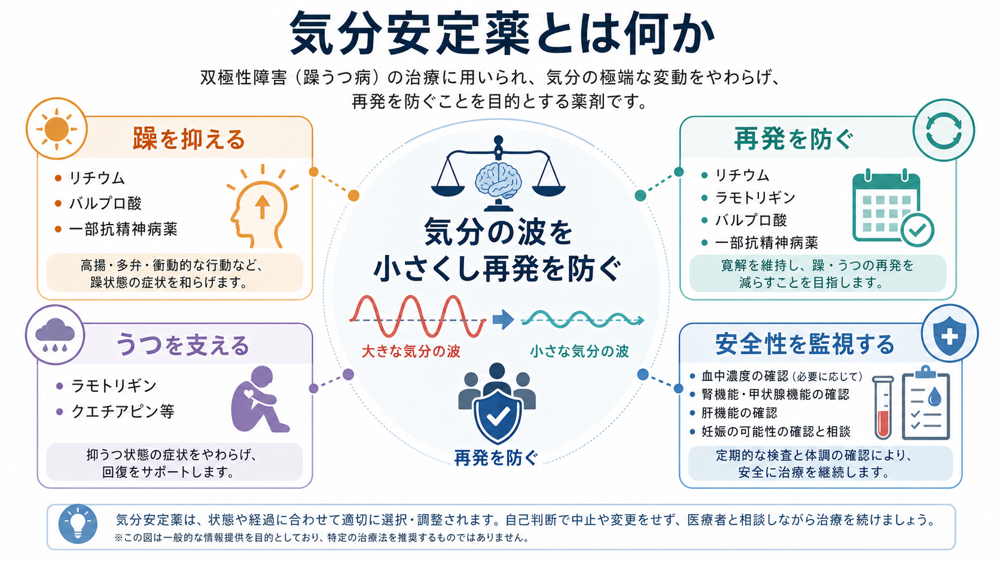
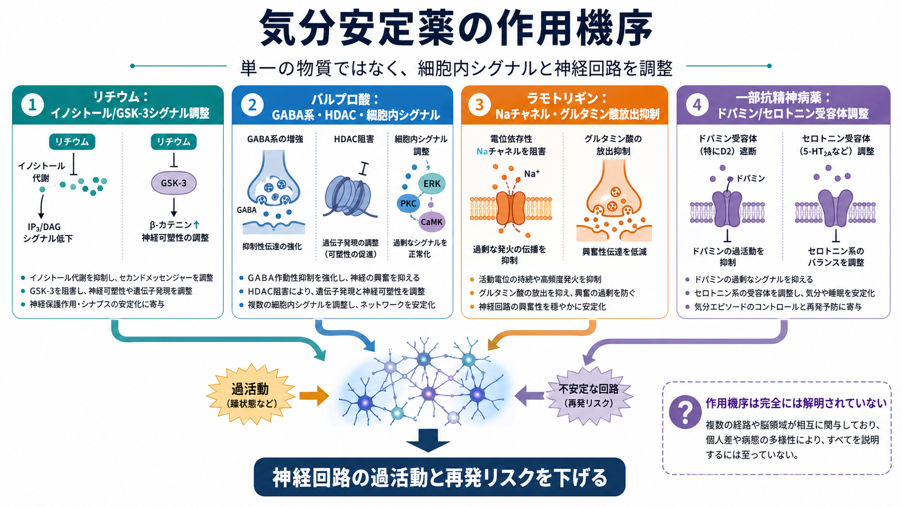
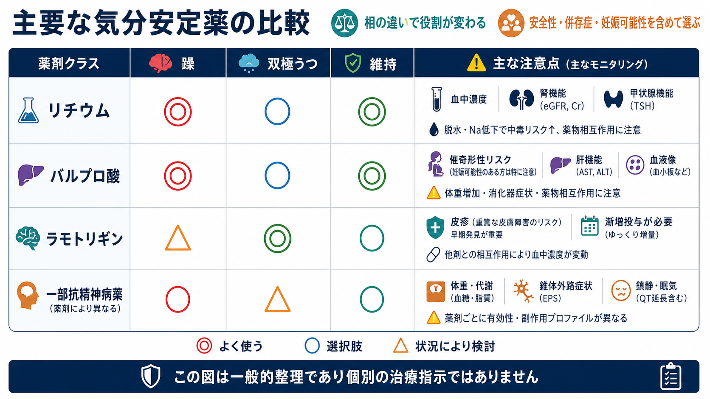

# 気分安定薬とは何か

## 要点

- 気分安定薬は、主に[[双極性障害とは何か|双極性障害]]で、躁・軽躁、双極うつ、再発予防をまたいで使われる薬剤群である。
- 中核はリチウム、バルプロ酸、ラモトリギン、カルバマゼピンなどの古典的薬剤だが、現在のガイドラインではクエチアピン、アリピプラゾール、オランザピンなど一部の第二世代抗精神病薬も相ごとの有効性に応じて同じ治療地図の中で扱われる[1][2]。
- 「気分を上げる薬」でも「気分を平坦にする薬」でもなく、極端な気分エピソードと再発リスクを下げるための長期的な調整薬として理解するのがよい。
- 薬剤ごとに得意な相が異なる。リチウムとバルプロ酸は躁・維持、ラモトリギンは抑うつ再発予防、一部抗精神病薬は急性躁や双極うつで重要になる[2][3][4]。
- 血中濃度、腎機能、甲状腺機能、肝機能、血球、体重・代謝、妊娠可能性などの安全性評価が治療の一部である[1][4]。
- 本記事は教育・研究目的の概説であり、個別の開始・中止・用量調整を指示するものではない。

## この記事で答える問い

1. 気分安定薬とは、どのような薬剤群を指すのか。
2. 双極性障害の躁、うつ、維持療法で、薬剤の役割はどう変わるのか。
3. 作用機序はどこまで分かっており、どこから先は未解明なのか。
4. 臨床で有効性だけでなく安全性を同時に考える理由は何か。

## まず結論

気分安定薬は、[[躁病エピソードとは何か|躁病エピソード]]を鎮める薬だけではない。[[双極I型障害とは何か|双極I型障害]]や[[双極II型障害とは何か|双極II型障害]]では、躁・軽躁、双極うつ、寛解後の再発予防が時間的に連続している。したがって薬物療法も、「いまの症状を下げる」だけでなく、「次のエピソードを減らす」「生活機能を保つ」「副作用や身体リスクを最小化する」という長期設計になる[1][2]。

代表的には、リチウム、バルプロ酸、ラモトリギン、一部の抗精神病薬が重要である。CANMAT/ISBD 2018 ガイドラインでは、急性躁にはリチウム、クエチアピン、バルプロ酸、アリピプラゾール、リスペリドンなどが第一選択群に入り、双極I型うつにはクエチアピン、リチウム、ラモトリギン、ルラシドンなどが挙げられ、維持療法ではリチウム、クエチアピン、バルプロ酸、ラモトリギンなどが第一選択群として整理されている[2]。

## 背景

双極性障害では、気分の変化が一時的な「気分屋」の範囲を超え、睡眠、活動性、判断、対人関係、金銭行動、自殺リスク、身体健康に影響する。[[軽躁病エピソードとは何か|軽躁病エピソード]]は一見「調子がよい」状態として見逃されることがあり、[[うつ病とは何か|うつ病]]に似た抑うつエピソードだけが前景に出ることもある。そのため、抗うつ薬だけで抑うつを扱う発想は双極性障害では不十分になりやすい。

WHO mhGAP 2023 は、成人の急性躁に対して、抗精神病薬またはリチウム・バルプロ酸・カルバマゼピンなどの気分安定薬を、効果、副作用、本人の希望を踏まえて用いることを推奨している[3]。維持療法についても、リチウム、バルプロ酸、カルバマゼピン、または一部の経口抗精神病薬を、個別のリスクと希望を踏まえて検討するとしている[4]。

## 基本概念

### 気分安定薬は単一の薬理クラスではない

「気分安定薬」という語は、厳密な受容体作用で分類された名前ではない。抗うつ薬、抗精神病薬、抗てんかん薬のような薬理学的分類というより、双極性障害の経過を安定させる臨床的な役割に基づく言葉である。

古典的な気分安定薬には、リチウム、バルプロ酸、カルバマゼピン、ラモトリギンが含まれる。一方、現代の治療アルゴリズムでは、クエチアピン、アリピプラゾール、オランザピン、リスペリドン、ルラシドンなども、相ごとの有効性に応じて同じ治療選択肢の中に入る[1][2]。このため「気分安定薬」という語を使うときは、狭義の古典的気分安定薬を指すのか、双極性障害の薬物療法全体を指すのかを区別すると混乱が少ない。

### 躁・うつ・維持で役割が違う

双極性障害の薬物療法では、「躁に強い薬」「双極うつに使われる薬」「維持療法で再発を減らす薬」が完全には一致しない。

| 薬剤群 | 躁・軽躁 | 双極うつ | 維持療法 | 主な注意点 |
|---|---|---|---|---|
| リチウム | 重要 | 選択肢 | 重要 | 血中濃度、腎機能、甲状腺機能、脱水、相互作用 |
| バルプロ酸 | 重要 | 状況により検討 | 選択肢 | 催奇形性・神経発達リスク、肝機能、血球、体重 |
| ラモトリギン | 急性躁には弱い | 選択肢 | 抑うつ再発予防で重要 | 皮疹、重篤な皮膚障害、漸増の必要性 |
| 一部抗精神病薬 | 急性躁で重要 | 薬剤により重要 | 薬剤により選択肢 | 体重・代謝、鎮静、錐体外路症状、QT延長など |

この表は一般的整理であり、特定の患者にどれを選ぶべきかを示すものではない。実際には、過去の反応、副作用歴、併存症、妊娠可能性、希死念慮、服薬継続性、本人の価値観を含めて判断される[1][2]。

## 仕組み

### リチウム

リチウムは、双極性障害の維持療法における歴史的な基準薬である。Cochrane レビューでは、リチウムはプラセボよりも双極性障害の再発予防に有効であることが示されている[5]。一方で治療域が狭く、血中濃度、腎機能、甲状腺機能、神経毒性症状を含めた継続的な評価が必要である[1]。

作用機序は完全には単純化できない。よく議論される仮説として、イノシトール代謝、GSK-3、PKC、神経可塑性、炎症、概日リズムなどへの影響がある。重要なのは、リチウムを「単一の神経伝達物質を増やす薬」と見るより、細胞内シグナルと神経回路の安定性に広く作用する薬として理解することである[7]。

### バルプロ酸

バルプロ酸は、急性躁や維持療法で使われることがある。GABA 系、ナトリウムチャネル、ヒストン脱アセチル化酵素、細胞内シグナルなど複数の作用が知られているが、双極性障害での臨床効果を一つの機序だけで説明することは難しい[7]。

安全性では、妊娠中曝露による胎児奇形と神経発達へのリスクが特に重要である。NICE は MHRA の安全性助言を踏まえ、妊娠可能性のある女性・女児での使用制限、55歳未満で新規開始する場合の厳格な条件、男性の避妊に関する助言などを明記している[1]。WHO も、寛解期の双極性障害において、妊娠可能性のある女性・女児にはバルプロ酸を用いないことを強く推奨している[4]。

### ラモトリギン

ラモトリギンは、急性躁を鎮める薬としては中心ではないが、双極うつや抑うつ再発予防で重要である。Cochrane レビューでは、維持療法においてラモトリギンはプラセボより再発指標を改善し、リチウムと比べると躁症状再発では劣る可能性があるが、有害事象は少ない傾向が示されている[6]。

作用としては、電位依存性ナトリウムチャネルの抑制、グルタミン酸放出の抑制などが説明されることが多い。ただし、臨床上の主な注意点は機序よりも安全な漸増である。皮疹、まれだが重篤な皮膚障害、バルプロ酸などとの相互作用を考慮して、急いで増量しない設計が重要になる。

### 一部の抗精神病薬

第二世代抗精神病薬の一部は、急性躁、双極うつ、維持療法で重要な役割をもつ。たとえば CANMAT/ISBD では、急性躁にクエチアピン、アリピプラゾール、リスペリドンなど、双極うつにクエチアピンやルラシドンなど、維持療法にクエチアピンやアリピプラゾールなどが位置づけられている[2]。

これらはドパミンD2受容体、セロトニン受容体、ヒスタミン受容体、アドレナリン受容体などへの作用を通じて症状を変える。気分安定薬という語から外して「抗精神病薬」とだけ呼ぶと、双極性障害における相ごとの役割が見えにくくなる。一方で、体重増加、糖脂質代謝、鎮静、錐体外路症状、QT延長などの身体リスクを評価する必要がある。

## 図解

図1は、気分安定薬を「躁を抑える」「うつを支える」「再発を防ぐ」「安全性を監視する」という4つの機能から整理したものである。気分安定薬は、単に症状を一時的に弱める薬ではなく、再発予防と生活機能の維持を含む長期治療の一部として使われる。

図2は、代表薬の作用機序を一枚にまとめたものである。リチウム、バルプロ酸、ラモトリギン、抗精神病薬は作用点が異なるが、最終的には興奮性、抑制性、細胞内シグナル、神経回路の安定性に影響すると考えられる。ただし、機序の説明は仮説を含み、効果を完全に説明するものではない。

図3は、薬剤群ごとの役割と安全性を比較したものである。臨床では「どれが一番強いか」ではなく、「現在の相に合うか」「維持療法として続けられるか」「副作用と身体リスクを受け入れられるか」を合わせて考える。

## 臨床・研究との接続

### 長期治療としての視点

双極性障害では、エピソードが改善した後も再発予防が課題になる。WHO は、寛解期の成人に対して気分安定薬または一部抗精神病薬を維持療法として検討するとしているが、その推奨は効果、副作用、本人の希望を慎重に釣り合わせる条件付き推奨である[4]。つまり、長く使う薬ほど「効くか」だけでなく「続けられるか」が重要になる。

### 中止・変更のリスク

リチウムを急に中止すると再発リスクが高まるため、NICE は中止する場合に少なくとも4週間、可能なら3か月かけて漸減し、その後も躁・うつの早期徴候を監視することを推奨している[1]。これはリチウムに限らず、双極性障害の薬物療法全体に共通する発想である。薬の変更は、症状、生活、身体リスクを同時に動かす介入である。

### 自殺リスクと身体合併症

双極性障害では自殺リスクが重要な臨床課題である。リチウムの抗自殺効果については長く議論されてきたが、Cochrane の古い維持療法レビューでは、死亡・自殺関連アウトカムの数が少なく、明確な結論は難しいとしている[5]。したがって、[[気分障害における自殺リスクとは何か|自殺リスク]]の評価は薬剤選択だけに還元せず、危機介入、心理社会的支援、睡眠、物質使用、家族支援と合わせて考える必要がある。

また、薬物療法は身体合併症の評価と切り離せない。リチウムでは腎・甲状腺、バルプロ酸では肝機能・血球・体重・生殖リスク、抗精神病薬では代謝・錐体外路症状などをみる。これは[[精神疾患と身体合併症はどう関係するのか|身体合併症]]の問題であると同時に、[[薬物療法のリスクベネフィットをどう考えるか|薬物療法のリスクベネフィット]]の問題でもある。

## よくある誤解

### 誤解1: 気分安定薬は気分をなくす薬である

気分安定薬の目標は、感情を消すことではない。病的な躁・抑うつエピソードの振幅と再発を減らし、本人が生活上の選択をしやすくすることである。過鎮静、意欲低下、認知鈍麻のような体験があれば、副作用、用量、併用薬、抑うつ症状、睡眠障害を切り分ける必要がある。

### 誤解2: どの気分安定薬も同じである

同じではない。リチウム、バルプロ酸、ラモトリギン、抗精神病薬は、得意な相、作用点、副作用、モニタリングが異なる。双極うつに有用な薬が急性躁にも同じように効くとは限らないし、急性躁で使いやすい薬が長期に最適とは限らない[2][6]。

### 誤解3: 抗精神病薬は精神病症状があるときだけ使う

抗精神病薬という名前は、双極性障害での役割を狭く見せることがある。実際には、急性躁、双極うつ、維持療法の一部で、精神病症状の有無にかかわらず検討される薬剤がある[2][3]。ただし、代謝や運動系の副作用評価が必要である。

### 誤解4: 良くなったら自己判断で中止してよい

双極性障害では、寛解後の維持療法が再発予防の中心になる。とくにリチウムの急な中止は再発に関連しうるため、NICE は漸減と中止後の監視を推奨している[1]。副作用や妊娠計画などで変更が必要な場合も、治療者と計画的に扱う問題である。

## 関連ノート

- [[双極性障害とは何か]]
- [[双極I型障害とは何か]]
- [[双極II型障害とは何か]]
- [[躁病エピソードとは何か]]
- [[軽躁病エピソードとは何か]]
- [[うつ病とは何か]]
- [[薬物療法は神経回路にどう作用するのか]]
- [[薬物療法のリスクベネフィットをどう考えるか]]
- [[精神疾患と身体合併症はどう関係するのか]]
- [[気分障害における自殺リスクとは何か]]

関連ノート候補:

- リチウムとは何か
- バルプロ酸とは何か
- ラモトリギンとは何か
- 双極うつとは何か
- 双極性障害の維持療法とは何か
- 薬物療法における血中濃度モニタリングとは何か

MOC更新候補:

- `content/00_MOC/MOC｜臨床実践・治療.md`
- `content/00_MOC/MOC｜精神医学.md`
- `content/00_MOC/MOC｜疾患・症候群.md`

このジョブでは、並列編集の競合を避けるため MOC 本体は更新しない。

## 理解チェック

1. 気分安定薬が「単一の薬理クラス」ではないと言える理由は何か。
2. 急性躁、双極うつ、維持療法で薬剤の役割が変わる例を一つ挙げると何か。
3. リチウムで血中濃度、腎機能、甲状腺機能を確認する理由は何か。
4. バルプロ酸で妊娠可能性や生殖リスクを重視する理由は何か。
5. 「よくなったら自己判断で中止してよい」という考え方が危険な理由は何か。

## 参考文献

[1] National Institute for Health and Care Excellence. (2025). *Bipolar disorder: assessment and management. NICE Clinical Guideline CG185*. Last updated 2 September 2025. https://www.nice.org.uk/guidance/cg185

[2] Yatham, L. N., Kennedy, S. H., Parikh, S. V., et al. (2018). Canadian Network for Mood and Anxiety Treatments and International Society for Bipolar Disorders 2018 guidelines for the management of patients with bipolar disorder. *Bipolar Disorders, 20*(2), 97-170. https://doi.org/10.1111/bdi.12609

[3] World Health Organization. (2023). *Antipsychotics and mood stabilizers in individuals with bipolar mania*. mhGAP Evidence Centre. https://www.who.int/teams/mental-health-and-substance-use/treatment-care/mental-health-gap-action-programme/evidence-centre/psychosis-and-bipolar-disorders/antipsychotics-and-mood-stabilizers-in-individuals-with-bipolar-mania

[4] World Health Organization. (2023). *Antipsychotics and mood stabilizers (lithium, valproate, or carbamazepine) for maintenance treatment of bipolar disorder*. mhGAP Evidence Centre. https://www.who.int/teams/mental-health-and-substance-use/treatment-care/mental-health-gap-action-programme/evidence-centre/psychosis-and-bipolar-disorders/antipsychotics-and-mood-stabilizers-%28lithium-valproate-or-carbamazepine%29-for-maintenance-treatment-of-bipolar-disorder

[5] Burgess, S., Geddes, J., Hawton, K., Taylor, M. J., Townsend, E., Jamison, K., & Goodwin, G. (2001). Lithium for maintenance treatment of mood disorders. *Cochrane Database of Systematic Reviews*, CD003013. https://doi.org/10.1002/14651858.CD003013

[6] Hashimoto, Y., Kotake, K., Watanabe, N., Fujiwara, T., & Sakamoto, S. (2021). Lamotrigine in the maintenance treatment of bipolar disorder. *Cochrane Database of Systematic Reviews*, CD013575. https://doi.org/10.1002/14651858.CD013575.pub2

[7] Yu, W., & Greenberg, M. L. (2016). Inositol depletion, GSK3 inhibition and bipolar disorder. *Future Neurology, 11*(2), 135-148. https://doi.org/10.2217/fnl-2016-0003

## 未解決問題

- 気分安定薬の臨床効果を、細胞内シグナル、神経可塑性、概日リズム、炎症、認知機能のどの水準で統合的に説明できるのか。
- 双極うつに対する薬剤選択を、症状プロファイル、過去の躁転リスク、睡眠・概日リズム、身体合併症からどこまで個別化できるのか。
- 長期維持療法で、再発予防、生活機能、身体リスク、本人の希望を統合する意思決定支援をどのように実装するのか。

## 更新ログ

- 2026-04-28: 初稿作成。気分安定薬の基本概念、代表薬、作用機序、安全性、臨床上の位置づけ、図解、参考文献を整理。
