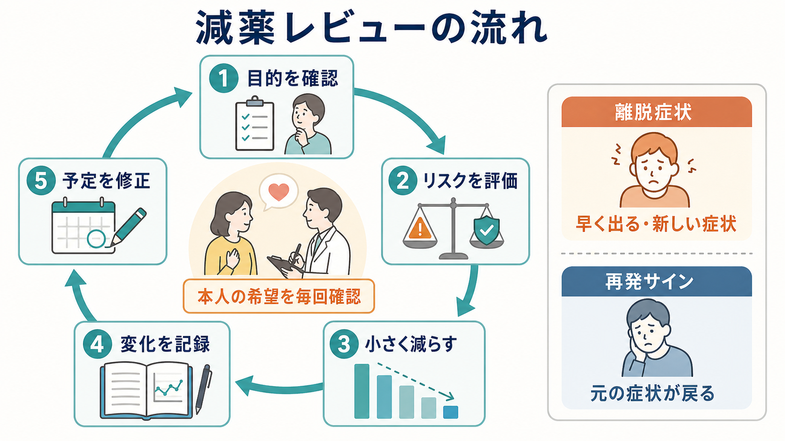
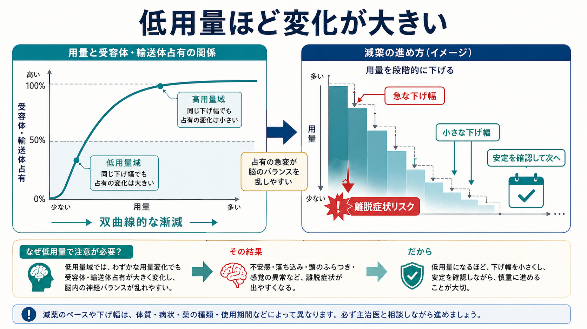

# 減薬と中止はどう進めるべきか

## 要点

- 減薬・中止は「薬をやめること」だけでなく、現在の治療目標、再発リスク、離脱症状、副作用、生活上の負担、本人の希望を同時に見直す臨床プロセスである[1][2]。
- 急な中止は離脱症状や症状悪化を招きやすい。多くの場合、本人と処方者が相談しながら、少量ずつ、変化を見て、必要なら一時停止・増量・別方針を検討する[1][3]。
- 再発リスクと離脱症状は似て見えることがある。発現時期、症状の質、身体症状の新規出現、過去エピソードとの類似性、生活ストレスを合わせて考える[1][3]。
- 低用量域では同じ mg の減量でも受容体・輸送体占有の変化が大きくなりうるため、終盤ほど小さな下げ幅が必要になることがある[4]。
- 本稿は教育・研究目的の整理であり、個別の減薬計画や中止指示ではない。実際の調整は主治医・薬剤師などと相談して行う。

## この記事で答える問い

1. 減薬・中止を始める前に、何を確認するべきか。
2. 再発リスク、離脱症状、患者希望をどう同じ場で扱うか。
3. 「段階的に減らす」とは、実際にはどのような考え方か。
4. 抗うつ薬、抗精神病薬、ベンゾジアゼピン系薬で注意点はどう違うか。

## まず結論

減薬と中止は、単純な「続けるか、やめるか」の二択ではない。実践上は、次の順に考えると整理しやすい。

1. 何のために減らすのかを明確にする。副作用軽減、妊娠・身体疾患、認知機能、眠気、費用、本人の価値観、長期使用への不安など、目的を言語化する。
2. 減らさない場合の不利益と、減らす場合の不利益を並べる。副作用の持続だけでなく、再発、離脱症状、生活機能低下、救急受診、家族負担も含める[1][2]。
3. いきなり止めず、段階的に下げる。症状が落ち着いている期間、過去の再発歴、薬の種類、使用期間、半減期、服薬量、支援体制を踏まえて速度を調整する[1][3]。
4. 減薬中は「予定通り進むか」ではなく「観察しながら予定を修正できるか」を重視する。

## 背景

精神科薬物療法では、薬を始める場面だけでなく、続ける・減らす・止める場面にも臨床判断が必要になる。たとえば[[抗うつ薬とは何か|抗うつ薬]]では、再発予防のために一定期間の継続が有用なことがある一方、長期使用中の副作用や本人の中止希望も問題になる。[[抗精神病薬とは何か|抗精神病薬]]では、維持療法が再発予防に大きく関わるが、代謝副作用、錐体外路症状、高プロラクチン血症なども無視できない。[[ベンゾジアゼピン系薬とは何か|ベンゾジアゼピン系薬]]では、眠気、転倒、認知機能、依存・離脱の問題が減薬検討の中心になることが多い[1][7][8]。

重要なのは、減薬が「薬物療法を否定する行為」ではないことである。むしろ、[[薬物療法のリスクベネフィットをどう考えるか|薬物療法のリスクベネフィット]]を、病状の変化と本人の生活に合わせて再評価する作業である。

## 基本概念

### 再発リスク

再発リスクとは、薬を減らしたり止めたりしたあとに、もとの精神症状が再び強くなる可能性である。うつ病の維持期研究では、抗うつ薬の継続群に比べて中止群で再発が増えることが示されている[6]。統合失調症では、抗精神病薬の維持療法がプラセボに比べて再発を減らすことがメタ解析で示されている[7]。

ただし、集団平均の再発リスクをそのまま個人に当てはめることはできない。過去のエピソード数、重症度、自殺リスク、入院歴、心理社会的ストレス、家族・支援者の有無、仕事や学業の状況、本人が再発をどれほど避けたいかによって、判断の重みは変わる。

### 離脱症状

離脱症状は、薬を急に止めたり、短期間で減らしたりしたあとに現れる症状である。抗うつ薬では、めまい、しびれ、電撃感、不眠、不安、吐き気、発汗、倦怠感などが報告される[3][5]。ベンゾジアゼピン系薬では、不眠、不安、焦燥、振戦、知覚過敏、けいれんなどに注意が必要である[1][8]。

離脱症状の頻度や重症度の推定には幅がある。2024年の系統的レビュー・メタ解析は、プラセボ群にも症状が出ることを考慮したうえで、抗うつ薬中止に帰属できる症状は一部の患者に生じ、重度の症状は少数に限られると推定している[5]。一方、臨床上は長くつらい離脱を経験する人もいるため、「平均的には少ない」ことを理由に本人の訴えを軽く扱ってはならない。

### 患者希望

患者希望は、単なる「薬を飲みたい・飲みたくない」という表明ではない。副作用を避けたい、再発が怖い、妊娠を考えている、仕事中の眠気を減らしたい、過去の強い離脱が不安、薬を飲むことへの抵抗感があるなど、複数の価値観が含まれる。NICE は、依存や離脱に関連する薬剤について、処方開始時から中止の難しさや管理方法を話し合うことを重視している[1]。

## 仕組み

### 薬理学的な変化は直線的ではない

臨床では「10 mg 減らす」といった表現を使いやすい。しかし薬理作用は、必ずしも用量に対して直線的に変化しない。SSRI などでは、低用量域で用量を少し下げただけでも、セロトニン輸送体占有率の変化が相対的に大きくなる可能性がある。Horowitz と Taylor は、この非線形性を踏まえ、低用量域ほど小さな刻みで減らす「双曲線的な漸減」を提案している[4]。

この考え方は、すべての薬に同じスケジュールを当てはめるという意味ではない。むしろ、薬の種類、剤形、半減期、過去の離脱症状、本人の不安、生活上の制約に応じて、終盤ほど慎重にする理由を与える。

### 離脱症状と再発は時間軸で見分ける

離脱症状は、減量・中止のあと比較的早い時期に出ることが多く、めまい、しびれ、電撃感、吐き気など、もとの病相には目立たなかった身体症状を伴うことがある[3]。再発は、過去のエピソードに似た気分症状、精神病症状、不安症状、睡眠・活動性の変化として現れることが多い。

ただし、両者は重なりうる。離脱による不眠や不安が再発を誘発することもあれば、再発初期が離脱のように見えることもある。したがって、判断は一回の診察で決めきるのではなく、症状日誌、家族・支援者からの情報、生活イベント、服薬変更の時点を合わせて検討する。

## 図解

上の 2 枚は、減薬・中止の実務を「レビューの流れ」と「低用量域で注意が必要な理由」に分けて示したものである。図に示した流れは、固定スケジュールではなく、話し合いのための枠組みである。

実際には、次のような短い記録が役に立つ。

| 観察項目 | 記録すること |
|---|---|
| 減薬量 | いつ、どの薬を、どの程度減らしたか |
| 睡眠 | 入眠、途中覚醒、早朝覚醒、日中の眠気 |
| 気分・不安 | 落ち込み、不安、焦燥、意欲、希死念慮 |
| 身体症状 | めまい、吐き気、しびれ、発汗、振戦 |
| 生活機能 | 仕事、学業、家事、対人関係、外出 |
| 安全性 | 自傷他害リスク、けいれん、混乱、脱水、転倒 |

## 臨床・研究との接続

### 抗うつ薬

[[SSRIとは何か|SSRI]]、[[SNRIとは何か|SNRI]]、三環系抗うつ薬などでは、薬剤ごとの半減期や薬理作用の違いが中止症状に影響する。NICE は、抗うつ薬を止めるときには通常段階的に減らし、各段階で前回量の一定割合として減らすこと、低用量になるほど小さな減量が必要になること、症状が落ち着くまで次の減量を待つことを推奨している[2]。

抗うつ薬の中止を検討する際は、急性期治療が終わったか、再発予防がどの程度必要か、過去の再発回数、重症度、自殺リスク、本人の希望を確認する。既に離脱症状を経験した人では、よりゆっくりした減量や剤形の工夫が必要になることがある[3][4]。関連する症状は [[抗うつ薬中止症候群とは何か]] でも扱う。

### 抗精神病薬

抗精神病薬では、再発予防の利益が大きい一方で、代謝副作用、錐体外路症状、鎮静、高プロラクチン血症などの負担が長期使用の課題になる。統合失調症に関するメタ解析では、維持療法が再発を減らす一方、体重増加や運動症状などの副作用も検討対象になる[7]。

そのため、抗精神病薬の減薬は、症状が安定しているから機械的に進めるのではなく、過去の再発様式、入院歴、服薬中断歴、家族や支援者の気づきやすさ、早期警告サインを確認して行う。再発時の被害が大きい場合は、減薬より副作用対策、薬剤変更、身体管理を優先することもある。

### ベンゾジアゼピン系薬

ベンゾジアゼピン受容体作動薬では、長期使用による転倒、認知機能、眠気、依存・離脱が問題になりやすい。高齢者や複数薬剤使用では特に慎重な見直しが必要である[8]。減薬支援のガイドラインは、本人の同意、教育、段階的な減量、睡眠や不安への非薬物的支援を重視している[8]。

急な中止は避ける。アルコール使用、けいれん歴、高用量使用、複数の鎮静薬併用、重い不安や不眠がある場合は、特に専門的な管理が必要になる。

## よくある誤解

### 「薬を減らせば必ずよくなる」

副作用や負担が軽くなる可能性はあるが、再発、離脱症状、睡眠悪化、生活機能低下が起きることもある。減薬の利益は、薬を減らした量ではなく、本人にとって意味のある生活上の改善で評価する。

### 「離脱症状は気のせいである」

離脱症状は研究上も臨床上も認められている現象である[1][3][5]。ただし、すべての症状を離脱と決めつけるのも危険である。再発、身体疾患、薬物相互作用、生活ストレスを同時に評価する必要がある。

### 「再発が怖いなら一生変えられない」

再発リスクが高い場合でも、用量調整、副作用対策、薬剤変更、心理社会的支援、身体管理など、選択肢は複数ある。中止が難しいことと、治療計画を見直せないことは同じではない。

### 「減薬スケジュールは標準表どおりでよい」

標準表は出発点にはなるが、過去の離脱症状、薬の種類、使用期間、剤形、本人の不安、生活上の予定によって調整が必要である。減薬中に症状が強く出た場合は、次の段階に進まず、いったん維持する、前の量に戻す、別の減らし方にするなどの選択肢を検討する[1][3]。

## 関連ノート

- [[精神科薬物療法とは何か]]
- [[薬物療法のリスクベネフィットをどう考えるか]]
- [[抗うつ薬とは何か]]
- [[抗うつ薬中止症候群とは何か]]
- [[SSRIとは何か]]
- [[SNRIとは何か]]
- [[抗精神病薬とは何か]]
- [[ベンゾジアゼピン系薬とは何か]]
- [[非ベンゾジアゼピン系睡眠薬とは何か]]

### 関連ノート候補

- 向精神薬の減薬モニタリングとは何か
- 再発サインと離脱症状をどう見分けるか
- 抗精神病薬の維持療法をどう考えるか
- ベンゾジアゼピン系薬の減薬支援とは何か

### MOC 更新候補

- `content/00_MOC/` 配下の臨床実践・治療、薬物療法、精神科薬物療法関連 MOC に追加候補。
- 並列ジョブとの衝突を避けるため、本稿では MOC 本体は更新しない。

## 理解チェック

1. 減薬を始める前に、本人の希望以外に確認すべき再発リスク要因を3つ挙げられるか。
2. 離脱症状と再発を見分けるとき、発現時期と症状の質をどう使うか説明できるか。
3. 低用量域ほど小さな下げ幅が必要になりうる理由を、受容体・輸送体占有の非線形性から説明できるか。
4. 抗うつ薬、抗精神病薬、ベンゾジアゼピン系薬で、減薬時に重視するリスクの違いを述べられるか。

## 未解決問題

- 個々の薬剤・剤形に対する最適な減薬速度は、十分に標準化されていない。
- 離脱症状と再発を早期に区別するための客観的指標は限られている。
- 長期服薬者、複数薬剤使用者、高齢者、身体疾患併存例では、研究知見をそのまま適用しにくい。
- 減薬支援における心理教育、睡眠介入、デジタル記録、家族支援の最適な組み合わせは今後の課題である。

## 参考文献

[1] National Institute for Health and Care Excellence. (2022). *Medicines associated with dependence or withdrawal symptoms: safe prescribing and withdrawal management for adults* (NICE guideline NG215). https://www.nice.org.uk/guidance/ng215/chapter/Recommendations

[2] National Institute for Health and Care Excellence. (2022). *Depression in adults: treatment and management* (NICE guideline NG222), recommendations on stopping antidepressants. https://www.nice.org.uk/guidance/ng222/chapter/Recommendations

[3] Royal College of Psychiatrists. (2024). *Stopping antidepressants*. https://www.rcpsych.ac.uk/mental-health/treatments-and-wellbeing/stopping-antidepressants

[4] Horowitz, M. A., & Taylor, D. (2019). Tapering of SSRI treatment to mitigate withdrawal symptoms. *The Lancet Psychiatry, 6*(6), 538-546. https://doi.org/10.1016/S2215-0366(19)30032-X

[5] Henssler, J., Schmidt, Y., Schmidt, U., Schwarzer, G., Bschor, T., & Baethge, C. (2024). Incidence of antidepressant discontinuation symptoms: a systematic review and meta-analysis. *The Lancet Psychiatry, 11*(7), 526-535. https://doi.org/10.1016/S2215-0366(24)00133-0

[6] Lewis, G., Marston, L., Duffy, L., et al. (2021). Maintenance or discontinuation of antidepressants in primary care. *New England Journal of Medicine, 385*, 1257-1267. https://doi.org/10.1056/NEJMoa2106356

[7] Leucht, S., Tardy, M., Komossa, K., et al. (2012). Antipsychotic drugs versus placebo for relapse prevention in schizophrenia: a systematic review and meta-analysis. *The Lancet, 379*(9831), 2063-2071. https://doi.org/10.1016/S0140-6736(12)60239-6

[8] Pottie, K., Thompson, W., Davies, S., et al. (2018). Deprescribing benzodiazepine receptor agonists: evidence-based clinical practice guideline. *Canadian Family Physician, 64*(5), 339-351. https://www.cfp.ca/content/64/5/339
