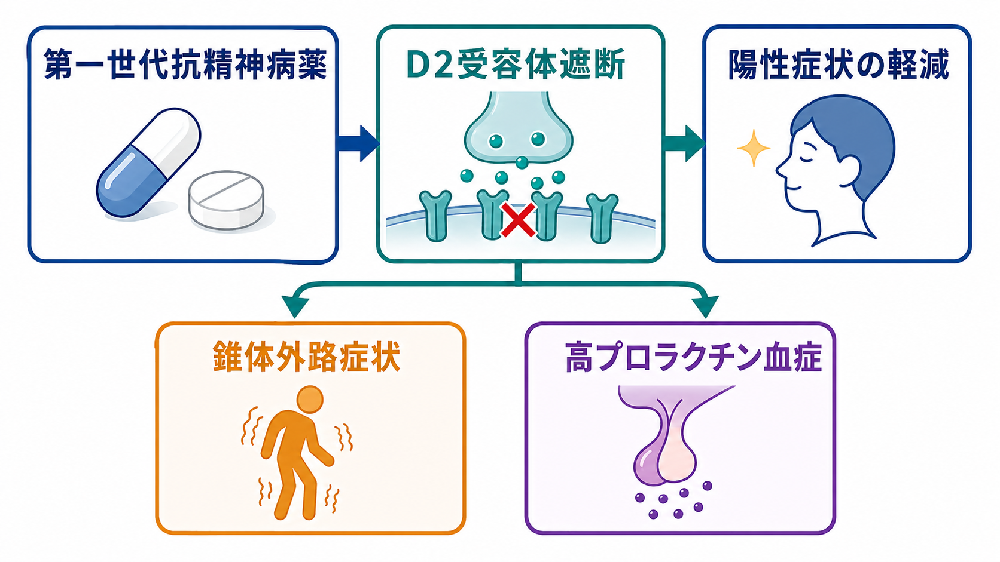
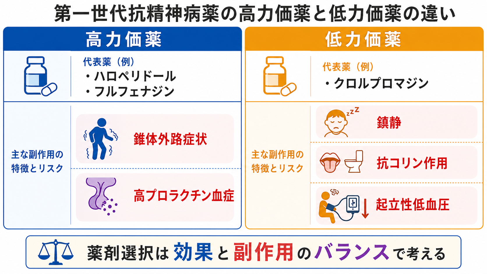
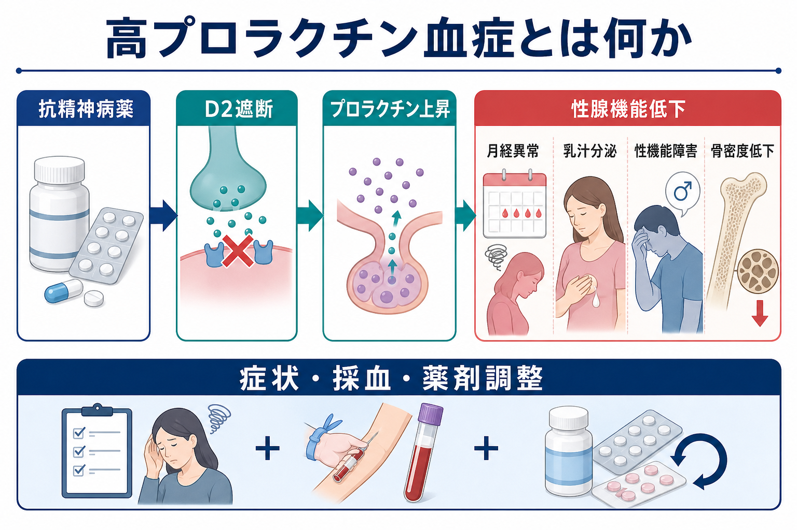

# 第一世代抗精神病薬とは何か

## 要点

- 第一世代抗精神病薬は、主にドパミンD2受容体を遮断することで、統合失調症などにみられる幻覚・妄想・興奮などの陽性症状を軽減する薬剤群である[1][2]。
- 「定型抗精神病薬」とも呼ばれ、ハロペリドール、フルフェナジン、クロルプロマジンなどが代表例である。薬剤ごとに鎮静、抗コリン作用、起立性低血圧、QT延長などの出方は異なる[1][3]。
- 重要な副作用は、黒質線条体路のD2遮断に関連する錐体外路症状と、漏斗下垂体路のD2遮断に関連する高プロラクチン血症である[2][4][5]。
- 本記事は教育・研究目的の整理であり、個別の開始・中止・増減量を指示するものではない。実際の治療では症状、身体リスク、本人の希望、過去の副作用歴を含めて判断する。

## この記事で答える問い

1. 第一世代抗精神病薬は、第二世代抗精神病薬と何が違うのか。
2. なぜD2受容体遮断が抗精神病作用と副作用の両方に関わるのか。
3. 錐体外路症状と高プロラクチン血症は、どのように理解すればよいのか。
4. 臨床で薬剤を選ぶとき、効果だけでなく何を確認する必要があるのか。

## まず結論

第一世代抗精神病薬は、「D2受容体遮断を中心に陽性症状を抑えるが、その同じ作用が運動系と内分泌系の副作用にもつながる薬」と理解するとよい。中脳辺縁系で過剰なドパミン信号を抑えることは抗精神病作用の一部として説明される。一方、黒質線条体路でD2遮断が強く出ると、パーキンソニズム、急性ジストニア、アカシジア、遅発性ジスキネジアなどの錐体外路症状が問題になる[2][4]。

また、漏斗下垂体路ではドパミンがプロラクチン分泌を抑える方向に働くため、D2遮断によりプロラクチンが上昇しやすい。高プロラクチン血症は、月経異常、乳汁分泌、性機能低下、不妊、長期的な骨密度低下などと関連しうる[5][6]。

## 背景

抗精神病薬は、統合失調症スペクトラムの精神病症状、躁状態の興奮、せん妄や重度の焦燥など、複数の臨床状況で使われることがある。ただし、診断、年齢、併存疾患、併用薬、妊娠可能性、心血管リスク、本人の価値観によって適切性は変わる。したがって薬剤選択は、単に「効くか」ではなく、「どの副作用リスクをどの程度受け入れられるか」を含む[[共同意思決定とは何か]]の課題になる[1][3]。

第一世代抗精神病薬は、第二世代抗精神病薬より古い薬という意味だけでなく、臨床的には「D2遮断の寄与が強く、錐体外路症状やプロラクチン上昇に注意が必要な薬剤群」として整理される。ただし、第一世代の中でも高力価薬と低力価薬では副作用プロファイルが異なる。

## 基本概念

### 第一世代抗精神病薬

第一世代抗精神病薬は、英語では first-generation antipsychotics、または typical antipsychotics と呼ばれる。代表薬には、ハロペリドール、フルフェナジン、ペルフェナジン、クロルプロマジンなどがある[2][3]。

高力価薬は比較的少ない用量でD2遮断作用を示しやすく、錐体外路症状や高プロラクチン血症に注意する。ハロペリドール、フルフェナジンなどが典型例である。低力価薬は、D2遮断だけでなくヒスタミンH1、ムスカリン、α1受容体などへの作用が目立ちやすく、鎮静、口渇、便秘、尿閉、起立性低血圧などが問題になりやすい。クロルプロマジンは低力価薬として扱われることが多い[2][3]。

### 錐体外路症状

錐体外路症状は、抗精神病薬による運動系副作用の総称である。臨床的には、筋強剛、振戦、動作緩慢などの薬剤性パーキンソニズム、じっとしていられないアカシジア、急に筋肉が収縮する急性ジストニア、長期使用後に口舌・顔面・体幹などの不随意運動が出る遅発性ジスキネジアを区別する[4]。

アカシジアは不安や焦燥と誤認されやすく、見逃すと苦痛や服薬中断につながる。したがって[[精神状態診察MSEとは何か]]や[[MSEで外観と行動から何を観察するか]]では、主観的な「むずむずする」「座っていられない」という訴えと、足踏み、歩き回り、姿勢変化などの観察所見を分けて確認する。

### 高プロラクチン血症

プロラクチンは下垂体前葉から分泌されるホルモンで、通常は視床下部からのドパミンにより抑制されている。D2受容体が遮断されると、この抑制が弱まり、プロラクチンが上昇しやすくなる[5][6]。

症状としては、月経異常、乳汁分泌、性欲低下、勃起障害、不妊、乳房痛などがある。長期的には性腺機能低下を介して骨密度低下に関わる可能性があるため、本人が言い出しにくい症状も含めて、説明と確認が重要になる[5][6]。

## 仕組み

第一世代抗精神病薬の中心的な薬理作用はD2受容体遮断である。ドパミン経路ごとに、同じD2遮断が異なる臨床効果・副作用として現れる。

| 経路 | D2遮断で起こりうること | 臨床的な意味 |
|---|---|---|
| 中脳辺縁系 | 過剰なドパミン信号の抑制 | 幻覚・妄想など陽性症状の軽減に関わる |
| 黒質線条体路 | 運動調節の乱れ | 錐体外路症状のリスク |
| 漏斗下垂体路 | プロラクチン分泌の抑制解除 | 高プロラクチン血症のリスク |
| 中脳皮質系 | ドパミン信号の低下 | 認知・陰性症状への影響は単純ではない |

PET研究を含む薬理学的研究では、D2受容体占有率が抗精神病作用と錐体外路症状の両方に関係することが示されてきた。一般に、効果には一定以上のD2占有が必要だが、占有が高すぎると錐体外路症状が増えやすいと整理される[7]。ただし、実際の症状は占有率だけで決まらず、年齢、既往歴、用量、投与速度、併用薬、薬剤ごとの受容体プロファイルが関わる。

## 図解

上の3枚の図は、それぞれ次の役割で読む。

- 1枚目は、第一世代抗精神病薬を「D2遮断を軸に、効果と副作用が同時に生じる薬」と把握するための概念図である。
- 2枚目は、高プロラクチン血症の機序を、D2遮断、プロラクチン上昇、症状確認、薬剤調整という流れで示している。
- 3枚目は、高力価薬と低力価薬の副作用傾向の違いを示している。これは厳密な二分法ではなく、臨床で注意すべきリスクの見取り図である。

## 臨床・研究との接続

治療では、急性期の精神病症状を抑える効果と、長期的な忍容性を分けて考える必要がある。薬剤が短期的に有効でも、アカシジア、パーキンソニズム、性機能低下、月経異常、強い鎮静などが続けば、[[アドヒアランスとは何か]]の問題につながる[1][3]。

ガイドラインでは、抗精神病薬を開始する前後に、効果だけでなく運動症状、体重、血糖、脂質、血圧、心電図リスク、プロラクチン関連症状などを系統的に評価することが推奨される[1][3]。第一世代抗精神病薬では、特に錐体外路症状とプロラクチン上昇を早期から確認する。

研究上は、第一世代抗精神病薬は「D2遮断仮説」を理解するうえで重要な薬剤群である。しかし、統合失調症や精神病症状をD2だけで説明することはできない。グルタミン酸、GABA、セロトニン、炎症、発達、ストレス、社会的要因なども関与するため、第一世代抗精神病薬は病態全体の説明ではなく、薬理学的な入口として位置づけるのがよい[8]。

## よくある誤解

### 「第一世代は古いから、現在は使わない」

古い薬剤群であることは事実だが、現在も急性興奮、せん妄、過去に有効で忍容性が確認されているケース、注射製剤が必要な場面などで使われることがある。重要なのは、第一世代か第二世代かという名前だけでなく、個々の薬剤の効果、副作用、本人の経験を評価することである[1][3]。

### 「錐体外路症状は見ればすぐわかる」

アカシジアのように主観的苦痛が中心になる症状は、単なる不安、焦燥、病状悪化と区別しにくい。薬剤開始、増量、切り替え後の時間関係を確認し、身体所見と本人の訴えを合わせて評価する必要がある[4]。

### 「高プロラクチン血症は検査値だけの問題」

高プロラクチン血症は、検査値だけでなく、性機能、月経、乳汁分泌、妊孕性、骨密度など生活の質に関わる。本人が言いにくいテーマであるため、医療者側から中立的に確認することが重要である[5][6]。

### 「副作用が出たら自己判断で止めればよい」

急な中止は再燃、離脱様症状、治療関係の悪化につながることがある。副作用が疑われる場合は、薬剤歴、用量、併用薬、身体疾患を確認し、減量、切り替え、対症療法、モニタリングを含めて検討する。これは[[インフォームドコンセントは精神科でどう行うのか]]や[[治療関係とは何か]]とも関わる。

## 関連ノート

- [[共同意思決定とは何か]]
- [[アドヒアランスとは何か]]
- [[インフォームドコンセントは精神科でどう行うのか]]
- [[精神状態診察MSEとは何か]]
- [[MSEで外観と行動から何を観察するか]]
- [[精神疾患とは何か]]

### 関連ノート候補

- 第二世代抗精神病薬とは何か
- 錐体外路症状とは何か
- 高プロラクチン血症とは何か
- アカシジアとは何か
- 遅発性ジスキネジアとは何か
- 抗精神病薬の副作用モニタリングとは何か

### MOC更新候補

- `content/00_MOC/MOC｜臨床実践・治療.md`
- `content/00_MOC/MOC｜精神医学.md`

## 理解チェック

1. 第一世代抗精神病薬の中心的な薬理作用は何か。
2. 黒質線条体路のD2遮断は、どのような副作用と関係するか。
3. 漏斗下垂体路のD2遮断は、なぜプロラクチン上昇につながるか。
4. 高力価薬と低力価薬では、副作用の注意点がどのように異なるか。
5. アカシジアを、単なる不安や焦燥と混同しないために何を確認するべきか。

## 参考文献

[1] National Institute for Health and Care Excellence. (2014, updated). *Psychosis and schizophrenia in adults: prevention and management (CG178).* https://www.nice.org.uk/guidance/cg178

[2] Muench, J., & Hamer, A. M. (2010). Adverse effects of antipsychotic medications. *American Family Physician, 81*(5), 617-622. https://www.aafp.org/pubs/afp/issues/2010/0301/p617.html

[3] American Psychiatric Association. (2020). *The American Psychiatric Association Practice Guideline for the Treatment of Patients With Schizophrenia, Third Edition.* https://psychiatryonline.org/doi/book/10.1176/appi.books.9780890424841

[4] Caroff, S. N., Hurford, I., Lybrand, J., & Campbell, E. C. (2011). Movement disorders induced by antipsychotic drugs: implications of the CATIE schizophrenia trial. *Neurologic Clinics, 29*(1), 127-148. https://doi.org/10.1016/j.ncl.2010.10.002

[5] Peveler, R. C., Branford, D., Citrome, L., Fitzgerald, P., Harvey, P. W., Holt, R. I. G., Howard, L., Kohen, D., Jones, I., O'Keane, V., Pariente, C., Pendlebury, J., Smith, S. M., & Yeomans, D. (2008). Antipsychotics and hyperprolactinaemia: clinical recommendations. *Journal of Psychopharmacology, 22*(2_suppl), 98-103. https://doi.org/10.1177/0269881107089731

[6] Grigg, J., Worsley, R., Thew, C., Gurvich, C., Thomas, N., & Kulkarni, J. (2017). Antipsychotic-induced hyperprolactinemia: synthesis of world-wide guidelines and integrated recommendations for assessment, management and future research. *Psychopharmacology, 234*, 3279-3297. https://doi.org/10.1007/s00213-017-4730-6

[7] Kapur, S., Zipursky, R., Jones, C., Remington, G., & Houle, S. (2000). Relationship between dopamine D2 occupancy, clinical response, and side effects: a double-blind PET study of first-episode schizophrenia. *American Journal of Psychiatry, 157*(4), 514-520. https://doi.org/10.1176/appi.ajp.157.4.514

[8] Howes, O. D., & Kapur, S. (2009). The dopamine hypothesis of schizophrenia: version III: the final common pathway. *Schizophrenia Bulletin, 35*(3), 549-562. https://doi.org/10.1093/schbul/sbp006

## 未解決問題

- 第一世代抗精神病薬と第二世代抗精神病薬の差は、単純な世代区分よりも個々の薬剤差として整理したほうがよい場面が多い。
- 錐体外路症状や高プロラクチン血症の発生には、D2遮断だけでなく、年齢、性別、遺伝的要因、併用薬、身体疾患、治療期間が関わる。
- 副作用モニタリングをどの頻度で、どの尺度・検査で行うのが最も実用的かは、医療資源や臨床場面によって変わる。
